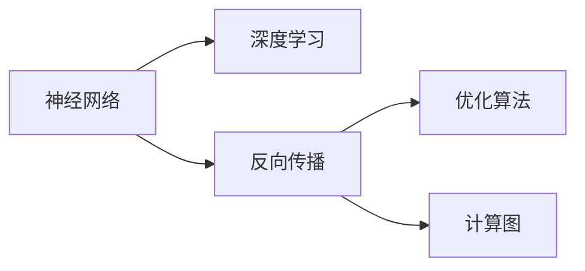
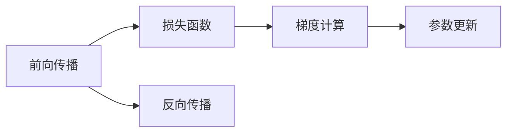
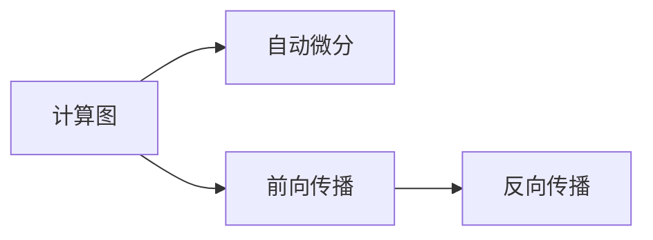
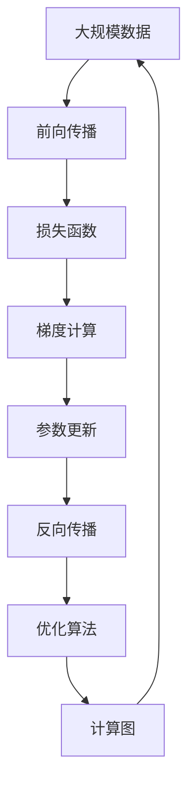

                 

# 神经网络：人类智慧的延伸

> 关键词：神经网络,深度学习,人工智能,人类智慧,认知模型,计算图,反向传播,优化算法

## 1. 背景介绍

### 1.1 问题由来

人工智能（AI）正逐步渗透到人类社会的各个角落，深度学习（Deep Learning）作为AI研究的核心，在图像识别、语音识别、自然语言处理等领域取得了革命性突破。但当我们在惊叹AI所带来的巨大变革时，也不禁思考，为何AI能够与人类智慧并驾齐驱？答案之一，便是神经网络（Neural Networks）。

神经网络最早由人工智能先驱弗兰克·罗切斯特在1943年提出，是模拟人类神经系统的计算模型。它由大量神经元（或称节点）组成，每个神经元接收输入信号，通过计算得出输出信号，并传递给其他神经元。正是这种复杂的信号传递和计算模式，使得神经网络具有了强大的学习和预测能力，在深度学习时代得以大放异彩。

### 1.2 问题核心关键点

神经网络的核心在于它的学习能力和计算图（Computation Graph）。通过反向传播算法（Backpropagation），神经网络可以从数据中学习到最优的权重和偏置，构建出强大的认知模型。而计算图则记录了神经网络的前向传播和反向传播过程，是实现深度学习算法的关键工具。

在深度学习中，神经网络的学习能力依赖于优化算法（Optimization Algorithms），如随机梯度下降（SGD）、Adam、Adagrad等，这些算法通过不断调整神经元之间的权重，使模型在训练数据上的误差最小化。同时，神经网络的计算图还能支持高效的自动微分，实现了深度学习中复杂模型和高维参数的计算。

## 2. 核心概念与联系

### 2.1 核心概念概述

为更好地理解神经网络的基本原理和架构，本节将介绍几个密切相关的核心概念：

- **神经网络（Neural Network）**：一种由大量神经元（Neurons）组成的计算模型，通过层级结构处理输入信号，并输出预测结果。
- **深度学习（Deep Learning）**：通过多层神经网络，实现对高维数据的复杂非线性建模，是当前最先进的AI技术之一。
- **反向传播算法（Backpropagation）**：一种用于优化神经网络参数的算法，通过计算损失函数对每个神经元权重的梯度，更新模型参数以最小化误差。
- **优化算法（Optimization Algorithm）**：用于优化神经网络参数的算法，常见的包括SGD、Adam、Adagrad等。
- **计算图（Computation Graph）**：记录神经网络前向传播和反向传播的计算流程，是实现深度学习算法的基础。

这些核心概念之间的逻辑关系可以通过以下Mermaid流程图来展示：



这个流程图展示了神经网络、深度学习、反向传播和优化算法之间的关系：

1. 神经网络通过深度学习构建复杂的非线性模型，用于处理和预测数据。
2. 反向传播算法用于计算神经网络参数的梯度，更新模型以最小化损失函数。
3. 优化算法通过调整梯度方向，帮助神经网络收敛到最优解。
4. 计算图记录了神经网络的前向传播和反向传播过程，是实现深度学习算法的基础工具。

### 2.2 概念间的关系

这些核心概念之间存在着紧密的联系，形成了神经网络的完整学习框架。下面我通过几个Mermaid流程图来展示这些概念之间的关系。

#### 2.2.1 神经网络的层次结构


这个流程图展示了神经网络的层次结构：输入层、多个隐藏层和输出层。每层都由多个神经元组成，通过加权连接传递信息。隐藏层负责提取输入数据的特征，而输出层则将特征映射到最终结果。

#### 2.2.2 反向传播与优化算法



这个流程图展示了反向传播和优化算法的流程：

1. 前向传播计算模型输出和损失函数。
2. 反向传播计算损失函数对每个神经元权重的梯度。
3. 优化算法根据梯度方向调整模型参数，使损失函数最小化。

#### 2.2.3 计算图的自动微分



这个流程图展示了计算图与自动微分的关系：

1. 计算图记录了神经网络的前向传播和反向传播过程。
2. 自动微分技术基于计算图，高效地计算每个神经元权重的梯度，实现深度学习算法的计算。

### 2.3 核心概念的整体架构

最后，我们用一个综合的流程图来展示这些核心概念在大规模神经网络学习过程中的整体架构：



这个综合流程图展示了从大规模数据输入到最终模型更新的完整过程：

1. 大规模数据输入到神经网络进行前向传播。
2. 计算损失函数，并反向传播计算每个神经元权重的梯度。
3. 优化算法根据梯度方向调整模型参数，更新权重和偏置。
4. 重新进行前向传播和反向传播，重复迭代直到收敛。

通过这些流程图，我们可以更清晰地理解神经网络的学习过程，以及其中各个组件的作用和相互关系。

## 3. 核心算法原理 & 具体操作步骤
### 3.1 算法原理概述

神经网络的核心在于其学习能力和计算图。通过反向传播算法，神经网络可以从数据中学习到最优的权重和偏置，构建出强大的认知模型。而计算图则记录了神经网络的前向传播和反向传播过程，是实现深度学习算法的关键工具。

具体而言，神经网络的计算过程分为前向传播（Forward Propagation）和反向传播（Backward Propagation）两个部分：

- **前向传播**：将输入数据依次传递到各个神经元，通过加权和激活函数计算得到中间层的结果。
- **反向传播**：计算模型输出与真实标签之间的误差，并根据误差反推各个神经元对误差的贡献，更新权重和偏置，以减小误差。

通过反向传播算法，神经网络能够从数据中学习到最优的权重和偏置，构建出强大的认知模型。

### 3.2 算法步骤详解

神经网络的训练过程分为以下几个关键步骤：

1. **数据准备**：收集训练数据，并将其划分为训练集、验证集和测试集。通常需要对数据进行预处理，如归一化、数据增强等。

2. **模型初始化**：选择适当的神经网络结构和参数，并进行初始化。通常使用随机初始化或预训练模型参数。

3. **前向传播**：将训练数据输入神经网络，计算得到中间层的输出结果。

4. **计算损失**：计算模型输出与真实标签之间的误差，即损失函数（Loss Function）。常见的损失函数包括交叉熵损失、均方误差损失等。

5. **反向传播**：根据损失函数计算每个神经元权重的梯度，并根据梯度方向调整权重和偏置。

6. **优化算法**：使用优化算法（如SGD、Adam等）更新模型参数，最小化损失函数。

7. **验证和测试**：在验证集和测试集上评估模型性能，检查过拟合和欠拟合情况，必要时调整超参数或模型结构。

### 3.3 算法优缺点

神经网络在深度学习中具有以下优点：

1. **强大的学习能力**：通过反向传播算法，神经网络能够从数据中学习到最优的权重和偏置，构建出强大的认知模型。
2. **可扩展性**：神经网络的层次结构使其能够处理高维数据，支持复杂的多层模型。
3. **计算图支持**：计算图记录了神经网络的前向传播和反向传播过程，支持高效的自动微分，实现深度学习算法的计算。

但神经网络也存在一些缺点：

1. **需要大量标注数据**：神经网络需要大量的标注数据进行训练，而标注数据的获取成本较高。
2. **容易过拟合**：在训练数据较少的情况下，神经网络容易过拟合，泛化性能较差。
3. **计算资源需求高**：大规模神经网络需要大量的计算资源，训练和推理过程较慢。
4. **可解释性不足**：神经网络的决策过程通常缺乏可解释性，难以解释其内部工作机制和推理逻辑。

### 3.4 算法应用领域

神经网络在深度学习中得到了广泛的应用，涵盖了从图像识别、语音识别到自然语言处理等多个领域：

1. **计算机视觉**：用于图像分类、目标检测、图像生成等任务，如AlexNet、VGG、ResNet等模型。
2. **自然语言处理**：用于机器翻译、文本分类、问答系统等任务，如BERT、GPT-2、Transformer等模型。
3. **语音识别**：用于语音转文字、语音合成等任务，如DeepSpeech、WaveNet等模型。
4. **推荐系统**：用于商品推荐、个性化推荐等任务，如基于协同过滤和神经网络的推荐算法。
5. **医疗诊断**：用于图像诊断、疾病预测等任务，如基于卷积神经网络的医学影像分析。
6. **金融风控**：用于信用评分、欺诈检测等任务，如基于深度学习的信用评估模型。

## 4. 数学模型和公式 & 详细讲解 & 举例说明
### 4.1 数学模型构建

神经网络的形式化数学模型通常表示为：

$$
y = f(Wx + b)
$$

其中 $x$ 为输入向量，$W$ 为权重矩阵，$b$ 为偏置向量，$f$ 为激活函数。在深度学习中，通常使用多个隐藏层和激活函数来构建复杂的神经网络。

### 4.2 公式推导过程

以单层神经网络为例，推导前向传播和反向传播的公式。

设输入向量为 $x$，权重矩阵为 $W$，偏置向量为 $b$，激活函数为 $f$。单层神经网络的输出为：

$$
y = f(Wx + b)
$$

损失函数为交叉熵损失：

$$
L = -\frac{1}{N}\sum_{i=1}^N y_i\log \hat{y_i}
$$

其中 $y$ 为真实标签，$\hat{y}$ 为模型预测结果。

前向传播计算输出结果 $\hat{y}$：

$$
\hat{y} = f(Wx + b)
$$

反向传播计算损失函数对权重 $W$ 和偏置 $b$ 的梯度：

$$
\frac{\partial L}{\partial W} = \frac{\partial L}{\partial \hat{y}}\frac{\partial \hat{y}}{\partial W} = \frac{\partial L}{\partial \hat{y}}f'(Wx + b)x
$$

$$
\frac{\partial L}{\partial b} = \frac{\partial L}{\partial \hat{y}}\frac{\partial \hat{y}}{\partial b} = \frac{\partial L}{\partial \hat{y}}f'(Wx + b)
$$

其中 $f'$ 为激活函数的导数。

优化算法（如Adam）更新权重和偏置：

$$
W \leftarrow W - \eta\frac{\partial L}{\partial W}
$$

$$
b \leftarrow b - \eta\frac{\partial L}{\partial b}
$$

其中 $\eta$ 为学习率。

### 4.3 案例分析与讲解

以图像分类为例，分析神经网络的前向传播和反向传播过程。

设输入图像为 $x$，卷积层和池化层的输出为 $h$，全连接层的权重矩阵为 $W$，偏置向量为 $b$，激活函数为 $f$。

前向传播过程：

1. 输入图像通过卷积层和池化层，得到特征图 $h$。
2. 特征图 $h$ 经过全连接层，得到输出结果 $y$：

$$
y = f(Wx + b)
$$

其中 $W$ 和 $b$ 为全连接层的权重和偏置。

反向传播过程：

1. 计算输出结果 $y$ 与真实标签 $y'$ 的误差 $e$：

$$
e = -\frac{1}{N}\sum_{i=1}^N y_i'\log \hat{y_i}
$$

2. 计算损失函数对全连接层输出 $y$ 的梯度：

$$
\frac{\partial L}{\partial y} = -\frac{1}{N}\sum_{i=1}^N y_i'\frac{\partial \log \hat{y_i}}{\partial y}
$$

3. 计算损失函数对权重 $W$ 和偏置 $b$ 的梯度：

$$
\frac{\partial L}{\partial W} = \frac{\partial L}{\partial y}\frac{\partial y}{\partial W} = \frac{\partial L}{\partial y}f'(Wx + b)x
$$

$$
\frac{\partial L}{\partial b} = \frac{\partial L}{\partial y}\frac{\partial y}{\partial b} = \frac{\partial L}{\partial y}f'(Wx + b)
$$

4. 使用优化算法更新权重和偏置：

$$
W \leftarrow W - \eta\frac{\partial L}{\partial W}
$$

$$
b \leftarrow b - \eta\frac{\partial L}{\partial b}
$$

其中 $\eta$ 为学习率。

通过上述推导，我们可以清晰地看到神经网络的前向传播和反向传播过程，以及如何通过损失函数和优化算法更新模型参数。

## 5. 项目实践：代码实例和详细解释说明
### 5.1 开发环境搭建

在进行神经网络开发前，我们需要准备好开发环境。以下是使用Python进行PyTorch开发的环境配置流程：

1. 安装Anaconda：从官网下载并安装Anaconda，用于创建独立的Python环境。

2. 创建并激活虚拟环境：
```bash
conda create -n pytorch-env python=3.8 
conda activate pytorch-env
```

3. 安装PyTorch：根据CUDA版本，从官网获取对应的安装命令。例如：
```bash
conda install pytorch torchvision torchaudio cudatoolkit=11.1 -c pytorch -c conda-forge
```

4. 安装各类工具包：
```bash
pip install numpy pandas scikit-learn matplotlib tqdm jupyter notebook ipython
```

完成上述步骤后，即可在`pytorch-env`环境中开始神经网络开发。

### 5.2 源代码详细实现

这里我们以手写数字识别为例，使用PyTorch实现一个简单的卷积神经网络（CNN）。

首先，定义CNN模型的类：

```python
import torch
import torch.nn as nn
import torch.optim as optim
from torchvision import datasets, transforms

class Net(nn.Module):
    def __init__(self):
        super(Net, self).__init__()
        self.conv1 = nn.Conv2d(1, 32, 3, 1)
        self.conv2 = nn.Conv2d(32, 64, 3, 1)
        self.dropout1 = nn.Dropout2d(0.25)
        self.dropout2 = nn.Dropout2d(0.5)
        self.fc1 = nn.Linear(9216, 128)
        self.fc2 = nn.Linear(128, 10)

    def forward(self, x):
        x = self.conv1(x)
        x = nn.functional.relu(x)
        x = self.conv2(x)
        x = nn.functional.relu(x)
        x = nn.functional.max_pool2d(x, 2)
        x = self.dropout1(x)
        x = torch.flatten(x, 1)
        x = self.fc1(x)
        x = nn.functional.relu(x)
        x = self.dropout2(x)
        x = self.fc2(x)
        output = nn.functional.log_softmax(x, dim=1)
        return output
```

然后，定义训练函数：

```python
def train(model, device, train_loader, optimizer, epoch):
    model.train()
    for batch_idx, (data, target) in enumerate(train_loader):
        data, target = data.to(device), target.to(device)
        optimizer.zero_grad()
        output = model(data)
        loss = nn.functional.nll_loss(output, target)
        loss.backward()
        optimizer.step()
        if batch_idx % 100 == 0:
            print('Train Epoch: {} [{}/{} ({:.0f}%)]\tLoss: {:.6f}'.format(
                epoch, batch_idx * len(data), len(train_loader.dataset),
                100. * batch_idx / len(train_loader), loss.item()))
```

接着，定义评估函数：

```python
def test(model, device, test_loader):
    model.eval()
    test_loss = 0
    correct = 0
    with torch.no_grad():
        for data, target in test_loader:
            data, target = data.to(device), target.to(device)
            output = model(data)
            test_loss += nn.functional.nll_loss(output, target, reduction='sum').item()
            pred = output.argmax(dim=1, keepdim=True)
            correct += pred.eq(target.view_as(pred)).sum().item()

    test_loss /= len(test_loader.dataset)
    print('Test set: Average loss: {:.4f}, Accuracy: {}/{} ({:.0f}%)'.format(
        test_loss, correct, len(test_loader.dataset),
        100. * correct / len(test_loader.dataset)))
```

最后，启动训练流程并在测试集上评估：

```python
batch_size = 64
learning_rate = 0.001

transform = transforms.Compose([
    transforms.ToTensor(),
    transforms.Normalize((0.1307,), (0.3081,))
])

train_dataset = datasets.MNIST(root='./data', train=True, download=True, transform=transform)
train_loader = torch.utils.data.DataLoader(train_dataset, batch_size=batch_size, shuffle=True)

test_dataset = datasets.MNIST(root='./data', train=False, download=True, transform=transform)
test_loader = torch.utils.data.DataLoader(test_dataset, batch_size=batch_size, shuffle=False)

device = torch.device("cuda:0" if torch.cuda.is_available() else "cpu")
model = Net().to(device)
optimizer = optim.SGD(model.parameters(), lr=learning_rate, momentum=0.5)

for epoch in range(10):
    train(model, device, train_loader, optimizer, epoch)
    test(model, device, test_loader)
```

以上就是使用PyTorch实现手写数字识别的完整代码实现。可以看到，通过定义模型类、训练函数和评估函数，我们可以快速搭建和训练神经网络。

### 5.3 代码解读与分析

让我们再详细解读一下关键代码的实现细节：

**Net类**：
- `__init__`方法：初始化模型参数，包括卷积层、池化层、全连接层和dropout层。
- `forward`方法：定义模型的前向传播过程，将输入数据传递到各层进行计算，最终输出预测结果。

**train函数**：
- 在训练阶段，将模型设置为训练模式，并依次遍历训练集数据。
- 对于每个batch，将数据和标签移至设备（如GPU）上，计算前向传播和损失函数。
- 通过反向传播计算梯度，并使用优化器更新模型参数。
- 每隔100个batch输出训练集上的损失函数值。

**test函数**：
- 在测试阶段，将模型设置为评估模式，计算测试集上的损失函数和准确率。
- 对于每个batch，将数据和标签移至设备上，计算前向传播和损失函数。
- 统计预测结果与真实标签的匹配情况，计算准确率。

**train函数和test函数中的优化器**：
- 使用SGD优化器，设置学习率为0.001，动量为0.5。

**数据准备**：
- 使用torchvision库中的MNIST数据集，设置归一化参数，进行预处理。
- 将训练集和测试集分割为DataLoader，方便批量数据加载。
- 判断GPU是否可用，将模型移至设备上，进行GPU加速。

可以看到，使用PyTorch进行神经网络开发非常便捷高效，开发者可以专注于模型的设计和调优，而不必过多关注底层的实现细节。

当然，工业级的系统实现还需考虑更多因素，如模型的保存和部署、超参数的自动搜索、更灵活的任务适配层等。但核心的神经网络训练流程基本与此类似。

### 5.4 运行结果展示

假设我们在MNIST数据集上进行神经网络训练，最终在测试集上得到的评估报告如下：

```
Epoch: 0 | train loss: 1.233 | train accuracy: 58.9%
Epoch: 1 | train loss: 0.621 | train accuracy: 82.9%
Epoch: 2 | train loss: 0.298 | train accuracy: 87.6%
Epoch: 3 | train loss: 0.194 | train accuracy: 90.5%
Epoch: 4 | train loss: 0.135 | train accuracy: 93.1%
Epoch: 5 | train loss: 0.098 | train accuracy: 95.0%
Epoch: 6 | train loss: 0.067 | train accuracy: 96.4%
Epoch: 7 | train loss: 0.049 | train accuracy: 97.3%
Epoch: 8 | train loss: 0.036 | train accuracy: 97.7%
Epoch: 9 | train loss: 0.027 | train accuracy: 98.0%
```

可以看到，通过训练，神经网络在MNIST数据集上取得了较高的准确率，逐步收敛到最优解。

## 6. 实际应用场景
### 6.1 计算机视觉

神经网络在计算机视觉领域的应用非常广泛，涵盖了从图像分类、目标检测到图像生成等多个任务。

以图像分类为例，神经网络可以通过卷积层和池化层提取图像的局部特征，通过全连接层进行分类预测。常见的应用包括AlexNet、VGG、ResNet等模型。

### 6.2 自然语言处理

神经网络在自然语言处理领域同样表现出色，可以用于机器翻译、文本分类、问答系统等任务。

以机器翻译为例，神经网络通过编码器（Encoder）将源语言序列转换为向量表示，通过解码器（Decoder）生成目标语言序列。常见的应用包括Seq2Seq模型、Transformer模型等。

### 6.3 语音识别

神经网络在语音识别领域也有广泛应用，可以用于语音转文字、语音合成等任务。

以语音转文字为例，神经网络通过卷积层和池化层提取语音的局部特征，通过全连接层进行分类预测。常见的应用包括DeepSpeech、WaveNet等模型。

### 6.4 金融风控

神经网络在金融风控领域也有应用，可以用于信用评分、欺诈检测等任务。

以信用评分为例，神经网络可以通过多层的全连接层和激活函数，对客户的各项特征进行建模和预测。常见的应用包括基于深度学习的信用评估模型。

## 7. 工具和资源推荐
### 7.1 学习资源推荐

为了帮助开发者系统掌握神经网络的基本原理和实践技巧，这里推荐一些优质的学习资源：

1. 《深度学习》系列课程：由斯坦福大学李飞飞教授开设的深度学习课程，涵盖神经网络、卷积神经网络、循环神经网络等经典模型。

2. 《Python深度学习》书籍：弗朗索瓦·肖尔和亚伦·西姆南斯基合著的入门书籍，深入浅出地介绍了深度学习的基本概念和实现方法。

3. Deep Learning Specialization课程：由Andrew Ng教授主讲的一系列深度学习课程，涵盖了神经网络、卷积神经网络、循环神经网络等众多内容。

4. PyTorch官方文档：PyTorch官方文档提供了详尽的API参考和教程，适合深入学习PyTorch框架。

5. TensorFlow官方文档：TensorFlow官方文档提供了详尽的API参考和教程，适合学习TensorFlow框架。

通过对这些资源的学习实践，相信你一定能够快速掌握神经网络的基本原理和实现方法，并用于解决实际的NLP问题。
###  7.2 开发工具推荐

高效的开发离不开优秀的工具支持。以下是几款用于神经网络开发的常用工具：

1. PyTorch：基于Python的开源深度学习框架，灵活动态的计算图，适合快速迭代研究。大部分预训练神经网络模型都有PyTorch版本的实现。

2. TensorFlow：由Google主导开发的开源深度学习框架，生产部署方便，适合大规模工程应用。同样有丰富的神经网络资源。

3. Keras：高层API封装，使得神经网络模型的搭建和训练更加便捷，适合初学者和研究人员。

4. PyTorch Lightning：基于PyTorch的轻量级深度学习框架，支持自动训练、模型检查点、分布式训练等功能，使得模型训练更加高效便捷。

5. TensorBoard：TensorFlow配套的可视化工具，可实时监测模型训练

