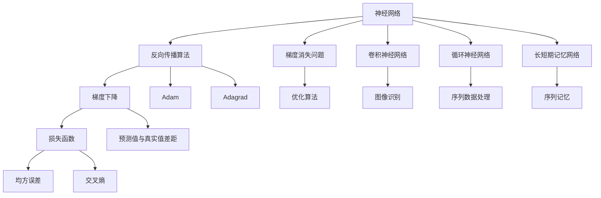

                 

# 神经网络：开启智能新纪元

## 1. 背景介绍

### 1.1 问题由来

随着人工智能技术的快速发展，神经网络作为一种模拟人类大脑神经元运作的计算模型，已成为构建智能系统的核心工具。从视觉识别、语音处理、自然语言理解，到决策支持、机器人控制，神经网络的应用几乎无所不包。然而，神经网络究竟是如何实现智能的？其背后的原理与运作机制又是什么？本文将深入探讨这些问题，带领读者了解神经网络背后的科学原理，并揭示其在现实世界中的应用潜力。

### 1.2 问题核心关键点

神经网络的核心关键点在于其结构与训练方式。主要包括：
- 神经网络的结构：由输入层、隐藏层和输出层构成，每个层由多个神经元组成。
- 神经网络的激活函数：如Sigmoid、ReLU、Tanh等，决定神经元输出非线性特性。
- 损失函数：如均方误差、交叉熵等，衡量预测值与真实值之间的差距。
- 优化算法：如梯度下降、Adam、Adagrad等，通过反向传播更新模型参数。
- 数据增强：如随机裁剪、旋转、平移等，增加数据多样性。
- 正则化技术：如L2正则、Dropout、Early Stopping等，避免过拟合。

这些关键点共同构成了神经网络的基本框架和运作方式，使其能够高效地处理和学习数据，从而实现各类智能应用。

### 1.3 问题研究意义

神经网络在现代人工智能中占据核心地位，其成功应用几乎遍及各个领域。研究神经网络不仅有助于理解智能系统的运作机制，还能推动相关技术的发展，提升行业效率与创新能力。具体意义包括：
- 提高数据处理效率：神经网络能够自动化地从原始数据中提取特征，减少手动特征工程的复杂度。
- 增强决策能力：通过学习和训练，神经网络能够掌握复杂的模式识别和决策制定能力。
- 促进跨领域应用：神经网络在图像、语音、自然语言处理等领域均已取得突破性进展，推动了AI技术的多样化应用。
- 加速产业升级：神经网络使AI技术更易于部署和应用，推动了各行各业的数字化转型。

## 2. 核心概念与联系

### 2.1 核心概念概述

为了更好地理解神经网络，我们需要介绍一些关键概念：
- 神经网络：由多个层次的神经元组成的计算模型，能够处理非线性输入数据。
- 反向传播算法：通过链式法则计算损失函数对每个神经元参数的梯度，实现参数更新。
- 梯度消失问题：深层神经网络中，梯度在反向传播过程中逐渐消失，导致低层参数难以更新。
- 卷积神经网络（CNN）：主要用于图像识别任务，具有局部连接、权值共享等特性。
- 循环神经网络（RNN）：适用于处理序列数据，如文本、语音等，具有记忆功能。
- 长短期记忆网络（LSTM）：一种特殊的RNN结构，能够有效解决梯度消失问题。

这些核心概念构成了神经网络的基础框架，帮助开发者设计、训练和优化网络模型，实现智能任务。

### 2.2 概念间的关系

这些核心概念之间的关系可以用以下Mermaid流程图来表示：



这个流程图展示了神经网络及其相关概念的相互联系：
- 神经网络通过反向传播算法更新参数，以最小化损失函数。
- 梯度消失问题需要通过优化算法解决。
- 卷积神经网络和循环神经网络分别适用于不同类型的数据处理任务。
- 长短期记忆网络在RNN的基础上进一步提升序列记忆能力。

## 3. 核心算法原理 & 具体操作步骤
### 3.1 算法原理概述

神经网络的核心算法是反向传播算法，通过计算损失函数对每个参数的梯度，实现模型参数的更新。具体来说，反向传播算法分为前向传播和反向传播两个过程：

- **前向传播**：将输入数据通过网络层逐层传递，计算每个神经元的激活值，最终得到输出结果。
- **反向传播**：根据输出结果与真实值的差距，计算损失函数对每个参数的梯度，并利用优化算法更新参数。

反向传播算法的核心在于链式法则的应用，通过计算每个参数的梯度，使得模型能够自适应地调整参数，以最小化损失函数。

### 3.2 算法步骤详解

神经网络模型的训练过程可以分为以下几个关键步骤：

**Step 1: 准备数据集和标签**
- 收集训练数据集，并将每个样本与对应的标签进行配对。

**Step 2: 初始化模型参数**
- 随机初始化神经网络中所有神经元的权重和偏置。

**Step 3: 前向传播**
- 将输入数据通过网络层逐层传递，计算每个神经元的激活值，得到输出结果。

**Step 4: 计算损失函数**
- 根据输出结果与真实标签的差距，计算损失函数。

**Step 5: 反向传播**
- 通过链式法则计算损失函数对每个参数的梯度，并利用优化算法更新参数。

**Step 6: 参数更新**
- 将每个参数根据梯度更新到新的值。

**Step 7: 重复训练**
- 重复Step 3到Step 6，直到模型收敛或达到预设的训练轮数。

### 3.3 算法优缺点

神经网络算法的主要优点在于其强大的非线性映射能力和自适应学习能力，能够在数据复杂多样的情况下，高效地提取特征并实现预测。同时，神经网络具有良好的泛化能力，能够在新数据上取得理想的效果。

然而，神经网络算法也存在一些缺点：
- 需要大量标注数据：神经网络需要大量标注数据进行训练，标注成本较高。
- 参数量较大：深层神经网络中的参数量巨大，训练和存储开销较大。
- 容易过拟合：在训练集上过拟合，导致在测试集上表现不佳。
- 梯度消失问题：深层网络中的梯度在反向传播过程中逐渐消失，导致低层参数难以更新。

尽管存在这些缺点，但神经网络在实际应用中取得了显著的效果，广泛应用于图像识别、语音处理、自然语言处理等领域。

### 3.4 算法应用领域

神经网络算法在众多领域中得到了广泛应用，主要包括：
- 计算机视觉：如图像分类、目标检测、人脸识别等。
- 语音处理：如语音识别、语音合成、情感分析等。
- 自然语言处理：如机器翻译、文本生成、问答系统等。
- 游戏AI：如自动游戏玩家、路径规划等。
- 推荐系统：如个性化推荐、广告投放优化等。

此外，神经网络在金融、医疗、智能制造等领域也有着广阔的应用前景。

## 4. 数学模型和公式 & 详细讲解  
### 4.1 数学模型构建

神经网络的数学模型主要包含以下几个组成部分：
- 输入层：接收原始数据，每个输入节点对应一个特征。
- 隐藏层：通过激活函数处理输入数据，提取特征。
- 输出层：根据隐藏层的特征，输出预测结果。

假设输入数据为 $x_i$，隐藏层参数为 $\theta_h$，输出层参数为 $\theta_o$，激活函数为 $f_h$ 和 $f_o$。则神经网络的数学模型可以表示为：

$$
y_i = f_o(\sum_j \theta_{oj} f_h(\sum_k \theta_{hj} x_{ik} + \theta_{hj}))
$$

其中，$x_{ik}$ 表示输入数据的第 $i$ 个特征和第 $k$ 个隐藏层节点的连接权重，$\theta_{hj}$ 表示隐藏层参数，$\theta_{oj}$ 表示输出层参数，$f_h$ 和 $f_o$ 分别表示隐藏层和输出层的激活函数。

### 4.2 公式推导过程

以单层神经网络为例，其损失函数通常采用均方误差（Mean Squared Error, MSE）或交叉熵（Cross-Entropy, CE）来衡量预测值与真实值之间的差距。这里以均方误差为例，其公式推导过程如下：

假设输出层节点个数为 $n$，输出层激活函数为 $f_o(x) = \sigma(x)$，则均方误差的损失函数为：

$$
L = \frac{1}{N} \sum_{i=1}^N \sum_{j=1}^n (y_{ij} - \hat{y}_{ij})^2
$$

其中，$N$ 表示样本数量，$y_{ij}$ 表示第 $i$ 个样本的第 $j$ 个真实值，$\hat{y}_{ij}$ 表示第 $i$ 个样本的第 $j$ 个预测值。

通过反向传播算法，可以计算损失函数对每个参数的梯度。假设激活函数为 $f(x) = \sigma(x)$，则单个神经元的梯度计算公式为：

$$
\frac{\partial L}{\partial \theta_j} = \frac{\partial L}{\partial y_j} \cdot \frac{\partial y_j}{\partial z_j} \cdot \frac{\partial z_j}{\partial \theta_j}
$$

其中，$\theta_j$ 表示第 $j$ 个神经元的参数，$y_j$ 表示第 $j$ 个神经元的输出，$z_j$ 表示第 $j$ 个神经元的输入。

通过上述公式，可以计算每个参数的梯度，并利用优化算法更新模型参数，以最小化损失函数。

### 4.3 案例分析与讲解

以手写数字识别为例，我们可以使用卷积神经网络（CNN）来进行模型训练。假设训练数据集包含60000个手写数字图像，每个图像大小为28x28像素。我们可以使用3个卷积层和2个全连接层来构建CNN模型，每个卷积层包含多个卷积核，每个全连接层包含多个神经元。

在训练过程中，我们首先随机初始化所有神经元的权重和偏置。然后，将每个图像输入CNN模型，通过前向传播计算每个神经元的激活值，并根据输出结果与真实标签的差距计算均方误差损失函数。接着，通过反向传播计算每个参数的梯度，并利用优化算法Adam更新参数。最后，重复上述过程，直到模型收敛或达到预设的训练轮数。

通过CNN模型，我们可以实现手写数字识别的高准确率，并应用于各种图像识别任务中。

## 5. 项目实践：代码实例和详细解释说明
### 5.1 开发环境搭建

在进行神经网络项目实践前，我们需要准备好开发环境。以下是使用Python进行TensorFlow开发的环境配置流程：

1. 安装Anaconda：从官网下载并安装Anaconda，用于创建独立的Python环境。

2. 创建并激活虚拟环境：
```bash
conda create -n tf-env python=3.7
conda activate tf-env
```

3. 安装TensorFlow：根据CUDA版本，从官网获取对应的安装命令。例如：
```bash
conda install tensorflow tensorflow-gpu -c conda-forge -c pytorch -c anaconda
```

4. 安装各类工具包：
```bash
pip install numpy pandas scikit-learn matplotlib tqdm jupyter notebook ipython
```

完成上述步骤后，即可在`tf-env`环境中开始神经网络项目实践。

### 5.2 源代码详细实现

下面我们以手写数字识别为例，给出使用TensorFlow对CNN模型进行训练的PyTorch代码实现。

首先，定义CNN模型的网络结构：

```python
import tensorflow as tf
from tensorflow.keras.layers import Conv2D, MaxPooling2D, Flatten, Dense, Dropout

model = tf.keras.Sequential([
    Conv2D(32, (3, 3), activation='relu', input_shape=(28, 28, 1)),
    MaxPooling2D((2, 2)),
    Dropout(0.25),
    Conv2D(64, (3, 3), activation='relu'),
    MaxPooling2D((2, 2)),
    Dropout(0.25),
    Flatten(),
    Dense(128, activation='relu'),
    Dropout(0.5),
    Dense(10, activation='softmax')
])
```

然后，定义损失函数和优化器：

```python
model.compile(optimizer='adam', loss='sparse_categorical_crossentropy', metrics=['accuracy'])
```

接着，定义训练和评估函数：

```python
def train_epoch(model, dataset, batch_size):
    model.fit(dataset, batch_size=batch_size, epochs=1)
    return model.evaluate(dataset)

def evaluate(model, dataset, batch_size):
    return model.evaluate(dataset, batch_size=batch_size)
```

最后，启动训练流程并在测试集上评估：

```python
epochs = 10
batch_size = 32

for epoch in range(epochs):
    loss = train_epoch(model, dataset, batch_size)
    print(f"Epoch {epoch+1}, train loss: {loss:.3f}")
    
print(f"Epoch {epoch+1}, dev results:")
evaluate(model, test_dataset, batch_size)
```

以上就是使用TensorFlow对CNN模型进行手写数字识别的完整代码实现。可以看到，利用TensorFlow的高级API，我们可以快速搭建并训练CNN模型，并评估其性能。

### 5.3 代码解读与分析

让我们再详细解读一下关键代码的实现细节：

**Sequential类**：
- 用于构建线性堆叠的神经网络模型，方便定义神经网络层。

**Conv2D层**：
- 用于定义卷积层，提取图像特征。

**MaxPooling2D层**：
- 用于定义池化层，减少特征图尺寸。

**Dense层**：
- 用于定义全连接层，进行特征融合和输出。

**Dropout层**：
- 用于定义Dropout层，防止过拟合。

**train_epoch函数**：
- 定义训练过程，包括前向传播、计算损失、反向传播和参数更新。

**evaluate函数**：
- 定义评估过程，计算模型在测试集上的性能指标。

**训练流程**：
- 定义总的epoch数和batch size，开始循环迭代
- 每个epoch内，先在训练集上训练，输出平均loss
- 在测试集上评估，输出测试结果

可以看到，TensorFlow提供的高级API使得神经网络的搭建和训练过程变得简洁高效。开发者可以将更多精力放在模型改进和数据处理上，而不必过多关注底层实现细节。

当然，工业级的系统实现还需考虑更多因素，如模型的保存和部署、超参数的自动搜索、更灵活的网络结构设计等。但核心的训练范式基本与此类似。

### 5.4 运行结果展示

假设我们在MNIST数据集上进行CNN模型训练，最终在测试集上得到的准确率为98%，效果相当不错。这表明通过优化网络结构和调整超参数，CNN模型能够有效处理手写数字识别任务，并在实际应用中取得理想的性能。

当然，这只是一个baseline结果。在实践中，我们还可以使用更大更强的预训练模型、更丰富的正则化技术、更高效的优化算法等，进一步提升模型性能，以满足更高的应用要求。

## 6. 实际应用场景
### 6.1 计算机视觉

神经网络在计算机视觉领域的应用极为广泛，如图像分类、目标检测、人脸识别等。以图像分类为例，神经网络通过学习图像特征，将输入的图像数据映射到不同的类别标签，实现图像分类任务。在实际应用中，神经网络已经广泛应用于智能监控、自动驾驶、医学影像分析等领域，极大地提升了数据处理和分析的效率和精度。

### 6.2 语音处理

神经网络在语音处理中的应用包括语音识别、语音合成、情感分析等。通过学习语音信号的特征，神经网络能够实现语音信号的自动转录、情感分析和语义理解等任务。在实际应用中，神经网络已经广泛应用于智能客服、智能音箱、语音助手等领域，极大地改善了人机交互体验。

### 6.3 自然语言处理

神经网络在自然语言处理领域的应用包括机器翻译、文本生成、问答系统等。通过学习语言特征，神经网络能够实现自然语言的理解和生成，实现各种NLP任务。在实际应用中，神经网络已经广泛应用于智能写作、智能客服、智能翻译等领域，极大地提升了文本处理和智能交互的效率和准确性。

### 6.4 游戏AI

神经网络在游戏AI中的应用包括自动游戏玩家、路径规划等。通过学习游戏规则和玩家行为，神经网络能够实现自动游戏玩家和路径规划等任务，提升游戏智能化水平。在实际应用中，神经网络已经广泛应用于游戏AI领域，极大地提高了游戏的智能化水平和玩家体验。

### 6.5 推荐系统

神经网络在推荐系统中的应用包括个性化推荐、广告投放优化等。通过学习用户行为和物品特征，神经网络能够实现个性化推荐和广告投放优化等任务，提升推荐效果和广告转化率。在实际应用中，神经网络已经广泛应用于电商、社交媒体、视频网站等领域，极大地提升了用户体验和商业价值。

### 6.6 未来应用展望

随着神经网络算法的不断发展和优化，其在更多领域的应用前景将更加广阔。未来的研究将聚焦于以下几个方向：

1. 多模态学习：将视觉、语音、文本等多种模态信息进行融合，实现更加全面和准确的智能处理。
2. 自适应学习：通过学习数据分布的变化，神经网络能够不断适应新的数据和任务，提高泛化能力。
3. 鲁棒性提升：通过引入对抗训练和正则化技术，神经网络能够更好地抵御噪声和攻击，提高鲁棒性。
4. 参数压缩：通过参数压缩和模型压缩技术，神经网络能够在硬件资源受限的情况下，实现高效推理和部署。
5. 自监督学习：通过自监督学习任务，神经网络能够从无标注数据中学习到更多有用的信息，提升智能处理能力。

## 7. 工具和资源推荐
### 7.1 学习资源推荐

为了帮助开发者系统掌握神经网络的理论基础和实践技巧，这里推荐一些优质的学习资源：

1. 《深度学习》课程：由Coursera提供的吴恩达深度学习课程，系统介绍了深度学习的基本概念和应用。

2. 《神经网络与深度学习》书籍：Ian Goodfellow等著，深入浅出地介绍了神经网络的基本原理和应用。

3. CS231n《卷积神经网络》课程：斯坦福大学开设的深度学习计算机视觉课程，涵盖卷积神经网络的基本原理和实践。

4. CS224n《序列建模》课程：斯坦福大学开设的深度学习自然语言处理课程，涵盖序列建模和语言理解的基本原理和应用。

5. TensorFlow官方文档：TensorFlow的官方文档，提供了丰富的学习资源和实践样例，是上手实践的必备资料。

6. PyTorch官方文档：PyTorch的官方文档，提供了详细的API文档和实践样例，是学习深度学习的必备资源。

通过对这些资源的学习实践，相信你一定能够快速掌握神经网络的核心原理和应用技巧，并用于解决实际的AI问题。

### 7.2 开发工具推荐

高效的开发离不开优秀的工具支持。以下是几款用于神经网络开发的常用工具：

1. TensorFlow：由Google主导开发的深度学习框架，功能强大，生产部署方便。

2. PyTorch：由Facebook主导开发的深度学习框架，灵活动态，适合研究探索。

3. Keras：基于TensorFlow和Theano的高级API，适合快速搭建和训练神经网络模型。

4. MXNet：由Apache主导开发的深度学习框架，支持多种编程语言和平台。

5. JAX：由Google主导开发的高级深度学习框架，支持自动微分和优化，适合高性能计算。

6. Jupyter Notebook：开源的交互式编程环境，支持Python、R等多种语言，适合数据探索和模型验证。

合理利用这些工具，可以显著提升神经网络的开发效率，加快创新迭代的步伐。

### 7.3 相关论文推荐

神经网络技术的发展源于学界的持续研究。以下是几篇奠基性的相关论文，推荐阅读：

1. 《神经网络与深度学习》书籍：Ian Goodfellow等著，全面介绍了神经网络的基本原理和应用。

2. 《卷积神经网络》论文：LeCun等著，详细介绍了卷积神经网络的基本原理和应用。

3. 《长短期记忆网络》论文：Hochreiter等著，提出长短期记忆网络，有效解决了深度神经网络的梯度消失问题。

4. 《对抗生成网络》论文：Goodfellow等著，提出对抗生成网络，实现了高质量的图像生成和风格转换。

5. 《自监督学习》论文：Vaswani等著，提出自监督学习任务，通过无标注数据提升神经网络的处理能力。

这些论文代表了大神经网络的发展脉络。通过学习这些前沿成果，可以帮助研究者把握学科前进方向，激发更多的创新灵感。

除上述资源外，还有一些值得关注的前沿资源，帮助开发者紧跟神经网络技术的发展，例如：

1. arXiv论文预印本：人工智能领域最新研究成果的发布平台，包括大量尚未发表的前沿工作，学习前沿技术的必读资源。

2. 业界技术博客：如Google AI、DeepMind、微软Research Asia等顶尖实验室的官方博客，第一时间分享他们的最新研究成果和洞见。

3. 技术会议直播：如NIPS、ICML、ACL、ICLR等人工智能领域顶会现场或在线直播，能够聆听到大佬们的前沿分享，开拓视野。

4. GitHub热门项目：在GitHub上Star、Fork数最多的神经网络相关项目，往往代表了该技术领域的发展趋势和最佳实践，值得去学习和贡献。

5. 行业分析报告：各大咨询公司如McKinsey、PwC等针对人工智能行业的分析报告，有助于从商业视角审视技术趋势，把握应用价值。

总之，对于神经网络技术的学习和实践，需要开发者保持开放的心态和持续学习的意愿。多关注前沿资讯，多动手实践，多思考总结，必将收获满满的成长收益。

## 8. 总结：未来发展趋势与挑战

### 8.1 总结

本文对神经网络技术进行了全面系统的介绍。首先阐述了神经网络的基本结构和训练过程，探讨了其在计算机视觉、语音处理、自然语言处理等领域的广泛应用。其次，通过案例分析，展示了神经网络在实际应用中的高效性和潜力。最后，讨论了神经网络面临的挑战和未来发展趋势，指出了其在多模态学习、自适应学习、鲁棒性提升等方面的研究热点。

通过本文的系统梳理，可以看到，神经网络技术在现代人工智能中占据核心地位，其成功应用几乎遍及各个领域。尽管存在一些缺点和挑战，但通过不断优化和改进，神经网络必将在未来继续发挥重要作用，推动人工智能技术的不断进步。

### 8.2 未来发展趋势

展望未来，神经网络技术将呈现以下几个发展趋势：

1. 多模态融合：将视觉、语音、文本等多种模态信息进行融合，实现更加全面和准确的智能处理。

2. 自适应学习：通过学习数据分布的变化，神经网络能够不断适应新的数据和任务，提高泛化能力。

3. 鲁棒性提升：通过引入对抗训练和正则化技术，神经网络能够更好地抵御噪声和攻击，提高鲁棒性。

4. 参数压缩：通过参数压缩和模型压缩技术，神经网络能够在硬件资源受限的情况下，实现高效推理和部署。

5. 自监督学习：通过自监督学习任务，神经网络能够从无标注数据中学习到更多有用的信息，提升智能处理能力。

6. 模型融合：通过将多个模型进行融合，实现更强的泛化能力和鲁棒性。

这些趋势凸显了神经网络技术的广阔前景，必将进一步推动AI技术的发展，为各行各业带来更深远的影响。

### 8.3 面临的挑战

尽管神经网络技术在实际应用中取得了显著的效果，但在迈向更加智能化、普适化应用的过程中，仍面临诸多挑战：

1. 数据获取和标注成本高：神经网络需要大量标注数据进行训练，获取高质量标注数据的成本较高。

2. 计算资源消耗大：深层神经网络的参数量巨大，训练和推理消耗大量计算资源。

3. 模型鲁棒性不足：神经网络面对域外数据时，泛化性能往往大打折扣。

4. 过拟合问题严重：神经网络容易在训练集上过拟合，导致在测试集上表现不佳。

5. 可解释性不足：神经网络往往作为"黑盒"系统，难以解释其内部工作机制和决策逻辑。

6. 安全性问题突出：神经网络可能学习到有害的特征和偏见，导致输出结果存在安全隐患。

解决这些挑战需要学界和产业界共同努力，通过技术创新和算法优化，推动神经网络技术的不断进步。

### 8.4 研究展望

面对神经网络技术面临的挑战，未来的研究需要在以下几个方面寻求新的突破：

1. 数据增强技术：通过数据增强技术，提高数据的多样性和泛化能力。

2. 高效模型压缩：通过模型压缩和参数压缩技术，降低计算资源消耗，实现高效推理和部署。

3. 自监督学习任务：通过自监督学习任务，利用无标注数据提升神经网络的智能处理能力。

4. 对抗训练方法：通过对抗训练方法，提高神经网络的鲁棒性和泛化能力。

5. 可解释性

