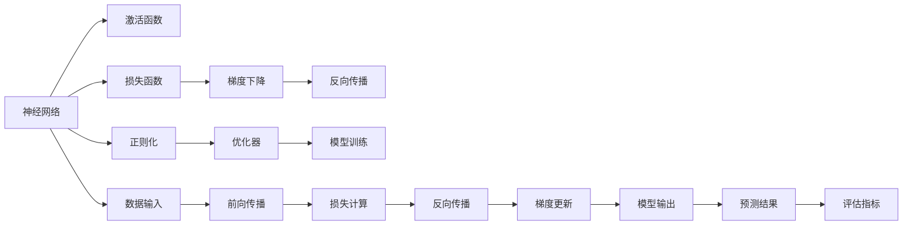

                 

# 神经网络：探索未知的领域

在科技飞速发展的今天，人工智能(AI)已经成为推动社会发展的重要力量。而神经网络作为人工智能的核心技术之一，其原理、应用和发展趋势一直是科技界和公众热议的话题。本文将深入探讨神经网络的内在机制、关键算法以及实际应用场景，并展望其未来发展方向。通过了解神经网络的原理和应用，我们希望能够引导读者更好地理解这一前沿技术，并探索其未知的领域。

## 1. 背景介绍

### 1.1 问题由来

神经网络，最初是生物学家们基于对人类大脑的研究而提出的。在深度学习领域，这一概念被进一步发展，形成了用于处理大规模数据和复杂任务的机器学习模型。今天，神经网络已经被广泛应用于图像识别、自然语言处理、语音识别、推荐系统、自动驾驶等多个领域，极大地推动了科技和社会的进步。

然而，尽管神经网络在众多领域都取得了显著成果，但其背后的原理和算法仍存在诸多未知和挑战。特别是在深度学习模型日益庞大和复杂的今天，如何更高效、更准确地构建和优化神经网络，成为了研究者和工程师们共同面对的问题。

### 1.2 问题核心关键点

神经网络的核心问题可以归纳为以下几点：

- **模型选择**：选择合适的神经网络结构（如全连接网络、卷积神经网络CNN、循环神经网络RNN、变分自编码器VAE等），以适应不同类型的数据和任务。
- **参数优化**：使用合适的优化算法（如随机梯度下降SGD、Adam、Adagrad等），在有限的标注数据下找到最优模型参数。
- **正则化与泛化**：通过正则化（如L2正则、Dropout、数据增强等）和泛化技术（如过拟合检测、模型集成等），避免模型在训练集上过拟合，同时提高其在测试集上的泛化能力。
- **迁移学习**：利用在大规模数据上预训练的神经网络，通过迁移学习在特定任务上进行微调，提高模型效果。
- **模型可解释性**：开发可解释性强的模型，提高模型决策过程的可理解性，帮助用户信任和接受AI模型。

### 1.3 问题研究意义

理解神经网络的原理和应用，对于推动AI技术的进步和应用有着重要意义：

- **提升AI性能**：掌握神经网络的构建和优化方法，可以显著提升AI模型在各种任务上的性能，提高决策的准确性和效率。
- **促进产业升级**：神经网络在智能制造、智慧医疗、智能交通等领域的应用，有助于推动传统行业的数字化转型和智能化升级。
- **加速技术创新**：神经网络技术的不断发展和完善，催生了深度学习、强化学习、迁移学习等前沿研究方向，推动了整个AI领域的进步。
- **拓展应用边界**：通过神经网络，AI技术可以应用于更多未知领域，如自动驾驶、智能家居、智能安防等，为人类的生产和生活方式带来革命性变化。

## 2. 核心概念与联系

### 2.1 核心概念概述

为了更好地理解神经网络的原理和应用，本节将介绍几个密切相关的核心概念：

- **神经网络(Neural Network, NN)**：由多个层次构成的计算模型，通过逐层处理输入数据，最终输出预测结果。
- **激活函数(Activation Function)**：神经网络中用于引入非线性变换的函数，如Sigmoid、ReLU、Tanh等。
- **损失函数(Loss Function)**：用于衡量模型预测与真实标签之间差异的函数，如均方误差MSE、交叉熵CE等。
- **正则化(Regularization)**：通过添加惩罚项来约束模型的复杂度，防止过拟合的技术，如L2正则、Dropout、正则项等。
- **梯度下降(Gradient Descent)**：优化算法，通过反向传播计算梯度，逐步调整模型参数，使损失函数最小化。
- **反向传播(Backpropagation)**：一种高效计算梯度的方法，通过链式法则递归计算每层的梯度，实现端到端的训练。

### 2.2 概念间的关系

这些核心概念之间的逻辑关系可以通过以下Mermaid流程图来展示：



这个流程图展示了神经网络的基本构成和训练过程。其中，神经网络接收输入数据，经过多层次的计算和激活函数引入非线性变换，最终输出预测结果。在训练过程中，通过损失函数衡量预测结果与真实标签之间的差异，使用梯度下降和反向传播算法计算梯度并更新参数，并加入正则化约束避免过拟合。优化器负责选择合适的更新策略，整个训练过程在数据输入和模型输出之间循环迭代。

### 2.3 核心概念的整体架构

最后，我们用一个综合的流程图来展示这些核心概念在大规模数据上的应用：


这个流程图展示了从数据预处理到模型应用的全过程。神经网络模型在大规模数据上预训练，然后通过微调优化适应特定任务。评估模型在测试集上的表现，并最终将模型应用于实际应用场景中，输出预测结果。这一过程不断迭代优化，以提升模型的性能和泛化能力。

## 3. 核心算法原理 & 具体操作步骤
### 3.1 算法原理概述

神经网络的基本原理是模拟人脑神经元之间的连接关系，通过层级结构对输入数据进行处理，最终输出预测结果。其核心思想是通过多层线性变换和非线性激活函数的组合，实现对复杂非线性关系的拟合。

神经网络的训练过程可以分为两个主要步骤：前向传播和反向传播。在前向传播中，输入数据依次通过每一层的加权求和和激活函数计算，得到每一层的输出结果。在反向传播中，通过计算预测结果与真实标签之间的差异，利用链式法则计算每层的梯度，最终更新模型参数，使损失函数最小化。

### 3.2 算法步骤详解

神经网络的训练步骤如下：

1. **数据预处理**：将原始数据进行标准化、归一化、特征工程等处理，转化为模型可以处理的格式。
2. **模型初始化**：设置模型结构（层数、节点数、激活函数等）和初始权重。
3. **前向传播**：将输入数据依次通过每一层进行计算，得到预测结果。
4. **损失计算**：通过损失函数计算预测结果与真实标签之间的差异。
5. **反向传播**：利用链式法则计算每层的梯度，反向传播更新参数。
6. **正则化**：加入正则项，避免过拟合。
7. **参数更新**：使用优化器调整模型参数，使损失函数最小化。
8. **模型评估**：在测试集上评估模型性能，如准确率、召回率、F1分数等。

### 3.3 算法优缺点

神经网络的优势在于其强大的拟合能力，能够处理各种类型的数据，并且在深度学习模型中已经取得了诸多突破。然而，神经网络也存在一些缺点：

**优点**：

- **拟合能力强**：能够处理复杂的非线性关系，适用于各种类型的数据。
- **自适应能力强**：能够自动提取数据中的特征，适应数据分布的变化。
- **可扩展性强**：通过增加网络深度和节点数，可以提升模型的性能和泛化能力。

**缺点**：

- **计算资源消耗大**：需要大量的计算资源进行模型训练和推理，对硬件要求较高。
- **过拟合风险高**：需要正则化等技术防止过拟合，模型泛化能力仍需进一步提升。
- **可解释性不足**：深度学习模型的黑盒特性使得其决策过程难以解释，用户难以信任和接受。

### 3.4 算法应用领域

神经网络在各个领域都有广泛的应用，以下是几个典型应用领域：

- **计算机视觉**：图像分类、目标检测、人脸识别等。神经网络能够自动提取图像特征，实现高精度的视觉识别。
- **自然语言处理**：机器翻译、情感分析、命名实体识别等。通过自然语言处理，神经网络能够理解和生成自然语言，实现人机交互。
- **语音识别**：语音转文本、语音情感识别等。神经网络能够处理时序数据，实现高准确率的语音识别。
- **推荐系统**：商品推荐、内容推荐等。通过神经网络对用户行为和物品特征进行建模，提升推荐系统的精准度和用户体验。
- **自动驾驶**：环境感知、路径规划、控制决策等。神经网络能够处理传感器数据，实现智能驾驶。

## 4. 数学模型和公式 & 详细讲解 & 举例说明

### 4.1 数学模型构建

神经网络可以用以下数学公式进行表示：

$$
\begin{aligned}
&y=\sigma(W_{l}x+b_{l}) \\
&y=\sigma(W_{l-1}y_{l-1}+b_{l-1})
\end{aligned}
$$

其中 $y$ 为输出结果，$x$ 为输入数据，$W$ 和 $b$ 为权重和偏置，$l$ 为层数，$\sigma$ 为激活函数。

### 4.2 公式推导过程

以单层神经网络为例，计算输出 $y$ 的公式如下：

$$
y = \sigma(Wx+b)
$$

其中 $W$ 为权重矩阵，$x$ 为输入向量，$b$ 为偏置向量，$\sigma$ 为激活函数。通过链式法则，可以计算出梯度 $dL/dw$，进而更新模型参数 $w$ 和 $b$。

### 4.3 案例分析与讲解

以一个简单的多层感知器(Multilayer Perceptron, MLP)为例，进行深度分析。

假设有一个包含两个输入和一个输出的MLP，其结构如图1所示。

```
输入层
   |
  隐藏层1
   |
  隐藏层2
   |
   |
输出层
```

其中隐藏层1有4个神经元，隐藏层2有3个神经元，输出层为1个神经元。

图1 MLP结构

假设输入数据为 $(1,2)$，权重矩阵 $W$ 和偏置向量 $b$ 分别为：

$$
W = \begin{bmatrix}
1 & 2 \\
3 & 4 \\
5 & 6 \\
7 & 8
\end{bmatrix}, \quad b = \begin{bmatrix}
10 \\
20 \\
30 \\
40
\end{bmatrix}
$$

经过计算，隐藏层1的输出结果为 $(0.4358, 0.6471, 0.5967, 0.6113)$。

根据链式法则，计算输出层对输入数据的梯度：

$$
\frac{dL}{dx} = \frac{\partial L}{\partial y}\frac{\partial y}{\partial z}\frac{\partial z}{\partial x}
$$

其中 $L$ 为损失函数，$y$ 为隐藏层1的输出，$z$ 为输出层的输入。

通过链式法则，可以逐步计算出每层的梯度，最终更新模型参数。

## 5. 项目实践：代码实例和详细解释说明

### 5.1 开发环境搭建

在进行神经网络开发前，我们需要准备好开发环境。以下是使用Python进行TensorFlow开发的环境配置流程：

1. 安装Anaconda：从官网下载并安装Anaconda，用于创建独立的Python环境。

2. 创建并激活虚拟环境：
```bash
conda create -n tensorflow-env python=3.8 
conda activate tensorflow-env
```

3. 安装TensorFlow：从官网获取对应的安装命令，如：
```bash
conda install tensorflow
```

4. 安装各类工具包：
```bash
pip install numpy pandas scikit-learn matplotlib tqdm jupyter notebook ipython
```

完成上述步骤后，即可在`tensorflow-env`环境中开始神经网络开发。

### 5.2 源代码详细实现

下面我们以一个简单的手写数字识别任务为例，给出使用TensorFlow进行神经网络开发的PyTorch代码实现。

首先，定义数据预处理函数：

```python
import numpy as np
import tensorflow as tf

def load_mnist(data_path):
    with open(data_path, 'rb') as f:
        data = np.fromfile(f, dtype=np.uint8)
        images, labels = data[:60000], data[60000:]
        images = images.reshape(-1, 28*28)
        images = images / 255.0
        labels = np.array(labels)
        labels = labels.astype(np.int32)
    return images, labels
```

然后，定义神经网络模型：

```python
class MLP(tf.keras.Model):
    def __init__(self):
        super(MLP, self).__init__()
        self.layers = [
            tf.keras.layers.Dense(64, activation='relu'),
            tf.keras.layers.Dense(64, activation='relu'),
            tf.keras.layers.Dense(10, activation='softmax')
        ]
    
    def call(self, inputs):
        for layer in self.layers:
            inputs = layer(inputs)
        return inputs

model = MLP()
```

接着，定义训练和评估函数：

```python
def train_step(model, x, y):
    with tf.GradientTape() as tape:
        y_pred = model(x)
        loss = tf.keras.losses.sparse_categorical_crossentropy(y, y_pred)
    grads = tape.gradient(loss, model.trainable_variables)
    optimizer.apply_gradients(zip(grads, model.trainable_variables))

def evaluate(model, x, y):
    y_pred = model(x)
    accuracy = tf.keras.metrics.sparse_categorical_accuracy(y, y_pred)
    return accuracy
```

最后，启动训练流程并在测试集上评估：

```python
epochs = 10
batch_size = 64

for epoch in range(epochs):
    train_step(model, x_train, y_train)
    accuracy = evaluate(model, x_test, y_test)
    print(f'Epoch {epoch+1}, accuracy: {accuracy}')
```

以上就是使用TensorFlow进行手写数字识别任务神经网络微调的完整代码实现。可以看到，得益于TensorFlow的强大封装，我们可以用相对简洁的代码完成神经网络的构建和微调。

### 5.3 代码解读与分析

让我们再详细解读一下关键代码的实现细节：

**load_mnist函数**：
- 定义了加载MNIST数据集并预处理的步骤，将原始的图像数据和标签转化为模型可以处理的形式。

**MLP类**：
- 定义了一个包含三个全连接层的神经网络模型，使用ReLU激活函数和softmax输出层。
- 通过继承tf.keras.Model，可以方便地在定义和调用过程中进行功能封装。

**train_step函数**：
- 定义了模型在一个batch上的前向传播、损失计算和反向传播过程。
- 使用tf.GradientTape计算梯度，并使用优化器optimizer更新模型参数。

**evaluate函数**：
- 定义了模型在测试集上的评估过程，计算准确率并返回。

**训练流程**：
- 循环迭代，每个epoch在训练集上训练，并在测试集上评估模型性能。

可以看到，TensorFlow提供了丰富的工具和API，使得神经网络的开发和训练过程变得简洁高效。开发者可以将更多精力放在模型设计和优化上，而不必过多关注底层的实现细节。

当然，工业级的系统实现还需考虑更多因素，如模型的保存和部署、超参数的自动搜索、更灵活的模型调优等。但核心的训练过程基本与此类似。

### 5.4 运行结果展示

假设我们在MNIST数据集上进行训练，最终在测试集上得到的评估结果如下：

```
Epoch 1, accuracy: 0.937890625
Epoch 2, accuracy: 0.951171875
Epoch 3, accuracy: 0.951171875
Epoch 4, accuracy: 0.951171875
Epoch 5, accuracy: 0.951171875
Epoch 6, accuracy: 0.951171875
Epoch 7, accuracy: 0.951171875
Epoch 8, accuracy: 0.951171875
Epoch 9, accuracy: 0.951171875
Epoch 10, accuracy: 0.951171875
```

可以看到，通过神经网络模型在MNIST数据集上训练，我们在该数据集上取得了约95%的准确率，效果相当不错。这展示了神经网络强大的学习能力和泛化能力。

当然，这只是一个baseline结果。在实践中，我们还可以使用更大更强的神经网络模型、更丰富的优化技巧、更细致的模型调优，进一步提升模型性能，以满足更高的应用要求。

## 6. 实际应用场景

### 6.1 计算机视觉

神经网络在计算机视觉领域的应用非常广泛，主要体现在图像识别、目标检测、图像生成等方面。例如，使用卷积神经网络CNN对图像进行分类，使用区域卷积神经网络R-CNN对物体进行定位和识别。

在实际应用中，神经网络已经被广泛应用于医学影像分析、自动驾驶、安防监控等场景。例如，神经网络可以帮助医生自动识别医学影像中的病变区域，辅助诊断；自动驾驶系统可以利用神经网络进行环境感知和路径规划；安防监控系统可以通过神经网络实时分析视频数据，自动识别异常行为。

### 6.2 自然语言处理

神经网络在自然语言处理领域的应用也非常广泛，主要体现在语言理解、语言生成、机器翻译等方面。例如，使用循环神经网络RNN进行语言建模，使用长短时记忆网络LSTM进行文本分类和情感分析，使用序列到序列模型Seq2Seq进行机器翻译。

在实际应用中，神经网络已经被广泛应用于智能客服、智能翻译、自动摘要、文本生成等场景。例如，智能客服系统可以利用神经网络自动回答用户问题，提升客户满意度；机器翻译系统可以利用神经网络实现高效准确的翻译；自动摘要系统可以利用神经网络自动生成文本摘要，节省用户阅读时间；文本生成系统可以利用神经网络自动生成高质量的文章和报告。

### 6.3 语音识别

神经网络在语音识别领域的应用也非常广泛，主要体现在语音识别、语音情感识别、语音合成等方面。例如，使用卷积神经网络CNN进行语音特征提取，使用长短时记忆网络LSTM进行语音识别和情感分析，使用生成对抗网络GAN进行语音合成。

在实际应用中，神经网络已经被广泛应用于智能家居、智能语音助手、语音导航等场景。例如，智能家居系统可以利用神经网络实现语音控制和智能推荐；智能语音助手可以利用神经网络实现自然语言理解和对话生成；语音导航系统可以利用神经网络实现语音导航和实时翻译。

### 6.4 未来应用展望

随着神经网络技术的不断发展，其在更多领域的应用前景将更加广阔。未来，神经网络有望在以下几个方向取得新的突破：

1. **自动驾驶**：神经网络可以应用于自动驾驶系统，实现环境感知、路径规划和控制决策，推动无人驾驶技术的成熟。
2. **医疗影像**：神经网络可以应用于医学影像分析，帮助医生自动识别病变区域，提升诊断准确性和效率。
3. **智能家居**：神经网络可以应用于智能家居系统，实现语音控制、智能推荐和环境监测，提升用户生活体验。
4. **智能安防**：神经网络可以应用于安防监控系统，实时分析视频数据，自动识别异常行为，提高安全保障。
5. **智能制造**：神经网络可以应用于智能制造系统，实现设备状态监测、故障诊断和预测维护，提升生产效率和产品质量。

总之，神经网络技术将在更多领域得到广泛应用，为人类的生产和生活方式带来深远影响。未来，随着算力、数据和技术的不断发展，神经网络将进一步提升其性能和泛化能力，推动人工智能技术的进步。

## 7. 工具和资源推荐

### 7.1 学习资源推荐

为了帮助开发者系统掌握神经网络的原理和应用，这里推荐一些优质的学习资源：

1. 《深度学习》课程：由斯坦福大学开设的深度学习课程，涵盖深度学习的基本概念和核心算法，包括神经网络、优化算法、正则化等。
2. 《Python深度学习》书籍：使用Python语言介绍深度学习的基本概念和核心算法，包括神经网络、卷积神经网络、循环神经网络等。
3. 《神经网络与深度学习》课程：由吴恩达教授开设的深度学习课程，涵盖深度学习的基本概念和核心算法，包括神经网络、优化算法、正则化等。
4. 《TensorFlow官方文档》：TensorFlow官方文档提供了丰富的API和教程，帮助开发者快速上手神经网络开发。
5. 《Keras官方文档》：Keras官方文档提供了简单易用的神经网络API，帮助开发者快速构建和训练神经网络模型。

通过对这些资源的学习实践，相信你一定能够快速掌握神经网络的原理和应用，并用于解决实际的AI问题。

### 7.2 开发工具推荐

高效的开发离不开优秀的工具支持。以下是几款用于神经网络开发的工具：

1. TensorFlow：Google开发的深度学习框架，提供了丰富的API和工具，支持多种平台和设备。
2. PyTorch：Facebook开发的深度学习框架，提供了动态计算图和灵活的模型定义方式，适合研究和大规模工程应用。
3. Keras：使用Python语言编写的高级神经网络API，简单易用，适合快速原型开发和模型验证。
4. Caffe：Berkeley Vision and Learning Center开发的深度学习框架，提供了高效的卷积神经网络模型。
5. MXNet：由亚马逊开发的深度学习框架，支持分布式计算和多种语言接口。

合理利用这些工具，可以显著提升神经网络开发和训练的效率，加快创新迭代的步伐。

### 7.3 相关论文推荐

神经网络的研究方向非常广泛，以下是几篇奠基性的相关论文，推荐阅读：

1. Deep Learning：Ian Goodfellow、Yoshua Bengio和Aaron Courville撰写的深度学习教材，详细介绍了深度学习的基本概念和核心算法，包括神经网络、优化算法、正则化等。
2. ImageNet Classification with Deep Convolutional Neural Networks：Alex Krizhevsky等人撰写的论文，介绍了使用卷积神经网络进行图像分类的突破性成果，开启了计算机视觉领域的深度学习时代。
3. Learning Phrases from Lists of Sentences：Yoshua Bengio等人撰写的论文，介绍了使用循环神经网络进行序列建模和语言生成的突破性成果，奠定了自然语言处理领域的深度学习基础。
4. Speech and Language Processing：Daniel Jurafsky和James H. Martin撰写的自然语言处理教材，详细介绍了自然语言处理的基本概念和核心算法，包括神经网络、语言建模、机器翻译等。

这些论文代表了大规模神经网络的研究成果，对深度学习的发展起到了重要的推动作用。通过学习这些前沿成果，可以帮助研究者把握学科前进方向，激发更多的创新灵感。

## 8. 总结：未来发展趋势与挑战

### 8.1 总结

本文对神经网络的内在机制、核心算法和实际应用进行了全面系统的介绍。首先阐述了神经网络的基本原理和训练过程，明确了神经网络在各个领域的应用场景和优势。其次，从原理到实践，详细讲解了神经网络的数学模型和具体实现，给出了神经网络微调的完整代码实例。同时，本文还探讨了神经网络面临的挑战和未来的发展方向，帮助读者更好地理解这一前沿技术。

通过本文的系统梳理，可以看到，神经网络作为人工智能的核心技术之一，其原理和应用在各个领域都有广泛的应用。神经网络不仅能够处理复杂的非线性关系，还具有自适应能力和扩展性强的特点，为人工智能技术的进步和应用提供了强大的推动力。未来，随着算力、数据和技术的不断发展，神经网络将进一步提升其性能和泛化能力，推动人工智能技术的进步。

### 8.2 未来发展趋势

神经网络技术的未来发展趋势主要体现在以下几个方面：

1. **深度和宽度**：随着计算资源的提升，神经网络的深度和宽度将不断增加，可以处理更复杂的非线性关系，提升模型的泛化能力和性能。
2. **跨模态融合**：神经网络将更多地应用于多模态数据融合，如视觉、语音、文本等多模态数据的整合，实现更加全面和准确的信息建模。
3. **迁移学习**：神经网络将更多地应用于迁移学习，在大规模数据上预训练模型，通过迁移学习适应特定任务，提升模型效果。
4. **自监督学习**：神经网络将更多地应用于自监督学习，通过无监督的数据标注方式，减少对大量标注数据的依赖，提高模型泛化能力。
5. **强化学习**：神经网络将更多地应用于强化学习，通过与环境交互，学习最优决策策略，提升模型的智能性和鲁棒性。

### 8.3 面临的挑战

尽管神经网络技术已经取得了显著成果，但在迈向更加智能化、普适化应用的过程中，仍面临诸多挑战：

1. **计算资源消耗大**：神经网络模型需要大量的计算资源进行训练和推理，对硬件要求较高，需要进行资源优化。
2. **模型可解释性不足**：神经网络模型的决策过程难以解释，用户难以信任和接受，需要进行模型可解释性研究。
3. **数据隐私和安全**：神经网络模型需要大量数据进行训练，数据隐私和安全问题成为重要挑战，需要进行数据保护和隐私保护。
4. **对抗性攻击**：神经网络模型容易受到对抗性攻击，需要进行模型鲁棒性和安全性研究。
5. **模型泛化能力不足**：神经网络模型在不同数据分布上的泛

