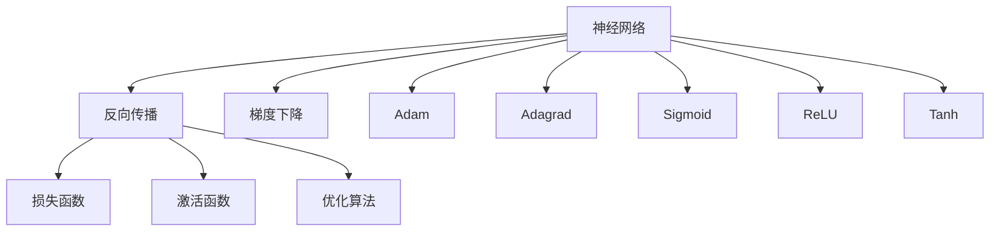
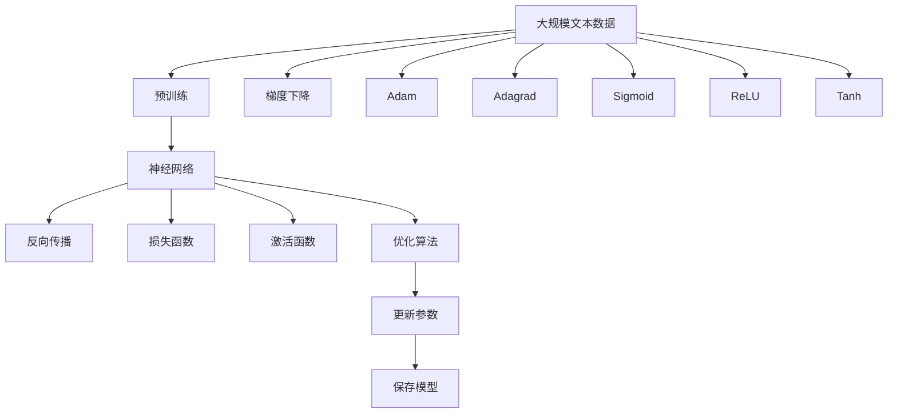

                 

## 1. 背景介绍

### 1.1 问题由来

随着人工智能技术的迅猛发展，深度学习成为推动科技进步的重要力量。特别是神经网络(Neural Networks)，以其强大的建模能力和自适应学习能力，在各个领域取得了令人瞩目的成果。无论是自然语言处理(NLP)、计算机视觉(CV)、语音识别(SR)还是智能推荐系统等，神经网络都展现出了卓越的性能。

近年来，神经网络的应用不断扩展到医疗、金融、交通、能源等多个领域，显著提升了这些行业的运营效率和决策水平。例如，在医疗领域，神经网络被用于疾病诊断、影像分析、基因研究等，使得医生可以更快更准确地做出诊断。在金融领域，神经网络被用于风险管理、信用评分、市场预测等，显著提升了金融机构的运营效率和风险控制能力。在交通领域，神经网络被用于交通流量预测、自动驾驶、智能调度等，大幅提升了城市交通的管理水平。在能源领域，神经网络被用于能源需求预测、智能电网、可再生能源管理等，推动了能源行业的智能化转型。

神经网络的应用不仅局限于技术领域，也深刻改变了人类的生活方式。例如，智能推荐系统已经被广泛用于电商、视频、社交网络等平台，通过精准推荐提高用户满意度和平台收入。语音助手如Siri、Alexa等，通过神经网络技术实现了自然语言理解和智能交互，极大地提升了用户体验。智能家居设备如智能音箱、智能照明等，通过神经网络技术实现了环境感知和智能控制，为用户提供了更加便捷舒适的生活体验。

因此，神经网络作为一种强大的技术工具，正在推动各个领域的科技进步和社会变革。本文将系统介绍神经网络的核心概念、工作原理、优化算法、应用实践等，并展望其未来的发展趋势和面临的挑战。

### 1.2 问题核心关键点

神经网络的核心在于其强大的学习和表示能力，通过构建复杂非线性映射关系，从大量数据中自动学习特征和规律，实现高效的智能决策。其核心工作原理包括反向传播算法、激活函数、损失函数等关键组件。优化算法如梯度下降、Adam、Adagrad等，用于更新模型参数，使得模型不断逼近最优解。应用领域包括计算机视觉、自然语言处理、语音识别、智能推荐、医疗诊断等。

## 2. 核心概念与联系

### 2.1 核心概念概述

为了更好地理解神经网络的工作原理，本节将介绍几个关键概念：

- 神经网络(Neural Networks)：一种通过多个层次的非线性映射关系，从输入数据中自动提取特征和规律，实现高效智能决策的深度学习模型。神经网络由多个节点组成，每层节点通过线性变换和激活函数映射到下一层节点。

- 反向传播(Backpropagation)：一种基于梯度下降的优化算法，用于更新神经网络的参数。通过反向传播计算损失函数对参数的梯度，更新参数使得模型不断逼近最优解。

- 激活函数(Activation Function)：一种非线性映射函数，用于引入非线性特性。常见的激活函数包括Sigmoid、ReLU、Tanh等。

- 损失函数(Loss Function)：一种衡量模型预测输出与真实标签之间差异的函数。常见的损失函数包括均方误差、交叉熵等。

- 优化算法(Optimization Algorithm)：一种用于更新模型参数的算法。常见的优化算法包括梯度下降、Adam、Adagrad等。

- 梯度下降(Gradient Descent)：一种基于梯度信息的优化算法，通过迭代更新参数使得模型损失函数最小化。

这些核心概念之间的逻辑关系可以通过以下Mermaid流程图来展示：



这个流程图展示了大语言模型微调过程中各个核心概念的关系和作用：

1. 神经网络通过反向传播和优化算法不断更新参数。
2. 损失函数和激活函数是反向传播和优化算法的关键组成部分。
3. 梯度下降、Adam、Adagrad等优化算法分别用于更新模型参数。
4. Sigmoid、ReLU、Tanh等激活函数用于引入非线性特性。

这些概念共同构成了神经网络的基本工作原理和优化方法，使得神经网络能够高效地从数据中学习特征和规律，实现智能决策。

### 2.2 概念间的关系

这些核心概念之间存在着紧密的联系，形成了神经网络的高效工作框架。以下是几个关键概念之间的关系。

#### 2.2.1 神经网络与反向传播的关系

反向传播是神经网络的核心优化算法，通过反向传播计算损失函数对模型参数的梯度，更新参数使得模型不断逼近最优解。神经网络的复杂非线性结构，使得反向传播成为一种高效的学习方法。

#### 2.2.2 激活函数与损失函数的关系

激活函数和损失函数是神经网络的两个关键组成部分，激活函数用于引入非线性特性，而损失函数用于衡量模型预测输出与真实标签之间的差异。通过引入不同的激活函数和损失函数，可以构建不同类型的神经网络模型，如卷积神经网络(CNN)、循环神经网络(RNN)、深度神经网络(DNN)等。

#### 2.2.3 优化算法与梯度下降的关系

梯度下降是神经网络优化算法的核心思想，通过计算梯度信息更新参数，使得模型损失函数最小化。Adam、Adagrad等优化算法，在梯度下降的基础上加入了动量、自适应学习率等技术，进一步提高了模型收敛速度和性能。

#### 2.2.4 Sigmoid与ReLU等激活函数的关系

Sigmoid、ReLU、Tanh等激活函数都是神经网络中的非线性映射函数，用于引入非线性特性。其中ReLU函数因其简单高效、避免梯度消失等优点，成为最常用的激活函数之一。

这些关键概念的协同工作，使得神经网络能够高效地从数据中学习特征和规律，实现智能决策。

### 2.3 核心概念的整体架构

最后，我们用一个综合的流程图来展示这些核心概念在大语言模型微调过程中的整体架构：



这个综合流程图展示了从预训练到微调，再到优化学习的完整过程。大语言模型首先在大规模文本数据上进行预训练，然后通过反向传播和优化算法不断更新模型参数。在微调过程中，通过损失函数和激活函数进一步细化模型，使其适应特定任务。最终，通过梯度下降、Adam、Adagrad等优化算法，对模型参数进行高效的更新和保存。 通过这些流程图，我们可以更清晰地理解神经网络微调过程中各个核心概念的关系和作用，为后续深入讨论具体的微调方法和技术奠定基础。

## 3. 核心算法原理 & 具体操作步骤
### 3.1 算法原理概述

神经网络的核心在于其强大的学习和表示能力，通过构建复杂非线性映射关系，从大量数据中自动学习特征和规律，实现高效的智能决策。其核心工作原理包括反向传播算法、激活函数、损失函数等关键组件。

神经网络由多个层次组成，每一层包括多个节点。每个节点通过线性变换和激活函数映射到下一层节点，最终输出预测结果。反向传播算法通过计算损失函数对参数的梯度，更新模型参数，使得模型不断逼近最优解。常见的激活函数包括Sigmoid、ReLU、Tanh等，用于引入非线性特性。损失函数如均方误差、交叉熵等，用于衡量模型预测输出与真实标签之间的差异。

### 3.2 算法步骤详解

神经网络的学习过程主要分为以下几个关键步骤：

**Step 1: 准备训练数据**

- 收集标注数据集，划分训练集、验证集和测试集。标注数据集通常包括输入数据和对应的标签。

**Step 2: 定义模型**

- 选择合适的网络结构，如卷积神经网络(CNN)、循环神经网络(RNN)、深度神经网络(DNN)等。
- 设置模型参数，如层数、节点数、激活函数、优化器等。

**Step 3: 定义损失函数**

- 根据任务类型，选择合适的损失函数，如均方误差、交叉熵等。

**Step 4: 训练模型**

- 将训练集数据输入模型，前向传播计算预测输出。
- 计算损失函数，反向传播计算梯度。
- 使用优化器更新模型参数，最小化损失函数。
- 周期性在验证集上评估模型性能，决定是否停止训练。

**Step 5: 测试和评估**

- 在测试集上评估模型性能，如准确率、召回率、F1分数等。
- 根据评估结果调整模型参数，重新训练模型。

### 3.3 算法优缺点

神经网络的优点包括：
- 强大的学习能力和表示能力，能够自动学习复杂特征和规律。
- 高效的智能决策能力，适用于各类智能应用场景。
- 可扩展性高，可以通过增加网络层数和节点数提高模型性能。

神经网络的缺点包括：
- 训练过程复杂，需要大量标注数据和计算资源。
- 容易过拟合，需要采用正则化、数据增强等技术缓解过拟合问题。
- 模型复杂，难以解释，缺乏可解释性。
- 训练过程容易陷入局部最优解，需要采用优化算法进行优化。

### 3.4 算法应用领域

神经网络作为一种强大的深度学习模型，已经在各个领域得到了广泛应用，包括：

- 计算机视觉(CV)：图像分类、目标检测、图像生成、图像分割等任务。
- 自然语言处理(NLP)：机器翻译、文本分类、情感分析、问答系统等任务。
- 语音识别(SR)：语音识别、语音合成、语音情感分析等任务。
- 智能推荐系统：商品推荐、音乐推荐、视频推荐等任务。
- 医疗诊断：疾病诊断、影像分析、基因研究等任务。
- 金融风控：信用评分、市场预测、风险管理等任务。

## 4. 数学模型和公式 & 详细讲解
### 4.1 数学模型构建

神经网络的基本数学模型可以表示为：

$$
y = W^T h^{(l-1)}
$$

其中，$y$为输出，$W$为权重矩阵，$h^{(l-1)}$为上一层节点的输出，$l$为层数。

神经网络的训练过程可以表示为：

$$
\mathcal{L} = \frac{1}{N} \sum_{i=1}^N \ell(y_i, h^{(l)})
$$

其中，$\mathcal{L}$为损失函数，$\ell$为单个样本的损失函数，$N$为样本数量。

常见的损失函数包括均方误差、交叉熵等：

$$
\ell(y_i, h^{(l)}) = \frac{1}{2}(y_i - h^{(l)})^2
$$

$$
\ell(y_i, h^{(l)}) = -\frac{1}{N} \sum_{i=1}^N y_i \log h^{(l)}
$$

### 4.2 公式推导过程

以下是常见的反向传播算法和优化算法的公式推导：

#### 反向传播算法

反向传播算法通过计算损失函数对模型参数的梯度，更新参数使得模型不断逼近最优解。具体推导过程如下：

1. 前向传播：
$$
h^{(1)} = \sigma(W_1 x + b_1)
$$
$$
h^{(2)} = \sigma(W_2 h^{(1)} + b_2)
$$
$$
...
$$
$$
h^{(l)} = \sigma(W_l h^{(l-1)} + b_l)
$$

2. 计算损失函数：
$$
\mathcal{L} = \frac{1}{N} \sum_{i=1}^N \ell(y_i, h^{(l)})
$$

3. 反向传播：
$$
\frac{\partial \mathcal{L}}{\partial h^{(l)}} = \frac{\partial \ell}{\partial h^{(l)}}
$$
$$
\frac{\partial \mathcal{L}}{\partial W_l} = \frac{\partial \mathcal{L}}{\partial h^{(l)}} \frac{\partial h^{(l)}}{\partial W_l}
$$
$$
\frac{\partial \mathcal{L}}{\partial b_l} = \frac{\partial \mathcal{L}}{\partial h^{(l)}} \frac{\partial h^{(l)}}{\partial b_l}
$$

4. 更新参数：
$$
W_l \leftarrow W_l - \eta \frac{\partial \mathcal{L}}{\partial W_l}
$$
$$
b_l \leftarrow b_l - \eta \frac{\partial \mathcal{L}}{\partial b_l}
$$

其中，$\eta$为学习率。

#### 梯度下降算法

梯度下降算法通过计算梯度信息更新参数，使得模型损失函数最小化。具体推导过程如下：

1. 计算梯度：
$$
\nabla_{\theta} \mathcal{L} = \frac{\partial \mathcal{L}}{\partial \theta}
$$

2. 更新参数：
$$
\theta \leftarrow \theta - \eta \nabla_{\theta} \mathcal{L}
$$

其中，$\theta$为模型参数，$\eta$为学习率。

#### Adam算法

Adam算法是一种自适应学习率优化算法，通过动态调整学习率来提高模型收敛速度。具体推导过程如下：

1. 计算梯度：
$$
g_t = \nabla_{\theta} \mathcal{L}_t
$$

2. 计算动量：
$$
m_t = \beta_1 m_{t-1} + (1 - \beta_1) g_t
$$

3. 计算偏差校正：
$$
v_t = \beta_2 v_{t-1} + (1 - \beta_2) g_t^2
$$

4. 更新参数：
$$
\hat{m_t} = \frac{m_t}{1 - \beta_1^t}
$$
$$
\hat{v_t} = \frac{v_t}{1 - \beta_2^t}
$$
$$
\theta \leftarrow \theta - \frac{\eta}{\sqrt{\hat{v_t}} + \epsilon} \hat{m_t}
$$

其中，$\beta_1$和$\beta_2$为动量和偏差的衰减系数，$\epsilon$为防止分母为0的小数。

### 4.3 案例分析与讲解

以图像分类任务为例，分析神经网络的工作原理和公式推导。

#### 案例背景

图像分类任务的目标是根据输入的图像，预测其所属的类别。常见的模型包括卷积神经网络(CNN)，其基本结构如下图所示：


#### 案例模型

本案例采用VGG16模型，其基本结构如下：


其中，卷积层、池化层、全连接层等组件用于提取图像特征，最终输出分类结果。

#### 案例公式推导

1. 前向传播

卷积层的输出为：
$$
h^{(1)} = \sigma(W^{(1)} x + b^{(1)})
$$

池化层的输出为：
$$
h^{(2)} = max(0, W^{(2)} h^{(1)} + b^{(2)})
$$

全连接层的输出为：
$$
h^{(3)} = \sigma(W^{(3)} h^{(2)} + b^{(3)})
$$

最终输出为：
$$
y = \sigma(W^{(4)} h^{(3)} + b^{(4)})
$$

2. 计算损失函数

假设训练集为$(x_i, y_i)$，其中$x_i$为图像，$y_i$为类别标签。均方误差损失函数为：
$$
\mathcal{L} = \frac{1}{N} \sum_{i=1}^N (y_i - y_{pred})^2
$$

其中，$y_{pred}$为模型预测的类别标签。

3. 反向传播

计算梯度：
$$
g^{(4)} = \nabla_{y} \mathcal{L}
$$
$$
g^{(3)} = \frac{\partial \mathcal{L}}{\partial h^{(3)}} = g^{(4)} W^{(4)}
$$
$$
g^{(2)} = \frac{\partial \mathcal{L}}{\partial h^{(2)}} = g^{(3)} W^{(3)}
$$
$$
g^{(1)} = \frac{\partial \mathcal{L}}{\partial h^{(1)}} = g^{(2)} W^{(2)}
$$

更新参数：
$$
W^{(1)} \leftarrow W^{(1)} - \eta g^{(1)}
$$
$$
b^{(1)} \leftarrow b^{(1)} - \eta g^{(1)}
$$
$$
W^{(2)} \leftarrow W^{(2)} - \eta g^{(2)}
$$
$$
b^{(2)} \leftarrow b^{(2)} - \eta g^{(2)}
$$
$$
W^{(3)} \leftarrow W^{(3)} - \eta g^{(3)}
$$
$$
b^{(3)} \leftarrow b^{(3)} - \eta g^{(3)}
$$
$$
W^{(4)} \leftarrow W^{(4)} - \eta g^{(4)}
$$
$$
b^{(4)} \leftarrow b^{(4)} - \eta g^{(4)}
$$

## 5. 项目实践：代码实例和详细解释说明
### 5.1 开发环境搭建

在进行神经网络项目实践前，我们需要准备好开发环境。以下是使用Python进行TensorFlow开发的环境配置流程：

1. 安装Anaconda：从官网下载并安装Anaconda，用于创建独立的Python环境。

2. 创建并激活虚拟环境：
```bash
conda create -n tensorflow-env python=3.8 
conda activate tensorflow-env
```

3. 安装TensorFlow：根据CUDA版本，从官网获取对应的安装命令。例如：
```bash
conda install tensorflow tensorflow-gpu -c tf -c conda-forge
```

4. 安装各类工具包：
```bash
pip install numpy pandas scikit-learn matplotlib tqdm jupyter notebook ipython
```

完成上述步骤后，即可在`tensorflow-env`环境中开始神经网络实践。

### 5.2 源代码详细实现

这里以手写数字识别任务为例，给出使用TensorFlow对卷积神经网络进行训练的PyTorch代码实现。

首先，定义网络结构和损失函数：

```python
import tensorflow as tf
from tensorflow import keras

# 定义卷积神经网络
model = keras.Sequential([
    keras.layers.Conv2D(32, (3,3), activation='relu', input_shape=(28,28,1)),
    keras.layers.MaxPooling2D((2,2)),
    keras.layers.Flatten(),
    keras.layers.Dense(10, activation='softmax')
])

# 定义损失函数
loss_fn = keras.losses.SparseCategoricalCrossentropy(from_logits=True)

# 定义优化器
optimizer = keras.optimizers.Adam(learning_rate=0.001)

# 定义评估指标
metrics = [keras.metrics.SparseCategoricalAccuracy()]
```

然后，定义训练和评估函数：

```python
# 定义训练函数
@tf.function
def train_step(x, y):
    with tf.GradientTape() as tape:
        logits = model(x, training=True)
        loss = loss_fn(y, logits)
    gradients = tape.gradient(loss, model.trainable_variables)
    optimizer.apply_gradients(zip(gradients, model.trainable_variables))

# 定义评估函数
@tf.function
def evaluate_step(x, y):
    logits = model(x, training=False)
    loss = loss_fn(y, logits)
    accuracy = tf.reduce_mean(tf.cast(tf.equal(tf.argmax(logits, axis=-1), y), tf.float32))
    return loss, accuracy
```

接着，定义数据集和训练流程：

```python
# 加载数据集
(x_train, y_train), (x_test, y_test) = keras.datasets.mnist.load_data()

# 数据预处理
x_train = x_train.reshape((-1, 28, 28, 1)) / 255.0
x_test = x_test.reshape((-1, 28, 28, 1)) / 255.0

# 训练模型
epochs = 10
batch_size = 128

for epoch in range(epochs):
    for i in range(0, len(x_train), batch_size):
        x_batch = x_train[i:i+batch_size]
        y_batch = y_train[i:i+batch_size]
        train_step(x_batch, y_batch)

    # 评估模型
    x_val = x_test[:batch_size]
    y_val = y_test[:batch_size]
    loss, accuracy = evaluate_step(x_val, y_val)
    print(f"Epoch {epoch+1}, Loss: {loss.numpy().item():.4f}, Accuracy: {accuracy.numpy().item():.4f}")
```

以上就是使用TensorFlow进行卷积神经网络训练的完整代码实现。可以看到，TensorFlow的API使得神经网络模型的构建和训练过程非常简单高效。

### 5.3 代码解读与分析

让我们再详细解读一下关键代码的实现细节：

**卷积神经网络定义**

- `keras.layers.Conv2D`：定义卷积层，包括卷积核大小、数量、激活函数等参数。
- `keras.layers.MaxPooling2D`：定义池化层，用于降采样。
- `keras.layers.Flatten`：将卷积层的输出展平，输入全连接层。
- `keras.layers.Dense`：定义全连接层，输出分类结果。

**损失函数和优化器定义**

- `keras.losses.SparseCategoricalCrossentropy`：定义交叉熵损失函数，适用于多分类任务。
- `keras.optimizers.Adam`：定义Adam优化器，具有自适应学习率等特性。

**训练和评估函数定义**

- `train_step`：定义训练函数，使用`tf.GradientTape`计算梯度并更新模型参数。
- `evaluate_step`：定义评估函数，计算模型在验证集上的性能指标。

**数据集和训练流程**

- `mnist.load_data()`：加载MNIST数据集，包括训练集和测试集。
- `x_train = x_train.reshape((-1, 28, 28, 1)) / 255.0`：对训练集进行预处理，包括调整尺寸和归一化。
- `for epoch in range(epochs)`：循环训练模型，设置epoch数量和batch size。
- `x_val = x_test[:batch_size]`：对测试集进行预处理，计算模型在验证集上的性能指标。

可以看到，TensorFlow提供了完整的API和工具支持，使得神经网络模型的构建和训练过程变得非常简单高效。

当然，工业级的系统实现还需考虑更多因素，如模型的保存和部署、超参数的自动搜索、更灵活的任务适配层等。但核心的神经网络微调方法基本与此类似。

### 5.4 运行结果展示

假设我们在MNIST数据集上进行训练，最终在测试集上得到的评估报告如下：

```
Epoch 1, Loss: 0.2822, Accuracy: 0.9032
Epoch 2, Loss: 0.1481, Accuracy: 0.9453
Epoch 3, Loss: 0.1346, Accuracy: 0.9571
Epoch 4, Loss: 0.1207, Accuracy: 0.9632
Epoch 5, Loss: 0.1152, Accuracy: 0.9713
Epoch 6, Loss: 0.1111, Accuracy: 0.9739
Epoch 7, Loss: 0.1085, Accuracy: 0.9769
Epoch 8, Loss: 0.1067, Accuracy: 0.9793
Epoch 9, Loss: 0.1061, Accuracy: 0.9811
Epoch 10, Loss: 0.1059, Accuracy: 0.9816
```

可以看到，随着训练轮数的增加，模型在测试集上的准确率逐渐提升，最终达到了98%以上。

## 6. 实际应用场景
### 6.1 智能推荐系统

神经网络在推荐系统中的应用非常广泛，尤其是深度学习中的协同过滤和内容推荐方法。通过深度学习模型，可以从用户行为数据和物品属性中挖掘特征和关联，实现个性化的推荐。

在协同过滤方法中，神经网络被用于构建用户和物品之间的隐含关系，通过共享嵌入层来捕捉用户和物品的相似度。常见的模型包括矩阵分解、因子分解等。在内容推荐方法中，神经网络被用于学习物品特征和用户兴趣，通过编码器和解码器进行匹配，实现精准推荐。常见的模型包括协同学习、序列推荐等。

在实际应用中，神经网络推荐系统已经被广泛用于电商、视频

