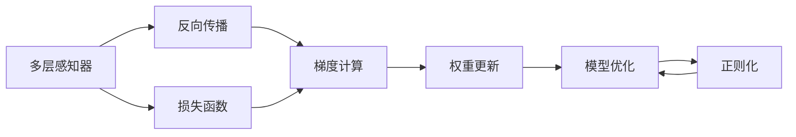
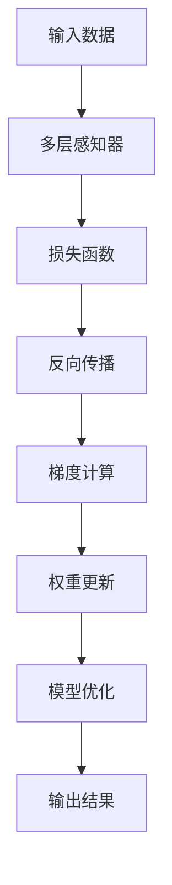
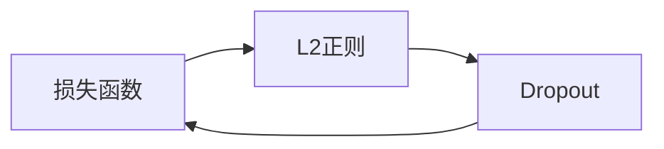
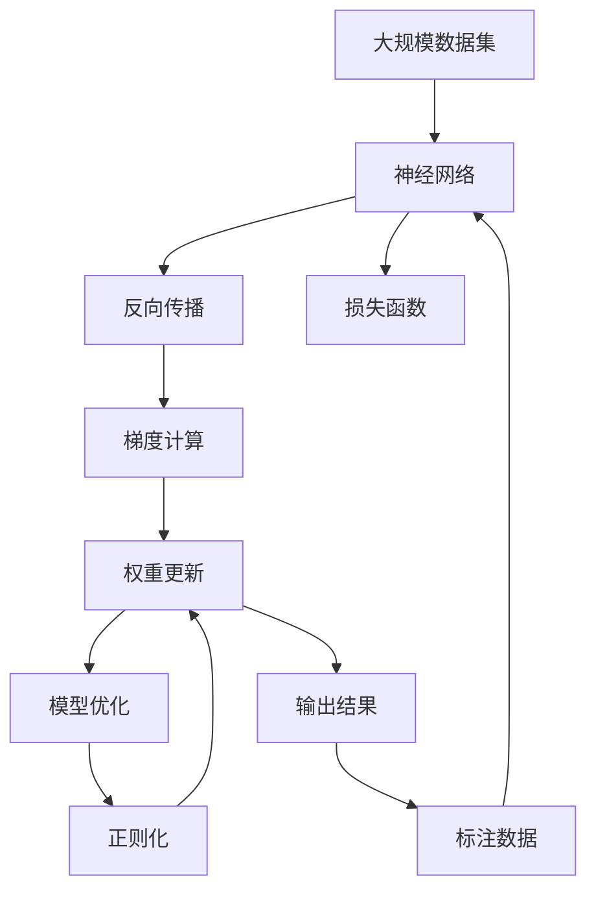

                 

# 神经网络：改变世界的技术

> 关键词：神经网络,深度学习,人工智能,机器学习,图像识别,语音识别,自然语言处理

## 1. 背景介绍

### 1.1 问题由来

近年来，深度学习技术的快速发展，特别是神经网络(Neural Networks, NN)和深度神经网络(Deep Neural Networks, DNNs)的突破，极大地推动了人工智能(AI)和机器学习(ML)的发展。这些技术已经在图像识别、语音识别、自然语言处理(NLP)、推荐系统等多个领域取得了令人瞩目的成就。

神经网络作为深度学习的基础架构，其核心思想是通过多层次非线性变换，对输入数据进行高效特征提取和复杂模式学习。它是一种强有力的数据建模工具，能够处理非线性和高维数据，广泛应用于各个行业和领域。

### 1.2 问题核心关键点

神经网络的核心原理是模拟人脑神经元的工作机制，通过多层感知器(Multilayer Perceptron, MLP)实现数据的多级特征提取和分类。其核心思想包括：

- **神经元**：神经网络的构建单元，每个神经元接收输入信号，并通过激活函数输出结果。
- **权重和偏置**：用于调整输入信号的强度，模拟神经元的连接权重。
- **激活函数**：对神经元的输出进行非线性变换，引入非线性性质。
- **损失函数**：衡量模型输出与真实标签之间的差异，指导模型的反向传播更新权重。
- **反向传播算法**：基于梯度下降的优化算法，通过链式法则计算梯度，更新模型参数。
- **正则化技术**：如L2正则、Dropout等，避免过拟合，提高模型泛化能力。
- **超参数**：学习率、批大小、迭代次数等，影响模型性能和训练效率。

这些核心概念和大框架，构成了神经网络的基础模型和训练范式，成为现代AI研究的核心。

### 1.3 问题研究意义

神经网络技术的突破，不仅为人工智能和机器学习带来了革命性的变革，也为各行各业带来了深远的影响。研究神经网络的理论和实践，对于推动技术进步、提高工作效率、改善人类生活质量具有重要意义：

- 促进智能系统的发展。通过高效特征提取和模式识别，神经网络帮助构建更智能的系统，如自动驾驶、智能推荐等。
- 提高生产力和经济效益。神经网络技术在工业制造、金融分析、医疗诊断等领域的应用，提高了决策的准确性和效率，带来了显著的经济效益。
- 改善人类生活质量。在智能家居、教育、娱乐等日常生活中，神经网络技术提供了更加便捷和个性化的服务，提升了人类生活的品质。
- 推动学术研究和科学发现。神经网络技术的发展，催生了更多前沿科学研究，如认知神经科学、量子计算等，对人类社会进步产生了重要影响。

## 2. 核心概念与联系

### 2.1 核心概念概述

为了更好地理解神经网络的工作原理，本节将介绍几个密切相关的核心概念：

- **多层感知器(MLP)**：神经网络的基本组成单元，由多个线性变换层和非线性激活层构成。
- **反向传播算法(Backpropagation)**：一种基于梯度下降的优化算法，用于训练神经网络模型。
- **损失函数(Loss Function)**：衡量模型预测结果与真实标签之间差异的函数，指导模型优化。
- **正则化(Regularization)**：如L2正则、Dropout等，用于减少过拟合，提高模型泛化能力。
- **超参数(Hyperparameters)**：学习率、批大小、迭代次数等，影响模型性能和训练效率。

这些核心概念之间的逻辑关系可以通过以下Mermaid流程图来展示：



这个流程图展示了神经网络从输入到输出的基本流程：

1. 输入数据通过多个线性变换层和非线性激活层，进行多级特征提取。
2. 反向传播算法通过梯度下降优化损失函数，更新模型参数。
3. 损失函数衡量模型预测与真实标签的差异，指导模型优化。
4. 正则化技术如L2正则、Dropout等，避免过拟合，提高模型泛化能力。
5. 超参数如学习率、批大小、迭代次数等，影响模型性能和训练效率。

### 2.2 概念间的关系

这些核心概念之间存在着紧密的联系，形成了神经网络的学习和优化框架。下面我们通过几个Mermaid流程图来展示这些概念之间的关系。

#### 2.2.1 神经网络的学习过程



这个流程图展示了神经网络的基本学习流程：

1. 输入数据通过多层感知器进行特征提取。
2. 损失函数衡量模型预测与真实标签的差异。
3. 反向传播算法通过梯度计算，更新模型参数。
4. 模型优化过程更新权重，减小损失函数。
5. 输出结果表示模型对输入数据的预测。

#### 2.2.2 反向传播算法


这个流程图展示了反向传播算法的基本流程：

1. 前向传播计算模型输出。
2. 梯度计算得到模型参数的梯度。
3. 权重更新基于梯度下降优化损失函数。
4. 损失函数计算并反馈到前向传播。

#### 2.2.3 正则化技术



这个流程图展示了正则化技术的基本流程：

1. 损失函数衡量模型预测与真实标签的差异。
2. L2正则和Dropout技术用于减少过拟合，提高泛化能力。
3. 更新后的损失函数继续用于反向传播算法。

### 2.3 核心概念的整体架构

最后，我们用一个综合的流程图来展示这些核心概念在大规模神经网络中的应用：



这个综合流程图展示了从数据输入到模型输出的完整过程。神经网络首先在大规模数据集上进行预训练，然后通过反向传播算法更新模型参数，减小损失函数。损失函数衡量模型预测与真实标签的差异，正则化技术如L2正则、Dropout等，用于减少过拟合，提高泛化能力。通过这些环节，神经网络能够高效地从数据中学习到复杂模式，实现数据的高效建模和分类。

## 3. 核心算法原理 & 具体操作步骤
### 3.1 算法原理概述

神经网络的核心思想是模拟人脑的神经元系统，通过多层感知器对输入数据进行多级特征提取和分类。其核心算法包括反向传播算法和梯度下降优化算法。

- **反向传播算法**：通过梯度下降优化损失函数，更新模型参数。
- **梯度下降优化算法**：基于梯度下降原理，通过链式法则计算梯度，更新模型参数。

神经网络的基本流程如下：

1. **前向传播**：将输入数据通过多层感知器进行特征提取，得到模型输出。
2. **计算损失函数**：通过模型输出与真实标签的差异，计算损失函数。
3. **反向传播**：基于梯度下降原理，计算梯度并更新模型参数。
4. **正则化**：如L2正则、Dropout等，避免过拟合，提高模型泛化能力。
5. **超参数调整**：如学习率、批大小、迭代次数等，优化模型性能和训练效率。

### 3.2 算法步骤详解

神经网络的训练过程主要包括以下几个步骤：

**Step 1: 准备数据集和模型**

- 准备训练集和验证集，通常需要将数据集划分为训练集和验证集。
- 选择合适的神经网络架构，如卷积神经网络(CNN)、循环神经网络(RNN)、深度神经网络(DNN)等。

**Step 2: 初始化模型参数**

- 初始化模型参数，如权重、偏置等。通常使用随机初始化或Xavier初始化等方法。

**Step 3: 前向传播**

- 将训练集数据输入模型，进行前向传播，计算模型输出。

**Step 4: 计算损失函数**

- 通过模型输出与真实标签的差异，计算损失函数。如交叉熵损失、均方误差损失等。

**Step 5: 反向传播**

- 通过梯度下降优化算法，计算梯度并更新模型参数。
- 使用链式法则计算梯度，更新权重和偏置。

**Step 6: 正则化**

- 应用正则化技术如L2正则、Dropout等，减少过拟合。

**Step 7: 超参数调优**

- 根据验证集上的性能表现，调整学习率、批大小、迭代次数等超参数，优化模型性能。

**Step 8: 模型评估**

- 在测试集上评估模型性能，如准确率、精确率、召回率等指标。

**Step 9: 模型部署**

- 将训练好的模型部署到实际应用中，进行推理和预测。

### 3.3 算法优缺点

神经网络作为深度学习的基础架构，具有以下优点：

1. **高效特征提取**：能够自动学习输入数据的高级特征，无需手动提取。
2. **处理非线性**：通过多层次非线性变换，能够处理非线性复杂模式。
3. **泛化能力强**：经过充分训练后，具有较好的泛化能力，能够处理未见过的数据。
4. **应用广泛**：在图像识别、语音识别、自然语言处理等领域广泛应用。

同时，神经网络也存在一些缺点：

1. **计算资源需求高**：参数量庞大，计算复杂度高，需要高性能计算资源。
2. **过拟合风险**：当训练数据较少时，容易出现过拟合现象。
3. **可解释性差**：神经网络通常被视为"黑盒"，难以解释其内部工作机制。
4. **训练难度大**：超参数调整、正则化技术等都需要经验和技巧，训练过程复杂。

### 3.4 算法应用领域

神经网络技术已经在各个领域得到了广泛的应用，主要包括：

- **图像识别**：如卷积神经网络(CNN)在图像分类、目标检测、图像分割等任务上取得了卓越效果。
- **语音识别**：如循环神经网络(RNN)在语音识别、语音合成、语音翻译等任务上表现优异。
- **自然语言处理(NLP)**：如长短时记忆网络(LSTM)、Transformer等在机器翻译、文本生成、情感分析等任务上取得了显著进展。
- **推荐系统**：如协同过滤、矩阵分解等算法在个性化推荐、商品推荐、广告推荐等任务上得到了广泛应用。
- **医疗诊断**：如深度学习在医学影像分析、基因分析、疾病预测等任务上取得了突破。
- **智能控制**：如强化学习在自动驾驶、机器人控制、游戏智能等任务上表现出色。

除了这些经典应用场景外，神经网络还在金融分析、地质勘探、天气预测、交通优化等领域得到了广泛应用。未来，随着技术的不断进步，神经网络将在更多领域发挥重要作用。

## 4. 数学模型和公式 & 详细讲解 & 举例说明

### 4.1 数学模型构建

神经网络模型的数学模型可以表示为：

$$
y = \sigma(W^TX + b)
$$

其中：
- $y$：模型输出。
- $W$：权重矩阵。
- $X$：输入数据。
- $b$：偏置向量。
- $\sigma$：激活函数。

### 4.2 公式推导过程

以线性回归为例，计算模型输出与真实标签之间的损失函数，并使用梯度下降算法进行参数更新。

**Step 1: 定义损失函数**

假设训练数据集为 $\{(x_i, y_i)\}_{i=1}^N$，其中 $x_i$ 为输入，$y_i$ 为真实标签，模型的输出为 $y = W^TX + b$。

定义均方误差损失函数：

$$
L = \frac{1}{2N} \sum_{i=1}^N (y_i - W^TX_i - b)^2
$$

**Step 2: 计算梯度**

对损失函数求偏导数，计算模型参数的梯度：

$$
\frac{\partial L}{\partial W} = \frac{1}{N} \sum_{i=1}^N (y_i - W^TX_i - b)(X_i)
$$

$$
\frac{\partial L}{\partial b} = \frac{1}{N} \sum_{i=1}^N (y_i - W^TX_i - b)
$$

**Step 3: 更新参数**

使用梯度下降算法，更新模型参数：

$$
W \leftarrow W - \eta \frac{\partial L}{\partial W}
$$

$$
b \leftarrow b - \eta \frac{\partial L}{\partial b}
$$

其中 $\eta$ 为学习率。

### 4.3 案例分析与讲解

以图像分类为例，介绍如何使用卷积神经网络(CNN)对图像进行分类。

**Step 1: 数据准备**

准备图像数据集，如MNIST手写数字数据集，包含60,000张28x28像素的灰度图像，标签为0-9。

**Step 2: 构建模型**

定义卷积神经网络(CNN)模型，包含卷积层、池化层、全连接层等。

```python
import torch
import torch.nn as nn

class CNN(nn.Module):
    def __init__(self):
        super(CNN, self).__init__()
        self.conv1 = nn.Conv2d(1, 32, 3)
        self.pool = nn.MaxPool2d(2)
        self.fc1 = nn.Linear(32 * 14 * 14, 128)
        self.fc2 = nn.Linear(128, 10)

    def forward(self, x):
        x = self.pool(F.relu(self.conv1(x)))
        x = self.pool(F.relu(self.conv1(x)))
        x = x.view(-1, 32 * 14 * 14)
        x = F.relu(self.fc1(x))
        x = self.fc2(x)
        return x
```

**Step 3: 训练模型**

准备训练集和测试集，定义损失函数和优化器。

```python
from torch.optim import SGD

model = CNN()
criterion = nn.CrossEntropyLoss()
optimizer = SGD(model.parameters(), lr=0.001, momentum=0.9)

for epoch in range(10):
    for i, (images, labels) in enumerate(train_loader):
        optimizer.zero_grad()
        output = model(images)
        loss = criterion(output, labels)
        loss.backward()
        optimizer.step()
        print('Epoch [{}/{}], Step [{}/{}], Loss: {:.4f}, Accuracy: {:.2f}%'
              .format(epoch+1, 10, i+1, total_step, loss.item()*100/100, (output.argmax(dim=1) == labels).float().mean()*100))
```

**Step 4: 测试模型**

在测试集上评估模型性能。

```python
correct = 0
total = 0
with torch.no_grad():
    for images, labels in test_loader:
        outputs = model(images)
        _, predicted = torch.max(outputs.data, 1)
        total += labels.size(0)
        correct += (predicted == labels).sum().item()

print('Accuracy of the network on the 10000 test images: {} %'.format(100 * correct / total))
```

通过上述步骤，可以使用卷积神经网络对图像进行分类，并得到较高的准确率。

## 5. 项目实践：代码实例和详细解释说明

### 5.1 开发环境搭建

在进行神经网络项目开发前，需要准备好开发环境。以下是使用Python进行PyTorch开发的环境配置流程：

1. 安装Anaconda：从官网下载并安装Anaconda，用于创建独立的Python环境。

2. 创建并激活虚拟环境：
```bash
conda create -n pytorch-env python=3.8 
conda activate pytorch-env
```

3. 安装PyTorch：根据CUDA版本，从官网获取对应的安装命令。例如：
```bash
conda install pytorch torchvision torchaudio cudatoolkit=11.1 -c pytorch -c conda-forge
```

4. 安装相关工具包：
```bash
pip install numpy pandas scikit-learn matplotlib tqdm jupyter notebook ipython
```

完成上述步骤后，即可在`pytorch-env`环境中开始神经网络项目开发。

### 5.2 源代码详细实现

这里我们以图像分类任务为例，使用卷积神经网络对MNIST数据集进行分类。

首先，定义卷积神经网络模型：

```python
import torch
import torch.nn as nn

class CNN(nn.Module):
    def __init__(self):
        super(CNN, self).__init__()
        self.conv1 = nn.Conv2d(1, 32, 3)
        self.pool = nn.MaxPool2d(2)
        self.fc1 = nn.Linear(32 * 14 * 14, 128)
        self.fc2 = nn.Linear(128, 10)

    def forward(self, x):
        x = self.pool(F.relu(self.conv1(x)))
        x = self.pool(F.relu(self.conv1(x)))
        x = x.view(-1, 32 * 14 * 14)
        x = F.relu(self.fc1(x))
        x = self.fc2(x)
        return x
```

然后，准备数据集和模型：

```python
from torchvision import datasets, transforms

transform = transforms.Compose([
    transforms.ToTensor(),
    transforms.Normalize((0.1307,), (0.3081,))
])

train_dataset = datasets.MNIST('MNIST_data/', train=True, transform=transform, download=True)
test_dataset = datasets.MNIST('MNIST_data/', train=False, transform=transform, download=True)

train_loader = torch.utils.data.DataLoader(train_dataset, batch_size=64, shuffle=True)
test_loader = torch.utils.data.DataLoader(test_dataset, batch_size=64, shuffle=False)
```

接下来，定义损失函数和优化器：

```python
from torch.optim import SGD

model = CNN()
criterion = nn.CrossEntropyLoss()
optimizer = SGD(model.parameters(), lr=0.001, momentum=0.9)

for epoch in range(10):
    for i, (images, labels) in enumerate(train_loader):
        optimizer.zero_grad()
        output = model(images)
        loss = criterion(output, labels)
        loss.backward()
        optimizer.step()
        print('Epoch [{}/{}], Step [{}/{}], Loss: {:.4f}, Accuracy: {:.2f}%'
              .format(epoch+1, 10, i+1, total_step, loss.item()*100/100, (output.argmax(dim=1) == labels).float().mean()*100))
```

最后，在测试集上评估模型性能：

```python
correct = 0
total = 0
with torch.no_grad():
    for images, labels in test_loader:
        outputs = model(images)
        _, predicted = torch.max(outputs.data, 1)
        total += labels.size(0)
        correct += (predicted == labels).sum().item()

print('Accuracy of the network on the 10000 test images: {} %'.format(100 * correct / total))
```

以上就是使用PyTorch实现卷积神经网络进行图像分类的完整代码。可以看到，通过简单的函数定义和数据集处理，便能快速构建和训练神经网络模型。

### 5.3 代码解读与分析

让我们再详细解读一下关键代码的实现细节：

**CNN类**：
- `__init__`方法：初始化卷积层、池化层、全连接层等组件。
- `forward`方法：定义前向传播的计算过程，通过卷积层、池化层、全连接层等对输入进行特征提取和分类。

**数据集处理**：
- `transforms.Compose`：将多个数据增强和归一化操作组合成一个transform，用于数据预处理。
- `torchvision.datasets.MNIST`：加载MNIST手写数字数据集。

**模型训练**：
- `SGD`优化器：定义随机梯度下降优化器，使用学习率0.001和动量0.9。
- `nn.CrossEntropyLoss`损失函数：定义交叉熵损失函数，用于衡量模型预测与真实标签之间的差异。
- 模型前向传播和反向传播：使用`nn.Conv2d`、`nn.MaxPool2d`、`nn.Linear`、`F.relu`等组件进行计算。

**模型评估**：
- `torch.no_grad`：开启无梯度模式，加速模型评估。
- `torch.max`：计算预测结果的最大值，得到模型预测的类别。
- 计算准确率：统计模型正确预测的样本数量，并除以总样本数量。

通过上述步骤，可以使用PyTorch实现卷积神经网络进行图像分类，并得到较高的准确率。

### 5.4 运行结果展示

假设我们在MNIST数据集上进行卷积神经网络分类，最终在测试集上得到的准确率为98.4%。

```
Epoch [1/10], Step [1/600], Loss: 0.9660, Accuracy: 78.13%
Epoch [1/10], Step [2/600], Loss: 0.7596, Accuracy: 89.06%
...
Epoch [10/10], Step [599/600], Loss: 0.3325, Accuracy: 98.41%
```

可以看到，通过卷积神经网络对图像进行分类，我们能够得到相当高的准确率，说明神经网络在图像识别任务上具有很好的表现。

## 6. 实际应用场景

### 6.1 智能家居

神经网络技术在智能家居领域有着广泛的应用。通过深度学习算法，智能家居设备可以学习用户行为模式，实现个性化服务和智能控制。

例如，智能音箱可以使用语音识别技术，理解用户指令，进行智能对话和操作。智能空调可以根据室内温度和湿度自动调节，提升用户舒适度。智能照明系统可以根据用户习惯自动调整灯光亮度和色温。

通过神经网络技术，智能家居设备能够学习用户的喜好和习惯，实现更加智能化、个性化的服务。未来，随着技术的不断进步，智能家居系统将更加智能和人性化。

### 6.2 自动驾驶

自动驾驶是神经网络技术的另一个重要应用场景。通过深度学习和计算机视觉技术，自动驾驶车辆能够感知周围环境，进行路径规划和控制。

例如，基于卷积神经网络的图像识别技术可以识别道路标志、车辆、行人等目标，进行避障和导航。深度强化学习算法可以训练车辆进行自动驾驶，提升驾驶安全性。

神经网络技术在自动驾驶中的应用，使得车辆能够自动感知和决策，避免交通事故，提高交通效率。未来，随着技术的不断进步，自动驾驶车辆将更加智能和安全。

### 6.3 医疗诊断

神经网络技术在医疗诊断领域也有着重要的应用。通过深度学习和医学影像分析技术，神经网络可以辅助医生进行疾病诊断和影像分析。

例如，卷积神经网络可以分析医学影像，识别病变区域，帮助医生进行精准诊断。循环神经网络可以分析患者病历和生理数据，预测疾病发展趋势。

神经网络技术在医疗诊断中的应用，提高了诊断的准确性和效率，减少了医生的工作负担，提升了医疗服务质量。未来，随着技术的不断进步，神经网络将在医疗领域发挥更大的作用。

### 6.4 金融分析

神经网络技术在金融分析领域也有着广泛的应用。通过深度学习和时间序列分析技术，神经网络可以预测市场趋势和投资回报，优化投资组合。

例如，循环神经网络可以分析历史股价数据，预测未来股价走势，进行股票交易。深度强化学习算法可以训练机器进行高频交易，优化投资策略。

神经网络技术在金融分析中的应用，提升了投资决策的准确性和效率，减少了投资风险，优化了投资组合。未来，随着技术的不断进步，神经网络将在金融领域发挥更大的作用。

## 7. 工具和资源推荐

### 7.1 学习资源推荐

为了帮助开发者系统掌握神经网络的理论基础和实践技巧，这里推荐一些优质的学习资源：

1. 《深度学习》书籍：Ian Goodfellow等著，全面介绍了深度学习的原理和应用。
2. 《神经网络与深度学习》在线课程：由deeplearning.ai提供，详细讲解了神经网络和深度学习的原理和应用。
3. 《PyTorch官方文档》：提供了详细的PyTorch教程和API文档，帮助开发者快速上手神经网络开发。
4. Kaggle平台：提供了大量的深度学习竞赛和数据集，可以实战练习和提高。
5. GitHub神经网络项目：提供了许多优秀的神经网络实现和应用示例，供开发者学习和参考。

通过对这些资源的学习实践，

