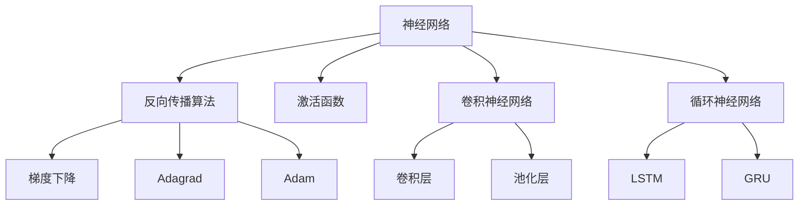
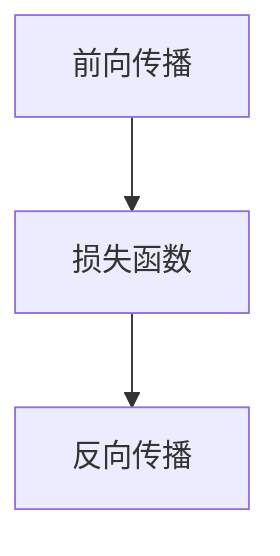
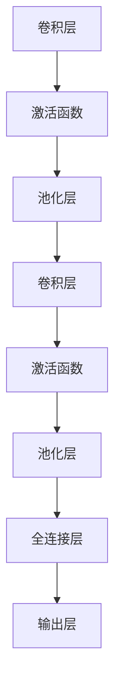
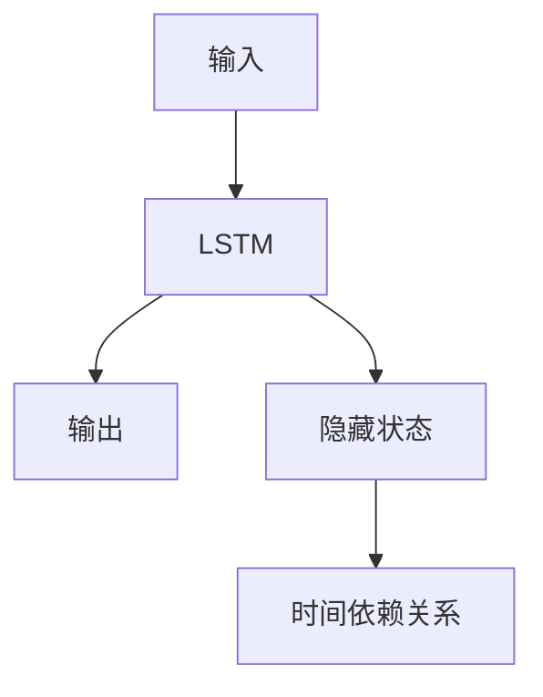
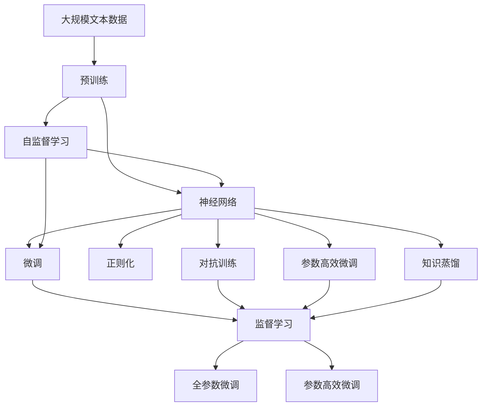

                 

# 神经网络：机器学习的新范式

## 1. 背景介绍

### 1.1 问题由来
近年来，人工智能(AI)领域取得了飞速发展，尤其是机器学习(ML)技术的不断突破。其中，神经网络(Neural Networks, NN)作为机器学习的重要分支，以其强大的模式识别和预测能力，逐步成为诸多应用场景中的核心技术。然而，早期的神经网络面临诸如梯度消失、易过拟合、训练时间长等问题，导致其应用受限。

为了克服这些问题，学术界和工业界展开了持续的研究和探索。其中，深度学习(Deep Learning, DL)的崛起为神经网络带来了革命性的改进，尤其是卷积神经网络(CNN)和循环神经网络(RNN)的提出，使得神经网络在图像识别、语音识别、自然语言处理等领域取得了突破性的成果。但即使如此，其计算复杂度高、需要大量标注数据等问题依然存在。

为解决这些问题，研究者提出了一种全新的范式——深度神经网络(Deep Neural Networks, DNN)，不仅在结构上有了重大改进，还在训练策略和算法上进行了深入优化，大大提升了神经网络的应用范围和性能。深度神经网络包括多层感知器(Multilayer Perceptron, MLP)、卷积神经网络、循环神经网络、长短时记忆网络(Long Short-Term Memory, LSTM)等，其核心思想是通过多层次的非线性变换，不断提取和抽象数据特征，最终实现对复杂数据的精确建模。

深度神经网络的成功，标志着一个新的机器学习范式的诞生，即“神经网络范式”。神经网络范式不仅彻底改变了传统机器学习的思维模式，还开启了人工智能技术在各领域应用的广阔前景。本文将深入探讨神经网络的原理、应用、挑战及未来发展趋势，为读者提供一个全面、系统的理解。

### 1.2 问题核心关键点
神经网络作为机器学习的新范式，其核心思想在于利用多层次的非线性变换，提取和抽象数据特征，并通过反向传播算法进行高效训练。这种范式相较于传统机器学习，具有以下几个关键特点：

1. **多层结构**：神经网络由多层神经元组成，每个神经元处理数据的局部特征，通过多层次的非线性变换，逐步提取全局特征，实现对复杂数据的高效建模。
2. **反向传播算法**：利用反向传播算法对神经网络进行训练，通过梯度下降等优化方法，不断调整权重参数，使模型逼近真实标签。
3. **非线性变换**：神经元通过非线性激活函数实现非线性变换，从而能够处理非线性关系。
4. **大规模数据处理**：神经网络能够高效处理大规模数据，对数据分布和噪声具有一定的鲁棒性。
5. **可解释性**：相较于传统机器学习模型，神经网络的黑箱性质带来了一定的可解释性问题，但随着研究进展，可解释性技术也在不断进步。

神经网络的成功应用，不仅推动了AI技术的快速发展，还在诸多领域带来了颠覆性创新，如计算机视觉、自然语言处理、语音识别、游戏AI等。

### 1.3 问题研究意义
神经网络作为机器学习的新范式，对推动AI技术的发展具有重要意义：

1. **提升模型性能**：神经网络通过多层次的非线性变换，能够更准确地捕捉数据特征，提升模型预测精度和泛化能力。
2. **拓展应用范围**：神经网络不仅适用于图像、语音、文本等传统领域，还能应用于自然语言生成、强化学习、推荐系统等新领域，推动技术在各行业的广泛应用。
3. **加速研究进展**：神经网络的出现，促使研究者不断探索更高效、更稳定的训练方法和模型结构，推动AI技术不断进步。
4. **提高技术应用性**：神经网络在处理大规模数据和复杂问题时展现出强大的优势，推动AI技术在实际场景中的落地应用。
5. **带来技术创新**：神经网络的普及，催生了深度学习、迁移学习、生成对抗网络(GAN)等前沿技术，推动AI技术创新和突破。

因此，深入研究神经网络的原理和应用，对于推动AI技术的产业化进程，具有重要意义。

## 2. 核心概念与联系

### 2.1 核心概念概述

为更好地理解神经网络的原理和应用，本节将介绍几个密切相关的核心概念：

- **神经网络**：以多层感知器为代表的深度神经网络，通过多层次的非线性变换，实现对复杂数据的建模。
- **反向传播算法**：用于神经网络训练的优化算法，通过梯度下降等方法不断调整权重参数，使模型逼近真实标签。
- **激活函数**：用于引入非线性变换的数学函数，常用的有sigmoid、ReLU等。
- **卷积神经网络(CNN)**：专门用于图像识别和处理的神经网络结构，通过卷积层、池化层等实现特征提取。
- **循环神经网络(RNN)**：用于序列数据处理的神经网络结构，通过LSTM、GRU等机制实现时间依赖关系的建模。
- **深度学习**：以神经网络为核心的机器学习范式，强调通过多层次的非线性变换，自动学习复杂数据的特征。

这些核心概念之间存在着紧密的联系，构成了神经网络的基本框架和运行机制。下面通过Mermaid流程图展示这些概念之间的联系：



这个流程图展示了神经网络的主要组件和运行机制：

1. **神经网络**：由多层神经元组成，每个神经元处理局部特征。
2. **反向传播算法**：利用梯度下降等优化方法，不断调整权重参数。
3. **激活函数**：用于引入非线性变换，实现多层次特征提取。
4. **卷积神经网络**：通过卷积层和池化层实现特征提取和下采样。
5. **循环神经网络**：通过LSTM、GRU等机制实现时间依赖关系的建模。

这些核心概念共同构成了神经网络的运行机制，使得其能够高效处理大规模复杂数据，实现对复杂问题的精确建模。

### 2.2 概念间的关系

这些核心概念之间存在着紧密的联系，形成了神经网络的基本框架和运行机制。以下通过几个Mermaid流程图展示这些概念之间的关系：

#### 2.2.1 神经网络的层次结构


这个流程图展示了神经网络的基本层次结构：输入层、隐藏层和输出层。数据通过输入层进入网络，经过多层次的特征提取，最终在输出层产生结果。

#### 2.2.2 反向传播算法的优化过程



这个流程图展示了反向传播算法的优化过程：首先进行前向传播计算预测结果，然后通过损失函数计算预测误差，最后进行反向传播更新权重参数。

#### 2.2.3 卷积神经网络的结构



这个流程图展示了卷积神经网络的基本结构：通过卷积层和池化层实现特征提取和下采样，最终通过全连接层输出结果。

#### 2.2.4 循环神经网络的机制



这个流程图展示了循环神经网络的基本机制：通过LSTM、GRU等机制实现时间依赖关系的建模，隐藏状态能够捕捉序列数据的时序信息。

### 2.3 核心概念的整体架构

最后，我们用一个综合的流程图来展示这些核心概念在大神经网络微调过程中的整体架构：



这个综合流程图展示了从预训练到微调，再到参数高效微调，以及知识蒸馏等常见微调方法的完整过程。预训练主要采用自监督学习方法，微调则是有监督学习的过程。微调方法包括全参数微调和参数高效微调两种方式，同时可以应用正则化、对抗训练等技术。知识蒸馏则是一种通过老模型指导新模型，提升新模型性能的技术。这些概念共同构成了神经网络的微调范式，使得其在各领域中得到广泛应用。

## 3. 核心算法原理 & 具体操作步骤
### 3.1 算法原理概述

神经网络作为机器学习的新范式，其核心思想是通过多层非线性变换，提取和抽象数据特征，并通过反向传播算法进行高效训练。其核心算法原理包括以下几个关键步骤：

1. **前向传播**：将输入数据通过网络进行多层次的特征提取，得到中间层的隐藏表示。
2. **损失函数计算**：将隐藏表示与真实标签进行对比，计算预测误差。
3. **反向传播**：利用梯度下降等优化算法，不断调整权重参数，使得预测误差最小化。
4. **权重更新**：通过反向传播得到的梯度信息，更新模型参数，优化模型性能。
5. **正则化**：通过L2正则、Dropout等技术，防止过拟合，提升模型泛化能力。

神经网络通过不断迭代训练，逐步优化权重参数，提升模型性能。其原理简洁明了，但实现过程复杂多样，需要精心设计和优化。

### 3.2 算法步骤详解

神经网络的训练过程包括前向传播、损失函数计算、反向传播和权重更新等多个步骤，下面详细介绍这些步骤的具体实现。

**前向传播**：将输入数据通过网络进行多层次的特征提取，得到中间层的隐藏表示。具体实现如下：

1. 将输入数据 $x$ 输入到输入层，每个神经元进行线性变换并加上偏置。
2. 通过激活函数引入非线性变换，得到隐藏层表示 $h$。
3. 重复上述步骤，经过多个隐藏层后，得到输出层表示 $y$。

**损失函数计算**：将隐藏表示与真实标签进行对比，计算预测误差。常用的损失函数包括交叉熵损失、均方误差损失等。具体实现如下：

1. 将输出表示 $y$ 与真实标签 $t$ 进行对比，得到预测误差。
2. 通过损失函数 $L$ 计算预测误差的大小。

**反向传播**：利用梯度下降等优化算法，不断调整权重参数，使得预测误差最小化。具体实现如下：

1. 通过链式法则计算输出层对输入层的梯度。
2. 反向传播梯度，逐层计算隐藏层和输入层的梯度。
3. 使用梯度信息更新权重参数，减少预测误差。

**权重更新**：通过反向传播得到的梯度信息，更新模型参数，优化模型性能。具体实现如下：

1. 设置学习率 $\eta$，计算权重参数的更新量。
2. 使用梯度信息和学习率更新权重参数。

**正则化**：通过L2正则、Dropout等技术，防止过拟合，提升模型泛化能力。具体实现如下：

1. 通过L2正则化，对权重参数进行约束，防止权重过大导致过拟合。
2. 通过Dropout，随机丢弃部分神经元，防止模型对某一特征的过度依赖。

神经网络的训练过程是一个不断迭代的过程，通过前向传播、损失函数计算、反向传播和权重更新等步骤，逐步优化权重参数，提升模型性能。正则化技术可以进一步防止过拟合，提升模型的泛化能力。

### 3.3 算法优缺点

神经网络作为机器学习的新范式，具有以下几个优点：

1. **强大的表达能力**：神经网络通过多层次的非线性变换，能够高效地捕捉复杂数据的特征，适用于各种类型的数据。
2. **鲁棒性强**：神经网络能够处理噪声和异常数据，具有较强的鲁棒性。
3. **可解释性强**：相较于传统机器学习模型，神经网络的可解释性有所提升，能够通过激活函数和权重参数解释模型的决策过程。
4. **适用范围广**：神经网络不仅适用于图像、语音、文本等传统领域，还能应用于自然语言生成、强化学习、推荐系统等新领域，推动技术在各行业的广泛应用。

但神经网络也存在一些缺点：

1. **计算复杂度高**：神经网络的训练过程复杂，计算资源需求大。
2. **过拟合风险高**：神经网络容易过拟合，尤其是数据量较小或模型复杂时，需要额外的正则化技术进行约束。
3. **模型解释困难**：神经网络的参数数量庞大，难以解释模型决策过程，可解释性问题仍需进一步研究。
4. **训练时间长**：神经网络的训练过程耗时较长，需要大量标注数据和计算资源。

尽管存在这些缺点，但神经网络的成功应用，已经证明其在处理复杂问题时具有强大的能力和优势。

### 3.4 算法应用领域

神经网络作为机器学习的新范式，已经在诸多领域得到了广泛的应用，覆盖了几乎所有常见应用：

- **计算机视觉**：用于图像分类、物体检测、图像分割等任务，通过卷积神经网络实现高效特征提取。
- **自然语言处理**：用于文本分类、情感分析、机器翻译等任务，通过循环神经网络和Transformer等模型实现语言理解。
- **语音识别**：用于语音识别、语音合成等任务，通过卷积神经网络和循环神经网络实现声学建模。
- **推荐系统**：用于个性化推荐、广告推荐等任务，通过协同过滤、矩阵分解等模型实现用户行为预测。
- **游戏AI**：用于游戏场景中的决策、策略生成等任务，通过强化学习等技术实现智能体行为优化。

此外，神经网络还被创新性地应用到更多场景中，如可控文本生成、常识推理、代码生成等，为机器学习技术带来了全新的突破。

## 4. 数学模型和公式 & 详细讲解  
### 4.1 数学模型构建

本节将使用数学语言对神经网络的训练过程进行严格的描述。

假设神经网络由 $n$ 层组成，输入数据为 $x$，输出数据为 $y$，模型参数为 $\theta$。则神经网络的数学模型可以表示为：

$$
y = f_\theta(x)
$$

其中 $f_\theta(x)$ 表示神经网络的前向传播过程。

**前向传播**：将输入数据 $x$ 通过网络进行多层次的特征提取，得到中间层的隐藏表示。具体实现如下：

1. 将输入数据 $x$ 输入到输入层，每个神经元进行线性变换并加上偏置。
2. 通过激活函数引入非线性变换，得到隐藏层表示 $h$。
3. 重复上述步骤，经过多个隐藏层后，得到输出层表示 $y$。

前向传播的具体形式如下：

$$
h_1 = f_\theta(x)
$$
$$
h_2 = f_\theta(h_1)
$$
$$
\cdots
$$
$$
y = f_\theta(h_n)
$$

其中 $f_\theta$ 表示神经元的前向传播函数，$h_i$ 表示第 $i$ 层神经元的隐藏表示。

**损失函数计算**：将隐藏表示与真实标签进行对比，计算预测误差。常用的损失函数包括交叉熵损失、均方误差损失等。具体实现如下：

$$
L = \frac{1}{N} \sum_{i=1}^N \ell(y_i, \hat{y}_i)
$$

其中 $\ell$ 表示损失函数，$y_i$ 表示真实标签，$\hat{y}_i$ 表示模型预测值。

**反向传播**：利用梯度下降等优化算法，不断调整权重参数，使得预测误差最小化。具体实现如下：

1. 通过链式法则计算输出层对输入层的梯度。
2. 反向传播梯度，逐层计算隐藏层和输入层的梯度。
3. 使用梯度信息更新权重参数。

反向传播的具体形式如下：

$$
\frac{\partial L}{\partial \theta} = \frac{\partial L}{\partial y} \cdot \frac{\partial y}{\partial h_n} \cdot \cdots \cdot \frac{\partial h_2}{\partial h_1} \cdot \frac{\partial h_1}{\partial x}
$$

其中 $\frac{\partial L}{\partial y}$ 表示损失函数对输出层的梯度，$\frac{\partial y}{\partial h_n}$ 表示输出层对隐藏层的梯度，$\cdots$ 表示逐层计算梯度，$\frac{\partial h_1}{\partial x}$ 表示隐藏层对输入层的梯度。

**权重更新**：通过反向传播得到的梯度信息，更新模型参数，优化模型性能。具体实现如下：

$$
\theta = \theta - \eta \frac{\partial L}{\partial \theta}
$$

其中 $\eta$ 表示学习率，$\frac{\partial L}{\partial \theta}$ 表示梯度信息。

**正则化**：通过L2正则、Dropout等技术，防止过拟合，提升模型泛化能力。具体实现如下：

1. 通过L2正则化，对权重参数进行约束，防止权重过大导致过拟合。
2. 通过Dropout，随机丢弃部分神经元，防止模型对某一特征的过度依赖。

正则化的具体形式如下：

$$
L_{reg} = \lambda \sum_{i=1}^n \|w_i\|^2
$$

其中 $w_i$ 表示第 $i$ 层的权重参数，$\lambda$ 表示正则化系数。

### 4.2 公式推导过程

以下我们以二分类任务为例，推导交叉熵损失函数及其梯度的计算公式。

假设模型 $M_{\theta}$ 在输入 $x$ 上的输出为 $\hat{y}=M_{\theta}(x) \in [0,1]$，表示样本属于正类的概率。真实标签 $y \in \{0,1\}$。则二分类交叉熵损失函数定义为：

$$
\ell(M_{\theta}(x),y) = -[y\log \hat{y} + (1-y)\log (1-\hat{y})]
$$

将其代入经验风险公式，得：

$$
\mathcal{L}(\theta) = -\frac{1}{N}\sum_{i=1}^N [y_i\log M_{\theta}(x_i)+(1-y_i)\log(1-M_{\theta}(x_i))]
$$

根据链式法则，损失函数对参数 $\theta_k$ 的梯度为：

$$
\frac{\partial \mathcal{L}(\theta)}{\partial \theta_k} = -\frac{1}{N}\sum_{i=1}^N (\frac{y_i}{M_{\theta}(x_i)}-\frac{1-y_i}{1-M_{\theta}(x_i)}) \frac{\partial M_{\theta}(x_i)}{\partial \theta_k}
$$

其中 $\frac{\partial M_{\theta}(x_i)}{\partial \theta_k}$ 可进一步递归展开，利用自动微分技术完成计算。

在得到损失函数的梯度后，即可带入参数更新公式，完成模型的迭代优化。重复上述过程直至收敛，最终得到适应下游任务的最优模型参数 $\theta^*$。

### 4.3 案例分析与讲解

下面我们以图像分类任务为例，展示神经网络的训练过程。

**问题定义**：假设我们有一个图像分类任务，其中每个图像 $x_i$ 对应一个标签 $y_i \in \{1,2,3,4\}$。我们需要训练一个神经网络，使其能够准确预测新图像的类别。

**数据准备**：我们首先需要准备训练集 $D=\{(x_i,y_i)\}_{i=1}^N$，其中 $x_i$ 表示图像，$y_i$ 表示标签。

**模型设计**：我们设计一个简单的卷积神经网络，包含两个卷积层和两个池化层，最后通过全连接层输出结果。

**参数初始化**：我们初始化模型的权重参数 $\theta$，将其随机初始化为一个小的随机数。

**前向传播**：我们将训练集 $D$ 中的每个图像 $x_i$ 输入神经网络，经过两个卷积层和池化层，得到隐藏表示 $h$，再通过全连接层输出预测值 $\hat{y}$。

**损失函数计算**：我们计算预测值 $\hat{y}$ 与真实标签 $y$ 的交叉熵损失。

**反向传播**：我们通过链式法则计算每个参数对损失函数的梯度，利用梯度下降等优化算法更新模型参数。

**权重更新**：我们通过反向传播得到的梯度信息，更新模型参数 $\theta$，逐步优化模型性能。

**正则化**：我们通过L2正则化技术，防止权重参数过大导致过拟合。

重复以上步骤，直到模型收敛，训练完成后，我们利用测试集评估模型的性能。

## 5. 项目实践：代码实例和详细解释说明
### 5.1 开发环境搭建

在进行神经网络实践前，我们需要准备好开发环境。以下是使用Python进行PyTorch开发的环境配置流程：

1. 安装Anaconda：从官网下载并安装Anaconda，用于创建独立的Python环境。

2. 创建并激活虚拟环境：
```bash
conda create -n pytorch-env python=3.8 
conda activate pytorch-env
```

3. 安装PyTorch：根据CUDA版本，从官网获取对应的安装命令。例如：
```bash
conda install pytorch torchvision torchaudio cudatoolkit=11.1 -c pytorch -c conda-forge
```

4. 安装Transformer库：
```bash
pip install transformers
```

5. 安装各类工具包：
```bash
pip install numpy pandas scikit-learn matplotlib tqdm jupyter notebook ipython
```

完成上述步骤后，即可在`pytorch-env`环境中开始神经网络实践。

### 5.2 源代码详细实现

下面我们以卷积神经网络(CNN)为例，给出使用PyTorch进行图像分类任务的PyTorch代码实现。

```python
import torch
import torch.nn as nn
import torch.optim as optim
import torchvision.transforms as transforms
from torchvision import datasets, models

# 定义模型结构
class Net(nn.Module):
    def __init__(self):
        super(Net, self).__init__()
        self.conv1 = nn.Conv2d(3, 6, 5)
        self.pool = nn.MaxPool2d(2, 2)
        self.conv2 = nn.Conv2d(6, 16, 5)
        self.fc1 = nn.Linear(16 * 5 * 5, 120)
        self.fc2 = nn.Linear(120, 84)
        self.fc3 = nn.Linear(84, 10)

    def forward(self, x):
        x = self.pool(F.relu(self.conv1(x)))
        x = self.pool(F.relu(self.conv2(x)))
        x = x.view(-1, 16 * 5 * 5)
        x = F.relu(self.fc1(x))
        x = F.relu(self.fc2(x))
        x = self.fc3(x)
        return x

# 定义训练函数
def train(model, device, train_loader, optimizer, epoch):
    model.train()
    for batch_idx, (data, target) in enumerate(train_loader):
        data, target = data.to(device), target.to(device)
        optimizer.zero_grad()
        output = model(data)
        loss = F.cross_entropy(output, target)
        loss.backward()
        optimizer.step()

# 定义测试函数
def test(model, device, test_loader):
    model.eval()
    test_loss = 0
    correct = 0
    with torch.no_grad():
        for data, target in test_loader:
            data, target = data.to(device), target.to(device)
            output = model(data)
            test_loss += F.cross_entropy(output, target, reduction='sum').item()
            pred = output.argmax(dim=1, keepdim=True)
            correct += pred.eq(target.view_as(pred)).sum().item()
    test_loss /= len(test_loader.dataset)
    print('Test set: Average loss: {:.4f}, Accuracy: {}/{} ({:.0f}%)\n'.format(
        test_loss, correct, len(test_loader.dataset),
        100. * correct / len(test_loader.dataset)))

# 定义主函数
def main():
    device = torch.device('cuda' if torch.cuda.is_available() else 'cpu')

    # 数据预处理
    transform = transforms.Compose([
        transforms.ToTensor(),
        transforms.Normalize((0.5, 0.5, 0.5), (0.5, 0.5, 0.5))
    ])

    trainset = datasets.CIFAR10(root='./data', train=True,
                               transform=transform, download=True)
    trainloader

