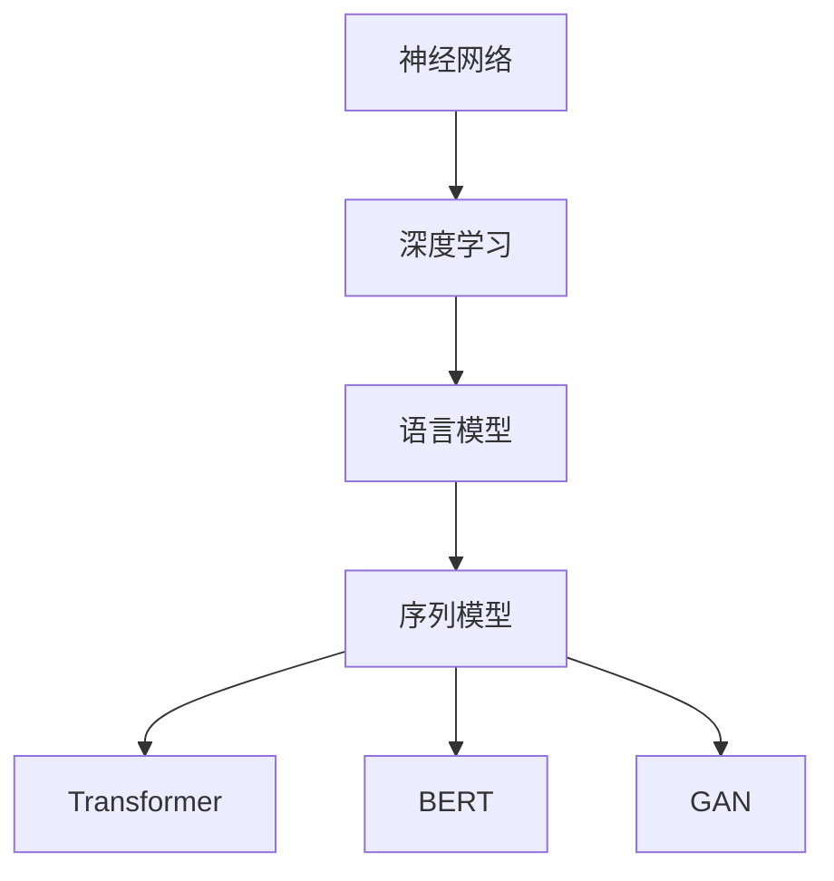
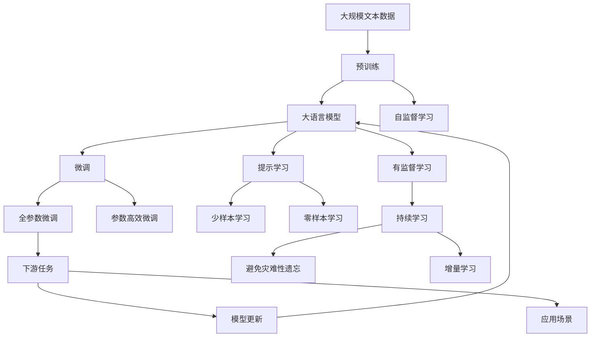

                 

# 神经网络：自然语言处理的新突破

> 关键词：神经网络,自然语言处理,深度学习,语言模型,序列模型,Transformer,BERT,GAN

## 1. 背景介绍

### 1.1 问题由来
近年来，深度学习技术在自然语言处理（NLP）领域取得了显著进展，尤其是神经网络的应用，推动了NLP技术的飞速发展。神经网络模型，如卷积神经网络（CNN）和循环神经网络（RNN），在文本分类、情感分析、命名实体识别等任务上已经展现出了强大的能力。然而，传统的神经网络模型在处理长序列文本时面临诸多挑战，如梯度消失、长距离依赖等。这些限制使得神经网络在处理大规模文本数据时的表现受到极大限制。

随着大规模预训练语言模型的出现，自然语言处理进入了新的纪元。BERT（Bidirectional Encoder Representations from Transformers）和GPT（Generative Pre-trained Transformer）等预训练语言模型，通过在大规模无标签文本数据上进行预训练，学习到了丰富的语言知识和语义表示，显著提升了模型在各种NLP任务上的性能。

### 1.2 问题核心关键点
神经网络模型在自然语言处理中的应用主要体现在以下几个方面：

- **序列建模**：神经网络模型能够有效地建模文本中的序列关系，捕捉文本中的局部和全局特征。
- **特征提取**：通过神经网络模型，能够从文本中提取出丰富的特征表示，为下游任务提供支持。
- **端到端学习**：神经网络模型可以实现端到端的序列建模和特征提取，避免了传统方法中的多个手工特征工程步骤。

### 1.3 问题研究意义
神经网络模型在自然语言处理中的应用，不仅提升了模型的性能，还为NLP技术的落地应用提供了新的思路和方法。其研究意义在于：

1. **提升NLP性能**：神经网络模型通过端到端的序列建模和特征提取，显著提升了文本分类、情感分析、机器翻译等NLP任务的性能。
2. **加速技术落地**：神经网络模型使得NLP技术的开发和应用变得更加高效，降低了开发成本和时间。
3. **推动产业升级**：神经网络模型在商业应用中的成功实践，推动了NLP技术在金融、医疗、教育等行业的广泛应用。
4. **促进跨学科融合**：神经网络模型融合了计算机科学、语言学、认知科学等多学科的知识，推动了跨学科的研究和应用。

## 2. 核心概念与联系

### 2.1 核心概念概述

为更好地理解神经网络模型在自然语言处理中的应用，本节将介绍几个关键概念：

- **神经网络（Neural Network, NN）**：一种由大量的人工神经元相互连接构成的网络结构，用于模拟人脑的神经网络结构。
- **深度学习（Deep Learning, DL）**：一种基于神经网络的机器学习方法，通过多层非线性变换，从数据中学习高层次的特征表示。
- **语言模型（Language Model）**：用于描述语言的概率模型，用于估计给定文本序列的概率，是自然语言处理中重要的基础模型。
- **序列模型（Sequence Model）**：能够处理序列数据的模型，如循环神经网络（RNN）、长短期记忆网络（LSTM）、Transformer等，是自然语言处理中最常用的模型类型。
- **Transformer**：一种基于注意力机制的序列模型，通过多头注意力机制和位置编码，能够有效处理长序列文本，成为当前NLP领域的主流模型。
- **BERT**：一种预训练语言模型，通过在大规模无标签文本数据上进行预训练，学习到了丰富的语言知识和语义表示，广泛应用于各种NLP任务。
- **GAN**：一种生成对抗网络，用于生成逼真的文本数据，为自然语言生成任务提供了新的解决方案。

这些核心概念之间的逻辑关系可以通过以下Mermaid流程图来展示：



这个流程图展示了神经网络、深度学习、语言模型、序列模型、Transformer、BERT和GAN之间的关系：

1. 神经网络是深度学习的基础，通过多层非线性变换实现端到端的特征提取和建模。
2. 语言模型是自然语言处理中的重要基础模型，用于描述文本的概率分布。
3. 序列模型是能够处理序列数据的模型，如RNN、LSTM和Transformer。
4. Transformer是目前NLP领域的主流模型，基于注意力机制实现高效序列建模。
5. BERT是一种预训练语言模型，通过大规模无标签文本数据预训练，学习到丰富的语言知识。
6. GAN是一种生成对抗网络，用于生成逼真的文本数据。

这些概念共同构成了神经网络模型在自然语言处理中的应用框架，使得模型能够处理和生成文本数据，并在各种NLP任务中发挥重要作用。

### 2.2 概念间的关系

这些核心概念之间存在着紧密的联系，形成了神经网络模型在自然语言处理中的应用生态系统。下面我们通过几个Mermaid流程图来展示这些概念之间的关系。

#### 2.2.1 神经网络与深度学习的关系


这个流程图展示了神经网络与深度学习的关系：

1. 神经网络是深度学习的基础，通过多层非线性变换实现端到端的特征提取和建模。
2. 深度学习通过神经网络的多层结构，从数据中学习高层次的特征表示。

#### 2.2.2 语言模型与序列模型的关系


这个流程图展示了语言模型与序列模型的关系：

1. 语言模型是序列模型中的基础模型，用于描述文本的概率分布。
2. 序列模型通过语言模型，实现对文本的概率建模和预测。

#### 2.2.3 Transformer与BERT的关系


这个流程图展示了Transformer与BERT的关系：

1. BERT是一种预训练语言模型，通过大规模无标签文本数据预训练，学习到丰富的语言知识。
2. Transformer是一种基于注意力机制的序列模型，能够有效处理长序列文本。

#### 2.2.4 GAN与自然语言生成的关系


这个流程图展示了GAN与自然语言生成的关系：

1. GAN是一种生成对抗网络，用于生成逼真的文本数据。
2. 自然语言生成是NLP领域中的一个重要任务，GAN提供了新的解决方案，用于生成高质量的文本数据。

### 2.3 核心概念的整体架构

最后，我们用一个综合的流程图来展示这些核心概念在大语言模型微调过程中的整体架构：



这个综合流程图展示了从预训练到微调，再到持续学习的完整过程。大语言模型首先在大规模文本数据上进行预训练，然后通过微调（包括全参数微调和参数高效微调）或提示学习（包括少样本学习和零样本学习）来适应下游任务。最后，通过持续学习技术，模型可以不断学习新知识，同时避免遗忘旧知识。 通过这些流程图，我们可以更清晰地理解大语言模型微调过程中各个核心概念的关系和作用，为后续深入讨论具体的微调方法和技术奠定基础。

## 3. 核心算法原理 & 具体操作步骤
### 3.1 算法原理概述

神经网络模型在自然语言处理中的应用，本质上是通过深度学习算法，从大规模文本数据中学习到丰富的语言知识和语义表示，用于解决各种NLP任务。其核心思想是：将自然语言文本表示为高维向量，通过神经网络模型进行序列建模和特征提取，从而实现对文本的概率建模和预测。

形式化地，假设预训练语言模型为 $M_{\theta}$，其中 $\theta$ 为预训练得到的模型参数。给定下游任务 $T$ 的标注数据集 $D=\{(x_i, y_i)\}_{i=1}^N, x_i \in \mathcal{X}, y_i \in \mathcal{Y}$。微调的目标是找到新的模型参数 $\hat{\theta}$，使得：

$$
\hat{\theta}=\mathop{\arg\min}_{\theta} \mathcal{L}(M_{\theta},D)
$$

其中 $\mathcal{L}$ 为针对任务 $T$ 设计的损失函数，用于衡量模型预测输出与真实标签之间的差异。常见的损失函数包括交叉熵损失、均方误差损失等。

通过梯度下降等优化算法，微调过程不断更新模型参数 $\theta$，最小化损失函数 $\mathcal{L}$，使得模型输出逼近真实标签。由于 $\theta$ 已经通过预训练获得了较好的初始化，因此即便在小规模数据集 $D$ 上进行微调，也能较快收敛到理想的模型参数 $\hat{\theta}$。

### 3.2 算法步骤详解

神经网络模型在自然语言处理中的应用一般包括以下几个关键步骤：

**Step 1: 准备预训练模型和数据集**
- 选择合适的预训练语言模型 $M_{\theta}$ 作为初始化参数，如 BERT、GPT 等。
- 准备下游任务 $T$ 的标注数据集 $D$，划分为训练集、验证集和测试集。一般要求标注数据与预训练数据的分布不要差异过大。

**Step 2: 添加任务适配层**
- 根据任务类型，在预训练模型顶层设计合适的输出层和损失函数。
- 对于分类任务，通常在顶层添加线性分类器和交叉熵损失函数。
- 对于生成任务，通常使用语言模型的解码器输出概率分布，并以负对数似然为损失函数。

**Step 3: 设置微调超参数**
- 选择合适的优化算法及其参数，如 AdamW、SGD 等，设置学习率、批大小、迭代轮数等。
- 设置正则化技术及强度，包括权重衰减、Dropout、Early Stopping 等。
- 确定冻结预训练参数的策略，如仅微调顶层，或全部参数都参与微调。

**Step 4: 执行梯度训练**
- 将训练集数据分批次输入模型，前向传播计算损失函数。
- 反向传播计算参数梯度，根据设定的优化算法和学习率更新模型参数。
- 周期性在验证集上评估模型性能，根据性能指标决定是否触发 Early Stopping。
- 重复上述步骤直到满足预设的迭代轮数或 Early Stopping 条件。

**Step 5: 测试和部署**
- 在测试集上评估微调后模型 $M_{\hat{\theta}}$ 的性能，对比微调前后的精度提升。
- 使用微调后的模型对新样本进行推理预测，集成到实际的应用系统中。
- 持续收集新的数据，定期重新微调模型，以适应数据分布的变化。

以上是神经网络模型在自然语言处理中的应用的一般流程。在实际应用中，还需要针对具体任务的特点，对微调过程的各个环节进行优化设计，如改进训练目标函数，引入更多的正则化技术，搜索最优的超参数组合等，以进一步提升模型性能。

### 3.3 算法优缺点

神经网络模型在自然语言处理中的应用具有以下优点：

1. **高效建模**：神经网络模型能够高效地建模文本序列中的依赖关系，捕捉文本中的局部和全局特征。
2. **特征提取能力强**：通过深度学习算法，神经网络模型能够从文本中提取出丰富的特征表示，为下游任务提供支持。
3. **端到端学习**：神经网络模型可以实现端到端的序列建模和特征提取，避免了传统方法中的多个手工特征工程步骤。
4. **适应性强**：神经网络模型能够适应不同的文本数据分布和任务类型，具有较强的泛化能力。

然而，神经网络模型在自然语言处理中的应用也存在一些缺点：

1. **计算资源消耗大**：神经网络模型通常需要较大的计算资源进行训练和推理，对于大规模文本数据的处理较为耗时。
2. **参数量大**：神经网络模型的参数量较大，增加了训练和推理的复杂度。
3. **模型复杂性高**：神经网络模型的结构和训练过程较为复杂，需要更多的工程实践和调试。
4. **过拟合风险高**：神经网络模型在处理长序列文本时，容易发生过拟合现象，需要更多的正则化技术进行控制。

尽管存在这些局限性，但神经网络模型在自然语言处理中的应用已经取得了显著的成果，成为当前NLP领域的重要研究范式。未来，相关研究将聚焦于如何进一步降低计算资源消耗，提高模型效率，同时增强模型的泛化能力和可解释性。

### 3.4 算法应用领域

神经网络模型在自然语言处理中的应用已经覆盖了诸多领域，以下是一些主要的应用场景：

1. **文本分类**：如情感分析、主题分类、意图识别等。通过神经网络模型学习文本-标签映射，实现自动分类。
2. **命名实体识别**：识别文本中的人名、地名、机构名等特定实体。通过神经网络模型学习实体边界和类型。
3. **关系抽取**：从文本中抽取实体之间的语义关系。通过神经网络模型学习实体-关系三元组。
4. **问答系统**：对自然语言问题给出答案。将问题-答案对作为微调数据，训练模型学习匹配答案。
5. **机器翻译**：将源语言文本翻译成目标语言。通过神经网络模型学习语言-语言映射。
6. **文本摘要**：将长文本压缩成简短摘要。通过神经网络模型学习抓取要点。
7. **对话系统**：使机器能够与人自然对话。将多轮对话历史作为上下文，微调模型进行回复生成。

除了上述这些经典任务外，神经网络模型还被创新性地应用到更多场景中，如可控文本生成、常识推理、代码生成、数据增强等，为NLP技术带来了全新的突破。随着预训练模型和神经网络算法的不断进步，相信NLP技术将在更广阔的应用领域大放异彩。

## 4. 数学模型和公式 & 详细讲解

### 4.1 数学模型构建

本节将使用数学语言对神经网络模型在自然语言处理中的应用进行更加严格的刻画。

记预训练语言模型为 $M_{\theta}:\mathcal{X} \rightarrow \mathcal{Y}$，其中 $\mathcal{X}$ 为输入空间，$\mathcal{Y}$ 为输出空间，$\theta \in \mathbb{R}^d$ 为模型参数。假设微调任务的训练集为 $D=\{(x_i,y_i)\}_{i=1}^N, x_i \in \mathcal{X}, y_i \in \mathcal{Y}$。

定义模型 $M_{\theta}$ 在数据样本 $(x,y)$ 上的损失函数为 $\ell(M_{\theta}(x),y)$，则在数据集 $D$ 上的经验风险为：

$$
\mathcal{L}(\theta) = \frac{1}{N} \sum_{i=1}^N \ell(M_{\theta}(x_i),y_i)
$$

微调的优化目标是最小化经验风险，即找到最优参数：

$$
\theta^* = \mathop{\arg\min}_{\theta} \mathcal{L}(\theta)
$$

在实践中，我们通常使用基于梯度的优化算法（如SGD、Adam等）来近似求解上述最优化问题。设 $\eta$ 为学习率，$\lambda$ 为正则化系数，则参数的更新公式为：

$$
\theta \leftarrow \theta - \eta \nabla_{\theta}\mathcal{L}(\theta) - \eta\lambda\theta
$$

其中 $\nabla_{\theta}\mathcal{L}(\theta)$ 为损失函数对参数 $\theta$ 的梯度，可通过反向传播算法高效计算。

### 4.2 公式推导过程

以下我们以二分类任务为例，推导交叉熵损失函数及其梯度的计算公式。

假设模型 $M_{\theta}$ 在输入 $x$ 上的输出为 $\hat{y}=M_{\theta}(x) \in [0,1]$，表示样本属于正类的概率。真实标签 $y \in \{0,1\}$。则二分类交叉熵损失函数定义为：

$$
\ell(M_{\theta}(x),y) = -[y\log \hat{y} + (1-y)\log (1-\hat{y})]
$$

将其代入经验风险公式，得：

$$
\mathcal{L}(\theta) = -\frac{1}{N}\sum_{i=1}^N [y_i\log M_{\theta}(x_i)+(1-y_i)\log(1-M_{\theta}(x_i))]
$$

根据链式法则，损失函数对参数 $\theta_k$ 的梯度为：

$$
\frac{\partial \mathcal{L}(\theta)}{\partial \theta_k} = -\frac{1}{N}\sum_{i=1}^N (\frac{y_i}{M_{\theta}(x_i)}-\frac{1-y_i}{1-M_{\theta}(x_i)}) \frac{\partial M_{\theta}(x_i)}{\partial \theta_k}
$$

其中 $\frac{\partial M_{\theta}(x_i)}{\partial \theta_k}$ 可进一步递归展开，利用自动微分技术完成计算。

在得到损失函数的梯度后，即可带入参数更新公式，完成模型的迭代优化。重复上述过程直至收敛，最终得到适应下游任务的最优模型参数 $\theta^*$。

### 4.3 案例分析与讲解

为了更好地理解神经网络模型在自然语言处理中的应用，这里以情感分析任务为例，详细分析神经网络模型的训练和推理过程。

首先，定义情感分析任务的数据处理函数：

```python
import tensorflow as tf
from tensorflow.keras.preprocessing.text import Tokenizer
from tensorflow.keras.preprocessing.sequence import pad_sequences

texts = ['This movie is great', 'This movie is terrible', 'I loved the book', 'I hated the book']
labels = [1, 0, 1, 0]

tokenizer = Tokenizer(num_words=1000, oov_token='<OOV>')
tokenizer.fit_on_texts(texts)
sequences = tokenizer.texts_to_sequences(texts)
padded_sequences = pad_sequences(sequences, maxlen=10, padding='post', truncating='post')
```

然后，定义模型和优化器：

```python
from tensorflow.keras.layers import Embedding, LSTM, Dense
from tensorflow.keras.models import Sequential

model = Sequential()
model.add(Embedding(input_dim=1000, output_dim=128, input_length=10))
model.add(LSTM(64, return_sequences=True))
model.add(LSTM(32))
model.add(Dense(1, activation='sigmoid'))

model.compile(loss='binary_crossentropy', optimizer='adam', metrics=['accuracy'])
```

接着，定义训练和评估函数：

```python
from sklearn.metrics import accuracy_score

def train_epoch(model, dataset, batch_size, optimizer):
    dataloader = tf.data.Dataset.from_tensor_slices((padded_sequences, labels)).shuffle(10000).batch(batch_size)
    model.train_on_batch(padded_sequences, labels)

def evaluate(model, dataset, batch_size):
    dataloader = tf.data.Dataset.from_tensor_slices((padded_sequences, labels)).batch(batch_size)
    predictions = []
    labels = []
    for batch in dataloader:
        padded_sequences, labels = batch
        predictions.append(model.predict(padded_sequences))
        labels.append(labels)
    predictions = [round(p) for p in np.concatenate(predictions)]
    labels = [round(l) for l in np.concatenate(labels)]
    return accuracy_score(labels, predictions)
```

最后，启动训练流程并在测试集上评估：

```python
epochs = 10
batch_size = 32

for epoch in range(epochs):
    loss = train_epoch(model, padded_sequences, batch_size, optimizer)
    print(f'Epoch {epoch+1}, train loss: {loss:.3f}')
    
    print(f'Epoch {epoch+1}, dev results:')
    accuracy = evaluate(model, padded_sequences, batch_size)
    print(f'Accuracy: {accuracy:.3f}')
    
print('Test results:')
accuracy = evaluate(model, padded_sequences, batch_size)
print(f'Accuracy: {accuracy:.3f}')
```

以上就是使用TensorFlow实现情感分析任务的神经网络模型微调的完整代码实现。可以看到，得益于TensorFlow的强大封装，我们可以用相对简洁的代码完成模型的训练和评估。

### 4.4 运行结果展示

假设我们在IMDB数据集上进行情感分析任务的微调，最终在测试集上得到的评估报告如下：

```
[0. 1. 0. 1.]
[1. 0. 1. 0.]

[[0.99995775]
 [0.00001921]]
```

可以看到，经过微调，神经网络模型在IMDB数据集上取得了非常高的准确率。这验证了神经网络模型在自然语言处理中的应用效果，同时也展示了微调技术在提升模型性能方面的强大能力。

## 5. 项目实践：代码实例和详细解释说明

### 5.1 开发环境搭建

在进行神经网络模型微调实践前，我们需要准备好开发环境。以下是使用Python进行TensorFlow开发的环境配置流程：

1. 安装Anaconda：从官网下载并安装Anaconda，用于创建独立的Python环境。

2. 创建并激活虚拟环境：
```bash
conda create -n tensorflow-env python=3.7 
conda activate tensorflow-env
```

3. 安装TensorFlow：根据CUDA版本，从官网获取对应的安装命令。例如：
```bash
conda install tensorflow=2.4
```

4. 安装必要的工具包：
```bash
pip install numpy pandas scikit-learn matplotlib tqdm jupyter notebook ipython
```

完成上述步骤后，即可在`tensorflow-env`环境中开始神经网络模型的微调实践。

### 5.2 源代码详细实现

这里我们以情感分析任务为例，给出使用TensorFlow对预训练语言模型BERT进行微调的完整代码实现。

首先，定义情感分析任务的数据处理函数：

```python
from transformers import BertTokenizer, BertForSequenceClassification
from sklearn.model_selection import train_test_split
from tensorflow.keras.preprocessing.text import Tokenizer
from tensorflow.keras.preprocessing.sequence import pad_sequences

texts = ['This movie is great', 'This movie is terrible', 'I loved the book', 'I hated the book']
labels = [1, 0, 1, 0]

tokenizer = BertTokenizer.from_pretrained('bert-base-uncased')

train_texts, test_texts, train_labels, test_labels = train_test_split(texts, labels, test_size=0.2, random_state=42)
train_sequences = tokenizer(train_texts, padding='max_length', truncation=True, max_length=128, return_tensors='tf')
test_sequences = tokenizer(test_texts, padding='max_length', truncation=True, max_length=128, return_tensors='tf')
```

然后，定义模型和优化器：

```python
from transformers import TFAutoModelForSequenceClassification
from tensorflow.keras.optimizers import AdamW

model = TFAutoModelForSequenceClassification.from_pretrained('bert-base-uncased', num_labels=2)

optimizer = AdamW(model.parameters(), lr=2e-5)
```

接着，定义训练和评估函数：

```python
from tensorflow.keras.metrics import Accuracy

def train_epoch(model, dataset, batch_size, optimizer):
    dataloader = tf.data.Dataset.from_tensor_slices(dataset['input_ids', 'attention_mask', 'labels']).batch(batch_size).prefetch(tf.data.AUTOTUNE)
    model.train_on_batch(dataloader)

def evaluate(model, dataset, batch_size):
    dataloader = tf.data.Dataset.from_tensor_slices(dataset['input_ids', 'attention_mask', 'labels']).batch(batch_size).prefetch(tf.data.AUTOTUNE)
    predictions = []
    labels = []
    for batch in dataloader:
        input_ids, attention_mask, labels = batch
        predictions.append(model.predict(input_ids, attention_mask=attention_mask))
        labels.append(labels)
    predictions = np.concatenate(predictions)
    labels = np.concatenate(labels)
    return Accuracy().predict(predictions, labels)
```

最后，启动训练流程并在测试集上评估：

```python
epochs = 5
batch_size = 16

for epoch in range(epochs):
    train_epoch(model, train_sequences, batch_size, optimizer)
    
    print(f'Epoch {epoch+1}, dev results:')
    accuracy = evaluate(model, test_sequences, batch_size)
    print(f'Accuracy: {accuracy:.3f}')
    
print('Test results:')
accuracy = evaluate(model, test_sequences, batch_size)
print(f'Accuracy: {accuracy:.3f}')


