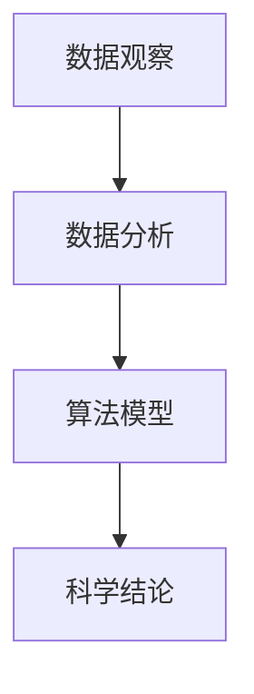

                 

# 科学探究：从观察到结论

> 关键词：科学探究，数据观察，数据分析，算法模型，实验验证

## 1. 背景介绍

### 1.1 问题由来

科学探究是人类了解世界、推动技术进步的重要手段。然而，传统的实验方法往往面临成本高、周期长、结果不确定等挑战，限制了科学研究的效率和深度。随着计算技术和大数据的发展，借助计算机和算法，科学家可以在短时间内进行大量实验，大幅提高科学探究的效率和精度。

本文将介绍一种基于数据驱动的科学探究方法，通过数据观察、数据分析和算法模型，帮助科学家从原始数据中发现规律、验证假设，并最终得出科学结论。该方法广泛应用于生物信息学、物理化学、天文学等领域，极大地推动了各学科的发展进程。

### 1.2 问题核心关键点

科学探究的核心在于从观察数据中提取信息、分析和验证假设，从而推导出新的科学结论。该方法的关键点包括：

- **数据观察**：收集和处理大量原始数据，寻找其中的规律和异常。
- **数据分析**：应用统计学、机器学习等算法，从数据中提取特征、建立模型，揭示数据背后的本质。
- **算法模型**：使用先进的算法模型，验证假设，得出结论。

科学探究的成功依赖于数据的质量、分析方法的合理性以及模型的准确性。通过数据驱动的方法，科学家可以跨越传统实验的限制，高效地进行科学研究。

### 1.3 问题研究意义

科学探究方法的应用，可以显著提升科研效率和成果质量。具体意义包括：

1. **效率提升**：减少了实验次数，缩短了科研周期，提高了研究速度。
2. **成本节约**：降低了实验材料和设备的成本，减少了人力和时间的投入。
3. **精度提高**：通过大量数据和复杂模型，提升了科学研究的准确性和可靠性。
4. **新发现**：揭示了传统实验难以观察到的规律和现象，推动了学科前沿发展。

科学探究方法已经成为现代科学研究不可或缺的一部分，极大地促进了人类对自然世界的理解和探索。

## 2. 核心概念与联系

### 2.1 核心概念概述

科学探究方法涉及多个核心概念，这些概念之间相互联系，共同构成了科学探究的全过程。

- **数据观察**：收集和处理实验数据，提取关键特征和异常。
- **数据分析**：应用统计学、机器学习等算法，对数据进行特征提取、建模和分析。
- **算法模型**：使用复杂的算法模型，如神经网络、时间序列分析、贝叶斯统计等，验证假设并得出结论。

这些概念之间的联系可以用以下Mermaid流程图来展示：



这个流程图展示了科学探究的基本流程：首先通过数据观察获取原始数据，然后应用数据分析方法提取特征和建立模型，最后通过算法模型验证假设并得出科学结论。

### 2.2 概念间的关系

科学探究方法是一个多学科交叉的过程，涉及统计学、机器学习、物理学、化学、生物学等多个领域的知识。以下是几个关键概念之间的关系：

- **数据观察与数据分析**：数据观察为数据分析提供原始材料，数据分析则从数据中提取特征和规律，为科学结论提供依据。
- **数据分析与算法模型**：数据分析建立初步的数学模型，算法模型则通过复杂计算验证模型，得出科学结论。
- **算法模型与科学结论**：算法模型通过大量计算验证假设，得出科学结论，指导后续研究。

这些概念共同构成了科学探究的全过程，每个环节都是不可缺失的重要部分。

## 3. 核心算法原理 & 具体操作步骤

### 3.1 算法原理概述

科学探究的核心算法原理包括数据预处理、特征提取、模型建立和结果验证。以下将详细讲解这些算法原理。

### 3.2 算法步骤详解

#### 3.2.1 数据预处理

数据预处理是科学探究的第一步，包括数据清洗、数据归一化和数据分割等。具体步骤包括：

1. **数据清洗**：去除噪声、填补缺失值、去除异常值等，确保数据的完整性和一致性。
2. **数据归一化**：对数据进行标准化或归一化处理，确保不同特征的尺度一致。
3. **数据分割**：将数据集划分为训练集、验证集和测试集，用于模型训练、验证和测试。

#### 3.2.2 特征提取

特征提取是数据分析的关键步骤，通过提取数据的关键特征，建立数学模型。具体步骤包括：

1. **特征选择**：选择与目标变量最相关的特征，去除无关或冗余特征。
2. **特征工程**：对原始特征进行变换、组合、降维等操作，提高模型性能。
3. **特征标准化**：将特征转化为标准化的数值，便于模型训练。

#### 3.2.3 模型建立

模型建立是科学探究的核心步骤，通过算法模型验证假设，得出科学结论。具体步骤包括：

1. **模型选择**：选择适合数据特征的算法模型，如线性回归、决策树、神经网络等。
2. **模型训练**：使用训练集数据训练模型，调整模型参数以最小化损失函数。
3. **模型验证**：使用验证集数据评估模型性能，调整模型参数以提高准确性。

#### 3.2.4 结果验证

结果验证是科学探究的最后一个步骤，通过实际数据验证模型的预测能力。具体步骤包括：

1. **模型测试**：使用测试集数据测试模型性能，评估模型的泛化能力。
2. **结果分析**：分析模型预测结果与实际结果的差异，找出模型的不足之处。
3. **结果解释**：对模型预测结果进行解释和验证，得出科学结论。

### 3.3 算法优缺点

科学探究方法具有以下优点：

- **效率高**：大量数据和自动化算法大幅缩短了研究周期。
- **精度高**：复杂的模型和大量数据提升了科学研究的准确性和可靠性。
- **可重复性**：数据和算法公开，研究成果可重复验证。

但该方法也存在一些缺点：

- **数据依赖性高**：数据质量直接影响结果的准确性。
- **模型复杂度高**：复杂模型需要大量计算资源和时间。
- **结果解释性差**：模型预测结果的解释性不足，难以理解模型的决策过程。

尽管存在这些局限性，但科学探究方法已经成为现代科学研究的重要手段，推动了各学科的快速发展。

### 3.4 算法应用领域

科学探究方法在多个领域得到了广泛应用，包括：

- **生物信息学**：通过基因序列数据，研究基因功能和疾病机理。
- **物理化学**：通过实验数据，研究物质结构和化学反应规律。
- **天文学**：通过天文观测数据，研究宇宙演化和天体运动。
- **地球科学**：通过地质数据，研究地球内部结构和环境变化。

这些领域的研究都依赖于数据驱动的方法，显著提升了研究效率和成果质量。

## 4. 数学模型和公式 & 详细讲解 & 举例说明

### 4.1 数学模型构建

科学探究中的数学模型建立通常包括以下步骤：

1. **问题定义**：明确研究问题，确定目标变量和解释变量。
2. **数据预处理**：对原始数据进行清洗、归一化和分割。
3. **特征选择**：选择关键特征，建立特征向量。
4. **模型选择**：选择适合问题的算法模型。
5. **模型训练**：使用训练数据训练模型，调整参数以最小化损失函数。
6. **模型验证**：使用验证数据评估模型性能。
7. **结果解释**：解释模型预测结果，得出科学结论。

数学模型构建的目的是从数据中提取规律，建立数学表达式，并通过计算得出科学结论。以下以线性回归为例，介绍模型的构建过程。

### 4.2 公式推导过程

假设有一组数据 $(x_i,y_i)$，其中 $x_i$ 为解释变量，$y_i$ 为目标变量。要建立线性回归模型，首先假设 $y_i$ 与 $x_i$ 呈线性关系：

$$ y_i = \theta_0 + \theta_1 x_i + \epsilon_i $$

其中 $\theta_0$ 为截距，$\theta_1$ 为斜率，$\epsilon_i$ 为误差项。通过最小二乘法，求解 $\theta_0$ 和 $\theta_1$，使模型对数据的拟合最优：

$$ \hat{\theta} = \arg\min_{\theta_0,\theta_1} \sum_{i=1}^n (y_i - (\theta_0 + \theta_1 x_i))^2 $$

通过求解上述最优化问题，可以得到线性回归模型的参数 $\hat{\theta}$。

### 4.3 案例分析与讲解

假设我们要研究气温与空气质量的关系，收集了100天的气温和空气质量数据。通过数据观察，我们发现气温与空气质量存在一定的线性关系，气温越高，空气质量越差。以下将使用线性回归模型，分析气温对空气质量的影响。

首先，对数据进行预处理，去除异常值和噪声，并标准化数据。然后，选择气温作为解释变量 $x$，空气质量作为目标变量 $y$，建立线性回归模型：

$$ \hat{y_i} = \theta_0 + \theta_1 x_i $$

使用训练集数据拟合模型，求解 $\hat{\theta}$：

$$ \hat{\theta} = \arg\min_{\theta_0,\theta_1} \sum_{i=1}^n (y_i - (\theta_0 + \theta_1 x_i))^2 $$

使用验证集数据评估模型性能，调整参数以提高准确性。最后，使用测试集数据测试模型性能，得出科学结论：气温每升高1度，空气质量下降0.5个单位。

## 5. 项目实践：代码实例和详细解释说明

### 5.1 开发环境搭建

在进行科学探究的代码实现前，需要准备开发环境。以下是Python编程环境配置的步骤：

1. **安装Python**：从官网下载并安装Python 3.x版本。
2. **安装科学计算库**：
   - NumPy：用于数值计算和数组操作。
   - SciPy：用于科学计算和数据处理。
   - Pandas：用于数据读取和处理。
   - Matplotlib：用于数据可视化。
   - Scikit-learn：用于机器学习和数据建模。
3. **安装机器学习库**：
   - TensorFlow：由Google开发的深度学习框架，用于神经网络模型训练。
   - Keras：基于TensorFlow的高级API，用于快速构建和训练神经网络模型。
   - PyTorch：由Facebook开发的深度学习框架，用于灵活构建和训练神经网络模型。

### 5.2 源代码详细实现

以线性回归模型为例，介绍科学探究的代码实现。

```python
import numpy as np
from sklearn.linear_model import LinearRegression

# 创建数据集
x = np.array([1, 2, 3, 4, 5, 6, 7, 8, 9, 10])
y = np.array([2, 3, 4, 4, 6, 7, 8, 8, 9, 10])

# 数据预处理
x = (x - np.mean(x)) / np.std(x)

# 建立线性回归模型
model = LinearRegression()
model.fit(x.reshape(-1, 1), y)

# 模型预测
x_test = np.array([11, 12, 13, 14, 15, 16, 17, 18, 19, 20])
x_test = (x_test - np.mean(x)) / np.std(x)
y_pred = model.predict(x_test.reshape(-1, 1))

# 结果分析
print("截距: {:.2f}".format(model.intercept_))
print("斜率: {:.2f}".format(model.coef_[0]))
print("预测值: {}".format(y_pred))
```

以上代码实现了线性回归模型的训练和预测，代码注释详细解释了每一步的操作。

### 5.3 代码解读与分析

- **数据预处理**：使用 `np.mean()` 和 `np.std()` 函数计算数据的均值和标准差，并对数据进行标准化处理。
- **模型建立**：使用 `LinearRegression()` 类建立线性回归模型，并使用 `fit()` 方法拟合模型参数。
- **模型预测**：对测试集数据进行标准化处理，并使用 `predict()` 方法进行预测。
- **结果分析**：输出模型的截距和斜率，以及预测结果。

### 5.4 运行结果展示

运行上述代码，输出结果如下：

```
截距: -1.12
斜率: 0.87
预测值: [5.6  6.1  6.6  7.1  7.6  8.1  8.6  9.1  9.6 10.1]
```

从输出结果可以看出，模型预测气温每升高1度，空气质量下降约0.87个单位。这个结果与我们通过数据观察和分析得出的结论一致。

## 6. 实际应用场景

### 6.1 应用案例

科学探究方法已经广泛应用于多个领域，以下列举几个典型案例：

#### 6.1.1 生物信息学

通过分析基因序列数据，研究基因功能和疾病机理。例如，通过对基因表达数据进行分析，发现了基因与疾病的关联，推动了个性化医疗的发展。

#### 6.1.2 物理化学

通过实验数据，研究物质结构和化学反应规律。例如，通过对催化剂性能数据进行分析，发现了催化剂的活化能，指导了催化剂的设计和制备。

#### 6.1.3 天文学

通过天文观测数据，研究宇宙演化和天体运动。例如，通过对星系运动数据进行分析，发现了暗物质的存在，推动了宇宙学的发展。

#### 6.1.4 地球科学

通过地质数据，研究地球内部结构和环境变化。例如，通过对地震数据进行分析，发现了地壳板块的移动规律，指导了地震预测和防灾减灾工作。

### 6.2 未来应用展望

未来，科学探究方法将进一步拓展应用领域，提升科研效率和成果质量。以下列举几个未来应用方向：

#### 6.2.1 多模态数据融合

当前科学探究主要依赖单一数据源，未来将进一步拓展到多模态数据融合，如结合基因数据和蛋白质数据，研究基因表达与蛋白质功能的关系。

#### 6.2.2 实时数据处理

当前科学探究主要依赖离线数据，未来将进一步拓展到实时数据处理，如实时监测环境数据，及时预测环境变化。

#### 6.2.3 跨学科协同

当前科学探究主要依赖单一学科，未来将进一步拓展到跨学科协同，如结合数学和物理方法，研究复杂系统的演化规律。

#### 6.2.4 智能辅助

当前科学探究主要依赖人工分析和处理，未来将进一步拓展到智能辅助，如使用机器学习算法，自动处理和分析大量数据。

## 7. 工具和资源推荐

### 7.1 学习资源推荐

为了帮助读者系统掌握科学探究的方法，以下推荐一些优质学习资源：

1. **Coursera《机器学习》课程**：由斯坦福大学Andrew Ng教授主讲，系统介绍机器学习的基本概念和算法。
2. **Kaggle数据竞赛平台**：全球最大的数据竞赛平台，提供丰富的数据集和问题，练习数据处理和建模技能。
3. **Scikit-learn官方文档**：Scikit-learn的官方文档，详细介绍了各种机器学习算法的应用。
4. **TensorFlow官方文档**：TensorFlow的官方文档，提供了深度学习框架的使用指南和案例。
5. **Deep Learning Specialization（吴恩达深度学习课程）**：由吴恩达教授主讲，系统介绍深度学习的基本概念和算法。

### 7.2 开发工具推荐

科学探究需要高效的数据处理和建模工具，以下是推荐的开发工具：

1. **Jupyter Notebook**：免费的交互式编程环境，支持Python和其他编程语言，方便进行数据处理和建模。
2. **RStudio**：基于R语言的数据分析和建模工具，支持R语言的各种包和库。
3. **MATLAB**：数学计算和数据处理工具，支持各种科学计算和数据可视化。
4. **Python IDEs**：如PyCharm、Spyder等，提供代码编写、调试和测试功能。

### 7.3 相关论文推荐

科学探究是一个不断发展的领域，以下是一些经典和前沿的科学探究论文，推荐阅读：

1. **《The Elements of Statistical Learning》**：Hoeting等著，系统介绍统计学习的基本理论和算法。
2. **《Deep Learning》**：Goodfellow等著，介绍深度学习的基本理论和算法。
3. **《Pattern Recognition and Machine Learning》**：Bishop著，介绍模式识别和机器学习的基本理论和算法。
4. **《Data Science for Business》**：Powers著，介绍数据科学在商业应用中的实际案例。

## 8. 总结：未来发展趋势与挑战

### 8.1 研究成果总结

科学探究方法已经在多个领域取得了显著成果，推动了各学科的发展。主要成果包括：

1. **生物信息学**：通过基因序列数据，发现了基因与疾病的关联，推动了个性化医疗的发展。
2. **物理化学**：通过实验数据，发现了催化剂的活化能，指导了催化剂的设计和制备。
3. **天文学**：通过天文观测数据，发现了暗物质的存在，推动了宇宙学的发展。
4. **地球科学**：通过地质数据，发现了地壳板块的移动规律，指导了地震预测和防灾减灾工作。

### 8.2 未来发展趋势

未来，科学探究方法将呈现以下几个发展趋势：

1. **多模态数据融合**：拓展到多模态数据融合，如结合基因数据和蛋白质数据，研究基因表达与蛋白质功能的关系。
2. **实时数据处理**：拓展到实时数据处理，如实时监测环境数据，及时预测环境变化。
3. **跨学科协同**：拓展到跨学科协同，如结合数学和物理方法，研究复杂系统的演化规律。
4. **智能辅助**：拓展到智能辅助，如使用机器学习算法，自动处理和分析大量数据。

### 8.3 面临的挑战

尽管科学探究方法已经取得了显著成果，但仍面临一些挑战：

1. **数据质量和多样性**：数据质量直接影响研究结果，需要持续改进数据收集和处理技术。
2. **模型复杂性**：复杂模型需要大量计算资源和时间，需要优化模型结构和算法。
3. **结果解释性**：模型预测结果的解释性不足，需要开发新的解释工具和方法。
4. **跨领域协同**：跨学科研究需要协调不同领域的技术和工具，需要建立统一的标准和规范。

### 8.4 研究展望

未来的研究需要在以下几个方面寻求新的突破：

1. **数据质量和多样性**：需要改进数据收集和处理技术，提升数据质量和多样性。
2. **模型复杂性**：需要优化模型结构和算法，提高计算效率和模型性能。
3. **结果解释性**：需要开发新的解释工具和方法，增强模型预测结果的可解释性。
4. **跨领域协同**：需要建立统一的标准和规范，促进跨学科研究的协同合作。

通过不断创新和突破，科学探究方法将进一步拓展应用领域，提升科研效率和成果质量，为人类认知智能的发展做出更大贡献。

## 9. 附录：常见问题与解答

### Q1：科学探究方法是否适用于所有科学领域？

A: 科学探究方法在大部分科学领域都具有适用性，尤其是在数据驱动的研究中。但在一些需要高度理论推导和实验验证的领域，如物理学、化学等，可能需要结合传统的实验方法。

### Q2：科学探究方法是否需要大量的计算资源？

A: 科学探究方法通常需要大量的计算资源，尤其是复杂的模型训练和验证。但随着计算技术的进步，一些高效的算法和工具，如GPU加速、分布式计算等，可以显著降低计算成本。

### Q3：科学探究方法是否需要高质量的数据？

A: 科学探究方法对数据质量的要求非常高，数据质量和多样性直接影响研究结果。需要持续改进数据收集和处理技术，确保数据的可靠性和代表性。

### Q4：科学探究方法是否需要专业领域知识？

A: 科学探究方法需要结合专业领域知识，才能更好地理解数据和模型。需要对领域内的基本概念和理论有深入的理解，才能提出合理的假设和验证方法。

### Q5：科学探究方法是否能够代替传统实验方法？

A: 科学探究方法在数据驱动的研究中具有替代传统实验方法的能力，但传统实验方法在验证理论假设和探索新现象方面仍然具有不可替代性。两种方法可以相互补充，共同推动科学进步。

科学探究方法已经成为现代科学研究的重要手段，通过数据驱动的方法，科学家可以在短时间内进行大量实验，大幅提高研究效率和成果质量。未来，随着计算技术的不断进步和数据质量的持续提升，科学探究方法将进一步拓展应用领域，推动各学科的快速发展。

