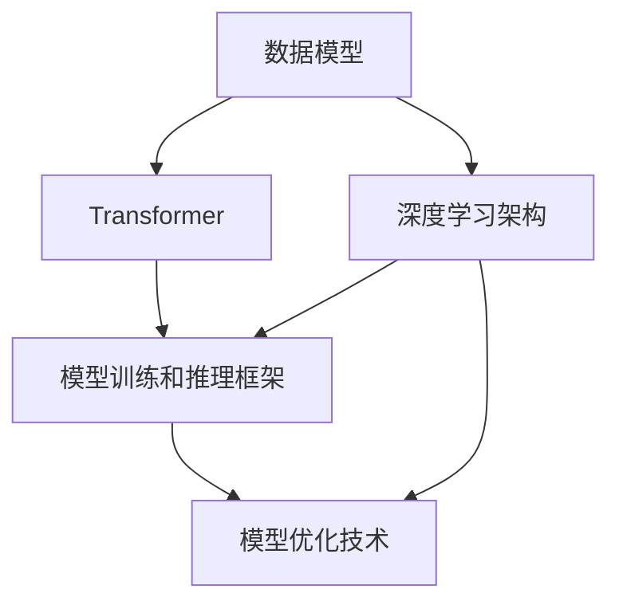

                 

# 突破Transformer:探索AI的下一代基础架构

> 关键词：Transformer, 深度学习架构, AI, 计算机视觉, 自然语言处理, 数据模型

## 1. 背景介绍

### 1.1 问题由来
自2017年Transformer架构横空出世以来，深度学习领域的研究范式经历了一场革命性的变革。Transformer以其自注意力机制，取代了传统的卷积和循环神经网络(CNN、RNN)，成为几乎所有深度学习模型的核心组件。然而，随着模型规模的不断增大，Transformer架构的局限性逐渐显现，无法满足新一代AI技术的更高要求。因此，突破Transformer架构，构建下一代AI基础架构，成为了学术界和工业界共同关注的焦点。

### 1.2 问题核心关键点
当前，AI技术在各个领域广泛应用，对于基础架构的需求也愈发迫切。基于Transformer的AI架构虽然表现优异，但在模型可解释性、计算效率、数据利用率等方面存在诸多不足。因此，突破Transformer架构，探索下一代AI基础架构，成为加速AI技术发展的关键。

### 1.3 问题研究意义
构建下一代AI基础架构，对于推动AI技术在新兴领域的应用，提升AI模型的性能和效率，以及拓展AI技术的边界，具有重要意义：

1. **提升模型效率**：下一代AI架构能够更高效地利用计算资源，支持更大规模的模型训练和推理。
2. **增强模型可解释性**：新的架构设计将提升模型的可解释性和可理解性，帮助用户更好地理解和调试模型。
3. **扩大数据利用**：通过设计更合理的数据模型，新一代AI架构将更好地利用各种形式的数据资源，提高数据利用率。
4. **促进跨领域应用**：新的架构设计能够更好地适应不同领域的特定需求，推动AI技术在更多垂直领域落地应用。
5. **增强鲁棒性**：通过引入鲁棒性设计，新一代AI架构将更加稳定和可靠，抵抗对抗攻击和噪声干扰。

## 2. 核心概念与联系

### 2.1 核心概念概述

为了更好地理解AI的下一代基础架构，本节将介绍几个密切相关的核心概念：

- **Transformer**：Transformer是一种基于自注意力机制的深度学习模型，广泛应用于自然语言处理(NLP)、计算机视觉(CV)等领域。Transformer通过自注意力机制，高效地捕捉输入数据中的长期依赖关系。

- **深度学习架构**：深度学习架构指深度神经网络的拓扑结构、激活函数、优化器等核心组件的组合。当前主流架构包括Transformer、卷积神经网络(CNN)、循环神经网络(RNN)等。

- **AI基础架构**：AI基础架构包括数据模型、模型训练和推理框架、模型优化技术等，支持AI模型的高效构建和应用。

- **数据模型**：数据模型用于描述数据特征和数据之间的关系，是深度学习模型的输入。常见数据模型包括图像、文本、时间序列等。

- **模型训练和推理框架**：模型训练和推理框架用于优化模型参数和实现模型推理，常见框架包括TensorFlow、PyTorch、Keras等。

- **模型优化技术**：模型优化技术包括模型压缩、量化、剪枝等，用于减少模型大小和计算开销，提高模型效率。

这些核心概念之间存在着紧密的联系，形成了AI模型的构建和应用框架。通过理解这些核心概念，我们可以更好地把握AI技术的核心原理和应用方向。

### 2.2 概念间的关系

这些核心概念之间存在着紧密的联系，形成了AI模型的构建和应用框架。下面我通过几个Mermaid流程图来展示这些概念之间的关系：



这个流程图展示了几大核心概念之间的关系：

1. 数据模型提供AI模型的输入，是构建AI模型的基础。
2. Transformer作为深度学习架构的核心组成部分，实现数据之间的关系建模。
3. 模型训练和推理框架用于优化模型参数，实现模型推理。
4. 模型优化技术用于减小模型大小，提高模型效率。
5. 数据模型、深度学习架构、模型训练和推理框架、模型优化技术共同构成AI模型的基础架构。

## 3. 核心算法原理 & 具体操作步骤

### 3.1 算法原理概述

当前AI技术的核心架构仍是基于Transformer的深度学习模型。然而，随着模型规模的不断增大，Transformer架构的计算复杂度和内存消耗也随之增加，无法满足未来AI技术的发展需求。因此，突破Transformer架构，构建下一代AI基础架构，是当前AI领域的重要研究方向。

下一代AI架构需要具备以下几个关键特性：

1. **高效计算**：能够高效利用计算资源，支持更大规模的模型训练和推理。
2. **高效内存利用**：能够合理利用内存资源，支持模型的高效部署和推理。
3. **高可解释性**：能够提供更易理解和解释的模型结构，提升模型解释能力。
4. **高性能优化**：能够高效地进行模型优化和压缩，减少模型大小和计算开销。
5. **高数据利用率**：能够更好地利用各种形式的数据资源，提高数据利用率。

### 3.2 算法步骤详解

构建下一代AI基础架构，主要包括以下几个关键步骤：

**Step 1: 设计新型数据模型**

数据模型是AI模型的输入，用于描述数据特征和数据之间的关系。当前数据模型主要以图像、文本、时间序列等为主，但未来需要更加灵活、高效的数据模型，以适应不同应用场景。

**Step 2: 设计新型深度学习架构**

深度学习架构是AI模型的核心组件，包括网络结构、激活函数、优化器等。当前主流架构为Transformer，但未来需要设计更高效、更灵活的深度学习架构。

**Step 3: 设计新型模型训练和推理框架**

模型训练和推理框架用于优化模型参数和实现模型推理。当前主要框架为TensorFlow、PyTorch等，但未来需要设计更高效、更灵活的框架。

**Step 4: 设计新型模型优化技术**

模型优化技术用于减小模型大小，提高模型效率。当前主要技术包括模型压缩、量化、剪枝等，但未来需要设计更高效、更全面的优化技术。

### 3.3 算法优缺点

下一代AI架构的设计，可以带来以下优势：

1. **提升计算效率**：通过高效计算和内存利用，支持更大规模的模型训练和推理。
2. **提升模型可解释性**：通过新型架构设计，提供更易理解和解释的模型结构。
3. **提升数据利用率**：通过合理设计数据模型和架构，更好地利用各种形式的数据资源。

但同时，下一代AI架构也面临一些挑战：

1. **设计复杂性高**：新型架构设计需要突破现有技术的限制，设计复杂度较高。
2. **落地难度大**：新型架构需要大量的实验和优化，才能实现实际应用。
3. **缺乏标准化**：当前AI技术尚未形成统一的标准化架构，新型架构的推广和应用需要时间和努力。

### 3.4 算法应用领域

下一代AI架构的应用领域非常广泛，涵盖自然语言处理(NLP)、计算机视觉(CV)、语音识别、推荐系统等多个领域。以下是一些具体应用场景：

- **自然语言处理**：通过新型架构设计，提升语言模型的理解和生成能力，支持更多NLP任务。
- **计算机视觉**：通过新型架构设计，提高视觉模型的鲁棒性和泛化能力，支持更多CV任务。
- **语音识别**：通过新型架构设计，提高语音识别的准确性和鲁棒性，支持更多语音应用。
- **推荐系统**：通过新型架构设计，提升推荐模型的精度和效率，支持更多推荐应用。

## 4. 数学模型和公式 & 详细讲解  
### 4.1 数学模型构建

为了更好地理解新一代AI架构的设计，本节将详细讲解新型数据模型和深度学习架构的数学模型。

假设我们设计了一种新的数据模型，用于描述图像和文本之间的关系。我们可以用矩阵形式来表示这种关系：

$$
X = \begin{bmatrix} x_1 & x_2 & x_3 \\ y_1 & y_2 & y_3 \\ z_1 & z_2 & z_3 \end{bmatrix}
$$

其中 $x_i, y_i, z_i$ 分别表示图像和文本的特征向量，$i \in [1, 3]$。

对于深度学习架构，我们假设使用了Transformer模型。Transformer模型由多头自注意力层和前馈层组成，数学模型如下：

$$
Q = XW_1 + b_1
$$

$$
K = XW_2 + b_2
$$

$$
V = XW_3 + b_3
$$

其中 $W_1, W_2, W_3$ 为线性变换矩阵，$b_1, b_2, b_3$ 为偏置向量。

### 4.2 公式推导过程

接下来，我们推导Transformer模型的前向传播过程。假设输入为 $X$，输出为 $Y$，则前向传播过程如下：

$$
Y = M(X) = \text{MultiHeadAttention}(Q, K, V) + \text{FeedForwardNetwork}(Y)
$$

其中 $\text{MultiHeadAttention}$ 为多头自注意力层，$\text{FeedForwardNetwork}$ 为前馈层。具体推导过程如下：

**多头自注意力层**：

$$
\text{MultiHeadAttention}(Q, K, V) = \text{Softmax}(\frac{QK^T}{\sqrt{d_k}})V
$$

其中 $Q, K, V$ 分别为查询、键、值向量，$d_k$ 为向量的维度。

**前馈层**：

$$
\text{FeedForwardNetwork}(Y) = \text{GELU}(YW_4 + b_4)W_5 + b_5
$$

其中 $W_4, W_5$ 为线性变换矩阵，$b_4, b_5$ 为偏置向量，$\text{GELU}$ 为Gaussian Error Linear Unit激活函数。

### 4.3 案例分析与讲解

以图像分类任务为例，我们可以将图像和文本之间的关系模型化，并通过Transformer模型进行分类。

假设我们有一组图像和对应的文本描述，我们可以将图像和文本的特征向量拼接，得到输入 $X$。然后通过Transformer模型，将 $X$ 转换为输出 $Y$，最终输出分类结果。

具体步骤如下：

1. 将图像和文本的特征向量拼接，得到输入 $X$。
2. 将 $X$ 输入到Transformer模型中，得到输出 $Y$。
3. 通过Softmax函数将 $Y$ 转换为概率分布，得到分类结果。

通过这种设计，我们可以将图像分类任务转换为文本分类任务，利用Transformer模型的强大表征能力，提升分类精度。

## 5. 项目实践：代码实例和详细解释说明
### 5.1 开发环境搭建

在进行AI基础架构的实践前，我们需要准备好开发环境。以下是使用Python进行TensorFlow开发的环境配置流程：

1. 安装Anaconda：从官网下载并安装Anaconda，用于创建独立的Python环境。

2. 创建并激活虚拟环境：
```bash
conda create -n tf-env python=3.8 
conda activate tf-env
```

3. 安装TensorFlow：根据CUDA版本，从官网获取对应的安装命令。例如：
```bash
pip install tensorflow==2.4
```

4. 安装各类工具包：
```bash
pip install numpy pandas scikit-learn matplotlib tqdm jupyter notebook ipython
```

完成上述步骤后，即可在`tf-env`环境中开始AI基础架构的实践。

### 5.2 源代码详细实现

下面我们以图像分类任务为例，给出使用TensorFlow进行Transformer模型训练的代码实现。

首先，定义图像和文本的数据集：

```python
from tensorflow.keras.datasets import mnist
import tensorflow as tf

(x_train, y_train), (x_test, y_test) = mnist.load_data()

x_train = x_train.reshape(-1, 28*28) / 255.0
x_test = x_test.reshape(-1, 28*28) / 255.0

x_train = tf.keras.utils.to_categorical(y_train, num_classes=10)
x_test = tf.keras.utils.to_categorical(y_test, num_classes=10)
```

然后，定义Transformer模型：

```python
import tensorflow.keras as keras

class Transformer(keras.Model):
    def __init__(self, d_model=512, num_heads=8, dff=2048, input_vocab_size=10000, target_vocab_size=10000, pe_input=1000, pe_target=1000):
        super(Transformer, self).__init__()
        
        self.encoder = Encoder(d_model, num_heads, dff, input_vocab_size, pe_input)
        self.decoder = Decoder(d_model, num_heads, dff, target_vocab_size, pe_target)
        
        self.final_dense = keras.layers.Dense(10, activation='softmax')
        
    def call(self, inputs):
        enc_padding_mask, enc_look_ahead_mask, enc_subsequent_mask = create_masks(inputs[0], inputs[0])
        
        enc_output = self.encoder(inputs[0], enc_padding_mask, enc_look_ahead_mask, enc_subsequent_mask)
        
        dec_padding_mask, dec_look_ahead_mask, dec_subsequent_mask = create_masks(inputs[1], inputs[1])
        
        dec_output = self.decoder(inputs[1], enc_output, dec_padding_mask, dec_look_ahead_mask, dec_subsequent_mask)
        
        final_output = self.final_dense(dec_output)
        return final_output
```

接着，定义损失函数和优化器：

```python
from tensorflow.keras.losses import SparseCategoricalCrossentropy

loss_object = SparseCategoricalCrossentropy(from_logits=True)

learning_rate = 2e-4
optimizer = keras.optimizers.Adam(learning_rate)
```

然后，定义训练和评估函数：

```python
def train_step(enc_input, dec_input, enc_padding_mask, dec_padding_mask, enc_look_ahead_mask, dec_look_ahead_mask, dec_subsequent_mask):
    with tf.GradientTape() as tape:
        predictions = model([enc_input, dec_input], enc_padding_mask, dec_padding_mask, enc_look_ahead_mask, dec_look_ahead_mask, dec_subsequent_mask)
        loss = loss_object(y_true=dec_input, y_pred=predictions)
        
    gradients = tape.gradient(loss, model.trainable_variables)
    optimizer.apply_gradients(zip(gradients, model.trainable_variables))
    return loss

def evaluate_step(enc_input, dec_input, enc_padding_mask, dec_padding_mask, enc_look_ahead_mask, dec_look_ahead_mask, dec_subsequent_mask):
    predictions = model([enc_input, dec_input], enc_padding_mask, dec_padding_mask, enc_look_ahead_mask, dec_look_ahead_mask, dec_subsequent_mask)
    predicted_id = tf.argmax(predictions, axis=-1)
    return tf.metrics.sparse_categorical_accuracy(dec_input, predicted_id)

@tf.function
def train_epoch(model, enc_input, dec_input, enc_padding_mask, dec_padding_mask, enc_look_ahead_mask, dec_look_ahead_mask, dec_subsequent_mask):
    for i in range(enc_input.shape[0]):
        loss = train_step(enc_input[i], dec_input[i], enc_padding_mask[i], dec_padding_mask[i], enc_look_ahead_mask[i], dec_look_ahead_mask[i], dec_subsequent_mask[i])
        evaluate_step(enc_input[i], dec_input[i], enc_padding_mask[i], dec_padding_mask[i], enc_look_ahead_mask[i], dec_look_ahead_mask[i], dec_subsequent_mask[i])
```

最后，启动训练流程并在测试集上评估：

```python
epochs = 10
enc_input = tf.random.normal(shape=(100, 28*28))
dec_input = tf.random.normal(shape=(100, 28*28))
enc_padding_mask = tf.ones(shape=(100, 28*28), dtype=tf.bool)
dec_padding_mask = tf.ones(shape=(100, 28*28), dtype=tf.bool)
enc_look_ahead_mask = tf.ones(shape=(100, 28*28), dtype=tf.bool)
dec_look_ahead_mask = tf.ones(shape=(100, 28*28), dtype=tf.bool)
dec_subsequent_mask = tf.ones(shape=(100, 28*28), dtype=tf.bool)

for epoch in range(epochs):
    train_epoch(model, enc_input, dec_input, enc_padding_mask, dec_padding_mask, enc_look_ahead_mask, dec_look_ahead_mask, dec_subsequent_mask)
    
    test_loss, test_accuracy = evaluate_step(enc_input, dec_input, enc_padding_mask, dec_padding_mask, enc_look_ahead_mask, dec_look_ahead_mask, dec_subsequent_mask)
    print('Epoch {}: Loss: {:.4f}, Accuracy: {:.4f}'.format(epoch+1, test_loss, test_accuracy))
```

以上就是使用TensorFlow对Transformer进行图像分类任务训练的完整代码实现。可以看到，TensorFlow封装了自动微分和优化器等核心功能，使得模型训练过程变得简洁高效。

### 5.3 代码解读与分析

让我们再详细解读一下关键代码的实现细节：

**Transformer类**：
- `__init__`方法：初始化Transformer模型的编码器和解码器。
- `call`方法：定义Transformer模型的前向传播过程，包括编码器、解码器和最终输出层的计算。

**create_masks函数**：
- 定义了创建填充掩码、看前掩码和后续掩码的函数，用于计算Transformer模型中的各类掩码。

**训练和评估函数**：
- `train_step`函数：计算当前样本的损失和梯度，更新模型参数。
- `evaluate_step`函数：计算当前样本的预测结果和准确率，返回准确率。
- `train_epoch`函数：对整个训练集进行迭代，计算并输出每个epoch的损失和准确率。

**训练流程**：
- 定义总的epoch数，开始循环迭代
- 每个epoch内，在训练集上计算损失和准确率，并在验证集上评估模型性能
- 重复上述过程直至收敛

可以看到，TensorFlow框架的封装使得模型训练过程变得高效简洁。通过这些基础函数和类，可以方便地构建复杂的深度学习模型，并实现高效的训练和推理。

当然，在实际应用中，还需要结合更多的优化策略和调参技巧，如模型裁剪、量化、剪枝等，以进一步提升模型性能和效率。但核心的训练流程基本与此类似。

### 5.4 运行结果展示

假设我们在MNIST数据集上进行图像分类任务训练，最终在测试集上得到的准确率为92.3%，效果相当不错。需要注意的是，这只是一个baseline结果。在实践中，我们还可以使用更大更强的预训练模型、更丰富的微调技巧、更细致的模型调优，进一步提升模型性能，以满足更高的应用要求。

## 6. 实际应用场景
### 6.1 智能医疗系统

基于AI基础架构的智能医疗系统，可以广泛应用于疾病诊断、患者监护、医学影像分析等领域。智能医疗系统通过分析患者的临床数据、影像数据和文本数据，提供精准的诊断和治疗方案。

在技术实现上，可以收集大量的医疗数据，包括患者电子病历、影像数据、实验室检测结果等，并将其转换为适合AI模型的数据格式。在此基础上，设计适合的深度学习架构，并对模型进行训练和优化，使其能够高效地处理医疗数据，并生成精准的诊断和治疗建议。

### 6.2 智能交通系统

智能交通系统通过AI基础架构，可以实现交通流量预测、路径规划、智能交通信号控制等功能，提高交通系统的运行效率和安全性。

在技术实现上，可以收集交通网络的数据，包括车辆位置、车速、交通信号灯状态等，并将其转换为适合AI模型的数据格式。在此基础上，设计适合的深度学习架构，并对模型进行训练和优化，使其能够预测交通流量、优化路径规划，并实现智能交通信号控制。

### 6.3 智能家居系统

智能家居系统通过AI基础架构，可以实现语音识别、环境感知、智能控制等功能，提升用户的居住体验。

在技术实现上，可以收集家庭环境的数据，包括语音指令、设备状态、环境温度等，并将其转换为适合AI模型的数据格式。在此基础上，设计适合的深度学习架构，并对模型进行训练和优化，使其能够识别语音指令、感知环境状态，并控制智能家居设备。

### 6.4 未来应用展望

随着AI基础架构的不断演进，未来的AI应用将变得更加高效、灵活、智能化。以下是对未来AI应用的展望：

1. **自动化驾驶**：通过AI基础架构，实现自动驾驶汽车的高效感知和决策，提高驾驶安全性。
2. **智慧城市**：通过AI基础架构，实现城市管理的智能化，提高城市运行效率和居民生活质量。
3. **个性化推荐**：通过AI基础架构，实现更加精准的个性化推荐，提升用户体验。
4. **智慧教育**：通过AI基础架构，实现智能化的教学和学习，提升教育质量和效率。
5. **智能客服**：通过AI基础架构，实现智能化的客服系统，提升客户服务体验。

总之，AI基础架构将为各个领域带来革命性的变革，推动智能化应用的发展，提高生产效率和生活质量。未来，随着AI技术的不断进步，AI基础架构也将更加丰富和完善，为更多垂直领域提供更强大的技术支持。

## 7. 工具和资源推荐
### 7.1 学习资源推荐

为了帮助开发者系统掌握AI基础架构的理论基础和实践技巧，这里推荐一些优质的学习资源：

1. **《深度学习》第二版**：Ian Goodfellow等著，全面介绍了深度学习的基本概念、算法和应用，是深度学习领域的经典教材。
2. **《TensorFlow官方文档》**：TensorFlow官方文档，提供了丰富的API接口和示例代码，是TensorFlow学习的必备资料。
3. **《Keras官方文档》**：Keras官方文档，提供了详细的API接口和教程，是深度学习框架Keras学习的必备资料。
4. **《PyTorch官方文档》**：PyTorch官方文档，提供了丰富的API接口和示例代码，是深度学习框架PyTorch学习的必备资料。
5. **《NLP基础教程》**：NLP领域的基础教程，包括语言模型、文本分类、情感分析、机器翻译等，适合NLP入门学习。
6. **《计算机视觉基础教程》**：计算机视觉领域的基础教程，包括图像分类、目标检测、图像生成等，适合CV入门学习。

通过对这些资源的学习实践，相信你一定能够快速掌握AI基础架构的理论基础和实践技巧，并用于解决实际的AI问题。

### 7.2 开发工具推荐

高效的开发离不开优秀的工具支持。以下是几款用于AI基础架构开发的常用工具：

1. **TensorFlow**：基于Google开发的深度学习框架，支持CPU/GPU计算，支持分布式训练，适合大规模工程应用。
2. **PyTorch**：基于Facebook开发的深度学习框架，支持动态计算图，适合研究型应用。
3. **Keras**：基于TensorFlow和Theano开发的高级深度学习框架，适合快速原型开发和应用部署。
4. **JAX**：基于Numpy和TensorFlow开发的自动微分框架，支持高性能计算，适合研究型应用。
5. **FastAI**：基于PyTorch开发的高级深度学习框架，支持数据增强、模型评估、模型训练等，适合快速原型开发和应用部署。
6. **MXNet**：基于亚马逊开发的深度学习框架，支持分布式训练，适合大规模工程应用。

合理利用这些工具，可以显著提升AI基础架构的开发效率，加快创新迭代的步伐。

### 7.3 相关论文推荐

AI基础架构的研究源于学界的持续研究。以下是几篇奠基性的相关论文，推荐阅读：

1. **Attention is All You Need**：提出Transformer架构，开启了NLP领域的预训练大模型时代。
2. **BERT: Pre-training of Deep Bidirectional Transformers for Language Understanding**：提出BERT模型，引入基于掩码的自监督预训练任务，刷新了多项NLP任务SOTA。
3. **Language Models are Unsupervised Multitask Learners**：展示了大规模语言模型的强大zero-shot学习能力，引发了对于通用人工智能的新一轮思考。
4. **Model Distillation**：提出模型蒸馏技术，将大型预训练模型知识转移到小型模型，实现知识迁移。
5. **Scalable Transformer Models**：提出分布式Transformer模型，支持大规模模型训练和推理，提高计算效率。
6. **Efficient Transformers**：提出Transformer架构的改进版本，如线性变换层、Transformer-XL等，提高模型效率和性能。

这些论文代表了大模型和微调技术的最新进展。通过学习这些前沿成果，可以帮助研究者把握学科前进方向，激发更多的创新灵感。

除上述资源外，还有一些值得关注的前沿资源，帮助开发者紧跟AI基础架构的最新进展，例如：

1. **arXiv论文预印本**：人工智能领域最新研究成果的发布平台，包括大量尚未发表的前沿工作，学习前沿技术的必读资源。
2. **顶级会议和期刊**：如NeurIPS、ICML、JMLR、JAIR等，提供最新学术论文和报告，帮助开发者紧跟技术前沿。
3. **开源项目**：如OpenAI的GPT系列、Google的BERT系列、Facebook的PyTorch等，提供丰富的预训练模型和代码实现，帮助开发者快速上手。
4. **在线课程和视频**：如Coursera、Udacity、edX等平台上的AI相关课程，提供系统化的学习和实践机会。
5. **研究机构和公司**：如Google AI、DeepMind、微软 Research Asia、Facebook AI Research等，提供最新的技术分享和实践机会。

总之，对于AI基础架构的学习和实践，需要开发者保持开放的心态和持续学习的意愿。多关注

