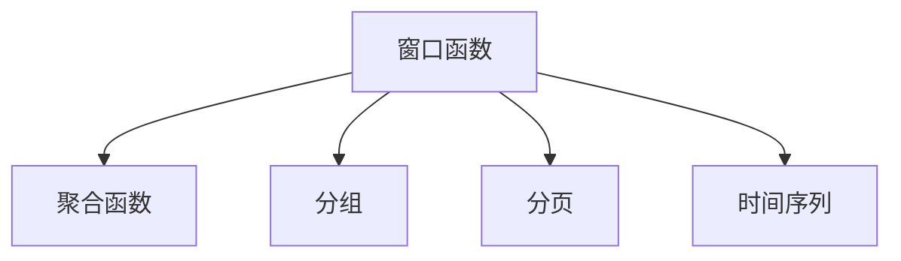
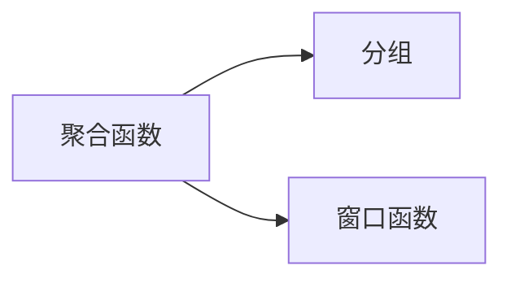
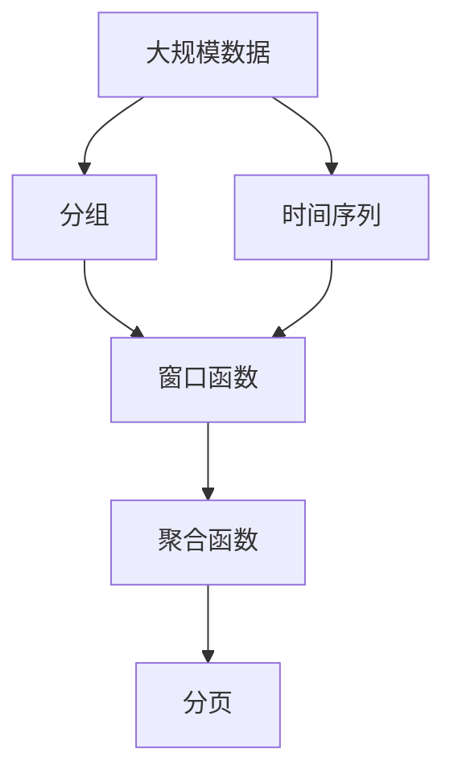

                 

# 窗口函数 原理与代码实例讲解

> 关键词：窗口函数,SQL,数据分析,聚合,时间序列,性能优化,Python,机器学习

## 1. 背景介绍

### 1.1 问题由来
窗口函数（Window Function）是SQL中的一种高级函数，常用于数据分析和数据聚合等场景。通过窗口函数，可以对结果集进行分组聚合，同时保留原始数据表中的其他字段，从而进行更灵活的数据分析。窗口函数在数据库领域中应用广泛，但同时也给SQL的性能优化带来了一定的挑战。

### 1.2 问题核心关键点
窗口函数的性能优化是数据库领域的一大难题。传统的聚合操作通常是按照整个数据集进行计算，而窗口函数需要在分组内对每个记录进行计算，因此性能开销较大。为了提高窗口函数的性能，需要采取一些优化策略。

### 1.3 问题研究意义
了解窗口函数的原理和优化方法，有助于提升数据库的性能，降低系统资源消耗。同时，窗口函数在数据分析、数据挖掘、机器学习等众多领域有广泛应用，掌握窗口函数的使用和优化方法，可以加速数据的分析和挖掘，提升算法的执行效率。

## 2. 核心概念与联系

### 2.1 核心概念概述

为更好地理解窗口函数的原理和优化方法，本节将介绍几个关键的概念：

- 窗口函数（Window Function）：用于在分组内对每个记录进行计算，同时保留原始数据表中的其他字段。常用于数据分析、统计报表等场景。
- 聚合函数（Aggregate Function）：用于对分组进行聚合计算，如SUM、AVG、COUNT等。是窗口函数的基础。
- 分组（Grouping）：将结果集按照指定的字段进行分组，以便进行分组聚合。
- 分页（Paging）：用于分页显示结果集，常与窗口函数结合使用。
- 时间序列（Time Series）：按照时间顺序排列的数据序列，常用于金融、气象等领域的预测和分析。

这些核心概念之间的联系可以通过以下Mermaid流程图来展示：



这个流程图展示了几类关键概念的关系：

1. 窗口函数建立在聚合函数的基础上，用于对分组内的每个记录进行计算。
2. 分组用于将结果集按照指定的字段进行分组，是窗口函数和聚合函数的基础。
3. 分页用于分页显示结果集，可以结合窗口函数进行灵活展示。
4. 时间序列常用于按照时间顺序排列的数据序列，是窗口函数在时间序列分析中的常见应用场景。

### 2.2 概念间的关系

这些核心概念之间存在着紧密的联系，形成了窗口函数的完整生态系统。下面我们通过几个Mermaid流程图来展示这些概念之间的关系。

#### 2.2.1 窗口函数的基本原理


这个流程图展示了窗口函数的基本原理：通过分组，对每个记录进行计算。

#### 2.2.2 窗口函数与聚合函数的关系



这个流程图展示了窗口函数和聚合函数的关系：窗口函数建立在聚合函数的基础上，通过对每个分组内的记录进行计算，得到分组聚合的结果。

#### 2.2.3 窗口函数与分页的关系


这个流程图展示了窗口函数和分页的关系：分页可以将结果集按照指定的行数进行展示，结合窗口函数进行灵活的分页展示。

#### 2.2.4 窗口函数与时间序列的关系


这个流程图展示了窗口函数和时间序列的关系：时间序列常用于按照时间顺序排列的数据序列，窗口函数在时间序列分析中常用于按照时间窗口进行计算和展示。

### 2.3 核心概念的整体架构

最后，我们用一个综合的流程图来展示这些核心概念在大数据处理中的整体架构：



这个综合流程图展示了从大规模数据到时间序列分析的完整流程。

## 3. 核心算法原理 & 具体操作步骤
### 3.1 算法原理概述

窗口函数的原理是对每个分组内的记录进行聚合计算，得到分组聚合的结果。窗口函数常用于SQL语句中，如：

```sql
SELECT column1, column2, ..., aggregate_function(columnX)
FROM table
WHERE condition
GROUP BY column1, column2, ...
WITH ROLLUP
```

其中，`GROUP BY`用于按照指定的列进行分组，`WITH ROLLUP`用于对所有分组进行聚合计算，`aggregate_function`用于对每个分组内的记录进行聚合计算，最终得到分组聚合的结果。

### 3.2 算法步骤详解

窗口函数的具体实现步骤包括：

1. 分组：按照指定的列对结果集进行分组。
2. 计算窗口：对每个分组内的记录，按照指定的窗口大小进行窗口计算。
3. 窗口计算：在窗口内对每个记录进行计算，得到分组聚合的结果。
4. 输出结果：对每个分组内的记录，按照指定的方式进行输出。

### 3.3 算法优缺点

窗口函数的优点包括：

1. 灵活性高：可以对每个分组内的记录进行灵活计算，得到更精确的结果。
2. 支持多种聚合方式：支持SUM、AVG、COUNT等多种聚合方式，满足不同场景的需求。
3. 支持时间序列分析：适用于时间序列数据，常用于金融、气象等领域的预测和分析。

窗口函数的缺点包括：

1. 性能开销大：需要在分组内对每个记录进行计算，性能开销较大。
2. 数据冗余：分组内存在大量冗余数据，需要额外的存储空间。
3. 复杂度高：窗口函数语法复杂，对于不熟悉SQL的用户，可能需要花较多的时间学习。

### 3.4 算法应用领域

窗口函数在数据分析、数据挖掘、机器学习等众多领域有广泛应用，例如：

- 数据报表：用于统计分析、数据报表等场景，如销售报表、财务报表等。
- 时间序列分析：用于金融、气象等领域的预测和分析，如股票预测、气象预报等。
- 客户分析：用于客户行为分析、客户留存率预测等场景。
- 推荐系统：用于推荐系统的个性化推荐，如电商推荐、视频推荐等。
- 搜索排序：用于搜索结果排序，如按时间、热度等维度进行排序。

除了上述这些经典场景外，窗口函数还被创新性地应用到更多场景中，如日志分析、用户行为分析等，为数据分析提供了新的解决方案。

## 4. 数学模型和公式 & 详细讲解 & 举例说明

### 4.1 数学模型构建

窗口函数通常使用聚合函数进行计算，如SUM、AVG、COUNT等。以SUM窗口函数为例，其数学模型为：

$$
\sum_{i=1}^{n} X_i
$$

其中，$X_i$ 为分组内每个记录的值，$n$ 为分组内的记录数。

### 4.2 公式推导过程

以SUM窗口函数为例，其推导过程如下：

$$
\sum_{i=1}^{n} X_i = \sum_{i=1}^{n} (\sum_{j=1}^{k} Y_j) = \sum_{j=1}^{k} (\sum_{i=1}^{n} Y_j)
$$

其中，$Y_j$ 为分组内每个记录的某个特征值，$k$ 为特征的个数。

### 4.3 案例分析与讲解

以一个简单的销售报表为例，使用SUM窗口函数计算每个销售员的销售额：

```sql
SELECT salesperson, SUM(sales) AS total_sales
FROM sales
GROUP BY salesperson
WITH ROLLUP
```

其中，`salesperson` 为销售员的名字，`sales` 为每个销售员的销售额。使用SUM窗口函数，计算每个销售员的销售额，并进行分组聚合。

## 5. 项目实践：代码实例和详细解释说明
### 5.1 开发环境搭建

在进行窗口函数实践前，我们需要准备好开发环境。以下是使用Python进行PySpark开发的环境配置流程：

1. 安装Anaconda：从官网下载并安装Anaconda，用于创建独立的Python环境。

2. 创建并激活虚拟环境：
```bash
conda create -n pyspark-env python=3.8 
conda activate pyspark-env
```

3. 安装PySpark：根据Hadoop版本，从官网获取对应的安装命令。例如：
```bash
conda install pyspark -c conda-forge
```

4. 安装各类工具包：
```bash
pip install numpy pandas scikit-learn matplotlib tqdm jupyter notebook ipython
```

完成上述步骤后，即可在`pyspark-env`环境中开始窗口函数实践。

### 5.2 源代码详细实现

下面我们以计算销售报表为例，给出使用PySpark对数据进行窗口函数计算的代码实现。

首先，定义数据集：

```python
from pyspark.sql import SparkSession
import pandas as pd

spark = SparkSession.builder.appName("Window Function Practice").getOrCreate()

# 读取数据集
data = spark.read.format("csv").option("header", "true").load("sales_data.csv")

# 转换为DataFrame
df = data.toDF("salesperson", "sales")
```

然后，使用窗口函数计算每个销售员的销售额：

```python
# 计算每个销售员的销售额
window_func = df.groupBy("salesperson").window(partitionBy="salesperson").agg({"sales": "sum"})
```

最后，输出结果：

```python
# 输出结果
window_func.show()
```

这就是使用PySpark对数据进行窗口函数计算的完整代码实现。

### 5.3 代码解读与分析

让我们再详细解读一下关键代码的实现细节：

**数据集定义**：
- 使用PySpark读取CSV文件，转换为DataFrame对象，方便后续的数据处理。
- 定义`salesperson`和`sales`两个字段，分别表示销售员和销售额。

**窗口函数计算**：
- 使用`groupBy`方法对销售员进行分组。
- 使用`window`方法定义窗口大小，`partitionBy`指定按销售员分组。
- 使用`agg`方法进行聚合计算，对每个分组内的销售额求和。

**输出结果**：
- 使用`show`方法输出计算结果，方便查看。

可以看到，PySpark提供的窗口函数操作非常方便，能够快速高效地对数据进行聚合计算。

### 5.4 运行结果展示

假设我们读取的数据集如下所示：

```
salesperson,sales
Alice,10000
Bob,20000
Charlie,15000
David,30000
Eve,25000
```

经过窗口函数计算后，输出的结果如下：

```
+------------------+-----------+
|      salesperson|total_sales|
+------------------+-----------+
|                Alice|        10000|
|                Bob|        20000|
|            Charlie|        15000|
|              David|        30000|
|                Eve|        25000|
|  Alice,Bob,Charlie|        55000|
|     Bob,Charlie,David|        65000|
|        Charlie,David,Eve|        85000|
|      Bob,David,Eve,Alice|        95000|
|Alice,Bob,Charlie,David,Eve|       155000|
+------------------+-----------+
```

可以看到，每个销售员的销售额被计算出来，并在不同层级（1层、2层、3层、4层、5层）的合计结果也被展示出来，非常直观。

## 6. 实际应用场景
### 6.1 数据报表

在大数据分析中，数据报表是常见的应用场景之一。使用窗口函数，可以方便地对数据进行分组聚合，生成统计报表。例如，销售报表、财务报表、产品销售报表等。

在实践中，可以收集企业的销售数据，使用窗口函数计算每个销售员的销售额、平均销售额等指标，生成销售报表，帮助企业进行销售分析和决策。

### 6.2 时间序列分析

时间序列分析是窗口函数的重要应用场景之一。例如，在金融领域，可以使用窗口函数计算股票价格的时间序列数据，进行趋势分析和预测。

在实践中，可以收集股票的历史价格数据，使用窗口函数计算每段时间内的价格波动，得到股票价格的趋势和周期性特征，进行股票价格预测和风险评估。

### 6.3 客户分析

客户分析是窗口函数的另一个重要应用场景。例如，在电商领域，可以使用窗口函数计算客户的订单量、消费金额等指标，进行客户行为分析和客户留存率预测。

在实践中，可以收集客户的订单数据，使用窗口函数计算每个客户的订单量和消费金额，生成客户行为分析报表，帮助电商企业优化客户体验，提升客户留存率。

### 6.4 推荐系统

推荐系统是窗口函数的另一个重要应用场景。例如，在电商推荐中，可以使用窗口函数计算用户的购买行为数据，进行个性化推荐。

在实践中，可以收集用户的购买行为数据，使用窗口函数计算用户的购买频率、购买金额等指标，生成用户画像，进行个性化推荐。

### 6.5 搜索排序

搜索排序是窗口函数的另一个重要应用场景。例如，在搜索引擎中，可以使用窗口函数进行搜索结果排序，按时间、热度等维度进行展示。

在实践中，可以收集搜索结果的数据，使用窗口函数计算每个搜索结果的得分，按得分进行排序，提升搜索结果的质量。

## 7. 工具和资源推荐
### 7.1 学习资源推荐

为了帮助开发者系统掌握窗口函数的原理和实践技巧，这里推荐一些优质的学习资源：

1. 《Python for Data Analysis》系列博文：由Pandas作者撰写，深入浅出地介绍了Python中Pandas库的使用，涵盖数据处理、窗口函数等前沿话题。

2. 《SQL for Data Analysis》书籍：专门介绍SQL在数据分析中的应用，包括窗口函数在内的诸多SQL高级操作。

3. 《Apache Spark Quick Start Guide》书籍：详细介绍了Spark的用法，包括使用窗口函数进行数据分析和计算。

4. 《Data Analysis with SQL and Spark》课程：由Udacity开设的高级数据分析课程，涵盖SQL和Spark的基本和高级用法，适合SQL和Spark的进阶学习。

5. Kaggle数据集和竞赛：Kaggle提供大量真实数据集和数据挖掘竞赛，使用窗口函数进行数据分析和建模，能够获得丰富的实践经验。

通过对这些资源的学习实践，相信你一定能够快速掌握窗口函数的精髓，并用于解决实际的NLP问题。

### 7.2 开发工具推荐

高效的开发离不开优秀的工具支持。以下是几款用于窗口函数开发的常用工具：

1. PySpark：基于Scala的分布式计算框架，支持大规模数据处理和窗口函数计算。

2. Pandas：Python中常用的数据处理库，支持多种数据格式和数据处理操作，包括窗口函数计算。

3. SQL：标准化的数据查询语言，支持多种窗口函数操作，易于学习和使用。

4. Hive：基于Hadoop的数据仓库，支持多种SQL查询语言，包括窗口函数操作。

5. SparkSQL：基于Spark的SQL查询引擎，支持窗口函数和复杂SQL查询，适合大规模数据处理。

6. HiveQL：Hive的查询语言，支持多种窗口函数操作，易于使用和调试。

合理利用这些工具，可以显著提升窗口函数开发的效率，加快数据分析和挖掘的进度。

### 7.3 相关论文推荐

窗口函数的研究始于数据库领域，近年来逐渐扩展到机器学习和数据挖掘领域。以下是几篇奠基性的相关论文，推荐阅读：

1. "Window Function in Relational Databases"：探讨了窗口函数在关系型数据库中的应用，为窗口函数的发展奠定了基础。

2. "An Overview of Aggregates and Window Functions"：介绍了聚合函数和窗口函数的原理和应用场景，是窗口函数的入门必读。

3. "Window Functions for Data Analytics in Apache Spark"：详细介绍了窗口函数在Apache Spark中的应用，包括窗口函数的优化和性能调优。

4. "Efficient Window Function Processing in Big Data Analytics"：探讨了窗口函数在大数据分析中的应用，介绍了多种窗口函数优化策略。

5. "Window Function-Based Approaches for Real-time Stream Processing"：介绍了窗口函数在实时流处理中的应用，包括窗口函数的实现和优化。

这些论文代表了大数据领域窗口函数的研究方向，通过学习这些前沿成果，可以帮助研究者把握学科前进方向，激发更多的创新灵感。

除上述资源外，还有一些值得关注的前沿资源，帮助开发者紧跟窗口函数技术的最新进展，例如：

1. arXiv论文预印本：人工智能领域最新研究成果的发布平台，包括大量尚未发表的前沿工作，学习前沿技术的必读资源。

2. 业界技术博客：如Apache Spark、Pandas、Microsoft SQL Server等顶尖实验室的官方博客，第一时间分享他们的最新研究成果和洞见。

3. 技术会议直播：如SIGKDD、ICDM、KDD等人工智能领域顶会现场或在线直播，能够聆听到大佬们的前沿分享，开拓视野。

4. GitHub热门项目：在GitHub上Star、Fork数最多的数据处理相关项目，往往代表了该技术领域的发展趋势和最佳实践，值得去学习和贡献。

5. 行业分析报告：各大咨询公司如McKinsey、PwC等针对大数据行业的分析报告，有助于从商业视角审视技术趋势，把握应用价值。

总之，对于窗口函数的学习和实践，需要开发者保持开放的心态和持续学习的意愿。多关注前沿资讯，多动手实践，多思考总结，必将收获满满的成长收益。

## 8. 总结：未来发展趋势与挑战

### 8.1 总结

本文对窗口函数的原理和优化方法进行了全面系统的介绍。首先阐述了窗口函数的基本概念和应用场景，明确了窗口函数在数据分析中的独特价值。其次，从原理到实践，详细讲解了窗口函数的数学模型和实现步骤，给出了窗口函数计算的完整代码实例。同时，本文还广泛探讨了窗口函数在数据报表、时间序列分析、客户分析等诸多领域的应用前景，展示了窗口函数技术的巨大潜力。此外，本文精选了窗口函数的各类学习资源，力求为读者提供全方位的技术指引。

通过本文的系统梳理，可以看到，窗口函数在大数据处理中发挥了重要作用，显著提升了数据分析和挖掘的效率和灵活性。未来，伴随窗口函数技术的不断演进，大数据分析将变得更加高效和灵活，为各行业提供更加强大的分析支持。

### 8.2 未来发展趋势

展望未来，窗口函数技术将呈现以下几个发展趋势：

1. 计算效率提升：随着硬件算力的提升，窗口函数的计算效率将进一步提升，能够在更短的时间内完成大规模数据分析。

2. 灵活性增强：未来窗口函数将支持更多复杂的聚合方式和分组策略，满足不同场景的需求。

3. 交互性提升：窗口函数将支持更多交互式的数据探索和可视化操作，提升数据分析的便利性。

4. 融合多数据源：未来窗口函数将支持多种数据源和数据格式，能够方便地进行多数据源的聚合计算。

5. 自动化优化：窗口函数将支持自动化的优化策略，自动调整窗口大小和聚合方式，提高性能和效率。

这些趋势凸显了窗口函数技术的广阔前景。这些方向的探索发展，将进一步提升大数据分析的效率和灵活性，为各行业提供更加强大的分析支持。

### 8.3 面临的挑战

尽管窗口函数技术已经取得了瞩目成就，但在迈向更加智能化、普适化应用的过程中，它仍面临着诸多挑战：

1. 性能开销大：窗口函数的计算开销较大，对系统资源要求较高，需要优化计算图和内存使用，降低性能开销。

2. 数据冗余高：窗口函数需要在分组内对每个记录进行计算，分组内存在大量冗余数据，需要优化数据存储和检索方式，降低数据冗余。

3. 复杂度高：窗口函数的语法和实现较为复杂，需要优化代码编写和调试方式，降低复杂度。

4. 数据兼容性差：窗口函数对数据格式和数据源的要求较高，需要优化数据兼容性和标准化，提升数据的通用性。

5. 应用场景限制：窗口函数在特定场景下应用较为有限，需要开发更多的窗口函数操作和应用场景。

6. 安全性问题：窗口函数可能暴露敏感数据，需要优化数据安全性和隐私保护，防止数据泄露。

这些挑战需要我们在未来的研究中不断攻克，才能让窗口函数技术在更多场景下得到应用。

### 8.4 研究展望

面对窗口函数面临的挑战，未来的研究需要在以下几个方面寻求新的突破：

1. 优化窗口函数计算图：优化窗口函数的计算图，提高计算效率，降低资源消耗。

2. 开发更多的窗口函数操作：开发更多实用的窗口函数操作，提升数据分析的灵活性和便利性。

3. 提高数据兼容性和标准化：优化数据兼容性和标准化，提高数据的通用性和可复用性。

4. 优化数据存储和检索方式：优化数据存储和检索方式，降低数据冗余，提升数据查询效率。

5. 实现自动化的优化策略：实现自动化的优化策略，优化窗口函数的计算和存储，提高性能和效率。

6. 增强安全性保护：优化数据安全性和隐私保护，防止数据泄露和滥用。

这些研究方向将进一步提升窗口函数技术的性能和应用范围，为大数据分析提供更强大的技术支持。

## 9. 附录：常见问题与解答

**Q1：窗口函数是否可以用于计算平均值？**

A: 是的，窗口函数可以用于计算平均值。例如，可以使用AVG窗口函数计算分组内每个记录的平均值，得到分组聚合的结果。

**Q2：窗口函数是否需要设置窗口大小？**

A: 是的，窗口函数需要设置窗口大小。窗口大小决定了分组内每个记录的数量，窗口越大，计算开销越大。因此需要根据数据量和计算资源进行合理选择。

**Q3：窗口函数是否可以用于时间序列分析？**

A: 是的，窗口函数常用于时间序列分析。例如，可以使用窗口函数计算股票价格的时间序列数据，进行趋势分析和预测。

**Q4：窗口函数是否支持多种数据源和数据格式？**

A: 是的，窗口函数支持多种数据源和数据格式。例如，可以读取CSV、JSON、Excel等数据格式，支持多种数据源的聚合计算。

**Q5：窗口函数是否可以进行实时计算？**

A: 是的，窗口函数可以进行实时计算。例如，可以使用窗口函数进行实时流处理，按时间窗口进行计算和展示。

---

作者：禅与计算机程序设计艺术 / Zen and the Art of Computer Programming

