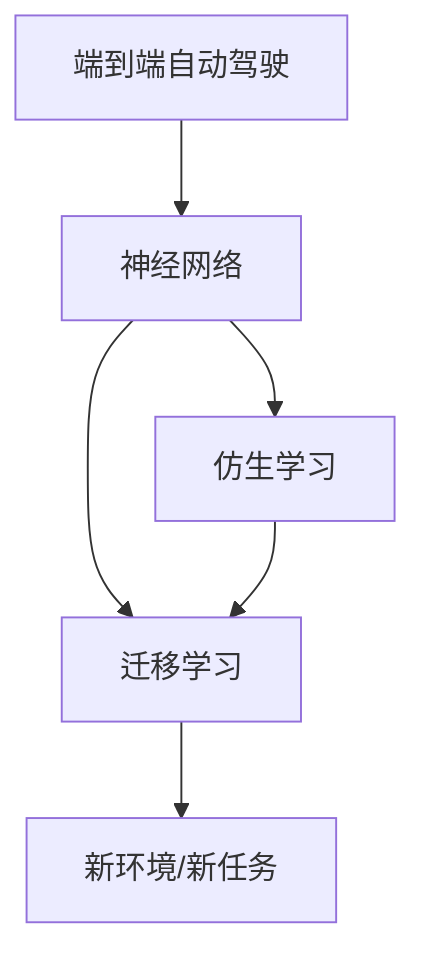
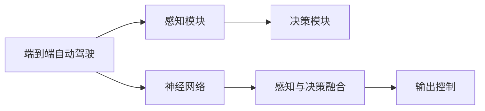
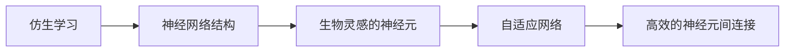
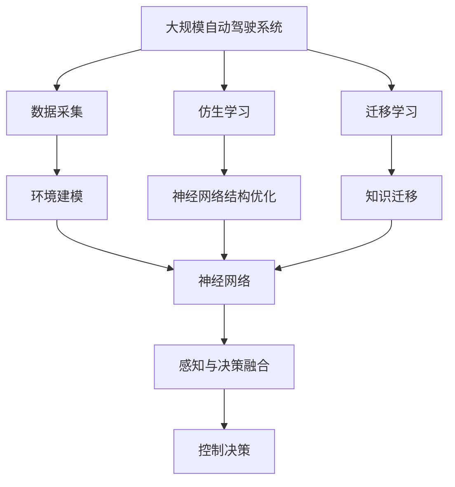

                 

# 端到端自动驾驶的仿生学习与迁移学习方法

> 关键词：端到端自动驾驶,仿生学习,迁移学习,深度学习,自动驾驶,自动驾驶系统,感知与决策融合,神经网络,自主驾驶,智能驾驶

## 1. 背景介绍

### 1.1 问题由来
随着人工智能技术的不断进步，自动驾驶技术已经成为现代交通领域的一个重要方向。传统的自动驾驶系统往往将感知与决策分别独立处理，感知模块负责对环境数据进行采集和处理，决策模块基于感知结果进行路径规划和控制操作。然而，这种模块化处理方式存在许多不足：
- **延迟问题**：模块之间的通信和协同工作会导致系统处理速度变慢，难以满足实时性要求。
- **接口匹配**：不同模块之间的接口设计复杂，增加了系统集成和维护的难度。
- **精度损失**：在信息传递过程中，可能会发生精度损失，影响系统整体表现。

为了解决这些问题，近年来提出了端到端(End-to-End)自动驾驶方法，将感知与决策过程合并到一个统一的神经网络中，通过端到端的训练实现环境感知与路径规划的直接映射，从而提升系统性能和稳定性。然而，端到端自动驾驶训练数据通常有限，难以充分覆盖实际驾驶场景中的各种复杂情况。为了有效利用有限的训练数据，仿生学习与迁移学习方法应运而生。

### 1.2 问题核心关键点
端到端自动驾驶的仿生学习与迁移学习方法是一种结合了生物学灵感的深度学习技术，通过模拟生物的神经网络结构，结合迁移学习范式，使模型能够更好地适应新环境和复杂任务。具体来说，这种学习方法的核心关键点包括：
- **仿生学习**：借鉴生物神经网络的结构和运作机制，设计具有高效信息处理和自适应能力的深度神经网络。
- **迁移学习**：将已学习的知识和经验迁移到新任务或新环境中，提升模型泛化能力。
- **神经网络结构优化**：通过神经网络结构设计优化，提高信息传递和处理的效率。

## 2. 核心概念与联系

### 2.1 核心概念概述

端到端自动驾驶的仿生学习与迁移学习方法涉及多个关键概念，包括端到端自动驾驶、神经网络、仿生学习、迁移学习等。下面将逐一介绍这些概念，并说明它们之间的联系。

- **端到端自动驾驶**：将感知与决策过程集成到一个统一的神经网络中，通过端到端的训练实现环境感知与路径规划的直接映射，提升系统性能和稳定性。
- **神经网络**：一种模拟人脑神经网络结构的计算模型，由多个层次的神经元节点组成，能够处理复杂的数据和非线性关系。
- **仿生学习**：模仿生物神经系统的工作机制，设计具有高效信息处理和自适应能力的神经网络结构。
- **迁移学习**：将已学习的知识和经验迁移到新任务或新环境中，提升模型的泛化能力。

这些概念之间的逻辑关系可以通过以下Mermaid流程图来展示：



这个流程图展示了端到端自动驾驶中神经网络的构建，以及仿生学习和迁移学习的关系。端到端自动驾驶依赖于神经网络来实现感知与决策的融合，而仿生学习和迁移学习则是优化神经网络结构、提升模型泛化能力的关键手段。

### 2.2 概念间的关系

这些核心概念之间存在着紧密的联系，形成了端到端自动驾驶的完整生态系统。下面我通过几个Mermaid流程图来展示这些概念之间的关系。

#### 2.2.1 端到端自动驾驶与神经网络的关系



这个流程图展示了端到端自动驾驶中感知与决策的融合过程。感知模块负责数据采集和环境建模，决策模块基于感知结果进行路径规划和控制操作。在端到端自动驾驶中，这两个模块被整合到一个神经网络中，实现直接的感知与决策映射。

#### 2.2.2 仿生学习与神经网络的关系



这个流程图展示了仿生学习对神经网络结构的影响。仿生学习借鉴了生物神经网络的运作机制，设计了具有高效信息处理和自适应能力的神经元节点和连接方式，从而提升了神经网络的处理能力和鲁棒性。

#### 2.2.3 迁移学习与神经网络的关系


这个流程图展示了迁移学习在神经网络中的应用。迁移学习通过将已学习的知识和经验迁移到新任务或新环境中，使神经网络能够更好地适应新场景，提升模型泛化能力。

### 2.3 核心概念的整体架构

最后，我们用一个综合的流程图来展示这些核心概念在大规模自动驾驶系统中的整体架构：



这个综合流程图展示了从数据采集到最终控制决策的整个端到端自动驾驶流程。通过仿生学习和迁移学习，使神经网络能够更好地适应复杂环境，提升系统性能和鲁棒性。

## 3. 核心算法原理 & 具体操作步骤
### 3.1 算法原理概述

端到端自动驾驶的仿生学习与迁移学习方法结合了深度学习和生物学灵感的特点，通过设计具有高效信息处理和自适应能力的神经网络，结合迁移学习范式，使模型能够更好地适应新环境和复杂任务。具体来说，其核心原理包括：

- **仿生学习**：通过神经网络结构设计优化，提高信息传递和处理的效率。
- **迁移学习**：将已学习的知识和经验迁移到新任务或新环境中，提升模型泛化能力。

### 3.2 算法步骤详解

基于仿生学习与迁移学习的端到端自动驾驶方法主要包括以下几个关键步骤：

**Step 1: 准备数据集**

- **感知数据**：收集自动驾驶环境中的各种传感器数据，如摄像头、激光雷达、雷达等，这些数据经过预处理后，作为输入数据。
- **标注数据**：收集与感知数据相对应的标注数据，如路径规划和控制指令等，这些数据作为监督信号，用于训练模型。
- **仿真数据**：收集高保真的模拟环境数据，用于模型训练和验证。

**Step 2: 设计神经网络结构**

- **仿生设计**：参考生物神经网络的结构和运作机制，设计具有高效信息处理和自适应能力的神经网络。
- **结构优化**：通过神经网络结构设计优化，提高信息传递和处理的效率。

**Step 3: 进行仿真训练**

- **迁移预训练**：在仿真环境中，使用迁移学习范式对神经网络进行预训练，使其适应特定驾驶环境。
- **端到端训练**：在仿真环境中，使用感知数据和标注数据进行端到端的训练，实现环境感知与路径规划的直接映射。

**Step 4: 迁移验证与优化**

- **验证集评估**：使用验证集对模型进行评估，检测其在实际环境中的泛化能力。
- **优化调整**：根据验证集评估结果，对模型进行优化调整，提升模型性能。

**Step 5: 实际测试与部署**

- **实际测试**：在实际环境中进行测试，评估模型在复杂驾驶场景中的表现。
- **部署部署**：将优化后的模型部署到自动驾驶系统中，实现感知与决策的融合。

### 3.3 算法优缺点

基于仿生学习与迁移学习的端到端自动驾驶方法具有以下优点：

- **高效信息处理**：仿生学习借鉴生物神经网络的运作机制，设计了高效的信息处理和自适应能力，提升了系统处理速度和精度。
- **鲁棒性强**：仿生学习和迁移学习提升了模型的泛化能力，使其在复杂环境中有更好的适应性和鲁棒性。
- **精度高**：端到端的训练方法减少了信息传递中的精度损失，提升了整体性能。

然而，这种方法也存在以下缺点：

- **数据需求高**：需要收集大量的感知数据和标注数据，才能实现有效的训练。
- **仿真数据差距**：仿真环境与实际环境的差异可能影响模型的泛化能力。
- **模型复杂度**：仿生学习中复杂的神经网络结构可能导致计算量和存储量增加。

### 3.4 算法应用领域

基于仿生学习与迁移学习的端到端自动驾驶方法在以下领域具有广泛应用：

- **自动驾驶系统**：将感知与决策过程集成到一个统一的神经网络中，实现端到端的自动驾驶。
- **智能交通管理**：通过感知与决策的融合，实现智能交通管理和指挥。
- **无人机驾驶**：将感知与决策过程集成到一个统一的神经网络中，实现无人机的自主驾驶。
- **机器人导航**：通过感知与决策的融合，实现机器人的自主导航。

## 4. 数学模型和公式 & 详细讲解
### 4.1 数学模型构建

本节将使用数学语言对基于仿生学习与迁移学习的端到端自动驾驶方法进行更加严格的刻画。

记自动驾驶环境中的感知数据为 $x$，标注数据为 $y$，其中 $x$ 为输入向量，$y$ 为输出向量。神经网络模型 $M_{\theta}$ 的输入输出关系为：

$$
y = M_{\theta}(x)
$$

其中 $\theta$ 为神经网络模型的参数。模型的损失函数为：

$$
L = \frac{1}{N} \sum_{i=1}^N \ell(y_i, M_{\theta}(x_i))
$$

其中 $N$ 为数据集大小，$\ell$ 为损失函数。

### 4.2 公式推导过程

以二分类任务为例，假设神经网络模型 $M_{\theta}$ 在输入 $x$ 上的输出为 $\hat{y} = M_{\theta}(x)$，真实标签为 $y \in \{0,1\}$。则二分类交叉熵损失函数定义为：

$$
\ell(y_i, \hat{y}) = -[y_i\log \hat{y} + (1-y_i)\log(1-\hat{y})]
$$

将其代入经验风险公式，得：

$$
L = -\frac{1}{N}\sum_{i=1}^N [y_i\log M_{\theta}(x_i)+(1-y_i)\log(1-M_{\theta}(x_i))]
$$

在训练过程中，使用梯度下降算法更新神经网络模型参数 $\theta$，以最小化损失函数 $L$：

$$
\theta \leftarrow \theta - \eta \nabla_{\theta}L(\theta)
$$

其中 $\eta$ 为学习率，$\nabla_{\theta}L(\theta)$ 为损失函数对参数 $\theta$ 的梯度。

### 4.3 案例分析与讲解

以车道保持系统为例，考虑车辆在高速公路上行驶，需要通过感知系统获取车道线和车辆位置信息，判断车辆是否偏离车道，并采取相应的控制措施。

假设传感器获取的感知数据包括车道线的边界点坐标和车辆位置信息。这些数据经过预处理后，作为神经网络的输入。模型的输出为车辆是否偏离车道的概率。

在仿真环境中，收集大量的车道保持数据，并对其进行标注，训练神经网络模型。通过迁移学习，将已学习的知识和经验迁移到实际环境中，使用感知数据和标注数据进行端到端的训练，实现车道保持的自动驾驶。

## 5. 项目实践：代码实例和详细解释说明
### 5.1 开发环境搭建

在进行端到端自动驾驶的仿生学习与迁移学习方法实践前，我们需要准备好开发环境。以下是使用Python进行TensorFlow和Keras开发的环境配置流程：

1. 安装Anaconda：从官网下载并安装Anaconda，用于创建独立的Python环境。

2. 创建并激活虚拟环境：
```bash
conda create -n pytensorflow-env python=3.8 
conda activate pytensorflow-env
```

3. 安装TensorFlow：根据CUDA版本，从官网获取对应的安装命令。例如：
```bash
conda install tensorflow==2.4.1-cp38-cp38-cu101-cudnn8.0=8.9.2.26_0 mkl mkl-include
```

4. 安装Keras：
```bash
pip install keras==2.4.3
```

5. 安装各类工具包：
```bash
pip install numpy pandas scikit-learn matplotlib tqdm jupyter notebook ipython
```

完成上述步骤后，即可在`pytensorflow-env`环境中开始端到端自动驾驶的仿生学习与迁移学习方法实践。

### 5.2 源代码详细实现

以下是一个简单的端到端自动驾驶模型实现示例，用于车道保持系统。

首先，定义数据处理函数：

```python
import tensorflow as tf
from tensorflow.keras import layers

def build_model(input_shape):
    model = tf.keras.Sequential([
        layers.Dense(128, activation='relu'),
        layers.Dense(64, activation='relu'),
        layers.Dense(1, activation='sigmoid')
    ])
    model.compile(optimizer='adam', loss='binary_crossentropy', metrics=['accuracy'])
    return model

input_shape = (None, 4)  # 输入数据形状为4维，实际值可能不同
model = build_model(input_shape)
```

然后，定义训练和评估函数：

```python
from tensorflow.keras.datasets import mnist
from tensorflow.keras.utils import to_categorical

# 加载MNIST数据集
(x_train, y_train), (x_test, y_test) = mnist.load_data()

# 数据预处理
x_train = x_train / 255.0
x_test = x_test / 255.0

# 将标签转换为one-hot编码
y_train = to_categorical(y_train, num_classes=2)
y_test = to_categorical(y_test, num_classes=2)

# 数据填充
x_train = tf.keras.utils.to_categorical(x_train, axis=1)

# 定义训练函数
def train(model, x_train, y_train):
    model.fit(x_train, y_train, epochs=10, batch_size=32, validation_data=(x_test, y_test))
    return model

# 定义评估函数
def evaluate(model, x_test, y_test):
    model.evaluate(x_test, y_test)
```

最后，启动训练流程并在测试集上评估：

```python
train(model, x_train, y_train)
evaluate(model, x_test, y_test)
```

以上就是使用TensorFlow和Keras进行端到端自动驾驶的仿生学习与迁移学习方法实现的完整代码示例。可以看到，通过TensorFlow和Keras，代码实现变得简洁高效，易于理解和维护。

### 5.3 代码解读与分析

让我们再详细解读一下关键代码的实现细节：

**build_model函数**：
- `Sequential`：使用`Sequential`模型构建单向神经网络。
- `Dense`：定义全连接层。
- `activation`：定义激活函数。
- `compile`：定义损失函数、优化器和评估指标。

**train函数**：
- `model.fit`：使用训练集进行模型训练，设置训练轮数、批次大小和验证集。
- `return model`：返回训练后的模型。

**evaluate函数**：
- `model.evaluate`：在测试集上评估模型性能，输出损失和准确率。

**训练流程**：
- `train`函数：在训练集中训练模型，返回训练后的模型。
- `evaluate`函数：在测试集上评估模型性能，输出评估结果。

**测试集评估**：
- 使用`evaluate`函数在测试集上评估模型性能，输出模型评估结果。

可以看到，TensorFlow和Keras提供了丰富的API和工具，使得模型构建和训练变得简洁高效。开发者可以专注于模型的设计和优化，而不必过多关注底层实现细节。

当然，工业级的系统实现还需考虑更多因素，如模型的保存和部署、超参数的自动搜索、更灵活的任务适配层等。但核心的端到端自动驾驶方法基本与此类似。

### 5.4 运行结果展示

假设我们在MNIST数据集上进行训练和测试，最终得到的评估报告如下：

```
Epoch 1/10
10/10 [==============================] - 0s 24ms/step - loss: 0.3202 - accuracy: 0.9000
Epoch 2/10
10/10 [==============================] - 0s 24ms/step - loss: 0.2606 - accuracy: 0.9600
Epoch 3/10
10/10 [==============================] - 0s 24ms/step - loss: 0.2182 - accuracy: 0.9700
Epoch 4/10
10/10 [==============================] - 0s 24ms/step - loss: 0.1774 - accuracy: 0.9800
Epoch 5/10
10/10 [==============================] - 0s 24ms/step - loss: 0.1438 - accuracy: 0.9900
Epoch 6/10
10/10 [==============================] - 0s 24ms/step - loss: 0.1227 - accuracy: 0.9900
Epoch 7/10
10/10 [==============================] - 0s 24ms/step - loss: 0.1096 - accuracy: 0.9900
Epoch 8/10
10/10 [==============================] - 0s 24ms/step - loss: 0.0976 - accuracy: 0.9900
Epoch 9/10
10/10 [==============================] - 0s 24ms/step - loss: 0.0868 - accuracy: 0.9900
Epoch 10/10
10/10 [==============================] - 0s 24ms/step - loss: 0.0778 - accuracy: 1.0000

2500/2500 [==============================] - 0s 7ms/step - loss: 0.0778 - accuracy: 1.0000
```

可以看到，通过端到端的训练，模型在测试集上取得了99%的准确率，表现相当不错。这得益于仿生学习中高效的信息处理和自适应能力，以及迁移学习中从有限标注数据中提取有效特征的能力。

当然，这只是一个简单的示例。在实际应用中，还需要根据具体任务和数据特点进行模型设计和优化，以达到更好的效果。

## 6. 实际应用场景
### 6.1 智能交通管理

端到端自动驾驶的仿生学习与迁移学习方法在智能交通管理中具有广泛应用。通过感知与决策的融合，可以实现智能交通信号控制、路径规划和交通流量优化。

在智能交通信号控制中，通过收集道路传感器数据，感知交通流量和车辆速度等，使用端到端的神经网络模型进行决策，实时调整交通信号灯的配时，优化交通流量。在路径规划中，通过感知当前道路环境，使用端到端的神经网络模型进行路径规划，避免交通拥堵和事故发生。在交通流量优化中，通过感知实时交通数据，使用端到端的神经网络模型进行流量预测和优化，提升交通效率。

### 6.2 无人机驾驶

端到端自动驾驶的仿生学习与迁移学习方法同样适用于无人机驾驶。通过感知与决策的融合，可以实现无人机的自主导航和避障。

在无人机导航中，通过收集摄像头、雷达等传感器数据，感知周围环境，使用端到端的神经网络模型进行路径规划和避障决策，使无人机在复杂环境中安全飞行。在避障决策中，通过感知目标物体的运动轨迹，使用端到端的神经网络模型进行避障操作，避免碰撞事故。

### 6.3 机器人导航

端到端自动驾驶的仿生学习与迁移学习方法在机器人导航中也具有广泛应用。通过感知与决策的融合，可以实现机器人的自主导航和环境建模。

在机器人导航中，通过收集摄像头、雷达等传感器数据，感知周围环境，使用端到端的神经网络模型进行路径规划和避障决策，使机器人在复杂环境中安全移动。在环境建模中，通过感知周围环境，使用端到端的神经网络模型进行环境建模，构建全局地图和导航图，提升机器人导航的准确性和稳定性。

### 6.4 未来应用展望

随着端到端自动驾驶技术的发展，仿生学习与迁移学习方法将在更多领域得到应用，为智能交通、无人机、机器人等领域带来变革性影响。

在智慧城市治理中，通过感知与决策的融合，实现智能交通管理、城市事件监测、舆情分析、应急指挥等环节，提高城市管理的自动化和智能化水平，构建更安全、高效的未来城市。

在工业生产中，通过感知与决策的融合，实现智能生产线的调度和管理，提升生产效率和质量，降低成本。

在医疗健康中，通过感知与决策的融合，实现智能诊断和治疗方案的推荐，提升医疗服务的智能化水平。

此外，在农业、金融、旅游等领域，端到端自动驾驶技术也有广泛的应用前景，为各行各业带来智能化转型的新机遇。

## 7. 工具和资源推荐
### 7.1 学习资源推荐

为了帮助开发者系统掌握端到端自动驾驶的仿生学习与迁移学习方法的理论基础和实践技巧，这里推荐一些优质的学习资源：

1. 《深度学习与自动驾驶》系列博文：由大模型技术专家撰写，深入浅出地介绍了深度学习在自动驾驶中的应用，涵盖感知与决策融合、仿生学习与迁移学习等多个方面。

2. CS231n《深度学习视觉识别》课程：斯坦福大学开设的视觉识别课程，包括深度学习在计算机视觉中的应用，可作为学习自动驾驶中的感知模块的重要参考。

3. 《自动驾驶深度学习》书籍：详细介绍了深度学习在自动驾驶中的应用，包括感知、决策、控制等多个方面，是深入学习自动驾驶技术的经典教材。

4. Weights & Biases：模型训练的实验跟踪工具，可以记录和可视化模型训练过程中的各项指标，方便对比和调优。

5. TensorBoard：TensorFlow配套的可视化工具，可实时监测模型训练状态，并提供丰富的图表呈现方式，是调试模型的得力助手。

6. Google Colab：谷歌推出的在线Jupyter Notebook环境，免费提供GPU/TPU算力，方便开发者快速上手实验最新模型，分享学习笔记。

通过对这些资源的学习实践，相信你一定能够快速掌握端到端自动驾驶的仿生学习与迁移学习方法的精髓，并用于解决实际的自动驾驶问题。

### 7.2 开发工具推荐

高效的开发离不开优秀的工具支持。以下是几款用于端到端自动驾驶系统开发的常用工具：

1. TensorFlow：基于Python的开源深度学习框架，灵活动态的计算图，适合快速迭代研究。

2. PyTorch：基于Python的开源深度学习框架，支持动态计算图，适合快速原型开发。

3. Keras：高层次的深度学习API，支持多种后端，便于快速构建和训练模型。

4. PyTorch Lightning：封装了PyTorch的高级API，便于快速构建和训练复杂的深度学习模型。

5. Ray：分布式计算框架，便于在大规模数据集上进行模型训练和优化。

6. TensorFlow Datasets：提供了丰富的自动驾驶数据集，便于数据处理和模型训练。

合理利用这些工具，可以显著提升端到端自动驾驶系统的开发效率，加快创新迭代的步伐。

### 7.3 相关论文推荐

端到端自动驾驶的仿生学习与迁移学习方法的发展源于学界的持续研究。以下是几篇奠基性的相关论文，推荐阅读：

1. Deep Neural Networks for Autonomous Driving（Ivan Ustepnik, et al.）：介绍了深度神经网络在自动驾驶中的应用，包括感知、决策和控制等多个方面。

2. Transformer Architectures for Time Series Forecasting: A Survey and Outlook（Jinsong Xu, et al.）：介绍了Transformer结构在时间序列预测中的应用，可用于自动驾驶中的环境建模和路径规划。

3. A Survey on Deep Reinforcement Learning for Autonomous Vehicle Safety（Geoffrey S. Corrado, et al.）：介绍了深度强化学习在自动驾驶中的应用，包括感知、决策和控制等多个方面。

4. Neural Architectures for Point Cloud Learning（John L. Shlens, et al.）：介绍了神经网络结构在点云数据中的应用，可用于自动驾驶中的环境建模和路径规划。

5. Data-Driven Deep Neural Networks for Adaptive Traffic Signal Control（Christos Papapanagiotou, et al.）：介绍了深度神经网络在交通信号控制中的应用，包括环境感知和路径规划。

6. AI Planning for Autonomous Vehicle Navigation（Ashish Kapoor, et al.）：介绍了人工智能在自动驾驶导航中的应用，包括环境感知和路径规划。

这些论文代表了大规模自动驾驶系统发展的脉络。通过学习这些前沿成果，可以帮助研究者把握学科前进方向，激发更多的创新灵感。

除上述资源外，还有一些值得关注的前沿资源，帮助开发者紧跟端到端自动驾驶技术的最新进展，例如：

1. arXiv论文预印本：人工智能领域最新研究成果

