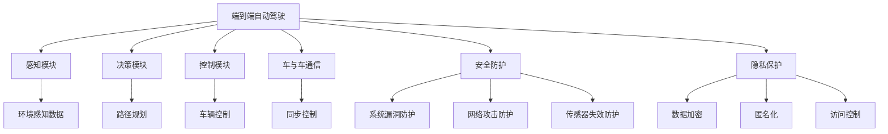

                 

# 端到端自动驾驶的车辆编队安全与隐私保护

> 关键词：端到端自动驾驶, 车辆编队, 安全防护, 隐私保护, 无人驾驶, 智能交通, 车联网, 汽车通信

## 1. 背景介绍

随着科技的不断进步，自动驾驶（Autonomous Driving, AD）技术已成为汽车行业的一大热点。端到端自动驾驶（End-to-End Autonomous Driving）将传统上由不同系统模块负责的感知、决策、控制等任务整合成一个统一的决策系统，极大简化了系统架构，提高了系统的稳定性和安全性。端到端AD技术涉及到了多个子系统之间的交互与协作，其安全性与隐私保护成为研究的重点。

当前自动驾驶系统面临着各类潜在的安全风险，包括系统自身漏洞、通信网络攻击、车辆感知错误等，这些风险若被恶意利用，可能导致严重的交通事故。隐私保护则是另一个关键问题，自动驾驶系统涉及到大量个人隐私数据，如位置信息、行为模式等，一旦数据泄露，可能带来巨大的法律和经济损失。因此，如何保障自动驾驶车辆编队的整体安全与隐私，是实现智能交通的重要挑战之一。

## 2. 核心概念与联系

### 2.1 核心概念概述

本节将介绍端到端自动驾驶中涉及到的核心概念，并阐述它们之间的联系：

#### 2.1.1 端到端自动驾驶

端到端自动驾驶是指直接由软件系统完成车辆的所有控制功能，无需人工介入。这种系统通常包含感知模块、决策模块和控制模块，它们分别负责收集环境信息、规划路径、执行操作。

#### 2.1.2 车辆编队

车辆编队（Vehicle Platoon）是指多辆自动驾驶车辆在道路上形成车队，通过车与车之间的通信与协作，提高道路通行效率和安全性。编队系统通常需要解决通信延迟、同步控制等问题。

#### 2.1.3 安全防护

安全防护（Security Protection）涉及自动驾驶系统在面对各种威胁时的保护措施。这些威胁包括软件漏洞、网络攻击、传感器失效等。

#### 2.1.4 隐私保护

隐私保护（Privacy Protection）旨在保护车辆在运行过程中收集的个人隐私数据，防止数据泄露和滥用。这包括数据加密、匿名化、访问控制等技术手段。

### 2.2 核心概念之间的关系

下图通过Mermaid流程图展示了端到端自动驾驶、车辆编队、安全防护和隐私保护之间的关系：



此图表示：
- 端到端自动驾驶系统由感知、决策和控制三个核心模块组成。
- 感知模块负责收集环境数据，决策模块负责路径规划，控制模块负责执行操作。
- 车辆编队通过车与车通信实现同步控制，以提高通行效率和安全性。
- 安全防护通过防护系统漏洞、网络攻击和传感器失效等威胁，确保系统的稳定性和安全性。
- 隐私保护通过数据加密、匿名化和访问控制等手段，保护车辆在运行过程中收集的隐私数据。

## 3. 核心算法原理 & 具体操作步骤
### 3.1 算法原理概述

端到端自动驾驶车辆编队的安全与隐私保护是一个多层次、多目标的系统工程。核心算法通常包括以下几个步骤：

1. **数据收集与处理**：通过传感器、GPS和通信设备收集车辆位置、速度、环境信息等数据。
2. **路径规划与路径跟踪**：利用全局路径规划和局部路径跟踪算法，确定车辆的行驶路径。
3. **车辆间通信与同步**：通过车与车通信实现编队内的同步控制，如速度和方向调整。
4. **决策与控制**：综合感知数据、路径规划和同步控制信息，做出最终决策并控制车辆。
5. **安全防护**：通过检测和防护系统漏洞、网络攻击、传感器失效等威胁，确保系统安全。
6. **隐私保护**：对数据进行加密、匿名化和访问控制，防止隐私泄露。

### 3.2 算法步骤详解

以下将详细介绍每个步骤的算法原理：

#### 3.2.1 数据收集与处理

在端到端自动驾驶系统中，车辆通过各种传感器（如激光雷达、摄像头、雷达）收集环境信息。这些数据经过预处理（如滤波、校正）后，输入到感知模块中。

以激光雷达数据为例，其处理流程如下：

1. **数据采集**：激光雷达传感器采集周围环境的高频点云数据。
2. **预处理**：对点云数据进行去噪、滤波等预处理，去除冗余数据和噪声点。
3. **特征提取**：对预处理后的点云数据进行特征提取，如障碍物、道路、交通标志等。

#### 3.2.2 路径规划与路径跟踪

路径规划算法通常采用A*算法、D*算法等，从起点到终点搜索最优路径。路径跟踪算法则根据实时环境信息，动态调整车辆的行驶轨迹。

以A*算法为例，其基本步骤如下：

1. **启发式函数**：定义启发式函数，用于评估每个节点的预计到达距离。
2. **开放列表与关闭列表**：维护开放列表和关闭列表，用于搜索最优路径。
3. **节点扩展**：每次从开放列表中扩展权重最小的节点，更新关闭列表和开放列表。
4. **路径输出**：当目标节点被扩展时，输出最优路径。

#### 3.2.3 车辆间通信与同步

车辆间通信通过车与车通信协议实现，如IEEE 802.11p、DSRC（Dedicated Short-Range Communications）等。同步控制算法包括PID控制器、模糊控制等，确保车辆在编队内保持同步。

以PID控制器为例，其基本步骤如下：

1. **设定目标**：设定目标速度、加速度等参数。
2. **误差计算**：计算实际速度与目标速度的误差。
3. **PID计算**：根据PID控制规则，计算控制信号，更新车辆速度和加速度。
4. **同步调整**：通过车与车通信，同步调整各车辆的速度和方向。

#### 3.2.4 决策与控制

决策与控制是自动驾驶系统的核心部分，通常采用基于规则的决策树、深度强化学习等算法。控制算法则根据决策结果，执行具体操作，如转向、加速等。

以深度强化学习为例，其基本步骤如下：

1. **状态定义**：定义车辆状态，如速度、位置、方向等。
2. **奖励函数**：定义奖励函数，用于评估决策的质量。
3. **模型训练**：使用神经网络模型，对决策进行训练和优化。
4. **动作执行**：根据训练后的模型，执行具体的动作，如转向、加速等。

#### 3.2.5 安全防护

安全防护通过检测系统漏洞、网络攻击和传感器失效等威胁，确保系统安全。常用的方法包括：

1. **漏洞检测**：使用自动化工具扫描系统漏洞。
2. **入侵检测**：部署入侵检测系统，监控异常网络流量。
3. **传感器失效检测**：使用冗余传感器，检测传感器是否失效。

#### 3.2.6 隐私保护

隐私保护通过数据加密、匿名化和访问控制等手段，防止隐私泄露。常用的方法包括：

1. **数据加密**：对数据进行加密，确保数据传输安全。
2. **匿名化**：对数据进行匿名化处理，防止数据泄露。
3. **访问控制**：限制数据访问权限，确保数据访问安全。

### 3.3 算法优缺点

端到端自动驾驶车辆编队的安全与隐私保护算法具有以下优点：

1. **整体优化**：通过集成感知、决策和控制模块，可以实现整体优化，提高系统性能。
2. **实时性**：实时数据收集和处理，确保系统的实时响应性。
3. **安全性**：通过多层次的安全防护措施，确保系统的安全性。
4. **隐私保护**：通过隐私保护手段，保护车辆收集的隐私数据。

其缺点包括：

1. **复杂性**：系统结构复杂，涉及多个子系统间的交互与协作。
2. **可靠性**：系统可靠性依赖于多个子系统的稳定性和协同工作。
3. **资源消耗**：数据收集和处理、安全防护和隐私保护等都需要大量的计算资源。

### 3.4 算法应用领域

端到端自动驾驶车辆编队的安全与隐私保护算法广泛应用于以下领域：

1. **智能交通**：通过车辆编队，提高道路通行效率，减少交通拥堵。
2. **无人驾驶**：在无人驾驶车辆中，通过安全与隐私保护，确保车辆运行安全。
3. **车联网**：在车联网系统中，通过数据安全防护，保护车辆间的通信安全。
4. **城市管理**：在城市管理中，通过安全与隐私保护，提高城市交通安全性。

## 4. 数学模型和公式 & 详细讲解 & 举例说明

### 4.1 数学模型构建

在端到端自动驾驶系统中，常用的数学模型包括路径规划模型、PID控制器模型等。这里以路径规划模型为例，进行详细讲解。

#### 4.1.1 路径规划模型

路径规划模型通常采用A*算法，用于搜索最优路径。其基本数学模型为：

$$
H(n) = \sum_{i=1}^n g(i) + h(n)
$$

其中：
- $g(i)$：起点到节点$i$的实际路径长度。
- $h(n)$：节点$n$到目标节点的启发式路径长度。

#### 4.1.2 PID控制器模型

PID控制器模型的基本数学模型为：

$$
u(t) = K_p \cdot e(t) + K_i \cdot \int_0^t e(\tau) d\tau + K_d \cdot \frac{d}{dt} e(t)
$$

其中：
- $u(t)$：控制信号。
- $e(t)$：误差信号。
- $K_p$：比例系数。
- $K_i$：积分系数。
- $K_d$：微分系数。

### 4.2 公式推导过程

#### 4.2.1 A*算法公式推导

A*算法的基本公式推导如下：

$$
f(n) = g(n) + h(n)
$$

其中：
- $f(n)$：节点$n$的估价函数值。
- $g(n)$：节点$n$到起点的实际路径长度。
- $h(n)$：节点$n$到目标节点的启发式路径长度。

#### 4.2.2 PID控制器公式推导

PID控制器的基本公式推导如下：

$$
u(t) = K_p \cdot e(t) + K_i \cdot \int_0^t e(\tau) d\tau + K_d \cdot \frac{d}{dt} e(t)
$$

其中：
- $u(t)$：控制信号。
- $e(t)$：误差信号。
- $K_p$：比例系数。
- $K_i$：积分系数。
- $K_d$：微分系数。

### 4.3 案例分析与讲解

#### 4.3.1 路径规划案例

假设有一辆自动驾驶车辆，其路径规划需要从起点A到达终点B。根据A*算法，计算路径过程如下：

1. **启发式函数定义**：设启发式函数为曼哈顿距离，即$h(n) = |x_n - x_{n+1}| + |y_n - y_{n+1}|$。
2. **开放列表与关闭列表**：初始化开放列表和关闭列表，包含起点A和目标节点B。
3. **节点扩展**：从开放列表中选择估价函数值最小的节点，扩展为关闭列表，并更新开放列表。
4. **路径输出**：当目标节点B被扩展时，输出最优路径。

#### 4.3.2 PID控制器案例

假设有一辆自动驾驶车辆，其PID控制器需要控制车辆的加速度。根据PID控制器，计算控制过程如下：

1. **设定目标**：设定目标加速度$a_{target}$。
2. **误差计算**：计算实际加速度$a_{actual}$与目标加速度$a_{target}$的误差$e(t) = a_{target} - a_{actual}$。
3. **PID计算**：根据PID控制规则，计算控制信号$u(t)$，更新车辆的加速度。
4. **同步调整**：通过车与车通信，同步调整各车辆的速度和方向。

## 5. 项目实践：代码实例和详细解释说明

### 5.1 开发环境搭建

在开发端到端自动驾驶车辆编队的安全与隐私保护系统时，需要搭建相应的开发环境。以下是基于Python和PyTorch的环境配置流程：

1. **安装Python**：确保Python版本为3.7及以上。
2. **安装PyTorch**：使用pip安装PyTorch。
3. **安装相关库**：安装numpy、scipy、matplotlib等常用库。
4. **安装车辆模拟器**：使用CARLA等车辆模拟器进行仿真实验。

### 5.2 源代码详细实现

以下是一个简化的路径规划代码实现，用于生成车辆在编队中的路径：

```python
import numpy as np
import matplotlib.pyplot as plt

def a_star(start, goal, heuristic):
    open_list = [(start, 0)]
    closed_list = []
    while open_list:
        current = open_list[0]
        open_list = open_list[1:]
        closed_list.append(current)
        if current[0] == goal:
            return current[1]
        for next_node in get_neighbors(current[0]):
            if next_node not in closed_list:
                g = current[1] + heuristic(current[0], next_node)
                if next_node not in open_list or g < open_list[next_node][1]:
                    open_list.append((next_node, g))
                    open_list.sort(key=lambda x: x[1])

def get_neighbors(node):
    # 根据节点坐标获取邻居节点
    neighbors = []
    for x in range(node[0]-1, node[0]+2):
        for y in range(node[1]-1, node[1]+2):
            if x != node[0] or y != node[1]:
                neighbors.append((x, y))
    return neighbors

start = (0, 0)
goal = (5, 5)
h = lambda x, y: np.sqrt((x[0] - y[0])**2 + (x[1] - y[1])**2)
path_length = a_star(start, goal, h)
plt.plot([start[0], goal[0]], [start[1], goal[1]], 'r--', label='Path')
plt.scatter(start[0], start[1], color='b', label='Start')
plt.scatter(goal[0], goal[1], color='r', label='Goal')
plt.legend()
plt.show()
```

### 5.3 代码解读与分析

上述代码实现了A*算法，用于生成车辆在编队中的路径。主要代码解释如下：

- `a_star(start, goal, heuristic)`函数：实现A*算法，返回从起点到目标节点的路径长度。
- `get_neighbors(node)`函数：根据节点坐标获取邻居节点。
- `start`和`goal`：起点和目标节点坐标。
- `h`函数：定义启发式函数，计算节点之间的曼哈顿距离。
- `path_length`：计算出的路径长度。
- `plt.plot()`和`plt.scatter()`：绘制路径和起点、目标节点。

## 6. 实际应用场景

### 6.1 智能交通

在智能交通中，车辆编队可以通过实时路径规划和同步控制，提高道路通行效率。例如，在城市中心区域，通过车辆编队，可以将多辆自动驾驶车辆合并成一条车道行驶，减少车辆之间的间隙，提高道路利用率。

### 6.2 无人驾驶

在无人驾驶中，车辆编队可以通过协同控制，实现更高的安全性。例如，在高速公路上，通过车辆编队，车辆可以保持稳定的速度和距离，减少碰撞风险。

### 6.3 车联网

在车联网中，车辆编队可以通过车与车通信，实现更高效的数据交换和信息共享。例如，在车队行驶过程中，车辆可以共享路况信息，减少拥堵。

### 6.4 未来应用展望

未来，随着技术的不断进步，端到端自动驾驶车辆编队的安全与隐私保护将有更广泛的应用场景。例如：

- **自动驾驶出租车**：通过车辆编队，提高出租车运营效率和服务质量。
- **物流配送**：通过车辆编队，实现更高效、安全的物流配送。
- **城市应急管理**：通过车辆编队，快速响应紧急事件，提高应急响应效率。

## 7. 工具和资源推荐

### 7.1 学习资源推荐

以下是一些学习端到端自动驾驶车辆编队安全与隐私保护的资源：

1. **Udacity自动驾驶纳米学位**：涵盖自动驾驶系统的各个方面，包括感知、决策、控制等。
2. **Coursera深度学习专项课程**：包括深度学习基础、神经网络等课程，为系统设计提供理论基础。
3. **IEEE Xplore论文库**：包含大量自动驾驶和安全相关的论文，便于学习最新研究成果。

### 7.2 开发工具推荐

以下是一些开发端到端自动驾驶车辆编队安全与隐私保护系统常用的工具：

1. **PyTorch**：深度学习框架，支持自动驾驶系统中的深度模型训练和优化。
2. **TensorFlow**：另一个深度学习框架，支持大规模分布式训练。
3. **Carla**：开源车辆模拟器，支持自动驾驶系统测试和仿真实验。
4. **ROS**：机器人操作系统，支持自动驾驶系统中的传感器数据处理和通信。

### 7.3 相关论文推荐

以下是一些关于端到端自动驾驶车辆编队安全与隐私保护的论文：

1. **End-to-End Autonomous Driving with Deep Neural Networks**：介绍端到端自动驾驶系统架构和训练方法。
2. **V2X Communication Protocols for Autonomous Vehicle Platooning**：讨论车与车通信协议在车辆编队中的应用。
3. **Secure Multi-party Computation for Autonomous Vehicles**：研究如何在车辆编队中进行隐私保护。

## 8. 总结：未来发展趋势与挑战

### 8.1 总结

本文对端到端自动驾驶车辆编队的安全与隐私保护进行了系统介绍。通过详细介绍路径规划、PID控制器、车与车通信等核心算法，展示了端到端自动驾驶系统的复杂性和多样性。同时，通过案例分析，演示了端到端自动驾驶系统的实际应用场景。最后，通过推荐学习资源、开发工具和相关论文，为开发者提供了全面的参考。

### 8.2 未来发展趋势

未来，端到端自动驾驶车辆编队的安全与隐私保护将呈现以下趋势：

1. **更高的安全性**：随着技术进步，车辆编队的安全性将不断提高，减少交通事故的发生。
2. **更高效的通信**：车与车通信将更加高效、稳定，确保数据传输的可靠性和实时性。
3. **更先进的感知**：传感器技术和算法将不断进步，提高车辆编队的环境感知能力。
4. **更强大的决策**：通过深度强化学习等先进算法，提升车辆编队的决策能力。

### 8.3 面临的挑战

尽管端到端自动驾驶车辆编队的安全与隐私保护取得了一定进展，但仍面临以下挑战：

1. **高成本**：自动驾驶系统的开发和测试需要大量资金和资源。
2. **法律问题**：自动驾驶系统的法律问题复杂，如责任归属、数据隐私等。
3. **技术壁垒**：系统设计和开发需要高水平的工程和科学能力。
4. **伦理问题**：自动驾驶系统涉及伦理道德问题，如决策透明度、隐私保护等。

### 8.4 研究展望

为了应对这些挑战，未来的研究可以从以下几个方向进行：

1. **降低成本**：采用更高效的算法和硬件，降低系统开发和测试成本。
2. **完善法律**：制定和完善自动驾驶相关的法律法规，保障系统安全和用户权益。
3. **提升技术**：不断提升感知、决策和控制等核心技术的水平，推动系统性能提升。
4. **增强伦理**：加强伦理道德研究，提升系统的决策透明度和可解释性。

总之，端到端自动驾驶车辆编队的安全与隐私保护是一个多学科交叉、多技术融合的复杂系统，需要全球科技界、法律界和伦理界的共同努力，才能实现其全面落地应用。

## 9. 附录：常见问题与解答

### 9.1 Q1：端到端自动驾驶系统如何提高安全性？

A: 端到端自动驾驶系统通过集成感知、决策和控制模块，实现整体优化。同时，采用多层次安全防护措施，如检测系统漏洞、网络攻击、传感器失效等，确保系统稳定性和安全性。

### 9.2 Q2：端到端自动驾驶系统如何进行隐私保护？

A: 端到端自动驾驶系统通过数据加密、匿名化和访问控制等手段，防止隐私泄露。例如，对数据进行加密，对标签进行匿名化，限制数据访问权限等。

### 9.3 Q3：端到端自动驾驶系统在实际应用中面临哪些挑战？

A: 端到端自动驾驶系统在实际应用中面临成本高、法律复杂、技术壁垒和伦理问题等挑战。为应对这些挑战，需要进行多方面的综合优化和改进。

### 9.4 Q4：端到端自动驾驶系统在未来有哪些发展方向？

A: 端到端自动驾驶系统在未来将朝着更高的安全性、更高效的通信、更先进的感知和更强大的决策等方向发展。同时，还需要关注成本控制、法律完善、技术提升和伦理增强等方面的问题。

---

作者：禅与计算机程序设计艺术 / Zen and the Art of Computer Programming

