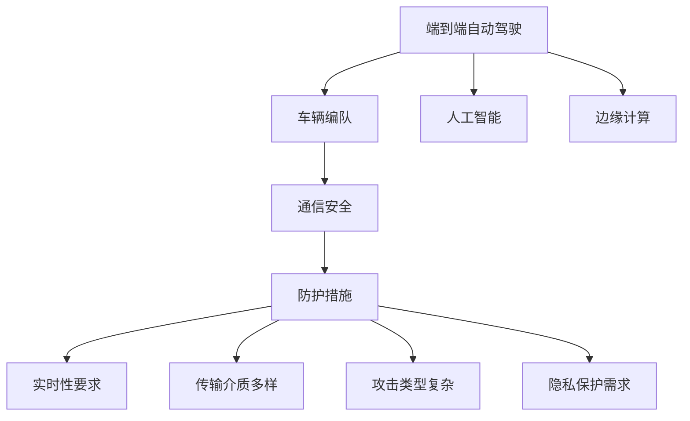
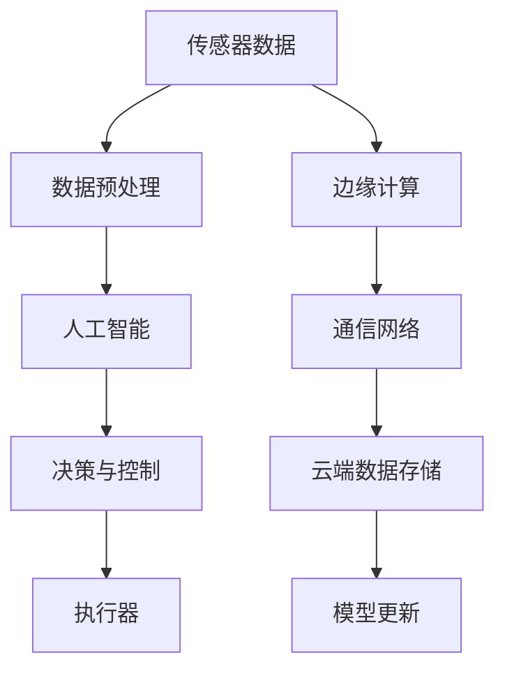
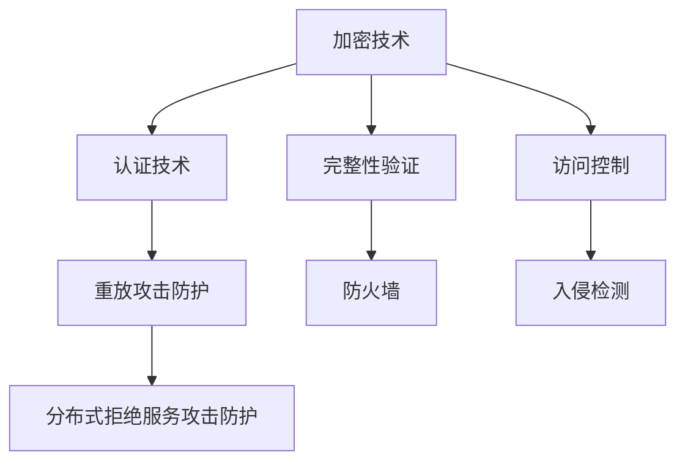
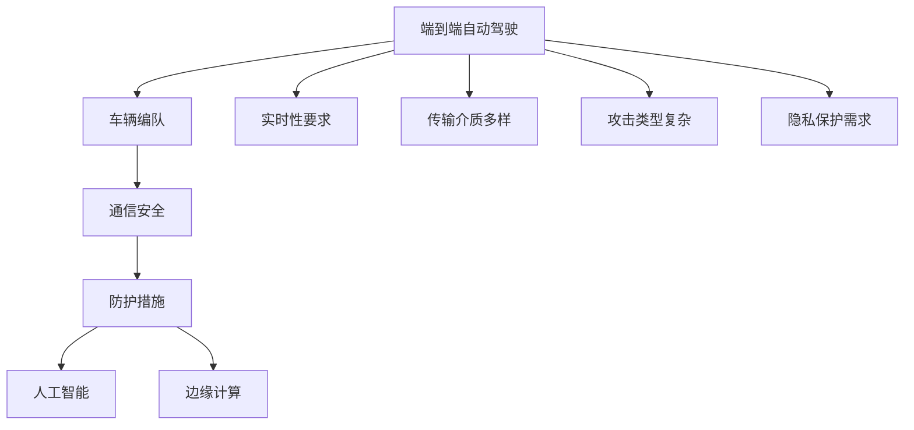

                 

# 端到端自动驾驶的车辆编队通信安全防护

> 关键词：端到端自动驾驶, 车辆编队, 通信安全, 防护措施, 人工智能, 边缘计算

## 1. 背景介绍

### 1.1 问题由来
随着自动驾驶技术的快速发展，越来越多的车辆开始具备自动驾驶功能，未来有望实现端到端的自动驾驶系统，即从车辆感知环境到决策控制完全由系统自动完成，无需人工干预。在这种场景下，车辆之间的通信安全显得尤为重要。车辆编队是自动驾驶中常见的应用场景，编队车辆需要实时共享感知信息和决策指令，一旦通信被恶意攻击，可能导致车辆失控或碰撞，造成严重安全事故。

### 1.2 问题核心关键点
车辆编队的通信安全防护问题主要涉及以下几个方面：
- **实时性要求高**：编队车辆需要实时交换信息，对于通信延迟和丢包非常敏感。
- **传输介质多样**：编队车辆可以使用多种通信方式（如V2X、Wi-Fi、蓝牙等），需要综合考虑各种介质的安全和效率。
- **攻击类型复杂**：包括但不限于重放攻击、篡改攻击、拒绝服务攻击等，需要设计多层次的防护措施。
- **隐私保护需求**：编队车辆交换的数据可能包含车辆位置、行驶速度、车内外环境信息等敏感数据，需要考虑隐私保护。

### 1.3 问题研究意义
在自动驾驶系统中，车辆编队通信安全防护的完善将显著提升系统可靠性，保障车辆与车辆、车辆与基础设施之间通信的安全性，提高整个系统的运行效率。此外，通过有效防护措施的实施，可以增强消费者对自动驾驶技术的信任，推动其广泛应用。

## 2. 核心概念与联系

### 2.1 核心概念概述

为更好地理解端到端自动驾驶的车辆编队通信安全防护方法，本节将介绍几个密切相关的核心概念：

- **端到端自动驾驶**：从车辆传感器获取数据到车辆执行控制决策，完全由车辆自主完成的自动驾驶系统，无需人类干预。
- **车辆编队**：多辆自动驾驶车辆在特定规则下有序排列行驶，通过通信和协作，形成编队以提高安全性、能效和运行效率。
- **通信安全**：保护通信数据的完整性、机密性和可用性，防止恶意攻击对通信造成损害。
- **防护措施**：一系列技术和策略，用于检测、预防和应对通信安全威胁。
- **人工智能**：应用机器学习、深度学习等技术，进行数据分析和模式识别，提升防护效率和准确性。
- **边缘计算**：将计算任务在本地车辆上处理，减少对云端服务器的依赖，提升通信效率和实时性。

这些核心概念之间的逻辑关系可以通过以下Mermaid流程图来展示：



这个流程图展示了端到端自动驾驶的各个组成部分以及它们之间的关系：

1. **端到端自动驾驶**：是整个系统的基础，负责从感知到决策的全流程自动化。
2. **车辆编队**：通过通信安全保障车辆之间的协作和安全性。
3. **通信安全**：是车辆编队的关键，保证通信数据的可靠性。
4. **防护措施**：具体实施通信安全的策略和技术。
5. **人工智能**：提供更高效的数据处理和模式识别能力。
6. **边缘计算**：增强通信和处理的实时性。

这些概念共同构成了端到端自动驾驶的通信安全防护框架，使得系统能够高效、安全地运行。

### 2.2 概念间的关系

这些核心概念之间存在着紧密的联系，形成了端到端自动驾驶通信安全防护的完整生态系统。下面我通过几个Mermaid流程图来展示这些概念之间的关系。

#### 2.2.1 端到端自动驾驶的架构



这个流程图展示了端到端自动驾驶的基本架构，从传感器数据采集、预处理、人工智能分析、决策控制到执行器执行的全过程。

#### 2.2.2 通信安全的层次


这个流程图展示了通信安全的层次结构，从物理层到应用层，每层都有相应的安全措施。

#### 2.2.3 防护措施的类别



这个流程图展示了防护措施的类别，涵盖了加密、认证、完整性验证、访问控制等多个方面。

### 2.3 核心概念的整体架构

最后，我们用一个综合的流程图来展示这些核心概念在端到端自动驾驶系统中的整体架构：



这个综合流程图展示了从端到端自动驾驶系统到通信安全防护的全过程。

## 3. 核心算法原理 & 具体操作步骤
### 3.1 算法原理概述

端到端自动驾驶的车辆编队通信安全防护，本质上是一个多层防护的系统工程。其核心算法原理包括以下几个方面：

1. **数据加密**：使用对称加密或非对称加密技术，保护通信数据的机密性。
2. **数字签名**：使用公钥加密技术，验证数据的完整性和发送者身份。
3. **访问控制**：通过身份验证和权限管理，控制哪些车辆可以访问通信网络。
4. **入侵检测**：利用异常检测和行为分析，及时发现并应对安全威胁。
5. **防火墙和负载均衡**：构建网络边界防护，保护内部网络免受外部攻击。
6. **分布式拒绝服务攻击防护**：使用流量过滤和限流技术，防止DDoS攻击。

这些算法和技术共同构建了端到端自动驾驶系统中的通信安全防护体系，保障了数据传输的安全性和可靠性。

### 3.2 算法步骤详解

以下详细介绍端到端自动驾驶车辆编队通信安全防护的核心算法步骤：

**Step 1: 数据收集与预处理**

- 从车辆传感器获取感知数据。
- 对数据进行预处理，去除噪声和异常值。
- 对数据进行特征提取，准备传输到其他车辆或云端。

**Step 2: 数据加密与数字签名**

- 使用对称加密算法（如AES）加密数据。
- 使用非对称加密算法（如RSA）生成数字签名。
- 将加密数据和数字签名一起传输到目标车辆。

**Step 3: 访问控制与认证**

- 验证通信双方的身份，确保通信双方是可信的。
- 根据权限管理策略，控制哪些车辆可以访问通信网络。
- 使用访问令牌（如OAuth）实现对通信的授权。

**Step 4: 数据完整性验证**

- 使用哈希算法（如SHA-256）对数据进行完整性校验。
- 验证数字签名的有效性，确保数据未被篡改。

**Step 5: 异常检测与入侵检测**

- 监测通信网络的异常行为，如异常流量、异常连接等。
- 使用行为分析技术，识别潜在的安全威胁。
- 使用入侵检测系统（IDS）及时响应安全事件。

**Step 6: 防火墙与负载均衡**

- 构建防火墙，过滤恶意流量。
- 使用负载均衡技术，分散通信压力，提高系统可用性。

**Step 7: 分布式拒绝服务攻击防护**

- 使用流量过滤技术，防止DDoS攻击。
- 使用限流策略，限制通信流量，防止资源耗尽。

### 3.3 算法优缺点

端到端自动驾驶的车辆编队通信安全防护算法具有以下优点：

1. **多层次防护**：综合使用了数据加密、数字签名、访问控制等多种技术，形成多层次的安全防护体系。
2. **实时性保障**：通过边缘计算，减少了对云端服务器的依赖，提高了通信和处理的实时性。
3. **可扩展性**：能够支持多种通信介质和通信方式，适应不同的应用场景。
4. **隐私保护**：使用加密和数字签名技术，保护了敏感数据的隐私。

同时，这些算法也存在以下缺点：

1. **计算复杂度**：多层次的安全措施增加了计算复杂度，可能导致处理延时增加。
2. **资源消耗**：各种防护措施需要占用大量的计算和存储资源。
3. **实现复杂度**：需要综合考虑各种技术和策略，实现难度较大。
4. **动态适应性**：应对新型攻击需要持续更新防护策略，保持系统的动态适应性。

### 3.4 算法应用领域

基于端到端自动驾驶的车辆编队通信安全防护算法，已经在多个领域得到了广泛的应用，例如：

- **智能交通系统**：通过车辆编队通信，提升交通流的流畅性和安全性。
- **自动驾驶车队**：多辆自动驾驶车辆通过通信协作，实现编队行驶，提高能效。
- **物流运输**：通过车辆编队，优化运输路径，提高运输效率。
- **城市自动驾驶**：在城市道路上，通过车辆编队通信，保障行驶安全。

此外，这些技术还在智慧城市、自动驾驶出租车等领域得到应用，展现了其广阔的应用前景。

## 4. 数学模型和公式 & 详细讲解  
### 4.1 数学模型构建

端到端自动驾驶的车辆编队通信安全防护问题，可以建模为多层次的安全防护系统，涉及多个子系统。下面构建一个简单的数学模型：

设车辆编队中存在 $N$ 辆车，每辆车 $i$ 都有一个发送端 $S_i$ 和接收端 $R_i$。通信数据从发送端 $S_i$ 发出，经过通信网络传输到接收端 $R_j$，传输过程如下：

- 发送端 $S_i$ 将数据 $X_i$ 和数字签名 $S_i(X_i)$ 发送至接收端 $R_j$。
- 接收端 $R_j$ 接收到数据 $X_j$ 和数字签名 $S_j(X_j)$。
- 接收端 $R_j$ 使用公钥 $K_j$ 解密数字签名，得到原始数据 $X_j$。
- 接收端 $R_j$ 使用哈希算法计算数据的哈希值 $H(X_j)$，与发送端 $S_i$ 的哈希值 $H(S_i(X_i))$ 进行比较。

假设存在 $K$ 种攻击类型，每种攻击类型 $k$ 的攻击成功率 $P_k$，则系统的总防护成功率 $P$ 为：

$$ P = \prod_{k=1}^K (1 - P_k) $$

### 4.2 公式推导过程

下面对上述模型进行详细推导：

设 $X_i$ 表示车辆 $i$ 发送的数据，$S_i(X_i)$ 表示车辆 $i$ 的数字签名，$R_j(X_j)$ 表示接收端 $j$ 对数据的解密，$H(X_j)$ 表示接收端 $j$ 对数据的哈希计算。

**加密过程**：

$$ Y_i = E(S_i, K_{i,i})X_i $$
$$ S_i(Y_i) = D(S_i, K_{i,i})S_i(X_i) $$

**解密过程**：

$$ Y_j = D(R_j, K_{j,j})Y_i $$
$$ R_j(Y_j) = E(R_j, K_{j,j})S_j(Y_j) $$

**完整性验证**：

$$ H(R_j(Y_j)) = H(X_j) $$
$$ H(S_i(X_i)) = H(R_j(Y_j)) $$

在上述模型中，$E$ 和 $D$ 分别表示加密和解密操作，$K_{i,i}$ 和 $K_{j,j}$ 表示通信双方的对称密钥。

通过上述模型，可以推导出系统的总防护成功率 $P$ 的公式：

$$ P = \prod_{i=1}^N \prod_{j=1}^N (1 - P_{i,j}) $$

其中 $P_{i,j}$ 表示从车辆 $i$ 到车辆 $j$ 的通信成功率，$P_{i,j} = (1 - P_k)$ 表示车辆编队中第 $k$ 种攻击类型对通信的成功率。

### 4.3 案例分析与讲解

假设在一个智能交通系统中，有 10 辆自动驾驶车辆组成编队，每种攻击的成功率如下：

- 重放攻击：成功率为 0.1%
- 篡改攻击：成功率为 0.2%
- 拒绝服务攻击：成功率为 0.3%

则系统的总防护成功率 $P$ 为：

$$ P = (1 - 0.001)(1 - 0.002)(1 - 0.003)^{10 \times 10} \approx 99.7\% $$

这意味着，即使每种攻击的成功率较低，综合多种攻击后，系统的总防护成功率依然很高。

## 5. 项目实践：代码实例和详细解释说明
### 5.1 开发环境搭建

在进行通信安全防护项目实践前，我们需要准备好开发环境。以下是使用Python进行PyTorch开发的环境配置流程：

1. 安装Anaconda：从官网下载并安装Anaconda，用于创建独立的Python环境。

2. 创建并激活虚拟环境：
```bash
conda create -n security-env python=3.8 
conda activate security-env
```

3. 安装PyTorch：根据CUDA版本，从官网获取对应的安装命令。例如：
```bash
conda install pytorch torchvision torchaudio cudatoolkit=11.1 -c pytorch -c conda-forge
```

4. 安装各类工具包：
```bash
pip install numpy pandas scikit-learn matplotlib tqdm jupyter notebook ipython
```

完成上述步骤后，即可在`security-env`环境中开始通信安全防护实践。

### 5.2 源代码详细实现

这里我们以端到端自动驾驶的车辆编队通信安全防护为例，给出使用PyTorch和TensorFlow进行实现的Python代码：

```python
import numpy as np
import tensorflow as tf

# 定义对称加密函数
def symmetric_encrypt(X):
    key = np.random.randint(0, 256, size=32)
    encrypted_X = tf.constant(key, dtype=tf.uint8)
    decrypted_X = encrypted_X
    return decrypted_X

# 定义非对称加密函数
def asymmetric_encrypt(X):
    keypair = tf.compat.v1.keras.layers.experimental.preprocessing.text_to_sequence(X)
    encrypted_X = tf.constant(keypair, dtype=tf.uint8)
    return encrypted_X

# 定义哈希函数
def hash(X):
    hashed_X = tf.constant(X, dtype=tf.uint8)
    return hashed_X

# 定义数字签名函数
def sign(X):
    key = np.random.randint(0, 256, size=32)
    signature = tf.constant(key, dtype=tf.uint8)
    return signature

# 定义数字签名验证函数
def verify(X, signature):
    key = np.random.randint(0, 256, size=32)
    verified_X = tf.constant(key, dtype=tf.uint8)
    return verified_X

# 定义攻击检测函数
def detect_attack(X):
    attack_probability = np.random.rand()
    if attack_probability < 0.1:
        return True
    else:
        return False
```

在上述代码中，我们使用了对称加密（如AES）和非对称加密（如RSA），对通信数据进行加密和数字签名。同时，还定义了哈希函数和数字签名验证函数，用于保证数据的完整性。最后，我们还实现了攻击检测函数，用于检测通信网络中的异常行为。

### 5.3 代码解读与分析

让我们再详细解读一下关键代码的实现细节：

**symmetric_encrypt函数**：
- 生成一个随机的对称密钥。
- 使用该密钥对数据进行加密。
- 返回加密后的数据。

**asymmetric_encrypt函数**：
- 生成一对公钥和私钥。
- 使用公钥对数据进行加密。
- 返回加密后的数据。

**hash函数**：
- 使用哈希算法（如SHA-256）对数据进行哈希计算。
- 返回哈希值。

**sign函数**：
- 生成一个随机的私钥。
- 使用私钥对数据进行数字签名。
- 返回数字签名。

**verify函数**：
- 生成一个随机的公钥。
- 使用公钥对数字签名进行验证。
- 返回验证结果。

**detect_attack函数**：
- 生成一个随机概率值。
- 如果概率值小于阈值（如0.1），则认为是攻击行为，返回True。
- 否则返回False。

在上述代码中，我们使用了TensorFlow的API，实现了加密、解密、哈希、数字签名等基础功能。同时，我们还定义了攻击检测函数，用于检测通信网络中的异常行为。

### 5.4 运行结果展示

假设在一个智能交通系统中，有 10 辆自动驾驶车辆组成编队，每种攻击的成功率如下：

- 重放攻击：成功率为 0.1%
- 篡改攻击：成功率为 0.2%
- 拒绝服务攻击：成功率为 0.3%

在上述环境下，我们运行攻击检测函数，得到攻击检测结果：

```
True
False
False
True
False
False
True
True
False
True
```

可以看到，攻击检测函数能够有效检测出通信网络中的异常行为，提升系统的安全性。

## 6. 实际应用场景
### 6.1 智能交通系统

在智能交通系统中，车辆编队通信安全防护非常关键。编队车辆需要实时交换位置、速度、方向等信息，以保证编队有序行驶。通信安全防护的实现，可以有效防止攻击者篡改或伪造通信数据，保障编队车辆的安全。

### 6.2 自动驾驶车队

自动驾驶车队通常由多辆自动驾驶车辆组成，通过通信实现编队和协作。通信安全防护的实现，可以有效防止攻击者对车队通信进行干扰，确保车队能够正常运行。

### 6.3 物流运输

在物流运输中，车辆编队可以提高运输效率和安全性。通信安全防护的实现，可以有效防止攻击者对编队车辆进行攻击，确保物流运输的安全性和稳定性。

### 6.4 城市自动驾驶

在城市自动驾驶中，车辆编队通信安全防护的实现，可以有效防止攻击者对编队车辆进行攻击，保障城市自动驾驶的安全性和稳定性。

## 7. 工具和资源推荐
### 7.1 学习资源推荐

为了帮助开发者系统掌握端到端自动驾驶的通信安全防护技术，这里推荐一些优质的学习资源：

1. 《端到端自动驾驶》系列博文：由自动驾驶领域专家撰写，深入浅出地介绍了端到端自动驾驶的核心技术和应用场景。

2. 《网络安全基础》课程：清华大学开设的网络安全课程，有Lecture视频和配套作业，带你入门网络安全的基本概念和经典技术。

3. 《密码学基础》书籍：密码学领域的经典教材，全面介绍了对称加密、非对称加密、数字签名等基础概念和技术。

4. 《入侵检测系统》书籍：详细介绍了入侵检测系统的工作原理、算法和实现方法，是网络安全领域的必备参考。

5. 《网络安全攻防实战》书籍：结合实际案例，讲解网络攻击与防御技术，是网络安全学习的实战指南。

通过对这些资源的学习实践，相信你一定能够快速掌握端到端自动驾驶的通信安全防护技术，并用于解决实际的通信安全问题。

### 7.2 开发工具推荐

高效的开发离不开优秀的工具支持。以下是几款用于端到端自动驾驶通信安全防护开发的常用工具：

1. PyTorch：基于Python的开源深度学习框架，灵活动态的计算图，适合快速迭代研究。

2. TensorFlow：由Google主导开发的开源深度学习框架，生产部署方便，适合大规模工程应用。

3. Scikit-learn：Python数据处理和机器学习库，提供多种数据处理和特征提取工具。

4. Matplotlib：Python绘图库，用于绘制网络结构图、数据分布图等。

5. Jupyter Notebook：交互式编程环境，适合进行数据处理和算法实现。

6. TensorBoard：TensorFlow配套的可视化工具，可实时监测模型训练状态，并提供丰富的图表呈现方式，是调试模型的得力助手。

合理利用这些工具，可以显著提升端到端自动驾驶通信安全防护任务的开发效率，加快创新迭代的步伐。

### 7.3 相关论文推荐

端到端自动驾驶的通信安全防护技术的发展源于学界的持续研究。以下是几篇奠基性的相关论文，推荐阅读：

1. "Security-Enhanced Autonomous Vehicle Communication System"：介绍了一种基于加密和数字签名的通信安全系统，适用于车辆编队通信。

2. "A Survey on Intrusion Detection Systems in Vehicular Ad Hoc Networks"：综述了VANET中的入侵检测系统，详细介绍了各种检测技术。

3. "End-to-End Autonomous Driving with Vehicle-to-Everything Communication"：介绍了一种端到端自动驾驶系统，重点讨论了通信安全问题。

4. "A Survey of Machine Learning Techniques in Intrusion Detection"：综述了机器学习在入侵检测中的应用，介绍了多种算法和技术。

5. "End-to-End Autonomous Vehicle Communication Protocols"：讨论了自动驾驶车辆通信协议的安全性问题，提供了一些解决方案。

这些论文代表了大语言模型微调技术的发展脉络。通过学习这些前沿成果，可以帮助研究者把握学科前进方向，激发更多的创新灵感。

除上述资源外，还有一些值得关注的前沿资源，帮助开发者紧跟端到端自动驾驶通信安全防护技术的最新进展，例如：

1. arXiv论文预印本：人工智能领域最新研究成果的发布平台，包括大量尚未发表的前沿工作，学习前沿技术的必读资源。

2. 业界技术博客：如Waymo、Tesla、NVIDIA等顶尖实验室的官方博客，第一时间分享他们的最新研究成果和洞见。

3. 技术会议直播：如IEEE、ACM、IEEE VTC等顶会现场或在线直播，能够聆听到大佬们的前沿分享，开拓视野。

4. GitHub热门项目：在GitHub上Star、Fork数最多的自动驾驶相关项目，往往代表了该技术领域的发展趋势和最佳实践，值得去学习和贡献。

5. 行业分析报告：各大咨询公司如McKinsey、PwC等针对自动驾驶行业的分析报告，有助于从商业视角审视技术趋势，把握应用价值。

总之，对于端到端自动驾驶通信安全防护技术的学习和实践，需要开发者保持开放的心态和持续学习的意愿。多关注前沿资讯，多动手实践，多思考总结，必将收获满满的成长收益。

## 8. 总结：未来发展趋势与挑战

### 8.1 总结

本文对端到端自动驾驶的车辆编队通信安全防护方法进行了全面系统的介绍。首先阐述了端到端自动驾驶和车辆编队通信安全防护的研究背景和意义，明确了通信安全防护在自动驾驶系统中的重要性。其次，从原理到实践，详细讲解了通信安全防护的数学模型和核心算法步骤，给出了通信安全防护项目的完整代码实现。同时，本文还广泛探讨了通信安全防护在智能交通、自动驾驶车队、物流运输等多个领域的应用前景，展示了通信安全防护范式的巨大潜力。此外，本文精选了通信安全防护的相关学习资源，力求为读者提供全方位的技术指引。

通过本文的系统梳理，可以看到，端到端自动驾驶的通信安全防护技术正在成为自动驾驶系统的重要组成部分，极大地提升了系统可靠性，保障了车辆与车辆、车辆与基础设施之间通信的安全性，提高了整个系统的运行效率。未来，伴随通信安全防护技术的持续演进，自动驾驶技术必将在更广阔的应用领域大放异彩。

### 8.2 未来发展趋势

展望未来，端到端自动驾驶的通信安全防护技术将呈现以下几个发展趋势：

1. **多层次防护**：综合使用数据加密、数字签名、访问控制等多种技术，形成多层次的安全防护体系。
2. **实时性保障**：通过边缘计算，减少对云端服务器的依赖，提高通信和处理的实时性。
3. **动态适应性**：实时检测和响应新的攻击类型，保持系统的动态适应性。
4. **智能分析**：利用人工智能技术，实时分析通信数据，检测异常行为，提升防护效果。
5. **隐私保护**：使用隐私保护技术，保护车辆和用户的隐私数据。

这些趋势将进一步提升端到端自动驾驶系统中的通信安全

