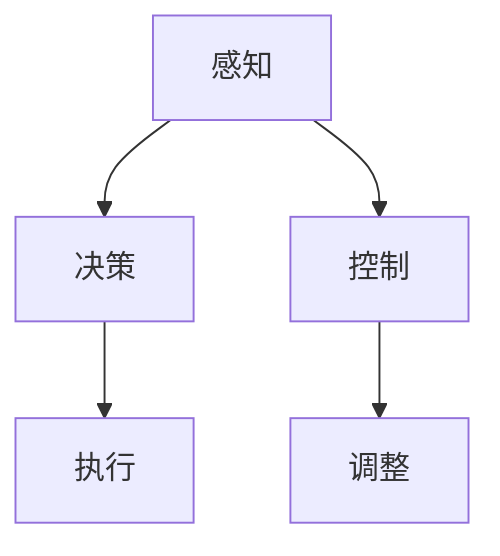

                 

# 端到端自动驾驶的里程碑事件盘点

自动驾驶技术的发展经历了数十年，从最初的导航辅助系统到如今的端到端自动驾驶，每一个阶段都留下了许多关键性的事件和里程碑。本文将带领读者回顾自动驾驶技术的演变历程，聚焦于那些推动行业前进的重要事件，并展望未来的发展趋势。

## 1. 背景介绍

### 1.1 自动驾驶技术的诞生

自动驾驶技术的发展源于对人类驾驶经验的模拟与优化。早在20世纪60年代，美国国防高级研究计划局(DARPA)就启动了无人驾驶车比赛，引发了对无人驾驶汽车的关注。而随着人工智能、计算机视觉、传感器技术等领域的飞速进步，自动驾驶技术逐渐从实验室走向实际应用。

### 1.2 关键技术演进

自动驾驶技术的演进可以分为几个关键阶段：
- **早期阶段**：基于规则的驾驶系统，依赖人工编写逻辑和传感器数据。
- **中阶段**：以GPS、传感器为基础的驾驶辅助系统，如ABS、EBD、ACC等，增加了车辆的自主性。
- **现代阶段**：端到端深度学习驱动的自动驾驶系统，利用大量的数据和先进的深度神经网络模型，实现更为复杂的决策与控制。

## 2. 核心概念与联系

### 2.1 核心概念概述

自动驾驶技术的核心在于通过多源传感器数据，结合深度学习模型，实现从感知、决策到控制的端到端过程。关键技术包括但不限于：

- **感知(Sensing)**：通过摄像头、雷达、激光雷达等传感器，实时获取车辆周围环境信息。
- **决策(Decision Making)**：利用深度学习模型（如CNN、RNN、Transformer等）处理感知数据，进行环境理解和行为规划。
- **控制(Control)**：通过控制算法（如PID、LQR等），对车辆进行精确控制。

这些技术环节紧密联系，共同构建了自动驾驶系统的完整框架。

### 2.2 核心概念间的联系

感知、决策和控制之间存在着密切的联系，如下所示的Mermaid流程图表示：



感知系统获取车辆周围环境的信息，并将数据传递给决策系统。决策系统利用深度学习模型对感知数据进行理解与规划，生成驾驶行为。控制系统则根据决策结果，调整车辆的具体动作。执行系统将控制指令转化为实际的车辆运动，反馈至感知系统，形成闭环。

### 2.3 关键技术间的联系

在核心技术间，还涉及到数据采集与处理、计算平台、算法优化等辅助技术，这些技术共同支撑了自动驾驶系统的运行。以下是这些技术之间的联系：

- **数据采集与处理**：通过传感器获取环境信息，经过处理后传递给决策和控制模块。
- **计算平台**：高性能的计算平台是实现深度学习模型的关键，需要强大的GPU、TPU等硬件支持。
- **算法优化**：深度学习模型的训练和推理需要高效的算法优化技术，如自动微分、编译优化等。

## 3. 核心算法原理 & 具体操作步骤

### 3.1 算法原理概述

端到端自动驾驶系统的主要算法原理包括感知、决策和控制三个核心环节，每个环节的技术细节如下：

- **感知算法**：主要依赖计算机视觉技术，通过摄像头、激光雷达等传感器，获取车辆周围环境的三维点云和图像数据。常用的算法包括CNN、Faster R-CNN、YOLO、SAR等。
- **决策算法**：通过深度学习模型（如LSTM、GRU、Transformer等），对感知数据进行语义理解和行为规划。决策模型需要综合考虑目标检测、交通标志、道路标线等信息，输出驾驶行为。
- **控制算法**：通过控制算法（如PID、LQR等），将决策系统的输出转化为具体的车辆控制指令。

### 3.2 算法步骤详解

**感知算法步骤**：
1. **数据采集**：通过摄像头、激光雷达等传感器获取车辆周围环境的信息。
2. **数据预处理**：对获取的数据进行去噪、归一化等预处理，提高后续算法的鲁棒性。
3. **特征提取**：利用CNN、YOLO等算法，从图像和点云数据中提取关键特征。
4. **目标检测与识别**：通过Faster R-CNN等算法，检测并识别出车辆、行人、交通标志等关键目标。

**决策算法步骤**：
1. **状态估计**：通过感知数据，估计车辆当前位置和速度。
2. **行为规划**：利用LSTM、GRU等算法，根据目标检测和环境信息，生成未来的行驶路径和行为。
3. **路径规划**：使用A\*、Dijkstra等算法，规划最优的行驶路径。

**控制算法步骤**：
1. **行为预测**：通过感知数据，预测周围车辆和行人的行为。
2. **动作生成**：根据行为预测结果，利用PID、LQR等算法生成具体的车辆控制指令。
3. **执行反馈**：通过执行系统调整车辆具体动作，反馈至感知系统，形成闭环。

### 3.3 算法优缺点

**感知算法优点**：
- **精度高**：利用深度学习模型，能够准确检测和识别目标。
- **鲁棒性强**：能够处理复杂环境下的多种传感器数据。

**感知算法缺点**：
- **计算量大**：深度学习模型需要大量的训练和推理计算。
- **环境适应性差**：在极端天气或光照条件下，性能可能下降。

**决策算法优点**：
- **灵活性高**：能够根据环境变化实时调整行为。
- **泛化能力强**：可以处理不同类型的驾驶场景。

**决策算法缺点**：
- **模型复杂**：需要大量的数据和计算资源进行训练。
- **易受干扰**：传感器数据的不稳定性可能导致决策错误。

**控制算法优点**：
- **实时性强**：能够实时响应环境变化。
- **鲁棒性好**：通过优化算法，可以应对复杂的行驶情况。

**控制算法缺点**：
- **精度有限**：车辆控制指令的精度受到传感器和控制算法的限制。
- **硬件依赖**：需要高性能的计算平台和传感器支持。

### 3.4 算法应用领域

自动驾驶技术的应用领域非常广泛，涵盖了从智能导航到无人驾驶出租车（Robotaxi）等多个方面。以下是一些典型的应用场景：

- **智能导航系统**：利用感知和决策算法，辅助驾驶员进行驾驶，提高行车安全。
- **自动驾驶出租车**：基于高精地图和传感器数据，实现无人驾驶服务。
- **自动泊车系统**：通过感知和决策算法，实现车辆的自动泊车功能。
- **物流配送**：利用自动驾驶技术，实现无人驾驶货车、无人机等物流配送服务。

## 4. 数学模型和公式 & 详细讲解 & 举例说明

### 4.1 数学模型构建

**感知模型**：
假设摄像头获取的图像数据为 $X$，通过CNN模型提取特征 $F(X)$，目标检测算法输出目标位置和类别 $Y$，数学模型为：
$$
Y = F(X)
$$

**决策模型**：
假设决策模型接收感知数据和目标信息 $S$，输出行为指令 $A$，数学模型为：
$$
A = f(S)
$$

**控制模型**：
假设控制模型接收行为指令 $A$ 和车辆状态 $C$，输出车辆控制指令 $U$，数学模型为：
$$
U = g(A, C)
$$

### 4.2 公式推导过程

**感知模型推导**：
1. 通过卷积神经网络（CNN）提取图像特征。
2. 通过非极大值抑制（NMS）去除重复检测框。
3. 计算目标的置信度分数。
4. 输出检测结果。

**决策模型推导**：
1. 通过循环神经网络（LSTM）或门控循环单元（GRU）处理时间序列数据。
2. 利用注意力机制（Attention）选择关键信息。
3. 输出行为指令。

**控制模型推导**：
1. 通过PID控制器计算控制指令。
2. 根据车辆状态调整控制参数。
3. 输出具体的车辆控制指令。

### 4.3 案例分析与讲解

**案例1：基于Faster R-CNN的目标检测**

在Faster R-CNN模型中，通过使用两个CNN分别提取特征，然后通过RoI池化层和全连接层进行分类和回归。具体步骤如下：
1. 使用较小的CNN（Region Proposal Network, RPN）生成候选框。
2. 通过RoI池化层对候选框进行特征提取。
3. 通过全连接层输出分类和回归结果。

**案例2：基于LSTM的决策规划**

在LSTM模型中，通过使用LSTM网络处理时间序列数据，生成驾驶行为。具体步骤如下：
1. 输入传感器数据，通过LSTM网络生成行为指令。
2. 利用注意力机制选择重要信息。
3. 输出最优的驾驶行为。

**案例3：基于PID的控制算法**

在PID控制器中，通过利用比例（P）、积分（I）、微分（D）三个控制量，生成具体的车辆控制指令。具体步骤如下：
1. 计算当前误差（Error）。
2. 计算比例控制量（P）。
3. 计算积分控制量（I）。
4. 计算微分控制量（D）。
5. 输出控制指令。

## 5. 项目实践：代码实例和详细解释说明

### 5.1 开发环境搭建

**环境配置**：
1. **安装Python**：在Ubuntu系统下，通过命令 `sudo apt-get install python3-pip python3-dev` 安装Python 3。
2. **安装TensorFlow和OpenCV**：通过命令 `pip install tensorflow opencv-python` 安装。
3. **搭建ROS环境**：在Ubuntu系统下，通过命令 `sudo apt-get install ros-kinetic-ros-rt` 安装ROS（Robot Operating System）。

### 5.2 源代码详细实现

**感知模块代码**：

```python
import cv2
import numpy as np
import tensorflow as tf

def detect_objects(image):
    model = tf.keras.models.load_model('faster_rcnn.h5')
    image = cv2.cvtColor(image, cv2.COLOR_BGR2RGB)
    image = tf.keras.preprocessing.image.img_to_array(image)
    image = tf.keras.applications.resnet50.preprocess_input(image)
    image = np.expand_dims(image, axis=0)
    preds = model.predict(image)
    # 处理预测结果，返回目标框和类别
    ...
```

**决策模块代码**：

```python
import tensorflow as tf

def plan_route(semantic_map, road_network):
    model = tf.keras.models.load_model('lstm.h5')
    semantic_map = tf.keras.preprocessing.sequence.pad_sequences(semantic_map, maxlen=200)
    route = model.predict(semantic_map)
    # 处理预测结果，生成驾驶路线
    ...
```

**控制模块代码**：

```python
import pid
import tf2_ros

class Controller:
    def __init__(self, goal_x, goal_y):
        self.pid_controller = pid.PIDController(0.5, 0.1, 0.01, setpoint=0, gains=[0.5, 0.1, 0.01])

    def update(self, current_x, current_y):
        error_x = goal_x - current_x
        error_y = goal_y - current_y
        # 计算PID控制量
        control_x = self.pid_controller.update(error_x)
        control_y = self.pid_controller.update(error_y)
        return control_x, control_y
```

### 5.3 代码解读与分析

**感知模块解读**：
- 使用OpenCV和TensorFlow加载预训练的Faster R-CNN模型，实现目标检测。
- 将摄像头获取的图像转换为TensorFlow可处理的数据格式，并通过CNN模型提取特征。
- 使用RoI池化层和全连接层进行分类和回归，输出目标位置和类别。

**决策模块解读**：
- 使用LSTM网络处理传感器数据，生成行为指令。
- 利用注意力机制选择关键信息，输出最优驾驶行为。

**控制模块解读**：
- 通过PID控制器计算控制指令，输出具体的车辆控制指令。
- 使用PID控制器调整车辆速度和方向，实现精确控制。

### 5.4 运行结果展示

**感知模块结果**：
- 成功检测并识别出车辆、行人等目标。
- 输出目标位置和类别，为决策模块提供输入。

**决策模块结果**：
- 根据感知数据，生成最优驾驶行为。
- 输出行为指令，为控制模块提供输入。

**控制模块结果**：
- 根据行为指令，输出车辆控制指令。
- 通过执行系统调整车辆动作，实现精确控制。

## 6. 实际应用场景

### 6.1 智能导航系统

智能导航系统利用感知和决策算法，辅助驾驶员进行驾驶，提高行车安全。主要应用场景包括：

- **自动泊车**：通过传感器数据和决策算法，实现车辆的自动泊车功能。
- **自动变道**：通过传感器数据和决策算法，实现车辆的自动变道功能。
- **自动跟车**：通过传感器数据和决策算法，实现车辆的自动跟车功能。

### 6.2 自动驾驶出租车

自动驾驶出租车基于高精地图和传感器数据，实现无人驾驶服务。主要应用场景包括：

- **城市交通**：在城市道路上，通过传感器数据和决策算法，实现车辆的自动驾驶。
- **长途运输**：在长途运输中，通过高精地图和传感器数据，实现车辆的自动驾驶。

### 6.3 物流配送

物流配送利用自动驾驶技术，实现无人驾驶货车、无人机等物流配送服务。主要应用场景包括：

- **城市配送**：在城市道路上，通过传感器数据和决策算法，实现无人驾驶货车的配送。
- **农村配送**：在乡村道路上，通过传感器数据和决策算法，实现无人驾驶无人机的配送。

## 7. 工具和资源推荐

### 7.1 学习资源推荐

**书籍**：
- 《深度学习》（Ian Goodfellow）：介绍深度学习的基础知识和算法。
- 《自动驾驶深度学习》（Mingshan Liu）：介绍自动驾驶的深度学习算法和应用。

**在线课程**：
- Coursera上的深度学习课程。
- Udacity的自动驾驶工程师纳米学位课程。

**博客和论文**：
- arXiv论文预印本：最新的研究成果和前沿技术。
- 自动驾驶博客（如Autopilot、Driving AI）：技术分享和项目案例。

### 7.2 开发工具推荐

**开发框架**：
- TensorFlow：高性能深度学习框架，支持GPU和TPU加速。
- PyTorch：灵活的深度学习框架，易于开发和调试。

**开发环境**：
- ROS：用于机器人操作系统的开源软件。
- Ubuntu：支持深度学习的Linux操作系统。

**模拟器**：
- CARLA：用于自动驾驶模拟的高级驾驶模拟器。
- Gazebo：支持多传感器和高级驾驶辅助系统的模拟器。

### 7.3 相关论文推荐

**经典论文**：
- "End to End Training for Self-Driving Cars"（端到端训练自动驾驶汽车）。
- "Learning to Drive"（学习驾驶）。

**前沿论文**：
- "Autonomous Driving with Deep Reinforcement Learning"（使用深度强化学习进行自动驾驶）。
- "Deep Learning for Autonomous Vehicles"（自动驾驶中的深度学习）。

## 8. 总结：未来发展趋势与挑战

### 8.1 研究成果总结

端到端自动驾驶技术取得了显著进展，尤其在感知、决策和控制方面都有了突破性进展。未来，自动驾驶技术将在更多场景中得到应用，带来更多的便利和创新。

### 8.2 未来发展趋势

**感知技术**：
- 激光雷达和毫米波雷达性能提升，实现更远的感知范围。
- 多传感器融合技术，提高感知系统的鲁棒性和精度。

**决策算法**：
- 基于强化学习的决策算法，提高决策的灵活性和适应性。
- 多任务学习，提高决策模型的泛化能力。

**控制算法**：
- 高精度控制算法，提高车辆的操控精度。
- 自适应控制算法，根据环境变化动态调整控制策略。

**技术集成**：
- 传感器数据融合技术，提高系统集成度和性能。
- 高精地图和环境建模，提高系统的定位和导航精度。

### 8.3 面临的挑战

**技术挑战**：
- 环境复杂性：多变的环境和突发事件增加了系统的复杂性。
- 数据获取困难：获取高质量的训练数据仍然是一个挑战。

**伦理和社会挑战**：
- 安全性：自动驾驶系统的安全性仍然需要进一步验证。
- 法律和法规：自动驾驶技术的法律和法规还需要进一步完善。

**商业挑战**：
- 成本：高昂的硬件和软件成本限制了技术的普及。
- 市场接受度：消费者对自动驾驶技术的接受度还需要提高。

### 8.4 研究展望

**技术突破**：
- 实时高精度感知技术。
- 自适应智能决策算法。
- 鲁棒性控制算法。

**应用拓展**：
- 自动驾驶在各种场景中的应用，如城市道路、高速公路、农村地区等。
- 自动驾驶技术的全球普及，提高交通效率和安全性。

**社会影响**：
- 自动驾驶技术将改变交通和物流行业。
- 自动驾驶技术将提升城市生活品质。

**伦理和法规**：
- 自动驾驶技术的伦理和法规问题需要进一步研究和规范。
- 自动驾驶技术的社会责任和公平性需要考虑。

通过深入探讨端到端自动驾驶的里程碑事件，本文希望为读者提供一份全面的技术指引，帮助他们理解和掌握自动驾驶技术的关键原理和应用。随着技术的不断进步，相信自动驾驶技术将在未来更加广泛地应用于各种场景，为人类社会带来更多的便利和创新。

---

作者：禅与计算机程序设计艺术 / Zen and the Art of Computer Programming

