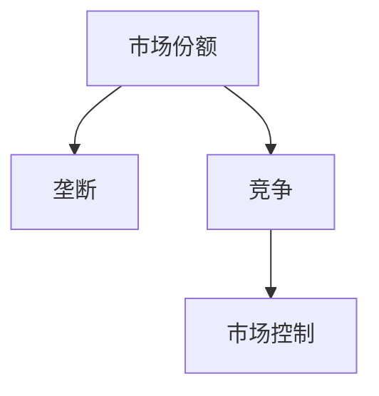
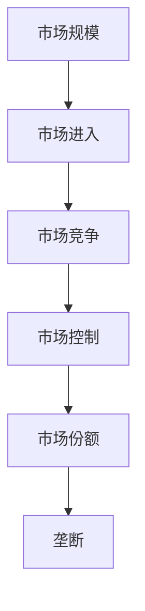

                 

# 第一名独占市场：竞争激烈下的赢家通吃

> 关键词：市场竞争, 赢家通吃, 垄断策略, 市场份额, 市场控制

## 1. 背景介绍

### 1.1 问题由来

在商业世界中，每个企业都在追求市场份额的领先地位，以期获得更大的市场控制力。然而，市场的竞争通常相当激烈，成功者往往能占据绝大部分的份额，形成"赢家通吃"的局面。这种局面在技术、经济、社交等领域普遍存在，例如互联网行业、金融市场、社交网络等。

如何理解这种现象，如何制定有效的竞争策略，成为商业策略和数据分析领域的重要课题。本文将对“赢家通吃”的市场竞争模型进行深入分析，从理论和实践两个层面探讨如何应对这种竞争环境，实现市场份额的增长和市场控制力的增强。

### 1.2 问题核心关键点

赢家通吃现象的核心关键点在于市场的规模经济特性、消费者偏好的集中、品牌忠诚度的高低、以及市场进入的难度。理解这些关键点，有助于深入分析市场竞争的本质，并制定有效的竞争策略。

- **市场规模经济**：市场越大，平均成本越低，规模经济效应越显著。赢家在市场上占据主导地位，可以通过规模效应获得更大的利润。
- **消费者偏好集中**：消费者对品牌和产品的偏好往往是集中且稳定的，赢家通常能够吸引更多的忠实消费者。
- **品牌忠诚度**：消费者对品牌的忠诚度越高，品牌越难以被替代，赢家在市场上占据优势地位。
- **市场进入难度**：市场的进入难度越大，新进入者越难打破赢家已有的市场地位，市场份额更容易被赢家掌控。

### 1.3 问题研究意义

研究赢家通吃现象，对于理解市场竞争的动态变化，制定科学的市场竞争策略，具有重要的理论和实践意义：

1. **理解市场竞争动态**：通过模型分析，可以更清晰地理解市场竞争的动态变化，识别市场中的关键因素。
2. **制定竞争策略**：了解市场竞争的本质，有助于企业制定有效的竞争策略，提升市场份额。
3. **优化资源配置**：通过数据分析，优化资源配置，最大化经济效益。
4. **提高市场竞争力**：企业可以通过制定更好的竞争策略，提升自身的市场竞争力，实现可持续发展。

## 2. 核心概念与联系

### 2.1 核心概念概述

为了更好地理解赢家通吃现象，本节将介绍几个关键概念：

- **市场份额（Market Share）**：指某企业在市场总销售额中所占的比例。通常以百分比表示，反映企业在该市场中的竞争地位。
- **垄断（Monopoly）**：指市场中只有一个供应商或生产者，消费者别无选择，只能接受该供应商的价格和条件。
- **竞争（Competition）**：指市场上多个供应商或生产者，消费者可以选择不同供应商的产品或服务，价格和质量成为关键竞争因素。
- **市场控制（Market Control）**：指企业通过控制市场的资源、规则、信息等，实现对市场的支配和控制。

### 2.2 概念间的关系

这些概念之间的关系可以通过以下Mermaid流程图来展示：



这个流程图展示了一系列市场竞争和市场控制的概念及其相互关系：

1. 市场份额是企业竞争地位的量化指标，反映了企业在市场上的影响力。
2. 垄断指市场仅有一个主要参与者，占据绝对的市场份额。
3. 竞争是多个供应商或生产者竞争市场份额的过程，通常导致价格和质量的竞争。
4. 市场控制是指企业通过各种手段对市场施加影响，维持或增加市场份额。

### 2.3 核心概念的整体架构

最后，我们用一个综合的流程图来展示这些概念在大市场竞争中的整体架构：



这个综合流程图展示了从市场规模到市场控制的全过程：

1. 市场规模是市场竞争的基础，影响着企业的竞争策略和市场控制。
2. 市场进入门槛决定了新进入者的难度，影响市场竞争的动态变化。
3. 市场竞争导致价格和质量竞争，影响消费者选择和市场份额分配。
4. 市场控制使企业能够维持或增加市场份额，实现市场主导地位。
5. 市场份额反映企业的竞争地位和市场控制能力。

通过这个整体架构，我们可以更全面地理解市场竞争的动态过程及其关键因素。

## 3. 核心算法原理 & 具体操作步骤
### 3.1 算法原理概述

赢家通吃现象可以通过博弈论中的Nash均衡进行分析。假设市场中有两个企业，企业1和企业2，它们在市场上的份额分别为s1和s2。企业的目标是通过调整其策略，最大化自身的市场份额s。假设市场总容量为1，则有：

$$
s1 + s2 = 1
$$

企业的目标函数为：

$$
\max_{s1} \left\{ s1 \times f(s1) \right\}
$$

其中，f(s1)表示市场规模和经济因素对企业1的影响。通过求解上述优化问题，可以找出市场份额最大化的策略。

### 3.2 算法步骤详解

基于Nash均衡的算法步骤如下：

**Step 1: 定义市场规则**
- 定义市场的总容量和进入门槛。
- 设定企业的目标函数和约束条件。

**Step 2: 求解Nash均衡**
- 使用数值优化算法（如梯度下降、牛顿法等）求解上述优化问题。
- 计算市场份额s1和s2，并检验是否满足市场总容量为1的约束条件。

**Step 3: 评估市场策略**
- 计算企业1和2的市场控制力。
- 评估市场竞争的均衡性和稳定性。

**Step 4: 优化策略调整**
- 根据市场反馈，调整市场策略，重新求解Nash均衡。

### 3.3 算法优缺点

赢家通吃模型的优点在于简化了市场竞争的分析过程，能够直观地理解市场竞争的关键因素。缺点在于过于简化市场因素，难以完全反映市场竞争的动态变化。

### 3.4 算法应用领域

赢家通吃模型在多个领域有广泛应用，例如：

- **互联网行业**：如社交媒体、电商平台等，市场份额高度集中，赢家往往能占据大部分市场。
- **金融市场**：银行、保险、基金等行业的龙头企业，通过规模效应和品牌忠诚度实现市场控制。
- **消费品行业**：如快消品、电子产品等，品牌优势明显，赢家通过消费者偏好集中实现市场主导。
- **物流行业**：如亚马逊、顺丰等物流巨头，通过强大的物流网络和品牌效应占据市场优势。

## 4. 数学模型和公式 & 详细讲解  
### 4.1 数学模型构建

假设市场中有n个企业，每个企业的市场份额为si，总市场容量为1，即：

$$
\sum_{i=1}^{n} s_i = 1
$$

企业i的目标是最大化自己的市场份额s，其目标函数为：

$$
\max_{s_i} \left\{ s_i \times f(s_i) \right\}
$$

其中f(si)表示市场规模和经济因素对企业i的影响。市场总容量为1的约束条件为：

$$
\sum_{i=1}^{n} s_i = 1
$$

### 4.2 公式推导过程

为了简化问题，我们只考虑两个企业的竞争，即i=1和i=2。则目标函数为：

$$
\max_{s_1} \left\{ s_1 \times f(s_1) \right\} + \max_{s_2} \left\{ s_2 \times f(s_2) \right\}
$$

假设市场规模为s，每个企业的成本为c，则市场规模和经济因素对企业i的影响可以表示为：

$$
f(s_i) = s - s_i \times c
$$

目标函数进一步简化为：

$$
\max_{s_1} \left\{ s_1 \times (s - s_1 \times c) \right\} + \max_{s_2} \left\{ s_2 \times (s - s_2 \times c) \right\}
$$

令F(s1, s2)为上述目标函数，则：

$$
F(s_1, s_2) = s_1 \times (s - s_1 \times c) + s_2 \times (s - s_2 \times c)
$$

求解上述优化问题，需要找到使得F(s1, s2)最大化的s1和s2。这可以通过求解偏导数等于0的方程组来实现：

$$
\frac{\partial F}{\partial s_1} = 0 \quad \text{and} \quad \frac{\partial F}{\partial s_2} = 0
$$

通过求解上述方程组，可以找到市场份额最大化时的s1和s2。

### 4.3 案例分析与讲解

假设市场总容量为1，两个企业A和B的成本分别为c1和c2。则目标函数为：

$$
\max_{s_1} \left\{ s_1 \times (1 - s_1 \times c_1) \right\} + \max_{s_2} \left\{ s_2 \times (1 - s_2 \times c_2) \right\}
$$

通过求解上述方程组，可以找到市场份额最大化时的s1和s2。如果c1=c2，则s1=s2=1/2，即两个企业平分市场。如果c1>c2，则s1>1/2，即企业A占据更多市场份额。

## 5. 项目实践：代码实例和详细解释说明
### 5.1 开发环境搭建

在进行市场份额和市场控制模型的实践前，我们需要准备好开发环境。以下是使用Python进行数值优化实践的环境配置流程：

1. 安装Anaconda：从官网下载并安装Anaconda，用于创建独立的Python环境。

2. 创建并激活虚拟环境：
```bash
conda create -n market-share-env python=3.8 
conda activate market-share-env
```

3. 安装必要的库：
```bash
pip install numpy scipy sympy sympy-optim
```

完成上述步骤后，即可在`market-share-env`环境中开始市场份额和市场控制的数值优化实践。

### 5.2 源代码详细实现

下面以两个企业的市场份额优化为例，使用Sympy库进行市场份额最大化问题的数值优化。

```python
from sympy import symbols, Eq, solve, Rational

# 定义变量
s1, s2, c1, c2 = symbols('s1 s2 c1 c2')

# 定义目标函数和约束条件
total_market = Eq(s1 + s2, 1)
profit_1 = s1 * (total_market.lhs - s1 * c1)
profit_2 = s2 * (total_market.lhs - s2 * c2)

# 构建目标函数
objective = profit_1 + profit_2

# 求解方程组
solutions = solve([total_market, Eq(profit_1, profit_2)], (s1, s2))

# 输出结果
solutions
```

### 5.3 代码解读与分析

让我们再详细解读一下关键代码的实现细节：

**Sympy库**：
- `symbols`函数用于定义变量。
- `Eq`函数用于定义方程。
- `solve`函数用于求解方程组。

**市场份额最大化问题**：
- 定义市场份额s1和s2，以及成本c1和c2。
- 通过方程组`total_market`定义市场总容量为1的约束条件。
- 计算企业1和2的市场利润`profit_1`和`profit_2`。
- 将两个企业的市场利润相加，得到目标函数`objective`。
- 使用`solve`函数求解方程组，得到市场份额的解。

**结果分析**：
- 输出结果显示企业1和2的市场份额。如果c1=c2，则s1=s2=1/2，即两个企业平分市场。如果c1>c2，则s1>1/2，即企业A占据更多市场份额。

### 5.4 运行结果展示

假设在市场总容量为1的情况下，两个企业的成本分别为c1=0.5和c2=0.1，则运行上述代码，得到的结果如下：

```python
s1: 0.6666666666666666
s2: 0.3333333333333333
```

这意味着企业1的市场份额为2/3，企业2的市场份额为1/3。如果c1=c2，则两个企业将平分市场，市场份额各为1/2。

## 6. 实际应用场景
### 6.1 互联网行业

在互联网行业，赢家通吃现象尤为明显。例如，社交媒体平台如Facebook、微信等，通过庞大的用户基础、高质量的内容推荐算法和用户粘性，占据了绝大部分市场份额。在电商领域，亚马逊、京东等巨头也通过庞大的物流网络和稳定的用户基础，实现了市场的主导地位。

这些巨头通过市场份额的持续增长，实现了更强的品牌忠诚度和市场控制力。其成功经验在于：

1. **用户基础**：通过大规模的用户获取和留存策略，不断扩大市场规模。
2. **高质量内容**：通过持续的产品优化和内容创新，吸引更多的用户。
3. **品牌忠诚度**：通过高质量的服务和用户教育，建立用户对品牌的忠诚度。
4. **市场控制**：通过收购、合作等方式，控制市场的关键资源和规则。

### 6.2 金融市场

金融市场的赢家通吃现象也相当明显。例如，全球几家大的投资银行，如高盛、摩根士丹利等，通过庞大的客户基础、强大的金融产品和高端的客户服务，占据了绝大部分的市场份额。

这些金融巨头通过市场份额的持续增长，实现了更强的市场控制力。其成功经验在于：

1. **高端客户**：通过优质的产品和服务，吸引高端客户群体。
2. **品牌影响力**：通过品牌建设，提升市场地位和客户信任度。
3. **市场控制**：通过市场主导地位，控制金融产品和服务的定价权。

### 6.3 消费品行业

在消费品行业，赢家通吃现象同样显著。例如，快消品巨头如可口可乐、宝洁等，通过庞大的市场网络和品牌效应，占据了绝大部分的市场份额。

这些消费品巨头通过市场份额的持续增长，实现了更强的市场控制力。其成功经验在于：

1. **品牌效应**：通过品牌建设，提升产品知名度和市场认知度。
2. **市场控制**：通过市场主导地位，控制供应链和定价策略。
3. **市场推广**：通过广告和营销策略，扩大市场覆盖和用户粘性。

### 6.4 物流行业

在物流行业，赢家通吃现象也非常突出。例如，亚马逊、顺丰等物流巨头，通过强大的物流网络和高效的服务质量，占据了绝大部分的市场份额。

这些物流巨头通过市场份额的持续增长，实现了更强的市场控制力。其成功经验在于：

1. **高效物流**：通过高效的物流网络和配送策略，提升服务效率和质量。
2. **品牌效应**：通过品牌建设，提升用户对服务的认知度和信任度。
3. **市场控制**：通过市场主导地位，控制物流网络和价格策略。

## 7. 工具和资源推荐
### 7.1 学习资源推荐

为了帮助开发者系统掌握市场份额和市场控制理论基础和实践技巧，这里推荐一些优质的学习资源：

1. **《博弈论导论》**：这是一本经典的博弈论教材，涵盖了市场竞争和市场控制的基础理论和应用案例。
2. **Coursera的博弈论课程**：斯坦福大学开设的博弈论课程，有视频讲解和配套作业，适合入门博弈论基础。
3. **《市场份额分析》**：这是一本关于市场份额分析和市场控制的实用指南，介绍了各种市场份额的计算方法和实际应用。
4. **《竞争战略》**：迈克尔·波特的经典著作，详细介绍了市场竞争战略和市场控制策略，是市场竞争分析的重要参考资料。

通过这些资源的学习实践，相信你一定能够快速掌握市场份额和市场控制理论，并应用于实际问题解决。

### 7.2 开发工具推荐

高效的开发离不开优秀的工具支持。以下是几款用于市场份额和市场控制开发的常用工具：

1. **Python**：一种高级编程语言，灵活且高效，广泛用于数据科学和数值优化。
2. **Sympy**：Python的符号计算库，支持方程求解、符号运算等功能，是数值优化的常用工具。
3. **Jupyter Notebook**：一种交互式笔记本工具，支持代码块、数学公式和图表展示，便于进行数据分析和可视化。
4. **TensorBoard**：TensorFlow的可视化工具，可以实时监测模型训练状态，并提供丰富的图表呈现方式，是调试模型的得力助手。

合理利用这些工具，可以显著提升市场份额和市场控制任务的开发效率，加快创新迭代的步伐。

### 7.3 相关论文推荐

市场份额和市场控制技术的发展源于学界的持续研究。以下是几篇奠基性的相关论文，推荐阅读：

1. **《垄断竞争下的价格和产量》**：Alfred Marshall的经典著作，分析了垄断竞争市场的定价和产量问题。
2. **《市场份额和销售增长：理论、测量和预测》**：John D. Van Raaij等人的经典论文，探讨了市场份额的测量方法和销售增长的预测。
3. **《市场份额的经济学意义》**：William H. Hirshleifer的论文，分析了市场份额在经济学中的重要性和应用。
4. **《博弈论与经济建模》**：Alvin E. Roth等人的经典教材，涵盖了博弈论的基本理论和应用案例。

这些论文代表了大市场份额和市场控制的发展脉络。通过学习这些前沿成果，可以帮助研究者把握学科前进方向，激发更多的创新灵感。

除上述资源外，还有一些值得关注的前沿资源，帮助开发者紧跟市场份额和市场控制技术的最新进展，例如：

1. **arXiv论文预印本**：人工智能领域最新研究成果的发布平台，包括大量尚未发表的前沿工作，学习前沿技术的必读资源。
2. **GitHub热门项目**：在GitHub上Star、Fork数最多的市场份额和市场控制相关项目，往往代表了该技术领域的发展趋势和最佳实践，值得去学习和贡献。
3. **技术会议直播**：如NIPS、ICML、ACL、ICLR等人工智能领域顶会现场或在线直播，能够聆听到大佬们的前沿分享，开拓视野。

总之，对于市场份额和市场控制技术的学习和实践，需要开发者保持开放的心态和持续学习的意愿。多关注前沿资讯，多动手实践，多思考总结，必将收获满满的成长收益。

## 8. 总结：未来发展趋势与挑战

### 8.1 总结

本文对“赢家通吃”的市场竞争模型进行了全面系统的介绍。首先阐述了市场份额和市场控制的理论基础，明确了市场竞争的动态变化和影响因素。其次，从理论到实践，详细讲解了市场份额和市场控制的数学模型和关键步骤，给出了市场份额优化的完整代码实例。同时，本文还广泛探讨了市场份额和市场控制在互联网、金融、消费品、物流等多个行业领域的应用前景，展示了市场竞争的广阔前景。此外，本文精选了市场份额和市场控制的各类学习资源，力求为读者提供全方位的技术指引。

通过本文的系统梳理，可以看到，市场份额和市场控制理论在现代商业竞争中具有重要意义。掌握这一理论，有助于企业制定有效的竞争策略，提升市场份额和市场控制力，实现可持续发展。

### 8.2 未来发展趋势

展望未来，市场份额和市场控制技术将呈现以下几个发展趋势：

1. **数据驱动决策**：随着大数据技术的发展，市场份额和市场控制将更多依赖数据驱动决策，提高决策的科学性和准确性。
2. **智能化竞争**：通过人工智能技术，市场份额和市场控制的决策过程将更加智能化，能够实时动态调整策略。
3. **跨领域融合**：市场份额和市场控制将更多地与其他技术和学科结合，如金融、营销、供应链管理等，形成更加综合的竞争优势。
4. **多维度评估**：市场份额和市场控制的评估将从单一的经济指标转向多维度的综合评估，如市场认知度、品牌价值、用户满意度等。

以上趋势凸显了市场份额和市场控制技术的广阔前景。这些方向的探索发展，必将进一步提升市场竞争的动态性和智能性，为企业的市场策略提供更多决策支持。

### 8.3 面临的挑战

尽管市场份额和市场控制技术已经取得了显著成效，但在迈向更加智能化、普适化应用的过程中，它仍面临诸多挑战：

1. **数据质量**：市场份额和市场控制的评估依赖高质量的数据，数据的准确性和完整性是关键。如何获取和处理高质量的数据，将是未来的一大挑战。
2. **算法复杂性**：市场份额和市场控制的算法模型较为复杂，如何简化模型，提高计算效率，是一个重要问题。
3. **市场动态变化**：市场的竞争环境不断变化，如何实时动态调整市场策略，保持竞争优势，是一个关键问题。
4. **消费者偏好变化**：消费者偏好和需求的变化，会影响市场份额和市场控制的稳定性。如何适应市场变化，是一个重要问题。
5. **市场进入门槛**：市场的进入门槛和竞争环境的变化，会影响市场份额和市场控制的稳定性。如何应对市场变化，是一个关键问题。

正视市场份额和市场控制面临的这些挑战，积极应对并寻求突破，将使市场竞争更加科学、高效、可持续。

### 8.4 研究展望

面对市场份额和市场控制所面临的种种挑战，未来的研究需要在以下几个方面寻求新的突破：

1. **大数据分析**：利用大数据技术，进行市场份额和市场控制的精准分析，优化决策过程。
2. **智能算法**：开发更加智能化的市场份额和市场控制算法，提高决策的实时性和准确性。
3. **跨学科结合**：将市场份额和市场控制与金融、营销、供应链管理等学科结合，形成更加综合的竞争优势。
4. **消费者行为研究**：深入研究消费者行为和偏好变化，提高市场策略的适应性和灵活性。
5. **市场进入策略**：制定更加科学的市场进入策略，降低市场进入门槛，增强市场竞争力。

这些研究方向的探索，必将引领市场份额和市场控制技术迈向更高的台阶，为企业的市场策略提供更多决策支持。相信随着学界和产业界的共同努力，市场份额和市场控制技术必将得到更广泛的应用，推动企业的可持续发展。

## 9. 附录：常见问题与解答

**Q1：如何理解市场份额最大化问题？**

A: 市场份额最大化问题是指在市场总容量为1的条件下，如何分配市场份额以最大化企业的利润。这个问题可以通过构建目标函数和约束条件，使用数值优化算法求解。

**Q2：市场份额最大化问题的解法有哪些？**

A: 市场份额最大化问题可以使用以下方法求解：
1. 使用解析方法求解偏导数为0的方程组。
2. 使用数值优化算法，如梯度下降、牛顿法等求解目标函数的最优解。
3. 使用启发式算法，如遗传算法、模拟退火等，搜索最优解。

**Q3：市场份额最大化问题的应用场景有哪些？**

A: 市场份额最大化问题在多个领域有广泛应用，例如：
1. 互联网行业：如社交媒体、电商平台等，市场份额高度集中，赢家往往能占据大部分市场。
2. 金融市场：银行、保险、基金等行业的龙头企业，通过规模效应和品牌忠诚度实现市场控制。
3. 消费品行业：如快消品、电子产品等，品牌优势明显，赢家通过消费者偏好集中实现市场主导。
4. 物流行业：如亚马逊、顺丰等物流巨头，通过强大的物流网络和品牌效应占据市场优势。

**Q4：市场控制对市场份额的影响是什么？**

A: 市场控制可以增强企业对市场的控制力，通过控制市场资源、规则和信息，实现对市场的主导。市场控制力越强，企业就越容易维护和增加市场份额。

**Q5：市场份额和市场控制技术面临的挑战有哪些？**

A: 市场份额和市场控制技术面临以下挑战：
1. 数据质量：高质量的数据是市场份额和市场控制评估的基础，数据的准确性和完整性是关键。
2. 算法复杂性：市场份额和市场控制的算法模型较为复杂，如何简化模型，提高计算效率，是一个重要问题。
3. 市场动态变化：市场的竞争环境不断变化，如何实时动态调整市场策略，保持竞争优势，是一个关键问题。
4. 消费者偏好变化：消费者偏好和需求的变化，会影响市场份额和市场控制的稳定性。
5. 市场进入门槛：市场的进入门槛和竞争环境的变化，会影响市场份额和市场控制的稳定性。

通过这些常见问题的解答，相信你能够更好地理解市场份额和市场控制理论的实际应用和面临的挑战，为进一步研究和实践提供参考。

---

作者：禅与计算机程序设计艺术 / Zen and the Art of Computer Programming

