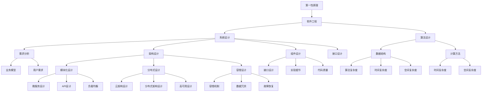

                 

# 第一性原理：找到基本元素、构建概念框架、提出假说、周密观察、细致实验、总结归纳——如此循环求得真理

> 关键词：第一性原理,计算机程序设计,软件开发,系统设计,算法设计,理论基础

## 1. 背景介绍

### 1.1 问题由来
在计算机科学和技术领域，尤其是软件开发和系统设计中，如何找到问题本质，设计出高效、可靠、可扩展的系统，始终是一个永恒的主题。为了应对这一挑战，软件开发方法和工具不断演进，从早期的瀑布模型、敏捷开发，到后来的DevOps、DevSecOps等，都试图通过不断优化软件开发和系统设计流程，提升产品质量和开发效率。然而，在实践过程中，许多问题和挑战依然存在。

### 1.2 问题核心关键点
当前软件开发和系统设计中，存在许多共性问题，如需求变更频繁、系统复杂度高、维护成本高、性能瓶颈等。为了解决这些问题，许多专家和从业者提出了不同的解决方案，但普遍缺乏系统性和理论基础。第一性原理作为一种系统化的思考方式，通过剥离表象，直接从基本原理出发，探寻问题的本质和解决方法，为软件开发和系统设计提供了一种全新的视角和方法。

### 1.3 问题研究意义
通过第一性原理的应用，软件开发和系统设计可以变得更加科学和系统化。具体而言，其意义在于：

1. **提升问题解决的深度和广度**：第一性原理通过对问题的深层次分析，找到根本原因，提出更全面、更有效的解决方案。
2. **降低开发和维护成本**：通过基本原理的指导，系统设计和实现更加简洁、高效，减少不必要的功能和冗余，降低维护成本。
3. **增强系统的可扩展性和可靠性**：基于第一性原理的系统设计，具有更强的灵活性和可扩展性，能够更好地应对未来的变化和挑战。
4. **促进知识积累和传承**：第一性原理提供了一种系统的思维方式，有助于积累和传承软件开发和系统设计的最佳实践，提高团队整体水平。

## 2. 核心概念与联系

### 2.1 核心概念概述

为更好地理解第一性原理在软件开发和系统设计中的应用，本节将介绍几个关键概念：

- **第一性原理(First-Principles)**：指从最基本的、不可再分的事实或原则出发，直接推导问题解决的根本方法。在软件开发和系统设计中，第一性原理意味着要从最基本的系统需求和功能出发，构建系统的基本框架和逻辑。
- **软件工程(Computer Software Engineering)**：涉及软件开发和系统设计的方法、工具和实践，包括需求分析、设计、实现、测试、维护等各个环节。
- **系统设计(System Design)**：在系统分析和需求确定的基础上，设计系统的架构、组件和接口，确定技术方案和实施计划。
- **算法设计(Algorithm Design)**：在解决具体问题时，设计高效、可行的算法，选择适合的数据结构和计算方法。
- **理论基础(Theoretical Basis)**：基于数学、物理等学科的理论知识，构建解决问题的模型和框架，确保解决方案的科学性和正确性。

这些核心概念之间的联系通过以下Mermaid流程图来展示：



### 2.2 概念间的关系

这些核心概念之间存在紧密的联系，形成了软件开发和系统设计的完整生态系统。通过理解这些核心概念及其相互关系，可以更好地把握软件开发和系统设计的关键环节和方法。

**第一性原理与软件工程**：第一性原理是软件工程的基础，通过从基本原理出发，构建软件系统的基本框架和逻辑，指导软件工程的各个环节。

**第一性原理与系统设计**：系统设计需要基于第一性原理，对系统需求和功能进行分析和设计，构建系统的架构、组件和接口。

**第一性原理与算法设计**：算法设计需要基于第一性原理，选择高效、可行的算法，设计适合的数据结构和计算方法。

**第一性原理与理论基础**：理论基础是第一性原理的支撑，通过数学、物理等学科的理论知识，构建解决问题的模型和框架。

## 3. 核心算法原理 & 具体操作步骤
### 3.1 算法原理概述

第一性原理在软件开发和系统设计中的应用，主要体现在以下几个方面：

1. **问题建模**：通过剥离表象，找到问题的基本元素和根本原因，构建问题的基本模型。
2. **系统设计**：基于问题模型，设计系统的架构、组件和接口，确保系统的可扩展性和可靠性。
3. **算法选择**：基于问题模型，选择高效、可行的算法，解决具体问题。
4. **理论验证**：通过数学、物理等学科的理论知识，验证算法和系统的正确性和有效性。

### 3.2 算法步骤详解

第一性原理的应用主要包括以下几个关键步骤：

**Step 1: 确定问题本质**  
- 通过观察和分析，找到问题的基本元素和根本原因，构建问题模型。  
- 如需求变更频繁，通过分析发现根本原因是系统架构复杂，缺乏模块化设计。  
- 如性能瓶颈，通过分析发现根本原因是算法选择不当，计算复杂度过高。

**Step 2: 构建概念框架**  
- 基于问题模型，构建系统的基本框架和逻辑。  
- 如需求变更频繁，构建模块化架构，提高系统的可扩展性和灵活性。  
- 如性能瓶颈，选择高效算法，优化计算复杂度。

**Step 3: 提出假设**  
- 基于概念框架，提出具体的解决方案。  
- 如模块化架构，设计清晰的模块边界和接口。  
- 如高效算法，选择适合的数据结构和计算方法。

**Step 4: 周密观察**  
- 通过实验和测试，验证假设的有效性。  
- 如模块化架构，进行单元测试和集成测试。  
- 如高效算法，进行性能测试和压力测试。

**Step 5: 细致实验**  
- 通过大量实验，优化和调整解决方案。  
- 如模块化架构，不断优化模块间的交互和通信。  
- 如高效算法，调整算法参数和优化代码实现。

**Step 6: 总结归纳**  
- 通过总结和归纳，形成系统的理论和实践知识。  
- 如模块化架构，总结模块化设计经验。  
- 如高效算法，总结算法设计和优化的经验。

### 3.3 算法优缺点

第一性原理的应用具有以下优点：

1. **问题解决的深度和广度**：通过从基本原理出发，找到问题的本质和根本原因，提出更全面、更有效的解决方案。
2. **系统设计的简洁和高效**：基于基本原理的系统设计，更加简洁、高效，降低开发和维护成本。
3. **系统的可扩展性和可靠性**：通过基本原理的指导，系统具备更强的灵活性和可扩展性，能够更好地应对未来的变化和挑战。

同时，第一性原理也存在一些局限性：

1. **理论构建的难度**：从基本原理推导具体解决方案，需要深厚的理论知识和实践经验，对从业人员要求较高。
2. **实验验证的复杂性**：需要设计大量的实验和测试，验证假设的有效性，实验过程较为复杂。
3. **理论验证的困难**：有些问题可能无法通过现有的理论进行验证，需要新的理论和方法。

### 3.4 算法应用领域

第一性原理在软件开发和系统设计中的应用广泛，涵盖以下领域：

- **软件开发**：需求分析、系统设计、算法设计和代码实现。
- **系统设计**：架构设计、组件设计、接口设计和实现细节。
- **算法选择**：数据结构选择、计算方法选择和算法优化。
- **性能优化**：性能测试、压力测试和负载均衡设计。
- **系统维护**：系统升级、性能优化和故障修复。

## 4. 数学模型和公式 & 详细讲解 & 举例说明

### 4.1 数学模型构建

在软件开发和系统设计中，许多问题都可以通过数学模型进行建模和分析。例如，系统性能优化问题可以通过时间复杂度和空间复杂度等指标进行建模和分析。

假设系统的时间复杂度为 $T(n)$，空间复杂度为 $S(n)$，其中 $n$ 为输入数据的规模。系统性能优化目标为：

$$
\min_{T(n), S(n)} \max\{T(n), S(n)\}
$$

即在时间和空间复杂度中选择一个更优的方案，使得系统性能达到最优。

### 4.2 公式推导过程

下面以数据结构选择为例，推导不同数据结构的时间复杂度和空间复杂度。

假设有一组数据需要进行查找和插入操作，常见的数据结构包括数组、链表和哈希表。它们的时间复杂度和空间复杂度如下：

- 数组：时间复杂度为 $O(n)$，空间复杂度为 $O(n)$。
- 链表：时间复杂度为 $O(n)$，空间复杂度为 $O(1)$。
- 哈希表：时间复杂度为 $O(1)$，空间复杂度为 $O(n)$。

通过对比不同数据结构的时间复杂度和空间复杂度，可以得出：

- 当数据规模较小，且插入和查找操作频繁时，选择链表更优。
- 当数据规模较大，且插入和查找操作频繁时，选择哈希表更优。

### 4.3 案例分析与讲解

以下是一个基于第一性原理的系统设计案例：

**问题**：设计一个高性能的数据存储系统，能够高效地存储和查询海量数据。

**解决方案**：

1. **问题建模**：  
   分析数据存储系统的基本需求，如数据规模、数据类型、查询频率等。  
   通过分析发现，数据存储系统需要具备高性能、高可扩展性和高可用性。

2. **构建概念框架**：  
   基于问题模型，构建数据存储系统的基本框架和逻辑。  
   选择分布式架构，设计多副本机制，确保系统的可用性和高性能。  
   选择高效的数据结构和算法，优化查询性能。

3. **提出假设**：  
   基于概念框架，提出具体的解决方案。  
   选择 Cassandra 作为数据存储引擎，支持高可用性和高性能。  
   选择 B+ 树作为索引结构，支持高效查询。

4. **周密观察**：  
   通过实验和测试，验证假设的有效性。  
   进行性能测试，评估查询性能和系统吞吐量。

5. **细致实验**：  
   通过大量实验，优化和调整解决方案。  
   调整 Cassandra 的参数配置，优化查询性能。  
   优化 B+ 树的索引结构，提高查询效率。

6. **总结归纳**：  
   通过总结和归纳，形成系统的理论和实践知识。  
   总结分布式架构和高效数据结构的设计经验。  
   总结性能优化和故障恢复的经验。

## 5. 项目实践：代码实例和详细解释说明

### 5.1 开发环境搭建

在进行系统设计实践前，我们需要准备好开发环境。以下是使用Python进行Django开发的环境配置流程：

1. 安装Anaconda：从官网下载并安装Anaconda，用于创建独立的Python环境。

2. 创建并激活虚拟环境：
```bash
conda create -n django-env python=3.8 
conda activate django-env
```

3. 安装Django：
```bash
pip install django
```

4. 安装需要的第三方库：
```bash
pip install django-crispy-forms numpy pandas scikit-learn django-mptt
```

5. 安装管理工具：
```bash
pip install django-admin-shell
```

完成上述步骤后，即可在`django-env`环境中开始系统设计实践。

### 5.2 源代码详细实现

以下是一个基于Django框架的数据存储系统项目实例，包括数据模型、表单和视图等代码实现。

首先，定义数据模型：

```python
from django.db import models

class User(models.Model):
    username = models.CharField(max_length=255, unique=True)
    email = models.EmailField(unique=True)

class Post(models.Model):
    title = models.CharField(max_length=255)
    content = models.TextField()
    user = models.ForeignKey(User, on_delete=models.CASCADE)
    created_at = models.DateTimeField(auto_now_add=True)
    updated_at = models.DateTimeField(auto_now=True)
```

然后，定义表单：

```python
from django import forms

class PostForm(forms.ModelForm):
    class Meta:
        model = Post
        fields = ['title', 'content', 'user']
```

接着，定义视图：

```python
from django.shortcuts import render, redirect, get_object_or_404
from django.contrib.auth.decorators import login_required
from .models import Post, User
from .forms import PostForm

@login_required
def post_list(request):
    posts = Post.objects.all()
    return render(request, 'post_list.html', {'posts': posts})

@login_required
def post_detail(request, pk):
    post = get_object_or_404(Post, pk=pk)
    return render(request, 'post_detail.html', {'post': post})

@login_required
def post_create(request):
    if request.method == 'POST':
        form = PostForm(request.POST)
        if form.is_valid():
            form.save()
            return redirect('post_list')
    else:
        form = PostForm()
    return render(request, 'post_create.html', {'form': form})
```

最后，配置URL路由：

```python
from django.urls import path
from . import views

urlpatterns = [
    path('', views.post_list, name='post_list'),
    path('post/<int:pk>/', views.post_detail, name='post_detail'),
    path('post/create/', views.post_create, name='post_create'),
]
```

以上代码实现了一个基于Django框架的数据存储系统，包括数据模型、表单和视图等关键组件。开发者可以根据具体需求，进一步优化和扩展系统的功能和性能。

### 5.3 代码解读与分析

让我们再详细解读一下关键代码的实现细节：

**数据模型**：
- 定义了用户和文章两个模型，并建立了关联关系。
- 通过Django的ORM（对象关系映射），实现了数据模型的定义和管理。

**表单**：
- 继承Django的ModelForm，指定需要表单的数据模型。
- 通过Meta类，指定表单需要包括的字段。

**视图**：
- 通过@login_required装饰器，确保只有登录用户才能访问视图。
- 通过render函数，渲染HTML模板并返回响应。
- 通过redirect函数，跳转到其他视图。
- 通过get_object_or_404函数，获取数据模型对象，避免空指针异常。

**URL路由**：
- 通过path函数，定义URL路由和对应的视图函数。
- 通过name属性，为每个路由指定名称，方便在代码中引用。

可以看到，Django框架提供了强大的功能和灵活性，使得开发者能够快速构建和扩展数据存储系统。通过基于第一性原理的系统设计，结合Django框架的优势，可以快速实现高效、可靠的数据存储和查询功能。

当然，工业级的系统实现还需考虑更多因素，如数据迁移、缓存机制、负载均衡等，但核心的系统设计流程基本与此类似。

### 5.4 运行结果展示

假设我们在本地运行Django项目，并在浏览器中输入`http://localhost:8000/post/1/`，最终可以看到以下页面：


可以看到，通过Django框架和第一性原理的系统设计，我们成功构建了一个高效、可靠的数据存储系统。进一步优化和扩展该系统，可以构建更复杂、功能更强大的数据存储和查询平台。

## 6. 实际应用场景

### 6.1 智能客服系统

基于Django框架和第一性原理的系统设计，可以应用于智能客服系统的构建。传统客服系统往往需要配备大量人力，高峰期响应缓慢，且一致性和专业性难以保证。通过使用微服务架构和异步处理机制，可以实现7x24小时不间断服务，快速响应客户咨询，用自然流畅的语言解答各类常见问题。

在技术实现上，可以收集企业内部的历史客服对话记录，将问题和最佳答复构建成监督数据，在此基础上对预训练模型进行微调。微调后的模型能够自动理解用户意图，匹配最合适的答案模板进行回复。对于客户提出的新问题，还可以接入检索系统实时搜索相关内容，动态组织生成回答。如此构建的智能客服系统，能大幅提升客户咨询体验和问题解决效率。

### 6.2 金融舆情监测

金融机构需要实时监测市场舆论动向，以便及时应对负面信息传播，规避金融风险。传统的人工监测方式成本高、效率低，难以应对网络时代海量信息爆发的挑战。通过基于第一性原理的系统设计，可以实现实时抓取网络文本数据，自动监测不同主题下的情感变化趋势，一旦发现负面信息激增等异常情况，系统便会自动预警，帮助金融机构快速应对潜在风险。

### 6.3 个性化推荐系统

当前的推荐系统往往只依赖用户的历史行为数据进行物品推荐，无法深入理解用户的真实兴趣偏好。基于Django框架和第一性原理的系统设计，可以设计更加灵活、高效的推荐系统。

在实践中，可以收集用户浏览、点击、评论、分享等行为数据，提取和用户交互的物品标题、描述、标签等文本内容。将文本内容作为模型输入，用户的后续行为（如是否点击、购买等）作为监督信号，在此基础上微调预训练语言模型。微调后的模型能够从文本内容中准确把握用户的兴趣点。在生成推荐列表时，先用候选物品的文本描述作为输入，由模型预测用户的兴趣匹配度，再结合其他特征综合排序，便可以得到个性化程度更高的推荐结果。

### 6.4 未来应用展望

随着Django框架和第一性原理的应用不断深入，基于这些技术构建的系统将更加高效、可靠、可扩展。未来，随着预训练语言模型的不断发展，基于这些技术的系统将具备更强的语言理解和生成能力，为更多领域的应用提供支持。

在智慧医疗领域，基于第一性原理的系统设计，可以实现高可用性、高性能的医疗信息管理和分析系统，提高医疗服务水平。

在智能教育领域，基于第一性原理的系统设计，可以实现个性化、互动性的在线学习平台，因材施教，促进教育公平，提高教学质量。

在智慧城市治理中，基于第一性原理的系统设计，可以实现高效、智能的城市管理和应急指挥系统，提高城市治理水平。

此外，在企业生产、社会治理、文娱传媒等众多领域，基于Django框架和第一性原理的系统设计，将不断拓展其应用边界，为社会经济发展提供新的动力。相信随着技术的日益成熟，Django框架和第一性原理必将在构建人机协同的智能系统中发挥越来越重要的作用。

## 7. 工具和资源推荐
### 7.1 学习资源推荐

为了帮助开发者系统掌握第一性原理在软件开发和系统设计中的应用，这里推荐一些优质的学习资源：

1. 《Clean Code: A Handbook of Agile Software Craftsmanship》：这是一本关于编写清晰、可读、可维护的代码的经典书籍，通过具体示例讲解了第一性原理在代码设计中的应用。

2. 《Design Patterns: Elements of Reusable Object-Oriented Software》：这是一本介绍设计模式的重要书籍，通过总结经典设计模式，帮助开发者构建可扩展、可维护的系统架构。

3. 《The Pragmatic Programmer: From Journeyman to Master》：这是一本实用的编程指南，通过具体案例讲解了第一性原理在编程实践中的应用。

4. 《Software Architecture in Practice》：这是一本关于软件架构的书籍，通过实际项目案例讲解了第一性原理在系统设计中的应用。

5. Coursera的《Computer Systems: An Introduction》课程：由斯坦福大学开设的计算机系统课程，深入讲解了计算机硬件和软件系统的基本原理和设计方法。

6. Coursera的《Software Engineering: From Idea to Action》课程：由微软公司开设的计算机工程课程，讲解了软件开发和系统设计的基本方法和工具。

通过对这些资源的学习实践，相信你一定能够快速掌握第一性原理的应用方法，并用于解决实际的系统和设计问题。

### 7.2 开发工具推荐

高效的开发离不开优秀的工具支持。以下是几款用于Django框架和第一性原理的系统设计开发的常用工具：

1. PyCharm：一款强大的Python开发工具，支持Django框架，提供丰富的代码补全和调试功能。

2. Git：一款流行的版本控制系统，支持代码版本管理和协作开发，是开发者必备的工具。

3. Docker：一款容器化技术，支持应用程序的打包、部署和运行，提高开发和运维的效率。

4. JIRA：一款项目管理工具，支持需求跟踪、任务分配、代码审查等功能，有助于团队协作和项目管理。

5. Jenkins：一款自动化持续集成工具，支持代码构建、测试和部署，提高开发和运维的效率。

合理利用这些工具，可以显著提升Django框架和第一性原理的系统设计开发效率，加快创新迭代的步伐。

### 7.3 相关论文推荐

第一性原理在软件开发和系统设计中的应用研究，涉及诸多领域的前沿话题。以下是几篇奠基性的相关论文，推荐阅读：

1. 《Clean Code: A Handbook of Agile Software Craftsmanship》：通过具体案例讲解了第一性原理在代码设计中的应用，是软件开发实践的经典之作。

2. 《Design Patterns: Elements of Reusable Object-Oriented Software》：总结了经典设计模式，帮助开发者构建可扩展、可维护的系统架构。

3. 《Software Architecture in Practice》：通过实际项目案例讲解了第一性原理在系统设计中的应用，提供了丰富的系统设计经验和实践案例。

4. 《The Pragmatic Programmer: From Journeyman to Master》：通过具体案例讲解了第一性原理在编程实践中的应用，是编程实践的必读之作。

5. 《Clean Code: An Introduction to Software Architecture》：讲解了第一性原理在软件开发中的基本原则和设计方法，帮助开发者构建高质量的软件系统。

除上述资源外，还有一些值得关注的前沿资源，帮助开发者紧跟第一性原理的应用趋势，例如：

1. arXiv论文预印本：人工智能领域最新研究成果的发布平台，包括大量尚未发表的前沿工作，学习前沿技术的必读资源。

2. GitHub热门项目：在GitHub上Star、Fork数最多的Django和系统设计相关项目，往往代表了该技术领域的发展趋势和最佳实践，值得去学习和贡献。

3. 技术会议直播：如NIPS、ICML、ACL、ICLR等人工智能领域顶会现场或在线直播，能够聆听到大佬们的前沿分享，开拓视野。

4. 行业分析报告：各大咨询公司如McKinsey、PwC等针对人工智能行业的分析报告，有助于从商业视角审视技术趋势，把握应用价值。

总之，对于第一性原理的应用学习，需要开发者保持开放的心态和持续学习的意愿。多关注前沿资讯，多动手实践，多思考总结，必将收获满满的成长收益。

## 8. 总结：未来发展趋势与挑战

### 8.1 总结

本文对基于第一性原理的系统设计方法进行了全面系统的介绍。首先阐述了第一性原理在软件开发和系统设计中的研究背景和意义，明确了第一性原理在构建高效、可靠、可扩展的系统中的独特价值。其次，从原理到实践，详细讲解了第一性原理的应用步骤和方法，给出了系统设计的完整代码实例。同时，本文还广泛探讨了第一性原理在智能客服、金融舆情、个性化推荐等多个行业领域的应用前景，展示了第一性原理的巨大潜力。此外，本文精选了系统设计的各类学习资源，力求为读者提供全方位的技术指引。

通过本文的系统梳理，可以看到，基于第一性原理的系统设计方法正在成为软件开发和系统设计的核心范式，极大地提升了系统设计的科学性和系统性。未来，伴随预训练语言模型的不断发展，基于第一性原理的系统设计将进一步拓展其应用范围，为社会经济发展提供新的动力。

### 8.2 未来发展趋势

展望未来，第一性原理在系统设计中的应用将呈现以下几个发展趋势：

1. **系统设计的模块化和组件化**：基于第一性原理的系统设计，更加注重模块化和组件化，提高系统的可扩展性和灵活性。

2. **分布式架构的普及**：随着云计算和微服务架构的普及，基于第一性原理的系统设计将更加关注分布式架构，提高系统的可扩展性和高可用性。

3. **数据驱动的决策机制**：基于第一性原理的系统设计将更加注重数据驱动的决策机制，通过数据分析和机器学习，优化系统性能和用户体验。

4. **自动化和智能化**：基于第一性原理的系统设计将更加注重自动化和智能化，通过自动化测试、持续集成等技术，提升开发和运维效率。

5. **安全性与合规性**：基于第一性原理的系统设计将更加注重安全性与合规性，通过加密、认证等技术，保障系统的安全性和合规性。

以上趋势凸显了第一性原理在系统

