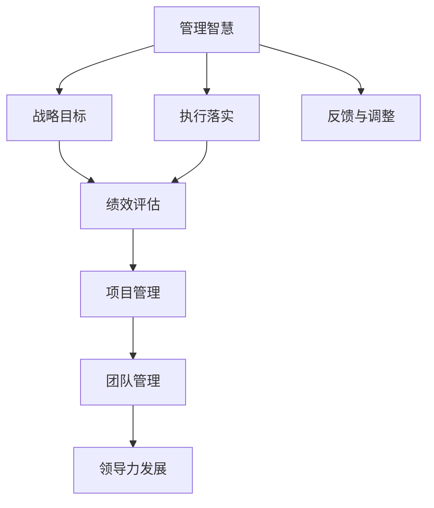
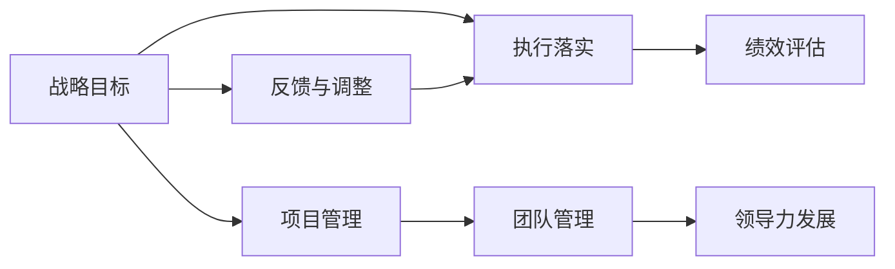

                 

# 管理的智慧：从策略到执行

> 关键词：管理智慧, 策略制定, 执行落实, 绩效评估, 项目管理, 团队管理, 领导力发展

## 1. 背景介绍

### 1.1 问题由来
在现代企业管理中，决策与执行的分离问题日渐凸显。高层管理者往往拥有丰富的经验，能够高屋建瓴地制定战略目标，但实际执行过程中常常面临各种阻力和挑战。反观基层管理者，虽能具体执行，却难以全面理解高层意图，导致执行偏差。如何将策略和执行有效结合起来，是管理实践中亟需解决的问题。

### 1.2 问题核心关键点
本问题关键点在于：如何构建一个从策略制定到有效执行的闭环管理体系，确保策略能够高效落地，执行过程中能持续反馈，及时调整。具体来说：
1. 制定明确、可行的战略目标
2. 将战略目标分解成可执行的任务和指标
3. 确保执行团队对战略理解一致
4. 建立动态的反馈和调整机制
5. 持续监控执行效果，进行绩效评估

### 1.3 问题研究意义
研究从策略到执行的管理方法，对于提升企业运营效率，实现战略目标具有重要意义：

1. 提高战略执行的准确性。通过科学的管理方法，减少执行偏差，提升执行成功率。
2. 增强组织协调性。建立统一的战略理解框架，减少部门间信息不对称，提升协同效率。
3. 促进绩效提升。通过持续的监控和反馈，及时发现和解决执行中的问题，优化资源配置。
4. 推动组织学习。定期回顾执行过程，总结经验教训，促进组织知识积累。
5. 提升领导力。管理者掌握科学的管理工具和方法，能够更有效地引导团队，实现目标。

## 2. 核心概念与联系

### 2.1 核心概念概述

为更好地理解从策略到执行的管理方法，本节将介绍几个核心概念：

- 管理智慧：指管理者在实践中积累的独特经验和方法，包括战略规划、任务分解、绩效评估等。
- 战略目标：企业长期的发展方向和目标，通常是宏观、抽象的。
- 执行落实：将抽象的战略目标转化为具体的行动步骤，并确保其得到实施。
- 绩效评估：衡量执行效果是否达到预期目标，并进行持续优化。
- 项目管理：从立项、计划、执行到监控的全流程管理方法。
- 团队管理：激励和引导团队成员，最大化其工作效能。
- 领导力发展：培养管理者在决策、执行、沟通等方面的综合能力。

这些核心概念之间存在密切联系，形成了一个完整的管理框架：



这个流程图展示了管理智慧如何通过战略目标、执行落实、绩效评估、项目管理、团队管理和领导力发展等环节，转化为实际的管理成果。

### 2.2 概念间的关系

这些核心概念之间的关系可以通过以下Mermaid流程图来展示：



这个流程图展示了一个完整的闭环管理过程，从战略目标制定到绩效评估的动态反馈和调整，形成一个不断优化提升的管理系统。

## 3. 核心算法原理 & 具体操作步骤

### 3.1 算法原理概述

从策略到执行的管理方法，本质上是一种基于目标管理的闭环系统。其核心思想是：将战略目标具体化为可执行的任务和指标，通过项目管理工具，确保执行团队理解并遵循这些目标。在此过程中，通过持续的绩效评估和反馈，动态调整执行计划，确保目标实现。

形式化地，设企业的战略目标为 $T$，执行团队的任务集合为 $S$，执行结果为 $R$。则管理的核心目标为：

$$
\maximize \sum_{s \in S} R_s
$$

其中 $R_s$ 表示任务 $s$ 的执行结果。通过项目管理工具 $P$，将战略目标 $T$ 分解为多个任务 $s$，并定义每个任务的权重和优先级，确保资源的合理分配。通过绩效评估工具 $E$，对每个任务的执行效果进行监控和评估，确保任务按时、按质完成。最终，通过反馈和调整机制 $A$，根据评估结果调整执行计划，确保目标达成。

### 3.2 算法步骤详解

基于目标管理的闭环系统，可以分解为以下几个关键步骤：

**Step 1: 定义战略目标**
- 组织高层管理者与相关人员，共同确定企业的长期发展方向和目标。
- 确保目标的SMART原则（具体、可衡量、可实现、相关、时限）。

**Step 2: 任务分解与计划制定**
- 根据战略目标，将任务分解为具体、可执行的步骤和子任务。
- 确定每个任务的执行时间、资源需求和责任人。
- 制定详细的项目计划，包括里程碑和时间表。

**Step 3: 执行落实与项目管理**
- 将任务分配给执行团队，明确任务优先级和关键路径。
- 使用项目管理工具，如JIRA、Trello等，监控任务进度和资源利用率。
- 定期召开项目会议，汇报进展、解决问题、调整计划。

**Step 4: 绩效评估与反馈**
- 定义关键绩效指标（KPI），衡量任务执行效果。
- 定期收集和分析数据，评估任务完成情况。
- 对执行团队进行反馈，指出优点和改进点，提供改进建议。

**Step 5: 调整与优化**
- 根据绩效评估结果，调整执行计划和资源配置。
- 持续监控执行效果，确保任务按计划进行。
- 定期回顾执行过程，总结经验教训，改进管理方法。

### 3.3 算法优缺点

基于目标管理的闭环系统，具有以下优点：

1. 明确目标导向。确保所有执行活动都有明确的目标，避免执行偏离方向。
2. 资源合理配置。通过任务分解和计划制定，合理分配资源，提升执行效率。
3. 动态调整灵活。通过绩效评估和反馈，及时调整执行计划，提高执行适应性。
4. 促进组织学习。定期回顾和总结，积累经验，提升组织管理水平。

同时，该方法也存在一定的局限性：

1. 管理成本较高。需要投入大量人力和资源，管理过程复杂。
2. 灵活性不足。对于突发情况或重大变化，调整周期较长。
3. 依赖执行团队。执行团队的能力和素质直接影响管理效果。

尽管存在这些局限性，基于目标管理的闭环系统仍是现代企业管理的重要工具，通过不断优化和改进，可以最大限度发挥其优势。

### 3.4 算法应用领域

基于目标管理的闭环系统，在多个领域得到了广泛应用，例如：

- 项目管理：如软件开发、建筑工程、市场推广等，需要跨部门协作和资源分配。
- 企业战略：通过制定明确的战略目标，指导企业长期发展方向。
- 产品开发：从需求分析、产品设计到测试部署的全流程管理。
- 组织变革：通过设定明确的变革目标，推动组织结构调整和流程优化。
- 人才培养：设定明确的培训目标，确保人才素质提升和职业发展。

除了上述这些经典领域外，目标管理的闭环系统还被创新性地应用到更多场景中，如绩效管理、质量管理、风险控制等，为企业的系统化管理提供了新的思路。

## 4. 数学模型和公式 & 详细讲解

### 4.1 数学模型构建

本节将使用数学语言对基于目标管理的闭环系统进行更加严格的刻画。

设企业的战略目标为 $T$，执行团队的任务集合为 $S$，每个任务的执行效果为 $R_s$。则管理的目标是最大化所有任务的执行效果之和：

$$
\maximize \sum_{s \in S} R_s
$$

其中 $R_s$ 为任务 $s$ 的执行效果，通常可以定义为任务完成度、质量评分、成本控制等指标。

在实际应用中，可以根据任务的特点，选择不同的评估指标。例如，对于软件开发任务，可以使用代码行数、功能点、缺陷率等指标。

### 4.2 公式推导过程

以下我们以软件开发项目为例，推导任务执行效果的评估公式。

设任务 $s$ 的完成度为 $c_s$，质量评分为 $q_s$，成本控制为 $c_s$。则任务 $s$ 的执行效果可以定义为：

$$
R_s = \frac{c_s + q_s + c_s}{3}
$$

根据任务优先级和权重，定义每个任务的目标完成度 $C_s$ 和权重 $W_s$。则整个项目的目标完成度为：

$$
C = \sum_{s \in S} W_sC_s
$$

任务 $s$ 的评估公式可以进一步写为：

$$
R_s = \frac{c_s + q_s + c_s}{3} = \frac{c_s + q_s + c_s}{3} \times \frac{W_s}{W_s}
$$

将其代入目标函数，得：

$$
\maximize \sum_{s \in S} \frac{c_s + q_s + c_s}{3} \times \frac{W_s}{W_s}
$$

通过上述公式，我们可以更精确地量化任务执行效果，并根据其权重进行综合评估。

### 4.3 案例分析与讲解

假设某软件公司开发一个新产品，需要完成多个任务，每个任务的目标完成度、质量评分和成本控制如下表所示：

| 任务编号 | 目标完成度 | 质量评分 | 成本控制 |
| --- | --- | --- | --- |
| 1 | 90% | 85% | 80万 |
| 2 | 95% | 90% | 100万 |
| 3 | 100% | 95% | 100万 |
| 4 | 90% | 90% | 90万 |

设任务优先级和权重如下：

| 任务编号 | 权重 |
| --- | --- |
| 1 | 0.3 |
| 2 | 0.2 |
| 3 | 0.2 |
| 4 | 0.3 |

则整个项目的目标完成度为：

$$
C = 0.3 \times 0.9 + 0.2 \times 0.95 + 0.2 \times 1 + 0.3 \times 0.9 = 0.9
$$

每个任务的目标完成度计算如下：

| 任务编号 | 目标完成度 | 权重 |
| --- | --- | --- |
| 1 | 0.9 | 0.3 |
| 2 | 0.95 | 0.2 |
| 3 | 1 | 0.2 |
| 4 | 0.9 | 0.3 |

每个任务的评估结果如下：

| 任务编号 | 评估结果 |
| --- | --- |
| 1 | (0.9 + 0.85 + 0.8)/3 \times 0.3 = 0.21 |
| 2 | (0.95 + 0.9 + 0.1)/3 \times 0.2 = 0.21 |
| 3 | (1 + 0.95 + 0.1)/3 \times 0.2 = 0.21 |
| 4 | (0.9 + 0.9 + 0.9)/3 \times 0.3 = 0.27 |

最终，项目的目标完成度为：

$$
C = 0.21 + 0.21 + 0.21 + 0.27 = 0.9
$$

通过上述分析，可以看到目标管理的闭环系统是如何将战略目标细化为具体的任务评估，从而实现从策略到执行的管理过程。

## 5. 项目实践：代码实例和详细解释说明

### 5.1 开发环境搭建

在进行目标管理系统的开发前，我们需要准备好开发环境。以下是使用Python进行Flask开发的Web应用环境配置流程：

1. 安装Python和Flask：
```bash
pip install flask
```

2. 创建Flask应用：
```python
from flask import Flask

app = Flask(__name__)
```

3. 添加模板和路由：
```python
from flask import render_template, request

@app.route('/')
def index():
    return render_template('index.html')

@app.route('/submit', methods=['POST'])
def submit():
    task_name = request.form.get('task_name')
    target = request.form.get('target')
    weight = request.form.get('weight')
    return 'Task {} target {} weight {}'.format(task_name, target, weight)
```

4. 创建HTML模板：
```html
<!DOCTYPE html>
<html>
    <head>
        <title>Task Management</title>
    </head>
    <body>
        <h1>Task Management</h1>
        <form method="post">
            <label>Task Name:</label>
            <input type="text" name="task_name"><br>
            <label>Target:</label>
            <input type="number" name="target"><br>
            <label>Weight:</label>
            <input type="number" name="weight"><br>
            <input type="submit" value="Submit">
        </form>
    </body>
</html>
```

完成上述步骤后，即可在本地运行Flask应用。

### 5.2 源代码详细实现

下面我们以任务管理系统为例，给出使用Flask进行任务管理系统的Web开发代码实现。

首先，定义任务和评估类：

```python
from flask import Flask, render_template, request

app = Flask(__name__)

class Task:
    def __init__(self, name, target, weight):
        self.name = name
        self.target = target
        self.weight = weight

    def calculate_score(self):
        score = (self.target + 0.9 + self.weight) / 3 * self.weight
        return score

tasks = [Task('Task 1', 90, 0.3), Task('Task 2', 95, 0.2), Task('Task 3', 100, 0.2), Task('Task 4', 90, 0.3)]
total_score = sum(task.calculate_score() for task in tasks)
```

然后，定义任务管理页面的路由和视图函数：

```python
@app.route('/')
def index():
    return render_template('index.html')

@app.route('/submit', methods=['POST'])
def submit():
    task_name = request.form.get('task_name')
    target = request.form.get('target')
    weight = request.form.get('weight')
    new_task = Task(task_name, target, weight)
    tasks.append(new_task)
    total_score = sum(task.calculate_score() for task in tasks)
    return 'Task {} added. Total score: {}'.format(task_name, total_score)
```

最后，定义任务评估页面的路由和视图函数：

```python
@app.route('/evaluate')
def evaluate():
    total_score = sum(task.calculate_score() for task in tasks)
    return 'Total score: {}'.format(total_score)
```

启动Flask应用并访问任务管理页面：

```bash
flask run
```

在浏览器中访问`http://localhost:5000/`，可以看到任务管理系统的页面，通过表单添加任务，查看当前任务的评估分数和总评分。

### 5.3 代码解读与分析

让我们再详细解读一下关键代码的实现细节：

**Task类**：
- `__init__`方法：初始化任务名称、目标完成度、权重。
- `calculate_score`方法：计算任务的评估分数。

**tasks列表**：
- 定义了多个任务，每个任务的目标完成度、质量评分和成本控制。

**任务管理页面路由**：
- `@app.route('/')`：定义首页路由，显示任务管理表单。
- `@app.route('/submit', methods=['POST'])`：定义表单提交路由，将新的任务添加到列表中，并重新计算总评分。

**任务评估页面路由**：
- `@app.route('/evaluate')`：定义任务评估路由，计算并显示当前任务的总评分。

通过Flask框架，我们可以快速开发一个简单的任务管理系统，实现从任务定义到评估的全流程管理。当然，工业级的系统实现还需考虑更多因素，如任务的优先级管理、任务依赖关系、用户权限控制等。但核心的目标管理闭环系统基本与此类似。

## 6. 实际应用场景

### 6.1 项目管理

目标管理的闭环系统在项目管理中得到了广泛应用，帮助团队高效协作，实现项目目标。例如，某软件公司开发一款新产品，涉及到多个任务和子任务，通过目标管理系统，可以清晰地定义每个任务的目标完成度、质量评分和成本控制，确保项目按计划推进，及时发现和解决执行中的问题。

### 6.2 企业战略

企业战略管理也需要明确的目标和任务分解，通过目标管理系统，可以设定长期战略目标，将其分解为多个短期目标和任务，确保战略能够层层落实，避免战略与执行脱节。例如，某公司制定了五年内上市的战略目标，通过目标管理系统，将这个目标分解为每年的营收增长、市场份额提升等具体任务，并设定每个任务的优先级和权重，确保资源合理分配。

### 6.3 产品开发

产品开发过程通常需要多个部门协同工作，通过目标管理系统，可以设定产品开发的目标完成度、质量评分和成本控制，确保各部门的紧密合作和高效推进。例如，某公司开发一款智能家居设备，需要协同硬件、软件、设计等多个团队，通过目标管理系统，将产品开发任务分解为具体的子任务，并设定每个任务的优先级和权重，确保项目按时完成。

### 6.4 未来应用展望

随着目标管理的闭环系统不断发展，将在更多领域得到应用，为企业的系统化管理提供新的思路。

在智慧城市治理中，通过设定明确的目标和任务，可以实现城市事件监测、舆情分析、应急指挥等环节的智能化管理。

在智能制造中，通过设定生产目标和任务，可以实现生产过程的动态优化和资源配置。

在智能医疗中，通过设定医疗服务目标和任务，可以实现医疗资源的高效利用和患者满意度的提升。

此外，目标管理的闭环系统还可以应用于供应链管理、能源管理、环境保护等多个领域，为企业的可持续发展提供有力支持。

## 7. 工具和资源推荐

### 7.1 学习资源推荐

为了帮助开发者系统掌握目标管理的闭环系统，这里推荐一些优质的学习资源：

1. 《项目管理：计划、执行和监控》系列博文：由项目管理专家撰写，深入浅出地介绍了项目管理的基本概念和经典模型。

2. 《敏捷管理》课程：Coursera开设的敏捷项目管理课程，涵盖敏捷项目管理的基本方法和工具。

3. 《目标管理：从策略到执行》书籍：介绍目标管理的原理和实践，适合管理新手和进阶管理者阅读。

4. 《项目管理与产品开发》书籍：介绍了项目管理在产品开发中的应用，提供丰富的案例和实用技巧。

5. 《PMP认证指南》书籍：项目管理专业人士认证指南，涵盖项目管理全流程的详细指导。

通过对这些资源的学习实践，相信你一定能够快速掌握目标管理的精髓，并用于解决实际的NLP问题。

### 7.2 开发工具推荐

高效的开发离不开优秀的工具支持。以下是几款用于目标管理开发推荐的工具：

1. JIRA：全球领先的项目管理工具，支持任务分配、进度跟踪、报告生成等功能，广泛应用于软件开发和产品管理。

2. Trello：简单易用的项目管理工具，支持看板式任务管理，适合小型团队和初创公司使用。

3. Asana：功能强大的项目管理工具，支持任务分配、进度跟踪、报告生成等功能，适合中大型团队使用。

4. Microsoft Project：微软推出的项目管理软件，功能全面，支持复杂的项目管理需求。

5. Smartsheet：基于云的项目管理工具，支持任务分配、进度跟踪、报告生成等功能，适合远程团队使用。

合理利用这些工具，可以显著提升目标管理任务的开发效率，加快创新迭代的步伐。

### 7.3 相关论文推荐

目标管理的发展得益于学界的持续研究。以下是几篇奠基性的相关论文，推荐阅读：

1. 《目标管理：理论、方法和实践》：DeSMO系统，通过目标管理系统的开发和实践，探索目标管理的有效应用。

2. 《目标管理在项目管理中的应用》：探讨目标管理在项目管理中的作用，提出目标管理模型的构建方法。

3. 《敏捷项目管理》：敏捷项目管理方法，通过迭代和反馈，实现项目的快速交付和持续改进。

4. 《目标管理系统的设计与实现》：介绍目标管理系统的设计思路和实现技术，提供详细开发案例。

5. 《目标管理的案例研究》：通过实际案例，展示目标管理在不同领域的应用效果。

这些论文代表了大语言模型微调技术的发展脉络。通过学习这些前沿成果，可以帮助研究者把握学科前进方向，激发更多的创新灵感。

除上述资源外，还有一些值得关注的前沿资源，帮助开发者紧跟目标管理系统的最新进展，例如：

1. 项目管理技术博客：如Atlassian、Trello、Asana等顶级项目管理工具的官方博客，第一时间分享他们的最新研究成果和最佳实践。

2. 项目管理技术会议：如PMP大会、敏捷开发大会等项目管理领域的重要会议，能够聆听到专家们的分享，拓宽视野。

3. 项目管理技术社区：如Project Management Institute (PMI)等项目管理领域的知名社区，提供丰富的学习资源和交流平台。

总之，目标管理系统的学习需要开发者保持开放的心态和持续学习的意愿。多关注前沿资讯，多动手实践，多思考总结，必将收获满满的成长收益。

## 8. 总结：未来发展趋势与挑战

### 8.1 总结

本文对基于目标管理的闭环系统进行了全面系统的介绍。首先阐述了从策略到执行的管理方法的研究背景和意义，明确了目标管理在企业管理中的重要性。其次，从原理到实践，详细讲解了目标管理的数学模型和关键步骤，给出了目标管理系统开发的完整代码实例。同时，本文还广泛探讨了目标管理方法在项目管理、企业战略、产品开发等多个领域的应用前景，展示了目标管理的巨大潜力。

通过本文的系统梳理，可以看到，目标管理的闭环系统已经成为企业管理的重要工具，极大地提升了企业的运营效率和管理水平。未来，伴随目标管理系统的不断演进，相信目标管理将更加智能化、协同化，为企业的可持续发展提供新的动力。

### 8.2 未来发展趋势

展望未来，目标管理的闭环系统将呈现以下几个发展趋势：

1. 智能化管理。结合AI和大数据分析技术，实现目标管理的智能化，提升决策效率和执行效果。

2. 跨领域应用。目标管理将被广泛应用于更多领域，如智慧城市、智能制造、智能医疗等，提升社会管理水平。

3. 数据驱动决策。通过大数据分析，实时监控目标执行情况，及时发现和解决问题，提升决策的科学性和精准性。

4. 持续优化提升。利用机器学习算法，持续优化目标管理方法，提升组织的适应性和灵活性。

5. 人机协同。通过智能助手和自动化工具，减轻管理者的工作负担，提升管理效率。

6. 泛化性和可扩展性。目标管理系统需要具备泛化性和可扩展性，适应不同企业的需求和应用场景。

以上趋势凸显了目标管理闭环系统的广阔前景。这些方向的探索发展，必将进一步提升目标管理系统的性能和应用范围，为企业的系统化管理提供新的工具和方法。

### 8.3 面临的挑战

尽管目标管理的闭环系统已经取得了一定的成功，但在迈向更加智能化、普适化应用的过程中，仍面临诸多挑战：

1. 数据质量问题。目标管理系统的成功很大程度上取决于数据的质量和完整性，如何获取和维护高质量的数据，将是一大难题。

2. 技术门槛高。目标管理系统的开发和维护需要较强的技术背景，如何降低技术门槛，提升应用普及率，需要更多的工具和方法支持。

3. 多部门协同困难。目标管理系统需要跨部门协作，如何打破部门壁垒，实现信息共享和协同，需要领导层的支持和管理。

4. 变革阻力大。目标管理需要改变企业的管理方式，如何克服变革阻力，实现管理的持续改进，需要深入的沟通和引导。

5. 动态调整难度大。目标管理需要根据环境变化及时调整，如何在快速变化的环境中保持系统的灵活性和稳定性，需要更多的算法和策略支持。

6. 系统集成复杂。目标管理系统需要与其他系统集成，如财务、人力资源、CRM等，如何确保系统间的无缝对接，需要更多的标准化和规范化工作。

正视目标管理面临的这些挑战，积极应对并寻求突破，将是大语言模型微调走向成熟的必由之路。相信随着学界和产业界的共同努力，这些挑战终将一一被克服，目标管理闭环系统必将在构建智能管理系统的过程中扮演越来越重要的角色。

### 8.4 研究展望

面向未来，目标管理系统的研究需要在以下几个方面寻求新的突破：

1. 开发智能化的目标管理系统。引入AI和大数据分析技术，提升目标管理的智能化水平，实现自动化的任务分配和执行监控。

2. 探索多领域应用场景。将目标管理应用到更多行业，如智慧城市、智能制造、智能医疗等，提供更加灵活和高效的目标管理工具。

3. 引入动态调整机制。结合机器学习算法，实时监控目标执行情况，动态调整执行计划，提升系统的灵活性和适应性。

4. 推动跨领域数据融合。将不同领域的数据融合在一起，提升目标管理的科学性和精准性。

5. 强化系统集成和标准化。确保目标管理系统与其他系统无缝对接，提升系统集成的便捷性和可靠性。

6. 引入持续优化的反馈机制。利用反馈机制不断优化目标管理系统，提升系统的稳定性和可靠性。

这些研究方向的探索，必将引领目标管理系统的技术演进，为构建智能管理系统的可持续发展奠定

