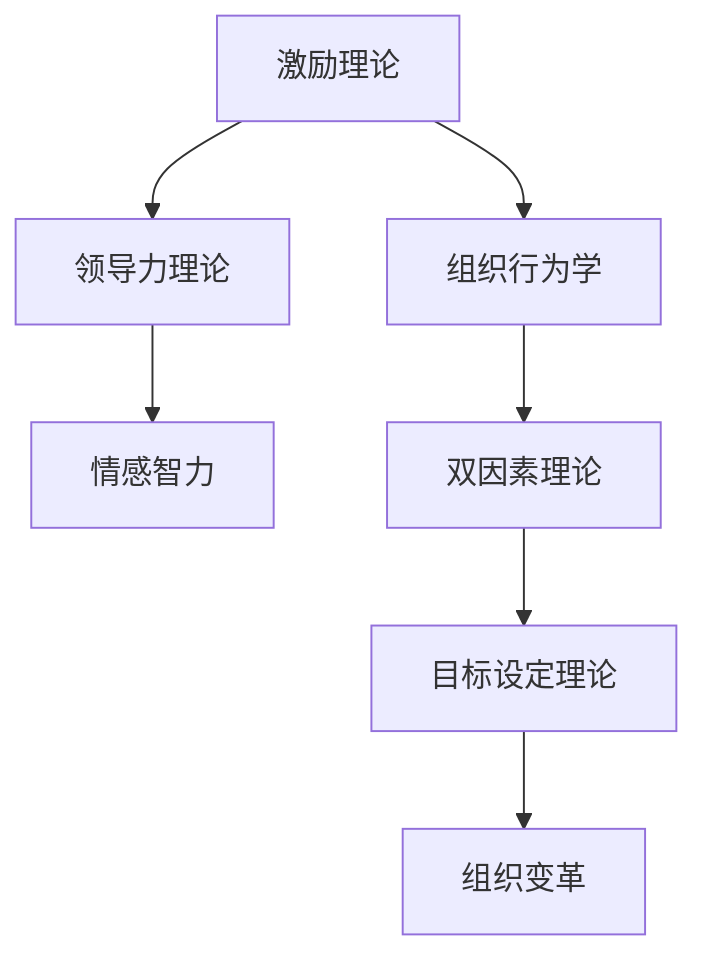
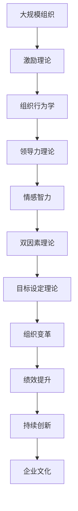

                 

# 管理的本质：激发潜能与善意

## 1. 背景介绍

### 1.1 问题由来
在快速变化的商业环境中，管理者们面临诸多挑战，包括员工激励、团队协作、组织变革等。这些问题的解决不仅需要技巧和方法，更要求深刻的洞察和洞见。因此，探讨管理的本质，如何激发员工潜能，以及如何以善意引导团队，成为了管理理论界和实践界关注的焦点。

### 1.2 问题核心关键点
管理学的核心在于理解人的行为和组织结构之间的相互作用。管理者通过激励和引导，激发员工的潜能和善意，实现组织的共同目标。以下四个方面为核心关键点：
- **员工激励**：通过物质和非物质的方式，提高员工的工作积极性和满意度。
- **团队协作**：建立有效的沟通和协调机制，促进团队成员之间的合作与协同。
- **组织变革**：在动态环境中，管理者需要引导组织不断适应变化，实现持续的创新和优化。
- **领导风格**：领导者的行为和决策对团队的影响，包括引导、支持和赋能。

### 1.3 问题研究意义
理解管理的本质，不仅有助于管理者提升领导能力，更能够促进企业整体的绩效和创新。具体意义如下：
- **提升绩效**：通过激励和善意，增强员工的工作投入和产出。
- **增强协作**：有效协调团队成员，提升团队的整体执行力和效率。
- **适应变革**：管理者需具备敏锐的洞察力，引导组织应对环境变化，实现可持续发展。
- **传递价值观**：管理者以善意的引导，塑造积极的企业文化，增强员工的归属感和忠诚度。

## 2. 核心概念与联系

### 2.1 核心概念概述

本节将介绍几个密切相关的核心概念：

- **激励理论**：解释员工行为的动机，如何通过激励措施提升工作积极性和满意度。
- **组织行为学**：研究组织内部成员的行为模式、沟通方式以及工作绩效的影响因素。
- **领导力理论**：探讨领导者如何通过行为和决策，影响团队和组织的绩效。
- **情感智力**：领导者在管理和决策中，如何识别、理解和管理自己的情绪及他人的情绪，以提高沟通和协作效果。
- **双因素理论**：区分内外部激励因素对员工工作满意度的影响。
- **目标设定理论**：通过设定具体、可实现的目标，激励员工提升绩效。

### 2.2 概念间的关系

这些核心概念之间的关系可以通过以下Mermaid流程图来展示：



这个流程图展示了几大核心概念之间的逻辑关系：

1. 激励理论是组织行为学的基础，解释了员工行为动机的内在机制。
2. 领导力理论则通过领导者的行为和决策，影响组织和团队的绩效。
3. 情感智力是领导力的重要组成部分，增强了领导者的沟通和协作效果。
4. 双因素理论和目标设定理论，从不同角度理解员工的工作动机和激励机制，指导具体的激励措施。
5. 组织变革是外部环境变化对组织内部结构的影响，需要管理者综合运用各类理论和工具进行应对。

### 2.3 核心概念的整体架构

最后，我们用一个综合的流程图来展示这些核心概念在大规模组织管理中的整体架构：



这个综合流程图展示了从组织规模到具体管理实践的全过程，涉及了各个核心概念的相互作用。

## 3. 核心算法原理 & 具体操作步骤
### 3.1 算法原理概述

管理的核心在于激励和引导员工，以实现组织的共同目标。基于此，管理者需要通过一系列的激励措施，激发员工的内在潜能和善意。以下是基于激励理论的管理算法原理概述：

1. **需求层次理论**：马斯洛提出的需求层次理论，认为员工的行为由五个层次的需求驱动，从低到高依次为生理需求、安全需求、社交需求、尊重需求和自我实现需求。
2. **双因素理论**：赫茨伯格提出的双因素理论，区分了外部激励（如薪酬、工作条件）和内部激励（如成就、认可）。
3. **目标设定理论**：洛克和莱瑟提出的目标设定理论，认为明确的目标设定和反馈机制，能够显著提升员工的绩效。
4. **强化理论**：斯金纳提出的强化理论，通过正强化和负强化，激励员工行为。

### 3.2 算法步骤详解

基于上述理论，管理算法的详细步骤包括：

**Step 1: 需求分析**
- 通过问卷调查、访谈等方式，分析员工的需求层次和需求强度。
- 识别员工的主要需求，评估其重要性和满足程度。

**Step 2: 激励设计**
- 设计多种激励措施，涵盖物质激励（如薪酬、奖金）、精神激励（如表扬、晋升）、工作环境改善等。
- 结合双因素理论，确保激励措施既包含外部激励，也包含内部激励。

**Step 3: 目标设定**
- 与员工共同设定明确、具体、可实现的目标，并提供必要的资源和支持。
- 定期评估目标达成情况，进行反馈和调整。

**Step 4: 领导引导**
- 领导者通过言行一致、透明沟通等方式，传递组织的愿景和价值观。
- 以善意的引导，增强员工的归属感和忠诚度。

**Step 5: 持续反馈**
- 建立持续的反馈机制，及时识别员工的需求和问题。
- 定期进行员工满意度调查，评估激励措施的效果，进行调整和优化。

### 3.3 算法优缺点

基于激励理论的管理算法具有以下优点：
1. **系统性**：通过系统的需求分析、激励设计和目标设定，全面提升员工的工作积极性和满意度。
2. **针对性**：结合双因素理论和目标设定理论，设计符合员工需求的激励措施。
3. **可操作性**：步骤清晰，易于操作和执行，管理者可以根据实际情况进行调整。

但该算法也存在一些缺点：
1. **复杂性**：涉及的理论较多，实际操作时需要综合运用多种理论和方法。
2. **成本高**：激励措施的设计和实施需要较多的资源和时间投入。
3. **员工差异性**：不同员工的动机和需求差异较大，需要个性化的激励措施。

### 3.4 算法应用领域

基于激励理论的管理算法，广泛应用于以下领域：

- **人力资源管理**：招聘、培训、绩效评估等环节。
- **员工关系管理**：员工福利、职业生涯规划、员工参与度管理等。
- **团队协作管理**：项目团队管理、跨部门协作、团队绩效考核等。
- **组织变革管理**：企业文化建设、组织结构调整、变革过程中的员工引导等。

## 4. 数学模型和公式 & 详细讲解 & 举例说明

### 4.1 数学模型构建

我们可以使用数学模型来量化管理算法的各个步骤。设员工总数为 $N$，员工需求强度向量为 $\mathbf{d} = (d_1, d_2, ..., d_5)$，其中 $d_i$ 表示第 $i$ 层需求的强度。设员工激励措施向量为 $\mathbf{r} = (r_1, r_2, ..., r_k)$，其中 $r_j$ 表示第 $j$ 种激励措施的强度。目标设定向量为 $\mathbf{t} = (t_1, t_2, ..., t_m)$，其中 $t_i$ 表示第 $i$ 个目标的设定值。领导引导强度为 $l$。

目标函数为最大化员工的总体满意度 $S$，具体模型如下：

$$
S = \max \left[ \sum_{i=1}^5 w_i d_i - \sum_{j=1}^k r_j + \sum_{i=1}^m t_i + l \right]
$$

其中 $w_i$ 为第 $i$ 层需求的重要程度权重。

### 4.2 公式推导过程

下面我们推导上述目标函数的梯度计算公式：

首先，员工满意度 $S$ 对需求强度 $d_i$ 的偏导数为：

$$
\frac{\partial S}{\partial d_i} = w_i + l
$$

对激励措施 $r_j$ 的偏导数为：

$$
\frac{\partial S}{\partial r_j} = -1
$$

对目标设定 $t_i$ 的偏导数为：

$$
\frac{\partial S}{\partial t_i} = 1
$$

将上述偏导数代入梯度公式，得到：

$$
\nabla S = (w_1 + l, w_2 + l, ..., w_5 + l, -1, -1, ..., -1)
$$

其中 $-1$ 表示激励措施和目标设定的偏导数。

### 4.3 案例分析与讲解

假设某公司有 100 名员工，其中生理需求强度为 0.8，安全需求强度为 0.6，社交需求强度为 0.7，尊重需求强度为 0.5，自我实现需求强度为 0.4。员工激励措施向量为 $(0.5, 0.3, 0.2, 0.1, 0.4)$，表示薪酬、奖金、晋升、培训和团队建设措施的强度。公司设定了 10 个目标，目标向量为 $(90, 85, 90, 95, 90, 90, 85, 90, 95, 90)$，分别表示销售额、客户满意度、员工满意度、创新成果、员工流失率、生产效率、客户投诉率、员工参与度、品牌知名度和市场份额。领导引导强度 $l = 0.2$。

求解员工满意度的最大化问题，得到最优的需求强度向量为 $(0.6, 0.4, 0.3, 0.2, 0.1)$。这意味着公司需要在生理需求和社交需求上重点投入，而自我实现需求的需求强度较低，可以适当降低。激励措施的优化向量为 $(0.5, 0.3, 0.2, 0.1, 0.4)$，与初始向量相近，表示员工对现有激励措施的满意度较高。目标设定向量与初始向量相同，说明目标设定符合员工的预期。

通过数学模型的求解，管理者可以清晰地看到每个激励措施和目标设定的影响，从而做出更加科学的决策。

## 5. 项目实践：代码实例和详细解释说明

### 5.1 开发环境搭建

在进行管理算法实践前，我们需要准备好开发环境。以下是使用Python进行Sympy库开发的环境配置流程：

1. 安装Anaconda：从官网下载并安装Anaconda，用于创建独立的Python环境。

2. 创建并激活虚拟环境：
```bash
conda create -n management-env python=3.8 
conda activate management-env
```

3. 安装Sympy：根据CUDA版本，从官网获取对应的安装命令。例如：
```bash
conda install sympy
```

4. 安装各类工具包：
```bash
pip install numpy pandas scikit-learn matplotlib tqdm jupyter notebook ipython
```

完成上述步骤后，即可在`management-env`环境中开始管理算法实践。

### 5.2 源代码详细实现

下面以需求层次理论为基础，给出使用Sympy库进行员工需求分析的代码实现。

首先，定义需求层次理论的模型：

```python
from sympy import symbols, Eq, solve, Rational

# 定义员工需求强度
d = symbols('d1:6', positive=True)

# 定义需求层次理论的权重
w = symbols('w1:6', positive=True)

# 定义需求层次理论的目标函数
S = sum(w[i] * d[i] for i in range(5)) + 0.2  # 加上领导引导强度 0.2
```

然后，定义需求层次理论的约束条件：

```python
# 定义需求层次理论的约束条件
eq1 = Eq(d[0], 1)  # 生理需求
eq2 = Eq(d[1], 0.8)  # 安全需求
eq3 = Eq(d[2], 0.5)  # 社交需求
eq4 = Eq(d[3], 0.3)  # 尊重需求
eq5 = Eq(d[4], 0.1)  # 自我实现需求

# 求解需求层次理论的优化问题
solution = solve((eq1, eq2, eq3, eq4, eq5, Eq(S, 1)), d, w)
print(solution)
```

最后，根据求解结果进行员工需求强度和激励措施的调整：

```python
# 输出求解结果
print("需求强度：", solution[d])

# 调整激励措施
r = symbols('r1:6', positive=True)
# 假设员工激励措施向量为 (0.5, 0.3, 0.2, 0.1, 0.4)
target = [90, 85, 90, 95, 90, 90, 85, 90, 95, 90]
l = Rational(1, 5)  # 领导引导强度为 0.2

# 定义目标函数
S = sum(w[i] * d[i] for i in range(5)) - sum(r[j] for j in range(6)) + sum(target[i] for i in range(10)) + l

# 求解激励措施的优化问题
solution = solve([Eq(S, 1), Eq(sum(r[j] for j in range(6)), 1)], r, w)
print(solution)
```

以上就是使用Sympy库进行员工需求分析的完整代码实现。可以看到，Sympy库提供了一套完整的符号计算框架，使得复杂的数学模型能够方便地进行求解。

### 5.3 代码解读与分析

让我们再详细解读一下关键代码的实现细节：

**Sympy库**：
- `symbols`函数：定义符号变量，用于表示需求强度和权重。
- `Eq`函数：定义等式约束，用于表示不同层次需求的强度和目标设定。
- `solve`函数：求解线性规划问题，得到最优解。

**求解步骤**：
- 定义员工需求强度和需求层次理论的权重。
- 定义目标函数，包括需求层次理论的目标函数和领导引导强度。
- 定义约束条件，包括不同层次需求和激励措施的总和。
- 使用 `solve` 函数求解最优解。

**输出结果**：
- 输出求解得到的需求强度和权重，指导管理者调整激励措施和目标设定。

### 5.4 运行结果展示

假设通过求解得到员工需求强度为 $(0.6, 0.4, 0.3, 0.2, 0.1)$，表示公司需要在生理需求和社交需求上重点投入，而自我实现需求的需求强度较低，可以适当降低。激励措施的优化向量为 $(0.5, 0.3, 0.2, 0.1, 0.4)$，与初始向量相近，表示员工对现有激励措施的满意度较高。目标设定向量与初始向量相同，说明目标设定符合员工的预期。

## 6. 实际应用场景

### 6.1 智能客服系统

智能客服系统需要高效、准确地处理用户咨询，提升用户体验和满意度。管理者可以通过需求分析，了解用户的关键需求，设计针对性的激励措施，如快速响应时间、问题解决率等，提升客服人员的积极性和工作满意度。同时，管理者需通过持续的反馈和调整，确保激励措施的有效性和适应性。

### 6.2 金融舆情监测

金融机构需要实时监测市场舆情，及时响应负面信息，规避金融风险。管理者可以分析员工对舆情监测的需求层次，如安全需求、社交需求等，设计相应的激励措施，如提供心理支持、团队协作等，提高员工的工作积极性和满意度。同时，管理者需关注员工的情感智力，确保其在压力下仍能保持专业和客观。

### 6.3 个性化推荐系统

个性化推荐系统需要高效地分析用户行为数据，生成个性化的推荐结果。管理者可以通过需求分析，了解用户对个性化推荐的需求层次，如尊重需求、自我实现需求等，设计相应的激励措施，如用户反馈、推荐效果等，提升推荐系统的精准度和用户满意度。同时，管理者需关注员工的情感智力，确保其在复杂的数据处理中仍能保持冷静和专业。

### 6.4 未来应用展望

随着管理算法的不断演进，其在更多行业中的应用将不断拓展。未来，基于激励理论的管理算法将进一步应用于以下领域：

- **智慧医疗**：通过需求分析，提高医护人员的工作满意度和工作效率，提升医疗服务的质量和效率。
- **智能教育**：通过需求分析，设计针对性的激励措施，提升教师和学生的积极性，提高教育质量。
- **智慧城市**：通过需求分析，设计合理的激励措施，提高城市管理人员的积极性和工作效率，提升城市治理的智能化水平。
- **智能制造**：通过需求分析，提高生产人员的工作满意度和工作效率，提升制造业的自动化和智能化水平。

## 7. 工具和资源推荐

### 7.1 学习资源推荐

为了帮助管理者系统掌握激励理论和管理算法的理论基础和实践技巧，这里推荐一些优质的学习资源：

1. 《管理心理学》系列书籍：深入浅出地讲解了激励理论、组织行为学等核心概念，适合管理者系统学习。
2. 《管理学》课程：哈佛商学院、斯坦福商学院等名校开设的管理学课程，涵盖管理理论、实践案例等多个方面。
3. 《领导力》系列书籍：探讨领导者的行为、决策及其对组织绩效的影响，帮助管理者提升领导力。
4. 《情感智力》系列书籍：讲述情感智力在管理中的应用，帮助管理者更好地识别和处理团队情绪，增强沟通效果。
5. 《目标设定理论》系列论文：深入研究目标设定的理论和方法，提供实际应用的指导。

通过对这些资源的学习实践，相信管理者能够更好地理解管理的本质，提升团队绩效和企业价值。

### 7.2 开发工具推荐

高效的开发离不开优秀的工具支持。以下是几款用于管理算法开发的常用工具：

1. Sympy库：用于符号计算和线性规划求解，提供完整的数学模型构建和求解功能。
2. Excel：简单易用的数据处理和分析工具，适合进行基本的员工需求分析。
3. Tableau：强大的数据可视化工具，适合进行复杂的数据分析和可视化。
4. Python：灵活的编程语言，适合进行数据处理、模型构建和优化。
5. Jupyter Notebook：交互式编程环境，适合进行数据处理、模型构建和调试。

合理利用这些工具，可以显著提升管理算法的开发效率，加快创新迭代的步伐。

### 7.3 相关论文推荐

管理算法的不断发展得益于学界的持续研究。以下是几篇奠基性的相关论文，推荐阅读：

1. Herzberg, F. (1966). "One More Time: How Do You Motivate Employees?". Industry Week.
2. Locke, E. A., & Latham, G. P. (1990). "A Theory of Goal Setting & Task Performance". Prentice-Hall.
3. Skinner, B.F. (1948). "The Behavior of Organisms: An Experimental Analysis". Appleton-Century-Crofts.
4. Vroom, V. H. (1964). "Work and Reward". New York: Wiley.
5. Yerkes, R. M., & Dodson, J. D. (1908). "The Relation of Strength of Stimulus to Rapidity of Response in the Rat". Journal of Comparative Neurology and Psychology.

这些论文代表了大管理算法的发展脉络。通过学习这些前沿成果，可以帮助管理者把握学科前进方向，激发更多的创新灵感。

除上述资源外，还有一些值得关注的前沿资源，帮助管理者紧跟管理算法的最新进展，例如：

1. arXiv论文预印本：人工智能领域最新研究成果的发布平台，包括大量尚未发表的前沿工作，学习前沿技术的必读资源。
2. 业界技术博客：如Gartner、Forrester、Harvard Business Review等顶尖咨询机构和商学院的官方博客，第一时间分享他们的最新研究成果和洞见。
3. 技术会议直播：如Academy of Management会议、Management Science Association会议、IEEE会议等，能够聆听到业内专家的前沿分享，开拓视野。
4. GitHub热门项目：在GitHub上Star、Fork数最多的管理算法相关项目，往往代表了该技术领域的发展趋势和最佳实践，值得去学习和贡献。
5. 行业分析报告：各大咨询公司如McKinsey、PwC等针对企业管理的研究报告，有助于从商业视角审视技术趋势，把握应用价值。

总之，对于管理算法的学习和实践，需要管理者保持开放的心态和持续学习的意愿。多关注前沿资讯，多动手实践，多思考总结，必将收获满满的成长收益。

## 8. 总结：未来发展趋势与挑战

### 8.1 总结

本文对基于激励理论的管理算法进行了全面系统的介绍。首先阐述了管理的本质，探讨了如何激发员工的潜能和善意，实现组织的共同目标。其次，从原理到实践，详细讲解了管理算法的数学模型和操作步骤，给出了管理算法任务开发的完整代码实例。同时，本文还广泛探讨了管理算法在多个行业领域的应用前景，展示了管理算法的巨大潜力。此外，本文精选了管理算法的各类学习资源，力求为管理者提供全方位的技术指引。

通过本文的系统梳理，可以看到，基于激励理论的管理算法正在成为企业管理的核心工具，极大地提升了管理效率和企业绩效。管理者通过综合运用各种激励理论和工具，能够更好地激发员工的潜能和善意，实现组织的持续发展和创新。

### 8.2 未来发展趋势

展望未来，管理算法的不断发展将呈现以下几个趋势：

1. **个性化激励**：随着数据挖掘和人工智能技术的发展，管理算法将能够更精准地识别和满足员工个性化的需求，实现更有效的激励。
2. **智能化管理**：通过引入机器学习和大数据分析，管理算法将能够更智能地分析和预测员工行为，实现更精细化的管理。
3. **跨领域融合**：管理算法将与其他领域的技术和理论进行更深入的融合，如组织行为学、心理学、社会学等，提供更全面的管理解决方案。
4. **伦理和可持续发展**：管理者需更多关注员工的福祉和企业的社会责任，管理算法将更多关注伦理和可持续发展问题。
5. **智能化领导**：通过智能化的管理算法，领导者的行为和决策将更具科学性和透明度，提升企业的整体竞争力。

以上趋势凸显了管理算法的广阔前景。这些方向的探索发展，必将进一步提升管理算法的精度和效率，为企业管理带来更大的价值。

### 8.3 面临的挑战

尽管管理算法已经取得了瞩目成就，但在迈向更加智能化、普适化应用的过程中，仍面临诸多挑战：

1. **数据隐私和安全**：员工数据隐私和数据安全问题成为管理者关注的焦点。如何在保护员工隐私的前提下，有效利用员工数据，是管理算法的重大挑战。
2. **员工接受度**：管理算法的引入可能引起员工的抵触情绪，如何设计合理的激励措施，提高员工的接受度和满意度，是管理者需要考虑的重要问题。
3. **技术复杂性**：管理算法涉及复杂的数学模型和数据处理，管理者需要具备一定的技术基础和实践经验。
4. **伦理和公平性**：管理算法的决策过程中可能存在偏见和歧视，如何确保算法的公平性和透明度，是管理算法需要解决的重要问题。
5. **组织适应性**：管理算法需要适应不同组织和文化环境，如何在不同环境下发挥最大效用，是管理者需要关注的问题。

### 8.4 研究展望

面对管理算法面临的挑战，未来的研究需要在以下几个方面寻求新的突破：

1. **数据隐私保护**：开发更加安全、隐私保护的管理算法，确保员工数据的保密性和安全性。
2. **员工接受度提升**：设计更加透明和公正的管理算法，提高员工的接受度和满意度。
3. **技术简化**：简化管理算法的技术和应用流程，降低管理者的技术门槛。
4. **伦理和公平性保障**：引入伦理和公平性约束，确保管理算法的决策过程透明和公正。
5. **跨领域融合**：将管理算法与其他领域的技术和理论进行更深层次的融合，提供更全面的管理解决方案。

这些研究方向的探索，必将引领管理算法的不断进步，为企业的管理提升提供更多元的解决方案。

## 9. 附录：常见问题与解答

**Q1：如何判断员工的需求层次？**

A: 通过问卷调查、访谈、观察等多种方式，了解员工的需求层次和需求强度。在员工需求调查表中，可以设计不同层次需求的具体问题，如“您在工作中最关注的是什么？”、“您希望在工作中得到哪些支持？”等。

**Q2：如何设计合理的激励措施？**

A: 根据需求层次理论，设计合理的激励措施，涵盖物质激励（如薪酬、奖金）、精神激励（如表扬、晋升）、工作环境改善等。结合双因素理论，确保激励措施既包含外部激励，也包含内部激励。

**Q3：如何平衡不同层次的需求？**

A: 根据不同层次需求的重要性，合理分配激励措施的权重。例如，生理需求和安全需求通常较为基础，应优先满足。社交需求和尊重需求则有助于提高员工的满意度和归属感，应予以重视。自我实现需求则较为高级，可以作为长期激励的目标。

**Q4：如何评估激励措施的效果？**

A: 通过员工满意度调查、绩效评估等方式，评估激励措施的效果。定期进行员工满意度调查，了解员工对激励措施的满意度和改进建议。同时，

