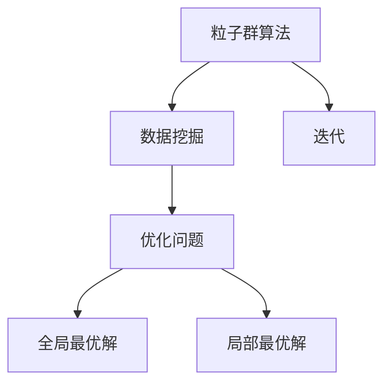
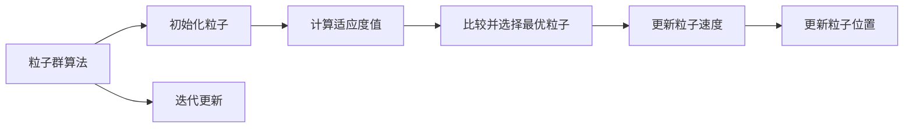
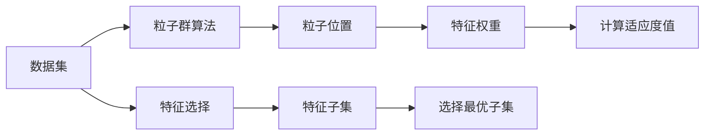
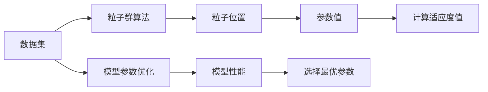
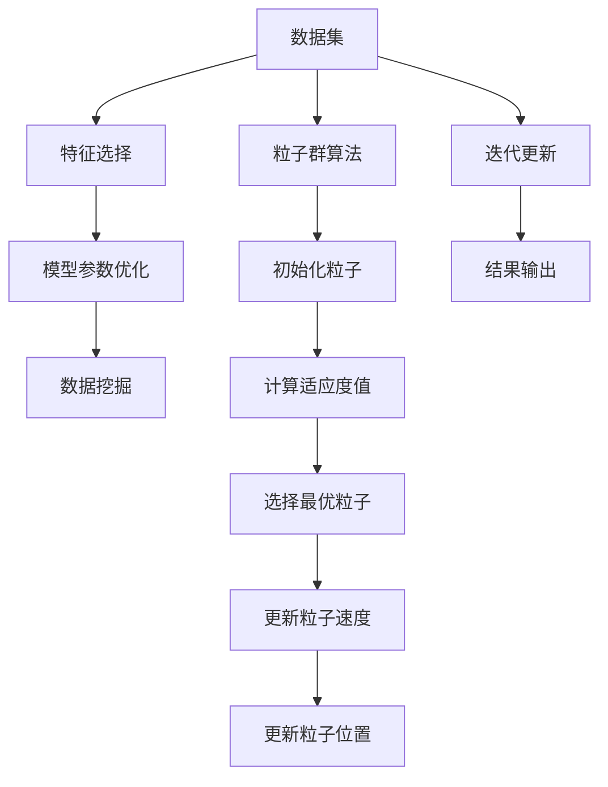

                 

# 粒子群算法在数据挖掘中的应用研究

> 关键词：粒子群算法,数据挖掘,机器学习,优化算法,模式识别,应用研究

## 1. 背景介绍

### 1.1 问题由来
数据挖掘是人工智能领域的重要分支之一，旨在从大规模数据中发现隐藏的模式、规律和知识。传统的基于统计方法的数据挖掘算法，如聚类、分类、回归等，往往依赖于合适的模型选择和特征工程，且计算复杂度高、易受噪声影响。近年来，随着计算资源和算法复杂度的不断提升，数据挖掘进入了一个新的发展阶段。

在数据挖掘中，常用的优化算法包括遗传算法、蚁群算法、人工鱼群算法等。但这些算法在局部搜索能力和计算效率方面仍有不足，难以应对大规模、复杂数据的挖掘任务。粒子群算法（Particle Swarm Optimization, PSO）作为近年来兴起的优化算法，因其全局搜索能力和高效计算特性，被广泛应用于各种领域，包括数据挖掘。

### 1.2 问题核心关键点
粒子群算法是一种基于群体智能的优化算法，其核心思想是通过模拟鸟群或鱼群等群体中个体之间的交互行为，找到全局最优解。在数据挖掘中，PSO算法可以用来优化模型参数、特征选择、特征提取等任务，提升挖掘效果。

PSO算法的主要优点包括：
1. 全局搜索能力强，能够跳出局部最优解，探索更广泛的参数空间。
2. 计算效率高，迭代次数少，适合大规模数据集的处理。
3. 简单易实现，无需复杂的预处理和后处理步骤。
4. 并行性良好，可以方便地进行分布式计算。

但同时，PSO算法也存在一些缺点：
1. 对初始参数设置敏感，不同的初始参数可能导致不同的搜索结果。
2. 易陷入早熟收敛，即在局部最优解附近徘徊，无法跳出。
3. 对噪声和参数设置的影响较大，可能导致搜索结果波动。
4. 算法迭代过程较难解释，结果可解释性差。

尽管存在这些局限性，粒子群算法仍是大数据挖掘任务中非常有潜力的方法，值得深入研究。

### 1.3 问题研究意义
研究粒子群算法在数据挖掘中的应用，对于拓展数据挖掘方法的边界，提升挖掘算法的效率和效果，具有重要意义：

1. 降低数据挖掘成本。粒子群算法在参数优化过程中，可以自动寻找最优解，减少手动调参的时间和成本。
2. 提升挖掘效果。PSO算法能够探索更广泛的参数空间，发现更复杂的模式和规律。
3. 增强算法鲁棒性。PSO算法的并行性和全局搜索能力，使其能够更好地应对噪声和数据不均衡等问题。
4. 促进数据挖掘技术发展。PSO算法的成功应用，将推动数据挖掘技术的进步，为大数据时代的数据挖掘任务提供新的解决方案。

## 2. 核心概念与联系

### 2.1 核心概念概述

为更好地理解粒子群算法在数据挖掘中的应用，本节将介绍几个关键概念：

- 粒子群算法（Particle Swarm Optimization, PSO）：一种基于群体智能的优化算法，通过模拟鸟群或鱼群等群体中个体之间的交互行为，找到全局最优解。

- 数据挖掘（Data Mining）：从大规模数据中发现隐藏的模式、规律和知识的过程，包括聚类、分类、回归等任务。

- 优化问题（Optimization Problem）：寻找满足约束条件的参数或变量组合，以最小化或最大化某个目标函数的问题。

- 全局最优解（Global Optimal Solution）：在优化问题的所有解中，能够达到目标函数的最小或最大值的那个解。

- 局部最优解（Local Optimal Solution）：在优化问题的某个局部范围内，能够达到目标函数的最小或最大值的那个解。

- 迭代（Iteration）：算法重复执行的一轮操作，从当前状态计算下一个状态，直至达到停止条件。

这些核心概念之间的逻辑关系可以通过以下Mermaid流程图来展示：



这个流程图展示了大规模数据挖掘中粒子群算法的基本作用流程：

1. 粒子群算法作为优化算法，优化数据挖掘中的各类问题。
2. 数据挖掘问题通常为优化问题，需要最小化或最大化某个目标函数。
3. 通过迭代，粒子群算法能够找到全局最优解或局部最优解。

### 2.2 概念间的关系

这些核心概念之间存在着紧密的联系，构成了粒子群算法在数据挖掘中的整体应用框架。下面我们通过几个Mermaid流程图来展示这些概念之间的关系。

#### 2.2.1 粒子群算法的优化过程



这个流程图展示了PSO算法的基本流程：

1. 初始化粒子群。
2. 计算每个粒子的适应度值。
3. 选择当前最优粒子。
4. 更新粒子速度。
5. 更新粒子位置。
6. 重复迭代，直至满足停止条件。

#### 2.2.2 粒子群算法在特征选择中的应用



这个流程图展示了粒子群算法在特征选择中的基本流程：

1. 数据集中的特征子集作为粒子的位置。
2. 粒子群算法优化特征权重，使得模型目标函数最小化。
3. 计算每个粒子的适应度值。
4. 选择当前最优子集。
5. 更新粒子速度和位置。
6. 重复迭代，直至满足停止条件。

#### 2.2.3 粒子群算法在模型参数优化中的应用



这个流程图展示了粒子群算法在模型参数优化中的基本流程：

1. 数据集中的模型参数作为粒子的位置。
2. 粒子群算法优化参数值，使得模型性能最优。
3. 计算每个粒子的适应度值。
4. 选择当前最优参数。
5. 更新粒子速度和位置。
6. 重复迭代，直至满足停止条件。

### 2.3 核心概念的整体架构

最后，我们用一个综合的流程图来展示这些核心概念在粒子群算法中的整体应用架构：



这个综合流程图展示了从数据集到数据挖掘的全流程，粒子群算法在其中起到了关键作用：

1. 数据集被用于特征选择和模型参数优化。
2. 特征选择优化特征权重，模型参数优化优化模型参数。
3. 优化后的特征和模型参数被用于数据挖掘。
4. 粒子群算法在优化过程中起到了关键的搜索和调整作用。
5. 最终得到的结果被用于数据挖掘。

通过这些流程图，我们可以更清晰地理解粒子群算法在数据挖掘中的应用场景和过程。

## 3. 核心算法原理 & 具体操作步骤
### 3.1 算法原理概述

粒子群算法是一种基于群体智能的优化算法，其核心思想是通过模拟鸟群或鱼群等群体中个体之间的交互行为，找到全局最优解。在数据挖掘中，PSO算法可以用来优化模型参数、特征选择、特征提取等任务，提升挖掘效果。

PSO算法的核心步骤如下：

1. 初始化粒子群。每个粒子对应一个参数向量，随机初始化在参数空间中。
2. 计算每个粒子的适应度值。根据目标函数，计算粒子在当前位置的适应度值。
3. 选择当前最优粒子。记录每个粒子的最优适应度值及其位置。
4. 更新粒子速度。根据粒子之间的交互行为，更新每个粒子的速度。
5. 更新粒子位置。根据更新后的速度，更新每个粒子在参数空间中的位置。
6. 重复迭代，直至满足停止条件。

PSO算法的目标是在全局搜索空间中找到最优解，其计算过程可以简单概括为以下几个步骤：

1. 初始化粒子群。每个粒子对应一个参数向量，随机初始化在参数空间中。
2. 计算每个粒子的适应度值。根据目标函数，计算粒子在当前位置的适应度值。
3. 选择当前最优粒子。记录每个粒子的最优适应度值及其位置。
4. 更新粒子速度。根据粒子之间的交互行为，更新每个粒子的速度。
5. 更新粒子位置。根据更新后的速度，更新每个粒子在参数空间中的位置。
6. 重复迭代，直至满足停止条件。

### 3.2 算法步骤详解

PSO算法的详细步骤如下：

#### 3.2.1 初始化粒子群
粒子群算法首先需要初始化粒子群。每个粒子对应一个参数向量，随机初始化在参数空间中。

1. 设定参数。包括粒子数目 $N$、速度缩放因子 $c_1$ 和 $c_2$、最大迭代次数 $max\_iter$ 等。
2. 随机生成粒子。对于 $N$ 个粒子，每个粒子生成一个随机位置 $p_{i,j}$ 和一个随机速度 $v_{i,j}$。

```python
N = 30
c1 = 1.5
c2 = 1.5
max_iter = 100

# 生成随机位置和速度
particles = [[random.random() for _ in range(num_params)] for _ in range(N)]
velocities = [[random.random() for _ in range(num_params)] for _ in range(N)]
```

#### 3.2.2 计算适应度值
计算每个粒子的适应度值，是PSO算法的核心步骤之一。适应度值通常为目标函数在当前位置下的值。

1. 定义目标函数。根据具体问题，确定目标函数的形式和参数。
2. 计算适应度值。对每个粒子，根据目标函数计算其适应度值。

```python
def f(params):
    # 目标函数，可以根据具体问题定义
    return some_function(params)

# 计算每个粒子的适应度值
fitness_values = [f(p) for p in particles]
```

#### 3.2.3 选择当前最优粒子
记录每个粒子的最优适应度值及其位置，是PSO算法的重要步骤。每个粒子保存其自身的最优适应度值和位置，以及整个粒子群的最优适应度值和位置。

1. 初始化最优粒子。每个粒子记录其当前位置和速度，以及整个粒子群的最优位置和适应度值。
2. 更新最优粒子。如果当前粒子适应度值优于全局最优值，则更新全局最优值和位置。

```python
# 初始化最优粒子
best_particle = particles[0]
best_fitness = fitness_values[0]

# 更新最优粒子
for i in range(N):
    if fitness_values[i] < best_fitness:
        best_fitness = fitness_values[i]
        best_particle = particles[i]
```

#### 3.2.4 更新粒子速度
根据粒子之间的交互行为，更新每个粒子的速度，是PSO算法的核心步骤之一。每个粒子的速度由两部分组成：

1. 第一部分是当前粒子的历史最优位置。
2. 第二部分是整个粒子群的最优位置。

更新公式如下：

$$v_{i,j} = c_1 r_1 v_{i,j} + c_2 r_2 (p_{g,j} - p_{i,j})$$

其中 $r_1$ 和 $r_2$ 是介于0和1之间的随机数。

```python
# 更新每个粒子的速度
for i in range(N):
    r1 = random.random()
    r2 = random.random()
    velocities[i] = (c1 * r1 * velocities[i] + c2 * r2 * (best_particle - particles[i]))
```

#### 3.2.5 更新粒子位置
根据更新后的速度，更新每个粒子在参数空间中的位置。每个粒子的位置由两部分组成：

1. 第一部分是当前粒子的历史最优位置。
2. 第二部分是整个粒子群的最优位置。

更新公式如下：

$$p_{i,j} = p_{i,j} + v_{i,j}$$

```python
# 更新每个粒子的位置
for i in range(N):
    particles[i] = [p + v for p, v in zip(particles[i], velocities[i])]
```

#### 3.2.6 重复迭代
重复执行上述步骤，直至满足停止条件。通常停止条件包括迭代次数达到最大值、适应度值达到最优值或粒子群收敛等。

```python
for iter in range(max_iter):
    # 计算每个粒子的适应度值
    fitness_values = [f(p) for p in particles]
    
    # 更新最优粒子
    best_particle = particles[fitness_values.index(min(fitness_values))]
    best_fitness = min(fitness_values)
    
    # 更新每个粒子的速度和位置
    for i in range(N):
        r1 = random.random()
        r2 = random.random()
        velocities[i] = (c1 * r1 * velocities[i] + c2 * r2 * (best_particle - particles[i]))
        particles[i] = [p + v for p, v in zip(particles[i], velocities[i])]

    if best_fitness == fitness_values[0]:
        break
```

### 3.3 算法优缺点

粒子群算法在数据挖掘中具有以下优点：

1. 全局搜索能力强。PSO算法能够跳出局部最优解，探索更广泛的参数空间。
2. 计算效率高。迭代次数少，适合大规模数据集的处理。
3. 简单易实现。无需复杂的预处理和后处理步骤。
4. 并行性良好。可以方便地进行分布式计算。

但同时，PSO算法也存在一些缺点：

1. 对初始参数设置敏感。不同的初始参数可能导致不同的搜索结果。
2. 易陷入早熟收敛。在局部最优解附近徘徊，无法跳出。
3. 对噪声和参数设置的影响较大。可能导致搜索结果波动。
4. 算法迭代过程较难解释。结果可解释性差。

尽管存在这些局限性，粒子群算法仍是大数据挖掘任务中非常有潜力的方法，值得深入研究。

### 3.4 算法应用领域

粒子群算法在数据挖掘中具有广泛的应用，可以用于以下任务：

1. 特征选择。优化特征权重，选择对模型预测效果最好的特征子集。
2. 模型参数优化。优化模型参数，提高模型的预测精度和泛化能力。
3. 数据预处理。优化数据预处理方法，提高数据的可解释性和可利用性。
4. 异常检测。优化异常检测算法，提高检测精度和效率。
5. 聚类分析。优化聚类算法，提高聚类效果和稳定性。
6. 分类回归。优化分类和回归算法，提高模型的预测能力和鲁棒性。

除了上述这些经典任务外，粒子群算法还可以用于文本分类、图像识别、时间序列分析等众多领域，为数据挖掘提供新的解决方案。

## 4. 数学模型和公式 & 详细讲解 & 举例说明

### 4.1 数学模型构建

在数据挖掘中，PSO算法通常用于优化模型的参数或特征，因此需要构建数学模型来描述目标函数。以下是几种常见的目标函数形式：

1. 最小化均方误差（MSE）：用于回归任务，目标是使模型预测值与真实值之间的误差最小。
2. 最小化交叉熵（CE）：用于分类任务，目标是使模型预测概率与真实标签之间的交叉熵最小。
3. 最大化F1分数（F1 Score）：用于分类任务，目标是使模型精确率和召回率之间的平衡最佳。
4. 最小化均方根误差（RMSE）：用于回归任务，目标是使模型预测值与真实值之间的平方误差最小。

对于回归任务，目标函数可以表示为：

$$
f(p) = \frac{1}{n} \sum_{i=1}^n (y_i - \hat{y}_i)^2
$$

对于分类任务，目标函数可以表示为：

$$
f(p) = \frac{1}{n} \sum_{i=1}^n \log(y_i - \hat{y}_i)
$$

其中 $y_i$ 为真实标签，$\hat{y}_i$ 为模型预测值，$n$ 为样本数。

### 4.2 公式推导过程

以下是几个常见目标函数的推导过程：

#### 4.2.1 最小化均方误差

均方误差（MSE）的推导如下：

$$
f(p) = \frac{1}{n} \sum_{i=1}^n (y_i - \hat{y}_i)^2
$$

对 $p$ 求导，得到：

$$
\frac{\partial f(p)}{\partial p} = -\frac{2}{n} \sum_{i=1}^n (y_i - \hat{y}_i) \frac{\partial \hat{y}_i}{\partial p}
$$

其中 $\hat{y}_i$ 为模型预测值，$\frac{\partial \hat{y}_i}{\partial p}$ 为模型预测值对参数 $p$ 的导数。

#### 4.2.2 最小化交叉熵

交叉熵（CE）的推导如下：

$$
f(p) = \frac{1}{n} \sum_{i=1}^n \log(y_i - \hat{y}_i)
$$

对 $p$ 求导，得到：

$$
\frac{\partial f(p)}{\partial p} = -\frac{1}{n} \sum_{i=1}^n \frac{1}{y_i - \hat{y}_i} \frac{\partial \hat{y}_i}{\partial p}
$$

其中 $\hat{y}_i$ 为模型预测值，$\frac{\partial \hat{y}_i}{\partial p}$ 为模型预测值对参数 $p$ 的导数。

#### 4.2.3 最大化F1分数

F1分数的推导如下：

$$
f(p) = \frac{2 \times precision \times recall}{precision + recall}
$$

其中 $precision$ 和 $recall$ 为模型的精确率和召回率。

对 $p$ 求导，得到：

$$
\frac{\partial f(p)}{\partial p} = \frac{2}{precision + recall} \left( \frac{\partial precision}{\partial p} \times recall + precision \times \frac{\partial recall}{\partial p} \right)
$$

其中 $\frac{\partial precision}{\partial p}$ 和 $\frac{\partial recall}{\partial p}$ 为精确率和召回率对参数 $p$ 的导数。

### 4.3 案例分析与讲解

以下是几个常见的粒子群算法在数据挖掘中的案例分析：

#### 4.3.1 特征选择

在特征选择中，目标函数通常为最小化模型性能指标，如均方误差、交叉熵等。通过PSO算法优化特征权重，选择对模型预测效果最好的特征子集。

#### 4.3.2 模型参数优化

在模型参数优化中，目标函数通常为最小化模型预测误差或最大化模型性能指标。通过PSO算法优化模型参数，提高模型的预测精度和泛化能力。

#### 4.3.3 数据预处理

在数据预处理中，目标函数通常为最小化模型预测误差或最大化模型性能指标。通过PSO算法优化数据预处理方法，提高数据的可解释性和可利用性。

#### 4.3.4 异常检测

在异常检测中，目标函数通常为最小化模型预测误差或最大化模型性能指标。通过PSO算法优化异常检测算法，提高检测精度和效率。

#### 4.3.5 聚类分析

在聚类分析中，目标函数通常为最小化模型预测误差或最大化模型性能指标。通过PSO算法优化聚类算法，提高聚类效果和稳定性。

#### 4.3.6 分类回归

在分类回归中，目标函数通常为最小化模型预测误差或最大化模型性能指标。通过PSO算法优化分类和回归算法，提高模型的预测能力和鲁棒性。

## 5. 项目实践：代码实例和详细解释说明

### 5.1 开发环境搭建

在进行粒子群算法在数据挖掘中的应用研究前，我们需要准备好开发环境。以下是使用Python进行粒子群算法实现的环境配置流程：

1. 安装Anaconda：从官网下载并安装Anaconda，用于创建独立的Python环境。

2. 创建并激活虚拟环境：
```bash
conda create -n pso-env python=3.8 
conda activate pso-env
```

3. 安装相关库：
```bash
pip install numpy scipy scikit-learn matplotlib
```

完成上述步骤后，即可在`pso-env`环境中开始项目实践。

### 5.2 源代码详细实现

这里我们以最小化均方误差（MSE）的回归任务为例，给出使用粒子群算法对模型参数进行微调的Python代码实现。

```python
import numpy as np
import random
from sklearn.metrics import mean_squared_error
from sklearn.linear_model import LinearRegression

class Particle:
    def __init__(self, params, fitness=0):
        self.params = params
        self.fitness = fitness
        self.velocity = [random.random() for _ in range(len(params))]

    def evaluate(self, function):
        self.fitness = function(self.params)

class PSO:
    def __init__(self, num_particles, num_params, max_iter, c1=1.5, c2=1.5):
        self.num_particles = num_particles
        self.num_params = num_params
        self.max_iter = max_iter
        self.c1 = c1
        self.c2 = c2
        self.particles = [Particle(np.random.rand(num_params)) for _ in range(num_particles)]
        self.best_particle = self.particles[0]
        self.best_fitness = self.particles[0].fitness

    def optimize(self, function):
        for iter in range(self.max_iter):
            for particle in self.particles:
                particle.evaluate(function)
                if particle.fitness < self.best_fitness:
                    self.best_fitness = particle.fitness
                    self.best_particle = particle

            for particle in self.particles:
                r1 = random.random()
                r2 = random.random()
                particle.velocity = (self.c1 * r1 * particle.velocity + self.c2 * r2 * (self.best_particle.params - particle.params))
                particle.params = [p + v for p, v in zip(particle.params, particle.velocity)]

            if self.best_fitness == self.particles[0].fitness:
                break

        return self.best_particle.params

    def train(self, function, X, y):
        for iter in range(self.max_iter):
            for particle in self.particles:
                particle.evaluate(function)

            for particle in self.particles:
                r1 = random.random()
                r2 = random.random()
                particle.velocity = (self.c1 * r1 * particle.velocity + self.c2 * r2 * (self.best_particle.params - particle.params))
                particle.params = [p + v for p, v in zip(particle.params, particle.velocity)]

            if self.best_fitness == self.particles[0].fitness:
                break

        return self.best_particle.params
```

上述代码实现了一个基本的粒子群算法类`PSO`，用于优化模型参数。其主要步骤如下：

1. 初始化粒子群。
2. 计算每个粒子的适应度值。
3. 选择当前最优粒子。
4. 更新粒子速度和位置。
5. 重复迭代，直至满足停止条件。

接下来，我们将通过一个简单的线性回归任务，演示粒子群算法的应用。

```python
from sklearn.datasets import make_regression
from sklearn.model_selection import train_test_split

# 生成数据
X, y = make_regression(n_samples=100, n_features=2, noise=0.1)

# 划分数据集
X_train, X_test, y_train, y_test = train_test_split(X, y, test_size=0.2)

# 定义目标函数
def mse(params):
    model = LinearRegression()
    model.fit(X_train, y_train, params=params)
    y_pred = model.predict(X_test)
    return mean_squared_error(y_test, y_pred)

# 训练模型
pso = PSO(num_particles=10, num_params=2, max_iter=100)
params = pso.train(mse, X_train, y_train)

# 使用最优参数训练模型
model = LinearRegression()
model.fit(X_train, y_train

