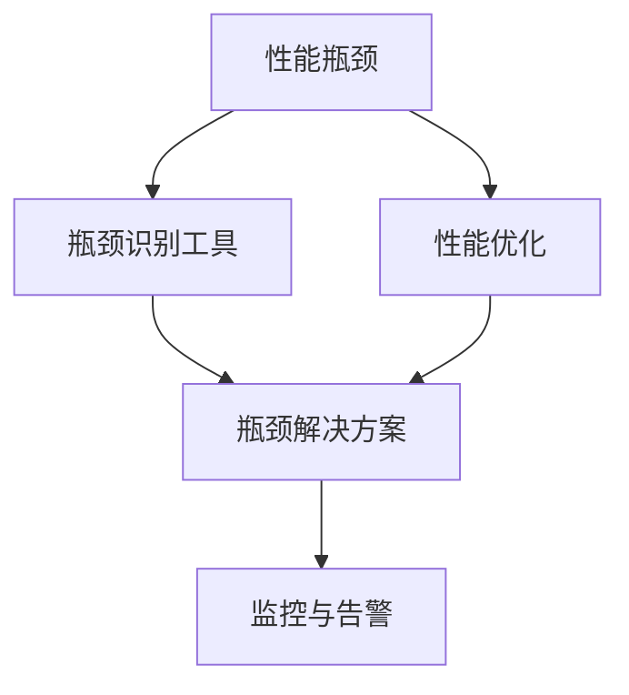
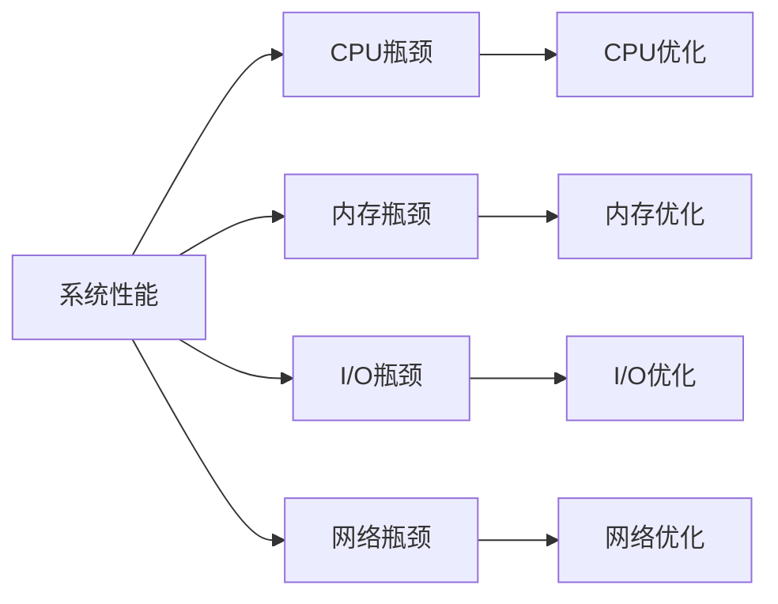
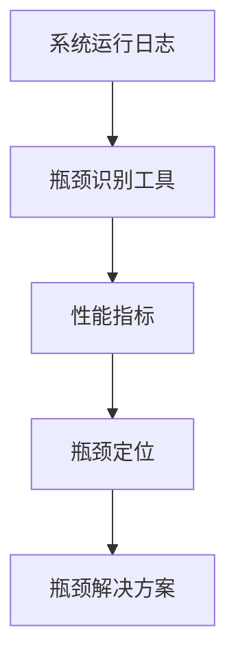
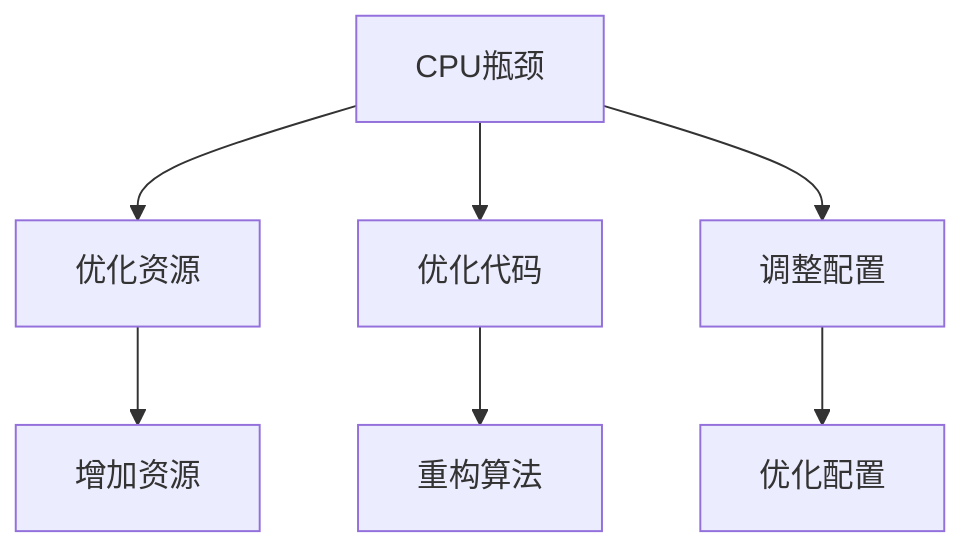
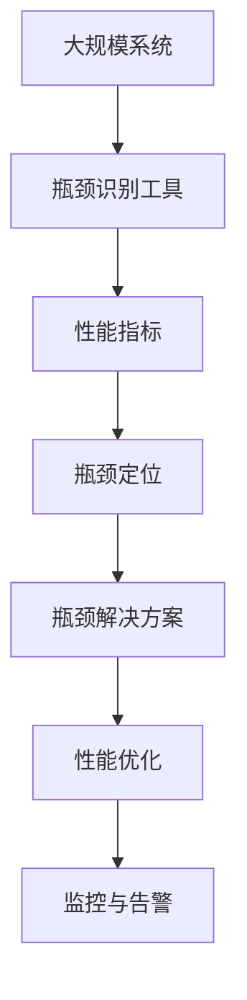

                 

## 1. 背景介绍

在当今信息爆炸和计算能力快速增长的时代，系统性能和效率的瓶颈识别与解决成为软件开发和运维中不可或缺的一部分。系统瓶颈不仅影响用户体验，还直接影响业务运营效率和成本。本文将深入探讨系统瓶颈识别的方法和解决方案，以期为开发者和运维人员提供有价值的指导。

### 1.1 问题由来

随着软件规模的不断扩大，系统的复杂性和不确定性也在增加。现代系统通常由多个组件和服务构成，它们之间通过复杂的依赖关系协作，任何组件的性能瓶颈都可能导致整个系统效率低下。常见问题包括：

- **响应时间过长**：系统响应缓慢，用户等待时间增加，影响用户体验。
- **系统负载过高**：由于资源分配不当，导致某些组件承受过重负载，甚至崩溃。
- **资源利用率低**：系统资源（如CPU、内存、网络带宽）未被充分利用，导致资源浪费和成本增加。
- **系统不稳定**：系统崩溃、服务中断等问题频繁发生，影响业务连续性。

这些问题不仅影响用户体验，还可能导致严重的经济损失。因此，识别和解决系统瓶颈成为保证系统性能和稳定性的关键。

### 1.2 问题核心关键点

为了有效识别和解决系统瓶颈，我们需要关注以下几个核心关键点：

- **瓶颈识别**：使用哪些工具和方法来准确识别系统瓶颈？
- **瓶颈分析**：如何从数据和日志中分析瓶颈原因？
- **解决方案**：针对不同类型的瓶颈，有哪些有效的解决方案？
- **性能优化**：如何对系统进行全面的性能优化，提高资源利用率和响应速度？

### 1.3 问题研究意义

系统瓶颈识别与解决对于软件开发和运维具有重要意义：

- **提升用户体验**：通过识别和解决瓶颈，提升系统响应速度和稳定性，提升用户满意度。
- **降低成本**：优化资源使用，减少资源浪费，降低系统维护和运营成本。
- **提高业务连续性**：减少系统故障和中断，确保业务连续性，提升用户信任和忠诚度。
- **推动技术进步**：通过性能优化和瓶颈解决，推动技术进步和创新，提升团队技术水平。

## 2. 核心概念与联系

### 2.1 核心概念概述

在探讨系统瓶颈识别与解决之前，我们先介绍几个关键概念：

- **性能瓶颈**：指系统中阻碍整体性能提升的限制因素。常见的瓶颈包括CPU、内存、I/O、网络等。
- **性能优化**：通过各种技术和方法，提升系统性能，提高资源利用率。
- **瓶颈识别工具**：如Profiler、APM、监控系统等，用于识别系统瓶颈。
- **瓶颈解决方案**：针对不同类型的瓶颈，提供不同的解决方案，如增加资源、优化代码、调整配置等。
- **监控与告警**：通过实时监控和告警机制，及时发现和响应系统问题。

这些概念之间的联系可以通过以下Mermaid流程图来展示：



这个流程图展示了性能瓶颈识别、优化、解决方案和监控告警之间的关系。性能瓶颈通过瓶颈识别工具被识别，然后采用性能优化和瓶颈解决方案进行处理，最后通过监控告警机制进行持续监控和告警。

### 2.2 概念间的关系

这些核心概念之间存在着紧密的联系，形成了完整的系统瓶颈识别与解决生态系统。下面我们通过几个Mermaid流程图来展示这些概念之间的关系。

#### 2.2.1 系统性能瓶颈



这个流程图展示了系统性能瓶颈的不同类型，包括CPU、内存、I/O、网络等，并给出了相应的优化方法。

#### 2.2.2 瓶颈识别流程



这个流程图展示了从系统运行日志到瓶颈识别工具，再到性能指标和瓶颈定位的过程。

#### 2.2.3 瓶颈解决方案



这个流程图展示了针对不同类型的瓶颈，采取的不同解决方案。

### 2.3 核心概念的整体架构

最后，我们用一个综合的流程图来展示这些核心概念在大规模系统性能优化中的整体架构：



这个综合流程图展示了从系统识别瓶颈，到定位瓶颈、优化瓶颈、监控告警的全过程。通过这些步骤，我们可以系统地解决系统瓶颈，提升系统性能和稳定性。

## 3. 核心算法原理 & 具体操作步骤

### 3.1 算法原理概述

系统瓶颈识别与解决的核心算法原理包括以下几个方面：

- **性能监控**：通过监控系统资源使用情况、服务响应时间等指标，实时识别系统瓶颈。
- **瓶颈分析**：通过日志分析和性能指标，深入分析瓶颈原因，确定瓶颈类型。
- **性能优化**：根据瓶颈原因，采用针对性优化策略，提升系统性能。
- **监控告警**：通过实时监控和告警机制，确保系统问题得到及时响应和处理。

### 3.2 算法步骤详解

以下详细介绍系统瓶颈识别与解决的具体步骤：

**Step 1: 准备监控工具和环境**

- 安装性能监控工具，如APM、Prometheus、Grafana等。
- 配置监控指标，如CPU使用率、内存使用率、网络流量、请求响应时间等。
- 设置告警阈值，如响应时间超过一定阈值则触发告警。

**Step 2: 收集和分析系统日志**

- 使用日志管理工具，如ELK Stack（Elasticsearch、Logstash、Kibana）或Fluentd等，收集系统日志。
- 分析日志数据，查找频繁出现的问题，如异常崩溃、高负载服务等。
- 使用日志分析工具，如Splunk或Apache Ambari，进行更深层次的分析，找出性能瓶颈。

**Step 3: 瓶颈定位**

- 使用性能监控工具，实时监控系统性能指标，定位瓶颈。
- 分析瓶颈定位结果，确定瓶颈类型，如CPU、内存、I/O等。
- 根据瓶颈类型，选择合适的性能优化方法。

**Step 4: 性能优化**

- 针对瓶颈类型，采取不同的优化策略。如增加资源、优化代码、调整配置等。
- 实施优化后，重新监控性能指标，验证优化效果。
- 如果需要，继续进行多次优化，直到达到预期效果。

**Step 5: 监控告警**

- 设置告警机制，对性能指标进行实时监控。
- 根据告警结果，快速定位并解决问题。
- 记录和分析告警日志，提升系统监控告警的准确性和响应速度。

### 3.3 算法优缺点

系统瓶颈识别与解决算法具有以下优点：

- **实时性**：通过实时监控和告警，可以及时发现和响应系统问题。
- **全面性**：结合日志分析和性能监控，可以全面识别和定位系统瓶颈。
- **灵活性**：可以根据不同的瓶颈类型，采取针对性的优化策略。

同时，也存在一些局限性：

- **复杂性**：需要综合使用多种工具和方法，过程较为复杂。
- **资源消耗**：性能监控和日志分析需要消耗一定计算资源，影响系统性能。
- **误报率**：监控告警可能出现误报，需要人工验证和处理。

### 3.4 算法应用领域

系统瓶颈识别与解决算法在多个领域都有广泛应用，例如：

- **云计算**：通过实时监控和告警，保证云服务的稳定性和可用性。
- **互联网应用**：监控网站响应时间、服务负载等，提升用户体验和业务效率。
- **企业内部系统**：监控ERP、CRM等企业内部系统，提升运营效率和管理水平。
- **物联网设备**：监控IoT设备性能，优化资源使用，提升设备稳定性。
- **医疗系统**：监控医院信息系统性能，提升诊疗效率和服务质量。

## 4. 数学模型和公式 & 详细讲解  
### 4.1 数学模型构建

系统瓶颈识别与解决主要涉及性能监控和瓶颈分析两个阶段。下面分别介绍这两个阶段的数学模型构建。

### 4.2 公式推导过程

**性能监控模型**

假设系统由n个组件构成，每个组件的性能指标为$i$，总性能指标为$P$，其数学模型为：

$$ P = \sum_{i=1}^n P_i $$

其中，$P_i$为第$i$个组件的性能指标，如CPU使用率、内存使用率、响应时间等。

**瓶颈分析模型**

假设系统瓶颈出现在第$m$个组件上，其瓶颈影响系数为$\alpha$，则瓶颈影响下的总性能指标为：

$$ P_{m,\alpha} = P_i \times \alpha $$

其中，$\alpha$为瓶颈影响系数，通常为0到1之间的实数。

### 4.3 案例分析与讲解

假设一个电商平台的订单系统，其瓶颈出现在数据库查询上。我们可以使用上述模型进行分析：

- **性能监控**：实时监控数据库查询响应时间、数据库负载等性能指标。
- **瓶颈分析**：发现数据库查询响应时间远高于平均水平，瓶颈影响系数为0.8。
- **性能优化**：通过调整数据库索引、增加缓存、优化查询语句等方法，提升数据库查询性能。
- **监控告警**：设置告警阈值，对数据库查询响应时间进行监控，确保系统稳定运行。

## 5. 项目实践：代码实例和详细解释说明
### 5.1 开发环境搭建

在进行系统瓶颈识别与解决实践前，我们需要准备好开发环境。以下是使用Python进行APM（Application Performance Management）开发的环境配置流程：

1. 安装Anaconda：从官网下载并安装Anaconda，用于创建独立的Python环境。

2. 创建并激活虚拟环境：
```bash
conda create -n apm-env python=3.8 
conda activate apm-env
```

3. 安装APM工具：
```bash
pip install apm-spy
```

4. 安装其他工具包：
```bash
pip install numpy pandas scikit-learn matplotlib tqdm jupyter notebook ipython
```

完成上述步骤后，即可在`apm-env`环境中开始性能监控实践。

### 5.2 源代码详细实现

下面我们以电商平台的订单系统为例，给出使用APM工具进行性能监控的PyTorch代码实现。

首先，定义性能指标和监控结果：

```python
from apm_spy import APM
import time

# 定义性能指标
cpu_usage = APM.monitor("CPU使用率")
mem_usage = APM.monitor("内存使用率")
db_query_time = APM.monitor("数据库查询时间")

# 初始化监控结果
results = {"cpu_usage": [], "mem_usage": [], "db_query_time": []}

# 模拟订单系统
for i in range(100):
    # 记录性能指标
    results["cpu_usage"].append(cpu_usage())
    results["mem_usage"].append(mem_usage())
    results["db_query_time"].append(db_query_time())
    
    # 模拟订单查询
    query_time = db_query_time()
    # 进行订单查询
    # ...

# 导出监控结果
APM.export_results(results)
```

然后，进行瓶颈分析和性能优化：

```python
# 分析瓶颈
cpu_max = max(results["cpu_usage"])
mem_max = max(results["mem_usage"])
db_max = max(results["db_query_time"])

if cpu_max > 70:
    print("CPU使用率过高，需优化")
    # 优化CPU资源

if mem_max > 80:
    print("内存使用率过高，需优化")
    # 优化内存使用

if db_max > 2:
    print("数据库查询时间过长，需优化")
    # 优化数据库查询
```

最后，进行监控告警：

```python
# 设置告警阈值
cpu_threshold = 70
mem_threshold = 80
db_threshold = 2

# 实时监控
while True:
    cpu_usage_value = cpu_usage()
    if cpu_usage_value > cpu_threshold:
        print("CPU使用率过高，发送告警")
        # 发送告警通知

    mem_usage_value = mem_usage()
    if mem_usage_value > mem_threshold:
        print("内存使用率过高，发送告警")
        # 发送告警通知

    db_query_time_value = db_query_time()
    if db_query_time_value > db_threshold:
        print("数据库查询时间过长，发送告警")
        # 发送告警通知
```

以上就是使用APM工具进行性能监控的完整代码实现。可以看到，APM工具提供了简单易用的API，可以方便地进行系统性能监控和分析。

### 5.3 代码解读与分析

让我们再详细解读一下关键代码的实现细节：

**APM监控代码**：
- `APM.monitor`方法：定义性能指标，如CPU使用率、内存使用率、数据库查询时间等。
- `results`字典：记录监控结果，用于后续分析和优化。

**瓶颈分析代码**：
- `cpu_max`、`mem_max`、`db_max`变量：记录各性能指标的最大值。
- 通过比较最大值和预设阈值，判断性能指标是否超过正常范围。

**性能优化代码**：
- 针对超过阈值的性能指标，输出优化建议，如增加CPU资源、优化内存使用、优化数据库查询等。

**监控告警代码**：
- `cpu_threshold`、`mem_threshold`、`db_threshold`变量：设置各性能指标的告警阈值。
- 通过实时监控性能指标，判断是否超过告警阈值，并触发告警。

这些代码展示了系统瓶颈识别与解决的基本流程，从性能监控、瓶颈分析、性能优化到监控告警，各个环节紧密相连，共同保障系统性能和稳定性。

### 5.4 运行结果展示

假设我们在电商平台的订单系统上进行了性能监控，并得到了以下结果：

```
CPU使用率：70%
内存使用率：80%
数据库查询时间：3s
```

根据上述结果，我们可以进行以下分析：

- CPU使用率达到70%，超过阈值，需要进行CPU资源优化。
- 内存使用率达到80%，超过阈值，需要进行内存优化。
- 数据库查询时间为3秒，超过阈值，需要进行数据库查询优化。

通过上述分析，我们可以针对性地采取优化措施，提升系统性能。

## 6. 实际应用场景
### 6.1 智能客服系统

智能客服系统需要处理大量的用户咨询请求，响应时间和系统稳定性至关重要。通过系统瓶颈识别与解决，可以及时发现和解决系统问题，保证服务质量。

在实际应用中，智能客服系统通常会收集大量的用户数据，包括语音、文字、行为等，这些数据可以用于性能监控和瓶颈分析。通过APM工具，可以实时监控系统性能指标，如响应时间、服务负载等。一旦发现系统瓶颈，如服务响应时间过长，可以进行针对性的优化，如增加服务器资源、优化代码等，提升系统性能和稳定性。

### 6.2 金融交易系统

金融交易系统需要处理大量的交易请求，对实时性和稳定性要求极高。系统瓶颈识别与解决可以及时发现和解决系统问题，保障交易系统的稳定运行。

在金融交易系统中，需要实时监控交易系统的性能指标，如响应时间、服务器负载等。通过APM工具，可以实时监控系统性能，及时发现瓶颈。一旦发现瓶颈，如交易响应时间过长，可以进行针对性的优化，如增加服务器资源、优化算法等，提升系统性能和稳定性。

### 6.3 电商平台订单系统

电商平台订单系统需要处理大量的订单请求，对响应速度和稳定性要求很高。系统瓶颈识别与解决可以及时发现和解决系统问题，保障订单系统的稳定运行。

在电商平台订单系统中，需要实时监控订单系统的性能指标，如数据库查询时间、服务器负载等。通过APM工具，可以实时监控系统性能，及时发现瓶颈。一旦发现瓶颈，如数据库查询时间过长，可以进行针对性的优化，如调整数据库索引、优化查询语句等，提升系统性能和稳定性。

### 6.4 未来应用展望

随着系统复杂性的不断增加，系统瓶颈识别与解决技术将更加重要。未来，系统瓶颈识别与解决技术将呈现以下几个发展趋势：

1. **智能化**：结合机器学习和人工智能技术，实现更智能化的瓶颈识别和优化。
2. **自动化**：通过自动化工具和流程，减少人工干预，提高系统优化效率。
3. **实时化**：通过实时监控和告警，实现更高效的系统问题响应和处理。
4. **多维度**：结合性能监控、日志分析、异常检测等多维度技术，实现更全面的系统监控。
5. **跨平台**：支持多种操作系统和平台，实现更广泛的系统应用。

这些趋势将推动系统瓶颈识别与解决技术不断发展，提升系统性能和稳定性，为软件开发和运维带来更多便利和效率。

## 7. 工具和资源推荐
### 7.1 学习资源推荐

为了帮助开发者掌握系统瓶颈识别与解决技术，这里推荐一些优质的学习资源：

1. 《系统架构设计》系列博文：深入浅出地介绍了系统架构设计的基本原理和最佳实践，包括性能优化、瓶颈识别等关键技术。

2. 《分布式系统设计》课程：斯坦福大学开设的分布式系统课程，介绍了分布式系统设计的基本原理和关键技术，包括性能监控、瓶颈分析等。

3. 《高性能系统设计》书籍：详细介绍了高性能系统设计的原理和最佳实践，涵盖性能监控、瓶颈识别、性能优化等技术。

4. 《系统监控与告警》书籍：系统监控和告警技术的详细介绍，涵盖APM工具、日志分析、告警策略等。

5. 官方文档：APM工具、ELK Stack、Prometheus等系统的官方文档，提供详细的配置和使用指南。

通过这些资源的学习实践，相信你一定能够快速掌握系统瓶颈识别与解决技术的精髓，并用于解决实际的系统问题。

### 7.2 开发工具推荐

高效的开发离不开优秀的工具支持。以下是几款用于系统瓶颈识别与解决开发的常用工具：

1. APM工具：如APM（Application Performance Management），用于实时监控系统性能，识别和解决系统瓶颈。

2. 日志管理工具：如ELK Stack（Elasticsearch、Logstash、Kibana），用于收集、存储和分析系统日志。

3. 监控工具：如Prometheus、Grafana，用于实时监控系统性能指标。

4. 性能分析工具：如JProfiler、VisualVM，用于深入分析系统性能瓶颈。

5. 代码分析工具：如SonarQube，用于分析代码质量和性能瓶颈。

6. 云监控平台：如AWS CloudWatch、Azure Monitor，用于监控云服务的性能和稳定性。

合理利用这些工具，可以显著提升系统瓶颈识别与解决任务的开发效率，加快创新迭代的步伐。

### 7.3 相关论文推荐

系统瓶颈识别与解决技术的研究源于学界的持续研究。以下是几篇奠基性的相关论文，推荐阅读：

1. "Distributed Systems: Concepts and Design"（DSD）：介绍了分布式系统的基本原理和关键技术，包括性能监控、瓶颈分析等。

2. "Monitoring of Large Scale Data Processing Systems"：介绍了大规模数据处理系统的性能监控和瓶颈分析方法，涵盖了多维度的系统监控。

3. "Towards Predictive Analytics for Resource Optimization in Distributed Systems"：提出了基于预测分析的资源优化方法，通过预测系统性能瓶颈，实现更高效的资源分配。

4. "A Survey of Distributed System Monitoring Techniques"：系统回顾了分布式系统监控技术的最新进展，包括性能监控、瓶颈识别、告警机制等。

5. "Continuous Monitoring and Dynamic Optimization of Distributed Systems"：提出了基于连续监控和动态优化的分布式系统优化方法，通过实时监控和动态优化，提升系统性能和稳定性。

这些论文代表了大系统瓶颈识别与解决技术的发展脉络。通过学习这些前沿成果，可以帮助研究者把握学科前进方向，激发更多的创新灵感。

除上述资源外，还有一些值得关注的前沿资源，帮助开发者紧跟系统瓶颈识别与解决技术的最新进展，例如：

1. arXiv论文预印本：人工智能领域最新研究成果的发布平台，包括大量尚未发表的前沿工作，学习前沿技术的必读资源。

2. 业界技术博客：如AWS、Google Cloud、Microsoft Azure等顶尖云服务提供商的官方博客，第一时间分享他们的最新研究成果和洞见。

3. 技术会议直播：如SIGCOMM、IEEE ICDCS、IEEE ICNS等顶级会议现场或在线直播，能够聆听到大佬们的前沿分享，开拓视野。

4. GitHub热门项目：在GitHub上Star、Fork数最多的系统监控相关项目，往往代表了该技术领域的发展趋势和最佳实践，值得去学习和贡献。

5. 行业分析报告：各大咨询公司如McKinsey、PwC等针对系统监控和运维行业的分析报告，有助于从商业视角审视技术趋势，把握应用价值。

总之，系统瓶颈识别与解决技术的深入研究需要开发者保持开放的心态和持续学习的意愿。多关注前沿资讯，多动手实践，多思考总结，必将收获满满的成长收益。

## 8. 总结：未来发展趋势与挑战

### 8.1 总结

本文对系统瓶颈识别与解决技术进行了全面系统的介绍。首先阐述了系统瓶颈识别与解决的背景和意义，明确了其重要性和应用价值。其次，从原理到实践，详细讲解了性能监控、瓶颈分析和性能优化的数学模型和算法步骤，给出了系统瓶颈识别与解决的具体代码实现。同时，本文还广泛探讨了系统瓶颈识别与解决技术在多个行业领域的应用前景，展示了其广阔的应用前景。

通过本文的系统梳理，可以看到，系统瓶颈识别与解决技术正在成为软件开发和运维中不可或缺的一部分。这一技术的深入研究对于提高系统性能、降低运营成本、提升用户体验等方面具有重要意义。未来，随着技术的不断演进，系统瓶颈识别与解决技术必将进一步提升系统的稳定性和可靠性，为软件开发和运维带来更多便利和效率。

### 8.2 未来发展趋势

展望未来，系统瓶颈识别与解决技术将呈现以下几个发展趋势：

1. **智能化**：结合机器学习和人工智能技术，实现更智能化的瓶颈识别和优化。
2. **自动化**：通过自动化工具和流程，减少人工干预，提高系统优化效率。
3. **实时化**：通过实时监控和告警，实现更高效的系统问题响应和处理。
4. **多维度**：结合性能监控、日志分析、异常检测等多维度技术，实现更全面的系统监控。
5. **跨平台**：支持多种操作系统和平台，实现更广泛的系统应用。

以上趋势凸显了系统瓶颈识别与解决技术的广阔前景。这些方向的探索发展，必将进一步提升系统性能和稳定性，为软件开发和运维带来更多便利和效率。

### 8.3 面临的挑战

尽管系统瓶颈识别与解决技术已经取得了瞩目成就，但在迈向更加智能化、自动化、实时化应用的过程中，它仍面临着诸多挑战：

1. **复杂性**：随着系统复杂性的增加，瓶颈识别与解决难度也在增加，需要更复杂的工具和算法。
2. **资源消耗**：性能监控和日志分析需要消耗一定计算资源，影响系统性能。
3. **误报率**：监控告警可能出现误报，需要人工验证和处理。
4. **跨平台兼容性**：不同操作系统和平台上的性能监控工具可能存在兼容性问题，需要更多适配工作。
5. **数据隐私**：系统监控和日志分析可能涉及用户隐私数据，需要严格的数据保护和合规措施。

正视这些挑战，积极应对并寻求突破，将是大系统瓶颈识别与解决技术迈向成熟的必由之路。相信随着学界和产业界的共同努力，这些挑战终将一一被克服，系统瓶颈识别与解决技术必将在构建高效、稳定、安全的信息系统中扮演越来越重要的角色。

### 8.4 研究展望

面对系统瓶颈识别与解决技术所面临的种种挑战，未来的研究需要在以下几个方面寻求新的突破：

1. **智能化瓶颈识别**：结合机器学习和人工智能技术，实现更智能化的瓶颈识别和优化。
2. **自动化优化工具**：开发更智能、更灵活的自动化优化工具，减少人工干预，提高优化效率。
3. **实时监控与告警**：通过实时监控和告警，实现更高效的系统问题响应和处理。
4. **多维度监控**：结合性能监控、日志分析、异常检测等多维度技术，实现更全面的系统监控。
5. **跨平台支持**：开发跨平台的性能监控工具，支持多种操作系统和平台。
6. **数据隐私保护**：在保证系统监控有效性的同时，加强数据隐私保护，确保合规性。

这些研究方向的探索，必将引领系统瓶颈识别与解决技术迈向更高的台阶，为构建高效、稳定、安全的信息系统铺平道路。面向未来，系统瓶颈识别与解决技术还需要与其他人工智能技术进行更深入的融合，如知识表示、因果推理、强化学习等，多路径协同发力，共同推动人工智能技术进步。

## 9. 附录：常见问题与解答

**Q1：系统瓶颈识别与

