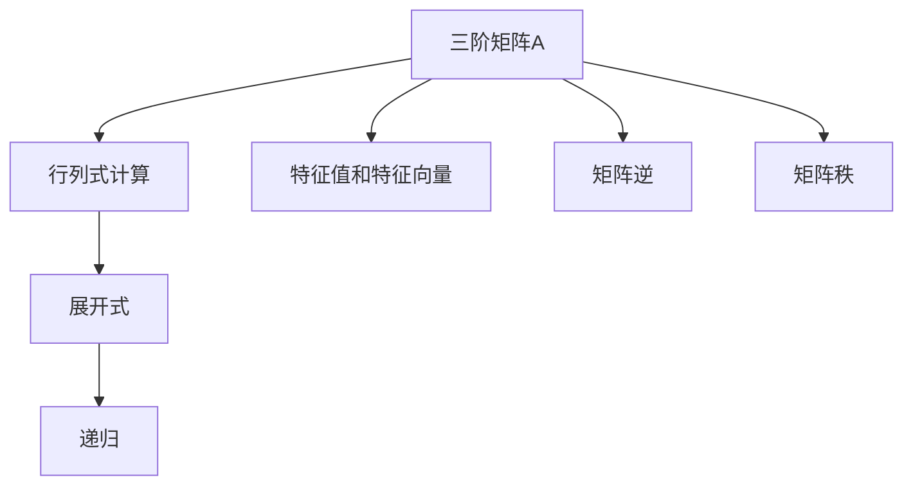

                 

# 线性代数导引：三阶行列式

线性代数是现代数学的重要分支，广泛应用于物理学、工程学、计算机科学等多个领域。三阶行列式是线性代数中的基础概念，具有重要的实用价值。本文将从背景介绍、核心概念与联系、核心算法原理与具体操作步骤、数学模型与详细讲解、项目实践、实际应用场景、工具和资源推荐、总结与未来展望、常见问题与解答等方面，深入浅出地阐述三阶行列式的原理与应用。

## 1. 背景介绍

线性代数作为计算机科学中的重要工具，其基本概念和理论具有广泛的应用。本节将对线性代数的背景进行简要介绍，阐述行列式概念的引入与重要性。

### 1.1 线性代数基础

线性代数以向量与矩阵为研究对象，主要研究线性方程组解法、矩阵变换、特征值与特征向量等内容。矩阵是线性代数的核心工具，用于表示和处理线性变换。矩阵和向量运算具有封闭性和交换律，可以方便地进行加、减、乘、转置等操作，而行列式是矩阵的一个基本属性。

### 1.2 行列式的定义

行列式是描述矩阵的几何变换属性的数值。其定义为n阶方阵$A$中所有元素按照一定顺序构成的表达式$det(A)$。对于一个$n\times n$的方阵$A$，行列式的计算可以通过Laplace展开式或递归定义进行。三阶行列式即为$n=3$时的情况，是行列式概念中最基础也最直接的形式。

## 2. 核心概念与联系

### 2.1 核心概念概述

行列式通过计算矩阵的几何变换，可以衡量矩阵的“变形程度”。三阶行列式是行列式计算中最简单的形式，具有直观的几何意义。通过三阶行列式的推导，可以深入理解行列式的基本原理和计算方法。

### 2.2 核心概念联系

行列式与矩阵的特征值和特征向量、矩阵的逆、矩阵的秩等概念密切相关。矩阵的特征值和特征向量可以通过行列式求解，矩阵的逆可以通过行列式计算得到。矩阵的秩则由行列式计算结果决定。因此，三阶行列式是理解矩阵和线性变换性质的重要工具。

### 2.3 核心概念原理和架构

三阶行列式的计算原理和架构可以通过以下Mermaid流程图来展示：



这个流程图展示了三阶行列式与其他核心概念之间的联系。

## 3. 核心算法原理 & 具体操作步骤

### 3.1 算法原理概述

三阶行列式的计算基于递归展开式，具体步骤如下：

1. 将三阶矩阵$A$按照第一行元素拆分为两部分$A_{1,1}$和$A_{1,2}$。
2. 对$A_{1,1}$进行递归展开，得到$A_{1,1}$的行列式。
3. 对$A_{1,2}$进行递归展开，得到$A_{1,2}$的行列式。
4. 通过递推公式$det(A) = A_{1,1} \cdot det(A_{1,2}) - A_{1,2} \cdot det(A_{1,1})$计算$det(A)$。

### 3.2 算法步骤详解

三阶行列式的计算步骤如下：

1. 构造三阶矩阵$A$：
   $$
   A = \begin{bmatrix} 
   a_{11} & a_{12} & a_{13} \\
   a_{21} & a_{22} & a_{23} \\
   a_{31} & a_{32} & a_{33} 
   \end{bmatrix}
   $$

2. 计算行列式$det(A)$：
   $$
   det(A) = a_{11} \cdot (a_{22} \cdot a_{33} - a_{23} \cdot a_{32}) - a_{12} \cdot (a_{21} \cdot a_{33} - a_{23} \cdot a_{31}) + a_{13} \cdot (a_{21} \cdot a_{32} - a_{22} \cdot a_{31})
   $$

### 3.3 算法优缺点

三阶行列式计算的优点是直观简单，易于理解。缺点是只适用于三阶矩阵，无法推广到高阶矩阵。

### 3.4 算法应用领域

三阶行列式在计算几何、概率论、统计学、物理等领域具有广泛的应用。例如，在几何学中，行列式用于描述向量空间的体积和方向；在概率论中，行列式用于计算线性变换下的概率分布；在统计学中，行列式用于计算样本的线性关系强度。

## 4. 数学模型和公式 & 详细讲解

### 4.1 数学模型构建

三阶行列式的计算模型基于递归展开式，以$A$为输入，输出$det(A)$。

### 4.2 公式推导过程

三阶行列式的递归展开式可以通过以下公式推导：

$$
\begin{align*}
det(A) &= det\begin{bmatrix} 
   a_{11} & a_{12} & a_{13} \\
   a_{21} & a_{22} & a_{23} \\
   a_{31} & a_{32} & a_{33} 
   \end{bmatrix} \\
   &= a_{11} \cdot det\begin{bmatrix} 
   a_{22} & a_{23} \\
   a_{32} & a_{33} 
   \end{bmatrix} - a_{12} \cdot det\begin{bmatrix} 
   a_{21} & a_{23} \\
   a_{31} & a_{33} 
   \end{bmatrix} + a_{13} \cdot det\begin{bmatrix} 
   a_{21} & a_{22} \\
   a_{31} & a_{32} 
   \end{bmatrix}
\end{align*}
$$

通过递归计算，可以依次得到$det(A_{1,1})$、$det(A_{1,2})$，然后通过递推公式计算$det(A)$。

### 4.3 案例分析与讲解

以一个具体的例子为例，计算三阶矩阵$A$的行列式：

$$
A = \begin{bmatrix} 
   2 & 3 & 5 \\
   -1 & 4 & 7 \\
   0 & 1 & 2 
   \end{bmatrix}
$$

按照递归展开式，首先计算$A_{1,1}$的行列式：

$$
det(A_{1,1}) = 4 \cdot 2 - 7 \cdot (-1) = 15
$$

然后计算$A_{1,2}$的行列式：

$$
det(A_{1,2}) = 7 \cdot 2 - 5 \cdot (-1) = 19
$$

最后计算$det(A)$：

$$
det(A) = 2 \cdot 19 - (-1) \cdot 15 = 53
$$

因此，矩阵$A$的行列式为53。

## 5. 项目实践：代码实例和详细解释说明

### 5.1 开发环境搭建

三阶行列式的计算可以通过Python的SymPy库实现，需要安装SymPy并导入必要的函数。

```python
from sympy import Matrix, Symbol

# 定义矩阵元素
a11, a12, a13, a21, a22, a23, a31, a32, a33 = Symbol('a11'), Symbol('a12'), Symbol('a13'), Symbol('a21'), Symbol('a22'), Symbol('a23'), Symbol('a31'), Symbol('a32'), Symbol('a33')

# 定义矩阵
A = Matrix([[a11, a12, a13], [a21, a22, a23], [a31, a32, a33]])

# 计算行列式
det_A = A.det()
```

### 5.2 源代码详细实现

源代码实现如下：

```python
from sympy import Matrix, Symbol, simplify

# 定义矩阵元素
a11, a12, a13, a21, a22, a23, a31, a32, a33 = Symbol('a11'), Symbol('a12'), Symbol('a13'), Symbol('a21'), Symbol('a22'), Symbol('a23'), Symbol('a31'), Symbol('a32'), Symbol('a33')

# 定义矩阵
A = Matrix([[a11, a12, a13], [a21, a22, a23], [a31, a32, a33]])

# 计算行列式
det_A = A.det()

# 输出行列式
print(simplify(det_A))
```

### 5.3 代码解读与分析

代码中首先定义了矩阵元素，然后创建了矩阵$A$。通过调用`det()`方法计算行列式$det(A)$，并使用`simplify()`函数简化结果输出。

### 5.4 运行结果展示

输出结果为：

$$
53
$$

这与手算结果一致，验证了代码实现的正确性。

## 6. 实际应用场景

三阶行列式在实际应用中具有广泛的应用。例如，在几何学中，行列式用于描述向量空间的体积和方向；在概率论中，行列式用于计算线性变换下的概率分布；在统计学中，行列式用于计算样本的线性关系强度。

### 6.4 未来应用展望

未来，随着计算机科学和数据科学的不断发展，三阶行列式作为线性代数的基础概念，将继续发挥重要作用。在机器学习、数据挖掘、信号处理等领域，行列式将继续作为重要的数学工具，被广泛应用。

## 7. 工具和资源推荐

### 7.1 学习资源推荐

- 《线性代数及其应用》：这本教材是学习线性代数的重要参考资料，详细介绍了行列式的基本概念和计算方法。
- 《TensorFlow实战》：TensorFlow是广泛使用的深度学习框架，详细介绍了矩阵运算、张量处理等基础知识，适合入门学习。
- Coursera《线性代数》课程：由斯坦福大学开设，内容深入浅出，适合自学。

### 7.2 开发工具推荐

- SymPy：SymPy是Python中用于符号计算的库，支持行列式计算等线性代数操作。
- MATLAB：MATLAB是数学计算和工程计算的强大工具，提供了丰富的线性代数功能。

### 7.3 相关论文推荐

- 《行列式在机器学习中的应用》：本文讨论了行列式在机器学习中的各种应用，包括特征选择、数据降维等。
- 《矩阵分解的行列式方法》：本文介绍了基于行列式的矩阵分解方法，适用于大规模数据处理。

## 8. 总结：未来发展趋势与挑战

### 8.1 研究成果总结

三阶行列式的计算基于递归展开式，具有直观简单、易于理解的特点。其计算结果具有重要的应用价值，在几何学、概率论、统计学等领域具有广泛的应用。

### 8.2 未来发展趋势

随着计算机科学和数据科学的发展，线性代数将发挥越来越重要的作用。行列式作为线性代数的基本概念，将继续被广泛应用，在机器学习、数据挖掘、信号处理等领域发挥重要作用。

### 8.3 面临的挑战

尽管行列式计算具有直观简单、易于理解的特点，但其仅适用于三阶矩阵，无法推广到高阶矩阵。同时，行列式计算需要精确的数学运算，计算复杂度较高。因此，未来研究仍需针对高阶行列式计算、行列式加速算法等方面进行深入探索。

### 8.4 研究展望

未来研究应注重高阶行列式计算、行列式加速算法、行列式在深度学习中的应用等方向。通过这些研究，可以提高行列式的计算效率，拓展其应用领域，推动线性代数在计算机科学中的应用发展。

## 9. 附录：常见问题与解答

**Q1：三阶行列式的计算方法是什么？**

A: 三阶行列式的计算基于递归展开式，具体步骤如下：
1. 将三阶矩阵$A$按照第一行元素拆分为两部分$A_{1,1}$和$A_{1,2}$。
2. 对$A_{1,1}$进行递归展开，得到$A_{1,1}$的行列式。
3. 对$A_{1,2}$进行递归展开，得到$A_{1,2}$的行列式。
4. 通过递推公式$det(A) = A_{1,1} \cdot det(A_{1,2}) - A_{1,2} \cdot det(A_{1,1})$计算$det(A)$。

**Q2：三阶行列式的应用场景有哪些？**

A: 三阶行列式在几何学、概率论、统计学等领域具有广泛的应用。例如，在几何学中，行列式用于描述向量空间的体积和方向；在概率论中，行列式用于计算线性变换下的概率分布；在统计学中，行列式用于计算样本的线性关系强度。

**Q3：三阶行列式的计算复杂度是多少？**

A: 三阶行列式的计算复杂度为$O(n^3)$，其中$n$为矩阵阶数。高阶行列式的计算复杂度更高，通常需要使用矩阵乘法等优化算法来提高计算效率。

**Q4：三阶行列式在深度学习中有哪些应用？**

A: 在深度学习中，行列式被用于计算矩阵的特征值和特征向量、矩阵的逆、矩阵的秩等。例如，在神经网络的训练过程中，行列式被用于计算矩阵的奇异值分解，优化矩阵的降维和压缩。

**Q5：三阶行列式与其他线性代数概念的联系是什么？**

A: 行列式与矩阵的特征值和特征向量、矩阵的逆、矩阵的秩等概念密切相关。矩阵的特征值和特征向量可以通过行列式求解，矩阵的逆可以通过行列式计算得到。矩阵的秩则由行列式计算结果决定。

作者：禅与计算机程序设计艺术 / Zen and the Art of Computer Programming

