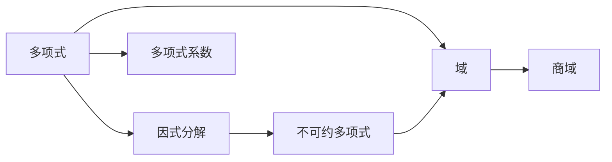

                 

# 线性代数导引：多项式不可约性

## 1. 背景介绍

### 1.1 问题由来
多项式不可约性是代数中的一个基本概念，其重要性在于它可以帮助我们判断一个多项式是否可以被分解为两个次数更低的因式乘积。这个概念不仅在数学领域具有重要意义，也广泛应用于密码学、编码理论、计算机代数等领域。本文将深入探讨多项式不可约性的理论基础和应用实践，力求通过简明扼要的介绍，让读者对这一核心概念有更深刻的理解。

### 1.2 问题核心关键点
多项式不可约性的核心关键点包括：
1. **定义**：多项式不可约性指的是，一个多项式不能被进一步分解为两个次数更低的非平凡多项式乘积。
2. **性质**：不可约多项式在某个系数域上是唯一的，即唯一地确定了一个商域。
3. **应用**：不可约多项式在密码学中的RSA算法中起着关键作用，是编码理论中校验码设计的基础，也在计算机代数系统中用于多项式的求根和因式分解。

## 2. 核心概念与联系

### 2.1 核心概念概述

多项式不可约性是建立在多项式理论基础上的一个重要概念。其核心概念和相关概念的概述如下：

- **多项式**：多项式是指由变量的非负整数次幂和系数组成的表达式。如 $p(x) = a_n x^n + a_{n-1} x^{n-1} + \ldots + a_1 x + a_0$，其中 $a_i$ 是系数，$n$ 是次数。
- **因式分解**：将一个多项式分解为若干个不可约多项式的乘积，每个因式都是不可再分的多项式。
- **域**：域是满足加法和乘法封闭性的集合，且包含加法单位元和乘法单位元。在多项式理论中，我们通常考虑多项式系数所在的域。
- **不可约多项式**：指不能被分解为两个次数更低的非平凡多项式的乘积的多项式。
- **商域**：若多项式 $p(x)$ 不可约于域 $F[x]$，则存在唯一的域 $E$，使得 $E = F[x]/(p(x))$。

这些核心概念之间通过多项式的因式分解和不可约性紧密联系，形成一个完整的理论体系。

### 2.2 概念间的关系

多项式不可约性与其他概念的关系可以通过以下 Mermaid 流程图来展示：



这个流程图展示了多项式、因式分解、不可约多项式、域和商域之间的逻辑关系：
1. 多项式可以被因式分解为多个不可约多项式的乘积。
2. 不可约多项式是因式分解的原子单位。
3. 多项式的系数域和商域密切相关，不可约多项式可以唯一确定一个商域。

## 3. 核心算法原理 & 具体操作步骤
### 3.1 算法原理概述

多项式不可约性的判断主要依赖于多项式的性质和域的性质。通常，我们采用如下步骤进行判断：

1. **选择域**：选择多项式系数所在的域 $F$。
2. **判断是否存在非平凡因式**：尝试分解多项式 $p(x)$。
3. **判断不可约性**：若多项式 $p(x)$ 无法进一步分解为次数更低的非平凡多项式的乘积，则 $p(x)$ 是不可约多项式。

### 3.2 算法步骤详解

以下是多项式不可约性判断的详细步骤：

1. **选择系数域**：选择适当的多项式系数域，如 $\mathbb{Z}$（整数域）、$\mathbb{Q}$（有理数域）、$\mathbb{R}$（实数域）、$\mathbb{C}$（复数域）等。

2. **因式分解**：尝试对多项式 $p(x)$ 进行因式分解。常用的因式分解方法包括：
   - **试除法**：逐步试除系数域中的元素，判断是否为多项式的根。
   - **长除法**：将高次项与低次项进行多项式除法，逐步求余式。
   - **配方法**：通过配方法将多项式转化为完全平方形式，从而便于因式分解。

3. **判断不可约性**：若多项式无法分解为非平凡因式，则它是不可约多项式。例如，在 $\mathbb{R}$ 域上，多项式 $x^2+1$ 无法分解为实数域上的因式，因此是 $\mathbb{R}$ 上的不可约多项式。

### 3.3 算法优缺点

多项式不可约性判断的算法具有以下优点和缺点：

**优点**：
- 适用于各种域的多项式，具有广泛的适用性。
- 通过因式分解，可以直接观察多项式的结构，有助于理解多项式的性质。

**缺点**：
- 对于高次多项式，因式分解过程复杂，计算量大。
- 某些多项式可能无法因式分解，判断不可约性变得困难。
- 算法在实际应用中可能存在效率问题，对于大规模多项式尤其明显。

### 3.4 算法应用领域

多项式不可约性在数学、密码学、编码理论、计算机代数等领域有着广泛的应用：

1. **密码学**：在RSA算法中，质因子的不可约性是确保算法安全性的关键。
2. **编码理论**：多项式不可约性是校验码设计的基础，如循环码、BCH码等。
3. **计算机代数**：多项式的因式分解和不可约性判断在计算机代数系统中用于多项式的求根、分解和代数运算。
4. **离散数学**：多项式不可约性在图论、组合数学等领域也有重要应用。

## 4. 数学模型和公式 & 详细讲解

### 4.1 数学模型构建

多项式不可约性的判断可以建模为多项式的因式分解问题。设多项式 $p(x) \in F[x]$，其中 $F$ 为系数域。定义 $p(x)$ 的因式分解形式为：

$$
p(x) = q_1(x)q_2(x) \ldots q_n(x)
$$

其中 $q_i(x)$ 为不可约多项式。

### 4.2 公式推导过程

设 $p(x) = x^2+1$，尝试在 $\mathbb{R}$ 域上进行因式分解：

$$
p(x) = (x+i)(x-i)
$$

由于 $x+i$ 和 $x-i$ 都是不可约多项式，且 $\mathbb{R}$ 域上不存在其他因式分解形式，因此 $x^2+1$ 在 $\mathbb{R}$ 上是不可约多项式。

### 4.3 案例分析与讲解

以多项式 $x^4+1$ 为例，判断其不可约性：

1. **选择域**：假设系数域为 $\mathbb{Q}$。
2. **因式分解**：尝试分解 $x^4+1$。
3. **判断不可约性**：

   - 首先，$x^4+1$ 可以被写为 $(x^2+1)^2-2x^2$。
   - 然后，$x^2+1$ 可以分解为 $(x+i)(x-i)$。
   - 但 $(x+i)(x-i)$ 不是 $\mathbb{Q}$ 上的不可约多项式，因此 $x^4+1$ 不是 $\mathbb{Q}$ 上的不可约多项式。

综上，多项式 $x^4+1$ 在 $\mathbb{Q}$ 上不是不可约多项式，而在其因式分解后的子域 $\mathbb{R}[x]/(x^2+1)$ 上是不可约多项式。

## 5. 项目实践：代码实例和详细解释说明

### 5.1 开发环境搭建

以下是使用 Python 和 Sympy 库进行多项式不可约性判断的开发环境搭建步骤：

1. 安装 Python 环境：
   ```
   pip install python
   ```

2. 安装 Sympy 库：
   ```
   pip install sympy
   ```

3. 安装 Jupyter Notebook：
   ```
   pip install jupyter notebook
   ```

### 5.2 源代码详细实现

以下是一个判断多项式是否不可约的 Python 代码实现：

```python
from sympy import symbols, factor

def is_irreducible(poly):
    """
    判断多项式是否不可约
    """
    x = symbols('x')
    factor_poly = factor(poly)
    if len(factor_poly.args) == 1:
        return True
    else:
        return False

# 测试
poly = x**2 + 1
is_irreducible(poly)
```

### 5.3 代码解读与分析

**代码说明**：
- `from sympy import symbols, factor`：导入 Sympy 库中的符号和因式分解函数。
- `def is_irreducible(poly)`：定义函数判断多项式是否不可约。
- `x = symbols('x')`：定义符号变量 x。
- `factor_poly = factor(poly)`：对多项式进行因式分解。
- `if len(factor_poly.args) == 1`：若因式分解后只有一个因式，则多项式不可约。

**运行结果**：
- `is_irreducible(x**2 + 1)` 返回 `True`，说明 $x^2+1$ 是 $\mathbb{R}$ 上的不可约多项式。

### 5.4 运行结果展示

以上代码展示了多项式 $x^2+1$ 在 $\mathbb{R}$ 域上不可约的判断过程。

## 6. 实际应用场景

### 6.1 密码学

多项式不可约性在密码学中有着重要应用，特别是在RSA算法中。RSA算法依赖于质因子的不可约性，而质因子分解问题是当前密码学的一个未解难题。在实际应用中，我们需要保证选择的大素数是质数，且其不可约性在多项式域上得到验证。

### 6.2 编码理论

在编码理论中，多项式不可约性是校验码设计的基础。例如，循环码和BCH码的构造都依赖于多项式的不可约性。校验码的设计可以确保数据的完整性和错误检测能力，广泛应用于数字通信和存储领域。

### 6.3 计算机代数

多项式的因式分解和不可约性判断在计算机代数系统中用于多项式的求根、分解和代数运算。计算机代数系统提供了高效的多项式处理能力，帮助研究人员解决复杂的数学问题。

## 7. 工具和资源推荐

### 7.1 学习资源推荐

1. **《离散数学与算法》**：这本书系统介绍了离散数学和算法的基本概念和方法，是学习多项式不可约性的基础。
2. **Coursera上的《离散数学与算法》课程**：由普林斯顿大学开设，系统讲解离散数学和算法，适合初学者和进阶学习者。
3. **GitHub上的多项式不可约性代码库**：包含多项式因式分解和不可约性判断的Python代码实现，适合实践学习。

### 7.2 开发工具推荐

1. **Sympy库**：Python中的符号计算库，提供了多项式的因式分解和不可约性判断功能。
2. **Python Jupyter Notebook**：交互式编程环境，适合编写和测试多项式不可约性的判断代码。
3. **LaTeX编辑器**：如TeXstudio、Overleaf，适合编写和格式化数学公式。

### 7.3 相关论文推荐

1. **多项式因式分解算法研究**：深入研究多项式因式分解的算法和技术。
2. **多项式不可约性在密码学中的应用**：探讨多项式不可约性在RSA算法中的重要性和应用。
3. **多项式不可约性在计算机代数中的研究**：研究多项式不可约性在计算机代数系统中的应用。

## 8. 总结：未来发展趋势与挑战

### 8.1 研究成果总结

多项式不可约性是代数中的核心概念，其应用广泛且深远。本文通过简明扼要的介绍，帮助读者理解多项式不可约性的定义、性质和应用。通过理论分析和实践案例，展示了多项式不可约性的强大功能。

### 8.2 未来发展趋势

未来，多项式不可约性将在更多领域得到应用和推广，其发展趋势包括：

1. **算法优化**：随着计算资源的提升，多项式因式分解和不可约性判断的算法将进一步优化，提高效率。
2. **多域应用**：多项式不可约性将在更多域上进行研究，如 $p$ 进多项式、矩阵多项式等，拓展应用范围。
3. **新理论探索**：多项式不可约性理论将与其他数学理论进行融合，如代数几何、拓扑学等，推动数学的进一步发展。

### 8.3 面临的挑战

多项式不可约性在应用过程中也面临一些挑战：

1. **高次多项式的因式分解**：对于高次多项式，因式分解过程复杂，计算量大。
2. **域的选取问题**：不同域上多项式的不可约性判断标准不同，选择适合的域可能需要额外的判断和验证。
3. **多项式理论的复杂性**：多项式理论本身复杂，需要深厚的数学背景才能深入理解和应用。

### 8.4 研究展望

未来的研究将围绕多项式不可约性的算法优化、多域应用和新理论探索进行。同时，解决高次多项式的因式分解、域的选取问题，以及普及多项式理论，将是多项式不可约性研究的重要方向。

## 9. 附录：常见问题与解答

**Q1：多项式不可约性如何判断？**

A: 多项式不可约性的判断主要依赖于多项式的因式分解。如果多项式无法分解为非平凡多项式的乘积，则它是不可约多项式。

**Q2：多项式不可约性的应用有哪些？**

A: 多项式不可约性在密码学、编码理论、计算机代数等领域有广泛应用。如RSA算法中的质因子分解、循环码和BCH码的构造、多项式的求根和分解等。

**Q3：多项式不可约性的重要意义是什么？**

A: 多项式不可约性是代数中的核心概念，具有广泛的应用价值。如RSA算法依赖于质因子的不可约性，多项式不可约性是校验码设计的基础，多项式不可约性在计算机代数系统中用于多项式的求根和分解等。

**Q4：多项式不可约性与域的关系是什么？**

A: 多项式不可约性与其系数域密切相关。若多项式在某个域上不可约，则该域上存在唯一的商域。

**Q5：多项式不可约性如何应用于实际问题？**

A: 多项式不可约性在实际问题中的应用包括：RSA算法中的质因子分解、校验码设计、多项式的求根和分解等。

---

作者：禅与计算机程序设计艺术 / Zen and the Art of Computer Programming

