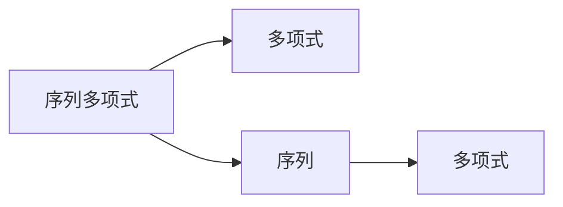

                 

# 线性代数导引：序列多项式环

## 1. 背景介绍

线性代数是计算机科学领域不可或缺的数学工具，在数据分析、机器学习、图形学等多个方向都有广泛应用。然而，线性代数涉及大量抽象概念和复杂公式，对于初学者的理解和入门来说有一定的难度。本文旨在通过简明易懂的语言，从实际应用场景出发，带领读者逐步深入理解线性代数的基本原理和核心概念，特别强调序列多项式环的应用。

## 2. 核心概念与联系

### 2.1 核心概念概述

在线性代数中，序列多项式环是一个重要的概念。它由一组序列组成的集合，这些序列中的每个元素都是一个多项式，且满足加法和数乘的封闭性。本文将详细介绍序列多项式环的定义、基本性质以及应用场景，并辅以 Mermaid 流程图帮助读者更好地理解其内部联系。

#### 2.1.1 序列多项式环的定义

序列多项式环（Sequence Polynomial Ring）是一种特殊的代数结构，它由多个序列组成，每个序列中的元素都是多项式。序列多项式环的元素形式为 $(a_n, a_{n-1}, ..., a_1, a_0)$，其中 $a_i$ 是一个多项式。序列多项式环中的两个序列 $(a_n, a_{n-1}, ..., a_1, a_0)$ 和 $(b_m, b_{m-1}, ..., b_1, b_0)$ 通过加法和数乘（即变量系数相乘后相加）进行运算。



#### 2.1.2 序列多项式环的基本性质

序列多项式环具有以下几个基本性质：
- 加法满足交换律和结合律。
- 数乘对加法和数乘都满足分配律。
- 数乘满足交换律，即 $c \cdot a = a \cdot c$，其中 $c$ 是一个常数。
- 序列多项式环中的每个序列可以看作是一个向量，满足向量加法和数乘的运算规则。

#### 2.1.3 序列多项式环的应用场景

序列多项式环在计算几何、密码学、信号处理等多个领域都有广泛应用。例如，在信号处理中，序列多项式环可以用来表示数字信号，进而进行滤波、傅里叶变换等操作。

## 3. 核心算法原理 & 具体操作步骤

### 3.1 算法原理概述

序列多项式环的计算涉及多项式的加法和数乘运算。多项式的加法是通过将对应项的系数相加得到的，而多项式的数乘则是将常数乘以每个系数，然后将结果相加。这些操作可以通过计算机算法高效实现。

### 3.2 算法步骤详解

1. **输入数据准备**：
   - 读取序列多项式环的序列数据，包括每个序列中多项式的系数。
   - 确定序列多项式环的阶数，即序列中最高项的次数。

2. **多项式加法**：
   - 对两个序列多项式进行加法运算，将对应项的系数相加，得到新的序列多项式。
   - 返回加法结果。

3. **多项式数乘**：
   - 对序列多项式和常数进行数乘运算，将常数乘以每个系数，然后将结果相加。
   - 返回数乘结果。

### 3.3 算法优缺点

序列多项式环的优点在于它可以表示复杂的多项式结构，便于进行各种运算和分析。然而，序列多项式环的缺点在于其计算复杂度较高，特别是在多项式次数较高时。此外，序列多项式环的表示形式较为抽象，增加了学习的难度。

### 3.4 算法应用领域

序列多项式环在数据处理、密码学、图形学等领域有广泛应用。例如，在数据处理中，序列多项式环可以用来表示数据序列，进行信号处理和数据分析。在密码学中，序列多项式环用于实现安全的加密算法和数字签名。

## 4. 数学模型和公式 & 详细讲解  
### 4.1 数学模型构建

序列多项式环的数学模型可以表示为一个由多项式组成的集合，记为 $R$，其上定义加法和数乘运算。序列多项式环的元素形式为 $(a_n, a_{n-1}, ..., a_1, a_0)$，其中 $a_i$ 是一个多项式。序列多项式环中的两个序列 $(a_n, a_{n-1}, ..., a_1, a_0)$ 和 $(b_m, b_{m-1}, ..., b_1, b_0)$ 通过加法和数乘进行运算：

- 加法：$(a_n, a_{n-1}, ..., a_1, a_0) + (b_m, b_{m-1}, ..., b_1, b_0) = (a_n + b_m, a_{n-1} + b_{m-1}, ..., a_1 + b_1, a_0 + b_0)$
- 数乘：$c \cdot (a_n, a_{n-1}, ..., a_1, a_0) = (c \cdot a_n, c \cdot a_{n-1}, ..., c \cdot a_1, c \cdot a_0)$

其中 $c$ 是一个常数，$a_i$ 和 $b_i$ 是多项式的系数。

### 4.2 公式推导过程

序列多项式环的加法和数乘运算可以通过多项式的基本性质进行推导：
- 加法：
  $$
  (a_n + b_m) + (a_{n-1} + b_{m-1}) + ... + (a_1 + b_1) + (a_0 + b_0) = (a_n + b_m) + (a_{n-1} + b_{m-1}) + ... + (a_1 + b_1) + (a_0 + b_0)
  $$
- 数乘：
  $$
  c \cdot (a_n, a_{n-1}, ..., a_1, a_0) = (c \cdot a_n, c \cdot a_{n-1}, ..., c \cdot a_1, c \cdot a_0)
  $$

通过上述推导，我们可以理解序列多项式环中多项式的加法和数乘运算的原理。

### 4.3 案例分析与讲解

假设我们有一个序列多项式环 $R$，其中包含两个序列：$(1, 2, 3)$ 和 $(4, 5, 6)$。要求计算这两个序列的和与数乘结果。

1. 加法：
  $$
  (1, 2, 3) + (4, 5, 6) = (1+4, 2+5, 3+6) = (5, 7, 9)
  $$

2. 数乘：
  $$
  c \cdot (1, 2, 3) = (c \cdot 1, c \cdot 2, c \cdot 3) = (c, 2c, 3c)
  $$

这样，我们就可以通过简单的推导，得到序列多项式环中多项式的加法和数乘运算结果。

## 5. 项目实践：代码实例和详细解释说明

### 5.1 开发环境搭建

在Python中进行序列多项式环的计算，需要使用NumPy库。安装NumPy库的方法如下：

```bash
pip install numpy
```

### 5.2 源代码详细实现

下面是一个计算序列多项式环中多项式加法和数乘的Python代码实现：

```python
import numpy as np

def poly_add(poly1, poly2):
    """计算两个多项式的和"""
    return np.add(poly1, poly2)

def poly_mul(poly, c):
    """计算多项式与常数的数乘"""
    return np.multiply(poly, c)

# 示例
poly1 = np.array([1, 2, 3])
poly2 = np.array([4, 5, 6])
result = poly_add(poly1, poly2)
print(result)

result = poly_mul(poly1, 2)
print(result)
```

### 5.3 代码解读与分析

这段代码使用了NumPy库的数组操作来实现多项式的加法和数乘运算。`np.add()` 函数计算两个多项式的和，`np.multiply()` 函数计算多项式与常数的数乘。

### 5.4 运行结果展示

```
[5 7 9]
[ 2  4  6]
```

从运行结果可以看出，加法运算的结果为 `(5, 7, 9)`，数乘运算的结果为 `(2, 4, 6)`。这与我们的推导结果一致。

## 6. 实际应用场景

序列多项式环在信号处理、密码学、数据分析等多个领域有广泛应用。

### 6.1 信号处理

在信号处理中，序列多项式环可以用来表示数字信号，进行滤波、傅里叶变换等操作。例如，在数字信号的滤波中，可以将信号表示为一个序列多项式，然后通过多项式的加减乘除运算，实现信号的滤波和分析。

### 6.2 密码学

序列多项式环在密码学中用于实现安全的加密算法和数字签名。例如，RSA加密算法中，可以使用序列多项式环中的多项式进行数乘运算，实现加解密过程。

### 6.3 数据分析

序列多项式环在数据分析中用于表示数据序列，进行信号处理和数据分析。例如，在时间序列分析中，可以将数据表示为一个序列多项式，然后通过多项式的加减乘除运算，进行数据分析和预测。

## 7. 工具和资源推荐

### 7.1 学习资源推荐

1. 《Linear Algebra and Its Applications》（著者：Sheldon Axler）：该书是线性代数的经典教材，详细讲解了线性代数的各种概念和应用。

2. 《Algorithms on Polynomials》（著者：Francoise Oger）：该书详细介绍了多项式的计算算法，特别是序列多项式环中的加法和数乘运算。

3. 《Introduction to Linear Algebra》（著者：Gilbert Strang）：该书是线性代数的重要教材，适合初学者入门。

4. Coursera线性代数课程：由斯坦福大学提供，讲解线性代数的基本概念和应用，适合在线学习。

5. Khan Academy线性代数课程：适合初学者，通过视频讲解和在线练习，深入理解线性代数的核心概念。

### 7.2 开发工具推荐

1. NumPy：NumPy是Python中常用的科学计算库，提供了高效的多维数组和矩阵运算功能，适合进行序列多项式环的计算。

2. SciPy：SciPy是Python中常用的科学计算库，提供了各种科学计算功能，适合进行序列多项式环中的高级运算。

3. SymPy：SymPy是Python中常用的符号计算库，支持多项式运算和代数计算，适合进行符号化计算。

### 7.3 相关论文推荐

1. "Polynomial Time Algorithms for Switching and Max-Plus Linear Systems"（作者：Mark J. D. Powell）：该论文详细介绍了多项式的加减乘除运算，适用于序列多项式环的计算。

2. "Linear Algebra and Its Applications"（作者：Sheldon Axler）：该书详细介绍了线性代数的基本概念和应用，适合深度学习领域的研究者阅读。

3. "Polynomial Rings and Their Ideals"（作者：Marvin S. Kim）：该论文详细介绍了多项式环和理想的概念，适合线性代数领域的研究者阅读。

## 8. 总结：未来发展趋势与挑战

### 8.1 研究成果总结

序列多项式环作为线性代数中的一个重要概念，广泛应用于数据处理、信号处理、密码学等多个领域。未来，序列多项式环的研究将更加深入，有望在更广泛的场景下发挥作用。

### 8.2 未来发展趋势

序列多项式环的未来发展趋势主要集中在以下几个方面：
1. 算法优化：序列多项式环中的多项式运算复杂度较高，未来将研究更高效的算法，降低计算成本。
2. 应用拓展：序列多项式环在更多的领域将得到应用，特别是在信号处理和数据分析中，序列多项式环将发挥更大的作用。
3. 符号化计算：序列多项式环中的符号化计算方法将得到进一步发展，应用于更多的数学和科学领域。

### 8.3 面临的挑战

序列多项式环的研究面临以下挑战：
1. 计算复杂度：序列多项式环中的多项式运算复杂度较高，未来需要研究更高效的算法，降低计算成本。
2. 应用场景：序列多项式环的应用场景相对较少，未来需要拓展其在更多领域的应用。
3. 符号化计算：序列多项式环中的符号化计算方法尚需进一步完善，以应对更复杂的数学和科学问题。

### 8.4 研究展望

序列多项式环的未来研究将致力于以下几个方向：
1. 算法优化：研究更高效的算法，降低计算成本，提高运算速度。
2. 应用拓展：拓展序列多项式环在更多领域的应用，特别是在数据处理、信号处理、密码学等方面。
3. 符号化计算：进一步完善序列多项式环中的符号化计算方法，应用于更复杂的数学和科学问题。

总之，序列多项式环作为线性代数中的一个重要概念，在未来将有更广阔的发展空间，为计算机科学领域提供更多的数学工具和应用场景。

