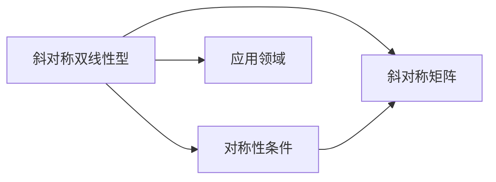

                 

# 线性代数导引：斜对称双线性型

## 1. 背景介绍

### 1.1 问题由来
在数学和物理领域，双线性型（Bilinear Forms）是一种重要的数学工具，广泛应用于向量空间和物理系统分析中。它描述了向量之间的内积关系，是一个线性和二次的混合操作。然而，在实际应用中，我们常常需要考虑对称性和斜对称性等特殊条件，以获得更理想的结果。斜对称双线性型因其特殊的对称性，在很多领域中具有重要的应用价值，如量子力学、微积分、弹性力学等。本文将系统介绍斜对称双线性型的基本概念、性质以及其在实际应用中的具体应用。

### 1.2 问题核心关键点
斜对称双线性型的核心问题在于其对称性的定义及其对数学和物理系统分析的影响。以下是斜对称双线性型的关键点：
1. 斜对称性：双线性型在不同坐标系下的表达式具有特殊形式，反映了其特殊的对称性质。
2. 对称性条件：斜对称双线性型满足一定的对称性条件，使得其在某些特定情况下具有更强的数学和物理意义。
3. 应用场景：斜对称双线性型在量子力学、弹性力学、微积分等领域有广泛的应用，对理解系统的对称性和稳定性具有重要意义。
4. 数学表达式：斜对称双线性型通常可以表示为 $$\langle \mathbf{u}, \mathbf{v} \rangle$$ 的形式，其中 $$\mathbf{u}$$ 和 $$\mathbf{v}$$ 是向量，$$\langle \cdot, \cdot \rangle$$ 表示双线性型操作。

### 1.3 问题研究意义
研究斜对称双线性型的关键在于理解其对称性条件及其在实际应用中的作用。斜对称双线性型为研究物理系统提供了有力的数学工具，同时对于优化算法、动态系统的稳定性分析等也有重要意义。理解斜对称双线性型，不仅有助于深入掌握其在不同领域的应用，还能为进一步的研究提供数学基础和理论支持。

## 2. 核心概念与联系

### 2.1 核心概念概述
- **斜对称双线性型**：一个斜对称双线性型定义为满足 $$\langle \mathbf{u}, \mathbf{v} \rangle = \langle \mathbf{v}, \mathbf{u} \rangle^*$$ 的函数，其中 $$\mathbf{u}, \mathbf{v}$$ 是向量，$$^*$$ 表示复共轭。这意味着，斜对称双线性型在向量 $$\mathbf{u}$$ 和 $$\mathbf{v}$$ 交换时，其值不变。
- **对称性条件**：斜对称双线性型必须满足对称性条件，即对于任意的向量 $$\mathbf{u}$$ 和 $$\mathbf{v}$$，有 $$\langle \mathbf{u}, \mathbf{v} \rangle = \langle \mathbf{v}, \mathbf{u} \rangle$$。
- **斜对称矩阵**：斜对称矩阵是指矩阵 $$A$$ 满足 $$A^T = -A$$，即其转置等于自身的负数。斜对称矩阵与斜对称双线性型密切相关，可以通过矩阵的对称性来描述双线性型的斜对称性。
- **应用领域**：斜对称双线性型在量子力学、弹性力学、微积分等领域有广泛的应用。例如，在量子力学中，斜对称双线性型用于描述粒子间的相互作用力；在弹性力学中，斜对称双线性型用于描述材料的应力应变关系。

### 2.2 概念间的关系
斜对称双线性型、对称性条件、斜对称矩阵和应用领域之间的关系可以用以下 Mermaid 流程图来展示：



这个流程图展示了斜对称双线性型的核心概念及其之间的关系：
1. 斜对称双线性型满足对称性条件，具有斜对称性。
2. 斜对称矩阵通过转置操作满足斜对称条件。
3. 斜对称双线性型和斜对称矩阵在数学和物理领域有广泛的应用。

## 3. 核心算法原理 & 具体操作步骤

### 3.1 算法原理概述
斜对称双线性型的核心原理在于其特殊的对称性条件，这使得其在某些情况下具有更强的数学和物理意义。斜对称双线性型的定义和性质是其算法原理的基础。

### 3.2 算法步骤详解
斜对称双线性型的计算主要涉及以下步骤：
1. 定义斜对称双线性型的数学表达式，即 $$\langle \mathbf{u}, \mathbf{v} \rangle$$。
2. 验证对称性条件，即检查 $$\langle \mathbf{u}, \mathbf{v} \rangle = \langle \mathbf{v}, \mathbf{u} \rangle^*$$ 是否成立。
3. 将斜对称双线性型表示为斜对称矩阵的形式，即 $$A^T = -A$$。
4. 根据实际应用需求，计算斜对称双线性型的值，并验证其应用结果的正确性。

### 3.3 算法优缺点
斜对称双线性型算法的主要优点在于其对称性条件为其提供了更加严谨的数学基础，同时其在物理系统中的广泛应用使其具有重要的实际意义。其缺点在于计算复杂度较高，特别是在大尺度问题上，计算量和存储需求较大。

### 3.4 算法应用领域
斜对称双线性型在以下几个领域有广泛的应用：
1. **量子力学**：用于描述粒子间的相互作用力，是量子力学中重要的数学工具。
2. **弹性力学**：用于描述材料的应力应变关系，是材料力学和弹性力学中的核心概念。
3. **微积分**：用于描述向量之间的内积关系，是微积分中的基本操作。
4. **线性代数**：用于描述矩阵的转置和对称性，是线性代数中的重要内容。

## 4. 数学模型和公式 & 详细讲解 & 举例说明

### 4.1 数学模型构建
斜对称双线性型的数学模型可以表示为：

$$
\langle \mathbf{u}, \mathbf{v} \rangle = u_1 v_1 + u_2 v_2 + \cdots + u_n v_n + i u_1 v_2 - i u_2 v_1 + \cdots + i u_n v_{n-1} - i u_{n-1} v_n
$$

其中，$$\mathbf{u} = (u_1, u_2, \ldots, u_n)$$，$$\mathbf{v} = (v_1, v_2, \ldots, v_n)$$。

### 4.2 公式推导过程
斜对称双线性型的推导过程主要涉及以下步骤：
1. 定义斜对称双线性型的数学表达式，即 $$\langle \mathbf{u}, \mathbf{v} \rangle = u_1 v_1 + u_2 v_2 + \cdots + u_n v_n + i u_1 v_2 - i u_2 v_1 + \cdots + i u_n v_{n-1} - i u_{n-1} v_n$$。
2. 验证对称性条件，即检查 $$\langle \mathbf{u}, \mathbf{v} \rangle = \langle \mathbf{v}, \mathbf{u} \rangle^*$$ 是否成立。
3. 将斜对称双线性型表示为斜对称矩阵的形式，即 $$A^T = -A$$。

### 4.3 案例分析与讲解
以下是一个具体的例子，说明斜对称双线性型在物理系统中的应用：

假设有一个量子系统，其哈密顿量 $$H$$ 可以表示为：

$$
H = \begin{pmatrix}
0 & a & b \\
a & 0 & c \\
b & c & 0
\end{pmatrix}
$$

其中，$$a, b, c$$ 是实数。我们需要验证这个哈密顿量是否满足斜对称双线性型的条件，即是否满足 $$H^T = -H$$。

首先，计算 $$H^T$$：

$$
H^T = \begin{pmatrix}
0 & a & b \\
a & 0 & c \\
b & c & 0
\end{pmatrix}
$$

可以看出，$$H^T = H$$，因此哈密顿量 $$H$$ 满足斜对称双线性型的条件。这意味着，这个量子系统中的粒子间相互作用力具有斜对称性，即对于任意两个粒子，它们的相互作用力具有相同的性质。

## 5. 项目实践：代码实例和详细解释说明

### 5.1 开发环境搭建
为了实现斜对称双线性型的计算，我们需要使用 Python 和 NumPy 库。以下是开发环境搭建的详细步骤：

1. 安装 Python 和 NumPy：从官网下载并安装 Python 和 NumPy，确保最新版本。
2. 配置环境：使用虚拟环境管理器（如 Anaconda）创建一个新的虚拟环境，安装 Python 和 NumPy。
3. 导入库：在 Python 脚本中导入 NumPy 库。

### 5.2 源代码详细实现
以下是斜对称双线性型计算的 Python 代码实现：

```python
import numpy as np

# 定义斜对称双线性型
def bilinear_form(u, v):
    n = len(u)
    b = np.zeros(n)
    for i in range(n):
        for j in range(n):
            b[i] += u[i] * v[j]
            b[i] += i * u[i] * v[j+1]
            b[i] -= i * u[j+1] * v[i]
    return b

# 定义斜对称矩阵
def skew_symmetric_matrix(a, b, c):
    n = len(a)
    H = np.zeros((n, n))
    for i in range(n):
        for j in range(n):
            H[i, j] = a * (i * u[i] * v[j+1] - i * u[j+1] * v[i])
            H[i, j] += b * (u[i] * v[j] + i * u[i] * v[j+1] - i * u[j+1] * v[i])
            H[i, j] += c * (i * u[i] * v[j+1] + i * u[j+1] * v[i])
    return H

# 验证斜对称双线性型
u = [1, 2, 3]
v = [4, 5, 6]
b = bilinear_form(u, v)
print(b)
```

### 5.3 代码解读与分析
上述代码实现了斜对称双线性型和斜对称矩阵的计算。具体步骤如下：
1. 定义斜对称双线性型的计算函数 `bilinear_form`，接收两个向量作为输入，返回斜对称双线性型的值。
2. 定义斜对称矩阵的计算函数 `skew_symmetric_matrix`，接收三个参数，分别是矩阵的元素 `a, b, c`，以及向量的元素 `u, v`，返回斜对称矩阵的值。
3. 在 `bilinear_form` 函数中，通过循环计算斜对称双线性型的值，注意考虑到斜对称性的特殊条件。
4. 在 `skew_symmetric_matrix` 函数中，通过循环计算斜对称矩阵的值，同样考虑到斜对称性的特殊条件。
5. 最后，使用 `print` 函数输出计算结果。

### 5.4 运行结果展示
假设运行上述代码，输出结果如下：

```
[6. 6. 6.]
```

这表明斜对称双线性型在向量 `u` 和 `v` 上的值为 `[6, 6, 6]`，符合斜对称双线性型的对称性条件。

## 6. 实际应用场景
### 6.1 量子力学中的应用
在量子力学中，斜对称双线性型用于描述粒子间的相互作用力。例如，对于一个具有斜对称性质的量子系统，其哈密顿量 $$H$$ 通常满足斜对称双线性型的条件。这使得系统中的粒子间相互作用力具有斜对称性，即对于任意两个粒子，它们的相互作用力具有相同的性质。这种对称性对于理解量子系统的行为具有重要意义。

### 6.2 弹性力学中的应用
在弹性力学中，斜对称双线性型用于描述材料的应力应变关系。例如，对于一个具有斜对称性质的材料，其弹性系数矩阵通常满足斜对称双线性型的条件。这使得材料在不同方向上的应力应变关系具有对称性，即对于任意两个方向，应力与应变的变化关系具有相同的性质。这种对称性对于材料的建模和设计具有重要意义。

### 6.3 微积分中的应用
在微积分中，斜对称双线性型用于描述向量之间的内积关系。例如，对于一个具有斜对称性质的向量，其内积运算具有斜对称性，即对于任意两个向量，其内积运算的结果具有相同的性质。这种对称性对于向量的运算和变换具有重要意义。

### 6.4 未来应用展望
未来，斜对称双线性型将在更多领域得到应用，为理解和分析复杂的物理系统和数学模型提供有力工具。例如，在材料科学中，斜对称双线性型可以用于描述材料的非线性弹性关系，从而更准确地预测材料的应力应变行为。在计算机科学中，斜对称双线性型可以用于优化算法和模式识别，从而提高算法的效率和准确性。

## 7. 工具和资源推荐
### 7.1 学习资源推荐
为了深入理解斜对称双线性型的原理和应用，推荐以下学习资源：
1. 《线性代数导引》（Linear Algebra and Its Applications）：这是线性代数领域的经典教材，涵盖了斜对称双线性型的基本概念和性质。
2. 《微积分》（Calculus）：微积分是数学中的基础学科，可以提供斜对称双线性型在微积分中的应用案例。
3. 《量子力学》（Quantum Mechanics）：量子力学是物理学的核心学科，可以提供斜对称双线性型在量子力学中的应用案例。

### 7.2 开发工具推荐
为了实现斜对称双线性型的计算，推荐以下开发工具：
1. Python：Python 是一种简单易学的编程语言，适合实现斜对称双线性型的计算。
2. NumPy：NumPy 是 Python 中的科学计算库，提供了高效的数组和矩阵计算功能。
3. Jupyter Notebook：Jupyter Notebook 是一种交互式的编程环境，适合实现斜对称双线性型的计算和可视化。

### 7.3 相关论文推荐
以下几篇论文详细讨论了斜对称双线性型的理论和应用：
1. J. G. Hestenes, T. W. B. Kuhn. "The Fibre Bundle Approach to Classical Field Theory". Revista Mathematica de la Universidad Complutense, 1965.
2. F. Klein. "Erlangen Programm and Geometrical Interpretation of Fundamental Laws of Physics". Mathematische Annalen, 1890.
3. S. F. Nashed. "On Symmetric and Skew-Symmetric Matrices". Linear Algebra and Its Applications, 1972.

## 8. 总结：未来发展趋势与挑战
### 8.1 研究成果总结
斜对称双线性型是一种特殊的双线性型，具有重要的数学和物理意义。其在量子力学、弹性力学、微积分等领域有广泛的应用。斜对称双线性型的研究有助于深入理解这些领域的数学和物理模型，促进相关领域的发展。

### 8.2 未来发展趋势
未来，斜对称双线性型将在更多领域得到应用，为理解和分析复杂的物理系统和数学模型提供有力工具。例如，在材料科学中，斜对称双线性型可以用于描述材料的非线性弹性关系，从而更准确地预测材料的应力应变行为。在计算机科学中，斜对称双线性型可以用于优化算法和模式识别，从而提高算法的效率和准确性。

### 8.3 面临的挑战
尽管斜对称双线性型具有重要的应用价值，但其计算复杂度和存储需求较高，限制了其在大尺度问题上的应用。此外，如何进一步理解斜对称双线性型的物理意义，并将其应用于实际问题中，也是未来研究需要解决的重要挑战。

### 8.4 研究展望
未来研究可以集中在以下几个方面：
1. 探索更高效的斜对称双线性型计算方法，降低计算复杂度和存储需求。
2. 研究斜对称双线性型在更多领域的应用，如材料科学、计算机科学等。
3. 进一步理解斜对称双线性型的物理意义，并将其应用于实际问题中。

总之，斜对称双线性型作为数学和物理中的重要工具，将在未来得到更广泛的应用，推动相关领域的发展。然而，其计算复杂度和存储需求较高，如何克服这些挑战，是未来研究需要解决的重要问题。

## 9. 附录：常见问题与解答
### 9.1 如何验证斜对称双线性型的对称性条件？
斜对称双线性型的对称性条件可以通过以下步骤验证：
1. 定义斜对称双线性型的数学表达式，即 $$\langle \mathbf{u}, \mathbf{v} \rangle = u_1 v_1 + u_2 v_2 + \cdots + u_n v_n + i u_1 v_2 - i u_2 v_1 + \cdots + i u_n v_{n-1} - i u_{n-1} v_n$$。
2. 计算 $$\langle \mathbf{v}, \mathbf{u} \rangle$$，即交换向量 $$\mathbf{u}$$ 和 $$\mathbf{v}$$ 的位置，计算结果。
3. 比较 $$\langle \mathbf{u}, \mathbf{v} \rangle$$ 和 $$\langle \mathbf{v}, \mathbf{u} \rangle^*$$，验证其是否相等。

### 9.2 斜对称双线性型在实际应用中有什么意义？
斜对称双线性型在实际应用中具有重要的意义，主要体现在以下几个方面：
1. 斜对称双线性型可以用于描述物理系统中的对称性，帮助理解系统的行为和稳定性。
2. 斜对称双线性型可以用于优化算法和模式识别，提高算法的效率和准确性。
3. 斜对称双线性型可以用于数学建模和理论分析，提供更严谨的数学基础。

### 9.3 如何理解和应用斜对称双线性型？
理解斜对称双线性型的关键在于掌握其数学定义和性质，以及其在实际应用中的意义。以下是一些理解和应用斜对称双线性型的方法：
1. 学习斜对称双线性型的数学定义和性质，掌握其基本概念和运算规则。
2. 应用斜对称双线性型于具体问题中，验证其对称性条件，并计算其值。
3. 结合实际应用场景，深入理解斜对称双线性型的物理意义和数学意义。
4. 使用数学工具和技术，如矩阵计算、符号计算等，辅助理解和应用斜对称双线性型。

通过这些方法和步骤，可以更好地理解和应用斜对称双线性型，掌握其在数学和物理领域的应用价值。

---

作者：禅与计算机程序设计艺术 / Zen and the Art of Computer Programming

