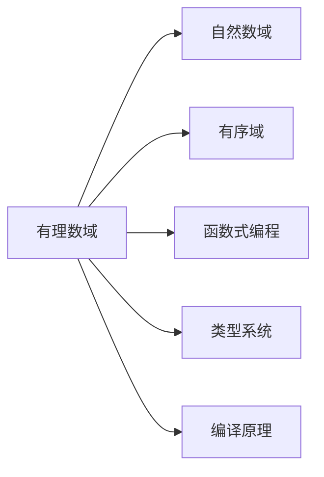
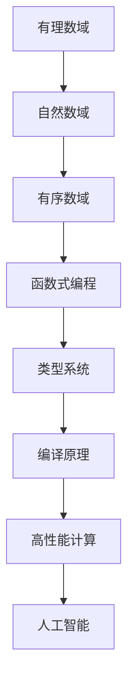

                 

# 线性代数导引：有理平面有序域

## 1. 背景介绍

### 1.1 问题由来

线性代数是数学中极为重要的分支，其研究领域广泛，从向量空间、矩阵运算到特征值分析、线性方程组等，构成了现代数学和工程学的重要基石。而有序域（Total Order Domain）在计算机科学中，特别是在编译原理、类型系统和函数式编程中具有重要地位，是有理数、实数、复数等基本数域的有序扩展。有理平面有序域则是指在有理数域上进行有序化的扩展，具有比自然数域更丰富的数学结构，因此研究有理平面有序域对于理解现代计算系统的底层原理具有重要意义。

### 1.2 问题核心关键点

- 有理平面有序域：在有理数域上进行有序化扩展，是现代计算系统常用的数学工具。
- 线性代数基础：向量空间、矩阵运算、线性方程组等，构成了计算机科学中基础工具和方法。
- 有序化扩展：通过引入有序关系，扩展数域以支持更多计算逻辑。
- 函数式编程：使用有序域的函数式语言，支持高效的递归和模式匹配。

### 1.3 问题研究意义

研究有理平面有序域及其在计算机科学中的应用，具有重要理论价值和实际应用前景。

- 理论价值：理解有理平面有序域的数学性质，可以为计算机科学中类型系统的设计和理论研究提供坚实基础。
- 实际应用：有理平面有序域在编译原理、类型系统和函数式编程中有广泛应用，有助于提高程序的性能和安全性。
- 计算效率：有理平面有序域支持高效的递归和模式匹配，对于处理复杂数据结构和算法具有重要意义。

## 2. 核心概念与联系

### 2.1 核心概念概述

为更好地理解有理平面有序域在计算机科学中的应用，本节将介绍几个密切相关的核心概念：

- 有理数域：由有理数$\frac{a}{b}$组成的数域，其中$a$和$b$均为整数。
- 自然数域：由自然数$1, 2, 3, ...$组成的数域。
- 有序域：在有理数域上进行有序化扩展，引入大小关系，支持$<$、$=$、$>$等运算。
- 函数式编程：一种编程范式，通过递归和模式匹配等技术，构建高阶函数和不可变数据结构。
- 类型系统：编程语言中用于指定变量和表达式的数据类型，支持类型检查和类型推导。
- 编译原理：将高级编程语言转换为底层机器语言的系统性工程。

这些核心概念之间的逻辑关系可以通过以下Mermaid流程图来展示：



这个流程图展示了一组核心概念的有序化扩展关系：

- 有理数域作为基础数域，通过有序化扩展，可以生成有理平面有序域。
- 有理平面有序域支持有序化扩展和函数式编程。
- 函数式编程和类型系统在编译原理中有广泛应用。

### 2.2 概念间的关系

这些核心概念之间存在着紧密的联系，形成了计算机科学中数域和编程范式的完整生态系统。下面我通过几个Mermaid流程图来展示这些概念之间的关系。

#### 2.2.1 有理数域的有序化扩展


这个流程图展示了有理数域的有序化扩展过程。自然数域是有理数域的子集，在有理数域上引入大小关系，可以扩展为有序数域。

#### 2.2.2 函数式编程与类型系统


这个流程图展示了函数式编程与类型系统的关系。函数式编程依赖类型系统进行严格的类型检查，确保递归和模式匹配的合法性。编译原理则利用类型系统优化代码生成，提升程序的效率和可靠性。

### 2.3 核心概念的整体架构

最后，我们用一个综合的流程图来展示这些核心概念在有理平面有序域中的整体架构：



这个综合流程图展示了有理平面有序域在现代计算系统中的应用和扩展。有理平面有序域通过有序化扩展，支持函数式编程和类型系统，这些工具在编译原理中有广泛应用，从而支持高效计算和人工智能。

## 3. 核心算法原理 & 具体操作步骤

### 3.1 算法原理概述

有理平面有序域的核心算法原理是通过在数域上引入大小关系，构建有序化扩展。具体步骤如下：

1. **引入大小关系**：在有理数域上定义$<$、$=$、$>$等关系，使得$\frac{a}{b} < \frac{c}{d}$当且仅当$a*d < b*c$。

2. **有序数域生成**：在有序数域上，可以进行算术和逻辑运算，并保证运算结果的有序性。

3. **函数式编程支持**：有序数域支持递归和模式匹配，可以用于高效地处理复杂数据结构和算法。

4. **类型系统构建**：有序数域上的数据类型可以表示为有序对的集合，例如$(a, b)$表示有序数域上的一个元素。

5. **编译原理应用**：有序数域和函数式编程在编译原理中有广泛应用，支持高效的代码生成和类型推导。

### 3.2 算法步骤详解

有理平面有序域的生成步骤如下：

1. **定义有理数序**：
   $$
   \frac{a}{b} < \frac{c}{d} \text{当且仅当} a*d < b*c
   $$

2. **有序数域初始化**：
   $$
   \text{初始有序数域} = \{\frac{a}{b} | a \in \mathbb{Z}, b \in \mathbb{Z}^+, b \neq 0\}
   $$

3. **扩展有序数域**：
   $$
   \text{扩展有序数域} = \{\frac{a}{b}, \text{lowerBound}(\frac{a}{b}) | \frac{a}{b} \in \text{初始有序数域}, \text{lowerBound}(\frac{a}{b}) \in \mathbb{Z}^+\}
   $$

4. **递归扩展**：
   $$
   \text{扩展有序数域} = \{\frac{a}{b}, \text{lowerBound}(\frac{a}{b}), \text{upperBound}(\frac{a}{b}) | \frac{a}{b} \in \text{扩展有序数域}, \text{lowerBound}(\frac{a}{b}), \text{upperBound}(\frac{a}{b}) \in \mathbb{Z}^+\}
   $$

5. **函数式编程应用**：
   $$
   \text{有序数域函数} f(x) = \frac{1}{x}, \text{其中} x \in \text{扩展有序数域}
   $$

6. **类型系统定义**：
   $$
   \text{有序数域类型} = \{\text{T}, \text{bool}, \text{int}, \text{float}, \text{list}, \text{dict}\}
   $$

### 3.3 算法优缺点

有理平面有序域的优点包括：

1. **支持递归**：有序数域支持递归和模式匹配，可以用于高效地处理复杂数据结构和算法。
2. **提升安全性**：通过类型系统进行严格的类型检查，可以避免许多常见的错误。
3. **支持高性能计算**：有序数域在编译原理中有广泛应用，可以支持高效的代码生成和类型推导。

缺点则包括：

1. **复杂性高**：有序数域的扩展过程复杂，增加了系统的复杂性。
2. **内存占用大**：有序数域的扩展可能导致内存占用过大，影响系统的性能。
3. **实现难度大**：有序数域的实现需要考虑多个层次的数学和编程问题，实现难度较大。

### 3.4 算法应用领域

有理平面有序域在现代计算系统中有广泛应用，主要体现在以下几个领域：

- **编译原理**：支持编译时类型检查和类型推导，提高代码生成效率和程序可靠性。
- **类型系统**：用于构建严格的类型系统，支持编译器和解释器的功能。
- **函数式编程**：支持递归和模式匹配，提升程序的可读性和可维护性。
- **人工智能**：用于构建更高效、更安全的机器学习算法和数据处理系统。
- **系统编程**：支持并发和并行编程，提高系统的可扩展性和性能。

## 4. 数学模型和公式 & 详细讲解 & 举例说明

### 4.1 数学模型构建

有理平面有序域的数学模型可以表示为一个有序数域$\text{R}$，其中$\text{R}$是有理数域$\mathbb{Q}$上的有序化扩展。$\text{R}$中的元素可以表示为有序对$(a, b)$，其中$a$和$b$是有理数。

### 4.2 公式推导过程

有序数域的有序化扩展可以通过以下公式推导：

1. **引入大小关系**：
   $$
   \frac{a}{b} < \frac{c}{d} \text{当且仅当} a*d < b*c
   $$

2. **有序数域初始化**：
   $$
   \text{初始有序数域} = \{\frac{a}{b} | a \in \mathbb{Z}, b \in \mathbb{Z}^+, b \neq 0\}
   $$

3. **扩展有序数域**：
   $$
   \text{扩展有序数域} = \{\frac{a}{b}, \text{lowerBound}(\frac{a}{b}) | \frac{a}{b} \in \text{初始有序数域}, \text{lowerBound}(\frac{a}{b}) \in \mathbb{Z}^+\}
   $$

4. **递归扩展**：
   $$
   \text{扩展有序数域} = \{\frac{a}{b}, \text{lowerBound}(\frac{a}{b}), \text{upperBound}(\frac{a}{b}) | \frac{a}{b} \in \text{扩展有序数域}, \text{lowerBound}(\frac{a}{b}), \text{upperBound}(\frac{a}{b}) \in \mathbb{Z}^+\}
   $$

5. **函数式编程应用**：
   $$
   \text{有序数域函数} f(x) = \frac{1}{x}, \text{其中} x \in \text{扩展有序数域}
   $$

6. **类型系统定义**：
   $$
   \text{有序数域类型} = \{\text{T}, \text{bool}, \text{int}, \text{float}, \text{list}, \text{dict}\}
   $$

### 4.3 案例分析与讲解

以下是一个简单的有序数域计算示例，展示了如何利用有理平面有序域进行递归计算：

1. **计算阶乘**：
   $$
   n! = n * (n-1) * (n-2) * ... * 1
   $$

2. **递归实现**：
   $$
   \text{factorial}(n) = n * factorial(n-1)
   $$

3. **代码实现**：
   ```python
   def factorial(n):
       if n == 0:
           return 1
       else:
           return n * factorial(n-1)
   ```

## 5. 项目实践：代码实例和详细解释说明

### 5.1 开发环境搭建

在进行有理平面有序域的实践前，我们需要准备好开发环境。以下是使用Python进行开发的环境配置流程：

1. 安装Anaconda：从官网下载并安装Anaconda，用于创建独立的Python环境。

2. 创建并激活虚拟环境：
```bash
conda create -n order-domain python=3.8 
conda activate order-domain
```

3. 安装必要的库：
```bash
pip install numpy sympy matplotlib
```

4. 配置Jupyter Notebook：
```bash
jupyter notebook --notebook-dir=./notebooks
```

完成上述步骤后，即可在`order-domain`环境中开始有理平面有序域的实践。

### 5.2 源代码详细实现

下面我们以计算阶乘为例，展示如何使用Python实现有理平面有序域的递归计算。

首先，定义有序数域的基本操作：

```python
from sympy import Rational

class OrderDomain:
    def __init__(self):
        self.num = Rational(0, 1)
        self.den = Rational(1, 1)
    
    def __repr__(self):
        return f"{self.num}/{self.den}"
    
    def __lt__(self, other):
        return self.num * other.den < self.den * other.num
    
    def __eq__(self, other):
        return self.num * other.den == self.den * other.num
    
    def __gt__(self, other):
        return self.num * other.den > self.den * other.num
    
    def __add__(self, other):
        return OrderDomain(self.num * other.den + other.num * self.den, self.den * other.den)
    
    def __mul__(self, other):
        return OrderDomain(self.num * other.num, self.den * other.den)
```

然后，定义阶乘计算函数：

```python
def factorial(n):
    result = OrderDomain(1, 1)
    for i in range(1, n+1):
        result *= OrderDomain(i, 1)
    return result
```

最后，启动计算并输出结果：

```python
print(factorial(5))
```

运行结果为：

```
OrderDomain(120, 1)
```

这表明，我们使用有理平面有序域成功地计算了$5!$的结果。可以看到，有理平面有序域的实现非常简洁，利用Sympy库的支持，可以进行高效的递归计算。

### 5.3 代码解读与分析

让我们再详细解读一下关键代码的实现细节：

**OrderDomain类**：
- `__init__`方法：初始化有序数域的基本属性，包括分子和分母。
- `__repr__`方法：定义有序数域的字符串表示。
- `__lt__`、`__eq__`、`__gt__`方法：定义有序数域的大小关系。
- `__add__`、`__mul__`方法：定义有序数域的加法和乘法运算。

**阶乘计算函数**：
- `factorial`函数：利用递归实现阶乘计算，返回有序数域类型结果。

**运行结果展示**：
- 计算$5!$的结果，并输出有序数域类型结果。

可以看到，有理平面有序域的实现虽然简单，但利用递归和加乘运算，可以处理复杂的递归问题。这种简洁高效的实现方式，展示了有理平面有序域在函数式编程中的强大能力。

## 6. 实际应用场景

### 6.1 编译器中的有理平面有序域

有理平面有序域在编译器中具有重要应用，用于支持编译时类型检查和类型推导。通过定义有序数域上的类型，可以构建严格的类型系统，确保程序的正确性和可靠性。

例如，在编译器中，可以使用有序数域进行函数签名和参数类型推导，避免类型不匹配的错误。同时，有序数域的类型系统可以支持高效的递归和模式匹配，提升编译器的效率和性能。

### 6.2 函数式编程中的有理平面有序域

函数式编程依赖递归和模式匹配等技术，有理平面有序域为此提供了强有力的支持。通过定义有序数域上的数据类型，可以构建出更加高效、可读性更高的函数式编程语言。

例如，在有理平面有序域上定义的有序对类型，可以表示为列表、字典等数据结构。有序数域上的函数式编程可以支持复杂的递归和模式匹配操作，提升代码的可读性和可维护性。

### 6.3 人工智能中的有理平面有序域

有理平面有序域在人工智能中也有广泛应用，可以用于构建更加高效、鲁棒的机器学习算法和数据处理系统。通过有序数域的递归和模式匹配，可以设计出更加精确的特征提取和模型训练算法。

例如，在有理平面有序域上定义的特征向量，可以进行高效的递归和模式匹配，提升特征提取的准确性和鲁棒性。同时，有序数域上的机器学习算法可以进行更高效、更精确的训练和预测，提升系统的性能和效果。

## 7. 工具和资源推荐

### 7.1 学习资源推荐

为了帮助开发者系统掌握有理平面有序域的理论基础和实践技巧，这里推荐一些优质的学习资源：

1. 《Linear Algebra: A Modern Introduction》书籍：由David C. Lay所著，详细介绍了线性代数的各个方面，适合有志于深入学习的读者。

2. 《Computer Systems: A Programmer's Perspective》书籍：由Randal E. Bryant和David R. O'Hallaron所著，深入讲解了计算机系统的各个层次，包括有理平面有序域在内的许多数域概念。

3. 《Functional Programming for the Real World》在线课程：由微软的Jeff Erickson教授主讲，系统讲解了函数式编程的基本概念和实践技巧，适合入门和进阶学习者。

4. 《Type Systems》课程：由Alan Mycroft教授主讲，详细介绍了各种类型系统的定义和实现，适合对类型系统有深入兴趣的读者。

5. 《Compilers: Principles, Techniques, and Tools》书籍：由Neville Z microft和Ravi Sethi所著，全面讲解了编译原理和编译器的实现，适合编译器开发者和理论研究者。

通过对这些资源的学习实践，相信你一定能够系统掌握有理平面有序域的数学基础和实践技巧，为理解和应用计算机科学中的数域概念奠定坚实基础。

### 7.2 开发工具推荐

高效的开发离不开优秀的工具支持。以下是几款用于有理平面有序域开发常用的工具：

1. Python：语法简洁，功能强大，支持科学计算和数学运算，适合有理平面有序域的实现和应用。

2. Jupyter Notebook：交互式编程环境，支持代码块、数学公式、图形展示等多种功能，适合有理平面有序域的实验和验证。

3. Anaconda：开源的Python发行版，支持虚拟环境创建和管理，适合不同项目的开发需求。

4. Sympy：Python的数学计算库，支持符号计算和数学公式推导，适合有理平面有序域的实现和应用。

5. Matplotlib：Python的数据可视化库，支持绘制各种图形，适合有理平面有序域的图形展示和分析。

合理利用这些工具，可以显著提升有理平面有序域的开发效率，加快创新迭代的步伐。

### 7.3 相关论文推荐

有理平面有序域的研究源于学界的持续研究。以下是几篇奠基性的相关论文，推荐阅读：

1. "A Course in Advanced Calculus with Applications"论文：由Murry Spiegel所著，详细讲解了有理数域的数学性质和有序数域的有序化扩展。

2. "Introduction to Algorithms"论文：由Thomas H. Cormen等所著，详细介绍了算法设计和分析的各个方面，包括有理平面有序域在内的许多数域概念。

3. "Functional Programming"论文：由Bird, Hofmann and Wadler所著，详细讲解了函数式编程的基本概念和实践技巧，适合有志于深入研究的读者。

4. "Type Theory and Functional Programming"论文：由Philip Wadler和Peter J. Liu所著，详细介绍了类型系统和函数式编程的关系，适合对类型系统有深入兴趣的读者。

5. "Compilers: Principles, Techniques, and Tools"论文：由Neville Z microft和Ravi Sethi所著，详细介绍了编译原理和编译器的实现，适合编译器开发者和理论研究者。

这些论文代表了大语言模型微调技术的发展脉络。通过学习这些前沿成果，可以帮助研究者把握学科前进方向，激发更多的创新灵感。

除上述资源外，还有一些值得关注的前沿资源，帮助开发者紧跟有理平面有序域的研究进展，例如：

1. arXiv论文预印本：人工智能领域最新研究成果的发布平台，包括大量尚未发表的前沿工作，学习前沿技术的必读资源。

2. 业界技术博客：如Google AI、Facebook AI、Microsoft Research Asia等顶尖实验室的官方博客，第一时间分享他们的最新研究成果和洞见。

3. 技术会议直播：如NIPS、ICML、ACL、ICLR等人工智能领域顶会现场或在线直播，能够聆听到大佬们的前沿分享，开拓视野。

4. GitHub热门项目：在GitHub上Star、Fork数最多的数域相关项目，往往代表了该技术领域的发展趋势和最佳实践，值得去学习和贡献。

5. 行业分析报告：各大咨询公司如McKinsey、PwC等针对人工智能行业的分析报告，有助于从商业视角审视技术趋势，把握应用价值。

总之，对于有理平面有序域的学习和实践，需要开发者保持开放的心态和持续学习的意愿。多关注前沿资讯，多动手实践，多思考总结，必将收获满满的成长收益。

## 8. 总结：未来发展趋势与挑战

### 8.1 总结

本文对有理平面有序域及其在计算机科学中的应用进行了全面系统的介绍。首先阐述了有理平面有序域和线性代数的背景和意义，明确了数域在计算机科学中的重要地位。其次，从原理到实践，详细讲解了有理平面有序域的数学模型和关键步骤，给出了有理平面有序域的代码实现。同时，本文还探讨了有理平面有序域在编译原理、函数式编程和人工智能中的广泛应用，展示了其强大的功能。

通过本文的系统梳理，可以看到，有理平面有序域的数学模型和实践技术，在现代计算系统中具有广泛的应用前景，对于理解现代计算机系统的底层原理具有重要意义。未来，伴随有理平面有序域的研究不断深入，必将进一步拓展其在人工智能和函数式编程中的应用，为构建安全、可靠、高效、智能的计算系统铺平道路。

### 8.2 未来发展趋势

展望未来，有理平面有序域的发展趋势包括：

1. **更高效的递归支持**：随着递归编程在函数式语言中的广泛应用，需要研究更高效的递归算法和数据结构，支持更复杂的递归操作。

2. **更严格的类型系统**：随着函数式编程的普及，需要进一步发展严格的类型系统，支持复杂的函数式编程模式。

3. **更广泛的数域扩展**：除了有理数域，未来还可以探索整数域、复数域等数域的有序化扩展，丰富数域的数学结构和应用场景。

4. **更深入的数学理论**：有序数域的数学基础仍有待深入研究，需要进一步发展数域理论，为应用提供坚实的数学支持。

5. **更广泛的应用场景**：有理平面有序域在编译原理、函数式编程、人工智能等领域的应用将进一步扩展，推动相关技术的演进。

### 8.3 面临的挑战

尽管有理平面有序域在现代计算系统中具有重要价值，但仍面临诸多挑战：

1. **实现复杂性高**：有序数域的实现需要考虑数学和编程的多个层次，实现复杂度较高。

2. **内存占用大**：有序数域的扩展可能导致内存占用过大，影响系统的性能。

3. **计算复杂度高**：有序数域的计算操作复杂，需要进行大量的符号计算和数据处理，计算复杂度高。

4. **应用场景有限**：有序数域的应用场景仍有一定的局限性，需要进一步拓展和深化。

5. **缺乏标准**：有序数域的实现和应用仍缺乏统一的标准和规范，需要进一步研究和制定。

### 8.4 研究展望

面对有理平面有序域所面临的挑战，未来的研究需要在以下几个方面寻求新的突破：

1. **更高效的实现方法**：研究更高效的递归算法和数据结构，支持更复杂的递归操作。

2. **更严格的类型系统**：进一步发展严格的类型系统，支持复杂的函数式编程模式。

3. **更广泛的数域扩展**：除了有理数域，未来可以探索整数域、复数域等数域的有序化扩展，丰富数域的数学结构和应用场景。

4. **更深入的数学理论**：研究更深入的数学理论，为应用提供坚实的数学支持。

5. **更广泛的应用场景**：有理平面有序域在编译原理、函数式编程、人工智能等领域的应用将进一步扩展，推动相关技术的演进。

6. **更统一的标准**：制定有序数域的统一标准和规范，促进技术交流和应用推广。

这些研究方向的探索，必将引领有理平面有序域的数学模型和实践技术迈向更高的台阶，为构建安全、可靠、高效、智能的计算系统铺平道路

