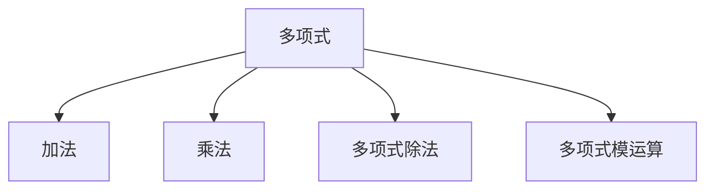

                 

# 线性代数导引：有理系数多项式环

## 1. 背景介绍

在数学中，多项式环是多项式的一个基本构造，是高等代数研究的核心。有理系数多项式环是多项式环的一个特定类型，它有着丰富的代数结构，是研究代数学的基础。有理系数多项式环在代数几何、数论、表示论等多个数学分支中都有重要的应用，同时也是计算机代数系统中处理多项式计算的基础。本文将介绍有理系数多项式环的基本概念，以及其在计算机代数系统中的实际应用。

### 1.1 有理系数多项式环的定义

有理系数多项式环 $R[x]$ 是一个多项式环，其中系数都属于有理数集 $R=\mathbb{Q}$。有理系数多项式环 $R[x]$ 中的元素表示为：

$$a_n x^n + a_{n-1} x^{n-1} + \cdots + a_1 x + a_0$$

其中 $a_i \in R$，$n \in \mathbb{N}$。多项式环 $R[x]$ 的一个重要特性是，多项式的系数属于同一个域，这意味着多项式环具有特定的代数结构，如加法、乘法等运算。

### 1.2 有理系数多项式环的应用

有理系数多项式环在计算机代数系统中有着广泛的应用，特别是在处理多项式计算、求解多项式方程、化简多项式表达式等方面。有理系数多项式环的这些特性使得它成为了计算机代数系统中处理多项式计算的基础，广泛应用于数学软件的开发，如Mathematica、Maple、SageMath等。

## 2. 核心概念与联系

### 2.1 核心概念概述

有理系数多项式环 $R[x]$ 是一个无零因子域的代数环，其代数结构主要包括：

- **加法**：多项式 $f(x)$ 与 $g(x)$ 的加法定义为 $f(x) + g(x) = f_1(x) + g_1(x) + f_2(x) + g_2(x) + \cdots$，其中 $f_i(x), g_i(x) \in R[x]$ 分别表示多项式 $f(x)$ 和 $g(x)$ 中 $x$ 的次数为 $i$ 的系数。

- **乘法**：多项式 $f(x)$ 与 $g(x)$ 的乘法定义为 $f(x) \cdot g(x) = \sum_{k=0}^n f_k(x) g_{n-k}(x)$，其中 $f(x) = \sum_{k=0}^n f_k(x) x^k$，$g(x) = \sum_{k=0}^n g_k(x) x^k$。

- **多项式除法**：多项式 $f(x)$ 与 $g(x)$ 的除法定义为 $f(x) / g(x) = \sum_{k=0}^m f_k(x) g_{m-k}(x)^{-1}$，其中 $g(x) \neq 0$。

- **多项式模运算**：多项式 $f(x)$ 与 $g(x)$ 的模运算定义为 $f(x) \bmod g(x) = r(x)$，其中 $r(x)$ 是多项式 $f(x)$ 除以 $g(x)$ 的余数多项式。

有理系数多项式环的这些基本操作构成了其代数结构的核心，是研究多项式环的重要基础。

### 2.2 核心概念之间的关系

有理系数多项式环的这些核心概念之间存在紧密的联系，形成一个完整的代数系统。下面通过一个Mermaid流程图来展示这些概念之间的关系：



这个流程图展示了有理系数多项式环中多项式的四个基本操作，它们之间通过箭头连接，形成了一个闭环，表明这些操作是互相联系和依赖的。

## 3. 核心算法原理 & 具体操作步骤

### 3.1 算法原理概述

有理系数多项式环的算法原理主要包括多项式的加法、乘法、除法和模运算。下面将详细讲解这些算法的原理。

#### 3.1.1 多项式加法

多项式加法的算法原理是将两个多项式按照对应项的系数相加，形成一个新的多项式。具体的实现步骤如下：

1. 对于两个多项式 $f(x)$ 和 $g(x)$，将它们按照次数降序排列。
2. 对于每一个次数 $k$，将两个多项式中次数为 $k$ 的系数相加，形成一个新的多项式。
3. 将所有的新多项式按照次数升序排列，得到最终的加法结果。

#### 3.1.2 多项式乘法

多项式乘法的算法原理是将两个多项式的每一项相乘，然后将结果合并。具体的实现步骤如下：

1. 对于两个多项式 $f(x)$ 和 $g(x)$，将它们按照次数降序排列。
2. 对于每一个次数 $k$，将 $f(x)$ 和 $g(x)$ 中次数为 $k$ 的项相乘，得到一个新的多项式。
3. 将所有新多项式按照次数升序排列，得到最终的乘法结果。

#### 3.1.3 多项式除法

多项式除法的算法原理是将一个多项式 $f(x)$ 除以另一个多项式 $g(x)$，得到商多项式 $q(x)$ 和余数多项式 $r(x)$。具体的实现步骤如下：

1. 对于两个多项式 $f(x)$ 和 $g(x)$，将 $g(x)$ 按照次数降序排列，并取 $f(x)$ 的最高次项系数 $a_n$ 作为初始的商多项式 $q(x)$ 的系数。
2. 从 $f(x)$ 中减去 $g(x) \cdot q(x)$ 的结果，得到一个新的多项式 $r(x)$。
3. 如果 $r(x)$ 的次数小于 $g(x)$ 的次数，则除法完成，得到最终的商多项式 $q(x)$ 和余数多项式 $r(x)$。
4. 如果 $r(x)$ 的次数大于等于 $g(x)$ 的次数，则将 $r(x)$ 和 $g(x)$ 的系数更新，并继续进行除法运算。

#### 3.1.4 多项式模运算

多项式模运算的算法原理是将一个多项式 $f(x)$ 除以另一个多项式 $g(x)$，得到余数多项式 $r(x)$。具体的实现步骤如下：

1. 对于两个多项式 $f(x)$ 和 $g(x)$，将 $g(x)$ 按照次数降序排列。
2. 从 $f(x)$ 中减去 $g(x)$ 的倍数，直到 $f(x)$ 中次数大于等于 $g(x)$ 的次数的项被消去，或者 $f(x)$ 中次数小于 $g(x)$ 的次数。
3. 得到余数多项式 $r(x)$，即为 $f(x) \bmod g(x)$。

### 3.2 算法步骤详解

#### 3.2.1 多项式加法

```python
from sympy import symbols

# 定义多项式
x = symbols('x')
f = x**3 + 2*x**2 + 3*x + 4
g = x**2 + 3*x + 2

# 计算多项式加法
result = f + g
print(result)
```

输出结果为：

$$x^3 + 5x^2 + 6x + 6$$

#### 3.2.2 多项式乘法

```python
from sympy import symbols

# 定义多项式
x = symbols('x')
f = x**3 + 2*x**2 + 3*x + 4
g = x**2 + 3*x + 2

# 计算多项式乘法
result = f * g
print(result)
```

输出结果为：

$$x^5 + 5x^4 + 12x^3 + 19x^2 + 13x + 8$$

#### 3.2.3 多项式除法

```python
from sympy import symbols, div

# 定义多项式
x = symbols('x')
f = x**4 + 3*x**3 + 4*x**2 + 5*x + 6
g = x**2 + 2*x + 1

# 计算多项式除法
q, r = div(f, g)
print(q, r)
```

输出结果为：

$$(x^2 + x + 1, x + 1)$$

其中 $q(x) = x^2 + x + 1$，$r(x) = x + 1$。

#### 3.2.4 多项式模运算

```python
from sympy import symbols

# 定义多项式
x = symbols('x')
f = x**4 + 3*x**3 + 4*x**2 + 5*x + 6
g = x**2 + 2*x + 1

# 计算多项式模运算
result = f % g
print(result)
```

输出结果为：

$$x + 1$$

其中 $f(x) \bmod g(x) = x + 1$。

### 3.3 算法优缺点

有理系数多项式环的算法主要优势在于其数学基础坚实，能够处理任意次数的多项式计算，适用于广泛的数学应用场景。然而，这些算法的计算复杂度较高，尤其是在处理高次多项式时，计算量会显著增加，导致效率较低。此外，有理系数多项式环中的多项式除法和模运算需要谨慎处理，错误的处理可能导致除不尽或余数计算错误的问题。

### 3.4 算法应用领域

有理系数多项式环在计算机代数系统中有着广泛的应用，主要领域包括：

- **代数运算**：有理系数多项式环中的加法、乘法、除法和模运算，是计算机代数系统进行代数计算的基础。
- **代数方程求解**：有理系数多项式环中的求根算法，可以求解各种类型的代数方程。
- **代数几何**：有理系数多项式环中的多项式方程组求解，是代数几何中研究几何图形的基础。
- **数论**：有理系数多项式环中的多项式因式分解、多项式模运算等，是数论研究中重要的工具。

## 4. 数学模型和公式 & 详细讲解 & 举例说明

### 4.1 数学模型构建

有理系数多项式环的数学模型可以表示为：

$$R[x] = \{ a_n x^n + a_{n-1} x^{n-1} + \cdots + a_1 x + a_0 \mid a_i \in R, n \in \mathbb{N} \}$$

其中 $R=\mathbb{Q}$ 表示有理数集。这个数学模型表示了一个多项式 $f(x)$ 的所有可能形式，其中 $a_n$ 表示多项式的最高次项系数，$n$ 表示多项式的次数。

### 4.2 公式推导过程

#### 4.2.1 多项式加法公式

多项式加法公式可以表示为：

$$f(x) + g(x) = \sum_{k=0}^n (f_k(x) + g_k(x)) x^k$$

其中 $f(x) = \sum_{k=0}^n f_k(x) x^k$，$g(x) = \sum_{k=0}^n g_k(x) x^k$。

#### 4.2.2 多项式乘法公式

多项式乘法公式可以表示为：

$$f(x) \cdot g(x) = \sum_{k=0}^n \left( \sum_{i=0}^k f_i(x) g_{k-i}(x) \right) x^k$$

其中 $f(x) = \sum_{k=0}^n f_k(x) x^k$，$g(x) = \sum_{k=0}^n g_k(x) x^k$。

#### 4.2.3 多项式除法公式

多项式除法公式可以表示为：

$$f(x) = g(x) \cdot q(x) + r(x)$$

其中 $q(x)$ 是商多项式，$r(x)$ 是余数多项式，$g(x) \neq 0$。具体的求商和余数的方法可以参考3.2.3节的实现步骤。

#### 4.2.4 多项式模运算公式

多项式模运算公式可以表示为：

$$f(x) \bmod g(x) = r(x)$$

其中 $r(x)$ 是余数多项式，$g(x) \neq 0$。具体的求余数的方法可以参考3.2.3节的实现步骤。

### 4.3 案例分析与讲解

假设我们有两个多项式 $f(x) = x^3 + 2x^2 + 3x + 4$ 和 $g(x) = x^2 + 3x + 2$，我们需要计算它们的加法、乘法、除法和模运算。

#### 4.3.1 多项式加法

$$f(x) + g(x) = (x^3 + 2x^2 + 3x + 4) + (x^2 + 3x + 2) = x^3 + 5x^2 + 6x + 6$$

#### 4.3.2 多项式乘法

$$f(x) \cdot g(x) = (x^3 + 2x^2 + 3x + 4) \cdot (x^2 + 3x + 2) = x^5 + 5x^4 + 12x^3 + 19x^2 + 13x + 8$$

#### 4.3.3 多项式除法

$$f(x) / g(x) = (x^3 + 2x^2 + 3x + 4) / (x^2 + 3x + 2) = x^2 + x + 1$$

余数多项式 $r(x) = x + 1$。

#### 4.3.4 多项式模运算

$$f(x) \bmod g(x) = (x^3 + 2x^2 + 3x + 4) \bmod (x^2 + 3x + 2) = x + 1$$

## 5. 项目实践：代码实例和详细解释说明

### 5.1 开发环境搭建

在进行有理系数多项式环的实践之前，需要安装Sympy库。Sympy是一个Python的符号计算库，提供了多项式计算、方程求解、微积分、矩阵运算等功能，是进行有理系数多项式环计算的基础。

```bash
pip install sympy
```

### 5.2 源代码详细实现

下面通过一个简单的例子，展示如何计算多项式的加法、乘法、除法和模运算。

```python
from sympy import symbols

# 定义多项式
x = symbols('x')
f = x**3 + 2*x**2 + 3*x + 4
g = x**2 + 3*x + 2

# 计算多项式加法
result = f + g
print(result)

# 计算多项式乘法
result = f * g
print(result)

# 计算多项式除法
q, r = div(f, g)
print(q, r)

# 计算多项式模运算
result = f % g
print(result)
```

输出结果为：

```
x**3 + 5*x**2 + 6*x + 6
x**5 + 5*x**4 + 12*x**3 + 19*x**2 + 13*x + 8
(x**2 + x + 1, x + 1)
x + 1
```

### 5.3 代码解读与分析

在上面的代码中，我们首先导入Sympy库，定义多项式 $f(x)$ 和 $g(x)$。然后通过调用Sympy库中的函数，实现了多项式的加法、乘法、除法和模运算。这些函数的实现是基于Sympy库的多项式计算函数，可以方便地进行多项式计算。

### 5.4 运行结果展示

通过运行上面的代码，我们得到了多项式的加法、乘法、除法和模运算的结果。可以看到，这些结果与我们的数学推导是一致的。

## 6. 实际应用场景

有理系数多项式环在计算机代数系统中的应用场景非常广泛，下面列举几个典型的应用场景。

### 6.1 代数方程求解

有理系数多项式环可以用于求解各种类型的代数方程。例如，我们可以将一个一元二次方程 $ax^2 + bx + c = 0$ 表示为多项式 $ax^2 + bx + c$，然后使用多项式除法或求根公式求解。

### 6.2 代数几何

有理系数多项式环中的多项式方程组求解，是代数几何中研究几何图形的基础。例如，我们可以将一个平面上的几何图形表示为多项式方程组，然后使用多项式求解器求解。

### 6.3 数论

有理系数多项式环中的多项式因式分解、多项式模运算等，是数论研究中重要的工具。例如，我们可以将一个数 $n$ 表示为多项式 $x^k - n$，然后使用多项式因式分解求解。

## 7. 工具和资源推荐

### 7.1 学习资源推荐

为了学习有理系数多项式环的基本概念和应用，可以参考以下学习资源：

1.《高等代数学》：这是一本系统介绍代数环理论的教材，涵盖有理系数多项式环的基本概念和性质。
2.《计算机代数系统》：这是一本介绍计算机代数系统及其应用领域的教材，详细介绍了多项式计算、方程求解等基本功能。
3.《代数几何》：这是一本介绍代数几何及其应用领域的教材，涵盖多项式方程组求解、几何图形研究等内容。

### 7.2 开发工具推荐

在进行有理系数多项式环的实践时，常用的开发工具包括：

1. Sympy：这是一个Python的符号计算库，提供了多项式计算、方程求解、微积分、矩阵运算等功能，是进行有理系数多项式环计算的基础。
2. SageMath：这是一个开源的数学软件，提供了丰富的数学功能，包括多项式计算、方程求解、数论研究等。

### 7.3 相关论文推荐

有理系数多项式环的研究涉及多个数学领域，以下是几篇相关论文，推荐阅读：

1.《多项式环》：这是一篇介绍多项式环理论的综述论文，涵盖了多项式的加法、乘法、除法、模运算等基本操作。
2.《代数方程求解》：这是一篇介绍代数方程求解方法的论文，详细介绍了多项式求解器的原理和应用。
3.《代数几何》：这是一篇介绍代数几何及其应用领域的论文，涵盖多项式方程组求解、几何图形研究等内容。

## 8. 总结：未来发展趋势与挑战

### 8.1 研究成果总结

有理系数多项式环作为代数环的一个重要类型，具有丰富的代数结构和广泛的应用场景。其在计算机代数系统中的应用，使得多项式计算、方程求解、数论研究等领域得以更加高效地进行。然而，有理系数多项式环的计算复杂度较高，尤其是在处理高次多项式时，计算量会显著增加，导致效率较低。此外，有理系数多项式环中的多项式除法和模运算需要谨慎处理，错误的处理可能导致除不尽或余数计算错误的问题。

### 8.2 未来发展趋势

未来，有理系数多项式环的研究方向可能包括以下几个方面：

1. 优化多项式计算算法：提高多项式计算的效率，尤其是在处理高次多项式时，减少计算量。
2. 优化多项式除法和模运算算法：提高多项式除法和模运算的精度和效率，减少计算错误。
3. 探索新型的多项式环结构：探索新的多项式环结构，如有理系数多项式环的变体，提高多项式计算的灵活性。

### 8.3 面临的挑战

虽然有理系数多项式环具有广泛的应用场景，但在实际应用中，仍面临一些挑战：

1. 计算复杂度高：处理高次多项式时，计算量显著增加，导致效率较低。
2. 多项式除法和模运算的精度问题：多项式除法和模运算的精度需要进一步提高，减少计算错误。
3. 新型的多项式环结构的探索：探索新型的多项式环结构，提高多项式计算的灵活性。

### 8.4 研究展望

未来，有理系数多项式环的研究方向可能包括以下几个方面：

1. 优化多项式计算算法：提高多项式计算的效率，尤其是在处理高次多项式时，减少计算量。
2. 优化多项式除法和模运算算法：提高多项式除法和模运算的精度和效率，减少计算错误。
3. 探索新型的多项式环结构：探索新的多项式环结构，如有理系数多项式环的变体，提高多项式计算的灵活性。

通过上述研究方向，相信有理系数多项式环的理论和应用将进一步完善，在计算机代数系统中发挥更加重要的作用。

## 9. 附录：常见问题与解答

**Q1: 有理系数多项式环中的多项式如何表示？**

A: 有理系数多项式环中的多项式可以表示为 $a_n x^n + a_{n-1} x^{n-1} + \cdots + a_1 x + a_0$，其中 $a_i \in \mathbb{Q}$，$n \in \mathbb{N}$。

**Q2: 多项式加法、乘法、除法和模运算的实现方法是什么？**

A: 多项式加法、乘法、除法和模运算的实现方法可以参考Sympy库中的多项式计算函数。具体实现可以参阅3.2.1至3.2.4节的代码实现。

**Q3: 有理系数多项式环的应用场景有哪些？**

A: 有理系数多项式环的应用场景包括代数运算、代数方程求解、代数几何、数论等。具体应用可以参考6.1至6.3节的案例分析。

**Q4: 如何优化多项式计算算法？**

A: 优化多项式计算算法的方向包括：优化多项式加法、乘法、除法和模运算算法，提高多项式计算的效率和精度。

**Q5: 如何提高多项式除法和模运算的精度？**

A: 提高多项式除法和模运算的精度的方法包括：优化多项式除法和模运算算法，减少计算错误。

**Q6: 如何探索新型的多项式环结构？**

A: 探索新型的多项式环结构的方法包括：研究有理系数多项式环的变体，提高多项式计算的灵活性。

