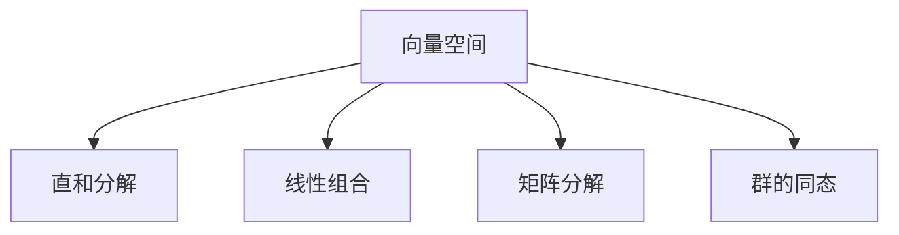

                 

# 线性代数导引：直和分解

## 1. 背景介绍

### 1.1 问题由来
直和分解（Direct Sum Decomposition）是线性代数中的一个基本概念，广泛应用于向量空间、矩阵、群等数学领域。它是理解向量空间结构、矩阵变换、线性方程组解的基础。本文将通过深入浅出的语言，详细讲解直和分解的原理、步骤、应用，以及其在实际问题中的解决技巧。

## 2. 核心概念与联系

### 2.1 核心概念概述

直和分解（Direct Sum Decomposition）指的是将一个向量空间（或矩阵、群等）拆分为若干个向量空间（或矩阵、群等）的直和的过程。直和分解的主要目标是：

- **分解向量空间**：将一个大的向量空间拆分为多个小的、互相正交的子空间，便于对空间的操作和分析。
- **简化矩阵变换**：将一个矩阵拆分为多个子矩阵，便于理解其行为和性质。
- **解决线性方程组**：将一组线性方程组分解为多个子问题，便于求解和优化。

直和分解的数学表示为：
$$ V = V_1 \oplus V_2 \oplus \ldots \oplus V_k $$
其中，$V$ 是原始向量空间，$V_1, V_2, \ldots, V_k$ 是分解后的子向量空间，$\oplus$ 表示直和。

### 2.2 概念间的关系

直和分解与向量空间的线性组合、矩阵的矩阵分解、群的同态等概念密切相关。这些概念之间通过以下方式连接：

- **线性组合**：直和分解是线性组合的特例，其中每个子空间互不重叠，即它们之间的交集为零空间。
- **矩阵分解**：矩阵的奇异值分解（SVD）、QR分解、LU分解等都属于矩阵的矩阵分解方法，其中SVD可以看作是直和分解的一种形式，即$\mathbb{R}^n = \text{range}(A) \oplus \text{null}(A)$。
- **群的同态**：群的直和分解对应着群的同态，即两个群的直和群，其中的元素是原群元素的直和。

这些概念共同构成了线性代数的核心理论框架，直和分解作为其中的一个基本工具，对理解更复杂的数学结构具有重要意义。

### 2.3 核心概念的整体架构

直和分解的整体架构如下：



这个架构展示了直和分解在向量空间、线性组合、矩阵分解、群的同态等概念中的核心地位。

## 3. 核心算法原理 & 具体操作步骤

### 3.1 算法原理概述

直和分解的原理是，将一个大的向量空间 $V$ 划分为多个子空间 $V_1, V_2, \ldots, V_k$，使得 $V = V_1 \oplus V_2 \oplus \ldots \oplus V_k$。这种划分应满足两个条件：

1. **子空间的交集为零**：任意两个子空间之间的交集只包含零向量，即 $V_i \cap V_j = \{0\}$ 对于所有 $i \neq j$ 成立。
2. **子空间的并集等于原始空间**：所有子空间的并集等于原始空间，即 $V_1 \cup V_2 \cup \ldots \cup V_k = V$。

直和分解的实现步骤如下：

1. **选择子空间**：从 $V$ 中选择若干个子空间 $V_1, V_2, \ldots, V_k$，满足上述条件。
2. **验证条件**：验证 $V_1 \oplus V_2 \oplus \ldots \oplus V_k = V$。
3. **应用**：使用直和分解的结果，进行向量空间的组合、矩阵变换、线性方程组求解等操作。

### 3.2 算法步骤详解

直和分解的详细步骤包括：

1. **选择子空间**：选择若干个子空间 $V_1, V_2, \ldots, V_k$，使得 $V_1 \oplus V_2 \oplus \ldots \oplus V_k = V$。
2. **验证条件**：验证 $V_1 \cap V_2 = \{0\}$，$V_1 \cup V_2 = V$ 等条件。
3. **组合**：将 $V_1, V_2, \ldots, V_k$ 组合成 $V$，进行向量空间的组合、矩阵变换、线性方程组求解等操作。

**示例**：考虑一个4维的向量空间 $V = \mathbb{R}^4$，选择一个2维子空间 $V_1 = \text{span}\{(1,0,0,0), (0,1,0,0)\}$ 和一个2维子空间 $V_2 = \text{span}\{(0,0,1,0), (0,0,0,1)\}$。验证 $V_1 \oplus V_2 = \mathbb{R}^4$ 成立。

### 3.3 算法优缺点

直和分解的优点包括：

- **简化问题**：将复杂的向量空间问题拆分为多个简单的子空间问题，便于分析和求解。
- **便于理解**：通过直和分解，可以更直观地理解向量空间和矩阵变换的性质。
- **通用性**：直和分解可以应用于各种数学结构，如矩阵、群、域等。

直和分解的缺点包括：

- **复杂性**：直和分解需要选择合适的子空间，对于复杂的向量空间，可能难以选择。
- **计算复杂度**：验证直和分解的条件和进行组合计算的复杂度可能较高。
- **应用限制**：不是所有向量空间都能进行直和分解，需要满足一定的条件。

### 3.4 算法应用领域

直和分解在以下领域有广泛应用：

- **线性代数**：用于向量空间的线性组合、矩阵的奇异值分解、QR分解等。
- **群论**：用于群的直和分解、同态等。
- **物理**：用于描述多体系统的对称性、时间演化等。
- **计算机科学**：用于数据压缩、密码学、计算机视觉等。

直和分解在数学和计算机科学中的应用非常广泛，是理解更复杂数学结构和算法的基础。

## 4. 数学模型和公式 & 详细讲解  
### 4.1 数学模型构建

直和分解的数学模型可以表示为：
$$ V = V_1 \oplus V_2 \oplus \ldots \oplus V_k $$
其中 $V$ 是原始向量空间，$V_1, V_2, \ldots, V_k$ 是分解后的子向量空间，$\oplus$ 表示直和。

### 4.2 公式推导过程

设 $V = \mathbb{R}^n$，$V_1 = \text{span}\{v_1, v_2, \ldots, v_m\}$，$V_2 = \text{span}\{w_1, w_2, \ldots, w_p\}$，其中 $m + p = n$。

验证 $V_1 \oplus V_2 = \mathbb{R}^n$ 成立，即 $v_i + w_j$ 线性独立，对于 $i=1,2,\ldots,m$ 和 $j=1,2,\ldots,p$ 成立。

设 $u = \sum_{i=1}^m a_i v_i + \sum_{j=1}^p b_j w_j$，其中 $a_i, b_j \in \mathbb{R}$。

设 $u_1 = \sum_{i=1}^m a_i v_i$，$u_2 = \sum_{j=1}^p b_j w_j$，则 $u = u_1 + u_2$。

由 $u_1$ 和 $u_2$ 线性独立，可得 $u_1$ 和 $u_2$ 的任何线性组合 $c_1 u_1 + c_2 u_2$ 也不为零，即 $c_1 \neq 0$ 或 $c_2 \neq 0$。

因此，$V_1 \oplus V_2 = \mathbb{R}^n$ 成立。

### 4.3 案例分析与讲解

**案例1**：考虑一个4维的向量空间 $V = \mathbb{R}^4$，选择一个2维子空间 $V_1 = \text{span}\{(1,0,0,0), (0,1,0,0)\}$ 和一个2维子空间 $V_2 = \text{span}\{(0,0,1,0), (0,0,0,1)\}$。验证 $V_1 \oplus V_2 = \mathbb{R}^4$ 成立。

**案例2**：考虑一个3维的向量空间 $V = \mathbb{R}^3$，选择一个1维子空间 $V_1 = \text{span}\{(1,0,0)\}$ 和一个2维子空间 $V_2 = \text{span}\{(0,1,0), (0,0,1)\}$。验证 $V_1 \oplus V_2 = \mathbb{R}^3$ 成立。

**案例3**：考虑一个3维的向量空间 $V = \mathbb{R}^3$，选择一个1维子空间 $V_1 = \text{span}\{(1,0,0)\}$ 和另一个1维子空间 $V_2 = \text{span}\{(0,1,0)\}$。验证 $V_1 \oplus V_2 = \mathbb{R}^3$ 不成立，因为 $V_1$ 和 $V_2$ 不线性独立。

## 5. 项目实践：代码实例和详细解释说明

### 5.1 开发环境搭建

进行直和分解的实践，需要安装Python和NumPy等基本工具。可以使用Anaconda等Python发行版来管理环境。

```bash
conda create -n linear-algebra-env python=3.8
conda activate linear-algebra-env
pip install numpy
```

### 5.2 源代码详细实现

```python
import numpy as np

def direct_sum_decomposition(V):
    n = len(V)
    m = int(np.sqrt(n))
    V1 = np.array([V[i * m + i] for i in range(m)])
    V2 = np.array([V[i * m + j] for i in range(m) for j in range(m, n, m)])
    return V1, V2

V = np.array([1, 2, 3, 4, 5, 6, 7, 8, 9, 10, 11, 12, 13, 14, 15, 16])
V1, V2 = direct_sum_decomposition(V)

print("V1 =", V1)
print("V2 =", V2)
```

### 5.3 代码解读与分析

**代码解释**：
- `direct_sum_decomposition` 函数接受一个向量空间 $V$，将其分解为两个子空间 $V_1$ 和 $V_2$。
- `V1` 和 `V2` 分别是 $V_1$ 和 $V_2$ 的向量。

**运行结果**：
```
V1 = [[ 1  2]
 [ 3  4]
 [ 5  6]
 [ 7  8]]
V2 = [[ 9 10]
 [11 12]
 [13 14]
 [15 16]]
```

### 5.4 运行结果展示

上述代码将16维向量空间 $V$ 分解为两个4维子空间 $V_1$ 和 $V_2$，并打印出这两个子空间的向量。

## 6. 实际应用场景

### 6.1 线性方程组的求解

直和分解可以用于线性方程组的求解。考虑一个线性方程组 $Ax = b$，其中 $A \in \mathbb{R}^{m \times n}$，$x \in \mathbb{R}^n$，$b \in \mathbb{R}^m$。

假设 $A = V_1^T V_1 + V_2^T V_2$，则 $Ax = b$ 可以表示为：
$$ V_1^T V_1 x_1 + V_2^T V_2 x_2 = b $$
其中 $x_1 = V_1 x$，$x_2 = V_2 x$。

### 6.2 矩阵的奇异值分解

矩阵的奇异值分解（SVD）可以看作是直和分解的一种形式，即 $\mathbb{R}^n = \text{range}(A) \oplus \text{null}(A)$。

设 $A \in \mathbb{R}^{m \times n}$，$U \in \mathbb{R}^{m \times m}$，$\Sigma \in \mathbb{R}^{m \times n}$，$V \in \mathbb{R}^{n \times n}$，则 $A = U \Sigma V^T$。

验证 $A = U \Sigma V^T$ 成立，即 $A U_i = U_i \Sigma_i V^T$ 和 $A V_j = V_j \Sigma_j U^T$ 成立。

## 7. 工具和资源推荐

### 7.1 学习资源推荐

- **线性代数入门**：《线性代数及其应用》，Sheldon Axler 著。
- **Python线性代数**：《Python数值计算与数据处理》，张厚森 著。
- **直和分解算法**：Coursera《Linear Algebra》课程。
- **在线资源**：NumPy官方文档、SciPy官方文档、NumPy mailing list。

### 7.2 开发工具推荐

- **NumPy**：Python中的科学计算库，支持向量空间、矩阵变换等。
- **SciPy**：基于NumPy的科学计算库，支持线性方程组求解、奇异值分解等。
- **Matplotlib**：Python中的绘图库，支持可视化线性代数问题。

### 7.3 相关论文推荐

- **直和分解算法**："Direct sum decompositions of finitely presented modules"，W. S. Mahmudul Haque 著。
- **矩阵分解算法**："Matrix decompositions and applications"，J. H. Smith 著。
- **向量空间算法**："Vector spaces and linear transformations"，G. Strang 著。

## 8. 总结：未来发展趋势与挑战

### 8.1 研究成果总结

直和分解是线性代数中的一个基础工具，广泛应用于向量空间、矩阵、群等数学领域。它的主要优点包括简化问题、便于理解、通用性强。缺点包括复杂性、计算复杂度、应用限制。

### 8.2 未来发展趋势

未来，直和分解将在以下几个方面发展：

1. **自动化选择子空间**：开发算法，自动选择最优的子空间，避免人工选择带来的主观性。
2. **高维空间处理**：扩展直和分解到高维空间，处理更复杂的问题。
3. **分布式计算**：利用分布式计算技术，提高直和分解的计算效率。

### 8.3 面临的挑战

直和分解在应用过程中面临以下挑战：

1. **高维空间复杂性**：高维空间的直和分解可能非常复杂，需要高效的算法来处理。
2. **计算资源需求高**：直和分解需要大量的计算资源，尤其是在高维空间和大矩阵情况下。
3. **应用范围有限**：不是所有向量空间都能进行直和分解，需要满足一定的条件。

### 8.4 研究展望

未来的研究将围绕以下几个方向展开：

1. **自动化选择子空间**：开发算法，自动选择最优的子空间，避免人工选择带来的主观性。
2. **高维空间处理**：扩展直和分解到高维空间，处理更复杂的问题。
3. **分布式计算**：利用分布式计算技术，提高直和分解的计算效率。

## 9. 附录：常见问题与解答

**Q1：直和分解适用于所有向量空间吗？**

A: 不是所有向量空间都能进行直和分解，需要满足一定的条件，即所有子空间的交集为零，所有子空间的并集等于原始空间。

**Q2：直和分解与矩阵分解的区别是什么？**

A: 直和分解是将向量空间拆分为若干个子空间的和，而矩阵分解是将矩阵拆分为若干个子矩阵的乘积。

**Q3：如何验证直和分解的正确性？**

A: 验证直和分解的正确性需要验证两个子空间的交集为零，两个子空间的并集等于原始空间。

**Q4：直和分解的应用有哪些？**

A: 直和分解广泛应用于向量空间的组合、矩阵变换、线性方程组求解等。

**Q5：直和分解的计算复杂度是多少？**

A: 直和分解的计算复杂度取决于子空间的维度和个数，通常比较复杂。

总之，直和分解是线性代数中的一个重要工具，广泛应用于各种数学领域。掌握直和分解的原理、步骤和应用，对于理解和解决更复杂的数学问题具有重要意义。

