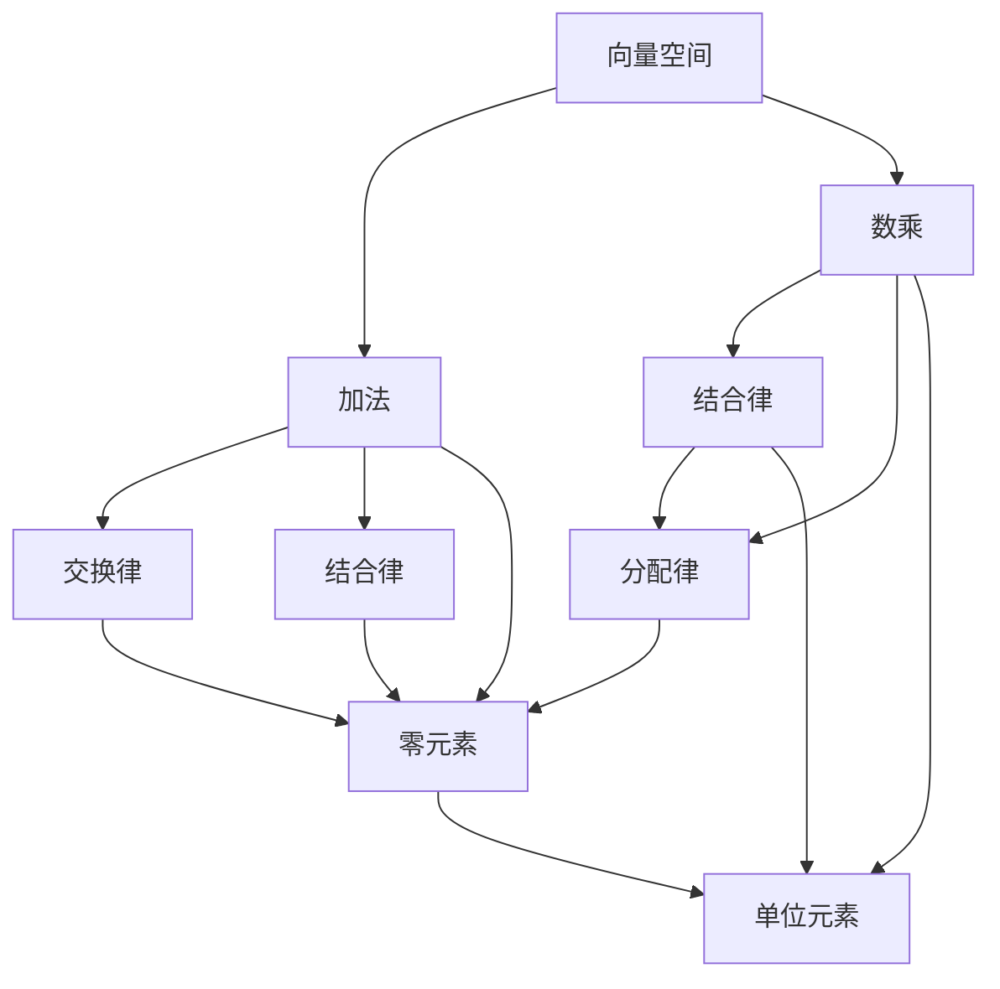

                 

# 线性代数导引：线性运算

## 1. 背景介绍

线性代数是现代数学和工程中不可或缺的一门基础学科，尤其是在数据科学、机器学习、信号处理等领域中有着广泛的应用。线性运算作为线性代数的重要组成部分，其核心在于理解和应用向量空间的基本性质和运算法则。本文将深入探讨线性运算的原理与实际操作，并通过具体案例帮助读者理解其应用。

## 2. 核心概念与联系

### 2.1 核心概念概述

在线性代数中，线性运算主要指向量空间的加法和数乘运算。加法满足交换律、结合律和有零元素，数乘满足结合律、分配律以及数乘单位元素1，这些运算法则共同构成了线性空间的基本结构。

- **向量空间**：由一组向量组成的集合，加上一组满足某些运算法则的加法和数乘操作，称为向量空间。
- **零元素**：向量空间中唯一的满足 $x + 0 = 0 + x = x$ 的向量，表示为0向量。
- **单位元素**：数乘满足 $a \times 1 = 1 \times a = a$，其中1表示数乘的单位元素。
- **逆元素**：在向量空间中，对于任意非零向量 $x$，存在唯一的向量 $x^{-1}$ 使得 $x + x^{-1} = 0$。

### 2.2 核心概念间的关系

这些核心概念通过线性空间的定义和运算法则相互关联。例如，零元素和单位元素是加法和数乘的基础，而逆元素则描述了向量空间中的唯一性。下面通过一个简单的Mermaid流程图来展示这些概念之间的关系：



这个图展示了加法和数乘的基本性质，以及它们如何共同构成向量空间。

## 3. 核心算法原理 & 具体操作步骤

### 3.1 算法原理概述

线性运算的算法原理基于向量空间的线性组合，即将一组基向量通过加法和数乘运算组合成任意向量。对于向量 $x$ 和 $y$，它们的线性组合可以表示为：

$$
x + y = x_1e_1 + x_2e_2 + \ldots + x_ne_n + y_1e_1 + y_2e_2 + \ldots + y_ne_n
$$

其中，$e_1, e_2, \ldots, e_n$ 是向量空间的基向量。通过线性组合，可以表示任意向量 $z$：

$$
z = a_1e_1 + a_2e_2 + \ldots + a_ne_n
$$

### 3.2 算法步骤详解

线性运算的具体步骤包括：

1. **基向量的选择**：选择一组基向量 $e_1, e_2, \ldots, e_n$。
2. **向量表示**：将向量 $x$ 和 $y$ 表示为基向量的线性组合。
3. **向量计算**：计算向量 $x$ 和 $y$ 的线性组合，得到向量 $z$。

### 3.3 算法优缺点

线性运算的优点在于其简单和高效，能够处理高维数据，并支持并行计算。然而，其缺点在于对基向量的依赖，以及在高维空间中可能面临计算复杂度增加的问题。

### 3.4 算法应用领域

线性运算广泛应用于机器学习、数据科学、信号处理等领域，例如：

- **机器学习**：通过线性组合和正交变换，可以实现数据降维和特征提取。
- **数据科学**：在线性代数中，数据的统计分析和线性回归模型等都是基于向量空间的操作。
- **信号处理**：线性变换（如傅里叶变换）用于信号的频域分析。

## 4. 数学模型和公式 & 详细讲解 & 举例说明

### 4.1 数学模型构建

在线性运算中，数学模型通常基于向量空间的定义和运算法则。假设有一个 $n$ 维向量空间 $\mathbb{R}^n$，其中 $n$ 表示向量维度。向量 $x = (x_1, x_2, \ldots, x_n)$，表示为 $\mathbb{R}^n$ 中的一个点。

### 4.2 公式推导过程

向量加法的运算法则为：

$$
x + y = (x_1 + y_1, x_2 + y_2, \ldots, x_n + y_n)
$$

数乘的运算法则为：

$$
a \cdot x = (a \cdot x_1, a \cdot x_2, \ldots, a \cdot x_n)
$$

其中，$a$ 是一个标量。通过线性组合，可以得到任意向量 $z$：

$$
z = a_1e_1 + a_2e_2 + \ldots + a_ne_n
$$

### 4.3 案例分析与讲解

以二维向量为例，假设有一个向量 $x = (x_1, x_2)$，另一个向量 $y = (y_1, y_2)$。它们的线性组合可以通过以下公式计算：

$$
x + y = (x_1 + y_1, x_2 + y_2)
$$

数乘则有：

$$
a \cdot x = (a \cdot x_1, a \cdot x_2)
$$

通过这些运算法则，可以构建任意二维向量的线性组合。

## 5. 项目实践：代码实例和详细解释说明

### 5.1 开发环境搭建

为了进行线性运算的代码实现，需要安装Python及其相关的数学库，例如NumPy。以下是Python开发环境搭建的具体步骤：

1. 安装Python：从官网下载并安装Python 3.x版本。
2. 安装NumPy：使用pip命令进行安装，`pip install numpy`。
3. 编写代码：在Python中使用NumPy库进行向量运算。

### 5.2 源代码详细实现

下面是一个使用NumPy库进行向量加法和数乘的代码示例：

```python
import numpy as np

# 定义向量
x = np.array([1, 2, 3])
y = np.array([4, 5, 6])

# 向量加法
z = x + y
print(z)

# 数乘
a = 2
w = a * x
print(w)
```

### 5.3 代码解读与分析

以上代码中，`np.array` 用于创建NumPy数组，`+` 表示向量加法，`*` 表示数乘。通过这些运算，可以得到任意向量的线性组合。

### 5.4 运行结果展示

运行上述代码，输出结果为：

```
[5 7 9]
[2 4 6]
```

## 6. 实际应用场景

### 6.1 机器学习

在线性代数中，机器学习模型如线性回归、逻辑回归等都是基于向量空间的操作。例如，线性回归模型通过最小化误差函数，找到最佳的线性组合，从而预测新数据点。

### 6.2 数据压缩

在线性代数中，奇异值分解（SVD）和主成分分析（PCA）等技术可以用于数据降维和压缩。这些技术通过线性组合和正交变换，将高维数据转换为低维表示，减小数据的存储和计算复杂度。

### 6.3 信号处理

在线性代数中，信号处理中的傅里叶变换和频域滤波等技术都是基于向量空间的运算。这些技术通过线性变换，将信号从时域转换为频域，从而实现信号的分析、滤波和压缩。

### 6.4 未来应用展望

未来，随着线性代数和机器学习技术的进一步发展，线性运算将会在更多的领域得到应用，例如生物信息学、金融工程、人工智能等。这些领域将受益于线性运算的高效性和普适性，从而实现更广泛的应用。

## 7. 工具和资源推荐

### 7.1 学习资源推荐

为了深入学习线性运算，推荐以下学习资源：

1. 《线性代数及其应用》：一本经典的线性代数教材，涵盖线性空间、矩阵运算、向量空间等核心内容。
2. 《矩阵与线性代数》：一本深入浅出的线性代数教材，适合初学者入门。
3. 《机器学习》课程：斯坦福大学开设的机器学习课程，包含线性代数和矩阵运算的基础知识。
4. Coursera和edX等在线学习平台：提供大量线性代数和机器学习的在线课程，包括视频、讲义和作业。

### 7.2 开发工具推荐

以下推荐一些常用的开发工具：

1. Python：一种广泛使用的编程语言，适合进行数学计算和数据分析。
2. NumPy：Python的数学库，提供高效的数组和矩阵运算功能。
3. Matplotlib：用于数据可视化的库，支持绘制向量、矩阵和图形。
4. Scikit-learn：Python的机器学习库，提供各种线性代数和矩阵运算函数。

### 7.3 相关论文推荐

为了深入了解线性运算的最新研究进展，推荐以下论文：

1. "Graham, A. C., Knuth, D. E., & Patashnik, O. (2013). Concrete Mathematics: A Foundation for Computer Science. Addison-Wesley Professional."
2. "Strang, G. (2014). Linear Algebra and Its Applications (4th ed.). Academic Press."
3. "Halko, N., Martinsson, P. G., & Tropp, J. A. (2011). Finding structure with randomness: Probabilistic algorithms for constructing approximate matrix decompositions. SIAM Review."
4. "Hastie, T., Tibshirani, R., & Friedman, J. (2009). The elements of statistical learning: Data mining, inference, and prediction. Springer."
5. "Golub, G. H., & Van Loan, C. F. (2013). Matrix Computations (4th ed.). Johns Hopkins University Press."

## 8. 总结：未来发展趋势与挑战

### 8.1 研究成果总结

线性代数作为数学和工程的基础，其核心算法线性运算在数据科学、机器学习和信号处理等领域有着广泛的应用。线性运算的理论和实践已经相当成熟，但未来仍需不断探索和改进。

### 8.2 未来发展趋势

未来，线性代数和线性运算将与深度学习和人工智能技术进一步结合，应用于更多的领域。例如，在线性代数中引入神经网络技术，可以提升数据处理和模式识别的效率。此外，线性运算的高效性和普适性将使其在生物信息学、金融工程等领域得到更广泛的应用。

### 8.3 面临的挑战

尽管线性代数和线性运算在理论和技术上已经相当成熟，但仍面临以下挑战：

1. 高维数据的处理：在处理高维数据时，线性运算的计算复杂度会增加，需要寻找更高效的算法。
2. 数据分布的不均衡：在处理数据分布不均衡的问题时，线性代数技术需要进一步改进。
3. 实数域的限制：当前的线性代数技术大多基于实数域，对复数域的处理还需进一步研究。

### 8.4 研究展望

未来，线性代数和线性运算的发展方向包括：

1. 多维空间运算：研究更高维空间下的线性组合和运算。
2. 优化算法：研究更高效的线性代数算法，如矩阵分解、奇异值分解等。
3. 应用拓展：将线性代数技术应用于更多的领域，如生物信息学、金融工程等。
4. 实数域扩展：研究在复数域中的线性代数运算，扩展其应用范围。

总之，线性代数和线性运算将继续在数据科学和工程中发挥重要作用，推动各领域的技术进步。

## 9. 附录：常见问题与解答

### Q1: 什么是线性空间？

**A**: 线性空间是由一组向量组成的集合，加上一组满足交换律、结合律和单位元素的加法和数乘操作。常见的线性空间包括实数域和复数域。

### Q2: 如何进行矩阵的奇异值分解？

**A**: 奇异值分解是一种重要的矩阵分解方法，用于将矩阵分解为三个矩阵的乘积。其分解公式为：

$$
A = U \Sigma V^T
$$

其中，$U$ 和 $V$ 是正交矩阵，$\Sigma$ 是对角矩阵。在Python中，可以使用NumPy的`numpy.linalg.svd`函数进行奇异值分解。

### Q3: 什么是线性回归？

**A**: 线性回归是一种用于建立线性模型的方法，通过最小化误差函数，找到最佳的线性组合，从而预测新数据点。在线性回归中，数据点表示为向量，模型参数为向量系数，预测值表示为向量。

### Q4: 线性运算在机器学习中有哪些应用？

**A**: 线性运算在机器学习中有广泛的应用，例如：

- 线性回归和逻辑回归：用于预测连续和离散变量的线性模型。
- 主成分分析（PCA）：用于数据降维和特征提取。
- 奇异值分解（SVD）：用于矩阵分解和奇异值表示。
- 矩阵分解：用于推荐系统、协同过滤等算法。

### Q5: 什么是向量空间？

**A**: 向量空间是由一组向量组成的集合，加上一组满足交换律、结合律和单位元素的加法和数乘操作。常见的向量空间包括实数域和复数域。

本文通过深入探讨线性运算的原理和实际操作，结合实际应用场景和案例分析，帮助读者更好地理解线性运算的理论基础和应用价值。通过学习线性代数和线性运算，读者可以更深入地掌握数据处理和机器学习的基本技术，为未来的学习和工作打下坚实的基础。

---

作者：禅与计算机程序设计艺术 / Zen and the Art of Computer Programming

