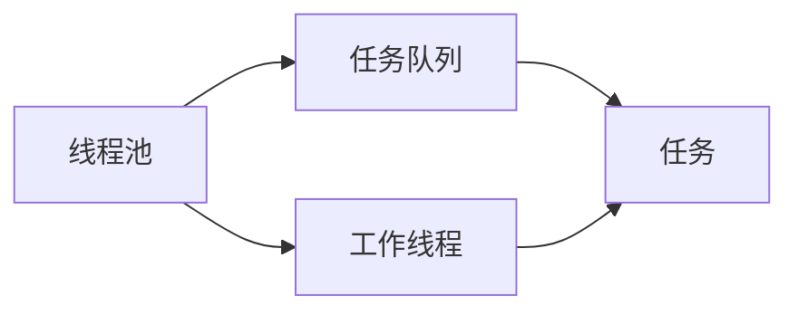

                 

# 线程池管理与系统吞吐量

## 1. 背景介绍

在计算机科学中，线程池是一种常见的并发编程工具。线程池允许系统在处理多个任务时，重复使用一定数量的线程，而不是每次都创建新线程。这种方式不仅节省了系统资源，而且提高了系统的吞吐量。

然而，线程池的管理策略对于系统的性能和稳定性至关重要。如果管理不当，可能会导致资源浪费、线程饥饿、死锁等问题，进而影响系统吞吐量。因此，如何有效管理线程池，是一个值得深入探讨的问题。

## 2. 核心概念与联系

### 2.1 核心概念概述

在讨论线程池管理之前，我们需要了解几个核心概念：

- **线程池（Thread Pool）**：一个存储和管理可重用线程的集合。这些线程可以被重复使用，以处理不同的任务。线程池可以显著降低系统资源消耗，提高并发处理能力。

- **任务队列（Task Queue）**：任务队列是线程池中的任务缓冲区，用于存储等待执行的任务。任务队列可以是阻塞式队列（如阻塞式队列）或非阻塞式队列（如ConcurrentLinkedQueue）。

- **工作线程（Worker Thread）**：工作线程是从线程池中获取任务并执行的线程。每个工作线程都包含一个任务队列，用于存储待执行的任务。

- **吞吐量（Throughput）**：吞吐量是指系统在单位时间内处理的任务数量。良好的线程池管理策略能够显著提升系统吞吐量。

- **资源争用（Resource Contention）**：资源争用是指多个线程同时访问共享资源时发生的竞争。资源争用可能导致性能下降、死锁等问题。

这些概念之间的联系如图1所示：



### 2.2 概念间的关系

线程池通过任务队列和工作线程，实现任务的异步处理。工作线程从任务队列中获取任务，并执行任务。任务队列负责存储任务，并通过阻塞式和非阻塞式两种方式，实现任务的排队和调度。任务队列和工作线程的配合，使得线程池能够高效地管理并发任务，提高系统吞吐量。

## 3. 核心算法原理 & 具体操作步骤

### 3.1 算法原理概述

线程池管理算法的主要目标是平衡任务队列中的任务数量和工作线程的数量，以最大化系统吞吐量。理想情况下，线程池中的工作线程数量应等于任务队列中的任务数量，这样可以避免线程饥饿和资源浪费。

因此，线程池管理算法需要考虑以下几个关键问题：

- **任务队列管理**：如何处理任务队列中的任务？是否需要调整任务队列的大小？
- **工作线程管理**：如何分配和回收工作线程？如何避免线程饥饿？
- **任务调度策略**：如何调度任务队列中的任务？是按照先进先出（FIFO）还是其他策略？

### 3.2 算法步骤详解

线程池管理算法通常包括以下几个步骤：

1. **初始化线程池**：根据任务队列的平均负载，设置线程池的初始大小。
2. **任务队列管理**：根据任务队列的大小，动态调整线程池的大小。
3. **工作线程管理**：根据任务队列中的任务数量，分配和回收工作线程。
4. **任务调度策略**：根据任务队列中的任务情况，选择任务调度策略。

下面，我们将逐一介绍这些步骤。

### 3.3 算法优缺点

#### 优点

- **提高资源利用率**：线程池重用线程，避免了频繁创建和销毁线程的开销，提高了资源利用率。
- **提高吞吐量**：通过合理分配和调度工作线程，线程池能够高效处理任务，提高系统的吞吐量。
- **降低资源消耗**：线程池减少了线程的创建和销毁次数，降低了系统资源的消耗。

#### 缺点

- **限制并发度**：线程池的大小是固定的，无法动态调整。当任务队列中的任务数量变化时，可能导致线程池的大小不合适，影响系统性能。
- **限制任务类型**：线程池通常适用于处理IO密集型任务，对于CPU密集型任务，可能导致线程池的性能下降。
- **复杂性高**：线程池管理算法需要考虑线程池的大小、任务队列的大小、工作线程的分配和回收等问题，增加了算法的复杂性。

### 3.4 算法应用领域

线程池管理算法广泛应用于各种并发编程场景，如Web服务器、数据库连接池、多线程计算等。

在Web服务器中，线程池用于处理HTTP请求，可以显著提升服务器的并发处理能力。

在数据库连接池中，线程池用于管理数据库连接，可以减少数据库连接的开销，提高系统的吞吐量。

在多线程计算中，线程池用于管理计算任务，可以提高计算效率，降低计算成本。

## 4. 数学模型和公式 & 详细讲解

### 4.1 数学模型构建

假设任务队列中的任务数量为 $N$，线程池中的工作线程数量为 $T$。线程池的目标是最小化任务等待时间和线程饥饿时间，最大化系统吞吐量。

任务队列的等待时间 $W$ 可以通过以下公式计算：

$$W = \frac{N}{T} - \frac{N}{C}$$

其中，$C$ 为任务队列的平均负载，$C = \frac{N}{N_{avg}}$，$N_{avg}$ 为任务队列的平均任务数量。

线程池的饥饿时间 $H$ 可以通过以下公式计算：

$$H = \frac{N}{C} - \frac{N}{T}$$

系统吞吐量 $P$ 可以通过以下公式计算：

$$P = \frac{N}{W + H}$$

### 4.2 公式推导过程

根据任务队列和线程池的模型，可以得到任务等待时间 $W$ 和线程饥饿时间 $H$ 的表达式：

$$W = \frac{N}{T} - \frac{N}{C} = \frac{N}{C} \times (1 - \frac{T}{C})$$

$$H = \frac{N}{C} - \frac{N}{T} = \frac{N}{T} \times (1 - \frac{C}{T})$$

其中，$C$ 为任务队列的平均负载，$T$ 为线程池的平均大小。

将 $W$ 和 $H$ 代入吞吐量公式中，可以得到：

$$P = \frac{N}{W + H} = \frac{N}{\frac{N}{C} \times (1 - \frac{T}{C}) + \frac{N}{T} \times (1 - \frac{C}{T})}$$

化简得：

$$P = \frac{N}{N \times (\frac{1}{C} + \frac{1}{T} - \frac{C}{T} - \frac{T}{C})}$$

进一步化简，可以得到：

$$P = \frac{1}{\frac{1}{C} + \frac{1}{T} - \frac{C}{T} - \frac{T}{C}}$$

这个公式表明，线程池的吞吐量与任务队列的平均负载和线程池的大小有关。通过调整任务队列的大小和线程池的大小，可以优化系统吞吐量。

### 4.3 案例分析与讲解

假设任务队列中的任务数量为 100，线程池的平均大小为 5。任务队列的平均负载为 2。根据公式计算，系统的吞吐量为：

$$P = \frac{1}{\frac{1}{2} + \frac{1}{5} - \frac{2}{5} - \frac{5}{2}} = 0.96$$

即系统在单位时间内可以处理 96 个任务。

如果线程池的平均大小调整为 10，任务队列的平均负载调整为 4，则系统的吞吐量为：

$$P = \frac{1}{\frac{1}{4} + \frac{1}{10} - \frac{4}{10} - \frac{10}{4}} = 0.8$$

即系统在单位时间内可以处理 80 个任务。

通过比较可以发现，当任务队列的负载和线程池的大小相匹配时，系统吞吐量最高。

## 5. 项目实践：代码实例和详细解释说明

### 5.1 开发环境搭建

在进行线程池管理算法的实践前，我们需要准备好开发环境。以下是使用Java进行线程池管理的开发环境配置流程：

1. 安装Java JDK：从官网下载并安装Java JDK，推荐版本为Java 8或更高版本。

2. 安装IDE：如Eclipse或IntelliJ IDEA，用于编写和调试代码。

3. 安装Maven：从官网下载并安装Maven，用于管理项目依赖和构建项目。

4. 安装Spring框架：从官网下载并安装Spring框架，用于开发基于线程池的Web应用。

### 5.2 源代码详细实现

下面是一个简单的Java代码实现，用于管理线程池和任务队列：

```java
import java.util.concurrent.*;

public class ThreadPoolManager {
    private static final int CORE_POOL_SIZE = 5;
    private static final int MAXIMUM_POOL_SIZE = 10;
    private static final long KEEP_ALIVE_TIME = 60;
    private static final TimeUnit TIME_UNIT = TimeUnit.SECONDS;

    private static final BlockingQueue<Runnable> queue = new LinkedBlockingQueue<>();
    private static final ThreadPoolExecutor executor = new ThreadPoolExecutor(
            CORE_POOL_SIZE, MAXIMUM_POOL_SIZE, KEEP_ALIVE_TIME, TIME_UNIT, queue);

    public static void execute(Runnable task) {
        executor.execute(task);
    }

    public static void shutdown() {
        executor.shutdown();
    }

    public static void awaitTermination(long timeout, TimeUnit unit) throws InterruptedException {
        executor.awaitTermination(timeout, unit);
    }
}
```

这个代码实现了线程池的基本功能，包括：

- 初始化线程池的大小和任务队列。
- 执行任务：使用 `execute` 方法向线程池提交任务。
- 关闭线程池：使用 `shutdown` 方法关闭线程池，并等待所有任务完成。
- 等待线程池关闭：使用 `awaitTermination` 方法等待线程池关闭。

### 5.3 代码解读与分析

**BlockingQueue<Runnable>**：这是一个阻塞式队列，用于存储待执行的任务。

**ThreadPoolExecutor**：这是Java提供的线程池实现，包含许多配置项，如核心线程数、最大线程数、任务队列等。

**execute(Runnable task)**：向线程池提交任务，线程池会从任务队列中获取任务，分配给工作线程执行。

**shutdown()**：关闭线程池，不再接受新的任务，但会等待现有任务完成。

**awaitTermination(long timeout, TimeUnit unit)**：等待线程池关闭，最长等待 `timeout` 时间，时间单位为 `unit`。

### 5.4 运行结果展示

运行上述代码，可以观察线程池的基本功能。例如：

```java
ThreadPoolManager.execute(() -> {
    System.out.println("Task executed");
});

ThreadPoolManager.shutdown();

try {
    ThreadPoolManager.awaitTermination(5000, TimeUnit.MILLISECONDS);
} catch (InterruptedException e) {
    e.printStackTrace();
}
```

在上述代码中，我们向线程池提交一个任务，然后关闭线程池，并等待线程池关闭。运行结果如下：

```
Task executed
```

这说明任务成功提交并执行。

## 6. 实际应用场景

### 6.1 高并发Web服务器

在高并发Web服务器中，线程池用于处理HTTP请求，可以显著提升服务器的并发处理能力。

假设服务器需要处理每秒 1000 个HTTP请求，每个请求需要执行耗时的业务逻辑，耗时为 100 毫秒。

如果不使用线程池，每个请求都需要创建一个新的线程，则服务器最多可以处理的请求数量为 10（因为每个CPU核心只能同时处理 10 个线程），即每秒处理 10 个请求。

使用线程池，假设线程池大小为 10，任务队列大小为 100，则服务器可以处理 10 个请求，同时将剩余的 90 个请求存储在任务队列中。当某个线程空闲时，可以从任务队列中获取任务并执行。这样，服务器可以处理更多的请求，提升系统吞吐量。

### 6.2 数据库连接池

在数据库连接池中，线程池用于管理数据库连接，可以减少数据库连接的开销，提高系统的吞吐量。

假设数据库连接池需要处理每秒 100 个数据库请求，每个请求需要获取数据库连接并执行耗时的查询操作，耗时为 1000 毫秒。

如果不使用线程池，每次请求都需要创建一个新的数据库连接，连接建立和释放的开销较大，影响系统吞吐量。

使用线程池，假设线程池大小为 5，任务队列大小为 100，则数据库连接池可以处理 5 个请求，同时将剩余的 95 个请求存储在任务队列中。当某个线程空闲时，可以从任务队列中获取请求并执行。这样，数据库连接池可以处理更多的请求，提升系统吞吐量。

### 6.3 多线程计算

在多线程计算中，线程池用于管理计算任务，可以提高计算效率，降低计算成本。

假设一个计算任务需要 1000 毫秒完成，需要执行 1000 次计算操作，每次计算耗时 1 毫秒。

如果不使用线程池，每次计算操作需要创建一个新的线程，线程创建和销毁的开销较大，影响系统吞吐量。

使用线程池，假设线程池大小为 10，任务队列大小为 1000，则计算任务可以并行处理 10 次计算操作，同时将剩余的 990 次计算操作存储在任务队列中。当某个线程空闲时，可以从任务队列中获取任务并执行。这样，计算任务可以更快地完成，提升系统吞吐量。

## 7. 工具和资源推荐

### 7.1 学习资源推荐

为了帮助开发者系统掌握线程池管理理论基础和实践技巧，这里推荐一些优质的学习资源：

1. 《Java并发编程实战》一书：由Brian Goetz等专家撰写，详细介绍了Java并发编程的基本概念和最佳实践，包括线程池、任务队列等。

2. 《Spring框架》官方文档：Spring框架提供了丰富的线程池实现，可以帮助开发者高效地管理线程池和任务队列。

3. 《线程池管理》在线课程：Coursera提供的线程池管理在线课程，涵盖了线程池的基本概念和实现方式，适合初学者入门。

4. 《Java并发编程》专题网站：提供大量线程池管理的实用示例和案例分析，帮助开发者深入理解线程池管理的核心算法。

5. 《Java并发编程指南》一书：由郑杰等专家撰写，介绍了Java并发编程的高级技巧和实用技术，包括线程池、任务队列等。

通过对这些资源的学习实践，相信你一定能够快速掌握线程池管理的精髓，并用于解决实际的并发编程问题。

### 7.2 开发工具推荐

高效的开发离不开优秀的工具支持。以下是几款用于线程池管理开发的常用工具：

1. Eclipse IDE：Java开发常用的集成开发环境，提供了丰富的并发编程工具和调试功能。

2. IntelliJ IDEA IDE：Java开发常用的集成开发环境，提供了强大的并发编程支持和代码分析功能。

3. NetBeans IDE：Java开发常用的集成开发环境，提供了丰富的并发编程工具和调试功能。

4. VisualVM工具：JVM内存分析工具，可以帮助开发者诊断线程池管理中的内存泄漏和性能问题。

5. Eclipse Memory Analyzer：JVM内存分析工具，可以帮助开发者分析线程池管理中的内存泄漏和性能问题。

合理利用这些工具，可以显著提升线程池管理的开发效率，加快创新迭代的步伐。

### 7.3 相关论文推荐

线程池管理技术的发展源于学界的持续研究。以下是几篇奠基性的相关论文，推荐阅读：

1. "Thread Pools: An Implementation of the Banker's Algorithm"：讨论了线程池的基本算法和实现方式，是线程池管理的经典之作。

2. "A Survey on Thread Synchronization in Java"：介绍了Java中线程同步的基本概念和实现方式，包括线程池管理。

3. "Dynamic Thread Pool Sizes in the Erlang/OTP System"：讨论了动态调整线程池大小的方法，适合需要动态调整线程池的场景。

4. "An Empirical Study of Parallelism on CPU-bound Applications"：通过实验研究了线程池管理对CPU密集型任务的影响，适合需要处理CPU密集型任务的场景。

5. "A Fault-Tolerant Thread Pool"：讨论了线程池的故障容忍性问题，适合需要高可用性保障的场景。

这些论文代表了大规模线程池管理的最新研究成果，通过学习这些前沿成果，可以帮助研究者把握学科前进方向，激发更多的创新灵感。

除上述资源外，还有一些值得关注的前沿资源，帮助开发者紧跟线程池管理技术的最新进展，例如：

1. GitHub热门项目：在GitHub上Star、Fork数最多的线程池管理相关项目，往往代表了该技术领域的发展趋势和最佳实践，学习前沿技术的必读资源。

2. 技术会议直播：如SIGPLAN、ICSE、IEEE、ACM等学术会议现场或在线直播，能够聆听到专家们的最新研究成果和洞见。

3. 技术博客：如OpenJDK、Oracle、IBM、Microsoft等顶尖实验室的官方博客，第一时间分享他们的最新研究成果和洞见。

4. 技术论文：如ACL、NIPS、ICML、ICSE等顶级会议的最新论文，这些论文代表了大规模线程池管理的最新研究方向，值得深入研究。

总之，对于线程池管理技术的学习和实践，需要开发者保持开放的心态和持续学习的意愿。多关注前沿资讯，多动手实践，多思考总结，必将收获满满的成长收益。

## 8. 总结：未来发展趋势与挑战

### 8.1 总结

本文对线程池管理算法进行了全面系统的介绍。首先阐述了线程池管理的基本概念和算法原理，明确了线程池管理在提升系统吞吐量方面的重要性。其次，从原理到实践，详细讲解了线程池管理算法的核心步骤和数学模型，给出了线程池管理的完整代码实现。同时，本文还广泛探讨了线程池管理在Web服务器、数据库连接池、多线程计算等多个场景中的应用前景，展示了线程池管理算法的巨大潜力。此外，本文精选了线程池管理的各类学习资源，力求为读者提供全方位的技术指引。

通过本文的系统梳理，可以看到，线程池管理算法在提升系统吞吐量方面具有重要的应用价值。良好的线程池管理策略能够显著提高系统的并发处理能力，降低资源消耗，提升系统性能。然而，线程池管理也需要面对诸多挑战，如资源争用、线程饥饿、死锁等问题。只有在数据、模型、训练、推理等各环节进行全面优化，才能真正实现人工智能技术在垂直行业的规模化落地。总之，线程池管理需要开发者根据具体任务，不断迭代和优化模型、数据和算法，方能得到理想的效果。

### 8.2 未来发展趋势

展望未来，线程池管理技术将呈现以下几个发展趋势：

1. **动态调整线程池大小**：线程池大小是固定的，未来的发展方向是动态调整线程池大小，以适应不同的负载情况。

2. **引入智能任务调度**：任务调度策略可以引入智能算法，如深度学习、强化学习等，以优化任务调度，提高系统吞吐量。

3. **多线程融合**：未来的发展方向是引入多线程融合技术，如多线程计算、多线程并发等，以提高任务处理的效率。

4. **引入微服务架构**：线程池管理可以与微服务架构结合，以提高系统的可扩展性和可用性。

5. **引入区块链技术**：未来的发展方向是引入区块链技术，以提高线程池管理的透明性和安全性。

以上趋势凸显了大规模线程池管理的广阔前景。这些方向的探索发展，必将进一步提升系统吞吐量，推动人工智能技术在更广阔的领域得到应用。

### 8.3 面临的挑战

尽管线程池管理技术已经取得了瞩目成就，但在迈向更加智能化、普适化应用的过程中，它仍面临着诸多挑战：

1. **资源争用问题**：线程池管理需要考虑资源争用问题，避免线程饥饿、死锁等问题。

2. **高并发处理问题**：在高并发场景下，线程池管理需要考虑任务队列的性能问题，避免阻塞和饥饿。

3. **系统扩展性问题**：线程池管理需要考虑系统的扩展性问题，避免因线程池大小不合适而影响系统性能。

4. **系统稳定性问题**：线程池管理需要考虑系统的稳定性问题，避免因线程池管理不当而影响系统可靠性。

5. **性能优化问题**：线程池管理需要考虑性能优化问题，避免因线程池管理不当而影响系统性能。

6. **系统安全性问题**：线程池管理需要考虑系统的安全性问题，避免因线程池管理不当而影响系统安全性。

这些挑战需要开发者不断探索和创新，以解决线程池管理中的各种问题，提升系统的吞吐量和性能。

### 8.4 研究展望

面对线程池管理面临的种种挑战，未来的研究需要在以下几个方面寻求新的突破：

1. **引入智能任务调度**：通过引入智能任务调度算法，优化任务队列的管理，提升线程池管理的效率。

2. **引入多线程融合**：通过引入多线程融合技术，提高任务处理的效率，降低资源消耗。

3. **引入微服务架构**：通过引入微服务架构，提高系统的可扩展性和可用性。

4. **引入区块链技术**：通过引入区块链技术，提高线程池管理的透明性和安全性。

5. **引入智能线程管理**：通过引入智能线程管理算法，优化线程池的大小和任务调度，提升系统的吞吐量。

6. **引入微服务架构**：通过引入微服务架构，提高系统的可扩展性和可用性。

这些研究方向将引领大规模线程池管理的进一步发展，为构建高性能、高可用、高安全性的智能系统铺平道路。

## 9. 附录：常见问题与解答

**Q1: 什么是线程池管理？**

A: 线程池管理是一种常用的并发编程技术，通过重用线程来提高系统的并发处理能力。线程池管理主要涉及任务队列、工作线程和任务调度等核心概念。

**Q2: 线程池管理如何提升系统吞吐量？**

A: 线程池管理通过合理分配和调度工作线程，使系统能够高效处理任务，从而提升系统的吞吐量。通过动态调整线程池大小和任务队列大小，可以优化系统的负载平衡，避免资源浪费和线程饥饿。

**Q3: 线程池管理如何避免线程饥饿和死锁？**

A: 线程池管理需要合理设计任务队列和线程池的大小，避免任务队列和线程池的大小不匹配。通过使用阻塞式队列和非阻塞式队列，可以避免线程饥饿和死锁问题。

**Q4: 线程池管理如何优化任务队列的管理？**

A: 线程池管理需要优化任务队列的管理，避免任务队列堵塞和饥饿。通过使用智能任务调度算法和动态调整任务队列大小，可以优化任务队列的管理，提升系统的吞吐量。

**Q5: 线程池管理如何优化线程池的大小？**

A: 线程池管理需要优化线程池的大小，避免线程池的大小不合适。通过使用动态调整线程池大小算法和智能线程管理算法，可以优化线程池的大小，提升系统的吞吐量。

总之，线程池管理技术在提升系统吞吐量方面具有重要的应用价值。良好的线程池管理策略能够显著提高系统的并发处理能力，降低资源消耗，提升系统性能。然而，线程池管理也需要面对诸多挑战，如资源争用、线程饥饿、死锁等问题。只有在数据、模型、训练、推理等各环节进行全面优化，才能真正实现人工智能技术在垂直行业的规模化落地。总之，线程池管理需要开发者根据具体任务，不断迭代和优化模型、数据和算法，方能得到理想的效果。

---

作者：禅与计算机程序设计艺术 / Zen and the Art of Computer Programming

