                 

# 组织和指导项目的开发、测试、维护、升级、更新，解决开发中的技术问题

---

## 1. 背景介绍

### 1.1 问题由来

在软件工程领域，如何高效组织和指导项目团队进行软件的开发、测试、维护、升级、更新，并有效解决开发过程中的各种技术问题，是一个永恒且复杂的课题。随着技术栈的不断演进，软件规模的不断增大，以及用户需求的不断变化，这一问题显得愈发突出。如何提升软件项目的管理能力，确保项目按时交付，提升产品质量，成为现代软件工程中的关键任务。

### 1.2 问题核心关键点

现代软件开发需要管理大量代码、依赖关系和技术细节。一个成功的软件开发项目不仅依赖于高质量的代码，还需要良好的项目管理、团队协作和问题解决能力。关键点包括：

- 代码质量：如何保证代码的可读性、可维护性和可扩展性。
- 项目管理：如何规划、协调和控制项目进度，确保项目按时交付。
- 团队协作：如何促进团队成员间的沟通和协作，最大化团队效率。
- 问题解决：如何快速定位和解决开发中的技术问题，提升开发效率。
- 更新维护：如何快速响应用户需求，更新和维护软件，保障软件稳定性和功能性。

### 1.3 问题研究意义

高效的项目管理和技术问题解决，不仅能够提升软件项目的开发效率，还能保障软件质量，确保软件按时交付，增强用户满意度。这直接关系到软件项目的成功率和长期发展。通过系统性探讨和应用项目管理方法，提升团队协作和问题解决能力，软件项目将具备更强的竞争力和市场适应性。

## 2. 核心概念与联系

### 2.1 核心概念概述

为更好地理解如何组织和指导项目的开发、测试、维护、升级、更新，并有效解决开发中的技术问题，我们需要清晰理解以下核心概念：

- **敏捷开发(Agile Development)**：一种迭代式、增量式的开发方法，强调客户反馈和持续改进，以快速响应变化。
- **持续集成(CI) / 持续部署(CD)**：通过自动化手段持续集成代码、测试和部署，提升软件发布效率和稳定性。
- **DevOps**：结合软件开发(Dev)和运维(Ops)的一种文化、实践和工具，旨在提升软件交付速度和质量。
- **质量保证(QA)**：通过测试和评估，确保软件满足预定功能和性能要求，提升软件质量和可靠性。
- **测试驱动开发(TDD)**：一种开发方法，先编写测试用例，然后开发代码以满足测试用例，确保代码正确性。

### 2.2 概念间的关系

这些核心概念相互关联，共同构成了现代软件工程的基本框架。通过敏捷开发，团队能够灵活应对变化，快速迭代开发。通过持续集成和持续部署，软件能够自动化、频繁地发布和更新。通过DevOps文化，团队能够高效协作，提升开发效率。通过质量保证，软件能够达到预期的质量和性能要求。通过测试驱动开发，代码质量得到保障，减少后期修复成本。

### 2.3 核心概念的整体架构

以下是一个综合的流程图，展示了上述核心概念在大规模软件开发过程中的整体架构：

```mermaid
graph LR
    A[敏捷开发] --> B[持续集成/持续部署]
    B --> C[DevOps]
    C --> D[测试驱动开发]
    C --> E[质量保证]
    D --> F[敏捷开发]
    E --> F
    F --> G[敏捷开发]
    G --> H[持续集成/持续部署]
    H --> I[DevOps]
    I --> J[测试驱动开发]
    J --> K[质量保证]
    K --> L[敏捷开发]
    L --> M[持续集成/持续部署]
    M --> N[DevOps]
    N --> O[测试驱动开发]
    O --> P[质量保证]
    P --> Q[敏捷开发]
    Q --> R[持续集成/持续部署]
    R --> S[DevOps]
    S --> T[测试驱动开发]
    T --> U[质量保证]
    U --> V[敏捷开发]
    V --> W[持续集成/持续部署]
    W --> X[DevOps]
    X --> Y[测试驱动开发]
    Y --> Z[质量保证]
    Z --> A
```

这个流程图展示了敏捷开发、持续集成/持续部署、DevOps、测试驱动开发和质量保证之间的相互作用，形成了一个闭环，使得软件项目能够高效、高质量地完成。

## 3. 核心算法原理 & 具体操作步骤
### 3.1 算法原理概述

项目管理和技术问题解决的核心算法原理包括以下几个方面：

- **迭代增量开发**：将项目分解为多个迭代周期，每个周期完成一部分功能，快速响应客户需求和市场变化。
- **自动化测试**：通过测试工具自动化地执行测试用例，快速发现和修复代码中的问题，提升代码质量。
- **持续集成/持续部署**：通过自动化地集成、测试和部署，确保代码变更能够快速且可靠地发布到生产环境。
- **DevOps文化**：通过文化、实践和工具，提升团队协作和沟通，加速软件开发和交付速度。
- **问题诊断与解决**：通过系统化的分析工具和方法，快速定位和解决开发中的技术问题。
- **软件更新与维护**：通过定期更新和维护，保障软件稳定性和功能性，提升用户满意度。

### 3.2 算法步骤详解

以下是项目管理和技术问题解决的核心操作步骤：

**Step 1: 需求分析和规划**

- 与客户、用户沟通，了解项目需求和期望。
- 确定项目范围、目标、里程碑和时间表。
- 编写项目计划书，明确项目任务、责任和资源分配。

**Step 2: 敏捷开发**

- 将项目任务分解为多个迭代周期，每个周期完成一部分功能。
- 进行每日站会，确保团队成员间的沟通和协作。
- 利用敏捷工具，如Scrum、Kanban等，跟踪项目进度和任务状态。
- 定期进行回顾和迭代，不断优化开发流程和质量。

**Step 3: 持续集成/持续部署**

- 将代码变更自动集成到共享代码库中。
- 自动化地执行测试用例，发现和修复代码问题。
- 自动化地部署到测试和生产环境，快速发布新功能。
- 利用CI/CD工具，如Jenkins、Travis CI等，自动化测试和部署流程。

**Step 4: DevOps文化**

- 建立开放的沟通和协作文化，促进团队成员间的交流。
- 采用DevOps工具，如GitLab、Docker等，提升开发效率和质量。
- 实施持续反馈机制，快速响应代码变更和技术问题。
- 定期进行安全审计和性能监控，提升系统安全性和可靠性。

**Step 5: 测试驱动开发**

- 编写测试用例，确保代码的每个功能模块都有对应的测试。
- 在开发过程中，先编写测试用例，然后开发代码以满足测试用例。
- 利用测试工具，如JUnit、TestNG等，自动化测试过程。
- 定期进行代码审查和质量保证，确保代码质量。

**Step 6: 质量保证**

- 通过自动化测试工具，发现和修复代码问题。
- 利用代码静态分析工具，如SonarQube、ESLint等，提升代码质量。
- 进行功能测试、性能测试、安全测试等，确保软件达到预期要求。
- 定期进行软件审计和评估，确保软件质量和可靠性。

**Step 7: 问题诊断与解决**

- 收集和分析技术问题的日志、错误报告和用户反馈。
- 使用问题跟踪工具，如JIRA、Bugzilla等，记录和跟踪技术问题。
- 利用系统诊断工具，如New Relic、Splunk等，定位和分析问题原因。
- 快速制定并执行修复计划，解决技术问题。

**Step 8: 软件更新与维护**

- 定期发布软件更新，修复已知问题，引入新功能。
- 利用版本控制系统，如Git，管理软件版本和变更。
- 采用持续集成和持续部署，确保软件快速更新和发布。
- 定期进行性能测试和用户反馈收集，提升软件稳定性和功能性。

### 3.3 算法优缺点

敏捷开发、持续集成/持续部署、DevOps、测试驱动开发和质量保证等方法，具有以下优点：

- 快速响应需求变化，提升开发效率和用户满意度。
- 自动化测试和部署，提升代码质量和软件可靠性。
- 团队协作和沟通，提升开发效率和协作能力。
- 系统化的分析工具，快速定位和解决技术问题。
- 定期更新和维护，保障软件稳定性和功能性。

但这些方法也存在一些缺点：

- 需要投入大量的人力和时间进行项目管理。
- 对团队协作和沟通要求较高，需要一定的文化和技能储备。
- 自动化测试和部署工具的配置和维护工作量较大。
- 质量保证和问题解决需要投入较多的资源和工具。
- 对于大规模软件系统，系统维护和更新仍可能面临挑战。

### 3.4 算法应用领域

这些项目管理方法已广泛应用于软件开发、系统维护、云服务部署等各个领域，如：

- 软件开发：敏捷开发、测试驱动开发、持续集成/持续部署等。
- 系统维护：DevOps文化、问题诊断与解决、质量保证等。
- 云服务部署：自动化测试、持续集成/持续部署、DevOps工具等。

## 4. 数学模型和公式 & 详细讲解
### 4.1 数学模型构建

以下是项目管理中的数学模型构建和公式推导：

假设项目任务数为$n$，每个迭代周期完成的任务数为$x$，每个迭代周期的时间为$t$。则项目的总时间为$T=nxt$。

项目管理的目标是最小化总时间$T$，可以通过以下数学模型来描述：

$$
\min_{x} \frac{n}{x}T = n\frac{t}{x}
$$

其中，$n$为项目任务数，$x$为每个迭代周期完成的任务数，$t$为每个迭代周期的时间。

### 4.2 公式推导过程

根据最小二乘法，求解$x$的值：

$$
\frac{\partial (n\frac{t}{x})}{\partial x} = -\frac{n}{x^2} = 0
$$

解得$x=\sqrt{n}$。

因此，每个迭代周期完成的任务数为$\sqrt{n}$。

### 4.3 案例分析与讲解

以软件开发项目为例，项目任务数为100个，每个迭代周期时间为1周，则每个迭代周期完成的任务数为$\sqrt{100}=10$个。

## 5. 项目实践：代码实例和详细解释说明
### 5.1 开发环境搭建

### 5.2 源代码详细实现

### 5.3 代码解读与分析

### 5.4 运行结果展示

## 6. 实际应用场景

### 6.4 未来应用展望

## 7. 工具和资源推荐
### 7.1 学习资源推荐

### 7.2 开发工具推荐

### 7.3 相关论文推荐

## 8. 总结：未来发展趋势与挑战
### 8.1 研究成果总结

### 8.2 未来发展趋势

### 8.3 面临的挑战

### 8.4 研究展望

## 9. 附录：常见问题与解答

**Q1: 敏捷开发的优势和劣势是什么？**

A: 敏捷开发的优势包括：
- 快速响应需求变化，提升开发效率。
- 促进团队协作和沟通，提升团队效率。
- 通过每日站会，及时发现和解决问题。

敏捷开发的劣势包括：
- 需要投入大量的人力和时间进行项目管理。
- 对团队协作和沟通要求较高，需要一定的文化和技能储备。
- 代码审查和质量保证需要较多的资源和时间。

**Q2: 持续集成和持续部署的流程是什么？**

A: 持续集成和持续部署的流程包括：
- 将代码变更自动集成到共享代码库中。
- 自动化地执行测试用例，发现和修复代码问题。
- 自动化地部署到测试和生产环境，快速发布新功能。
- 定期进行代码审查和质量保证，确保代码质量。

**Q3: DevOps文化如何提升开发效率？**

A: DevOps文化通过开放的沟通和协作，提升团队成员间的交流和协作，促进团队协作和沟通，提升开发效率。

**Q4: 测试驱动开发的好处是什么？**

A: 测试驱动开发的好处包括：
- 在开发过程中，先编写测试用例，然后开发代码以满足测试用例，确保代码正确性。
- 通过自动化测试，快速发现和修复代码中的问题，提升代码质量。
- 定期进行代码审查和质量保证，确保代码质量。

**Q5: 质量保证的常用工具有哪些？**

A: 质量保证的常用工具包括：
- 自动化测试工具，如JUnit、TestNG等。
- 代码静态分析工具，如SonarQube、ESLint等。
- 性能测试工具，如LoadRunner、JMeter等。
- 安全测试工具，如AppScan、OWASP ZAP等。

## 附录：常见问题与解答

**Q1: 敏捷开发的优势和劣势是什么？**

A: 敏捷开发的优势包括：
- 快速响应需求变化，提升开发效率。
- 促进团队协作和沟通，提升团队效率。
- 通过每日站会，及时发现和解决问题。

敏捷开发的劣势包括：
- 需要投入大量的人力和时间进行项目管理。
- 对团队协作和沟通要求较高，需要一定的文化和技能储备。
- 代码审查和质量保证需要较多的资源和时间。

**Q2: 持续集成和持续部署的流程是什么？**

A: 持续集成和持续部署的流程包括：
- 将代码变更自动集成到共享代码库中。
- 自动化地执行测试用例，发现和修复代码问题。
- 自动化地部署到测试和生产环境，快速发布新功能。
- 定期进行代码审查和质量保证，确保代码质量。

**Q3: DevOps文化如何提升开发效率？**

A: DevOps文化通过开放的沟通和协作，提升团队成员间的交流和协作，促进团队协作和沟通，提升开发效率。

**Q4: 测试驱动开发的好处是什么？**

A: 测试驱动开发的好处包括：
- 在开发过程中，先编写测试用例，然后开发代码以满足测试用例，确保代码正确性。
- 通过自动化测试，快速发现和修复代码中的问题，提升代码质量。
- 定期进行代码审查和质量保证，确保代码质量。

**Q5: 质量保证的常用工具有哪些？**

A: 质量保证的常用工具包括：
- 自动化测试工具，如JUnit、TestNG等。
- 代码静态分析工具，如SonarQube、ESLint等。
- 性能测试工具，如LoadRunner、JMeter等。
- 安全测试工具，如AppScan、OWASP ZAP等。

---

作者：禅与计算机程序设计艺术 / Zen and the Art of Computer Programming

