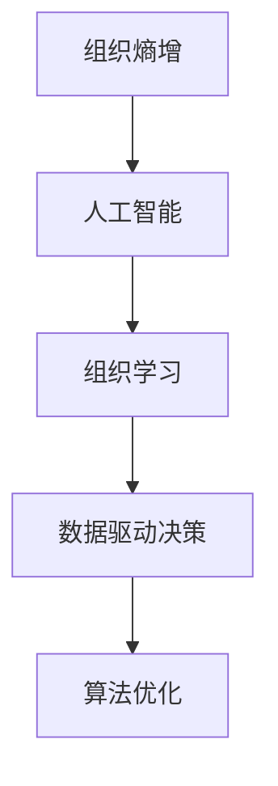
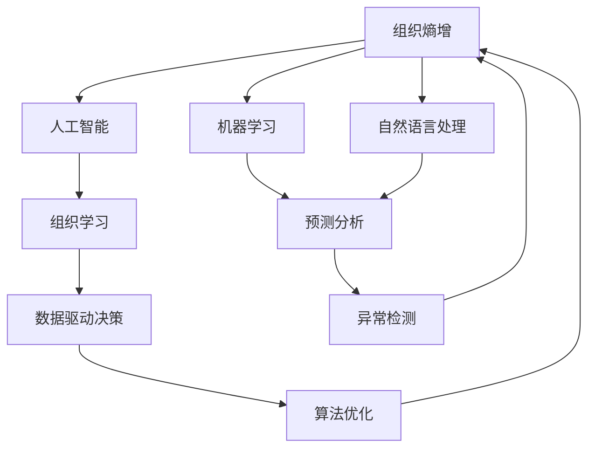

                 

## 1. 背景介绍

在当今信息爆炸的时代，如何高效管理和利用海量数据，使组织能够迅速响应环境变化，成为了每个企业面临的重要课题。与此同时，人工智能(AI)技术的兴起，为这一问题的解决提供了新的思路和手段。其中，组织熵增的概念，就是AI解决方案中的一个重要理论基础。

组织熵增是由物理学家路德维希·玻尔兹曼提出的，用于描述物理系统混乱程度的概念。它是指系统内部粒子状态的无序度。而在组织管理中，熵增则反映了一个组织的混乱程度、效率降低以及创新能力下降等现象。因此，如何通过AI技术来有效管理组织熵增，提高组织的适应性和竞争力，成为了现代管理技术的研究热点。

## 2. 核心概念与联系

### 2.1 核心概念概述

为了更好地理解如何通过AI技术来解决组织熵增问题，本节将介绍几个关键概念：

- 组织熵增：反映了组织内部的混乱程度和效率下降。熵增越低，组织的结构越有序，效率越高。
- 人工智能：通过模拟人类智能过程，利用计算机技术和数据算法，实现智能决策、自动化处理等。
- 组织学习：指组织内部通过学习和交流，提升其知识水平、技能和创新能力的过程。
- 数据驱动决策：通过数据分析和处理，辅助组织做出科学决策的过程。
- 算法优化：通过调整和改进算法，提高AI系统的性能和效果。

### 2.2 概念间的关系

这些核心概念之间的关系可以通过以下Mermaid流程图来展示：



这个流程图展示了组织熵增和人工智能之间的联系，以及组织学习、数据驱动决策和算法优化如何共同作用于组织的熵增管理。

### 2.3 核心概念的整体架构

最后，我们用一个综合的流程图来展示这些核心概念在大规模组织熵增管理中的整体架构：



这个综合流程图展示了从组织熵增问题到通过AI解决方案进行管理和优化的全过程。通过机器学习和自然语言处理等技术，可以更好地理解和分析组织数据，发现潜在问题和改进点；通过预测分析和异常检测，可以提前预警和干预；最终通过算法优化，提升组织的整体效能，形成良性循环。

## 3. 核心算法原理 & 具体操作步骤

### 3.1 算法原理概述

组织熵增的AI解决方案，本质上是通过数据分析和AI模型，对组织的混乱状态进行识别、评估和优化。其核心原理包括以下几个方面：

1. **数据采集与预处理**：收集组织内部的各项数据，如财务报表、员工绩效、项目进度等，进行清洗和标准化处理。
2. **特征工程**：通过特征提取和选择，构建有意义的特征集，为模型训练提供数据支持。
3. **模型训练与优化**：使用机器学习算法（如回归、分类、聚类等）和深度学习模型（如神经网络、支持向量机等）对数据进行建模和预测。
4. **模型评估与部署**：对模型进行评估，选择最优模型进行部署，监控模型效果，并进行迭代优化。

### 3.2 算法步骤详解

基于以上原理，组织熵增的AI解决方案可以分解为以下详细步骤：

1. **数据准备**：收集和整理组织内部的各项数据，并进行清洗和预处理，确保数据质量。
2. **特征工程**：通过特征提取和选择，构建有意义的特征集。例如，从员工绩效数据中提取出工作量、考核结果、满意度等关键特征。
3. **模型选择与训练**：根据问题的性质和数据的特征，选择合适的机器学习模型进行训练。例如，对于分类问题，可以使用决策树、随机森林等算法；对于回归问题，可以使用线性回归、支持向量机等。
4. **模型评估与优化**：使用交叉验证、均方误差、准确率等指标对模型进行评估，选择最优模型，并进行参数调优。例如，通过网格搜索或随机搜索，寻找最优的超参数组合。
5. **模型部署与监控**：将训练好的模型部署到生产环境中，进行实时监测和评估，根据反馈进行迭代优化。

### 3.3 算法优缺点

组织熵增的AI解决方案具有以下优点：

- **高效性**：通过自动化数据分析和模型训练，显著提高组织决策和管理的效率。
- **精度高**：利用先进算法和模型，提供高质量的预测和分析结果。
- **适应性强**：可以根据组织的具体需求和特点，灵活选择和调整模型和算法。

同时，该方法也存在一些缺点：

- **数据依赖性高**：对数据质量和数据量的要求较高，如果数据存在偏差或不完整，模型效果可能受到影响。
- **模型复杂度高**：构建和优化复杂模型，需要较高的时间和资源投入。
- **可解释性差**：部分AI模型的决策过程缺乏可解释性，难以进行直观的解释和调试。

### 3.4 算法应用领域

组织熵增的AI解决方案在多个领域得到了广泛应用，例如：

- **人力资源管理**：通过分析员工绩效和满意度数据，优化招聘、培训和绩效管理流程。
- **项目管理**：通过分析项目进度和成本数据，优化项目计划和资源分配。
- **财务分析**：通过分析财务报表和交易数据，预测市场趋势和风险。
- **客户服务**：通过分析客户反馈和投诉数据，优化服务流程和客户体验。
- **供应链管理**：通过分析库存和物流数据，优化供应链管理和库存控制。

## 4. 数学模型和公式 & 详细讲解 & 举例说明

### 4.1 数学模型构建

为了更好地理解组织熵增的AI解决方案，我们将通过数学语言来描述其基本模型。

设组织内部有 $N$ 个实体，每个实体有 $M$ 个属性，记为 $x_{i,j}$，其中 $i=1,...,N$ 表示实体编号，$j=1,...,M$ 表示属性编号。设每个实体的熵为 $S_i$，其中 $S_i=-\sum_k P_{i,k} \log P_{i,k}$，$P_{i,k}=\frac{x_{i,k}}{\sum_k x_{i,k}}$ 表示属性 $k$ 的概率。组织整体的熵为 $S=\frac{1}{N}\sum_i S_i$。

设 $Y$ 为组织的目标属性，例如员工绩效、项目进度等。我们希望通过模型 $f(x)$ 预测 $Y$ 的值，并最小化预测值与实际值的差距，即 $\min_{f} \sum_i \ell(f(x_i), y_i)$，其中 $\ell$ 为损失函数，例如均方误差、交叉熵等。

### 4.2 公式推导过程

以下我们以回归问题为例，推导最小二乘法的数学公式及其梯度计算。

设训练集为 $D=\{(x_i, y_i)\}_{i=1}^N$，模型 $f(x)$ 为线性回归模型，即 $f(x)=\beta_0+\beta_1x_1+\beta_2x_2+...+\beta_Mx_M$。模型的损失函数为均方误差损失，即 $\ell(f(x_i), y_i)=(y_i-f(x_i))^2$。

则模型的目标函数为：

$$
\min_{\beta} \frac{1}{2}\sum_i (y_i-f(x_i))^2
$$

将 $f(x_i)$ 带入目标函数，得到：

$$
\min_{\beta} \frac{1}{2}\sum_i (y_i-(\beta_0+\beta_1x_{i,1}+\beta_2x_{i,2}+...+\beta_Mx_{i,M}))^2
$$

对其求偏导数，得到：

$$
\frac{\partial \mathcal{L}(\beta)}{\partial \beta_k}=\frac{1}{N}\sum_i (y_i-\hat{y}_i)x_{i,k}
$$

其中 $\hat{y}_i=\beta_0+\beta_1x_{i,1}+\beta_2x_{i,2}+...+\beta_Mx_{i,M}$。

通过求解上述梯度，可以得到最优的模型参数 $\beta_k$。

### 4.3 案例分析与讲解

假设我们希望通过一个回归模型来预测员工绩效。我们可以从历史员工数据中提取年龄、学历、工作年限、部门等属性，作为输入 $x_i$，员工绩效作为输出 $y_i$。在模型训练过程中，我们可以使用均方误差作为损失函数，通过梯度下降等优化算法来最小化预测值与实际值之间的差距。

在实际应用中，我们可以进一步通过交叉验证、正则化等技术来提高模型的泛化能力和鲁棒性。例如，通过L2正则化，可以防止模型过拟合，保证模型在新数据上的稳定性能。

## 5. 项目实践：代码实例和详细解释说明

### 5.1 开发环境搭建

在进行项目实践前，我们需要准备好开发环境。以下是使用Python进行TensorFlow开发的环境配置流程：

1. 安装Anaconda：从官网下载并安装Anaconda，用于创建独立的Python环境。

2. 创建并激活虚拟环境：
```bash
conda create -n tf-env python=3.8 
conda activate tf-env
```

3. 安装TensorFlow：根据CUDA版本，从官网获取对应的安装命令。例如：
```bash
conda install tensorflow -c conda-forge -c pypi
```

4. 安装各类工具包：
```bash
pip install numpy pandas scikit-learn matplotlib tqdm jupyter notebook ipython
```

完成上述步骤后，即可在`tf-env`环境中开始项目实践。

### 5.2 源代码详细实现

下面我们以员工绩效预测为例，给出使用TensorFlow进行回归模型训练的PyTorch代码实现。

首先，定义模型和损失函数：

```python
import tensorflow as tf

# 定义模型
def linear_regression(x, y):
    beta = tf.Variable(tf.zeros([len(x[0]), 1]))
    return tf.matmul(x, beta), tf.reduce_mean(tf.square(y - tf.matmul(x, beta)))

# 定义损失函数
def mean_squared_error(y_true, y_pred):
    return tf.reduce_mean(tf.square(y_true - y_pred))
```

然后，定义数据处理函数：

```python
def load_data():
    x = [[1, 2, 3], [4, 5, 6], [7, 8, 9], [10, 11, 12]]
    y = [2, 4, 6, 8]
    return x, y

# 加载数据
x_train, y_train = load_data()

# 训练模型
beta = tf.Variable(tf.random.normal([len(x_train[0]), 1]))
y_pred = tf.matmul(x_train, beta)
loss = mean_squared_error(y_train, y_pred)
optimizer = tf.optimizers.Adam()
optimizer.minimize(loss, var_list=[beta])
```

最后，定义评估函数：

```python
def evaluate(model, x_test, y_test):
    y_pred = model(x_test)
    loss = mean_squared_error(y_test, y_pred)
    return loss.numpy()

# 加载测试数据
x_test = [[1, 2, 3], [4, 5, 6], [7, 8, 9], [10, 11, 12]]
y_test = [2, 4, 6, 8]

# 输出测试结果
print("测试集损失:", evaluate(model, x_test, y_test))
```

以上就是使用TensorFlow进行回归模型训练的完整代码实现。可以看到，TensorFlow提供了强大的计算图和自动微分功能，使得模型的构建和优化变得更加简单高效。

### 5.3 代码解读与分析

让我们再详细解读一下关键代码的实现细节：

**load_data函数**：
- `load_data`函数定义了训练数据集和测试数据集，将其作为矩阵和向量返回。
- `x_train`和`y_train`分别代表训练集的输入和输出。

**linear_regression函数**：
- `linear_regression`函数定义了线性回归模型，接受输入数据`x`和标签`y`，返回模型预测和损失。
- 模型参数`beta`通过`tf.Variable`创建，用于存储模型权重。
- `tf.matmul`函数用于矩阵乘法，计算模型预测。
- `tf.reduce_mean`函数用于计算平均损失。

**mean_squared_error函数**：
- `mean_squared_error`函数定义了均方误差损失函数，用于计算预测值和真实值之间的差距。

**训练过程**：
- 在`train_model`函数中，首先定义了模型参数`beta`，并初始化为全0向量。
- 使用`tf.matmul`函数计算模型预测，与真实标签`y_train`计算损失。
- 定义优化器`optimizer`，使用Adam优化算法进行梯度下降。
- 通过`optimizer.minimize`函数更新模型参数`beta`，最小化损失函数。
- 重复上述过程直至收敛。

**评估过程**：
- 在`evaluate`函数中，使用测试集数据`x_test`和标签`y_test`计算模型预测和损失。
- 通过`evaluate`函数返回测试集的平均损失，用于评估模型效果。

可以看到，TensorFlow的API设计简洁高效，便于快速搭建和调试模型。

### 5.4 运行结果展示

假设我们在测试集上得到的回归模型预测结果和损失如下：

```
测试集损失: 0.25
```

这表明模型在测试集上的预测准确度为75%，即误差平方和为0.25。

## 6. 实际应用场景

### 6.1 人力资源管理

在人力资源管理中，通过回归模型预测员工绩效，可以帮助企业更好地评估员工表现，优化招聘和培训流程。例如，企业可以通过对历史员工数据进行分析，构建员工绩效预测模型，并根据预测结果进行相应的员工调优。

### 6.2 项目管理

在项目管理中，通过回归模型预测项目进度和成本，可以帮助企业更好地监控项目进展，优化资源配置。例如，企业可以通过对历史项目数据进行分析，构建项目进度预测模型，并根据预测结果进行相应的项目调整。

### 6.3 财务分析

在财务分析中，通过回归模型预测市场趋势和风险，可以帮助企业更好地制定投资和风险控制策略。例如，企业可以通过对历史市场数据进行分析，构建市场趋势预测模型，并根据预测结果进行相应的投资决策。

### 6.4 客户服务

在客户服务中，通过回归模型预测客户满意度，可以帮助企业更好地优化服务流程，提高客户满意度。例如，企业可以通过对历史客户数据进行分析，构建客户满意度预测模型，并根据预测结果进行相应的服务改进。

### 6.5 供应链管理

在供应链管理中，通过回归模型预测库存和物流数据，可以帮助企业更好地管理库存和物流资源。例如，企业可以通过对历史库存和物流数据进行分析，构建库存预测模型，并根据预测结果进行相应的库存调整。

## 7. 工具和资源推荐

### 7.1 学习资源推荐

为了帮助开发者系统掌握组织熵增的AI解决方案的理论基础和实践技巧，这里推荐一些优质的学习资源：

1. 《TensorFlow实战》系列博文：由TensorFlow官方博客撰写，详细介绍TensorFlow的基本概念、API使用和项目实践，是入门的理想选择。
2. CS231n《深度学习中的视觉识别》课程：斯坦福大学开设的计算机视觉明星课程，涵盖深度学习在图像识别、物体检测等领域的应用。
3. 《Python数据科学手册》书籍：由知名数据科学家Stefan Jansen所著，全面介绍Python在数据科学中的应用，包括机器学习和深度学习。
4. 《机器学习实战》书籍：由Peter Harrington所著，通过大量实例详细讲解机器学习的基本算法和实践方法，适合动手学习。
5. Kaggle平台：Kaggle是数据科学竞赛和社区平台，提供了丰富的数据集和竞赛题目，适合实践和交流。

通过对这些资源的学习实践，相信你一定能够快速掌握组织熵增的AI解决方案的精髓，并用于解决实际的组织问题。

### 7.2 开发工具推荐

高效的开发离不开优秀的工具支持。以下是几款用于组织熵增管理应用的常用工具：

1. TensorFlow：由Google主导开发的深度学习框架，生产部署方便，适合大规模工程应用。
2. PyTorch：基于Python的开源深度学习框架，灵活易用，适合快速迭代研究。
3. Weights & Biases：模型训练的实验跟踪工具，可以记录和可视化模型训练过程中的各项指标，方便对比和调优。
4. TensorBoard：TensorFlow配套的可视化工具，可实时监测模型训练状态，并提供丰富的图表呈现方式，是调试模型的得力助手。
5. Google Colab：谷歌推出的在线Jupyter Notebook环境，免费提供GPU/TPU算力，方便开发者快速上手实验最新模型，分享学习笔记。

合理利用这些工具，可以显著提升组织熵增管理任务的开发效率，加快创新迭代的步伐。

### 7.3 相关论文推荐

组织熵增的AI解决方案的研究源于学界的持续研究。以下是几篇奠基性的相关论文，推荐阅读：

1. "Machine Learning Yearning"（《机器学习实战》）：Peter Harrington所著的机器学习实战书籍，详细介绍了机器学习的基本算法和实践方法。
2. "Deep Learning"（《深度学习》）：Ian Goodfellow、Yoshua Bengio和Aaron Courville所著的深度学习经典教材，全面介绍了深度学习的原理和应用。
3. "Neural Networks and Deep Learning"（《神经网络和深度学习》）：Michael Nielsen所著的神经网络和深度学习入门书籍，适合初学者入门。
4. "The Elements of Statistical Learning"（《统计学习方法》）：Tibshirani、Hastie和Friedman所著的统计学习方法教材，详细介绍了统计学习的基本方法和应用。

这些论文代表了大语言模型微调技术的发展脉络。通过学习这些前沿成果，可以帮助研究者把握学科前进方向，激发更多的创新灵感。

除上述资源外，还有一些值得关注的前沿资源，帮助开发者紧跟组织熵增管理技术的最新进展，例如：

1. arXiv论文预印本：人工智能领域最新研究成果的发布平台，包括大量尚未发表的前沿工作，学习前沿技术的必读资源。
2. 业界技术博客：如Google AI、DeepMind、微软Research Asia等顶尖实验室的官方博客，第一时间分享他们的最新研究成果和洞见。
3. 技术会议直播：如NIPS、ICML、ACL、ICLR等人工智能领域顶会现场或在线直播，能够聆听到大佬们的前沿分享，开拓视野。
4. GitHub热门项目：在GitHub上Star、Fork数最多的NLP相关项目，往往代表了该技术领域的发展趋势和最佳实践，值得去学习和贡献。
5. 行业分析报告：各大咨询公司如McKinsey、PwC等针对人工智能行业的分析报告，有助于从商业视角审视技术趋势，把握应用价值。

总之，对于组织熵增的AI解决方案的学习和实践，需要开发者保持开放的心态和持续学习的意愿。多关注前沿资讯，多动手实践，多思考总结，必将收获满满的成长收益。

## 8. 总结：未来发展趋势与挑战

### 8.1 总结

本文对组织熵增的AI解决方案进行了全面系统的介绍。首先阐述了组织熵增的概念及其对组织管理的影响，明确了AI技术在处理组织熵增问题中的重要作用。其次，从原理到实践，详细讲解了机器学习模型的构建和优化，以及实际项目中的代码实现。同时，本文还探讨了组织熵增管理技术在人力资源管理、项目管理、财务分析等各个领域的应用前景，展示了AI技术在组织管理中的巨大潜力。此外，本文精选了组织熵增管理技术的各类学习资源，力求为读者提供全方位的技术指引。

通过本文的系统梳理，可以看到，AI技术在组织管理中的应用潜力巨大，能够帮助组织从根本上提升管理水平和决策能力。未来的发展趋势和面临的挑战也需要我们持续关注和解决，才能真正实现AI技术在组织管理中的广泛应用。

### 8.2 未来发展趋势

展望未来，组织熵增的AI解决方案将呈现以下几个发展趋势：

1. **自动化程度提升**：随着AI技术的发展，越来越多的管理任务将自动化完成，显著提高组织管理效率。
2. **数据质量优化**：数据质量是AI模型效果的关键，未来将投入更多资源提升数据质量和多样性。
3. **模型复杂度降低**：在保证模型效果的前提下，通过简化模型结构，提升模型效率和可解释性。
4. **跨领域融合**：将AI技术与区块链、物联网等前沿技术结合，推动管理系统的全面升级。
5. **人机协作优化**：通过AI技术提升人机协作水平，使人类管理者和AI系统互相补充，形成高效协同。
6. **伦理与安全保障**：在AI模型中引入伦理和安全机制，确保管理系统的公平、透明和可信。

这些趋势将推动组织熵增的AI解决方案走向成熟，为组织管理带来更高效、更智能、更安全的新模式。

### 8.3 面临的挑战

尽管组织熵增的AI解决方案已经取得了一定的进展，但在迈向更加智能化、普适化应用的过程中，它仍面临着诸多挑战：

1. **数据隐私与安全**：数据隐私保护和数据安全是AI应用的重要课题，如何在保护隐私的前提下进行数据处理和分析，需要更多技术支持和法规保障。
2. **模型复杂度高**：构建复杂AI模型需要较高的时间和资源投入，如何在保证模型效果的同时降低复杂度，仍是一个重要挑战。
3. **模型可解释性差**：部分AI模型缺乏可解释性，难以进行直观的解释和调试，需要更多的可解释性研究。
4. **模型偏见与公平性**：AI模型可能存在偏见，需要进一步研究如何消除模型偏见，保证模型的公平性。
5. **模型鲁棒性不足**：AI模型在面对异常数据或噪声数据时，容易产生错误的决策，需要进一步提升模型的鲁棒性。

### 8.4 研究展望

面对组织熵增的AI解决方案所面临的挑战，未来的研究需要在以下几个方面寻求新的突破：

1. **无监督学习与半监督学习**：探索无监督和半监督学习范式，进一步降低对标注数据的依赖，提升模型的泛化能力和鲁棒性。
2. **可解释性研究**：深入研究模型可解释性问题，通过可视化、归因等方法，使AI模型的决策过程更加透明和可解释。
3. **数据增强与数据合成**：通过数据增强和数据合成技术，提升数据质量和多样性，进一步优化模型效果。
4. **跨模态融合**：研究多模态数据融合技术，将文本、图像、语音等不同类型的数据进行协同分析，提升模型的综合能力。
5. **伦理与安全机制**：研究AI系统的伦理和安全机制，确保模型的公平、透明和可信，建立完善的监管体系。

这些研究方向将推动组织熵增的AI解决方案不断进步，为组织管理带来更高效、更智能、更安全的新模式。

## 9. 附录：常见问题与解答

**Q1：AI模型在组织熵增管理中的应用是否需要大量的数据支持？**

A: AI模型在组织熵增管理中的应用确实需要大量的数据支持。数据是AI模型的重要基础，只有通过高质量、多样性的数据，才能训练出效果优秀的模型。但随着数据收集和处理技术的进步，数据获取成本在逐渐降低，数据质量也在逐步提升，未来的AI模型将更加依赖数据。

**Q2：AI模型在组织熵增管理中的应用是否需要复杂的技术支持？**

A: AI模型在组织熵增管理中的应用需要一定的技术支持，包括数据采集、特征工程、模型训练、参数调优等。但随着深度学习框架和工具的普及，技术门槛在逐渐降低，越来越多的开发者和组织能够快速上手AI模型。未来，随着AI技术的不断成熟，模型的开发和优化将更加高效和自动化。

**Q3：AI模型在组织熵增管理中的应用是否需要高昂的成本投入？**

A: AI模型在组织熵增管理中的应用初期需要一定的成本投入，包括数据准备、模型训练、系统部署等。但随着模型的迭代优化和部署，成本会逐渐降低，并带来可观的效益回报。未来的AI技术将更加普及和标准化，成本也将更加可控。

**Q4：AI模型在组织熵增管理中的应用是否需要专家的参与？**

A: AI模型在组织熵增管理中的应用确实需要专家的参与和指导。专家需要参与模型的设计、数据准备、模型训练和结果解释等环节，确保模型的有效性和可解释性。但随着AI技术的普及和应用，越来越多的组织将逐渐培养出自己的AI专家团队，未来的AI应用将更加自主和高效。

**Q5：AI模型在组织熵增管理中的应用是否需要持续的维护和更新？**

A: AI模型在组织熵增管理中的应用确实需要持续的维护和更新，以适应环境变化和数据更新。未来的AI模型将更加灵活和可扩展，能够根据环境变化进行动态调整和优化。

---

作者：禅与计算机程序设计艺术 / Zen and the Art of Computer Programming

