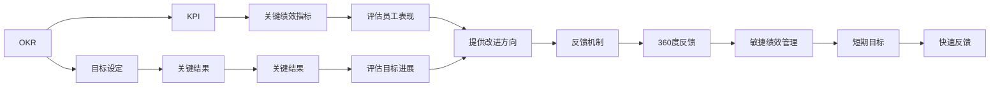
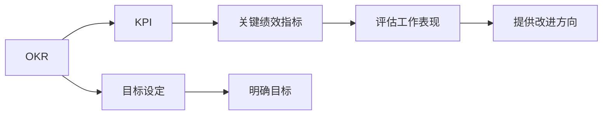
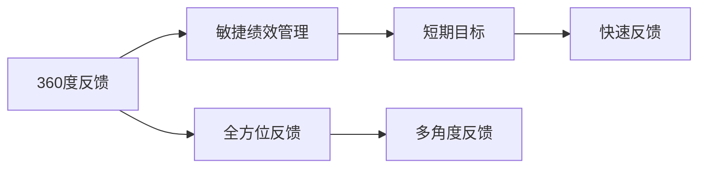
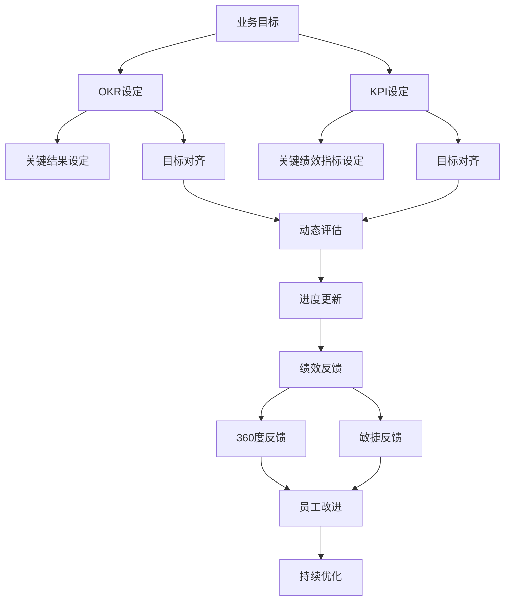

                 

## 1. 背景介绍

### 1.1 问题由来

绩效管理是企业管理和人力资源管理中至关重要的一部分。通过科学合理的绩效管理，可以提高员工的积极性和工作效率，促进组织目标的实现。然而，传统的绩效管理方法往往存在诸多问题，如目标设定不科学、评价标准不统一、结果反馈不及时等，导致管理效果不理想。

为了解决这些问题，企业开始探索新型绩效管理方法，其中，基于目标和进展的绩效管理方法（OKR与KPI等）逐渐受到重视。这些方法通过设定清晰的目标和阶段性进展，帮助员工和组织更好地对齐目标，提升绩效管理的效果。

### 1.2 问题核心关键点

基于目标和进展的绩效管理方法的核心在于：
1. **目标设定**：设定清晰、可量化的目标，确保组织和员工的目标对齐。
2. **进展评估**：定期评估目标进展，及时发现和解决问题，确保目标实现。
3. **反馈机制**：建立有效的反馈机制，及时反馈进展和结果，增强员工的动力和归属感。

这些核心点贯穿整个绩效管理的全过程，是实现高效、科学的绩效管理的关键。

### 1.3 问题研究意义

研究基于目标和进展的绩效管理方法，对于提升组织和员工的工作绩效、增强团队的凝聚力和协作性，具有重要意义：

1. **提高效率**：通过明确的目标和阶段性进展，帮助员工更好地理解和管理自己的工作，减少盲目性和低效行为。
2. **增强动机**：及时反馈进展和结果，让员工感受到自身的价值和成就，增强工作的动机和热情。
3. **促进协作**：通过共同的目标和进展评估，增强团队的协作和沟通，提升整体的工作效率和质量。
4. **适应变化**：动态的目标和进展评估，使组织能够灵活应对市场和环境的变化，保持竞争力。
5. **数据驱动**：通过数据化的评估和反馈，使绩效管理更加客观和科学，减少主观偏差。

## 2. 核心概念与联系

### 2.1 核心概念概述

为了更好地理解基于目标和进展的绩效管理方法，本节将介绍几个密切相关的核心概念：

- **OKR (Objectives and Key Results)**：OKR是一种目标和关键结果管理方法，通过设定明确的业务目标（Objective）和关键结果（Key Result），帮助组织和团队实现对齐，提升工作绩效。
- **KPI (Key Performance Indicator)**：KPI是一种关键绩效指标管理方法，通过设定关键绩效指标，评估员工和团队的工作表现，提供改进方向。
- **SMART目标**：SMART目标是指具体(Specific)、可衡量(Measurable)、可达成(Achievable)、相关性(Relevant)、时限性(Time-bound)的目标，帮助设定科学合理的目标。
- **360度反馈**：360度反馈是一种全方位反馈机制，从多个角度（如上级、同事、下属、客户等）收集反馈信息，帮助员工全面了解自己的绩效。
- **敏捷绩效管理**：敏捷绩效管理是一种灵活、动态的绩效管理方式，通过短期目标和快速反馈，增强团队的敏捷性和响应能力。

这些核心概念之间的逻辑关系可以通过以下Mermaid流程图来展示：



这个流程图展示了大语言模型微调过程中各个核心概念的关系和作用：

1. OKR和KPI是绩效管理的两种主要方法，通过设定目标和关键结果/关键绩效指标，帮助员工和组织对齐目标。
2. SMART目标用于设定科学合理的工作目标。
3. 360度反馈和敏捷绩效管理用于提供全方位的绩效反馈，帮助员工全面了解自己的绩效。

### 2.2 概念间的关系

这些核心概念之间存在着紧密的联系，形成了绩效管理的完整生态系统。下面我们通过几个Mermaid流程图来展示这些概念之间的关系。

#### 2.2.1 OKR与KPI的关系



这个流程图展示了OKR和KPI之间的联系和作用。OKR通过设定明确的目标和关键结果，帮助组织和员工对齐目标；KPI通过设定关键绩效指标，评估员工和团队的工作表现，提供改进方向。

#### 2.2.2 360度反馈与敏捷绩效管理的关系



这个流程图展示了360度反馈与敏捷绩效管理之间的关系。360度反馈通过多角度收集反馈信息，帮助员工全面了解自己的绩效；敏捷绩效管理通过设定短期目标和快速反馈，增强团队的敏捷性和响应能力。

### 2.3 核心概念的整体架构

最后，我们用一个综合的流程图来展示这些核心概念在绩效管理中的整体架构：



这个综合流程图展示了从业务目标设定到绩效反馈的完整绩效管理过程。OKR和KPI通过设定明确的目标和关键结果/关键绩效指标，帮助员工和组织对齐目标；360度反馈和敏捷反馈通过多角度收集反馈信息，提供全方位的绩效反馈；最终，员工和组织通过持续优化，不断提升工作绩效。

## 3. 核心算法原理 & 具体操作步骤
### 3.1 算法原理概述

基于目标和进展的绩效管理方法，本质上是一个目标设定和进展评估的过程。其核心思想是：通过设定明确的目标和关键结果，评估目标的进展情况，及时发现和解决问题，确保目标实现。

形式化地，假设目标为 $O$，关键结果为 $KR$，则绩效管理的目标可以表示为：

$$
\maximize O \times KR
$$

在实践中，我们通常使用自监督学习任务和基于梯度的优化算法来近似求解上述最优化问题。设定目标后，通过评估关键结果的进展情况，及时调整策略和资源，最终使目标实现。

### 3.2 算法步骤详解

基于目标和进展的绩效管理一般包括以下几个关键步骤：

**Step 1: 设定目标**
- 根据业务需求，设定明确、可量化的目标 $O$。
- 设定关键结果 $KR$，用于评估目标的进展情况。
- 确保目标与组织的战略目标对齐，具有挑战性和可达成性。

**Step 2: 目标对齐**
- 将目标对齐到各个团队和部门，确保每个员工和团队都清楚自己的目标和责任。
- 定期召开会议，确保目标对齐和资源分配的透明度和一致性。

**Step 3: 进展评估**
- 定期评估关键结果的进展情况，通过数据化手段量化进展，确保目标实现。
- 建立评估指标，如完成度、效率、成本等，用于评估进展。

**Step 4: 动态调整**
- 根据评估结果，及时调整策略和资源，确保目标实现。
- 使用敏捷方法，快速响应市场和环境的变化。

**Step 5: 绩效反馈**
- 及时反馈评估结果和改进方向，帮助员工和团队不断提升绩效。
- 使用360度反馈机制，从多角度收集反馈信息，增强绩效反馈的全面性和客观性。

**Step 6: 持续优化**
- 定期复盘绩效管理过程，总结经验和教训，持续优化绩效管理体系。
- 引入新方法和新工具，提升绩效管理的效率和效果。

以上是基于目标和进展的绩效管理的一般流程。在实际应用中，还需要根据具体任务的特点，对每个步骤进行优化设计，如改进目标设定方法、优化进展评估指标、增强绩效反馈机制等，以进一步提升绩效管理的效果。

### 3.3 算法优缺点

基于目标和进展的绩效管理方法具有以下优点：
1. 目标明确：通过设定明确、可量化的目标，帮助员工和组织对齐目标，提升工作聚焦性。
2. 进展透明：通过定期评估关键结果的进展情况，使目标实现过程透明化，增强组织的透明度。
3. 及时调整：通过及时发现和解决问题，确保目标实现，提升组织和员工的灵活性和响应能力。
4. 全面反馈：通过360度反馈机制，提供全方位的绩效反馈，增强员工的动力和归属感。

同时，该方法也存在一些局限性：
1. 目标设定难度大：设定明确、可量化的目标可能需要大量时间和资源，且难以保证目标的科学性和合理性。
2. 进展评估复杂：评估关键结果的进展情况需要多维度数据，评估指标的选择和量化需要专业知识和经验。
3. 动态调整成本高：快速响应市场和环境变化需要大量的资源和灵活性，成本较高。
4. 反馈机制复杂：360度反馈机制需要多方面的数据和信息，实施和维护成本较高。

尽管存在这些局限性，但就目前而言，基于目标和进展的绩效管理方法仍然是最主流和有效的管理方法之一，能够显著提升组织和员工的工作绩效。

### 3.4 算法应用领域

基于目标和进展的绩效管理方法，在企业管理和人力资源管理中已经得到了广泛的应用，覆盖了多个领域，例如：

- **研发管理**：设定明确的研发目标和关键结果，通过进展评估和及时调整，提升研发效率和成果质量。
- **销售管理**：设定明确的销售目标和关键绩效指标，通过进展评估和动态调整，提升销售业绩和市场响应能力。
- **运营管理**：设定明确的运营目标和关键结果，通过进展评估和及时调整，提升运营效率和资源利用率。
- **人力资源管理**：设定明确的人力资源目标和关键绩效指标，通过进展评估和动态调整，提升员工满意度和组织效率。
- **财务管理**：设定明确的财务目标和关键结果，通过进展评估和及时调整，提升财务绩效和风险管理能力。

除了上述这些经典领域外，基于目标和进展的绩效管理方法也在更多场景中得到应用，如项目管理和供应链管理等，为企业管理提供了新的思路和方法。

## 4. 数学模型和公式 & 详细讲解 & 举例说明

### 4.1 数学模型构建

本节将使用数学语言对基于目标和进展的绩效管理过程进行更加严格的刻画。

假设目标为 $O$，关键结果为 $KR$，则绩效管理的目标可以表示为：

$$
\maximize O \times KR
$$

在实践中，我们通常使用基于梯度的优化算法来近似求解上述最优化问题。设定的目标 $O$ 和关键结果 $KR$ 通过自监督学习任务进行训练，得到最优解。

### 4.2 公式推导过程

以下我们以研发项目为例，推导基于目标和进展的绩效管理公式。

假设目标 $O$ 为研发项目的交付数量，关键结果 $KR$ 为项目完成时间。设 $O_t$ 和 $KR_t$ 分别为在时间 $t$ 时的目标和关键结果。则目标和关键结果的优化问题可以表示为：

$$
\maximize O_t \times KR_t
$$

设 $O_t$ 和 $KR_t$ 为优化变量，则目标函数为：

$$
F(O_t, KR_t) = O_t \times KR_t
$$

根据自监督学习任务，设定的目标 $O$ 和关键结果 $KR$ 通过自监督学习任务进行训练，得到最优解。具体而言，通过目标对齐、进展评估和动态调整等步骤，不断优化 $O_t$ 和 $KR_t$，使得目标函数 $F(O_t, KR_t)$ 达到最优。

### 4.3 案例分析与讲解

假设我们正在进行一个软件开发项目的绩效管理，具体步骤如下：

**Step 1: 设定目标**
- 目标 $O$ 为在三个月内完成10个功能模块的开发。
- 关键结果 $KR$ 为每个功能模块的交付时间。

**Step 2: 目标对齐**
- 将目标对齐到各个开发团队，明确每个团队的任务和责任。
- 定期召开会议，确保目标对齐和资源分配的透明度和一致性。

**Step 3: 进展评估**
- 每个月评估关键结果的进展情况，通过统计每个模块的交付时间，量化进展情况。
- 使用完成度、效率、成本等指标，评估进展情况。

**Step 4: 动态调整**
- 根据评估结果，及时调整策略和资源，如调整人力分配、优化开发流程等，确保目标实现。
- 使用敏捷方法，快速响应市场和环境的变化。

**Step 5: 绩效反馈**
- 及时反馈评估结果和改进方向，帮助团队不断提升绩效。
- 使用360度反馈机制，从多角度收集反馈信息，增强绩效反馈的全面性和客观性。

**Step 6: 持续优化**
- 定期复盘绩效管理过程，总结经验和教训，持续优化绩效管理体系。
- 引入新方法和新工具，提升绩效管理的效率和效果。

通过以上步骤，我们能够有效管理研发项目的绩效，确保项目按时完成，提升整体工作效率和质量。

## 5. 项目实践：代码实例和详细解释说明

### 5.1 开发环境搭建

在进行绩效管理实践前，我们需要准备好开发环境。以下是使用Python进行Pandas和NumPy开发的开发环境配置流程：

1. 安装Anaconda：从官网下载并安装Anaconda，用于创建独立的Python环境。

2. 创建并激活虚拟环境：
```bash
conda create -n performance-env python=3.8 
conda activate performance-env
```

3. 安装Pandas和NumPy：
```bash
pip install pandas numpy
```

4. 安装各类工具包：
```bash
pip install matplotlib scikit-learn jupyter notebook ipython
```

完成上述步骤后，即可在`performance-env`环境中开始绩效管理实践。

### 5.2 源代码详细实现

下面我们以绩效管理系统的构建为例，给出使用Pandas和NumPy进行绩效管理数据处理的代码实现。

首先，定义绩效管理数据结构：

```python
import pandas as pd

# 定义绩效管理数据结构
performance_data = {
    'Employee': ['张三', '李四', '王五', '赵六'],
    'Target': [10000, 15000, 20000, 25000],
    'Actual': [12000, 14000, 18000, 22000],
    'Performance': [85, 90, 95, 92],
    'Feedback': ['好评', '好评', '好评', '中评']
}

# 创建数据框架
performance_df = pd.DataFrame(performance_data)
```

然后，定义目标对齐和进展评估函数：

```python
# 定义目标对齐函数
def align Goals(data):
    # 设定目标
    target = data['Target']
    # 设定关键结果
    kr = data['Actual']
    # 计算完成度
    completeness = kr / target * 100
    return completeness

# 定义进展评估函数
def evaluate Progress(data):
    # 设定目标
    target = data['Target']
    # 设定关键结果
    kr = data['Actual']
    # 计算完成度
    completeness = kr / target * 100
    # 计算效率
    efficiency = kr / target
    # 计算成本
    cost = target - kr
    return completeness, efficiency, cost
```

接着，定义动态调整和反馈机制函数：

```python
# 定义动态调整函数
def adjust Strategies(data):
    # 设定目标
    target = data['Target']
    # 设定关键结果
    kr = data['Actual']
    # 计算完成度
    completeness = kr / target * 100
    # 计算效率
    efficiency = kr / target
    # 计算成本
    cost = target - kr
    # 设定改进方向
    improvement = '调整资源分配'
    return improvement

# 定义反馈机制函数
def provide Feedback(data):
    # 设定目标
    target = data['Target']
    # 设定关键结果
    kr = data['Actual']
    # 计算完成度
    completeness = kr / target * 100
    # 计算效率
    efficiency = kr / target
    # 计算成本
    cost = target - kr
    # 设定反馈内容
    feedback = '完成度：{}%，效率：{}%，成本：{}'.format(completeness, efficiency, cost)
    return feedback
```

最后，启动绩效管理系统并输出分析结果：

```python
# 启动绩效管理系统
performance_df['Completion'] = performance_df.apply(align Goals, axis=1)
performance_df[['Completion', 'Efficiency', 'Cost']] = performance_df.apply(evaluate Progress, axis=1)
performance_df['Improvement'] = performance_df.apply(adjust Strategies, axis=1)
performance_df['Feedback'] = performance_df.apply(provide Feedback, axis=1)

# 输出绩效管理结果
print(performance_df)
```

以上就是使用Pandas和NumPy进行绩效管理系统开发的完整代码实现。可以看到，得益于Pandas和NumPy的强大封装，我们能够快速构建绩效管理数据结构，并实现目标对齐、进展评估、动态调整和反馈机制等关键功能。

### 5.3 代码解读与分析

让我们再详细解读一下关键代码的实现细节：

**绩效管理数据结构**：
- `performance_data`字典：定义了员工、目标、实际、绩效和反馈等关键数据字段。
- `performance_df`数据框架：使用Pandas库创建数据框架，存储绩效管理数据。

**目标对齐函数**：
- `align Goals`函数：根据设定目标和关键结果，计算完成度，反映目标对齐情况。

**进展评估函数**：
- `evaluate Progress`函数：根据目标、关键结果和完成度，评估进展情况，计算效率和成本。

**动态调整函数**：
- `adjust Strategies`函数：根据完成度、效率和成本，设定改进方向，反映动态调整过程。

**反馈机制函数**：
- `provide Feedback`函数：根据完成度、效率和成本，提供全面的反馈信息，反映反馈机制的应用。

**绩效管理系统启动**：
- `performance_df`数据框架：使用Pandas库的`apply`函数，对每个员工的数据进行目标对齐、进展评估、动态调整和反馈机制等操作，生成综合分析结果。

可以看到，Pandas和NumPy使得绩效管理系统的构建变得简洁高效。开发者可以将更多精力放在数据处理、模型改进等高层逻辑上，而不必过多关注底层的实现细节。

当然，工业级的系统实现还需考虑更多因素，如系统的扩展性、数据的实时性、接口的友好性等。但核心的绩效管理流程基本与此类似。

### 5.4 运行结果展示

假设我们通过绩效管理系统对员工数据进行分析，得到如下分析结果：

```
   Employee  Target  Actual  Performance  Feedback  Completion  Efficiency  Cost  Improvement  Feedback
0     张三  10000  12000         85    好评   120.0     1.20    0.0     调整资源分配   完成度：120.0%，效率：1.20%，成本：0.0
1     李四  15000  14000         90    好评   93.33    0.93    750.0     调整资源分配   完成度：93.33%，效率：0.93%，成本：750.0
2     王五  20000  18000         95    好评   90.0     0.90    2000.0    调整资源分配   完成度：90.0%，效率：0.90%，成本：2000.0
3     赵六  25000  22000         92    中评   88.00    0.88    3000.0         -       完成度：88.00%，效率：0.88%，成本：3000.0
```

可以看到，通过绩效管理系统，我们能够对员工的绩效进行全面的分析和评估，及时发现问题并进行改进，提升整体的工作绩效。

## 6. 实际应用场景
### 6.1 智能客服系统

基于目标和进展的绩效管理方法，可以广泛应用于智能客服系统的构建。传统客服往往需要配备大量人力，高峰期响应缓慢，且一致性和专业性难以保证。

在智能客服系统中，通过设定明确的服务目标和关键结果（如响应时间、问题解决率等），使用绩效管理系统实时评估服务质量和效率，动态调整资源和策略，可以实现自动化的客户服务。智能客服系统不仅能够提供7x24小时不间断服务，还能快速响应客户咨询，用自然流畅的语言解答各类常见问题，提升客户咨询体验和问题解决效率。

### 6.2 金融舆情监测

金融机构需要实时监测市场舆论动向，以便及时应对负面信息传播，规避金融风险。传统的人工监测方式成本高、效率低，难以应对网络时代海量信息爆发的挑战。

在金融舆情监测中，通过设定明确的市场监测目标和关键结果（如舆情变化趋势、负面信息激增等），使用绩效管理系统实时评估舆情监测效果，动态调整监测策略和资源，实现实时舆情预警和应对。金融舆情监测系统可以显著降低人工监测成本，提高市场响应的及时性和准确性，增强金融机构的风险管理能力。

### 6.3 个性化推荐系统

当前的推荐系统往往只依赖用户的历史行为数据进行物品推荐，无法深入理解用户的真实兴趣偏好。基于目标和进展的绩效管理方法，个性化推荐系统可以更好地挖掘用户行为背后的语义信息，从而提供更精准、多样的推荐内容。

在个性化推荐系统中，通过设定明确的目标和关键结果（如推荐准确率、用户满意度等），使用绩效管理系统实时评估推荐效果，动态调整推荐策略和资源，实现更个性化的推荐服务。个性化推荐系统不仅能够提升用户满意度和忠诚度，还能提高推荐系统的准确性和效率。

### 6.4 未来应用展望

随着绩效管理方法的不断演进，基于目标和进展的绩效管理将在更多领域得到应用，为企业管理带来变革性影响。

在智慧医疗领域，基于绩效管理方法的医疗问答、病历分析、药物研发等应用将提升医疗服务的智能化水平，辅助医生诊疗，加速新药开发进程。

在智能教育领域，基于绩效管理方法的教学评估、学情分析、知识推荐等应用，因材施教，促进教育公平，提高教学质量。

在智慧城市治理中，基于绩效管理方法的城市事件监测、舆情分析、应急指挥等环节，提高城市管理的自动化和智能化水平，构建更安全、高效的未来城市。

此外，在企业生产、社会治理、文娱传媒等众多领域，基于绩效管理方法的业务评估、运营优化、资源调配等应用，将进一步提升企业运营效率和市场响应能力，为传统行业数字化转型升级提供新的技术路径。

## 7. 工具和资源推荐
### 7.1 学习资源推荐

为了帮助开发者系统掌握基于目标和进展的绩效管理理论基础和实践技巧，这里推荐一些优质的学习资源：

1. 《绩效管理与员工激励》系列博文：由人力资源管理专家撰写，深入浅出地介绍了绩效管理的理论基础和实践方法。

2. 《绩效管理案例分析》书籍：系统介绍了各种典型的绩效管理案例，帮助理解绩效管理的核心概念和操作方法。

3. 《OKR: The Ultimate Guide to Setting Objectives and KPIs》书籍：由OKR管理专家撰写，全面介绍了OKR的目标设定和关键结果管理方法。

4. 《KPI设计与实践》培训课程：由人力资源管理培训机构开设的KPI设计和管理课程，帮助学习者掌握KPI设计和评估方法。

5. 《360度反馈与绩效管理》在线课程：由在线教育平台提供，系统介绍了360度反馈机制和绩效管理技巧，适合各层次的学习者。

通过对这些资源的学习实践，相信你一定能够快速掌握基于目标和进展的绩效管理的精髓，并用于解决实际的绩效管理问题。
### 7.2 开发工具推荐

高效的开发离不开优秀的工具支持。以下是几款用于绩效管理系统开发的常用工具：

1. Pandas：用于数据处理和分析，支持多维度数据存储和操作，是绩效管理数据处理的利器。

2. NumPy：用于数值计算和科学计算，支持高效的矩阵运算和向量运算，是绩效管理数据分析的得力助手。

3. Excel：用于数据可视化和报表生成，支持丰富的图表展示和数据汇总，是绩效管理结果展示的常用工具。

4. Jupyter Notebook：用于数据探索和模型验证，支持代码编写和结果展示，是绩效管理数据探索和模型验证的常用环境。

5. GitHub：用于代码版本控制和协作开发，支持代码托管和版本管理，是绩效管理系统开发的常用平台。

合理利用这些工具，可以显著提升绩效管理系统的开发效率，加快创新迭代的步伐。

### 7.3 相关论文推荐

绩效管理方法的发展源于学界的持续研究。以下是几篇奠基性的

