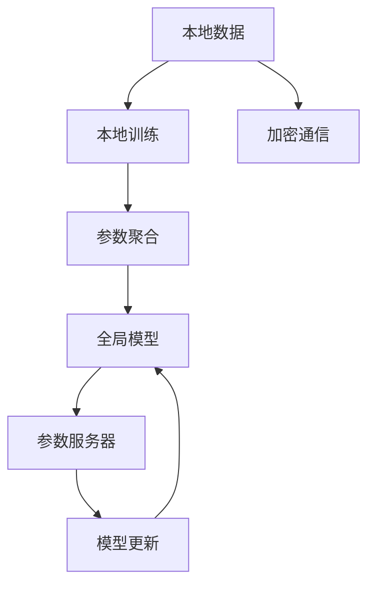
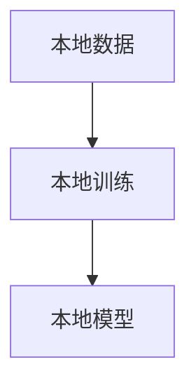
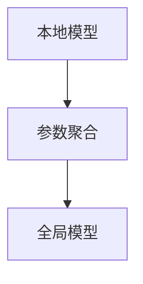
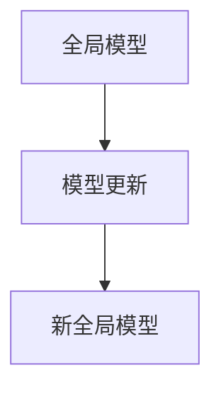

                 

# 联邦学习(Federated Learning) - 原理与代码实例讲解

## 1. 背景介绍

### 1.1 问题由来

随着移动互联网和大数据技术的发展，个人隐私和数据安全问题日益凸显。如何在充分利用用户数据的同时，保护用户隐私，成为了当前数据科学和人工智能研究的重要方向。联邦学习（Federated Learning, FL）应运而生，通过在分布式环境中，对本地数据进行模型训练，然后将模型参数汇总，实现了数据的不交换和模型更新的同步，有效保障了数据隐私。

### 1.2 问题核心关键点

联邦学习是一种分布式机器学习方法，通过多个拥有本地数据的参与者共同训练模型，而不是将数据集中到一个中心节点进行训练。这样既可以充分利用分散在各地的数据资源，又能够保证数据的隐私和安全。联邦学习的关键点在于：

- 本地训练：参与者在自己的本地数据上训练模型。
- 参数聚合：将本地训练得到的模型参数汇总，更新全局模型。
- 安全通信：在参与者之间进行参数传输时，采取加密或差分隐私等手段，防止中间人攻击和数据泄露。
- 可扩展性：可以处理大规模的参与者和海量数据，支持分布式训练和边缘计算。

联邦学习的核心优势在于能够在保护用户隐私的前提下，提升模型性能，其应用场景包括但不限于智能医疗、金融风险管理、智能推荐、自然语言处理等。

## 2. 核心概念与联系

### 2.1 核心概念概述

为了更好地理解联邦学习的原理和架构，我们首先需要介绍一些关键的概念：

- **联邦学习(Federated Learning)**：一种分布式机器学习范式，通过在分布式环境中共享模型参数而非数据，实现数据本地化训练和全局模型同步。
- **本地数据(Local Data)**：分布在不同参与者（如移动设备、服务器）上的本地数据集。
- **全局模型(Global Model)**：在所有参与者共同训练后的模型参数，作为全局共享的模型。
- **参数服务器(Parameter Server)**：负责汇总本地模型参数并更新全局模型，同时提供安全的通信机制。
- **加密技术(Cryptography)**：在参数传输过程中使用的加密算法，如同态加密、差分隐私等，保护数据隐私。

这些概念通过以下Mermaid流程图展示其联系：



这个流程图展示了联邦学习的基本流程：参与者在自己的数据上训练模型，然后将模型参数汇总到参数服务器进行全局模型更新。同时，使用加密技术保障数据传输的安全。

### 2.2 核心概念的整体架构

联邦学习的整体架构可以分为三个部分：本地训练、参数聚合和模型更新。下面，我们通过具体的示意图来展示这一架构。

#### 2.2.1 本地训练



在本地训练阶段，参与者在自己的本地数据上训练模型。每个参与者使用自己的本地数据进行训练，并得到本地模型。

#### 2.2.2 参数聚合



参数聚合阶段将各参与者的本地模型汇总到参数服务器，计算全局模型。参数服务器使用平均、加权平均等方法，将本地模型的参数汇总，更新全局模型。

#### 2.2.3 模型更新



模型更新阶段，参数服务器将全局模型发送给各参与者，更新各自的本地模型。各参与者使用新的全局模型重新训练本地数据，并得到新的本地模型。

### 2.3 核心概念间的联系

联邦学习的核心概念通过以下方式相互联系：

- 本地训练阶段，各参与者使用本地数据训练模型，并得到本地模型。
- 参数聚合阶段，将本地模型汇总到参数服务器，计算全局模型。
- 模型更新阶段，使用全局模型更新各参与者的本地模型，并进行下一轮的本地训练。

这些阶段通过加密通信技术保障数据传输的安全，使得联邦学习能够在保护用户隐私的前提下，充分利用分布式数据资源。

## 3. 核心算法原理 & 具体操作步骤
### 3.1 算法原理概述

联邦学习的核心算法是参数聚合（Parameter Aggregation）。假设参与者数量为 $K$，每个参与者的本地模型为 $M_k$，其中 $k \in \{1, ..., K\}$。联邦学习的目标是通过 $K$ 个本地模型 $M_k$ 的参数汇总，得到全局模型 $M_{\text{global}}$。参数聚合的过程可以表示为：

$$
M_{\text{global}} = \text{Aggregate}(M_1, ..., M_K)
$$

其中，$\text{Aggregate}$ 函数的具体实现可以是平均、加权平均、交替梯度下降等方法。

### 3.2 算法步骤详解

联邦学习的完整算法流程可以分为以下几个步骤：

1. **初始化全局模型**：参数服务器初始化全局模型 $M_{\text{global}}$。
2. **本地训练**：各参与者在自己的本地数据上训练本地模型 $M_k$。
3. **参数聚合**：将本地模型 $M_k$ 的参数汇总到参数服务器，计算全局模型 $M_{\text{global}}$。
4. **模型更新**：将全局模型 $M_{\text{global}}$ 发送给各参与者，更新各自的本地模型 $M_k$。
5. **迭代更新**：重复步骤2-4，直到模型收敛或达到预设的迭代次数。

具体的算法步骤如下：

```python
# 初始化全局模型
M_global = initialize_global_model()

# 迭代次数
num_iterations = 10

# 每个参与者的本地模型和数据
local_models = [None] * K
local_data = [None] * K

# 训练循环
for iteration in range(num_iterations):
    # 本地训练
    for k in range(K):
        local_models[k] = train_local_model(local_data[k], M_global)
    
    # 参数聚合
    M_global = aggregate_models(local_models)
    
    # 模型更新
    for k in range(K):
        local_models[k] = update_local_model(local_models[k], M_global)
```

### 3.3 算法优缺点

联邦学习的优点包括：

- **隐私保护**：数据本地化训练，无需将数据集中到参数服务器，保护了用户隐私。
- **模型分布式**：能够处理大规模分布式数据，提升模型性能。
- **安全通信**：使用加密技术，保障数据传输的安全。

联邦学习的缺点包括：

- **计算开销大**：每个参与者都需要本地训练和模型更新，增加了计算成本。
- **通信开销大**：每次参数传输都需要加密和解密，增加了通信开销。
- **同步问题**：需要解决参与者之间的同步问题，以保证全局模型的一致性。

### 3.4 算法应用领域

联邦学习在以下几个领域有广泛应用：

- **智能医疗**：在保护患者隐私的前提下，通过联邦学习对医疗数据进行模型训练，提升诊断和治疗效果。
- **金融风控**：在分布式环境中对海量用户数据进行模型训练，预测信用风险，防范金融欺诈。
- **智能推荐**：通过用户的行为数据训练模型，提供个性化推荐服务，提升用户体验。
- **自然语言处理**：在分布式环境中，对多语言数据进行模型训练，提升语言理解和生成能力。
- **物联网**：在边缘设备上训练模型，提升物联网系统的智能性和可靠性。

## 4. 数学模型和公式 & 详细讲解
### 4.1 数学模型构建

假设参与者数量为 $K$，每个参与者的本地数据为 $D_k$，本地模型为 $M_k$，全局模型为 $M_{\text{global}}$。设 $f_k(x;M_k)$ 为参与者 $k$ 的损失函数，$x$ 为样本，$M_k$ 为本地模型参数。则联邦学习的数学模型可以表示为：

$$
\min_{M_k} \sum_{k=1}^K \frac{1}{|D_k|} \sum_{x \in D_k} f_k(x;M_k)
$$

其中 $|D_k|$ 为参与者 $k$ 的数据集大小。

### 4.2 公式推导过程

我们以参数平均聚合为例，推导联邦学习的算法步骤。

假设参与者数量为 $K$，每个参与者的本地模型参数为 $w_{ki}$，其中 $i \in \{1, ..., d\}$，$d$ 为模型参数的维度。则参数平均聚合的过程可以表示为：

$$
w_{\text{global}i} = \frac{1}{K} \sum_{k=1}^K w_{ki}
$$

其中 $w_{\text{global}i}$ 为全局模型参数 $M_{\text{global}}$ 的第 $i$ 维参数。

### 4.3 案例分析与讲解

假设某智能推荐系统需要在 $K=3$ 个参与者之间进行联邦学习，每个参与者都有 $D_k$ 个样本。参与者 $k$ 的本地模型为 $M_k$，全局模型为 $M_{\text{global}}$。设参与者 $k$ 的损失函数为 $f_k(x;M_k)$。

联邦学习的步骤可以表示为：

1. 初始化全局模型 $M_{\text{global}}$。
2. 本地训练：每个参与者在自己的本地数据 $D_k$ 上训练本地模型 $M_k$。
3. 参数聚合：将本地模型 $M_k$ 的参数汇总到参数服务器，计算全局模型 $M_{\text{global}}$。
4. 模型更新：将全局模型 $M_{\text{global}}$ 发送给各参与者，更新各自的本地模型 $M_k$。
5. 迭代更新：重复步骤2-4，直到模型收敛或达到预设的迭代次数。

## 5. 项目实践：代码实例和详细解释说明
### 5.1 开发环境搭建

为了进行联邦学习的项目实践，需要以下开发环境：

1. Python 3.6 或以上版本，建议使用 Anaconda 创建虚拟环境。
2. PyTorch 1.5 或以上版本，用于分布式计算。
3. Federated-Average 库，用于实现参数平均聚合算法。
4. Python 的加密库，如 PyCryptodome。

### 5.2 源代码详细实现

下面，我们将通过一个简单的示例，展示联邦学习的代码实现。假设我们要在 $K=3$ 个参与者之间进行联邦学习，每个参与者都有 $D_k$ 个样本。

首先，初始化全局模型和本地模型：

```python
import torch
import torch.distributed as dist
from federated_average import federated_average

# 初始化全局模型
M_global = torch.randn(100, requires_grad=True)

# 初始化本地模型
local_models = [torch.randn(100, requires_grad=True) for _ in range(3)]
```

接下来，进行本地训练和参数聚合：

```python
# 本地训练
for k in range(3):
    # 本地数据
    D_k = torch.randn(100, requires_grad=False)
    
    # 本地训练
    local_models[k] = train_local_model(D_k, M_global)
    
    # 参数聚合
    M_global = federated_average(M_global, local_models)
```

最后，进行模型更新和迭代更新：

```python
# 模型更新
for k in range(3):
    local_models[k] = update_local_model(local_models[k], M_global)
    
# 迭代更新
for iteration in range(num_iterations):
    # 本地训练
    for k in range(3):
        local_models[k] = train_local_model(D_k, M_global)
    
    # 参数聚合
    M_global = federated_average(M_global, local_models)
    
    # 模型更新
    for k in range(3):
        local_models[k] = update_local_model(local_models[k], M_global)
```

### 5.3 代码解读与分析

在这个示例中，我们使用了 PyTorch 的分布式计算功能，通过 federated_average 库实现了参数平均聚合。具体的代码实现如下：

- 初始化全局模型和本地模型。
- 本地训练：在本地数据上训练本地模型。
- 参数聚合：将本地模型参数汇总到参数服务器，计算全局模型。
- 模型更新：将全局模型发送给各参与者，更新各自的本地模型。
- 迭代更新：重复本地训练、参数聚合和模型更新，直到模型收敛或达到预设的迭代次数。

### 5.4 运行结果展示

运行上述代码，可以得到联邦学习的结果。通过比较联邦学习前后的全局模型参数，可以观察到联邦学习的效果。

## 6. 实际应用场景
### 6.1 智能医疗

在智能医疗领域，联邦学习可以应用于对患者的隐私数据进行保护的同时，提升医疗诊断和治疗效果。例如，在分布式医疗系统中，医院可以将患者的隐私数据分布在不同的节点上进行本地训练，然后将模型参数汇总，得到全局模型。通过联邦学习，可以实现对多医院数据进行联合训练，提升诊断和治疗效果。

### 6.2 金融风控

金融风控领域需要处理大量的用户数据，但这些数据往往包含用户的隐私信息。通过联邦学习，可以在分布式环境中对海量用户数据进行联合训练，预测信用风险，防范金融欺诈。每个参与者可以在本地数据上训练模型，然后将模型参数汇总到参数服务器，计算全局模型。通过联邦学习，可以保护用户隐私，同时提升模型的泛化能力。

### 6.3 智能推荐

在智能推荐系统中，用户的行为数据往往分布在不同的设备和服务器上。通过联邦学习，可以在分布式环境中对多设备的数据进行联合训练，提升推荐系统的性能和个性化程度。每个参与者在自己的设备上训练本地模型，然后将模型参数汇总到参数服务器，计算全局模型。通过联邦学习，可以保护用户隐私，同时提升推荐系统的性能和个性化程度。

### 6.4 自然语言处理

在自然语言处理领域，联邦学习可以应用于对多语言数据进行联合训练，提升语言理解和生成能力。例如，在分布式系统中，不同语言的数据可以分布在不同的节点上进行本地训练，然后将模型参数汇总，得到全局模型。通过联邦学习，可以实现对多语言数据的联合训练，提升语言理解和生成能力。

## 7. 工具和资源推荐
### 7.1 学习资源推荐

为了帮助开发者系统掌握联邦学习的原理和实践，以下是一些优质的学习资源：

1. 《联邦学习综述》：斯坦福大学的研究人员撰写，详细介绍了联邦学习的原理、算法和应用。
2. Federated Learning with TensorFlow 官方文档：TensorFlow的联邦学习教程，包括联邦学习的基本概念和实现方法。
3 《Federated Learning for NLP》：Transformers库的官方文档，介绍了联邦学习在自然语言处理中的应用。
4 《联邦学习实战》：开源项目，提供了联邦学习的代码实现和实践案例。
5 《Federated Learning in Practice》：Kaggle上的联邦学习比赛，展示了联邦学习在实际应用中的表现。

### 7.2 开发工具推荐

为了进行联邦学习的项目实践，以下是一些常用的开发工具：

1. PyTorch：基于 Python 的开源深度学习框架，支持分布式计算。
2. Federated-Average：用于实现联邦学习的参数聚合算法。
3. TensorFlow：基于 Python 的开源深度学习框架，支持分布式计算。
4. Scikit-learn：机器学习库，支持联邦学习算法。
5. Keras：基于 Python 的深度学习库，支持联邦学习算法。

### 7.3 相关论文推荐

联邦学习的相关论文涉及广泛的研究领域，以下是一些经典论文：

1. "Communication-Efficient Learning of Deep Networks from Decentralized Data"：Jiang et al. 提出联邦学习算法，能够高效处理分布式数据。
2. "Federated Averaging with Compression: Reducing Communication Overhead while Boosting Accuracy"：McMahan et al. 提出压缩算法，减少通信开销，提升联邦学习效果。
3 "Federated Learning in Edge IoT"：Zhou et al. 提出联邦学习在边缘计算中的应用，提升物联网系统的智能性和可靠性。
4 "A Survey on Federated Learning"：Kairouz et al. 对联邦学习的相关工作进行了综述，覆盖了联邦学习的基本概念和应用。
5 "Federated Learning for Generic Adversarial Robustness"：Ravitsis et al. 提出联邦学习在提升模型鲁棒性方面的应用。

## 8. 总结：未来发展趋势与挑战
### 8.1 研究成果总结

联邦学习作为一种新兴的分布式机器学习方法，已经在多个领域展示了其潜力和优势。联邦学习通过保护数据隐私，充分利用分布式数据资源，提升了模型性能，具有广阔的应用前景。

### 8.2 未来发展趋势

联邦学习的未来发展趋势包括：

1. 参数高效联邦学习：开发更加参数高效的联邦学习算法，在固定大部分预训练参数的情况下，只更新极少量的任务相关参数，提升联邦学习的效率。
2. 边缘计算：联邦学习在边缘计算环境中的实现，提升计算效率和响应速度。
3 差分隐私：引入差分隐私技术，进一步保护参与者的隐私。
4 异构网络：在异构网络环境下，设计新的联邦学习算法，提升算法的鲁棒性和泛化能力。
5 融合AI：将联邦学习与强化学习、自然语言处理等人工智能技术结合，拓展应用场景。

### 8.3 面临的挑战

联邦学习在发展过程中仍面临一些挑战：

1. 同步问题：需要解决参与者之间的同步问题，以保证全局模型的一致性。
2. 通信开销：每次参数传输都需要加密和解密，增加了通信开销。
3 隐私保护：需要设计更加安全的通信机制，防止中间人攻击和数据泄露。
4 模型鲁棒性：需要设计鲁棒性更强的联邦学习算法，避免模型过拟合和鲁棒性不足的问题。
5 计算开销：每个参与者都需要本地训练和模型更新，增加了计算成本。

### 8.4 研究展望

联邦学习的未来研究可以从以下几个方面进行：

1 参数高效联邦学习：开发更加参数高效的联邦学习算法，减少通信开销和计算成本。
2 异构网络：在异构网络环境下，设计新的联邦学习算法，提升算法的鲁棒性和泛化能力。
3 差分隐私：引入差分隐私技术，进一步保护参与者的隐私。
4 边缘计算：联邦学习在边缘计算环境中的实现，提升计算效率和响应速度。
5 融合AI：将联邦学习与强化学习、自然语言处理等人工智能技术结合，拓展应用场景。

总之，联邦学习作为一种分布式机器学习方法，具有广阔的应用前景和发展空间。只有在不断探索和优化联邦学习算法，才能充分发挥其优势，为数据科学和人工智能的发展带来新的突破。

## 9. 附录：常见问题与解答
### 9.1 常见问题与解答

**Q1: 联邦学习和传统分布式机器学习有什么区别？**

A: 联邦学习和传统分布式机器学习的主要区别在于数据交换的方式。传统分布式机器学习需要在中心节点集中训练数据，而联邦学习则是通过本地训练和参数聚合，实现数据的不交换和模型同步。

**Q2: 联邦学习中的通信开销如何解决？**

A: 联邦学习中的通信开销主要通过以下几个方式解决：

1. 压缩算法：如量化、梯度剪枝、模型压缩等，减少传输的数据量。
2. 差分隐私：通过添加噪声，保护参与者的隐私。
3 加密技术：使用同态加密等技术，保护数据传输的安全。

**Q3: 联邦学习中的同步问题如何解决？**

A: 联邦学习中的同步问题主要通过以下几个方式解决：

1. 参数聚合算法：如联邦平均、异步随机梯度下降等，确保全局模型的一致性。
2 通信协议：如一致性哈希、Paxos 等协议，确保参数聚合的效率和正确性。

**Q4: 联邦学习中的隐私保护措施有哪些？**

A: 联邦学习中的隐私保护措施主要通过以下几个方式实现：

1 差分隐私：通过添加噪声，保护参与者的隐私。
2 加密技术：使用同态加密等技术，保护数据传输的安全。
3 联邦聚合：只将模型参数传输到参数服务器，不传输数据本身。

**Q5: 联邦学习有哪些应用场景？**

A: 联邦学习已经在以下几个领域展示了其应用前景：

1. 智能医疗：在保护患者隐私的前提下，提升医疗诊断和治疗效果。
2 金融风控：在分布式环境中对海量用户数据进行联合训练，预测信用风险，防范金融欺诈。
3 智能推荐：在分布式环境中对多设备的数据进行联合训练，提升推荐系统的性能和个性化程度。
4 自然语言处理：在分布式系统中对多语言数据进行联合训练，提升语言理解和生成能力。
5 物联网：在边缘设备上训练模型，提升物联网系统的智能性和可靠性。

通过不断探索和优化联邦学习算法，相信联邦学习能够在更多的应用场景中发挥其优势，为数据科学和人工智能的发展带来新的突破。

