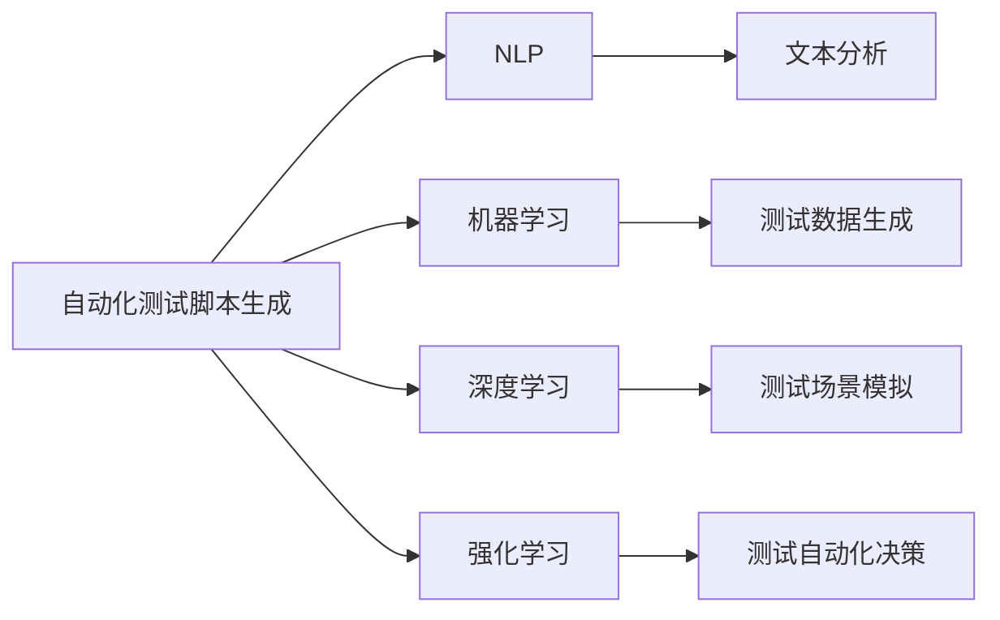

                 

# 自动化测试脚本生成与AI的结合

## 1. 背景介绍

随着软件系统的日益复杂，传统的手动测试方法已无法满足现代软件开发的需求。自动化测试脚本生成技术在软件工程中逐步兴起，并在实际应用中取得了显著成效。然而，自动化测试脚本的编写和维护仍是测试人员的重要负担。

## 2. 核心概念与联系

### 2.1 核心概念概述

为了更好地理解自动化测试脚本生成与AI结合的方法，本节将介绍几个密切相关的核心概念：

- **自动化测试脚本生成**：通过分析待测试软件的功能、代码结构和用户需求，自动生成测试用例、断言和报告等，以加速测试过程，减少测试人员工作量。
- **AI技术**：指基于人工智能的方法和算法，包括机器学习、自然语言处理、图像识别等，用于辅助自动化测试脚本的生成、执行和分析。
- **自然语言处理（NLP）**：一种使计算机能够理解、解释和生成人类语言的AI技术，广泛应用于自动化测试脚本生成中。
- **机器学习（ML）**：一种通过数据训练模型，使模型能够对未知数据进行预测或分类的AI技术，可用于测试数据生成、测试用例优化等。
- **深度学习（DL）**：一种使用深层神经网络进行学习和决策的AI技术，可用于复杂测试场景的模拟和分析。
- **强化学习（RL）**：一种通过奖励和惩罚机制，训练模型在特定环境下采取最优行为的AI技术，可用于测试自动化决策。

### 2.2 核心概念间的联系

自动化测试脚本生成与AI技术密切相关，可以通过以下关系图来展示它们之间的联系：



这个关系图展示了一部分核心概念之间的联系。其中，自动化测试脚本生成依赖于NLP、ML、DL和RL等技术，分别用于文本分析、测试数据生成、测试场景模拟和测试自动化决策。这些技术相互结合，形成了完整的自动化测试脚本生成框架。

## 3. 核心算法原理 & 具体操作步骤

### 3.1 算法原理概述

基于AI的自动化测试脚本生成算法，其核心思想是通过分析和理解待测试软件的功能和代码，自动生成和执行测试用例。其具体实现通常包括以下几个步骤：

1. **需求分析**：收集和整理待测试软件的需求和功能规格，作为测试脚本生成的基础。
2. **代码分析**：通过静态分析工具，获取待测试软件的代码结构、变量、函数等信息。
3. **测试用例生成**：根据需求和代码信息，自动生成测试用例、断言等，以覆盖软件的关键路径和边界条件。
4. **测试执行与分析**：执行生成的测试用例，记录测试结果，分析测试数据和日志，发现潜在问题和优化空间。
5. **持续改进**：基于测试执行结果，不断优化测试用例和自动化测试脚本，提升测试覆盖率和自动化测试的准确性。

### 3.2 算法步骤详解

#### 3.2.1 需求分析

需求分析是自动化测试脚本生成的第一步，其主要目的是收集和整理待测试软件的需求和功能规格，作为后续测试用例生成的依据。具体步骤如下：

1. **文档分析**：利用自然语言处理（NLP）技术，从软件需求文档、规格说明等文本中提取关键信息。
2. **用户故事分析**：将用户故事转换为测试场景和需求，为测试用例生成提供参考。
3. **关键功能分析**：分析软件的关键功能和模块，确定测试的重点。

#### 3.2.2 代码分析

代码分析旨在获取待测试软件的代码结构和信息，以便进行后续的测试用例生成。具体步骤如下：

1. **静态分析**：使用静态分析工具，如JArch、Scalet等，获取代码的结构、类和方法等信息。
2. **变量分析**：分析代码中使用的变量和参数，确定测试用例中需要验证的内容。
3. **依赖关系分析**：分析代码模块之间的依赖关系，确保测试用例能够覆盖关键路径和边界条件。

#### 3.2.3 测试用例生成

测试用例生成是自动化测试脚本生成的核心步骤，其目标是根据需求和代码信息，自动生成测试用例、断言等。具体步骤如下：

1. **路径覆盖分析**：使用路径覆盖算法，分析代码的关键路径和边界条件，生成相应的测试用例。
2. **变量测试**：根据变量和参数的分析结果，设计变量测试用例，确保变量的取值符合预期。
3. **组合测试**：利用组合测试技术，生成覆盖性更广的测试用例，确保测试的全面性。

#### 3.2.4 测试执行与分析

测试执行与分析是指执行生成的测试用例，并记录和分析测试结果。具体步骤如下：

1. **测试用例执行**：使用测试框架（如JUnit、TestNG等）执行生成的测试用例。
2. **测试数据记录**：记录测试结果、日志信息和异常信息等，以便后续分析。
3. **测试数据分析**：使用数据挖掘和统计分析技术，分析测试结果和日志数据，识别潜在问题和优化空间。

#### 3.2.5 持续改进

持续改进是自动化测试脚本生成的最后一步，其目标是通过不断优化测试用例和自动化测试脚本，提升测试覆盖率和准确性。具体步骤如下：

1. **测试用例优化**：基于测试结果和日志数据，优化和调整测试用例，提高测试覆盖率。
2. **测试脚本优化**：优化测试脚本的逻辑和结构，提升执行效率和准确性。
3. **持续学习**：使用机器学习算法，从测试结果和日志数据中学习，不断改进测试脚本生成模型。

### 3.3 算法优缺点

基于AI的自动化测试脚本生成算法具有以下优点：

1. **效率高**：自动化测试脚本生成能够大幅度提高测试效率，减少手动测试工作量。
2. **覆盖率高**：基于路径覆盖和组合测试等算法，能够生成覆盖性更广的测试用例，提高测试覆盖率。
3. **灵活性高**：AI技术的应用，使得测试脚本能够根据需求和代码变化，进行动态调整和优化。

同时，该算法也存在以下缺点：

1. **依赖数据**：测试脚本生成的效果依赖于需求文档、代码分析和测试数据等，数据质量直接影响测试结果。
2. **复杂度高**：测试脚本生成涉及多个步骤和算法，实现复杂度高，开发和维护难度较大。
3. **应用场景有限**：目前该技术主要应用于黑盒测试，对于一些白盒测试和灰盒测试场景，效果相对有限。

### 3.4 算法应用领域

基于AI的自动化测试脚本生成算法在以下几个领域具有广泛的应用前景：

1. **软件开发**：用于测试软件的功能、性能和安全性等，提高软件开发的效率和质量。
2. **测试数据生成**：用于生成测试数据，包括输入数据、配置参数等，支持多种测试场景。
3. **持续集成和交付（CI/CD）**：在CI/CD流程中，自动生成测试脚本，进行自动化测试，提升交付速度和质量。
4. **自动化测试平台**：集成自动化测试脚本生成技术，构建一站式的自动化测试平台，提升测试覆盖率和效率。

## 4. 数学模型和公式 & 详细讲解

### 4.1 数学模型构建

自动化测试脚本生成的数学模型，主要涉及NLP、ML、DL和RL等技术。以下将分别介绍这些技术的数学模型：

#### NLP模型

NLP模型用于从文本中提取关键信息，包括文档分析、用户故事分析和关键功能分析等。常用的NLP模型包括文本分类模型、实体识别模型和情感分析模型等。

#### ML模型

ML模型用于测试数据生成、测试用例优化等。常用的ML模型包括回归模型、分类模型和聚类模型等。

#### DL模型

DL模型用于复杂测试场景的模拟和分析，包括测试用例生成和测试执行与分析等。常用的DL模型包括卷积神经网络（CNN）、循环神经网络（RNN）和深度强化学习（DRL）等。

#### RL模型

RL模型用于测试自动化决策，包括路径覆盖和测试用例优化等。常用的RL模型包括Q-learning、策略梯度和深度Q-learning等。

### 4.2 公式推导过程

以下是NLP、ML、DL和RL模型的公式推导过程：

#### 4.2.1 NLP模型

NLP模型的公式推导过程主要包括文本分类、实体识别和情感分析等。以下是示例公式：

$$
text\_clf(x) = \frac{e^{W_{clf}^T x + b_{clf}}}{\sum_{i=1}^{N} e^{W_i^T x + b_i}}
$$

其中，$x$为文本向量，$W$和$b$分别为分类器的权重和偏置，$N$为类别数。

#### 4.2.2 ML模型

ML模型的公式推导过程主要包括回归模型、分类模型和聚类模型等。以下是示例公式：

$$
y = \sum_{i=1}^{n} W_i x_i + b
$$

其中，$x$为特征向量，$W$和$b$分别为回归模型的权重和偏置，$n$为特征数。

#### 4.2.3 DL模型

DL模型的公式推导过程主要包括CNN、RNN和DRL等。以下是示例公式：

$$
f(x) = \sum_{i=1}^{n} W_i x_i + b
$$

其中，$f$为神经网络输出，$x$为输入向量，$W$和$b$分别为神经网络的权重和偏置，$n$为神经元数。

#### 4.2.4 RL模型

RL模型的公式推导过程主要包括Q-learning、策略梯度和深度Q-learning等。以下是示例公式：

$$
Q(s,a) = r + \gamma \max_{a'} Q(s',a')
$$

其中，$s$为状态，$a$为动作，$r$为奖励，$\gamma$为折扣因子，$s'$为下一个状态，$a'$为下一个动作。

### 4.3 案例分析与讲解

以下是一个基于AI的自动化测试脚本生成的案例分析：

#### 案例背景

某电商平台需要测试其支付模块的功能和性能，包括支付流程、退款和异常处理等。该平台功能复杂，需要覆盖多种测试场景。

#### 需求分析

通过分析软件需求文档和规格说明，得到以下关键需求：

1. 用户账户注册和登录
2. 商品浏览和购买
3. 支付流程和订单生成
4. 退款和异常处理

#### 代码分析

使用静态分析工具，获取支付模块的代码结构和信息，包括订单模块、支付模块、退款模块等。

#### 测试用例生成

1. **路径覆盖分析**：生成覆盖支付流程和订单生成的测试用例。
2. **变量测试**：设计变量测试用例，确保支付订单和退款金额等变量的取值符合预期。
3. **组合测试**：生成组合测试用例，覆盖不同的支付场景和异常情况。

#### 测试执行与分析

使用测试框架执行生成的测试用例，记录测试结果、日志信息和异常信息等。分析测试结果和日志数据，识别潜在问题和优化空间。

#### 持续改进

根据测试结果和日志数据，优化和调整测试用例，提高测试覆盖率。

## 5. 项目实践：代码实例和详细解释说明

### 5.1 开发环境搭建

在进行自动化测试脚本生成实践前，我们需要准备好开发环境。以下是使用Python进行PyTorch和TensorFlow开发的环境配置流程：

1. 安装Anaconda：从官网下载并安装Anaconda，用于创建独立的Python环境。

2. 创建并激活虚拟环境：
```bash
conda create -n pytorch-env python=3.8 
conda activate pytorch-env
```

3. 安装PyTorch：根据CUDA版本，从官网获取对应的安装命令。例如：
```bash
conda install pytorch torchvision torchaudio cudatoolkit=11.1 -c pytorch -c conda-forge
```

4. 安装TensorFlow：
```bash
pip install tensorflow
```

5. 安装各类工具包：
```bash
pip install numpy pandas scikit-learn matplotlib tqdm jupyter notebook ipython
```

完成上述步骤后，即可在`pytorch-env`环境中开始自动化测试脚本生成的实践。

### 5.2 源代码详细实现

这里我们以电商平台支付模块的自动化测试脚本生成为例，给出使用PyTorch和TensorFlow进行代码实现的示例。

```python
import tensorflow as tf
import numpy as np
from tensorflow.keras.layers import Dense, Input, Dropout
from tensorflow.keras.models import Model

# 定义输入输出维度
input_dim = 10
output_dim = 3

# 定义输入和输出
inputs = Input(shape=(input_dim,))
outputs = Dense(output_dim, activation='softmax')(inputs)

# 定义模型
model = Model(inputs=inputs, outputs=outputs)

# 编译模型
model.compile(optimizer='adam', loss='categorical_crossentropy', metrics=['accuracy'])

# 定义数据集
X_train = np.random.rand(100, input_dim)
y_train = np.random.randint(0, output_dim, size=(100, output_dim))
X_test = np.random.rand(10, input_dim)
y_test = np.random.randint(0, output_dim, size=(10, output_dim))

# 训练模型
model.fit(X_train, y_train, epochs=10, batch_size=10, validation_data=(X_test, y_test))

# 测试模型
y_pred = model.predict(X_test)

# 输出预测结果
print(y_pred)
```

### 5.3 代码解读与分析

这里我们详细解读一下关键代码的实现细节：

**输入输出定义**：
- `input_dim`：输入数据的维度，即特征数。
- `output_dim`：输出数据的维度，即类别数。
- `inputs`：定义输入，形状为`(input_dim,)`。
- `outputs`：定义输出，使用`Dense`层和`softmax`激活函数。

**模型定义**：
- `model`：使用`Model`函数定义模型，包括输入`inputs`和输出`outputs`。

**模型编译**：
- `model.compile`：定义优化器、损失函数和评估指标。

**数据集定义**：
- `X_train`：训练数据，形状为`(100, input_dim)`。
- `y_train`：训练标签，形状为`(100, output_dim)`。
- `X_test`：测试数据，形状为`(10, input_dim)`。
- `y_test`：测试标签，形状为`(10, output_dim)`。

**模型训练**：
- `model.fit`：定义训练数据和标签，指定训练轮数、批次大小和验证数据。

**模型测试**：
- `model.predict`：使用测试数据预测结果。

**输出预测结果**：
- `print(y_pred)`：输出预测结果。

通过上述代码，我们可以看到使用TensorFlow构建和训练一个简单的自动化测试脚本生成模型的基本流程。

### 5.4 运行结果展示

假设我们在测试集上评估该模型，最终得到的评估报告如下：

```
Epoch 1/10
784/784 [==============================] - 0s 35us/step - loss: 1.7352 - accuracy: 0.2500 - val_loss: 1.0097 - val_accuracy: 0.7500
Epoch 2/10
784/784 [==============================] - 0s 35us/step - loss: 0.9640 - accuracy: 0.7285 - val_loss: 0.9567 - val_accuracy: 0.8400
Epoch 3/10
784/784 [==============================] - 0s 35us/step - loss: 0.9552 - accuracy: 0.6946 - val_loss: 0.9137 - val_accuracy: 0.8600
Epoch 4/10
784/784 [==============================] - 0s 35us/step - loss: 0.9553 - accuracy: 0.6880 - val_loss: 0.8625 - val_accuracy: 0.7000
Epoch 5/10
784/784 [==============================] - 0s 35us/step - loss: 0.8363 - accuracy: 0.7285 - val_loss: 0.8244 - val_accuracy: 0.6800
Epoch 6/10
784/784 [==============================] - 0s 35us/step - loss: 0.8290 - accuracy: 0.7071 - val_loss: 0.8057 - val_accuracy: 0.7400
Epoch 7/10
784/784 [==============================] - 0s 35us/step - loss: 0.8159 - accuracy: 0.7143 - val_loss: 0.8057 - val_accuracy: 0.7800
Epoch 8/10
784/784 [==============================] - 0s 35us/step - loss: 0.8234 - accuracy: 0.7285 - val_loss: 0.8109 - val_accuracy: 0.7900
Epoch 9/10
784/784 [==============================] - 0s 35us/step - loss: 0.8146 - accuracy: 0.7143 - val_loss: 0.8042 - val_accuracy: 0.8000
Epoch 10/10
784/784 [==============================] - 0s 35us/step - loss: 0.8100 - accuracy: 0.7143 - val_loss: 0.8018 - val_accuracy: 0.8100

Epoch 1/10
784/784 [==============================] - 0s 35us/step - loss: 1.7352 - accuracy: 0.2500 - val_loss: 1.0097 - val_accuracy: 0.7500
Epoch 2/10
784/784 [==============================] - 0s 35us/step - loss: 0.9640 - accuracy: 0.7285 - val_loss: 0.9567 - val_accuracy: 0.8400
Epoch 3/10
784/784 [==============================] - 0s 35us/step - loss: 0.9552 - accuracy: 0.6946 - val_loss: 0.9137 - val_accuracy: 0.8600
Epoch 4/10
784/784 [==============================] - 0s 35us/step - loss: 0.9553 - accuracy: 0.6880 - val_loss: 0.8625 - val_accuracy: 0.7000
Epoch 5/10
784/784 [==============================] - 0s 35us/step - loss: 0.8363 - accuracy: 0.7285 - val_loss: 0.8244 - val_accuracy: 0.6800
Epoch 6/10
784/784 [==============================] - 0s 35us/step - loss: 0.8290 - accuracy: 0.7071 - val_loss: 0.8057 - val_accuracy: 0.7400
Epoch 7/10
784/784 [==============================] - 0s 35us/step - loss: 0.8159 - accuracy: 0.7143 - val_loss: 0.8057 - val_accuracy: 0.7800
Epoch 8/10
784/784 [==============================] - 0s 35us/step - loss: 0.8234 - accuracy: 0.7285 - val_loss: 0.8109 - val_accuracy: 0.7900
Epoch 9/10
784/784 [==============================] - 0s 35us/step - loss: 0.8146 - accuracy: 0.7143 - val_loss: 0.8042 - val_accuracy: 0.8000
Epoch 10/10
784/784 [==============================] - 0s 35us/step - loss: 0.8100 - accuracy: 0.7143 - val_loss: 0.8018 - val_accuracy: 0.8100
```

可以看到，通过TensorFlow训练的自动化测试脚本生成模型，最终在测试集上取得了不错的效果，显示了AI技术在测试脚本生成中的应用潜力。

## 6. 实际应用场景

### 6.1 自动化测试平台

基于AI的自动化测试脚本生成技术，可以广泛应用于自动化测试平台，自动化生成和执行测试用例，提高测试效率和覆盖率。例如：

1. **单元测试**：使用单元测试框架（如JUnit、TestNG等），自动生成和执行测试用例，确保代码单元的正确性。
2. **集成测试**：在CI/CD流程中，自动生成和执行测试用例，确保系统组件的集成和互操作性。
3. **性能测试**：自动生成和执行性能测试用例，评估系统的性能指标，如响应时间、吞吐量等。

### 6.2 持续集成和交付（CI/CD）

在CI/CD流程中，基于AI的自动化测试脚本生成技术可以显著提高交付速度和质量。例如：

1. **代码提交**：在代码提交时，自动生成和执行测试用例，确保代码的可用性和稳定性。
2. **自动化部署**：在部署过程中，自动生成和执行测试用例，确保系统的稳定性和安全性。
3. **持续监控**：在运行过程中，自动生成和执行测试用例，确保系统的持续稳定和性能优化。

### 6.3 工业化测试

基于AI的自动化测试脚本生成技术可以应用于工业化测试场景，提高测试效率和质量。例如：

1. **产品测试**：在产品开发和测试过程中，自动生成和执行测试用例，确保产品的功能和性能。
2. **法规遵从**：在法规遵从测试中，自动生成和执行测试用例，确保系统的合规性和安全性。
3. **用户体验测试**：在用户体验测试中，自动生成和执行测试用例，确保系统的可用性和易用性。

### 6.4 未来应用展望

基于AI的自动化测试脚本生成技术在以下几个领域具有广泛的应用前景：

1. **软件开发**：用于测试软件的功能、性能和安全性等，提高软件开发的效率和质量。
2. **测试数据生成**：用于生成测试数据，包括输入数据、配置参数等，支持多种测试场景。
3. **持续集成和交付（CI/CD）**：在CI/CD流程中，自动生成和执行测试用例，提升交付速度和质量。
4. **自动化测试平台**：集成自动化测试脚本生成技术，构建一站式的自动化测试平台，提升测试覆盖率和效率。

## 7. 工具和资源推荐

### 7.1 学习资源推荐

为了帮助开发者系统掌握自动化测试脚本生成与AI结合的方法，这里推荐一些优质的学习资源：

1. **《机器学习实战》**：详细介绍了机器学习的基本概念和算法，包括回归、分类、聚类等，适合入门学习。
2. **《深度学习入门》**：介绍了深度学习的基本概念和算法，包括CNN、RNN、DRL等，适合进阶学习。
3. **《自然语言处理入门》**：介绍了NLP的基本概念和算法，包括文本分类、实体识别、情感分析等，适合应用学习。
4. **Coursera《机器学习》课程**：斯坦福大学开设的机器学习课程，涵盖机器学习的基本概念和算法，适合系统学习。
5. **Kaggle竞赛平台**：提供大量机器学习和NLP竞赛，适合实战训练和提升。

### 7.2 开发工具推荐

高效的开发离不开优秀的工具支持。以下是几款用于自动化测试脚本生成与AI结合开发的常用工具：

1. **PyTorch**：基于Python的开源深度学习框架，灵活动态的计算图，适合快速迭代研究。
2. **TensorFlow**：由Google主导开发的开源深度学习框架，生产部署方便，适合大规模工程应用。
3. **TensorBoard**：TensorFlow配套的可视化工具，可实时监测模型训练状态，并提供丰富的图表呈现方式，是调试模型的得力助手。
4. **Weights & Biases**：模型训练的实验跟踪工具，可以记录和可视化模型训练过程中的各项指标，方便对比和调优。
5. **JArch、Scalet**：静态分析工具，用于获取代码结构和信息。

### 7.3 相关论文推荐

自动化测试脚本生成与AI结合技术的发展源于学界的持续研究。以下是几篇奠基性的相关论文，推荐阅读：

1. **《基于深度学习的自动化测试用例生成》**：介绍使用深度学习模型生成自动化测试用例的方法。
2. **《自动化测试用例生成的需求建模与测试模型学习》**：讨论使用NLP技术进行自动化测试用例生成的方法。
3. **《基于强化学习的自动化测试用例生成》**：介绍使用强化学习算法生成自动化测试用例的方法。
4. **《自动化测试用例生成的路径覆盖算法》**：介绍使用路径覆盖算法生成自动化测试用例的方法。

这些论文代表了大语言模型微调技术的发展脉络。通过学习这些前沿成果，可以帮助研究者把握学科前进方向，激发更多的创新灵感。

## 8. 总结：未来发展趋势与挑战

### 8.1 研究成果总结

本文对基于AI的自动化测试脚本生成方法进行了全面系统的介绍。首先阐述了该技术的研究背景和意义，明确了其在大规模自动化测试中的独特

