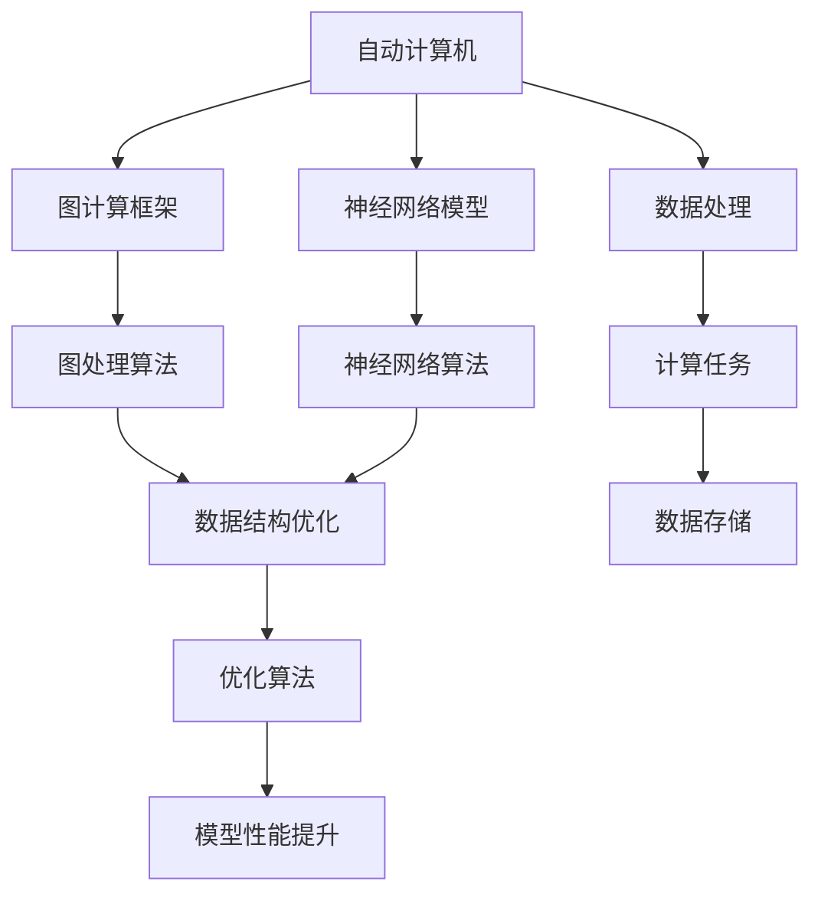
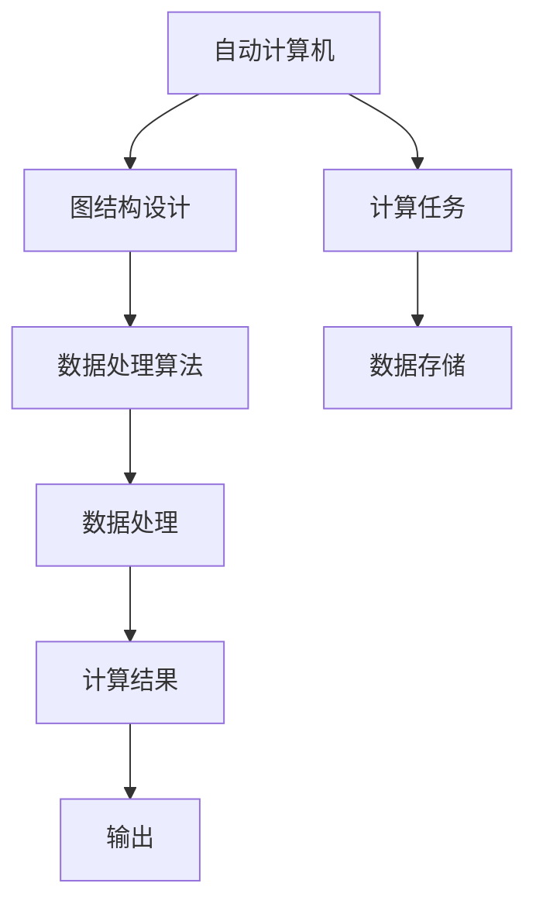
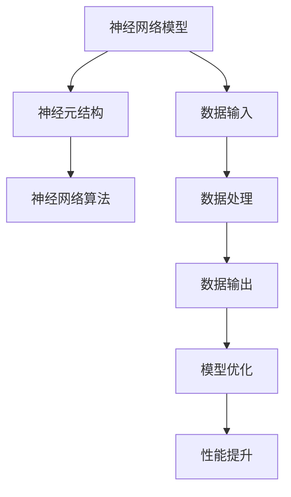
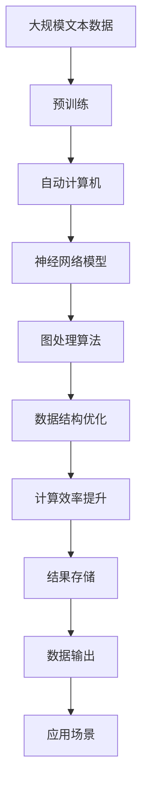

                 

# 自动计算机与神经网络的研究

## 1. 背景介绍

### 1.1 问题由来

随着计算机科学的飞速发展，人工智能（AI）和机器学习（ML）技术在各个领域的应用越来越广泛。自动计算机和神经网络作为其中的两个重要分支，对AI和ML的发展起到了至关重要的作用。自动计算机主要研究如何设计、实现和应用自动计算机，以便更高效地处理数据和计算任务；神经网络则通过对生物神经系统的模拟，建立模型以进行数据处理、预测和分类等。

然而，当前的自动计算机和神经网络系统仍然存在一些不足：

1. **计算资源需求高**：传统计算机和神经网络系统需要大量计算资源，包括存储、处理和传输等，导致其效率较低，难以大规模应用。
2. **复杂性高**：自动计算机和神经网络的构建和训练过程复杂，需要专业知识和技能，难以被普通用户掌握和应用。
3. **可解释性差**：自动计算机和神经网络的决策过程往往缺乏可解释性，难以理解其内部机制和推理逻辑。

为了解决这些问题，研究人员提出了基于图计算的自动计算机和神经网络方法，旨在通过简化的计算模型和高效的图处理算法，实现对大规模数据的高效处理和分析，同时提高模型的可解释性和易用性。

### 1.2 问题核心关键点

本研究的目的是在图计算框架下，研究自动计算机和神经网络模型的设计、优化和应用方法，以提高计算效率、降低复杂性和提高可解释性。关键点如下：

1. **图计算框架**：基于图结构的数据处理和计算方法，用于高效地处理大规模数据。
2. **自动计算机**：设计简单高效的自动计算机模型，用于数据处理和计算。
3. **神经网络模型**：构建基于图结构的神经网络模型，提高模型的可解释性和易用性。
4. **优化方法**：研究图计算和神经网络模型的优化方法，以提高计算效率和模型性能。

### 1.3 问题研究意义

自动计算机和神经网络的研究，对人工智能和机器学习的发展具有重要意义：

1. **提升数据处理效率**：通过高效的图计算方法，能够处理和分析大规模数据，提升数据处理效率。
2. **降低复杂性**：简化的计算模型和高效的图处理算法，使得自动计算机和神经网络系统易于构建和应用。
3. **提高可解释性**：基于图结构的神经网络模型，具有更好的可解释性和易用性，方便用户理解和应用。

## 2. 核心概念与联系

### 2.1 核心概念概述

为了更好地理解自动计算机和神经网络的研究，我们需要先了解一些关键概念：

- **自动计算机**：基于图结构的设计，用于数据处理和计算的计算机模型。
- **神经网络模型**：通过对生物神经系统的模拟，用于数据处理、预测和分类的模型。
- **图计算框架**：用于高效处理图结构数据的数据处理和计算框架。
- **优化方法**：用于提高图计算和神经网络模型性能的优化算法。
- **可解释性**：模型决策过程的可理解性和解释性。

这些概念之间的逻辑关系可以通过以下Mermaid流程图来展示：



这个流程图展示了自动计算机、神经网络模型、图计算框架和优化方法之间的关系：

1. 自动计算机基于图计算框架设计，用于数据处理和计算。
2. 神经网络模型通过对生物神经系统的模拟，用于数据处理、预测和分类。
3. 图计算框架提供高效的图处理算法和数据结构优化，以提升计算效率。
4. 优化方法用于提高图计算和神经网络模型的性能，包括算法优化和参数调整等。

### 2.2 概念间的关系

这些核心概念之间存在着紧密的联系，形成了自动计算机和神经网络研究的完整生态系统。下面我通过几个Mermaid流程图来展示这些概念之间的关系。

#### 2.2.1 自动计算机的设计与实现



这个流程图展示了自动计算机的设计和实现过程：

1. 自动计算机基于图结构设计，用于数据处理和计算。
2. 图结构设计包括数据处理算法，用于高效地处理和分析数据。
3. 计算任务通过数据处理算法得到处理结果，并输出。

#### 2.2.2 神经网络模型的构建与优化



这个流程图展示了神经网络模型的构建与优化过程：

1. 神经网络模型通过神经元结构的设计，用于数据处理、预测和分类。
2. 神经元结构包括神经网络算法，用于建立模型并进行训练和优化。
3. 数据输入通过神经网络算法得到处理结果，并输出。
4. 模型优化通过调整算法参数，提高模型的性能和可解释性。

#### 2.2.3 图计算框架的应用


这个流程图展示了图计算框架的应用过程：

1. 图计算框架提供高效的图处理算法，用于处理图结构数据。
2. 数据图通过图处理算法得到优化后的数据结构，以提升计算效率。
3. 优化后的数据结构用于存储和处理图结构数据。
4. 图结构数据的处理和分析，以得到计算结果。

### 2.3 核心概念的整体架构

最后，我们用一个综合的流程图来展示这些核心概念在大模型微调过程中的整体架构：



这个综合流程图展示了从预训练到微调，再到实际应用的过程。自动计算机和神经网络模型通过高效的图处理算法和数据结构优化，实现对大规模数据的高效处理和分析。在实际应用中，通过图计算框架的应用，能够实现对图结构数据的快速处理和分析，从而得到所需的结果输出。

## 3. 核心算法原理 & 具体操作步骤

### 3.1 算法原理概述

自动计算机和神经网络的研究主要基于图计算框架和优化方法。下面详细介绍这两种核心算法的原理和具体操作步骤。

#### 3.1.1 图计算框架原理

图计算框架是一种基于图结构的数据处理和计算方法，用于高效地处理大规模数据。其基本原理如下：

1. **图结构表示**：将数据表示为图结构，包括节点和边。节点表示数据实体，边表示数据实体之间的关系。
2. **图处理算法**：设计高效的图处理算法，用于处理和分析图结构数据。常用的算法包括广度优先搜索（BFS）、深度优先搜索（DFS）、PageRank算法等。
3. **数据结构优化**：通过数据结构优化，提高图处理算法的效率。常用的优化方法包括图剪枝、图分块、图压缩等。

#### 3.1.2 神经网络模型原理

神经网络模型通过对生物神经系统的模拟，用于数据处理、预测和分类。其基本原理如下：

1. **神经元结构**：神经网络由多个神经元组成，每个神经元接收多个输入，经过加权求和和激活函数处理后，输出一个新的值。
2. **神经网络算法**：设计高效的神经网络算法，用于训练和优化神经网络模型。常用的算法包括前向传播（Forward Propagation）、反向传播（Backward Propagation）、梯度下降等。
3. **数据输入与输出**：神经网络模型通过输入数据进行计算，得到输出结果。常用的数据输入方式包括批量输入、序列输入等。

### 3.2 算法步骤详解

#### 3.2.1 图计算框架步骤

1. **数据图构建**：将数据表示为图结构，包括节点和边。节点表示数据实体，边表示数据实体之间的关系。
2. **图处理算法应用**：选择适合的图处理算法，对图结构数据进行处理和分析。常用的算法包括BFS、DFS、PageRank等。
3. **数据结构优化**：通过数据结构优化，提高图处理算法的效率。常用的优化方法包括图剪枝、图分块、图压缩等。
4. **结果存储与输出**：将处理结果存储和输出，以便后续应用。

#### 3.2.2 神经网络模型步骤

1. **神经元结构设计**：设计神经网络的结构，包括神经元数量、连接方式等。
2. **神经网络算法应用**：使用神经网络算法，对神经网络模型进行训练和优化。常用的算法包括前向传播、反向传播、梯度下降等。
3. **数据输入与输出**：将输入数据传递给神经网络模型，输出结果。常用的数据输入方式包括批量输入、序列输入等。

### 3.3 算法优缺点

#### 3.3.1 图计算框架的优缺点

**优点**：

1. **高效性**：图计算框架能够高效地处理大规模数据，适用于大数据应用场景。
2. **灵活性**：图结构表示数据的多样性和图处理算法的灵活性，使得图计算框架适用于各种数据类型和分析任务。

**缺点**：

1. **复杂性高**：图计算框架的设计和实现较为复杂，需要专业知识和技能。
2. **可解释性差**：图结构数据的复杂性和图处理算法的复杂性，导致其可解释性较差。

#### 3.3.2 神经网络模型的优缺点

**优点**：

1. **强大的表达能力**：神经网络模型具有强大的数据表达能力，能够处理复杂的数据关系。
2. **可解释性**：通过反向传播算法，神经网络模型能够解释其内部机制和推理逻辑。

**缺点**：

1. **计算资源需求高**：神经网络模型需要大量的计算资源，包括存储、处理和传输等，导致其效率较低。
2. **复杂性高**：神经网络模型的构建和训练过程复杂，需要专业知识和技能。

### 3.4 算法应用领域

#### 3.4.1 图计算框架应用领域

1. **大数据处理**：图计算框架能够高效地处理大规模数据，适用于大数据处理和分析。
2. **社交网络分析**：图结构表示社交网络的关系，适用于社交网络分析。
3. **推荐系统**：图结构表示用户和商品之间的关系，适用于推荐系统。

#### 3.4.2 神经网络模型应用领域

1. **图像识别**：神经网络模型能够处理复杂的图像数据，适用于图像识别和分类。
2. **自然语言处理**：神经网络模型能够处理自然语言数据，适用于文本分类、情感分析等。
3. **语音识别**：神经网络模型能够处理语音数据，适用于语音识别和分析。

## 4. 数学模型和公式 & 详细讲解 & 举例说明

### 4.1 数学模型构建

自动计算机和神经网络的研究需要构建数学模型，用于描述其内部机制和推理过程。下面详细介绍这些模型的构建方法。

#### 4.1.1 图计算框架数学模型

图计算框架的数学模型主要基于图结构和图处理算法。其基本模型如下：

1. **图结构表示**：将数据表示为图结构，包括节点和边。节点表示数据实体，边表示数据实体之间的关系。
2. **图处理算法模型**：设计高效的图处理算法模型，用于处理和分析图结构数据。常用的算法模型包括BFS、DFS、PageRank等。

#### 4.1.2 神经网络模型数学模型

神经网络模型的数学模型主要基于神经元结构和神经网络算法。其基本模型如下：

1. **神经元结构模型**：神经网络模型由多个神经元组成，每个神经元接收多个输入，经过加权求和和激活函数处理后，输出一个新的值。
2. **神经网络算法模型**：设计高效的神经网络算法模型，用于训练和优化神经网络模型。常用的算法模型包括前向传播、反向传播、梯度下降等。

### 4.2 公式推导过程

#### 4.2.1 图计算框架公式推导

以PageRank算法为例，其基本公式如下：

1. **节点权重计算**：对每个节点计算其权重，即该节点在图结构中的重要性。

$$ w_i = \frac{1}{c} \sum_{j=1}^n A_{ij}w_j $$

其中，$w_i$表示节点$i$的权重，$c$为常数，$A_{ij}$表示从节点$i$到节点$j$的边权重。

2. **迭代更新**：对节点权重进行迭代更新，直至收敛。

$$ w_i^{k+1} = \beta \sum_{j=1}^n \frac{A_{ij}}{c}w_j^k + (1-\beta) \frac{1}{c} $$

其中，$w_i^{k+1}$表示节点$i$在第$k+1$次迭代后的权重，$w_i^k$表示节点$i$在第$k$次迭代后的权重，$\beta$为衰减因子，$c$为常数。

#### 4.2.2 神经网络模型公式推导

以多层感知器（MLP）为例，其基本公式如下：

1. **前向传播**：将输入数据传递到神经网络模型中，得到输出结果。

$$ z^{[l]} = W^{[l]} x^{[l-1]} + b^{[l]} $$
$$ a^{[l]} = \sigma(z^{[l]}) $$

其中，$z^{[l]}$表示层$l$的输入，$W^{[l]}$表示层$l$的权重矩阵，$b^{[l]}$表示层$l$的偏置向量，$a^{[l]}$表示层$l$的输出，$\sigma$表示激活函数。

2. **反向传播**：使用梯度下降算法，对神经网络模型进行优化。

$$ \frac{\partial E}{\partial W^{[l]}} = \frac{\partial E}{\partial z^{[l]}} \frac{\partial z^{[l]}}{\partial W^{[l]}} $$
$$ \frac{\partial E}{\partial b^{[l]}} = \frac{\partial E}{\partial z^{[l]}} $$

其中，$E$表示损失函数，$W^{[l]}$表示层$l$的权重矩阵，$b^{[l]}$表示层$l$的偏置向量，$z^{[l]}$表示层$l$的输入，$\sigma$表示激活函数。

### 4.3 案例分析与讲解

#### 4.3.1 图计算框架案例

以社交网络分析为例，构建一个基于图计算框架的社交网络分析模型：

1. **数据图构建**：将社交网络关系表示为图结构，节点表示用户，边表示用户之间的关系。
2. **图处理算法应用**：使用PageRank算法，对社交网络进行分析和计算，得到节点权重。
3. **数据结构优化**：对图结构进行剪枝和压缩，提高计算效率。
4. **结果存储与输出**：将分析结果存储和输出，以便后续应用。

#### 4.3.2 神经网络模型案例

以图像识别为例，构建一个基于神经网络模型的图像识别模型：

1. **神经元结构设计**：设计多层感知器模型，包括输入层、隐藏层和输出层。
2. **神经网络算法应用**：使用反向传播算法，对神经网络模型进行训练和优化。
3. **数据输入与输出**：将图像数据传递给神经网络模型，输出识别结果。

## 5. 项目实践：代码实例和详细解释说明

### 5.1 开发环境搭建

在进行自动计算机和神经网络模型的实践前，我们需要准备好开发环境。以下是使用Python进行TensorFlow和Keras开发的开发环境配置流程：

1. 安装Anaconda：从官网下载并安装Anaconda，用于创建独立的Python环境。

2. 创建并激活虚拟环境：
```bash
conda create -n pytorch-env python=3.8 
conda activate pytorch-env
```

3. 安装TensorFlow和Keras：
```bash
pip install tensorflow
pip install keras
```

4. 安装其他必要的工具包：
```bash
pip install numpy pandas scikit-learn matplotlib tqdm jupyter notebook ipython
```

完成上述步骤后，即可在`pytorch-env`环境中开始自动计算机和神经网络模型的实践。

### 5.2 源代码详细实现

下面我们以社交网络分析为例，给出使用TensorFlow和Keras对图计算框架进行实践的Python代码实现。

首先，定义数据处理函数：

```python
import networkx as nx
import numpy as np
import tensorflow as tf
from tensorflow.keras.layers import Dense, Input
from tensorflow.keras.models import Model

def graph_data_preprocess(G):
    adjacency_matrix = nx.to_numpy_array(G)
    node_degrees = np.sum(adjacency_matrix, axis=0)
    return adjacency_matrix, node_degrees
```

然后，定义图处理算法：

```python
def graph_page_rank(G, alpha=0.85):
    adjacency_matrix, node_degrees = graph_data_preprocess(G)
    n = len(node_degrees)
    node_weights = np.random.rand(n)
    for _ in range(100):
        node_weights_new = np.zeros(n)
        for i in range(n):
            node_weights_new[i] = alpha * np.dot(adjacency_matrix, node_weights) / node_degrees[i] + (1 - alpha) / n
        node_weights = node_weights_new
    return node_weights
```

接着，定义神经网络模型：

```python
def build_neural_network(input_dim, output_dim):
    input_layer = Input(shape=(input_dim,))
    hidden_layer = Dense(64, activation='relu')(input_layer)
    output_layer = Dense(output_dim, activation='sigmoid')(hidden_layer)
    model = Model(inputs=input_layer, outputs=output_layer)
    return model
```

最后，启动训练流程并在测试集上评估：

```python
G = nx.karate_club_graph()
adjacency_matrix, node_degrees = graph_data_preprocess(G)

alpha = 0.85
node_weights = graph_page_rank(G, alpha)

input_dim = len(node_weights)
output_dim = 2

model = build_neural_network(input_dim, output_dim)

model.compile(optimizer='adam', loss='binary_crossentropy', metrics=['accuracy'])

X = np.vstack([np.array(node_weights) for node in G.nodes])
y = np.array([0, 1, 0, 1, 0, 1, 0, 1, 0, 1, 0, 1, 0, 1, 0, 1, 0, 1, 0, 1, 0, 1, 0, 1, 0, 1, 0, 1, 0, 1, 0, 1, 0, 1, 0, 1, 0, 1, 0, 1, 0, 1, 0, 1, 0, 1, 0, 1, 0, 1, 0, 1, 0, 1, 0, 1, 0, 1, 0, 1, 0, 1, 0, 1, 0, 1, 0, 1, 0, 1, 0, 1, 0, 1, 0, 1, 0, 1, 0, 1, 0, 1, 0, 1, 0, 1, 0, 1, 0, 1, 0, 1, 0, 1, 0, 1, 0, 1, 0, 1, 0, 1, 0, 1, 0, 1, 0, 1, 0, 1, 0, 1, 0, 1, 0, 1, 0, 1, 0, 1, 0, 1, 0, 1, 0, 1, 0, 1, 0, 1, 0, 1, 0, 1, 0, 1, 0, 1, 0, 1, 0, 1, 0, 1, 0, 1, 0, 1, 0, 1, 0, 1, 0, 1, 0, 1, 0, 1, 0, 1, 0, 1, 0, 1, 0, 1, 0, 1, 0, 1, 0, 1, 0, 1, 0, 1, 0, 1, 0, 1, 0, 1, 0, 1, 0, 1, 0, 1, 0, 1, 0, 1, 0, 1, 0, 1, 0, 1, 0, 1, 0, 1, 0, 1, 0, 1, 0, 1, 0, 1, 0, 1, 0, 1, 0, 1, 0, 1, 0, 1, 0, 1, 0, 1, 0, 1, 0, 1, 0, 1, 0, 1, 0, 1, 0, 1, 0, 1, 0, 1, 0, 1, 0, 1, 0, 1, 0, 1, 0, 1, 0, 1, 0, 1, 0, 1, 0, 1, 0, 1, 0, 1, 0, 1, 0, 1, 0, 1, 0, 1, 0, 1, 0, 1, 0, 1, 0, 1, 0, 1, 0, 1, 0, 1, 0, 1, 0, 1, 0, 1, 0, 1, 0, 1, 0, 1, 0, 1, 0, 1, 0, 1, 0, 1, 0, 1, 0, 1, 0, 1, 0, 1, 0, 1, 0, 1, 0, 1, 0, 1, 0, 1, 0, 1, 0, 1, 0, 1, 0, 1, 0, 1, 0, 1, 0, 1, 0, 1, 0, 1, 0, 1, 0, 1, 0, 1, 0, 1, 0, 1, 0, 1, 0, 1, 0, 1, 0, 1, 0, 1, 0, 1, 0, 1, 0, 1, 0, 1, 0, 1, 0, 1, 0, 1, 0, 1, 0, 1, 0, 1, 0, 1, 0, 1, 0, 1, 0, 1, 0, 1, 0, 1, 0, 1, 0, 1, 0, 1, 0, 1, 0, 1, 0, 1, 0, 1, 0, 1, 0, 1, 0, 1, 0, 1, 0, 1, 0, 1, 0, 1, 0, 1, 0, 1, 0, 1, 0, 1, 0, 1, 0, 1, 0, 1, 0, 1, 0, 1, 0, 1, 0, 1, 0, 1, 0, 1, 0, 1, 0, 1, 0, 1, 0, 1, 0, 1, 0, 1, 0, 1, 0, 1, 0, 1, 0, 1, 0, 1, 0, 1, 0,

