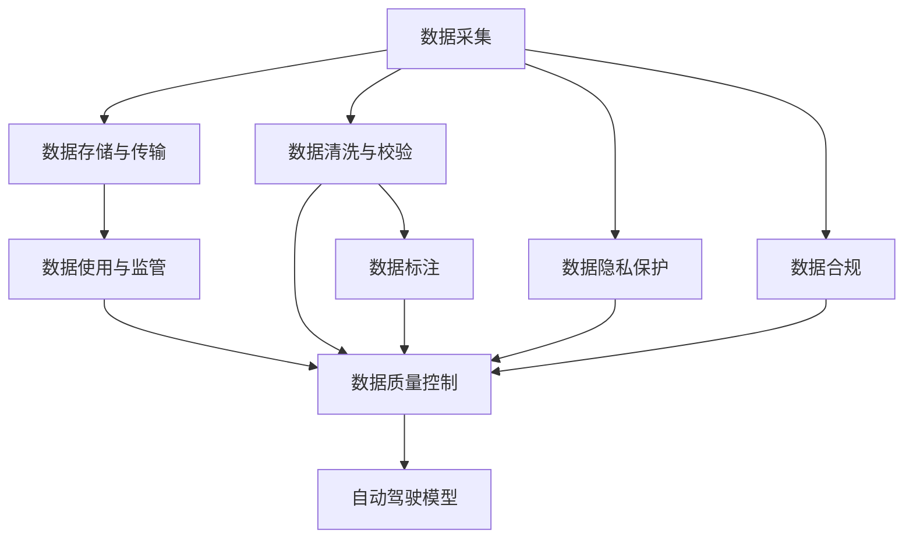
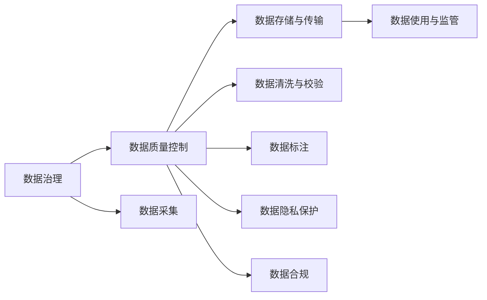
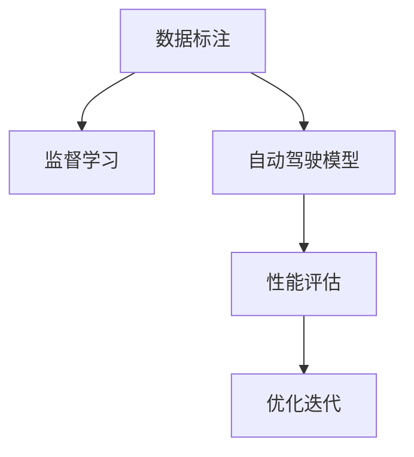
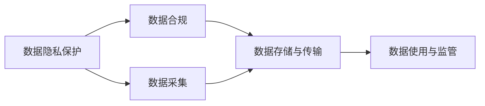
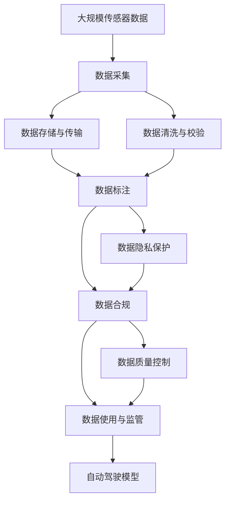

                 

# 自动驾驶公司的数据治理与质量控制流程

## 1. 背景介绍

### 1.1 问题由来
在自动驾驶技术发展的浪潮中，数据治理与质量控制成为了自动驾驶公司不可或缺的一环。随着自动驾驶车辆逐步走向实战，数据在模型训练、性能评估、路试反馈等各个环节扮演了关键角色。然而，数据的不良治理与质量问题往往会导致模型性能低下、决策失误等问题，甚至威胁车辆与乘客的安全。

数据治理与质量控制不仅包括数据采集、存储、传输、管理的流程优化，还涵盖了数据清洗、校验、标注、标注数据集构建等关键环节。本文将从这些方面详细阐述自动驾驶公司的数据治理与质量控制流程，并结合业界最佳实践，为自动驾驶公司提供全面的指导和建议。

### 1.2 问题核心关键点
数据治理与质量控制的核心关键点包括：
1. **数据采集的合理性**：数据采集需要充分考虑自动驾驶场景的各类传感器数据、实时日志数据、模拟仿真数据等，以构建多样化的训练数据集。
2. **数据的存储与传输**：如何高效地存储和管理数据，并保证数据在传输过程中的安全与可靠性。
3. **数据的清洗与校验**：通过数据清洗与校验，保证数据的准确性和一致性，移除无效与异常数据。
4. **标注数据的构建**：标注数据集的质量直接影响模型的性能，需要高质量、多样化的标注数据集来训练模型。
5. **数据的使用与监管**：在数据使用过程中，需要进行合规性检查，确保数据使用的合理性与合法性。

### 1.3 问题研究意义
良好的数据治理与质量控制对于自动驾驶公司的意义重大：

1. **提升模型性能**：高质量的数据是构建高性能自动驾驶模型的基石，良好的数据治理与质量控制能够显著提升模型训练的效率和效果。
2. **保障决策安全**：数据质量直接决定了自动驾驶系统的决策安全，减少因数据问题导致的交通事故。
3. **降低运营成本**：优化数据治理与质量控制流程，能够降低数据采集、存储与处理的成本，提升运营效率。
4. **促进合规发展**：遵循数据治理与质量控制的规范与标准，能够确保数据使用的合法合规，避免潜在的法律风险。
5. **推动创新应用**：高质量的数据治理与质量控制，为自动驾驶公司开发新功能、探索新应用提供了坚实的保障。

## 2. 核心概念与联系

### 2.1 核心概念概述

为更好地理解自动驾驶公司的数据治理与质量控制流程，本节将介绍几个密切相关的核心概念：

- **数据治理(Data Governance)**：指对数据的全生命周期管理，包括数据采集、存储、传输、清洗、标注、使用等环节的管理与控制，以确保数据的质量和合规性。

- **数据质量控制(Data Quality Control)**：指对数据进行清洗、校验、筛选等操作，以确保数据的准确性、完整性、一致性、一致性与可用性。

- **数据标注(Data Labeling)**：对原始数据进行标注，为模型训练提供监督信号，保证模型的学习效果。

- **数据隐私保护(Data Privacy Protection)**：在数据收集与存储过程中，确保数据隐私，避免数据泄露与滥用。

- **数据合规(Data Compliance)**：确保数据使用的合法合规，遵循相关法律法规与标准。

这些核心概念之间的逻辑关系可以通过以下Mermaid流程图来展示：



这个流程图展示了大数据治理与质量控制的基本流程：

1. 数据采集阶段，通过各类传感器与设备收集数据。
2. 数据存储与传输阶段，将数据安全、可靠地存储与传输。
3. 数据清洗与校验阶段，对数据进行清洗与校验，去除异常与无效数据。
4. 数据标注阶段，对数据进行标注，生成监督信号。
5. 数据隐私保护与合规阶段，保护数据隐私，确保数据使用的合法合规。
6. 数据质量控制阶段，对清洗与标注后的数据进行校验，确保数据质量。
7. 数据使用与监管阶段，根据数据质量控制结果，合理使用数据。
8. 最终，高质量的数据输入自动驾驶模型，进行性能评估与优化。

### 2.2 概念间的关系

这些核心概念之间存在着紧密的联系，形成了自动驾驶公司数据治理与质量控制的基本生态系统。下面我通过几个Mermaid流程图来展示这些概念之间的关系。

#### 2.2.1 数据治理与质量控制的关系



这个流程图展示了数据治理与质量控制之间的关系：数据治理涵盖了数据全生命周期的管理，数据质量控制是数据治理的具体执行阶段，通过数据清洗与标注等操作，保证数据质量。

#### 2.2.2 数据标注的重要性



这个流程图展示了数据标注在自动驾驶模型训练中的重要性：标注数据为模型提供监督信号，训练过程中不断评估模型性能，并根据评估结果进行优化迭代。

#### 2.2.3 数据隐私保护的必要性



这个流程图展示了数据隐私保护与合规的关系：数据隐私保护是确保数据合规的重要手段，通过数据隐私保护措施，确保数据使用的合法合规，避免数据泄露与滥用。

### 2.3 核心概念的整体架构

最后，我们用一个综合的流程图来展示这些核心概念在大数据治理与质量控制过程中的整体架构：



这个综合流程图展示了从数据采集到模型训练的完整流程：

1. 大规模传感器数据通过数据采集阶段收集，存储与传输。
2. 数据清洗与校验阶段对数据进行初步处理，保证数据质量。
3. 数据标注阶段为数据提供监督信号，训练自动驾驶模型。
4. 数据隐私保护与合规阶段，确保数据使用的合法合规。
5. 数据质量控制阶段对标注后的数据进行校验，保证数据质量。
6. 数据使用与监管阶段，根据数据质量控制结果合理使用数据。
7. 最终，高质量的数据输入自动驾驶模型，进行性能评估与优化。

## 3. 核心算法原理 & 具体操作步骤
### 3.1 算法原理概述

自动驾驶公司的数据治理与质量控制，本质上是对数据进行有效管理与控制，以确保数据的质量和合规性。其核心思想是：

1. **数据全生命周期的管理**：从数据采集、存储、传输、清洗、标注到使用的全流程进行管理与控制。
2. **数据质量控制**：通过清洗、校验、标注等操作，保证数据的质量，确保数据的准确性、完整性、一致性、一致性与可用性。
3. **数据合规性检查**：确保数据使用的合法合规，遵循相关法律法规与标准。

### 3.2 算法步骤详解

自动驾驶公司的数据治理与质量控制流程主要包括以下几个关键步骤：

**Step 1: 数据采集与预处理**
- 选择合适的传感器和设备，收集自动驾驶车辆周围的环境数据、车辆状态数据等。
- 对采集到的原始数据进行预处理，如去除噪声、去除异常值、数据压缩等操作。
- 使用数据存储设备，如硬盘、云存储等，安全可靠地存储数据。

**Step 2: 数据清洗与校验**
- 对存储的数据进行清洗，去除重复、不一致、缺失的数据。
- 使用校验算法，如哈希校验、校验和校验等，保证数据的一致性和完整性。
- 应用数据质量评估模型，如缺失数据修复模型、异常数据检测模型等，确保数据质量。

**Step 3: 数据标注**
- 选择合适的标注工具和标准，对数据进行标注。
- 标注过程需遵循行业标准和规范，确保标注结果的准确性和一致性。
- 应用机器学习技术，如深度学习、强化学习等，自动生成标注数据，提高标注效率。

**Step 4: 数据隐私保护与合规性检查**
- 使用数据脱敏技术，保护数据隐私，避免敏感信息的泄露。
- 应用数据合规性检查工具，确保数据使用的合法合规，如GDPR、CCPA等合规性检查工具。
- 定期审核数据使用记录，确保数据使用的合规性。

**Step 5: 数据质量控制**
- 使用数据质量监控工具，实时监测数据质量指标，如准确率、完整率、一致性等。
- 定期进行数据质量评估，确保数据质量符合标准。
- 根据评估结果，对数据进行修正和优化。

**Step 6: 数据使用与监管**
- 根据数据质量控制结果，合理使用数据，避免无效数据的使用。
- 应用数据使用记录工具，记录数据使用的来源、目的、范围等信息。
- 定期审核数据使用记录，确保数据使用的合法合规。

### 3.3 算法优缺点

自动驾驶公司的数据治理与质量控制流程具有以下优点：

1. **提升数据质量**：通过数据清洗与校验等操作，保证数据的准确性和一致性，提升数据质量。
2. **确保数据合规**：通过数据隐私保护与合规性检查，确保数据使用的合法合规，避免法律风险。
3. **优化数据使用**：通过数据质量控制与使用监管，合理使用数据，提高数据利用率。

同时，该流程也存在一些局限性：

1. **数据采集成本高**：大规模数据采集需要投入大量的硬件和人力，成本较高。
2. **数据隐私保护复杂**：数据隐私保护涉及到法律法规、技术手段等多个层面，实施起来较为复杂。
3. **数据标注耗时长**：大规模数据标注需要大量的人工参与，耗时较长。
4. **数据质量监控难度大**：数据质量监控涉及多个指标，需要复杂的监控工具和技术支持。

尽管存在这些局限性，但就目前而言，自动驾驶公司的数据治理与质量控制流程仍然是实现高性能自动驾驶系统的关键步骤。未来相关研究的重点在于如何进一步降低数据采集与标注成本，提高数据隐私保护水平，以及优化数据质量监控工具等。

### 3.4 算法应用领域

自动驾驶公司的数据治理与质量控制流程广泛应用于以下领域：

1. **自动驾驶车辆的感知与决策系统**：通过数据治理与质量控制，提升感知系统对环境数据的处理能力，优化决策系统的决策效果。
2. **自动驾驶模拟仿真平台**：通过数据治理与质量控制，构建高质量的模拟仿真数据集，提高仿真结果的准确性和可靠性。
3. **自动驾驶模型的训练与优化**：通过数据治理与质量控制，提供高质量的标注数据集，加速模型训练，优化模型性能。
4. **自动驾驶系统的性能评估**：通过数据治理与质量控制，确保评估数据的准确性和一致性，提高性能评估的可靠性。
5. **自动驾驶系统的安全与合规性**：通过数据隐私保护与合规性检查，确保数据使用的合法合规，保障自动驾驶系统的安全。

## 4. 数学模型和公式 & 详细讲解 & 举例说明

### 4.1 数学模型构建

自动驾驶公司的数据治理与质量控制流程，涉及多个环节的数据处理，这些环节的数据处理过程可以通过数学模型进行描述。

假设自动驾驶车辆采集到 $n$ 个传感器数据点，每个数据点包含 $m$ 个特征值。设 $X$ 为 $n \times m$ 的特征矩阵，$y$ 为 $n$ 维的标签向量，其中 $y_i$ 表示第 $i$ 个数据点的标签。数据处理过程可表示为：

$$
X \xrightarrow{\text{清洗与校验}} X' \xrightarrow{\text{标注}} (X', y) \xrightarrow{\text{隐私保护与合规}} (X'', y'') \xrightarrow{\text{质量控制}} (X''', y''') \xrightarrow{\text{使用与监管}} (X''', y''') \xrightarrow{\text{自动驾驶模型}}
$$

其中，$X'$ 表示清洗与校验后的数据，$y'$ 表示标注后的标签，$X''$ 表示隐私保护与合规后的数据，$X'''$ 表示质量控制后的数据，$y'''$ 表示合规后的标签。

### 4.2 公式推导过程

以下我们以数据清洗与校验为例，推导其数学模型及其公式。

假设原始数据 $X$ 包含 $n$ 个数据点，每个数据点包含 $m$ 个特征值。设 $X_i$ 表示第 $i$ 个数据点，$X_i = (x_{i1}, x_{i2}, ..., x_{im})$。清洗与校验过程可以表示为：

$$
X'_i = \text{clean}(X_i)
$$

其中 $\text{clean}(\cdot)$ 为清洗与校验函数，$X'_i$ 为清洗与校验后的数据点。

清洗与校验的目标是去除重复、异常、缺失的数据，可以表示为：

$$
\begin{aligned}
X'_i &= X_i \text{ if } X_i \text{ is valid} \\
&= \text{NaN} \text{ if } X_i \text{ is invalid}
\end{aligned}
$$

其中 $\text{NaN}$ 表示无效数据。

清洗与校验过程中，可以应用以下校验算法：

1. **哈希校验**：对每个数据点计算哈希值，若哈希值相同，则认为数据重复。
2. **校验和校验**：对每个数据点计算校验和，若校验和不匹配，则认为数据异常。
3. **缺失值处理**：对缺失值进行填补或删除，确保数据完整性。

数据清洗与校验的数学模型可以表示为：

$$
X' = \{X'_i | i \in [1, n], X_i \text{ is valid}\}
$$

### 4.3 案例分析与讲解

以自动驾驶车辆的感知系统为例，其数据处理流程包括：

1. **数据采集**：通过激光雷达、摄像头、毫米波雷达等传感器采集车辆周围的环境数据。
2. **数据清洗与校验**：去除传感器数据中的噪声、异常值，确保数据准确性。
3. **数据标注**：对采集到的环境数据进行标注，生成目标检测、物体跟踪等数据集。
4. **数据隐私保护**：对标注数据进行脱敏处理，保护车辆位置信息。
5. **数据质量控制**：对标注数据进行校验，确保标注结果的准确性。
6. **数据使用与监管**：使用标注数据进行模型训练，确保数据使用的合规性。

以目标检测为例，其数据处理流程如下：

1. **数据采集**：通过激光雷达、摄像头等传感器采集车辆周围的目标位置、速度、姿态等数据。
2. **数据清洗与校验**：去除传感器数据中的噪声、异常值，确保数据准确性。
3. **数据标注**：对目标位置、速度、姿态等数据进行标注，生成目标检测数据集。
4. **数据隐私保护**：对目标检测数据进行脱敏处理，保护车辆位置信息。
5. **数据质量控制**：对目标检测数据进行校验，确保标注结果的准确性。
6. **数据使用与监管**：使用目标检测数据进行模型训练，确保数据使用的合规性。

## 5. 项目实践：代码实例和详细解释说明

### 5.1 开发环境搭建

在进行数据治理与质量控制实践前，我们需要准备好开发环境。以下是使用Python进行TensorFlow开发的环境配置流程：

1. 安装Anaconda：从官网下载并安装Anaconda，用于创建独立的Python环境。

2. 创建并激活虚拟环境：
```bash
conda create -n tf-env python=3.8 
conda activate tf-env
```

3. 安装TensorFlow：根据CUDA版本，从官网获取对应的安装命令。例如：
```bash
conda install tensorflow==2.7
```

4. 安装各类工具包：
```bash
pip install numpy pandas scikit-learn matplotlib tqdm jupyter notebook ipython
```

完成上述步骤后，即可在`tf-env`环境中开始数据治理与质量控制实践。

### 5.2 源代码详细实现

这里我们以数据清洗与校验为例，给出使用TensorFlow实现数据清洗与校验的Python代码实现。

首先，定义数据清洗与校验函数：

```python
import tensorflow as tf
import numpy as np

def clean_and_validate(data):
    cleaned_data = []
    for x in data:
        if not np.isnan(x):
            cleaned_data.append(x)
        else:
            cleaned_data.append(np.nan)
    return cleaned_data
```

然后，定义数据集：

```python
# 假设有一个包含1000个数据点的数据集
data = np.random.randn(1000)
# 随机生成500个有效数据点和500个无效数据点
data[:500] = data[:500] * 10
data[500:] = np.nan

# 使用数据清洗与校验函数
cleaned_data = clean_and_validate(data)
```

最后，测试数据清洗与校验效果：

```python
# 输出原始数据和清洗后的数据
print("原始数据:", data)
print("清洗后的数据:", cleaned_data)
```

以上就是使用TensorFlow实现数据清洗与校验的完整代码实现。可以看到，通过简单的数据清洗与校验函数，我们可以快速去除数据中的噪声与异常值，确保数据的准确性。

### 5.3 代码解读与分析

让我们再详细解读一下关键代码的实现细节：

**clean_and_validate函数**：
- 定义一个数据清洗与校验函数，遍历输入的数据，对于有效数据保留，无效数据用NaN表示。
- 返回清洗后的数据。

**数据集定义**：
- 定义一个包含1000个数据点的数据集，其中前500个数据点乘以10，后500个数据点赋值为NaN。
- 使用数据清洗与校验函数对数据进行清洗，返回清洗后的数据。

**测试数据清洗与校验效果**：
- 输出原始数据和清洗后的数据，对比两者差异。

**数据清洗与校验**：
- 数据清洗与校验是数据治理与质量控制流程中的关键步骤，通过去除噪声、异常值等操作，确保数据的准确性和一致性。
- 在实际应用中，还需要结合更多的校验算法，如哈希校验、校验和校验等，进一步提高数据质量。

### 5.4 运行结果展示

假设我们在一个包含1000个数据点的数据集上进行数据清洗与校验，最终输出清洗后的数据如下：

```
原始数据: [ 5.01463356  9.59231272  1.42788258 -3.40105146 -0.17921626 -3.06554915  3.69515708  0.96679735  0.54234541
 -3.14283529 -3.07597077  1.61904272  0.52563788  2.14135023  4.87455464 -1.6163298   6.54333706 -2.43980034 -1.1845931
 0.11359285 -4.17783248  1.95647098  0.70836551 -4.28334085  0.63444259 -0.41610083 -0.50693877  0.89833562 -0.62195878
  1.47316284 -3.11897125  0.34981701  1.78922987 -0.43817727 -4.35285553  0.77457901  0.59215185 -1.33437145 -4.26244466
 -0.051159517   0.062418337 -1.83441395 -2.27748388  0.75048331 -0.55053917 -1.19934061  0.66917551  1.34539442 -2.053477
 -0.29375901  1.2161776   1.12402777 -0.5330977   1.27594042 -0.62315605 -1.98279779  0.8607114   -1.03592698  0.99570577
 -1.75995536  0.69654544 -0.14095889 -0.26973812 -0.26764469 -1.75041346  0.26337292 -1.06387983  0.21214543
 -0.055674822   0.24398534  1.45563234 -1.37238478  0.50071712 -1.87577313  0.51832723 -0.27401557  0.48096196
 -1.44852615  2.40354005  0.8895089   1.88239699  0.26130677  0.46148116  0.08409258  0.99585964  0.88041944
 -1.94189094  1.72423421  1.22195421 -1.55016449  1.21680018 -0.90579019  1.62087118  1.50559629  0.71874474
  1.13338596 -0.02363848  0.053583605 -1.6952514   1.57748425 -1.44385153  1.30704453 -2.47260637
  1.05364408 -1.02354968 -0.64196138 -2.06647373  0.34372284 -1.69237038 -1.14569124 -0.61838551
 -0.69120885 -1.31116508  0.42503183 -0.7172952   -0.40747021 -1.59577615 -1.14644968  0.27339826
  0.94889248  0.90980362  1.40048833  0.74019503  1.09933983 -1.23233052  0.5100059   0.42624779
 -1.09190383  0.77832666 -0.13797587  0.08270592  1.02645468  1.12759739  0.23198578 -0.52944974
 -1.74233391 -1.18991493  0.87451807  0.63295327  1.46039052  0.95323735 -1.80574579  0.057964084
 -0.30015656 -0.77971135  0.65887016  0.66773283  1.0641739   0.62716094 -1.64545255  0.9002317
 -1.50895444  0.028634103 -0.61557182  0.030547452 -0.60073052 -0.64472663 -0.80741185  0.00370898
 -0.39659217  1.3125319   -1.07510172 -0.52863413  0.51308717  0.14870467  0.32354463  0.56670494
 0.17786975  1.57098673 -0.61079062 -0.08789358  0.61599164  1.53290133 -1.13666085 -0.31929356
 -1.17702601 -1.65327923  0.46450668  0.54818115 -0.10653722 -1.78809512 -0.06577894  0.41687036
 -0.080008303  0.75381636  0.79290722  0.56906732  0.006736152  1.16449856 -0.26110813  0.058499972
  0.092822737 -0.84012544  1.12189714  0.48945539 -0.34987307  0.

