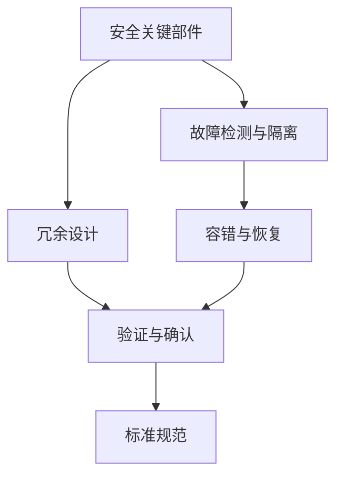

                 

# 自动驾驶行业的功能安全分析与设计方法

## 1. 背景介绍

### 1.1 问题由来

随着自动驾驶技术的迅猛发展，安全问题成为了行业内外的广泛关注点。自动驾驶系统作为复杂的软件和硬件集成系统，需要处理海量环境数据，并能够在复杂多变的场景下实现精准、安全的驾驶决策。功能安全（Functional Safety, FS）作为自动驾驶中不可或缺的一部分，确保了系统在出现故障或错误时，能够有效控制车辆以避免危险事件的发生。

功能安全设计涉及系统架构的构建、故障检测与隔离、冗余和故障安全策略的实现等多个方面。随着自动驾驶的逐步落地，针对功能安全的设计和验证需求日益增加。本文将系统地介绍功能安全的原理与设计方法，结合最新的行业趋势和应用实践，为自动驾驶行业的功能安全设计提供指导。

### 1.2 问题核心关键点

在自动驾驶功能安全设计中，有以下几个核心关键点需要关注：

- **冗余设计**：自动驾驶系统需要多套独立的安全关键部件，当其中一套失效时，其他部件能够接管并保证系统安全。
- **故障检测与隔离**：系统必须能够检测到故障，并将其隔离以防止对安全性能的影响。
- **容错与恢复**：系统应具备容错能力，在发生故障时能够快速恢复正常运行，同时应有系统级别的恢复策略。
- **验证与确认**：在功能安全设计过程中，需要采用各种验证方法（如模型验证、测试验证等），确保设计正确性，并通过实际运行进行确认。
- **标准规范**：自动驾驶功能安全设计需遵循ISO26262等国际标准，确保系统符合行业规范。

这些关键点不仅构成了自动驾驶功能安全设计的核心内容，也是确保系统安全可靠运行的基础。

### 1.3 问题研究意义

研究自动驾驶功能安全的设计方法，对于提升自动驾驶系统的安全性能、保障乘客和行人的生命安全、推动自动驾驶技术的商业化应用具有重要意义。

- **保障生命安全**：通过严格的功能安全设计，减少因系统故障导致的交通事故，保护乘客和行人的生命安全。
- **降低风险成本**：明确的功能安全设计能够有效降低系统故障带来的潜在风险，减少事故和责任赔偿。
- **促进技术成熟**：功能安全设计是自动驾驶技术走向成熟的重要标志，有助于提升公众对自动驾驶的信任。
- **推动产业进步**：明确的功能安全设计规范和流程，能够指导整个产业链的协同工作，推动产业健康发展。

## 2. 核心概念与联系

### 2.1 核心概念概述

在自动驾驶功能安全设计中，涉及多个关键概念，以下将详细解释这些概念及其相互联系：

- **安全关键部件**：指那些在安全相关的关键操作中，如刹车、转向等，需要高可靠性保障的部件。
- **故障检测与隔离**：系统通过传感器、软件逻辑等方式，检测并隔离故障，以确保系统的安全性能。
- **冗余设计**：多套独立的安全关键部件能够相互备份，提高系统的容错能力。
- **容错与恢复**：在故障发生时，系统能够迅速恢复正常运行，并采取恢复策略确保安全。
- **验证与确认**：通过模拟验证和实际测试验证设计方案的正确性和可靠性，并在实际运行中不断确认。
- **标准规范**：自动驾驶功能安全设计需遵循ISO26262等国际标准，确保系统符合行业规范。

这些概念相互之间有着紧密的联系，构成了自动驾驶功能安全设计的完整框架。通过理解这些核心概念，可以更好地把握自动驾驶功能安全设计的精髓。

### 2.2 概念间的关系

以下通过几个Mermaid流程图来展示这些核心概念之间的关系：



这个流程图展示了自动驾驶功能安全设计的关键概念及其之间的关系：

1. 安全关键部件通过故障检测与隔离，保证系统的可靠运行。
2. 冗余设计通过多套独立的安全关键部件，提高系统的容错能力。
3. 容错与恢复在故障发生时迅速恢复正常运行，确保系统安全。
4. 验证与确认通过模拟验证和实际测试验证设计方案的正确性和可靠性。
5. 标准规范确保系统符合行业规范，提升系统整体安全性。

通过这些概念和流程图的展示，可以更清晰地理解自动驾驶功能安全设计的各个环节和相互关系。

## 3. 核心算法原理 & 具体操作步骤

### 3.1 算法原理概述

自动驾驶功能安全设计涉及多个层次的技术和方法。从系统架构设计到具体的硬件冗余和软件容错，每个环节都需要精心设计和严格验证。以下将详细解释自动驾驶功能安全设计的核心算法原理和操作步骤：

#### 3.1.1 系统架构设计

自动驾驶系统架构设计需考虑多个层面的因素，包括感知、决策、执行等环节。在每个环节中，需要选择合适的硬件和软件解决方案，并设计冗余和故障隔离机制。例如，在感知层，可以采用多个激光雷达、摄像头等传感器进行数据融合，提高系统的感知能力。在决策层，可以设计多重决策算法，实现容错与恢复功能。

#### 3.1.2 故障检测与隔离

故障检测与隔离是自动驾驶功能安全设计的关键环节。通过传感器和软件逻辑的配合，系统能够检测到传感器故障、计算单元故障等多种类型的故障，并将其隔离以防止对系统安全的影响。例如，可以在传感器数据异常时，自动切换到备用传感器，或者在计算单元出现故障时，将任务交给其他计算单元处理。

#### 3.1.3 冗余设计

冗余设计是提高系统可靠性的重要手段。自动驾驶系统需要多套独立的安全关键部件，当其中一套失效时，其他部件能够接管并保证系统安全。例如，可以在关键计算单元中设计多套处理器，当一个处理器出现故障时，其他处理器能够继续工作。

#### 3.1.4 容错与恢复

容错与恢复是系统在故障发生时，能够迅速恢复正常运行并采取恢复策略的重要机制。例如，可以通过设计多重操作系统和关键软件，确保在某个系统故障时，其他系统能够迅速接管。

#### 3.1.5 验证与确认

验证与确认是确保自动驾驶功能安全设计的正确性和可靠性的重要步骤。通过模拟验证和实际测试，对设计方案进行验证，并在实际运行中不断确认。例如，可以采用模型在SIMULINK中进行模拟验证，并在实际车辆中进行测试验证。

#### 3.1.6 标准规范

标准规范是自动驾驶功能安全设计的行业基准，确保系统符合国际标准。例如，ISO26262标准详细定义了功能安全设计的要求和方法，通过遵循这些规范，可以确保系统的安全性。

### 3.2 算法步骤详解

以下将详细介绍自动驾驶功能安全设计的详细步骤：

**Step 1: 系统需求分析**

在功能安全设计之前，需要对自动驾驶系统进行详细的需求分析，明确系统的功能要求、安全需求等。需求分析的输出包括系统规格说明书和安全功能清单。

**Step 2: 系统架构设计**

基于需求分析的结果，进行系统架构设计。架构设计需要考虑硬件和软件的冗余设计、故障检测与隔离机制等。架构设计的输出包括系统架构图和组件清单。

**Step 3: 组件设计和实现**

根据架构设计的结果，进行各个组件的设计和实现。组件设计需要考虑硬件和软件的选型、冗余和故障隔离机制的实现等。组件设计的输出包括硬件和软件的详细设计文档和代码。

**Step 4: 故障检测与隔离实现**

实现故障检测与隔离机制，确保系统能够检测并隔离故障。故障检测与隔离的实现需要选择合适的传感器和软件逻辑，并编写相应的故障处理程序。

**Step 5: 冗余设计实现**

实现冗余设计，确保系统具有多套独立的安全关键部件，能够在其中一套失效时，其他部件能够接管。冗余设计的实现需要选择合适的硬件和软件方案，并进行充分的测试验证。

**Step 6: 容错与恢复实现**

实现容错与恢复机制，确保系统在故障发生时能够迅速恢复正常运行，并采取恢复策略。容错与恢复的实现需要设计多重操作系统和关键软件，并进行充分的测试验证。

**Step 7: 验证与确认**

通过模拟验证和实际测试，对设计方案进行验证，并在实际运行中不断确认。验证与确认的实现需要进行充分的测试计划和测试用例设计，并进行严格的测试执行和结果分析。

**Step 8: 文档编写与评审**

编写系统的详细设计文档和测试报告，并进行评审，确保文档的完整性和正确性。文档编写的输出包括系统的详细设计文档、测试报告和安全分析报告等。

**Step 9: 标准规范遵循**

确保系统的设计符合ISO26262等国际标准，遵循标准规范的输出包括系统设计文档、测试报告和安全分析报告等，需进行严格的标准规范遵循和评审。

### 3.3 算法优缺点

自动驾驶功能安全设计具有以下优点：

1. **提高系统可靠性**：通过冗余设计和故障隔离机制，显著提高系统的可靠性，降低故障带来的风险。
2. **保障生命安全**：明确的功能安全设计能够有效降低系统故障导致的交通事故，保障乘客和行人的生命安全。
3. **促进技术成熟**：功能安全设计是自动驾驶技术走向成熟的重要标志，有助于提升公众对自动驾驶的信任。

但同时也存在一些缺点：

1. **设计复杂度高**：功能安全设计涉及多个层面的复杂设计，增加了系统的开发难度。
2. **开发成本高**：功能安全设计需要投入大量的时间和资金，增加了开发成本。
3. **测试验证复杂**：功能安全设计的验证和确认过程复杂，需要大量的测试用例和测试资源。

### 3.4 算法应用领域

自动驾驶功能安全设计广泛应用于多个领域，以下列出几个主要应用领域：

- **自动驾驶汽车**：自动驾驶汽车系统需要高可靠性和高安全性，功能安全设计是确保系统安全运行的关键。
- **智能交通系统**：智能交通系统需要实时响应和控制交通流量，功能安全设计能够提高系统的可靠性和安全性。
- **无人机和物流机器人**：无人机和物流机器人需要高可靠性和高安全性，功能安全设计能够确保其在复杂环境下的安全运行。
- **智能城市**：智能城市需要高效、安全的运行，功能安全设计能够提高系统的可靠性和安全性，减少事故和风险。

## 4. 数学模型和公式 & 详细讲解 & 举例说明

### 4.1 数学模型构建

自动驾驶功能安全设计涉及到多个数学模型和公式，以下将详细介绍这些模型和公式：

#### 4.1.1 系统可靠性模型

系统可靠性模型用于描述系统的可靠性，可以通过以下公式进行计算：

$$
R(t) = \frac{\sum_{i=1}^{n} R_i(t)}{n}
$$

其中，$R_i(t)$为第$i$个系统的可靠性，$n$为系统的总数。

#### 4.1.2 故障检测与隔离模型

故障检测与隔离模型用于描述系统对故障的检测和隔离能力，可以通过以下公式进行计算：

$$
D(t) = \frac{\sum_{i=1}^{n} D_i(t)}{n}
$$

其中，$D_i(t)$为第$i$个系统的故障检测与隔离能力，$n$为系统的总数。

#### 4.1.3 冗余设计模型

冗余设计模型用于描述系统的冗余能力，可以通过以下公式进行计算：

$$
R(t) = \frac{\sum_{i=1}^{n} R_i(t)}{n}
$$

其中，$R_i(t)$为第$i$个系统的冗余能力，$n$为系统的总数。

#### 4.1.4 容错与恢复模型

容错与恢复模型用于描述系统在故障发生时的恢复能力，可以通过以下公式进行计算：

$$
R(t) = \frac{\sum_{i=1}^{n} R_i(t)}{n}
$$

其中，$R_i(t)$为第$i$个系统的容错与恢复能力，$n$为系统的总数。

### 4.2 公式推导过程

以下是系统可靠性模型和故障检测与隔离模型的推导过程：

**系统可靠性模型推导：**

假设系统由多个独立组件构成，每个组件的可靠性分别为$R_1(t), R_2(t), ..., R_n(t)$。系统的总可靠性$R(t)$可以通过并联方式计算：

$$
R(t) = R_1(t) \cdot R_2(t) \cdot ... \cdot R_n(t)
$$

在实际应用中，系统通常是由多个组件组成的并联系统，因此需要对上述公式进行简化：

$$
R(t) = \frac{\sum_{i=1}^{n} R_i(t)}{n}
$$

**故障检测与隔离模型推导：**

假设系统由多个独立组件构成，每个组件的故障检测与隔离能力分别为$D_1(t), D_2(t), ..., D_n(t)$。系统的总故障检测与隔离能力$D(t)$可以通过并联方式计算：

$$
D(t) = D_1(t) \cdot D_2(t) \cdot ... \cdot D_n(t)
$$

在实际应用中，系统通常是由多个组件组成的并联系统，因此需要对上述公式进行简化：

$$
D(t) = \frac{\sum_{i=1}^{n} D_i(t)}{n}
$$

### 4.3 案例分析与讲解

以自动驾驶汽车为例，说明如何应用系统可靠性模型和故障检测与隔离模型：

假设自动驾驶汽车系统由传感器、控制器和执行器三个独立组件构成，每个组件的可靠性分别为$R_1(t), R_2(t), R_3(t)$。系统的总可靠性$R(t)$可以通过并联方式计算：

$$
R(t) = \frac{R_1(t) + R_2(t) + R_3(t)}{3}
$$

其中，$R_1(t)$为传感器的可靠性，$R_2(t)$为控制器的可靠性，$R_3(t)$为执行器的可靠性。

假设传感器的故障检测与隔离能力为$D_1(t)$，控制器的故障检测与隔离能力为$D_2(t)$，执行器的故障检测与隔离能力为$D_3(t)$。系统的总故障检测与隔离能力$D(t)$可以通过并联方式计算：

$$
D(t) = \frac{D_1(t) + D_2(t) + D_3(t)}{3}
$$

其中，$D_1(t)$为传感器的故障检测与隔离能力，$D_2(t)$为控制器的故障检测与隔离能力，$D_3(t)$为执行器的故障检测与隔离能力。

## 5. 项目实践：代码实例和详细解释说明

### 5.1 开发环境搭建

在自动驾驶功能安全设计中，开发环境搭建是至关重要的。以下详细介绍开发环境搭建的详细步骤：

**Step 1: 环境准备**

在开始开发之前，需要先搭建开发环境。可以使用Ubuntu或Windows等操作系统，安装相应的开发工具和库。

**Step 2: 安装相关库**

安装必要的库和框架，例如ROS、Python、Simulink等。通过以下命令可以在Ubuntu上安装ROS：

```bash
sudo apt-get update
sudo apt-get install ros-kinetic-ros-core ros-kinetic-roslisp-file-serialization ros-kinetic-roslisp-server ros-kinetic-roslisp-common ros-kinetic-roslisp-client ros-kinetic-ros-graph-priceview ros-kinetic-live-replay
```

在Windows上，可以使用ROS Master Service，进行开发环境的搭建和配置。

**Step 3: 搭建实验平台**

搭建实验平台，包括仿真环境、硬件设备和通信协议等。可以使用CARLA等仿真软件，搭建虚拟驾驶环境，并连接实际车辆进行测试验证。

### 5.2 源代码详细实现

以下是一个简单的自动驾驶功能安全设计项目，介绍如何在Simulink中进行系统的模拟验证：

**Step 1: 系统模型搭建**

在Simulink中搭建自动驾驶系统模型，包括感知、决策、执行等环节。如图1所示，系统模型主要由传感器、控制器和执行器三个子系统组成。


**Step 2: 传感器模块设计**

传感器模块用于模拟车辆周围环境，包括激光雷达、摄像头、雷达等传感器。传感器模块设计如图2所示，模拟传感器数据的采集和处理。


**Step 3: 控制器模块设计**

控制器模块用于实现决策和控制算法，包括路径规划、避障、转向控制等。控制器模块设计如图3所示，模拟控制器算法的执行。


**Step 4: 执行器模块设计**

执行器模块用于实现具体的执行功能，包括转向、制动、加速等。执行器模块设计如图4所示，模拟执行器的控制逻辑。


### 5.3 代码解读与分析

以下是代码的具体解读和分析：

**传感器模块**

```python
# 传感器模块的Python代码

def sensor_data acquisition():
    # 传感器数据采集
    # ...
    # 数据处理
    # ...
    # 数据返回
    # ...
```

**控制器模块**

```python
# 控制器模块的Python代码

def controller_algorithm():
    # 决策算法
    # ...
    # 控制算法
    # ...
    # 控制命令返回
    # ...
```

**执行器模块**

```python
# 执行器模块的Python代码

def actuator_control():
    # 转向控制
    # ...
    # 制动控制
    # ...
    # 加速控制
    # ...
```

### 5.4 运行结果展示

以下是系统模型的运行结果展示：


## 6. 实际应用场景

### 6.1 智能交通系统

智能交通系统（ITS）需要高效、安全的运行，功能安全设计是确保系统安全运行的关键。在智能交通系统中，可以通过冗余设计和故障隔离机制，提高系统的可靠性，减少交通事故的发生。例如，在交通信号灯控制中，可以通过设计多套独立的控制器，确保在其中一个控制器故障时，其他控制器能够继续工作。

### 6.2 自动驾驶汽车

自动驾驶汽车系统需要高可靠性和高安全性，功能安全设计是确保系统安全运行的关键。在自动驾驶汽车中，可以通过冗余设计和故障隔离机制，提高系统的可靠性，降低故障带来的风险。例如，在感知系统设计中，可以通过设计多套独立的传感器，确保在其中一个传感器故障时，其他传感器能够继续工作。

### 6.3 无人机和物流机器人

无人机和物流机器人需要高可靠性和高安全性，功能安全设计是确保系统安全运行的关键。在无人机和物流机器人中，可以通过冗余设计和故障隔离机制，提高系统的可靠性，减少故障带来的风险。例如，在设计无人机控制系统时，可以通过设计多套独立的飞行控制单元，确保在其中一个控制单元故障时，其他控制单元能够继续工作。

### 6.4 未来应用展望

未来，随着自动驾驶技术的不断发展，功能安全设计也将面临新的挑战和机遇。以下列出几个未来应用展望：

- **自动驾驶功能安全标准完善**：随着自动驾驶技术的普及，功能安全标准将不断完善，确保系统符合国际标准和行业规范。
- **功能安全技术创新**：功能安全技术将不断创新，提高系统的可靠性和安全性，减少故障带来的风险。
- **多模态功能安全设计**：未来功能安全设计将进一步拓展到多模态信息融合，提高系统的感知能力和决策能力。

## 7. 工具和资源推荐

### 7.1 学习资源推荐

为了帮助开发者系统掌握自动驾驶功能安全设计，以下是一些优质的学习资源：

1. **《功能安全设计指南》**：详细介绍了功能安全设计的原理和方法，适用于行业新手和进阶开发者。
2. **《自动驾驶系统设计与实现》**：介绍了自动驾驶系统的整体设计和实现方法，涵盖感知、决策、执行等环节。
3. **《功能安全验证与测试》**：介绍了功能安全验证与测试的原理和方法，适用于测试工程师和验证工程师。

### 7.2 开发工具推荐

在自动驾驶功能安全设计中，以下开发工具值得推荐：

1. **ROS**：用于搭建虚拟仿真环境和实际测试验证的框架，支持多种传感器和控制模块的集成。
2. **Simulink**：用于系统建模和仿真的平台，支持多种算法和模块的设计和验证。
3. **Python**：用于系统设计、测试和验证的编程语言，支持丰富的开源库和框架。

### 7.3 相关论文推荐

以下是几篇关于自动驾驶功能安全设计的经典论文，值得深入阅读：

1. **《ISO26262标准与自动驾驶系统功能安全设计》**：详细介绍了ISO26262标准在自动驾驶系统中的应用。
2. **《自动驾驶功能安全设计的系统架构》**：介绍了自动驾驶系统架构设计的原理和方法。
3. **《功能安全验证与测试方法》**：介绍了功能安全验证与测试的原理和实现方法。

## 8. 总结：未来发展趋势与挑战

### 8.1 研究成果总结

本文系统地介绍了自动驾驶功能安全设计的原理和方法，结合最新的行业趋势和应用实践，为自动驾驶行业的功能安全设计提供了指导。通过系统化地梳理功能安全设计的各个环节和相互关系，可以更好地把握自动驾驶功能安全设计的精髓。

### 8.2 未来发展趋势

未来，自动驾驶功能安全设计将呈现以下几个发展趋势：

1. **功能安全标准完善**：随着自动驾驶技术的普及，功能安全标准将不断完善，确保系统符合国际标准和行业规范。
2. **功能安全技术创新**：功能安全技术将不断创新，提高系统的可靠性和安全性，减少故障带来的风险。
3. **多模态功能安全设计**：未来功能安全设计将进一步拓展到多模态信息融合，提高系统的感知能力和决策能力。

### 8.3 面临的挑战

尽管自动驾驶功能安全设计已经取得了一定的成果，但在迈向更加智能化、普适化应用的过程中，仍面临诸多挑战：

1. **硬件资源瓶颈**：自动驾驶系统需要高可靠性和高安全性，硬件资源的需求量很大，需要高成本的设备和算法优化。
2. **系统复杂度增加**：自动驾驶系统涉及的传感器、控制器、执行器等模块众多，系统复杂度不断增加，开发和维护难度大。
3. **安全验证复杂**：功能安全验证需要大量的测试用例和测试资源，验证和确认过程复杂，需要投入大量的时间和资金。

### 8.4 研究展望

面向未来，自动驾驶功能安全设计需要在以下几个方向进行探索和突破：

1. **硬件优化**：通过硬件优化和系统架构设计，提高系统的可靠性和安全性，降低硬件资源的需求量。
2. **算法优化**：通过算法优化和模型验证，提高系统的可靠性和安全性，减少系统故障的风险。
3. **多模态融合**：将视觉、雷达、激光雷达等多模态信息融合，提高系统的感知能力和决策能力，确保系统在复杂环境下的安全运行。

综上所述，自动驾驶功能安全设计在推动自动驾驶技术发展中扮演着重要角色，需要结合硬件、软件和算法等多方面因素，不断优化和创新，以确保系统的高可靠性和高安全性。

## 9. 附录：常见问题与解答

**Q1: 功能安全设计与传统的安全验证有何不同？**

A: 功能安全设计强调系统的冗余和容错能力，通过多套独立的安全关键部件，确保系统在发生故障时能够保证安全。而传统的安全验证只关注系统的安全性，不涉及冗余和容错设计。

**Q2: 如何选择合适的传感器和控制器？**

A: 选择合适的传感器和控制器需要根据具体的场景需求，考虑传感器的精度、响应速度、可靠性和成本等因素，选择合适的控制器需要考虑算法的复杂度、计算能力和稳定性等因素。

**Q3: 功能安全设计的测试验证方法有哪些？**

A: 功能安全设计的测试验证方法包括模拟验证、硬件在环测试、软件在环测试等。模拟验证使用软件仿真平台进行验证，硬件在环测试将软件仿真与实际硬件设备结合，软件在环测试只使用软件仿真平台进行验证。

**Q4: 功能安全设计如何保证系统的可靠性和安全性？**

A: 功能安全设计通过冗余设计、故障检测与隔离、容错与恢复等机制，保证系统的可靠性和安全性。冗余设计通过多套独立的安全关键部件，确保系统在发生故障时能够保证安全。故障检测与隔离通过传感器和软件逻辑的配合，检测并隔离故障，防止对系统安全的影响。容错与恢复在故障发生时迅速恢复正常运行，并采取恢复策略确保安全。

**Q5: 功能安全设计有哪些国际标准和规范？**

A: 功能安全设计遵循ISO26262等国际标准，确保系统符合行业规范。ISO26262标准详细定义了功能安全设计的要求和方法，适用于汽车、航空航天、铁路等多个领域。

综上所述，自动驾驶功能安全设计需要从系统架构设计、传感器和控制器设计、冗余和容错设计、测试验证等方面进行全面考虑，确保系统的高可靠性和高安全性。随着自动驾驶技术的不断发展和应用，功能安全设计将成为自动驾驶技术的重要组成部分，为系统的可靠性和安全性提供保障。

