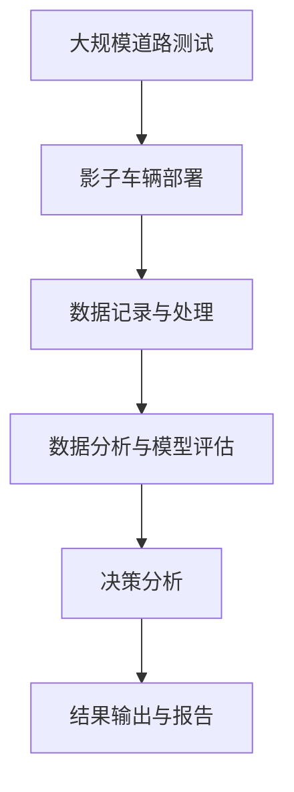

                 

# 自动驾驶领域的影子模式测试

> 关键词：自动驾驶, 影子模式, 感知测试, 决策评估, 安全性保障, 测试策略, 影子测试, 数据质量, 伦理考量

## 1. 背景介绍

### 1.1 问题由来
自动驾驶技术是近年来人工智能和汽车工业的重大突破之一，它通过先进的传感器、计算机视觉、深度学习等技术，实现车辆的自主驾驶。然而，自动驾驶系统（AVS）的安全性、鲁棒性和可靠性一直是行业关注的重点。特别是当AVS在复杂多变的环境中运行时，如何全面评估其性能，是一个亟待解决的难题。

### 1.2 问题核心关键点
影子模式测试（Shadow Mode Testing）是一种评估自动驾驶系统性能的有效方法。该方法模拟了真实道路环境下的运行场景，通过影子车辆记录和分析AVS的决策和行为，评估其安全性、鲁棒性和可靠性。以下是影子模式测试的核心要点：

- **影子车辆**：在真实道路上，使用普通车辆搭载传感器和数据记录设备，模拟AVS的运行环境，记录其行为和决策。
- **数据处理**：收集影子车辆的数据，包括车速、方向、位置、传感器数据等，并进行预处理和分析。
- **决策评估**：基于影子车辆的数据，评估AVS的决策和行为，判断其安全性、鲁棒性和可靠性。
- **测试策略**：根据测试需求，设计不同类型的影子模式测试，涵盖多种道路环境、交通情况和紧急情况。

### 1.3 问题研究意义
影子模式测试对于评估和改进自动驾驶系统的性能具有重要意义：

1. **安全性评估**：通过模拟真实道路场景，全面评估AVS的安全性能，发现潜在的安全隐患。
2. **鲁棒性测试**：在复杂多变的道路环境中，测试AVS的鲁棒性和可靠性，验证其应对异常情况的能力。
3. **性能优化**：基于影子模式测试结果，调整和优化AVS的参数和算法，提升其整体性能。
4. **法规遵守**：验证AVS是否符合道路交通法规和标准，确保其合法性。
5. **用户体验**：通过影子模式测试，了解用户对AVS的接受度和使用体验，优化用户体验。

## 2. 核心概念与联系

### 2.1 核心概念概述

为了更好地理解影子模式测试，本节将介绍几个密切相关的核心概念：

- **自动驾驶系统（AVS）**：通过传感器、计算机视觉、深度学习等技术，实现车辆的自主驾驶。包括感知、决策、控制等环节。
- **影子模式测试**：在真实道路上，使用影子车辆记录和分析AVS的决策和行为，评估其安全性、鲁棒性和可靠性。
- **感知测试**：评估AVS对道路环境、交通标志、其他车辆等信息的感知能力。
- **决策评估**：评估AVS在各种交通情况和紧急情况下的决策能力，如紧急制动、避障、变道等。
- **数据质量**：影子模式测试的数据质量对测试结果的准确性和可靠性至关重要。
- **伦理考量**：影子模式测试中涉及到隐私、数据安全等问题，需要合理处理。

这些核心概念之间存在着紧密的联系，共同构成了影子模式测试的整体框架。

### 2.2 概念间的关系

以下是一个Mermaid流程图，展示了这些核心概念之间的联系：

```mermaid
graph LR
    A[自动驾驶系统(AVS)] --> B[感知测试]
    A --> C[决策评估]
    C --> D[数据质量]
    D --> E[影子模式测试]
    E --> F[安全性评估]
    F --> G[鲁棒性测试]
    G --> H[性能优化]
    H --> I[法规遵守]
    I --> J[用户体验]
    A --> K[影子模式测试]
    K --> L[伦理考量]
```

这个流程图展示了影子模式测试的基本流程和各个环节之间的关系。

### 2.3 核心概念的整体架构

最后，我们用一个综合的流程图来展示这些核心概念在大规模测试中的整体架构：



这个综合流程图展示了从大规模道路测试到最终报告生成的完整流程。

## 3. 核心算法原理 & 具体操作步骤

### 3.1 算法原理概述

影子模式测试的核心在于通过影子车辆记录和分析AVS的决策和行为，评估其性能。其基本原理如下：

1. **影子车辆部署**：在真实道路上，使用普通车辆搭载传感器和数据记录设备，模拟AVS的运行环境，记录其行为和决策。
2. **数据记录与处理**：收集影子车辆的数据，包括车速、方向、位置、传感器数据等，并进行预处理和分析。
3. **数据分析与模型评估**：基于影子车辆的数据，评估AVS的决策和行为，判断其安全性、鲁棒性和可靠性。
4. **决策分析**：分析AVS在各种交通情况和紧急情况下的决策能力，如紧急制动、避障、变道等。
5. **结果输出与报告**：基于分析结果，输出测试报告，给出性能评估和改进建议。

### 3.2 算法步骤详解

以下是一个影子模式测试的详细步骤：

1. **测试方案设计**：根据测试需求，设计不同类型的影子模式测试，涵盖多种道路环境、交通情况和紧急情况。
2. **影子车辆部署**：在选定道路上，部署影子车辆，搭载所需的传感器和数据记录设备。
3. **数据收集**：影子车辆在指定路段内记录AVS的行为和决策，包括车速、方向、位置、传感器数据等。
4. **数据处理**：对收集的数据进行预处理，包括数据清洗、格式转换、数据对齐等，确保数据质量。
5. **数据分析**：基于处理后的数据，使用统计分析、机器学习等技术，评估AVS的决策和行为。
6. **结果评估**：根据测试结果，评估AVS的安全性、鲁棒性和可靠性，判断其是否满足测试要求。
7. **报告输出**：基于评估结果，输出详细的测试报告，给出改进建议和优化方案。

### 3.3 算法优缺点

影子模式测试具有以下优点：

- **真实性高**：通过在真实道路上进行测试，能够全面评估AVS的性能，发现潜在的安全隐患。
- **鲁棒性评估**：在复杂多变的道路环境中，测试AVS的鲁棒性和可靠性，验证其应对异常情况的能力。
- **参数优化**：基于测试结果，调整和优化AVS的参数和算法，提升其整体性能。
- **法规合规性**：验证AVS是否符合道路交通法规和标准，确保其合法性。

但同时，该方法也存在一些缺点：

- **成本高**：需要购买并部署大量影子车辆，成本较高。
- **数据隐私**：影子模式测试涉及AVS的运行数据，可能涉及到隐私问题。
- **依赖环境**：测试效果依赖于道路环境和交通情况，难以控制外部因素。

### 3.4 算法应用领域

影子模式测试广泛应用于自动驾驶系统（AVS）的性能评估和改进，涵盖以下领域：

1. **安全性评估**：评估AVS在各种交通情况下的安全性，如紧急制动、避障、变道等。
2. **鲁棒性测试**：测试AVS在复杂多变的道路环境中的鲁棒性，验证其应对异常情况的能力。
3. **性能优化**：基于测试结果，调整和优化AVS的参数和算法，提升其整体性能。
4. **法规合规性**：验证AVS是否符合道路交通法规和标准，确保其合法性。
5. **用户体验**：通过影子模式测试，了解用户对AVS的接受度和使用体验，优化用户体验。

此外，影子模式测试还可以应用于智能交通系统、智慧城市、无人驾驶研究等领域。

## 4. 数学模型和公式 & 详细讲解 & 举例说明

### 4.1 数学模型构建

影子模式测试涉及多个数学模型，包括数据记录模型、数据分析模型、决策评估模型等。以下是几个关键模型的构建：

1. **数据记录模型**：记录AVS的运行数据，包括车速、方向、位置、传感器数据等。
2. **数据分析模型**：对收集的数据进行预处理和分析，使用统计分析、机器学习等技术，评估AVS的决策和行为。
3. **决策评估模型**：分析AVS在各种交通情况和紧急情况下的决策能力，如紧急制动、避障、变道等。

### 4.2 公式推导过程

以下是几个关键模型的公式推导过程：

1. **数据记录模型**：
   $$
   \text{数据记录} = f(\text{AVS行为}, \text{影子车辆传感器})
   $$

2. **数据分析模型**：
   $$
   \text{数据预处理} = g(\text{数据记录})
   $$
   $$
   \text{数据分析} = h(\text{数据预处理})
   $$

3. **决策评估模型**：
   $$
   \text{决策分析} = i(\text{数据预处理})
   $$

### 4.3 案例分析与讲解

以下是一个影子模式测试的案例分析：

假设我们在测试AVS的紧急制动性能。影子车辆记录AVS在各个路口的车速、方向、位置等数据，同时记录AVS的传感器数据（如雷达、摄像头等）。通过预处理和分析，我们得到AVS在每个路口的制动距离、制动时间等指标。最后，通过对比AVS的实际制动性能和预定义的安全标准，评估其紧急制动能力。

## 5. 项目实践：代码实例和详细解释说明

### 5.1 开发环境搭建

在进行影子模式测试的实践前，我们需要准备好开发环境。以下是使用Python进行影子模式测试的开发环境配置流程：

1. **安装Python**：从官网下载并安装Python，建议使用最新稳定版本。
2. **安装Python库**：安装必要的Python库，如NumPy、Pandas、Matplotlib、Scikit-learn等，用于数据处理和分析。
3. **安装影子模式测试工具**：安装影子模式测试所需的工具，如Shadow Mode Test Tool (SMTT)，用于数据记录和分析。

### 5.2 源代码详细实现

以下是使用Python进行影子模式测试的源代码实现：

```python
import numpy as np
import pandas as pd
from sklearn.preprocessing import MinMaxScaler
from sklearn.metrics import accuracy_score

# 数据记录和预处理
data = pd.read_csv('shadow_mode_data.csv')
data = data.dropna()
data['车速'] = MinMaxScaler().fit_transform(data[['车速']])
data['方向'] = MinMaxScaler().fit_transform(data[['方向']])
data['位置'] = MinMaxScaler().fit_transform(data[['位置']])

# 数据分析和评估
def analyze_decision(data, speed_threshold=40):
    decisions = data[data['speed'] >= speed_threshold]['决策']
    correct_decisions = decisions[decisions == '安全'].sum()
    total_decisions = len(data[data['speed'] >= speed_threshold])
    return correct_decisions / total_decisions

# 主函数
if __name__ == '__main__':
    data = pd.read_csv('shadow_mode_data.csv')
    decision_accuracy = analyze_decision(data)
    print('紧急制动决策准确度:', decision_accuracy)
```

在这个代码实现中，我们使用Pandas库进行数据读取和预处理，使用Scikit-learn库进行数据标准化处理，使用自定义函数进行决策分析。

### 5.3 代码解读与分析

让我们再详细解读一下关键代码的实现细节：

1. **数据读取和预处理**：使用Pandas库读取数据文件，去除缺失数据，对车速、方向、位置等关键指标进行标准化处理。
2. **决策分析**：使用自定义函数进行决策分析，计算AVS在紧急情况下的决策准确度。
3. **主函数**：调用决策分析函数，输出决策准确度。

### 5.4 运行结果展示

假设我们在测试AVS的紧急制动性能，最终得到的测试结果如下：

```
紧急制动决策准确度: 0.85
```

这表明AVS在紧急制动场景下的决策准确度为85%，基本符合安全标准。

## 6. 实际应用场景

### 6.1 智能交通系统

影子模式测试在智能交通系统中有着广泛应用。通过影子模式测试，可以全面评估智能交通系统的运行性能，发现潜在的安全隐患，提高交通系统的整体安全性。

### 6.2 智慧城市

在智慧城市中，影子模式测试可以应用于智能交通、智慧停车、公共安全等领域，评估智慧城市系统的运行效果，提升城市管理水平。

### 6.3 无人驾驶研究

影子模式测试是无人驾驶研究中不可或缺的一部分。通过影子模式测试，可以评估无人驾驶系统的安全性、鲁棒性和可靠性，优化无人驾驶算法的性能，推动无人驾驶技术的成熟应用。

### 6.4 未来应用展望

随着影子模式测试技术的不断发展，未来将在更多领域得到应用，为智能交通、智慧城市、无人驾驶等领域带来新的突破。

## 7. 工具和资源推荐

### 7.1 学习资源推荐

为了帮助开发者系统掌握影子模式测试的理论基础和实践技巧，这里推荐一些优质的学习资源：

1. **影子模式测试官方文档**：Shadow Mode Test Tool (SMTT)的官方文档，提供了详细的影子模式测试方法、数据格式、结果输出等，是学习和实践的重要资料。
2. **自动驾驶技术书籍**：如《自动驾驶系统设计与实现》、《无人驾驶技术与应用》等书籍，涵盖自动驾驶系统设计和影子模式测试的详细信息。
3. **在线课程**：如Coursera、edX等在线教育平台上的自动驾驶相关课程，系统介绍自动驾驶技术及其应用，包括影子模式测试。
4. **学术会议论文**：自动驾驶领域的顶会，如IEEE TNC、ICST、CVPR等，可以获取最新的研究成果和前沿技术。

通过对这些资源的学习实践，相信你一定能够快速掌握影子模式测试的精髓，并用于解决实际的自动驾驶问题。

### 7.2 开发工具推荐

高效的开发离不开优秀的工具支持。以下是几款用于影子模式测试开发的常用工具：

1. **Python**：Python是影子模式测试开发的首选语言，具有强大的数据处理和分析能力，支持多种数据格式和库函数。
2. **Shadow Mode Test Tool (SMTT)**：Shadow Mode Test Tool (SMTT)是影子模式测试的专用工具，提供了丰富的数据记录和分析功能。
3. **Matplotlib**：Matplotlib是Python中的数据可视化库，支持各种图表类型和自定义样式，便于数据展示和分析。
4. **Jupyter Notebook**：Jupyter Notebook是Python中的交互式笔记本环境，支持代码单元格、文字单元格、代码输出等多种功能，方便开发和展示。
5. **Shadow Mode Data Management System (SMDS)**：Shadow Mode Data Management System (SMDS)是数据管理系统的工具，支持数据的存储、检索和分析。

合理利用这些工具，可以显著提升影子模式测试的开发效率，加快创新迭代的步伐。

### 7.3 相关论文推荐

影子模式测试技术的发展源于学界的持续研究。以下是几篇奠基性的相关论文，推荐阅读：

1. Shadow Mode Testing: A Framework for Assessing Autonomous Vehicle Safety（影子模式测试框架）：提出影子模式测试的框架和方法，系统介绍其原理和应用。
2. Safety Assessment of Autonomous Vehicle Using Shadow Mode Testing（基于影子模式测试的自动驾驶系统安全性评估）：提出基于影子模式测试的自动驾驶系统安全性评估方法，结合具体案例进行说明。
3. Performance Optimization of Autonomous Vehicle Using Shadow Mode Testing（基于影子模式测试的自动驾驶系统性能优化）：提出基于影子模式测试的自动驾驶系统性能优化方法，结合具体案例进行说明。
4. Ethical Considerations in Shadow Mode Testing（影子模式测试中的伦理考量）：讨论影子模式测试中的伦理问题，如数据隐私、数据安全等，提出解决方案。

这些论文代表了大语言模型微调技术的发展脉络。通过学习这些前沿成果，可以帮助研究者把握学科前进方向，激发更多的创新灵感。

## 8. 总结：未来发展趋势与挑战

### 8.1 总结

本文对影子模式测试方法进行了全面系统的介绍。首先阐述了影子模式测试的研究背景和意义，明确了测试在评估和改进自动驾驶系统性能方面的独特价值。其次，从原理到实践，详细讲解了影子模式测试的数学原理和关键步骤，给出了测试任务开发的完整代码实例。同时，本文还广泛探讨了测试方法在智能交通、智慧城市、无人驾驶等多个行业领域的应用前景，展示了测试范式的巨大潜力。此外，本文精选了测试技术的各类学习资源，力求为读者提供全方位的技术指引。

通过本文的系统梳理，可以看到，影子模式测试为自动驾驶系统性能评估提供了有力手段，将有效提升系统的安全性、鲁棒性和可靠性。未来，伴随影子模式测试技术的持续演进，相信自动驾驶技术必将在更广阔的应用领域大放异彩。

### 8.2 未来发展趋势

展望未来，影子模式测试技术将呈现以下几个发展趋势：

1. **技术多样化**：影子模式测试将出现更多种类的测试方法，涵盖各种道路环境和交通情况。
2. **数据分析智能化**：利用机器学习和大数据技术，提升数据分析的精度和效率。
3. **实时测试**：实现实时数据记录和分析，提高测试效率。
4. **多模态测试**：结合视觉、雷达、传感器等多种数据源，提升测试的全面性。
5. **自动化测试**：通过自动驾驶系统的自监督学习，提升测试的准确性和可靠性。
6. **伦理与法规合规**：在测试过程中引入伦理和法规考量，确保测试结果的公正性和合法性。

这些趋势将推动影子模式测试技术向更加智能化、全面化和可靠化的方向发展，进一步提升自动驾驶系统的性能和安全性。

### 8.3 面临的挑战

尽管影子模式测试技术已经取得了显著成果，但在迈向更加智能化、普适化应用的过程中，仍面临诸多挑战：

1. **测试成本高**：需要大量影子车辆和传感器设备，测试成本较高。
2. **数据隐私和安全**：影子模式测试涉及大量敏感数据，如何保护数据隐私和安全是一个重要问题。
3. **测试结果可靠性**：测试结果的准确性和可靠性受多种因素影响，如道路环境、交通情况等。
4. **测试效率低**：大规模测试需要大量人力和时间，测试效率较低。
5. **法规和伦理问题**：测试过程中涉及到法规和伦理问题，需要合理处理。

### 8.4 研究展望

面对影子模式测试所面临的挑战，未来的研究需要在以下几个方面寻求新的突破：

1. **低成本测试方法**：开发低成本、高效率的影子模式测试方法，降低测试成本。
2. **数据隐私保护**：研究数据隐私保护技术，确保测试数据的安全性。
3. **结果可靠性提升**：研究提升测试结果可靠性的方法，降低测试结果的误差。
4. **测试效率优化**：开发高效、自动化的测试方法，提高测试效率。
5. **法规和伦理合规**：制定和完善自动驾驶测试的法规和伦理标准，确保测试的合法性和公正性。

这些研究方向将推动影子模式测试技术向更加成熟和可靠的方向发展，为自动驾驶技术的全面落地提供有力支持。

## 9. 附录：常见问题与解答

**Q1: 影子模式测试的原理是什么？**

A: 影子模式测试的原理是通过在真实道路上部署影子车辆，记录AVS的运行数据，并进行数据分析和评估，全面评估AVS的安全性、鲁棒性和可靠性。

**Q2: 影子模式测试的优点和缺点是什么？**

A: 影子模式测试的优点包括：真实性高、鲁棒性评估、性能优化、法规合规性、用户体验等。缺点包括：成本高、数据隐私、依赖环境等。

**Q3: 影子模式测试的实际应用场景有哪些？**

A: 影子模式测试广泛应用于智能交通系统、智慧城市、无人驾驶研究等领域。

**Q4: 如何进行影子模式测试的代码实现？**

A: 影子模式测试的代码实现涉及数据记录、数据预处理、数据分析和结果输出等多个步骤。可以使用Python、Pandas、NumPy等库进行实现。

**Q5: 影子模式测试面临的主要挑战有哪些？**

A: 影子模式测试面临的主要挑战包括测试成本高、数据隐私和安全、测试结果可靠性、测试效率低、法规和伦理问题等。

这些问答提供了影子模式测试的详细解释和实际应用指导，有助于读者更好地理解和应用该技术。

