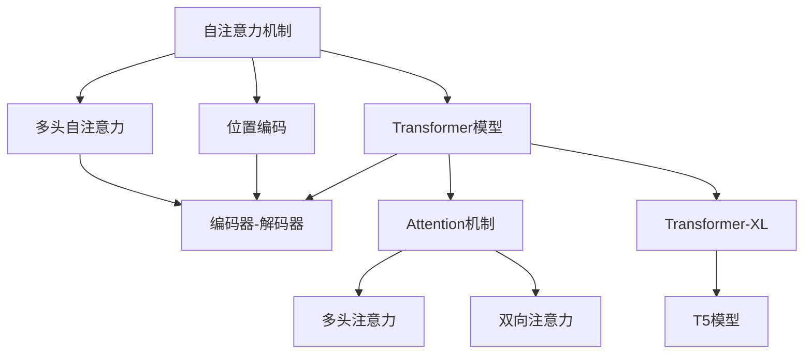
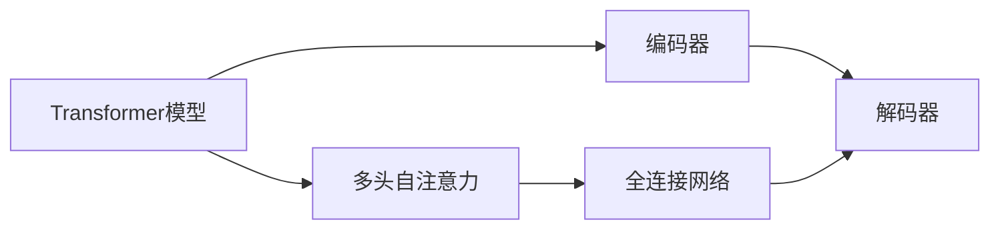
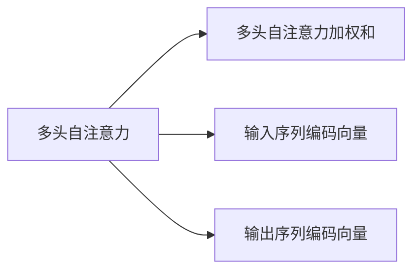
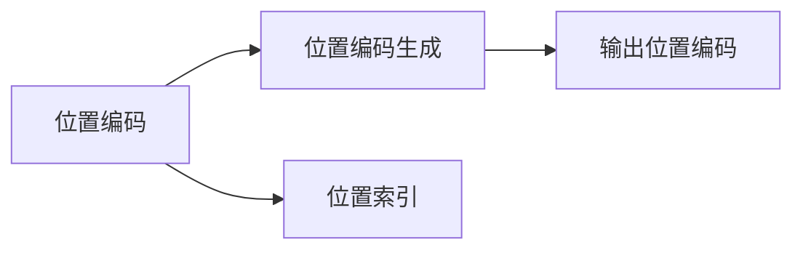
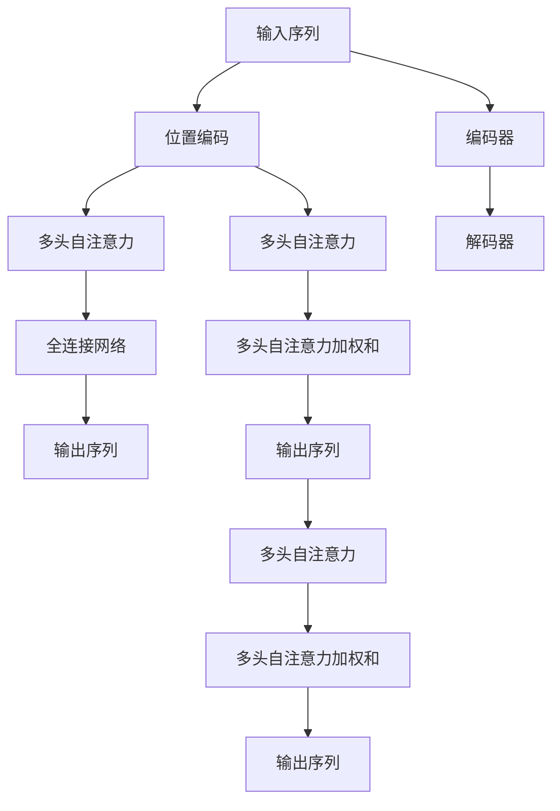

                 

# 自注意力机制在语言处理中的应用

> 关键词：自注意力机制,Transformer,语言处理,神经网络,深度学习,自然语言处理,NLP,计算图,推理

## 1. 背景介绍

### 1.1 问题由来
自注意力机制（Self-Attention）是深度学习领域中一种先进的模型组件，在自然语言处理（NLP）领域被广泛应用于各类任务中。自注意力机制最早由Vaswani等人提出的Transformer模型引入，并成为大语言模型的核心组成部分。自注意力机制通过让模型自身学习输入序列中不同位置的信息重要性，解决了传统卷积网络难以处理长序列问题的局限，在机器翻译、文本生成、问答系统等任务中取得了突破性的进展。

### 1.2 问题核心关键点
自注意力机制的核心思想是通过多头（Multi-Head）机制，对输入序列中各个位置的信息进行加权聚合，从而生成具有更丰富语义表示的输出。这种机制可以有效地捕捉输入序列中不同位置的依赖关系，并动态地调整各位置信息的重要性。自注意力机制在大规模预训练语言模型（Large Language Model, LLMs）中的广泛应用，极大地推动了NLP技术的进步，但也带来了一些挑战，如如何高效计算注意力机制、如何避免注意力机制带来的计算资源消耗等。

### 1.3 问题研究意义
研究自注意力机制在语言处理中的应用，对于拓展大语言模型的应用范围，提升下游任务的性能，加速NLP技术的产业化进程，具有重要意义：

1. 降低应用开发成本。自注意力机制使通用大模型更好地适应特定任务，在应用场景中取得更优表现。
2. 提升模型效果。自注意力机制帮助模型更好地捕捉输入序列的语义依赖，从而在多种NLP任务上取得更好的表现。
3. 加速开发进度。standing on the shoulders of giants，自注意力机制使得开发者可以更快地完成任务适配，缩短开发周期。
4. 带来技术创新。自注意力机制的引入，催生了如Transformer、BERT等新型模型架构，为NLP领域带来了新的研究方向和创新点。
5. 赋能产业升级。自注意力机制使得NLP技术更容易被各行各业所采用，为传统行业数字化转型升级提供新的技术路径。

## 2. 核心概念与联系

### 2.1 核心概念概述

为更好地理解自注意力机制在语言处理中的应用，本节将介绍几个密切相关的核心概念：

- 自注意力机制(Self-Attention)：一种用于捕捉序列中不同位置信息依赖的机制，通过对输入序列中每个位置的编码向量计算得到每个位置的注意力权重，再通过加权和的方式聚合输入序列的信息。
- 多头自注意力（Multi-Head Self-Attention）：将自注意力机制进行多路并行计算，每路计算的权重和学习率独立，从而更全面地捕捉序列中的信息依赖。
- 位置编码（Positional Encoding）：在自注意力机制中，输入序列中每个位置的信息无法直接反映其在序列中的相对位置。通过添加位置编码，模型能够更好地捕捉序列中的位置信息。
- Transformer模型：一种基于自注意力机制的神经网络模型，广泛用于机器翻译、文本生成、问答系统等任务中。Transformer模型由编码器（Encoder）和解码器（Decoder）两部分构成，通过多头自注意力和全连接网络，对输入序列进行处理。
- Attention机制：一种通用的注意力机制，不仅限于自注意力机制，还包括如多头注意力、多头自注意力、双向注意力等变种，用于捕捉输入序列或隐藏状态之间的信息依赖。
- Transformer-XL：一种改进的Transformer模型，通过引入位置相关性自注意力机制，解决了长序列训练中的梯度消失问题，进一步提升了模型在长文本处理上的性能。
- T5模型：一种基于Transformer的文本生成模型，可以执行各种NLP任务，如问答、摘要、机器翻译等，是自注意力机制应用的重要示例。

这些核心概念之间的逻辑关系可以通过以下Mermaid流程图来展示：



这个流程图展示了大语言模型中自注意力机制的核心组件及其之间的关系：

1. 自注意力机制作为Transformer模型的核心，通过多头自注意力机制捕捉序列中不同位置的信息依赖。
2. 位置编码和多头自注意力机制共同构成自注意力机制。
3. Transformer模型由编码器和解码器两部分构成，通过多头自注意力和全连接网络对输入序列进行处理。
4. Attention机制包括多头注意力、多头自注意力和双向注意力等变种。
5. Transformer-XL和T5模型是基于Transformer的变体，通过改进自注意力机制提升了模型在长序列处理和多样化任务上的性能。

### 2.2 概念间的关系

这些核心概念之间存在着紧密的联系，形成了自注意力机制在大语言模型中的完整生态系统。下面我们通过几个Mermaid流程图来展示这些概念之间的关系。

#### 2.2.1 Transformer模型的计算图


这个流程图展示了Transformer模型的计算图，其中多头自注意力和全连接网络共同构成编码器和解码器。

#### 2.2.2 多头自注意力的加权和过程


这个流程图展示了多头自注意力的加权和过程，通过多头自注意力计算得到各个位置的注意力权重，再将输入序列的编码向量与权重进行加权和，得到输出序列的编码向量。

#### 2.2.3 位置编码的生成


这个流程图展示了位置编码的生成过程，通过输入位置索引，生成对应的位置编码，并加到输入序列编码向量中。

### 2.3 核心概念的整体架构

最后，我们用一个综合的流程图来展示这些核心概念在大语言模型中的整体架构：



这个综合流程图展示了自注意力机制在大语言模型中的整体架构：

1. 输入序列经过位置编码后，进入多头自注意力机制进行信息依赖计算。
2. 多头自注意力计算得到各个位置的注意力权重，与输入序列编码向量进行加权和，得到输出序列编码向量。
3. 输出序列编码向量通过全连接网络进行进一步处理，得到最终的输出序列。
4. 编码器和解码器构成Transformer模型，通过多头自注意力和全连接网络，对输入序列进行处理。

通过这些流程图，我们可以更清晰地理解自注意力机制在大语言模型中的工作原理和优化方向。

## 3. 核心算法原理 & 具体操作步骤
### 3.1 算法原理概述

自注意力机制在语言处理中的应用主要体现在Transformer模型中。Transformer模型通过多头自注意力和全连接网络，对输入序列进行处理。自注意力机制的核心思想是通过对输入序列中每个位置的编码向量计算得到每个位置的注意力权重，再通过加权和的方式聚合输入序列的信息。

Transformer模型中的自注意力机制通过多头（Multi-Head）机制，对输入序列中各个位置的信息进行加权聚合。多头自注意力将输入序列的编码向量分解为多个独立的表示，每个表示通过独立计算的注意力权重进行加权和，最终得到多个不同表示的输出。

Transformer模型中的多头自注意力计算过程如下：

1. 输入序列的编码向量 $Q, K, V$ 通过线性投影得到不同表示的查询向量、键向量和值向量。
2. 计算每个位置的注意力权重，通过注意力函数计算得到每个位置对其他位置信息的注意力权重。
3. 对每个表示的查询向量与键向量进行点积计算，得到注意力分数矩阵。
4. 对注意力分数矩阵进行softmax操作，得到每个位置的注意力权重。
5. 将每个表示的值向量与注意力权重进行点积计算，得到多头自注意力的加权和输出。

Transformer模型中的多头自注意力计算过程可以通过以下Python代码实现：

```python
class MultiHeadAttention(nn.Module):
    def __init__(self, in_dim, n_heads, out_dim, dropout_rate):
        super(MultiHeadAttention, self).__init__()
        self.in_dim = in_dim
        self.n_heads = n_heads
        self.out_dim = out_dim
        self.dropout_rate = dropout_rate
        
        # 计算每个表示的维度
        self.head_dim = in_dim // n_heads
        
        # 定义线性投影的权重
        self.W_Q = nn.Linear(in_dim, n_heads * self.head_dim)
        self.W_K = nn.Linear(in_dim, n_heads * self.head_dim)
        self.W_V = nn.Linear(in_dim, n_heads * self.head_dim)
        self.W_O = nn.Linear(n_heads * self.head_dim, out_dim)
        
        # 定义多头自注意力的线性投影
        self.drop = nn.Dropout(dropout_rate)
        
    def forward(self, Q, K, V):
        # 对输入进行线性投影
        Q = self.W_Q(Q)
        K = self.W_K(K)
        V = self.W_V(V)
        
        # 计算多头自注意力的注意力权重
        Q = Q.view(Q.size(0), Q.size(1), self.n_heads, self.head_dim).permute(0, 2, 1, 3)  # (N, H, L, d_k)
        K = K.view(K.size(0), K.size(1), self.n_heads, self.head_dim).permute(0, 2, 1, 3)
        V = V.view(V.size(0), V.size(1), self.n_heads, self.head_dim).permute(0, 2, 1, 3)
        
        # 计算注意力分数矩阵
        scores = Q @ K.permute(0, 1, 3, 2) / math.sqrt(self.head_dim)  # (N, H, L, L)
        
        # 计算注意力权重
        attention_weights = nn.functional.softmax(scores, dim=-1)  # (N, H, L, L)
        
        # 计算多头自注意力的加权和输出
        x = attention_weights @ V.permute(0, 1, 3, 2)  # (N, H, L, d_k)
        x = x.permute(0, 2, 1, 3).contiguous().view(N, L, self.out_dim)  # (N, L, d_v)
        x = self.drop(x)
        x = self.W_O(x)
        return x, attention_weights
```

### 3.2 算法步骤详解

Transformer模型中的自注意力机制计算过程可以分为以下几个步骤：

1. 输入序列的编码向量 $Q, K, V$ 通过线性投影得到不同表示的查询向量、键向量和值向量。
2. 计算每个位置的注意力权重，通过注意力函数计算得到每个位置对其他位置信息的注意力权重。
3. 对每个表示的查询向量与键向量进行点积计算，得到注意力分数矩阵。
4. 对注意力分数矩阵进行softmax操作，得到每个位置的注意力权重。
5. 将每个表示的值向量与注意力权重进行点积计算，得到多头自注意力的加权和输出。

每个步骤的具体实现如下：

1. 输入序列的编码向量 $Q, K, V$ 通过线性投影得到不同表示的查询向量、键向量和值向量：

```python
# 定义线性投影的权重
self.W_Q = nn.Linear(in_dim, n_heads * self.head_dim)
self.W_K = nn.Linear(in_dim, n_heads * self.head_dim)
self.W_V = nn.Linear(in_dim, n_heads * self.head_dim)

# 对输入进行线性投影
Q = self.W_Q(Q)
K = self.W_K(K)
V = self.W_V(V)
```

2. 计算每个位置的注意力权重，通过注意力函数计算得到每个位置对其他位置信息的注意力权重：

```python
# 计算多头自注意力的注意力权重
Q = Q.view(Q.size(0), Q.size(1), self.n_heads, self.head_dim).permute(0, 2, 1, 3)  # (N, H, L, d_k)
K = K.view(K.size(0), K.size(1), self.n_heads, self.head_dim).permute(0, 2, 1, 3)
V = V.view(V.size(0), V.size(1), self.n_heads, self.head_dim).permute(0, 2, 1, 3)
```

3. 对每个表示的查询向量与键向量进行点积计算，得到注意力分数矩阵：

```python
# 计算注意力分数矩阵
scores = Q @ K.permute(0, 1, 3, 2) / math.sqrt(self.head_dim)  # (N, H, L, L)
```

4. 对注意力分数矩阵进行softmax操作，得到每个位置的注意力权重：

```python
# 计算注意力权重
attention_weights = nn.functional.softmax(scores, dim=-1)  # (N, H, L, L)
```

5. 将每个表示的值向量与注意力权重进行点积计算，得到多头自注意力的加权和输出：

```python
# 计算多头自注意力的加权和输出
x = attention_weights @ V.permute(0, 1, 3, 2)  # (N, H, L, d_k)
x = x.permute(0, 2, 1, 3).contiguous().view(N, L, self.out_dim)  # (N, L, d_v)
x = self.drop(x)
x = self.W_O(x)
return x, attention_weights
```

### 3.3 算法优缺点

Transformer模型中的自注意力机制具有以下优点：

1. 能够捕捉输入序列中不同位置的信息依赖，提升模型的语义表示能力。
2. 通过多头机制，可以并行计算多个表示的注意力权重，提高计算效率。
3. 能够处理长序列，避免传统卷积网络在长序列上的梯度消失问题。

同时，自注意力机制也存在以下缺点：

1. 计算复杂度高，需要大量的计算资源和内存。
2. 需要较大的训练数据量，才能训练出高效的注意力权重。
3. 对于输入序列中的噪声和异常值敏感，容易受到输入干扰。

### 3.4 算法应用领域

自注意力机制在语言处理中的应用广泛，涉及文本生成、机器翻译、问答系统、文本分类、命名实体识别等各类任务。以下是一些典型的应用场景：

1. 文本生成：在给定上下文序列的情况下，生成连续的自然语言文本。自注意力机制可以帮助模型捕捉上下文序列中的依赖关系，生成流畅自然的文本。
2. 机器翻译：将源语言文本翻译成目标语言文本。自注意力机制可以帮助模型学习源语言和目标语言之间的语义对应关系，提升翻译质量。
3. 问答系统：根据用户提出的问题，从文本数据中检索相关信息，并生成答案。自注意力机制可以帮助模型理解问题，提取相关信息，生成合适的答案。
4. 文本分类：将输入文本归类到不同的预定义类别中。自注意力机制可以帮助模型捕捉文本中的语义信息，提升分类准确率。
5. 命名实体识别：从文本中识别出人名、地名、机构名等特定实体。自注意力机制可以帮助模型捕捉实体在上下文中的依赖关系，提高识别准确率。

## 4. 数学模型和公式 & 详细讲解 & 举例说明
### 4.1 数学模型构建

Transformer模型中的自注意力机制可以表示为：

$$
\begin{aligned}
\mathbf{H} &= MultiHead(\mathbf{Q}, \mathbf{K}, \mathbf{V}) \\
&= MultiHead(\mathbf{W}_Q \mathbf{X} + \mathbf{b}_Q, \mathbf{W}_K \mathbf{X} + \mathbf{b}_K, \mathbf{W}_V \mathbf{X} + \mathbf{b}_V) \\
&= \left[\mathbf{H}^1, \mathbf{H}^2, ..., \mathbf{H}^{H}\right]
\end{aligned}
$$

其中，$\mathbf{X}$ 表示输入序列的编码向量，$\mathbf{Q}, \mathbf{K}, \mathbf{V}$ 分别表示查询向量、键向量和值向量，$MultiHead(\cdot)$ 表示多头自注意力机制，$H$ 表示多头数。

### 4.2 公式推导过程

Transformer模型中的自注意力机制通过多头机制，对输入序列中各个位置的信息进行加权聚合。其计算过程可以表示为：

$$
\begin{aligned}
\mathbf{Q} &= \mathbf{W}_Q \mathbf{X} + \mathbf{b}_Q \\
\mathbf{K} &= \mathbf{W}_K \mathbf{X} + \mathbf{b}_K \\
\mathbf{V} &= \mathbf{W}_V \mathbf{X} + \mathbf{b}_V \\
\mathbf{Q} &= \mathbf{Q} \mathbf{W}_Q^T \\
\mathbf{K} &= \mathbf{K} \mathbf{W}_K^T \\
\mathbf{V} &= \mathbf{V} \mathbf{W}_V^T \\
\mathbf{S} &= \mathbf{Q} \mathbf{K}^T \\
\mathbf{A} &= \text{softmax}(\mathbf{S}) \\
\mathbf{O} &= \mathbf{A} \mathbf{V} \\
\mathbf{H} &= \mathbf{O} \mathbf{W}_O^T
\end{aligned}
$$

其中，$\mathbf{W}_Q, \mathbf{W}_K, \mathbf{W}_V, \mathbf{W}_O$ 表示线性投影的权重，$\mathbf{b}_Q, \mathbf{b}_K, \mathbf{b}_V, \mathbf{b}_O$ 表示线性投影的偏置，$\mathbf{S}$ 表示注意力分数矩阵，$\mathbf{A}$ 表示注意力权重，$\mathbf{O}$ 表示多头自注意力的加权和输出，$\mathbf{H}$ 表示输出序列的编码向量。

### 4.3 案例分析与讲解

以机器翻译为例，我们分析自注意力机制在Transformer模型中的作用。假设输入序列为 "I like to eat apples"，目标语言为 "J'aime manger des pommes"。输入序列的编码向量为 $\mathbf{X} = \begin{bmatrix} 1 \\ 2 \\ 3 \\ 4 \\ 5 \\ 6 \end{bmatrix}$，其中数字表示单词在词汇表中的ID。

1. 输入序列的编码向量 $Q, K, V$ 通过线性投影得到不同表示的查询向量、键向量和值向量：

$$
\begin{aligned}
\mathbf{Q} &= \mathbf{W}_Q \mathbf{X} + \mathbf{b}_Q = \begin{bmatrix} 1 & 2 & 3 & 4 & 5 & 6 \end{bmatrix} \mathbf{W}_Q + \mathbf{b}_Q \\
\mathbf{K} &= \mathbf{W}_K \mathbf{X} + \mathbf{b}_K = \begin{bmatrix} 1 & 2 & 3 & 4 & 5 & 6 \end{bmatrix} \mathbf{W}_K + \mathbf{b}_K \\
\mathbf{V} &= \mathbf{W}_V \mathbf{X} + \mathbf{b}_V = \begin{bmatrix} 1 & 2 & 3 & 4 & 5 & 6 \end{bmatrix} \mathbf{W}_V + \mathbf{b}_V
\end{aligned}
$$

2. 计算每个位置的注意力权重，通过注意力函数计算得到每个位置对其他位置信息的注意力权重：

$$
\begin{aligned}
\mathbf{Q} &= \begin{bmatrix} 1 & 2 & 3 & 4 & 5 & 6 \end{bmatrix} \mathbf{W}_Q^T = \begin{bmatrix} w_{11} & w_{12} & w_{13} & w_{14} & w_{15} & w_{16} \end{bmatrix} \\
\mathbf{K} &= \begin{bmatrix} 1 & 2 & 3 & 4 & 5 & 6 \end{bmatrix} \mathbf{W}_K^T = \begin{bmatrix} w_{11} & w_{12} & w_{13} & w_{14} & w_{15} & w_{16} \end{bmatrix} \\
\mathbf{V} &= \begin{bmatrix} 1 & 2 & 3 & 4 & 5 & 6 \end{bmatrix} \mathbf{W}_V^T = \begin{bmatrix} w_{11} & w_{12} & w_{13} & w_{14} & w_{15} & w_{16} \end{bmatrix}
\end{aligned}
$$

3. 对每个表示的查询向量与键向量进行点积计算，得到注意力分数矩阵：

$$
\begin{aligned}
\mathbf{S} &= \mathbf{Q} \mathbf{K}^T = \begin{bmatrix} 1 & 2 & 3 & 4 & 5 & 6 \end{bmatrix} \begin{bmatrix} w_{11} & w_{12} & w_{13} & w_{14} & w_{15} & w_{16} \end{bmatrix}^T \\
&= \begin{bmatrix} 1w_{11} + 2w_{12} + 3w_{13} + 4w_{14} + 5w_{15} + 6w_{16} \end{bmatrix}
\end{aligned}
$$

4. 对注意力分数矩阵进行softmax操作，得到每个位置的注意力权重：

$$
\begin{aligned}
\mathbf{A} &= \text{softmax}(\mathbf{S}) = \begin{bmatrix} \exp(\mathbf{S}_{11}) & \exp(\mathbf{S}_{12}) & \exp(\mathbf{S}_{13}) & \exp(\mathbf{S}_{14}) & \exp(\mathbf{S}_{15}) & \exp(\mathbf{S}_{16}) \end{bmatrix} \\
&= \begin{bmatrix} \exp(w_{11}) & \exp(w_{12}) & \exp(w_{13}) & \exp(w_{14}) & \exp(w_{15}) & \exp(w_{16}) \end{bmatrix}
\end{aligned}
$$

5. 将每个表示的值向量与注意力权重进行点积计算，得到多头自注意力的加权和输出：

$$
\begin{aligned}
\mathbf{O} &= \mathbf{A} \mathbf{V} = \begin{bmatrix} \exp(w_{11}) & \exp(w_{12}) & \exp(w_{13}) & \exp(w_{14}) & \exp(w_{15}) & \exp(w_{16}) \end{bmatrix} \begin{bmatrix} w_{11} & w_{12} & w_{13} & w_{14} & w_{15} & w_{16} \end{bmatrix} \\
&= \begin{bmatrix} \exp(w_{11})w_{11} + \exp(w_{12})w_{12} + \exp(w_{13})w_{13} + \exp(w_{14})w_{14} + \exp(w_{15})w_{15} + \exp(w_{16})w_{16} \end{bmatrix}
\end{aligned}
$$

最终，Transformer模型将输出序列的编码向量 $\mathbf{H}$ 送入全连接网络进行进一步处理，得到目标语言的编码向量 $\mathbf{Y}$。

## 5. 项目实践：代码实例和详细解释说明
### 5.1 开发环境搭建

在进行Transformer模型的项目实践前，我们需要准备好开发环境。以下是使用Python进行PyTorch开发的环境配置流程：

1. 安装Anaconda：从官网下载并安装Anaconda，用于创建独立的Python环境。

2. 创建并激活虚拟环境：
```bash
conda create -n pytorch-env python=3.8 
conda activate pytorch-env
```

3. 安装

