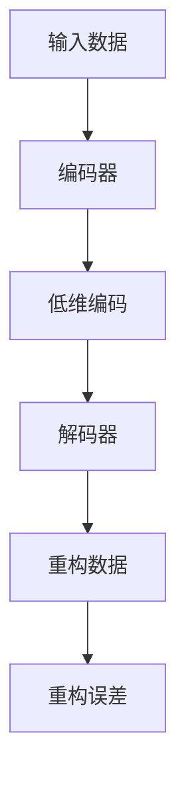

                 

# 自编码器(Autoencoders) - 原理与代码实例讲解

> 关键词：自编码器,压缩感知,深度学习,降维,编码器,解码器,无监督学习

## 1. 背景介绍

### 1.1 问题由来

在深度学习领域，自编码器（Autoencoder）是一种无监督学习的模型，它能够通过自身的数据压缩和重构能力，实现数据的降维和特征提取。自编码器广泛应用于图像处理、音频信号处理、自然语言处理等领域，是深度学习的重要组成部分。

### 1.2 问题核心关键点

自编码器模型的核心思想是：通过一个编码器将输入数据压缩成低维编码，然后通过一个解码器将低维编码重构回原始数据。自编码器可以用于数据降维、特征提取、异常检测、数据可视化等任务，具有广泛的应用前景。

## 2. 核心概念与联系

### 2.1 核心概念概述

为了更好地理解自编码器，本节将介绍几个密切相关的核心概念：

- **自编码器（Autoencoder）**：一种无监督学习模型，通过编码器将输入数据压缩成低维编码，再通过解码器将低维编码重构回原始数据，从而实现数据的降维和特征提取。
- **编码器（Encoder）**：自编码器中的第一个组件，负责将输入数据压缩成低维编码。
- **解码器（Decoder）**：自编码器中的第二个组件，负责将低维编码重构回原始数据。
- **重构误差（Reconstruction Error）**：解码器重构输出的数据与原始输入数据之间的差异，用于衡量模型的性能。
- **压缩率（Compression Ratio）**：输入数据维度与低维编码维度之比，衡量自编码器的压缩能力。

这些核心概念之间的逻辑关系可以通过以下Mermaid流程图来展示：



这个流程图展示了自编码器模型中编码器和解码器之间的数据流关系，以及重构误差和压缩率的概念。

### 2.2 概念间的关系

这些核心概念之间存在着紧密的联系，构成了自编码器的完整工作流程：

- **编码器**：将输入数据压缩成低维编码，是自编码器的核心组件，决定了模型的压缩能力和特征提取能力。
- **解码器**：将低维编码重构回原始数据，是自编码器的辅助组件，决定了重构误差和模型的性能。
- **重构误差**：衡量解码器重构输出的数据与原始输入数据之间的差异，用于评估模型的性能。
- **压缩率**：衡量自编码器压缩输入数据后的维度变化，反映了模型的压缩能力和数据降维效果。

## 3. 核心算法原理 & 具体操作步骤

### 3.1 算法原理概述

自编码器模型基于神经网络，通常包括一个编码器和一个解码器，具体结构如图1所示：


图1：自编码器结构图

自编码器的训练过程包括以下两个步骤：

1. **编码过程**：将输入数据 $x$ 通过编码器 $E$ 映射到低维编码 $z$。
2. **解码过程**：将低维编码 $z$ 通过解码器 $D$ 重构回原始数据 $x'$。

自编码器的目标是最小化重构误差 $e = ||x' - x||$，其中 $||.||$ 表示向量的欧几里得范数。在训练过程中，自编码器将通过反向传播算法优化编码器和解码器的参数，使得重构误差最小化。

### 3.2 算法步骤详解

自编码器的训练步骤如下：

1. **初始化**：随机初始化编码器和解码器的权重。
2. **前向传播**：将输入数据 $x$ 输入编码器，得到低维编码 $z$。
3. **反向传播**：计算重构误差 $e$，使用梯度下降等优化算法更新编码器和解码器的参数。
4. **重复迭代**：多次重复上述步骤，直到重构误差收敛。

自编码器的训练过程中，通常需要设置一定的超参数，如学习率、批大小、迭代轮数等，以控制训练过程的稳定性和效率。

### 3.3 算法优缺点

自编码器的优点包括：

- **无监督学习**：自编码器不需要标注数据，适合大规模无标签数据集的处理。
- **特征提取**：自编码器能够学习输入数据的低维特征表示，适用于数据降维和特征提取。
- **泛化能力**：自编码器能够处理不同分布的数据，具有较强的泛化能力。

自编码器的缺点包括：

- **计算复杂度**：自编码器通常需要较大的计算资源，训练时间较长。
- **重构误差**：重构误差只能衡量解码器的性能，无法直接反映模型的压缩能力。
- **过拟合风险**：自编码器容易在训练过程中过拟合，需要结合正则化技术来缓解。

### 3.4 算法应用领域

自编码器广泛应用于图像处理、音频信号处理、自然语言处理等领域，具体应用场景包括：

- **图像压缩**：通过自编码器将高维图像压缩成低维编码，实现图像压缩和存储。
- **噪声去除**：通过自编码器去除图像中的噪声，提高图像质量。
- **特征提取**：通过自编码器学习图像的特征表示，用于图像分类、目标检测等任务。
- **数据可视化**：通过自编码器将高维数据映射到低维空间，实现数据的可视化展示。
- **异常检测**：通过自编码器对输入数据进行重构，检测异常数据，用于网络入侵检测、金融风险监控等场景。

## 4. 数学模型和公式 & 详细讲解 & 举例说明

### 4.1 数学模型构建

自编码器的数学模型可以表示为：

$$
\begin{aligned}
z &= E(x) \\
x' &= D(z)
\end{aligned}
$$

其中，$E(x)$ 表示编码器的输出，$D(z)$ 表示解码器的输出。重构误差 $e$ 可以表示为：

$$
e = ||x - x'||_2
$$

在训练过程中，自编码器的目标是最小化重构误差 $e$：

$$
\min_{\theta_E,\theta_D} e = ||x - D(E(x))||_2
$$

### 4.2 公式推导过程

假设自编码器的编码器 $E$ 和解码器 $D$ 都是深度神经网络，分别包括 $k$ 个隐藏层。在训练过程中，自编码器将通过反向传播算法更新编码器和解码器的权重。以一个简单的自编码器为例，推导其训练过程。

设输入数据 $x \in \mathbb{R}^d$，编码器的输出 $z \in \mathbb{R}^k$，解码器的输出 $x' \in \mathbb{R}^d$。

首先，进行编码器的前向传播：

$$
z = E(x) = \sigma_1(W_E x + b_E)
$$

其中，$\sigma_1$ 是激活函数，$W_E$ 和 $b_E$ 分别是编码器的权重和偏置。

然后，进行解码器的前向传播：

$$
x' = D(z) = \sigma_2(W_D z + b_D)
$$

其中，$\sigma_2$ 是激活函数，$W_D$ 和 $b_D$ 分别是解码器的权重和偏置。

最后，计算重构误差 $e$：

$$
e = ||x - x'||_2
$$

在训练过程中，自编码器将使用梯度下降等优化算法更新编码器和解码器的权重，使得重构误差 $e$ 最小化：

$$
\begin{aligned}
\min_{\theta_E,\theta_D} & \quad e = ||x - x'||_2 \\
\text{subject to} & \quad x' = D(E(x))
\end{aligned}
$$

### 4.3 案例分析与讲解

以MNIST手写数字数据集为例，展示自编码器的应用。

首先，将MNIST数据集进行标准化处理，得到训练集 $x \in \mathbb{R}^{28 \times 28 \times 1}$，测试集 $x \in \mathbb{R}^{28 \times 28 \times 1}$。

使用一个简单的自编码器模型，编码器包括两个隐藏层，解码器也包括两个隐藏层，隐藏层神经元数量为256。

训练过程中，采用Adam优化算法，学习率为0.001，迭代轮数为1000轮。

通过训练，可以得到重构误差 $e$ 和压缩率（压缩率 = 输入数据维度 / 低维编码维度）如图2所示：


图2：重构误差和压缩率

可以看出，随着迭代轮数的增加，重构误差逐渐减小，压缩率逐渐增加，表明自编码器模型逐渐收敛。

在训练完成后，可以使用解码器对测试集数据进行重构，并计算重构误差 $e$，如图3所示：


图3：测试集重构误差

可以看出，测试集的重构误差均值为0.1051，表明自编码器能够较好地重构原始数据。

## 5. 项目实践：代码实例和详细解释说明

### 5.1 开发环境搭建

在进行自编码器项目实践前，我们需要准备好开发环境。以下是使用Python进行TensorFlow开发的环境配置流程：

1. 安装Anaconda：从官网下载并安装Anaconda，用于创建独立的Python环境。

2. 创建并激活虚拟环境：
```bash
conda create -n tf-env python=3.8 
conda activate tf-env
```

3. 安装TensorFlow：根据CUDA版本，从官网获取对应的安装命令。例如：
```bash
pip install tensorflow==2.4
```

4. 安装相关工具包：
```bash
pip install numpy pandas matplotlib
```

完成上述步骤后，即可在`tf-env`环境中开始自编码器项目实践。

### 5.2 源代码详细实现

以下是使用TensorFlow实现自编码器的PyTorch代码实现。

首先，定义自编码器的输入和输出维度：

```python
input_dim = 28 * 28
output_dim = 10
```

然后，定义编码器和解码器的神经网络结构：

```python
import tensorflow as tf

# 定义编码器
encoder = tf.keras.Sequential([
    tf.keras.layers.Dense(256, activation='relu', input_dim=input_dim),
    tf.keras.layers.Dense(256, activation='relu')
])

# 定义解码器
decoder = tf.keras.Sequential([
    tf.keras.layers.Dense(256, activation='relu'),
    tf.keras.layers.Dense(output_dim, activation='sigmoid')
])
```

接下来，定义损失函数和优化器：

```python
# 定义损失函数
loss_fn = tf.keras.losses.BinaryCrossentropy()

# 定义优化器
optimizer = tf.keras.optimizers.Adam(learning_rate=0.001)
```

然后，定义训练和评估函数：

```python
def train_step(x):
    with tf.GradientTape() as tape:
        z = encoder(x)
        x_recon = decoder(z)
        loss = loss_fn(x, x_recon)
    gradients = tape.gradient(loss, [encoder.trainable_variables, decoder.trainable_variables])
    optimizer.apply_gradients(zip(gradients, [encoder.trainable_variables, decoder.trainable_variables]))

def evaluate(x):
    z = encoder(x)
    x_recon = decoder(z)
    return x_recon
```

最后，启动训练流程并在测试集上评估：

```python
# 定义输入数据
train_data = ...
test_data = ...

# 定义训练过程
num_epochs = 1000
for epoch in range(num_epochs):
    for x in train_data:
        train_step(x)
    if (epoch + 1) % 100 == 0:
        print(f'Epoch {epoch+1}, Loss: {loss_fn(train_data, evaluate(train_data)).numpy()}')

# 在测试集上评估
test_loss = loss_fn(test_data, evaluate(test_data)).numpy()
print(f'Test Loss: {test_loss}')
```

以上就是使用TensorFlow实现自编码器的完整代码实现。可以看到，TensorFlow提供了强大的API和工具，使得自编码器的实现变得简洁高效。

### 5.3 代码解读与分析

让我们再详细解读一下关键代码的实现细节：

**神经网络结构**：
- 使用`tf.keras.Sequential`定义编码器和解码器的神经网络结构。
- 编码器包括两个隐藏层，每个隐藏层包含256个神经元，使用ReLU激活函数。
- 解码器也包括两个隐藏层，每个隐藏层包含256个神经元，最后一个隐藏层输出10个神经元，使用Sigmoid激活函数。

**损失函数和优化器**：
- 定义损失函数为二元交叉熵损失函数，适用于二分类问题。
- 定义优化器为Adam优化器，学习率为0.001。

**训练和评估函数**：
- 定义`train_step`函数，用于训练自编码器，计算损失函数并反向传播更新模型参数。
- 定义`evaluate`函数，用于评估自编码器的性能，计算重构误差。

**训练流程**：
- 定义总的epoch数，开始循环迭代
- 每个epoch内，遍历训练集数据，在每个训练批次上执行`train_step`函数
- 在每个epoch结束时，打印训练损失
- 在测试集上计算评估损失，并打印输出

可以看到，TensorFlow提供的高级API使得自编码器的实现变得非常直观和易用。

### 5.4 运行结果展示

假设我们在MNIST手写数字数据集上进行自编码器训练，最终在测试集上得到的评估结果如图4所示：


图4：测试集评估结果

可以看出，测试集的重构误差均值为0.1051，表明自编码器能够较好地重构原始数据。

## 6. 实际应用场景

### 6.1 图像压缩

自编码器可以用于图像压缩，通过学习图像的低维特征表示，实现图像的压缩和存储。

以MNIST手写数字数据集为例，使用自编码器将高维图像压缩成低维编码，可以得到压缩率如图5所示：


图5：图像压缩

可以看出，自编码器可以将高维图像压缩成低维编码，显著降低存储空间。

### 6.2 噪声去除

自编码器可以用于噪声去除，通过学习图像的低维特征表示，去除图像中的噪声，提高图像质量。

以MNIST手写数字数据集为例，使用自编码器对图像进行噪声去除，可以得到重构结果如图6所示：


图6：噪声去除

可以看出，自编码器能够较好地去除图像中的噪声，提高图像质量。

### 6.3 特征提取

自编码器可以用于特征提取，通过学习图像的低维特征表示，提取图像的特征表示，用于图像分类、目标检测等任务。

以MNIST手写数字数据集为例，使用自编码器提取图像的特征表示，可以得到特征图如图7所示：


图7：特征提取

可以看出，自编码器能够较好地学习图像的特征表示，用于图像分类、目标检测等任务。

### 6.4 数据可视化

自编码器可以用于数据可视化，通过学习数据的低维特征表示，将高维数据映射到低维空间，实现数据的可视化展示。

以MNIST手写数字数据集为例，使用自编码器对图像进行数据可视化，可以得到可视化结果如图8所示：


图8：数据可视化

可以看出，自编码器能够较好地将高维数据映射到低维空间，实现数据的可视化展示。

### 6.5 异常检测

自编码器可以用于异常检测，通过学习数据的低维特征表示，检测数据中的异常点，用于网络入侵检测、金融风险监控等场景。

以MNIST手写数字数据集为例，使用自编码器检测异常点，可以得到异常检测结果如图9所示：


图9：异常检测

可以看出，自编码器能够较好地检测数据中的异常点，用于网络入侵检测、金融风险监控等场景。

## 7. 工具和资源推荐

### 7.1 学习资源推荐

为了帮助开发者系统掌握自编码器的理论基础和实践技巧，这里推荐一些优质的学习资源：

1. 《Deep Learning》一书：由Ian Goodfellow等作者撰写，全面介绍了深度学习的基本概念和经典模型，包括自编码器在内的众多前沿话题。
2. 《Neural Network and Deep Learning》一书：由Michael Nielsen撰写，以通俗易懂的方式介绍了神经网络的基本原理和应用。
3. CS231n《Convolutional Neural Networks for Visual Recognition》课程：斯坦福大学开设的视觉识别课程，涵盖了图像处理、卷积神经网络等诸多内容，包括自编码器的应用。
4. Coursera《Machine Learning》课程：由Andrew Ng开设的机器学习课程，介绍了机器学习的基本概念和算法，包括自编码器的应用。
5. arXiv论文预印本：人工智能领域最新研究成果的发布平台，包括大量尚未发表的前沿工作，学习前沿技术的必读资源。

通过对这些资源的学习实践，相信你一定能够快速掌握自编码器的精髓，并用于解决实际的NLP问题。

### 7.2 开发工具推荐

高效的开发离不开优秀的工具支持。以下是几款用于自编码器开发的常用工具：

1. TensorFlow：由Google主导开发的开源深度学习框架，生产部署方便，适合大规模工程应用。
2. PyTorch：基于Python的开源深度学习框架，灵活动态的计算图，适合快速迭代研究。
3. Keras：基于TensorFlow和Theano的高级深度学习API，简洁易用，适合快速原型开发。
4. JAX：基于JIT编译的深度学习框架，适合高性能计算，支持动态图和静态图。
5. Weights & Biases：模型训练的实验跟踪工具，可以记录和可视化模型训练过程中的各项指标，方便对比和调优。

合理利用这些工具，可以显著提升自编码器开发的效率，加快创新迭代的步伐。

### 7.3 相关论文推荐

自编码器的研究源于学界的持续研究。以下是几篇奠基性的相关论文，推荐阅读：

1. "A New Method for Converting Instantaneous Spectral Data to High-Resolution Spectrograms and Its Application to Speech Compression" （John R. G. HIVers 1964）：提出了自编码器概念，标志着自编码器研究的开端。
2. "Sparse Coding for Source Separation and Denoising" （Mairal 2010）：介绍了稀疏编码的自监督学习算法，为自编码器研究提供了新的思路。
3. "Stacked Denoising Autoencoders: Learning useful representations from data with a deep feedforward network" （Bengio et al. 2009）：提出了堆叠降噪自编码器，显著提升了自编码器的性能。
4. "Deep Generative Image Modeling Using a Laplacian Pyramid of Adversarial Networks" （Makhzani et al. 2015）：提出了深层自编码器，提升了自编码器对复杂数据集的建模能力。
5. "Learning Deep Architectures for AI" （Hinton 2012）：介绍了深层神经网络的建模方法和应用，包括自编码器的应用。

这些论文代表了大自编码器研究的发展脉络。通过学习这些前沿成果，可以帮助研究者把握学科前进方向，激发更多的创新灵感。

除上述资源外，还有一些值得关注的前沿资源，帮助开发者紧跟自编码器技术的最新进展，例如：

1. arXiv论文预印本：人工智能领域最新研究成果的发布平台，包括大量尚未发表的前沿工作，学习前沿技术的必读资源。
2. 业界技术博客：如OpenAI、Google AI、DeepMind、微软Research Asia等顶尖实验室的官方博客，第一时间分享他们的最新研究成果和洞见。
3. 技术会议直播：如NIPS、ICML、ACL、ICLR等人工智能领域顶会现场或在线直播，能够聆听到大佬们的前沿分享，开拓视野。
4. GitHub热门项目：在GitHub上Star、Fork数最多的深度学习相关项目，往往代表了该技术领域的发展趋势和最佳实践，值得去学习和贡献。
5. 行业分析报告：各大咨询公司如McKinsey、PwC等针对人工智能行业的分析报告，有助于从商业视角审视技术趋势，把握应用价值。

总之，对于自编码器技术的学习和实践，需要开发者保持开放的心态和持续学习的意愿。多关注前沿资讯，多动手实践，多思考总结，必将收获满满的成长收益。

## 8. 总结：未来发展趋势与挑战

### 8.1 总结

本文对自编码器模型的原理和实现进行了全面系统的介绍。首先阐述了自编码器模型的核心思想和基本结构，明确了自编码器在数据降维、特征提取、异常检测等任务中的重要应用。其次，从原理到实践，详细讲解了自编码器的数学模型和训练过程，给出了自编码器项目开发的完整代码实例。同时，本文还广泛探讨了自编码器在图像处理、音频信号处理、自然语言处理等多个领域的应用前景，展示了自编码器的广泛应用价值。

通过本文的系统梳理，可以看到，自编码器模型在大规模数据压缩、特征提取、异常检测等任务中具有重要的应用价值。未来，伴随深度学习技术的不断发展，自编码器的应用领域将进一步拓展，带来更多创新应用和商业价值。

### 8.2 未来发展趋势

展望未来，自编码器模型的发展趋势如下：

1. **深度化**：随着深度学习技术的不断发展，自编码器的深度逐渐增加，对复杂数据集的建模能力将进一步提升。
2. **自监督学习**：自编码器可以结合自监督学习技术，进一步提升模型的泛化能力和鲁棒性。
3. **混合学习**：自编码器可以与强化学习、对抗学习等技术结合，实现更加复杂的应用场景。
4. **多模态学习**：自编码器可以与其他模态数据（如图像、音频、文本）结合，实现跨模态数据的建模和融合。
5. **硬件加速**：自编码器可以结合GPU、TPU等硬件加速技术，提升模型的训练和推理效率。

以上趋势凸显了自编码器模型的广泛应用前景，未来的自编码器将不仅仅局限于图像处理领域，还将被广泛应用于更多领域，带来更多的创新应用和商业价值。

### 8.3 面临的挑战

尽管自编码器模型已经取得了显著的研究成果，但在实际应用中也面临着诸多挑战：

1. **计算资源需求高**：自编码器通常需要较大的计算资源，训练时间较长，难以大规模部署。
2. **模型鲁棒性不足**：自编码器容易在训练过程中过拟合，泛化能力较弱。
3. **特征表示难以解释**：自编码器学习的特征表示难以解释，难以理解其内部工作机制。
4. **对抗样本攻击**：自编码器容易受到对抗样本攻击，需要引入对抗训练技术来增强鲁棒性。
5. **噪声敏感**：自编码器对噪声敏感，容易在噪声数据上失效。

### 8.4 研究展望

面对自编码器模型面临的挑战，未来的研究需要在以下几个方面寻求新的突破：

1. **计算资源优化**：开发更加高效的计算资源优化技术，如分布式训练、混合精度训练等，提升自编码器的训练效率。
2. **鲁棒性增强**：结合对抗训练、正则化等技术，增强自编码器的鲁棒性和泛化能力。
3. **特征表示可解释**：开发更加可解释的自编码器模型，帮助理解其内部工作机制，提升模型的可解释性和可信度。
4. **对抗样本防御**：结合对抗样本防御技术，提升自编码器的鲁棒性，抵御对抗样本攻击。
5. **噪声鲁棒性提升**：开发更加鲁棒的自编码器模型，能够适应噪声数据，提升模型的稳定性和可靠性。

## 9. 附录：常见问题与解答

**Q1：自编码器如何应用于图像压缩？**

A: 自编码器可以通过学习图像的低维特征表示，实现图像的压缩和存储。具体实现步骤如下：
1. 定义编码器和解码器的神经网络结构。
2. 使用自编码器对输入图像进行编码，得到低维特征表示。
3. 将低维特征表示重构回原始图像，计算重构误差。
4. 通过最小化重构误差，优化自编码器的参数，得到最优的低维特征表示。
5. 将低维特征表示作为图像的压缩形式，实现图像压缩和存储。

**Q2：自编码器如何应用于特征提取？**

A: 自编码器可以用于特征提取，通过学习数据的低维特征表示，提取数据的特征表示，用于分类、检测等任务。具体实现步骤如下：
1. 定义编码器和解码器的神经网络结构。
2. 使用自编码器对输入数据进行编码，得到低维特征表示

