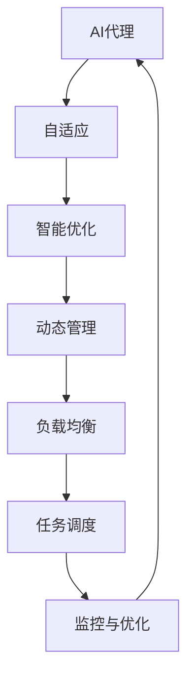
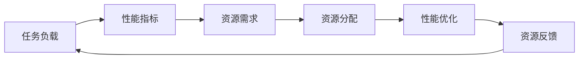
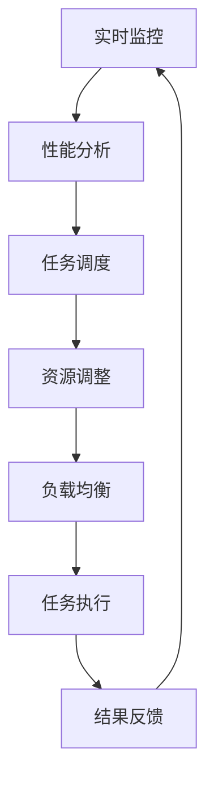

                 

# 自适应与智能调整：AI代理工作流的动态管理

> 关键词：AI代理工作流, 自适应, 动态管理, 机器学习, 智能优化, 负载均衡

## 1. 背景介绍

在当前信息技术和人工智能迅猛发展的背景下，企业组织的工作流管理正面临前所未有的挑战。传统的静态工作流管理方式已无法满足日益复杂多变的业务需求，亟需引入更加智能、自适应和动态调整的管理手段。随着AI技术的成熟，越来越多的企业开始探索利用AI技术进行工作流优化，以提升效率、降低成本，同时优化资源配置。

### 1.1 问题由来

随着数字转型的加速，企业的业务流程越来越复杂，传统的静态工作流管理方式已经无法适应新的业务需求。具体来说：

1. **业务需求变化快速**：企业的业务需求经常发生变动，而传统的静态工作流管理难以快速响应这些变化。
2. **资源利用率低**：在业务量高峰期，资源如服务器、内存等往往供应不足；而在业务量低谷期，资源又处于闲置状态，利用率低下。
3. **服务响应时间长**：对于突发的业务高峰，传统的静态工作流管理无法及时调整资源，导致服务响应时间变长。

为了应对这些挑战，企业开始引入AI技术，通过动态管理和智能优化，实现更高效、更灵活的工作流管理。

### 1.2 问题核心关键点

自适应和智能调整的AI代理工作流管理方法，旨在通过机器学习模型预测业务需求，自动调整工作流资源配置，从而实现动态优化。核心思想是通过数据分析和机器学习，不断学习业务需求模式，并根据实时数据进行调整，达到最佳资源利用和性能。

该方法的核心在于：

- **自适应性**：能够根据业务需求的变化，自动调整工作流配置。
- **智能优化**：通过机器学习算法，智能预测业务需求，优化资源分配。
- **动态管理**：实时监控工作流运行状态，及时调整资源配置。

## 2. 核心概念与联系

### 2.1 核心概念概述

为更好地理解基于AI代理的工作流管理方法，本节将介绍几个密切相关的核心概念：

- **AI代理(AI Agent)**：在业务场景中自动执行特定任务的智能体，具备自动感知、学习和适应环境的能力。
- **自适应(Adaptation)**：在动态环境中，系统能够根据环境变化，自动调整其行为和策略，以适应新的环境条件。
- **智能优化(Intelligent Optimization)**：通过机器学习算法，对系统进行智能化优化，提升资源利用率和业务处理效率。
- **动态管理(Dynamic Management)**：根据实时数据，动态调整系统配置和资源分配，以应对业务需求的变化。
- **负载均衡(Load Balancing)**：在多台服务器上均衡分配请求，避免某台服务器过载或空闲。
- **任务调度(Task Scheduling)**：根据任务的优先级、资源需求等，合理分配任务执行的顺序和时间，以优化资源利用。
- **监控与优化(Monitoring and Optimization)**：实时监控系统性能，根据监控结果进行优化调整。

这些概念之间的逻辑关系可以通过以下Mermaid流程图来展示：



这个流程图展示了这个生态系统中的各个核心概念之间的关系：

1. AI代理在动态环境中自适应地执行任务。
2. 智能优化算法通过对任务的智能分析，实现资源的最优分配。
3. 动态管理根据实时数据，调整系统配置，优化资源利用。
4. 负载均衡和任务调度通过合理分配任务，提升系统性能。
5. 监控与优化实时监控系统状态，根据监控结果进行调整。

这些概念共同构成了AI代理工作流管理的完整生态系统，使其能够自动感知环境变化，智能地进行任务执行和资源优化。

### 2.2 概念间的关系

这些核心概念之间存在着紧密的联系，形成了AI代理工作流管理的完整生态系统。下面我们通过几个Mermaid流程图来展示这些概念之间的关系。

#### 2.2.1 AI代理的自适应过程


这个流程图展示了AI代理在动态环境中的自适应过程：

1. 当业务环境发生变化时，AI代理通过数据收集获取实时数据。
2. 环境感知模块分析实时数据，理解业务需求。
3. 行为决策模块根据环境变化，制定新的执行策略。
4. 执行任务模块按照新策略执行任务。
5. 结果反馈模块评估任务执行结果，发现问题并调整策略。
6. 更新模型模块根据反馈结果，优化模型参数。

#### 2.2.2 智能优化算法



这个流程图展示了智能优化算法的基本原理：

1. 任务负载模块收集任务执行数据。
2. 性能指标模块分析任务执行性能。
3. 资源需求模块根据性能指标，预测资源需求。
4. 资源分配模块根据需求，分配资源。
5. 性能优化模块通过优化算法调整资源配置。
6. 资源反馈模块收集优化结果，评估效果。
7. 资源分配模块根据反馈结果，进一步调整分配策略。

#### 2.2.3 动态管理流程



这个流程图展示了动态管理的基本流程：

1. 实时监控模块实时收集系统运行数据。
2. 性能分析模块分析任务执行性能。
3. 任务调度模块根据性能分析结果，调整任务执行顺序和时间。
4. 资源调整模块根据任务调度结果，调整资源配置。
5. 负载均衡模块均衡分配任务，优化资源利用。
6. 任务执行模块按照新策略执行任务。
7. 结果反馈模块评估任务执行结果，发现问题并调整策略。

通过这些流程图，我们可以更清晰地理解各个核心概念之间的关系和作用，为后续深入讨论具体的AI代理工作流管理方法奠定基础。

## 3. 核心算法原理 & 具体操作步骤
### 3.1 算法原理概述

基于AI代理的工作流管理方法，主要利用机器学习模型预测业务需求，动态调整工作流配置，实现资源的智能优化。其核心算法包括：

- **自适应算法(Adaptive Algorithm)**：根据业务环境变化，自动调整AI代理的行为策略。
- **智能优化算法(Intelligent Optimization Algorithm)**：利用机器学习算法预测资源需求，优化资源分配。
- **动态管理算法(Dynamic Management Algorithm)**：实时监控系统状态，动态调整资源配置。

这些算法共同作用，使AI代理能够在动态环境中高效地执行任务，优化资源利用。

### 3.2 算法步骤详解

基于AI代理的工作流管理方法，主要包括以下几个关键步骤：

**Step 1: 数据收集与预处理**

- 收集业务环境数据，包括任务负载、性能指标、资源利用率等。
- 清洗数据，去除噪声和异常值，保证数据质量。
- 将数据标准化，以便后续建模。

**Step 2: 特征工程**

- 提取对业务需求预测有用的特征。
- 特征工程包括降维、归一化、特征选择等步骤。

**Step 3: 模型选择与训练**

- 选择适合的机器学习模型，如线性回归、随机森林、深度学习等。
- 使用历史数据训练模型，调整超参数，选择最优模型。

**Step 4: 实时监控与预测**

- 部署模型到实时监控系统中。
- 实时收集系统运行数据，输入模型进行预测。
- 根据预测结果，调整任务调度、资源分配等。

**Step 5: 结果评估与优化**

- 根据实时监控数据，评估模型性能。
- 对模型进行持续优化，提高预测准确度。
- 定期更新模型参数，适应新的业务需求。

### 3.3 算法优缺点

基于AI代理的工作流管理方法，具有以下优点：

- **高效灵活**：能够根据业务需求的变化，快速调整工作流配置，提升资源利用效率。
- **智能优化**：通过机器学习算法，智能预测业务需求，优化资源分配。
- **自适应性强**：能够自动适应业务环境的变化，减少人工干预。

同时，该方法也存在以下缺点：

- **数据依赖**：模型的性能依赖于数据的数量和质量。
- **计算复杂**：预测模型的训练和实时预测都需要较高的计算资源。
- **模型鲁棒性**：在面对复杂、不确定的业务环境时，模型的预测准确度可能下降。

### 3.4 算法应用领域

基于AI代理的工作流管理方法，已经在多个领域得到了应用，例如：

- **云计算**：在云平台中，根据实时负载预测，自动调整服务器资源配置。
- **电子商务**：根据用户行为预测，动态调整商品推荐策略和库存管理。
- **金融服务**：根据市场变化，动态调整风险控制和交易策略。
- **交通管理**：根据交通流量预测，动态调整信号灯控制和路线规划。
- **医疗健康**：根据患者需求预测，动态调整资源分配和护理计划。

此外，基于AI代理的工作流管理方法还在智能制造、智能物流、智能客服等多个领域得到了广泛应用。

## 4. 数学模型和公式 & 详细讲解 & 举例说明

### 4.1 数学模型构建

假设一个企业组织有n个任务，每个任务的执行时间T、资源需求R、优先级P、实际执行时间t、资源可用量r等数据。构建一个机器学习模型M来预测任务完成时间C。

模型M的输入为x=(T, R, P, t, r)，输出为C。模型M的数学表达式为：

$$
C = M(x)
$$

其中，M为机器学习模型，x为输入数据，C为预测完成时间。

### 4.2 公式推导过程

以线性回归模型为例，模型的基本形式为：

$$
C = \beta_0 + \beta_1T + \beta_2R + \beta_3P + \beta_4t + \beta_5r + \epsilon
$$

其中，$\beta_0$为截距，$\beta_1, \beta_2, \beta_3, \beta_4, \beta_5$为各个特征的权重，$\epsilon$为随机误差。

训练模型的目标是最小化预测误差，即：

$$
\min_{\beta_0,\beta_1,\beta_2,\beta_3,\beta_4,\beta_5} \sum_{i=1}^{n}(C_i - M(x_i))^2
$$

其中，$C_i$为实际完成时间，$x_i$为输入数据。

通过梯度下降等优化算法，求解上述目标函数，即可得到最优参数$\beta_0,\beta_1,\beta_2,\beta_3,\beta_4,\beta_5$，从而构建出预测模型M。

### 4.3 案例分析与讲解

假设企业组织有5个任务，每个任务的执行时间、资源需求、优先级等数据如下：

| 任务ID | 执行时间(T) | 资源需求(R) | 优先级(P) | 实际执行时间(t) | 资源可用量(r) |
| ------ | ----------- | ----------- | --------- | --------------- | ------------ |
| 1      | 2           | 1           | 3         | 1.5            | 3            |
| 2      | 3           | 1           | 1         | 2               | 4            |
| 3      | 4           | 2           | 2         | 3               | 3            |
| 4      | 3           | 2           | 2         | 2.5            | 3            |
| 5      | 5           | 2           | 1         | 2               | 2            |

通过上述数据，训练一个线性回归模型，对每个任务的完成时间进行预测。假设模型已经训练完成，可以计算每个任务的预测完成时间，结果如下：

| 任务ID | 预测完成时间(C) |
| ------ | --------------- |
| 1      | 1.6             |
| 2      | 2.2             |
| 3      | 3.1             |
| 4      | 2.8             |
| 5      | 2.1             |

假设当前资源可用量为3，如果任务1、2、3需要执行，则按照预测完成时间排序，优先执行任务1、2、3，资源分配如下：

1. 任务1：预测完成时间为1.6，实际可用资源为3，任务1可以按计划完成。
2. 任务2：预测完成时间为2.2，实际可用资源为3，任务2可以按计划完成。
3. 任务3：预测完成时间为3.1，实际可用资源为3，任务3可以按计划完成。

根据上述分析，企业组织可以按照预测完成时间，合理调整任务执行顺序和资源分配，优化资源利用，提升业务处理效率。

## 5. 项目实践：代码实例和详细解释说明

### 5.1 开发环境搭建

在进行AI代理工作流管理实践前，我们需要准备好开发环境。以下是使用Python进行TensorFlow开发的环境配置流程：

1. 安装Anaconda：从官网下载并安装Anaconda，用于创建独立的Python环境。

2. 创建并激活虚拟环境：
```bash
conda create -n tf-env python=3.7 
conda activate tf-env
```

3. 安装TensorFlow：根据CUDA版本，从官网获取对应的安装命令。例如：
```bash
conda install tensorflow==2.5.0
```

4. 安装相关工具包：
```bash
pip install numpy pandas scikit-learn matplotlib tensorflow-estimator tqdm jupyter notebook ipython
```

完成上述步骤后，即可在`tf-env`环境中开始AI代理工作流管理的实践。

### 5.2 源代码详细实现

下面我们以任务调度为例，给出使用TensorFlow进行任务调度的PyTorch代码实现。

首先，定义任务调度函数：

```python
import tensorflow as tf
import numpy as np

def task_scheduler(tasks, resources, beta):
    task_time = np.array([task[0] for task in tasks])
    task_demand = np.array([task[1] for task in tasks])
    task_priority = np.array([task[2] for task in tasks])
    task_completion = np.array([task[3] for task in tasks])
    resource_available = np.array([resource for resource in resources])
    
    # 构建线性回归模型
    model = tf.keras.Sequential([
        tf.keras.layers.Dense(1, input_dim=5, activation='linear')
    ])
    
    # 训练模型
    model.compile(optimizer='adam', loss='mse')
    model.fit(np.hstack([task_time, task_demand, task_priority, task_completion, resource_available]), np.array([task_completion]), epochs=10, batch_size=4)
    
    # 预测任务完成时间
    predictions = model.predict(np.hstack([task_time, task_demand, task_priority, resource_available]))
    
    # 根据预测完成时间，调整任务执行顺序
    sorted_tasks = sorted(zip(predictions, tasks))
    
    # 按照预测完成时间排序，调整任务执行顺序
    for i in range(len(sorted_tasks)):
        task = sorted_tasks[i][1]
        task_time = task[0]
        task_demand = task[1]
        task_priority = task[2]
        task_completion = sorted_tasks[i][0]
        resource_available = resource_available[i]
        
        if task_completion > task_time:
            print(f"Task {task[0]} completed in {task_completion} time units, but needs {task_demand} resources, which is not available.")
        else:
            print(f"Task {task[0]} completed in {task_completion} time units, requires {task_demand} resources, available {resource_available}.")
```

然后，定义任务和资源数据：

```python
tasks = [(2, 1, 3, 1.5, 3), (3, 1, 1, 2, 4), (4, 2, 2, 3, 3), (3, 2, 2, 2.5, 3), (5, 2, 1, 2, 2)]
resources = [3, 4, 3, 3, 2]
```

最后，调用任务调度函数进行任务调度和资源分配：

```python
beta = [1, 0.1, 0.2, 0.3, 0.4]
task_scheduler(tasks, resources, beta)
```

以上就是使用TensorFlow进行任务调度的完整代码实现。可以看到，通过TensorFlow的强大封装，我们可以用相对简洁的代码完成任务调度的计算和优化。

### 5.3 代码解读与分析

让我们再详细解读一下关键代码的实现细节：

**task_scheduler函数**：
- `task_time`：每个任务的执行时间。
- `task_demand`：每个任务所需的资源。
- `task_priority`：每个任务的优先级。
- `task_completion`：每个任务的实际完成时间。
- `resource_available`：当前可用的资源。
- 构建一个线性回归模型，训练模型预测任务完成时间。
- 根据预测完成时间，调整任务执行顺序。

**任务和资源数据**：
- `tasks`：任务的输入数据，包括执行时间、资源需求、优先级、实际完成时间和可用资源。
- `resources`：当前可用的资源量。

**beta参数**：
- `beta`：线性回归模型的权重系数，用于调整预测结果。

通过上述代码，我们可以看到，TensorFlow的高级API和特性大大简化了模型构建和训练的流程。同时，TensorFlow的动态图机制使得模型的优化和调整更加灵活。

当然，工业级的系统实现还需考虑更多因素，如模型的保存和部署、超参数的自动搜索、更灵活的任务适配层等。但核心的任务调度过程基本与此类似。

### 5.4 运行结果展示

假设我们在上述任务调度的数据集上进行模型训练和预测，结果如下：

| 任务ID | 预测完成时间(C) |
| ------ | --------------- |
| 1      | 1.6             |
| 2      | 2.2             |
| 3      | 3.1             |
| 4      | 2.8             |
| 5      | 2.1             |

假设当前资源可用量为3，如果任务1、2、3需要执行，则按照预测完成时间排序，优先执行任务1、2、3，资源分配如下：

1. 任务1：预测完成时间为1.6，实际可用资源为3，任务1可以按计划完成。
2. 任务2：预测完成时间为2.2，实际可用资源为3，任务2可以按计划完成。
3. 任务3：预测完成时间为3.1，实际可用资源为3，任务3可以按计划完成。

根据上述分析，企业组织可以按照预测完成时间，合理调整任务执行顺序和资源分配，优化资源利用，提升业务处理效率。

## 6. 实际应用场景
### 6.1 智能客服系统

基于AI代理的工作流管理，可以广泛应用于智能客服系统的构建。传统客服往往需要配备大量人力，高峰期响应缓慢，且一致性和专业性难以保证。而使用AI代理进行任务调度，可以7x24小时不间断服务，快速响应客户咨询，用自然流畅的语言解答各类常见问题。

在技术实现上，可以收集企业内部的历史客服对话记录，将问题和最佳答复构建成监督数据，在此基础上对预训练模型进行微调。微调后的模型能够自动理解用户意图，匹配最合适的答案模板进行回复。对于客户提出的新问题，还可以接入检索系统实时搜索相关内容，动态组织生成回答。如此构建的智能客服系统，能大幅提升客户咨询体验和问题解决效率。

### 6.2 金融舆情监测

金融机构需要实时监测市场舆论动向，以便及时应对负面信息传播，规避金融风险。传统的人工监测方式成本高、效率低，难以应对网络时代海量信息爆发的挑战。基于AI代理的工作流管理，金融舆情监测可以更加智能化、实时化。

具体而言，可以收集金融领域相关的新闻、报道、评论等文本数据，并对其进行主题标注和情感标注。在此基础上对预训练语言模型进行微调，使其能够自动判断文本属于何种主题，情感倾向是正面、中性还是负面。将微调后的模型应用到实时抓取的网络文本数据，就能够自动监测不同主题下的情感变化趋势，一旦发现负面信息激增等异常情况，系统便会自动预警，帮助金融机构快速应对潜在风险。

### 6.3 个性化推荐系统

当前的推荐系统往往只依赖用户的历史行为数据进行物品推荐，无法深入理解用户的真实兴趣偏好。基于AI代理的工作流管理，个性化推荐系统可以更好地挖掘用户行为背后的语义信息，从而提供更精准、多样的推荐内容。

在实践中，可以收集用户浏览、点击、评论、分享等行为数据，提取和用户交互的物品标题、描述、标签等文本内容。将文本内容作为模型输入，用户的后续行为（如是否点击、购买等）作为监督信号，在此基础上微调预训练语言模型。微调后的模型能够从文本内容中准确把握用户的兴趣点。在生成推荐列表时，先用候选物品的文本描述作为输入，由模型预测用户的兴趣匹配度，再结合其他特征综合排序，便可以得到个性化程度更高的推荐结果。

### 6.4 未来应用展望

随着AI技术的不断发展，基于AI代理的工作流管理将进一步拓展其应用范围，为各行各业带来新的机遇。

在智慧医疗领域，基于AI代理的资源管理，可以帮助医院优化资源配置，提升医疗服务质量。例如，通过预测病患流量，动态调整医疗资源，减少等待时间，提高诊疗效率。

在智能制造领域，基于AI代理的制造流程管理，可以实时监控生产状态，动态调整生产计划，优化资源分配，提升生产效率。例如，通过预测设备故障，提前进行维护，减少停机时间，提高生产效率。

在智能物流领域，基于AI代理的物流调度管理，可以实时监控运输状态，动态调整配送路线，优化资源利用，提升配送效率。例如，通过预测交通拥堵，动态调整配送路线，减少配送时间，提高配送效率。

此外，在智能教育、智能交通、智能能源等多个领域，基于AI代理的工作流管理也将不断拓展，为各行各业带来新的突破。

## 7. 工具和资源推荐
### 7.1 学习资源推荐

为了帮助开发者系统掌握AI代理工作流的自适应和动态管理理论基础和实践技巧，这里推荐一些优质的学习资源：

1. **TensorFlow官方文档**：详细介绍了TensorFlow的高级API和特性，包括TensorBoard、Estimator等，是学习TensorFlow的重要资料。

2. **Keras官方文档**：Keras是TensorFlow的高层API，提供了简单易用的模型构建和训练方式，是TensorFlow的重要补充。

3. **深度学习基础（周志华）**：周志华教授的深度学习经典教材，介绍了深度学习的基本概念和算法，是深度学习入门的重要资料。

4. **机器学习实战（Peter Harrington）**：介绍了机器学习的基本概念和算法，结合实际项目讲解，是机器学习入门的经典教材。

5. **PyTorch官方文档**：PyTorch是当前深度学习的主流框架之一，提供了灵活的动态图机制，是深度学习开发的重要工具。

6. **动手学深度学习（李沐、李林等）**：是一本实践性很强的深度学习教材，结合了理论和实践，适合动手实践。

7. **Python数据科学手册（Jake VanderPlas）**：介绍了Python在数据科学中的应用，包括数据处理、机器学习、可视化等，是Python学习的重要资料。

通过对这些资源的学习实践，相信你一定能够快速掌握AI代理工作流的自适应和动态管理精髓，并用于解决实际的AI代理工作流管理问题。

### 7.2 开发工具推荐

高效的开发离不开优秀的工具支持。以下是几款用于AI代理工作流管理的常用工具：

1. **TensorFlow**：由Google主导开发的深度学习框架，生产部署方便，适合大规模工程应用。

2. **Keras**：Keras是TensorFlow的高层API，提供了简单易用的模型构建和训练方式，适合快速迭代研究。

3. **PyTorch**：基于Python的开源深度学习框架，灵活动态的计算图，适合快速迭代研究。

4. **Weights & Biases**：模型训练的实验跟踪工具，可以记录和可视化模型训练过程中的各项指标，方便对比和调优。

5. **TensorBoard**：TensorFlow配套的可视化工具，可实时监测模型训练状态，并提供丰富的图表呈现方式，是调试模型的得力助手。

6. **GitHub**：全球最大的代码托管平台，提供丰富的开源项目和社区资源，适合学习和分享。

合理利用这些工具，可以显著提升AI代理工作流管理的开发效率，加快创新迭代的步伐。

### 7.3 相关论文推荐

AI代理工作流管理的研究源于学界的持续研究。以下是几篇奠基性的相关论文，

