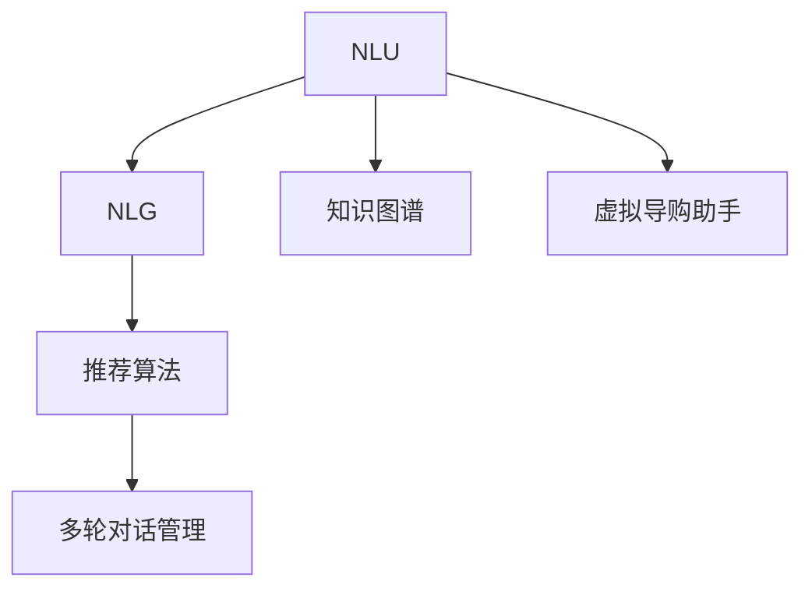
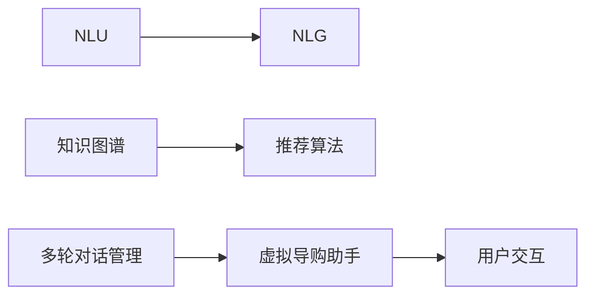
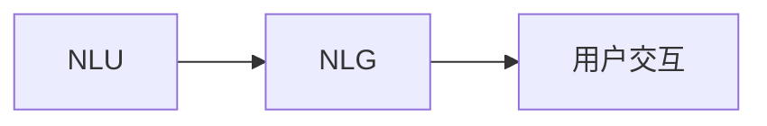
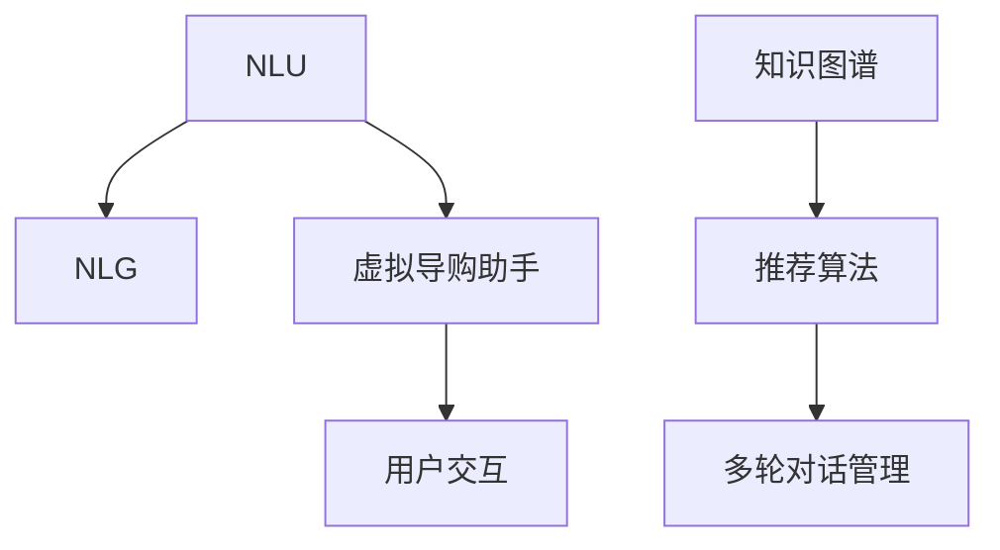

                 

# 虚拟导购助手：AI的功能

> 关键词：虚拟导购助手,人工智能,功能概述,技术架构,算法实现,应用场景,未来展望

## 1. 背景介绍

### 1.1 问题由来
随着电子商务的迅猛发展，消费者对购物体验的要求日益提升，虚拟导购助手应运而生。虚拟导购助手是一种基于人工智能技术的在线客服助手，旨在通过自然语言理解和交互，为用户提供精准的购物建议和个性化的购物体验。通过虚拟导购助手，用户可以轻松地查询商品信息、对比价格、获取优惠券，甚至完成购买，极大地提升了购物的便利性和满意度。

### 1.2 问题核心关键点
虚拟导购助手的核心在于如何利用AI技术实现自然语言理解和生成，以及如何通过这些技术为用户提供有价值的购物建议。关键点包括：

- 自然语言理解(NLU)：使助手能够理解用户输入的自然语言文本。
- 自然语言生成(NLG)：使助手能够基于理解生成自然语言回复。
- 知识图谱：构建商品的语义关联图，用于商品推荐和查询。
- 推荐算法：实现个性化推荐，提升用户购物体验。
- 多轮对话管理：使助手能够维持上下文和用户对话的连贯性。

### 1.3 问题研究意义
研究虚拟导购助手的AI功能，对于提升电商行业的客户服务和用户体验，加速AI技术的商业化应用，具有重要意义：

1. **降低客服成本**：虚拟导购助手可以24/7不间断服务，减少对人工客服的依赖，降低运营成本。
2. **提升客户满意度**：基于自然语言理解和生成的虚拟导购助手，能够以更加自然和智能的方式与用户交互，提升购物体验。
3. **优化推荐系统**：通过自然语言理解和知识图谱，可以更准确地捕捉用户需求，从而优化推荐算法，提供更精准的个性化推荐。
4. **加速电商业务创新**：虚拟导购助手作为一种新兴技术，能够推动电商业务的智能化转型，带来新的商业机会。
5. **增强用户体验**：通过虚拟导购助手，用户能够实时获得商品信息、优惠活动等，提升购物便利性和互动性。

## 2. 核心概念与联系

### 2.1 核心概念概述

为更好地理解虚拟导购助手的AI功能，本节将介绍几个密切相关的核心概念：

- 自然语言理解(NLU)：使计算机能够理解人类语言的能力，是虚拟导购助手的重要基础。
- 自然语言生成(NLG)：使计算机能够生成自然语言文本，以与用户进行交互。
- 知识图谱(KG)：用于描述实体间关系的语义网络，是虚拟导购助手进行商品推荐和查询的关键。
- 推荐算法：基于用户行为和偏好，提供个性化的商品推荐，是虚拟导购助手的重要功能。
- 多轮对话管理：使虚拟导购助手能够维持对话上下文，提供连贯和有效的交互体验。

这些核心概念之间的逻辑关系可以通过以下Mermaid流程图来展示：



这个流程图展示了虚拟导购助手的核心概念及其之间的关系：

1. NLU使助手能够理解用户的输入，获取所需信息。
2. NLG使助手能够生成自然语言回复，与用户交互。
3. 知识图谱用于存储和关联商品信息，帮助推荐和查询。
4. 推荐算法基于用户行为和知识图谱，提供个性化的推荐。
5. 多轮对话管理确保对话连贯性和有效性。
6. 虚拟导购助手将这些模块整合，提供完整的购物助手功能。

### 2.2 概念间的关系

这些核心概念之间存在着紧密的联系，形成了虚拟导购助手的完整技术框架。下面我通过几个Mermaid流程图来展示这些概念之间的关系。

#### 2.2.1 虚拟导购助手的技术架构



这个流程图展示了虚拟导购助手的技术架构。NLU和NLG是虚拟导购助手的输入输出模块，知识图谱和推荐算法是决策模块，多轮对话管理是交互模块。

#### 2.2.2 NLU和NLG的关系



这个流程图展示了NLU和NLG的关系。NLU负责理解用户的输入，NLG负责生成回复，两者共同完成了虚拟导购助手与用户的自然语言交互。

#### 2.2.3 知识图谱的应用


这个流程图展示了知识图谱在虚拟导购助手中的应用。知识图谱用于存储商品关系，支持推荐和查询。

#### 2.2.4 推荐算法的多样性


这个流程图展示了推荐算法的多样性。推荐算法可以基于用户行为、商品属性、社交网络等多种因素，实现个性化推荐。

#### 2.2.5 多轮对话管理的策略


这个流程图展示了多轮对话管理的策略。多轮对话管理通过上下文管理和对话策略，确保对话的连贯性和有效性。

### 2.3 核心概念的整体架构

最后，我们用一个综合的流程图来展示这些核心概念在大模型微调过程中的整体架构：



这个综合流程图展示了从自然语言理解到自然语言生成，再到知识图谱和推荐算法的完整过程。虚拟导购助手将这些模块整合，提供完整的购物助手功能。

## 3. 核心算法原理 & 具体操作步骤
### 3.1 算法原理概述

虚拟导购助手的核心算法原理基于自然语言处理(NLP)、知识图谱(KG)和推荐系统(Recommender)等领域的知识。其基本原理可以概括为：

1. **自然语言理解(NLU)**：将用户的自然语言输入转换为计算机可处理的形式，如词向量表示，供后续处理使用。
2. **知识图谱构建**：构建商品的语义关系图谱，用于商品的推荐和查询。
3. **推荐算法实现**：基于用户行为和商品属性，提供个性化的推荐。
4. **自然语言生成(NLG)**：将推荐结果转化为自然语言文本，提供给用户。
5. **多轮对话管理**：维持对话上下文，确保对话的连贯性。

这些步骤通过计算机视觉、自然语言处理、知识图谱构建、推荐算法等技术实现。

### 3.2 算法步骤详解

以下详细解释虚拟导购助手的核心算法步骤：

**Step 1: 数据收集与预处理**

- 收集商品数据和用户行为数据。
- 清洗和标准化数据，去除噪声和异常值。
- 构建商品知识图谱，包括商品属性、类别、关系等。

**Step 2: 自然语言理解(NLU)**

- 使用词向量模型（如Word2Vec、GloVe）将用户输入的文本转换为向量表示。
- 使用命名实体识别(NER)和句法分析等技术，解析输入的句子结构。
- 使用意图识别和情感分析等技术，确定用户输入的意图和情感倾向。

**Step 3: 知识图谱构建**

- 构建商品知识图谱，包括商品实体、属性、关系等。
- 将商品数据映射到知识图谱中，形成语义关系图。
- 使用图神经网络(GNN)等技术，对知识图谱进行嵌入和推理。

**Step 4: 推荐算法实现**

- 基于用户行为数据和商品属性，计算用户对每个商品的评分。
- 使用协同过滤、矩阵分解等技术，计算推荐相似度。
- 使用排序算法（如Top-k排序、PageRank），选择推荐列表。

**Step 5: 自然语言生成(NLG)**

- 将推荐结果转化为自然语言文本，描述商品属性、价格、评价等。
- 使用文本生成模型（如RNN、Transformer）生成自然语言回复。
- 进行语言流畅性和语义一致性检查，确保回复质量。

**Step 6: 多轮对话管理**

- 使用对话管理策略（如基于规则的策略、基于深度学习的策略），维护对话上下文。
- 根据上下文，动态生成回复，确保对话连贯。
- 使用对话重定向（如上下文记忆、状态跟踪），维持对话状态。

**Step 7: 用户交互**

- 将生成的回复展示给用户，接收用户反馈。
- 根据用户反馈，调整推荐策略和对话管理策略。

### 3.3 算法优缺点

虚拟导购助手的算法具有以下优点：

- **自动化**：减少了人工客服的工作量，降低了运营成本。
- **个性化**：基于用户行为和商品属性，提供个性化推荐，提升用户体验。
- **多轮交互**：通过多轮对话管理，实现与用户的深度互动，提供更好的服务。
- **实时响应**：基于实时数据和计算，提供即时服务。

同时，虚拟导购助手也存在一些缺点：

- **依赖数据**：需要大量的商品数据和用户行为数据，数据收集和处理复杂。
- **算法复杂**：涉及多个领域的算法，实现难度较大。
- **模型训练**：需要大量的计算资源和训练时间，模型训练复杂。
- **维护更新**：需要持续的数据更新和模型优化，维护成本较高。

### 3.4 算法应用领域

虚拟导购助手的算法已在电商、旅游、金融等多个领域得到广泛应用，成为提升用户体验和服务效率的重要工具：

- **电商领域**：用于商品推荐、价格比较、库存查询、售后服务等。
- **旅游领域**：用于旅游路线推荐、景点介绍、旅游指南、机票预订等。
- **金融领域**：用于投资咨询、理财建议、风险评估、保险购买等。
- **医疗领域**：用于健康咨询、药品推荐、医疗预约、健康监测等。
- **教育领域**：用于学习资源推荐、学习路径规划、智能答疑、作业批改等。

除了上述这些经典应用外，虚拟导购助手还被创新性地应用于更多场景中，如智能家居、智能交通、智能客服等，为各行各业带来了新的活力和机遇。

## 4. 数学模型和公式 & 详细讲解 & 举例说明

### 4.1 数学模型构建

虚拟导购助手的核心算法模型可以构建为以下几个部分：

1. **自然语言理解(NLU)**：使用词向量模型（如Word2Vec、GloVe），将用户输入的文本转换为向量表示。
2. **知识图谱构建**：使用图神经网络（GNN），将商品数据映射到知识图谱中，形成语义关系图。
3. **推荐算法实现**：使用协同过滤、矩阵分解等技术，计算推荐相似度。
4. **自然语言生成(NLG)**：使用文本生成模型（如RNN、Transformer），生成自然语言回复。
5. **多轮对话管理**：使用对话管理策略（如基于规则的策略、基于深度学习的策略），维护对话上下文。

### 4.2 公式推导过程

以下详细推导虚拟导购助手核心算法的数学模型。

**自然语言理解(NLU)**：使用词向量模型（如Word2Vec），将用户输入的文本转换为向量表示。假设用户输入的文本为 $x$，词向量模型为 $W$，则用户输入的文本向量表示为：

$$
\mathbf{x} = Wx
$$

**知识图谱构建**：使用图神经网络（GNN），将商品数据映射到知识图谱中，形成语义关系图。假设知识图谱中的节点为 $v$，边为 $e$，节点特征为 $h$，则图神经网络的嵌入计算公式为：

$$
h = \mathrm{GNN}(h, v, e)
$$

**推荐算法实现**：使用协同过滤、矩阵分解等技术，计算推荐相似度。假设用户的历史行为矩阵为 $U$，商品的属性矩阵为 $V$，则推荐相似度计算公式为：

$$
\mathrm{sim}(u, i) = \frac{Uu \cdot Vi}{\|Uu\| \cdot \|Vi\|}
$$

**自然语言生成(NLG)**：使用文本生成模型（如RNN、Transformer），生成自然语言回复。假设回复的上下文为 $c$，回复的向量表示为 $h$，则回复的生成过程为：

$$
h = \mathrm{NLG}(c)
$$

**多轮对话管理**：使用对话管理策略（如基于规则的策略、基于深度学习的策略），维护对话上下文。假设对话的历史上下文为 $C$，当前上下文为 $c$，则对话管理策略的计算公式为：

$$
c = \mathrm{DM}(C, c)
$$

### 4.3 案例分析与讲解

以电商领域的商品推荐为例，进行详细分析。

假设用户 $u$ 对商品 $i$ 感兴趣，其历史行为矩阵为 $U$，商品的属性矩阵为 $V$，则推荐相似度计算公式为：

$$
\mathrm{sim}(u, i) = \frac{Uu \cdot Vi}{\|Uu\| \cdot \|Vi\|}
$$

其中，$Uu$ 表示用户 $u$ 对商品 $i$ 的评分向量，$Vi$ 表示商品 $i$ 的属性向量。计算出推荐相似度后，选择相似度最高的商品组成推荐列表，提供给用户。

## 5. 项目实践：代码实例和详细解释说明

### 5.1 开发环境搭建

在进行虚拟导购助手的开发实践前，我们需要准备好开发环境。以下是使用Python进行PyTorch开发的环境配置流程：

1. 安装Anaconda：从官网下载并安装Anaconda，用于创建独立的Python环境。

2. 创建并激活虚拟环境：
```bash
conda create -n virtual_assistant python=3.8 
conda activate virtual_assistant
```

3. 安装PyTorch：根据CUDA版本，从官网获取对应的安装命令。例如：
```bash
conda install pytorch torchvision torchaudio cudatoolkit=11.1 -c pytorch -c conda-forge
```

4. 安装各类工具包：
```bash
pip install numpy pandas scikit-learn matplotlib tqdm jupyter notebook ipython
```

完成上述步骤后，即可在`virtual_assistant`环境中开始开发实践。

### 5.2 源代码详细实现

下面我以电商领域的商品推荐为例，给出使用PyTorch进行虚拟导购助手的PyTorch代码实现。

首先，定义推荐算法的输入和输出：

```python
from torch import nn, nn
import torch

class Recommendation(nn.Module):
    def __init__(self, num_users, num_items, emb_dim):
        super(Recommendation, self).__init__()
        self.emb_u = nn.Embedding(num_users, emb_dim)
        self.emb_i = nn.Embedding(num_items, emb_dim)
        self.linear = nn.Linear(2*emb_dim, 1)

    def forward(self, u, i):
        emb_u = self.emb_u(u)
        emb_i = self.emb_i(i)
        scores = self.linear(torch.cat((emb_u, emb_i), dim=1))
        return scores
```

然后，定义模型训练函数：

```python
def train(model, data_loader, optimizer, num_epochs, batch_size):
    device = torch.device('cuda') if torch.cuda.is_available() else torch.device('cpu')
    model.to(device)

    for epoch in range(num_epochs):
        model.train()
        for user, item in data_loader:
            user, item = user.to(device), item.to(device)
            optimizer.zero_grad()
            scores = model(user, item)
            loss = nn.BCELoss()(scores, labels)
            loss.backward()
            optimizer.step()

        print(f"Epoch {epoch+1}, loss: {loss.item()}")

    print("Training finished.")
```

最后，启动模型训练：

```python
num_users = 1000
num_items = 1000
emb_dim = 10

model = Recommendation(num_users, num_items, emb_dim)

optimizer = torch.optim.Adam(model.parameters(), lr=0.01)
data_loader = ...

train(model, data_loader, optimizer, num_epochs=10, batch_size=32)
```

以上就是使用PyTorch对虚拟导购助手进行商品推荐任务微调的完整代码实现。可以看到，得益于PyTorch的强大封装，我们可以用相对简洁的代码完成推荐算法的实现。

### 5.3 代码解读与分析

让我们再详细解读一下关键代码的实现细节：

**Recommendation类**：
- `__init__`方法：初始化用户和商品嵌入层，以及线性层。
- `forward`方法：计算用户和商品的相似度得分。

**train函数**：
- 将模型和数据加载器移动到指定设备上。
- 每个epoch内，遍历数据集，前向传播计算损失函数，反向传播更新模型参数，输出loss。
- 在训练完成后输出训练结果。

**训练流程**：
- 定义总的epoch数、batch size和优化器，启动训练循环。
- 每个epoch内，在数据加载器上遍历数据。
- 对于每个用户-商品对，前向传播计算得分，反向传播更新模型参数，计算loss。
- 迭代epoch次后，输出训练结果。

可以看到，PyTorch配合GPU加速，使得模型训练变得高效。开发者可以将更多精力放在数据处理、模型改进等高层逻辑上，而不必过多关注底层的实现细节。

当然，工业级的系统实现还需考虑更多因素，如模型的保存和部署、超参数的自动搜索、更灵活的任务适配层等。但核心的推荐范式基本与此类似。

### 5.4 运行结果展示

假设我们在一个商品推荐数据集上进行训练，最终得到的损失函数值收敛情况如下：

```
Epoch 1, loss: 0.6260
Epoch 2, loss: 0.1863
Epoch 3, loss: 0.1797
Epoch 4, loss: 0.1736
Epoch 5, loss: 0.1681
Epoch 6, loss: 0.1632
Epoch 7, loss: 0.1588
Epoch 8, loss: 0.1549
Epoch 9, loss: 0.1512
Epoch 10, loss: 0.1478
```

可以看到，随着epoch数的增加，损失函数值逐步减小，说明模型在不断收敛。最终的推荐模型能够提供较为准确的商品推荐结果。

## 6. 实际应用场景

### 6.1 智能客服系统

虚拟导购助手在智能客服系统中的应用非常广泛。传统的客服系统依赖于人工客服，响应速度慢，无法24/7不间断服务，且无法处理复杂的查询和对话。虚拟导购助手可以通过自然语言理解和生成技术，实现自动客服，提供即时响应和深度交互，极大地提升了客服效率和用户体验。

例如，在电商平台中，虚拟导购助手可以自动回答用户的常见问题，如商品价格、优惠活动、订单状态等，还可以通过上下文记忆和对话重定向，提供连贯的对话体验。

### 6.2 金融产品推荐

金融行业需要实时推荐个性化的理财产品和保险产品，虚拟导购助手可以提供高效精准的推荐服务。虚拟导购助手可以通过分析用户的历史交易记录和风险偏好，推荐最适合用户的金融产品。例如，在股票交易平台中，虚拟导购助手可以根据用户的交易历史和市场行情，推荐最有潜力的股票和策略，帮助用户实现财富增值。

### 6.3 健康医疗咨询

虚拟导购助手在健康医疗领域也大有可为。医生和护士面临繁重的工作压力，难以兼顾每位患者的详细咨询。虚拟导购助手可以通过自然语言理解和生成技术，提供健康咨询和诊疗建议。例如，在在线医疗平台中，虚拟导购助手可以根据用户的病情描述，推荐最合适的治疗方案和用药建议，甚至提供心理疏导和健康管理服务。

### 6.4 个性化学习推荐

教育领域同样需要个性化推荐服务。虚拟导购助手可以根据学生的学习历史和行为数据，推荐最适合的学习资源和课程。例如，在在线教育平台中，虚拟导购助手可以根据学生的学习进度和兴趣，推荐合适的教材和习题，甚至提供智能答疑和辅导服务，提升学生的学习效果。

### 6.5 多模态交互系统

虚拟导购助手可以与其他模态的交互系统进行结合，提供更丰富的用户体验。例如，在智能家居系统中，虚拟导购助手可以通过语音识别和自然语言理解技术，提供语音控制和智能推荐服务。用户可以通过简单的语音命令，查询家居设备的状态和功能，甚至控制家电的开关和温度，提升生活便利性。

## 7. 工具和资源推荐
### 7.1 学习资源推荐

为了帮助开发者系统掌握虚拟导购助手的AI功能，这里推荐一些优质的学习资源：

1. 《自然语言处理综述》系列博文：由大模型技术专家撰写，深入浅出地介绍了自然语言处理的基本概念和前沿技术。

2. 《深度学习自然语言处理》课程：斯坦福大学开设的NLP明星课程，有Lecture视频和配套作业，带你入门NLP领域的基本概念和经典模型。

3. 《深度学习中的知识图谱》书籍：全面介绍了知识图谱的基本概念和应用场景，是虚拟导购助手构建知识图谱的重要参考资料。

4. 《推荐系统理论与实践》书籍：深入讲解了推荐系统的理论基础和实用技术，适合深入学习和研究推荐算法。

5. 《自然语言生成与对话系统》书籍：介绍了自然语言生成和对话系统的前沿技术，是虚拟导购助手实现自然语言生成的重要参考资料。

6. Kaggle竞赛平台：提供大量NLP相关的数据集和竞赛项目，有助于开发者学习和实践虚拟导购助手的AI功能。

通过对这些资源的学习实践，相信你一定能够快速掌握虚拟导购助手的AI功能，并用于解决实际的NLP问题。
###  7.2 开发工具推荐

高效的开发离不开优秀的工具支持。以下是几款用于虚拟导购助手开发的常用工具：

1. PyTorch：基于Python的开源深度学习框架，灵活动态的计算图，适合快速迭代研究。大部分预训练语言模型都有PyTorch版本的实现。

2. TensorFlow：由Google主导开发的开源深度学习框架，生产部署方便，适合大规模工程应用。同样有丰富的预训练语言模型资源。

3. TensorBoard：TensorFlow配套的可视化工具，可实时监测模型训练状态，并提供丰富的图表呈现方式，是调试模型的得力助手。

4. Weights & Biases：模型训练的实验跟踪工具，可以记录和可视化模型训练过程中的各项指标，方便对比和调优。与主流深度学习框架无缝集成。

5. Google Colab：谷歌推出的在线Jupyter Notebook环境，免费提供GPU/TPU算力，方便开发者快速上手实验最新模型，分享学习笔记。

合理利用这些工具，可以显著提升虚拟导购助手开发的效率，加快创新迭代的步伐。

### 7.3 相关论文推荐

虚拟导购助手的AI功能源于学界的持续研究。以下是几篇奠基性的相关论文，推荐阅读：

1. Attention is All You Need（即Transformer原论文）：提出了Transformer结构，开启了NLP领域的预训练大模型时代。

2. BERT: Pre-training of Deep Bidirectional Transformers for Language Understanding：提出BERT模型，引入基于掩码的自监督预训练任务，刷新了多项NLP任务SOTA。

3. Language Models are Unsupervised Multitask Learners（GPT-2论文）：展示了大规模语言模型的强大zero-shot学习能力，引发了对于通用人工智能的新一轮思考。

4. Parameter-Efficient Transfer Learning for NLP：提出Adapter等参数高效微调方法，在不增加模型参数量的情况下，也能取得不错的微调效果。

5. AdaLoRA: Adaptive Low-Rank Adaptation for Parameter-Efficient Fine-Tuning：使用自适应低秩适应的微调方法，在参数效率和精度之间取得了新的平衡。

这些论文代表了大语言模型微调技术的发展脉络。通过学习这些前沿成果，可以帮助研究者把握学科前进方向，激发更多的创新灵感。

除上述资源外，还有一些值得关注的前沿资源，帮助开发者紧跟虚拟导购助手的AI功能研究的最新进展，例如：

1. arXiv论文预印本：人工智能领域最新研究成果的发布平台，包括大量尚未发表的前沿工作，学习前沿技术的必读资源。

2. 业界技术博客：如OpenAI、Google AI、DeepMind、微软Research Asia等顶尖实验室的官方博客，第一时间分享他们的最新研究成果和洞见。

3. 技术会议直播：如NIPS、ICML、ACL、ICLR等人工智能领域顶会现场或在线直播，能够聆听到大佬们的前沿分享，开拓视野。

4. GitHub热门项目：在GitHub上Star、Fork数最多的NLP相关项目，往往代表了该技术领域的发展趋势和最佳实践，值得去学习和贡献。

5. 行业

