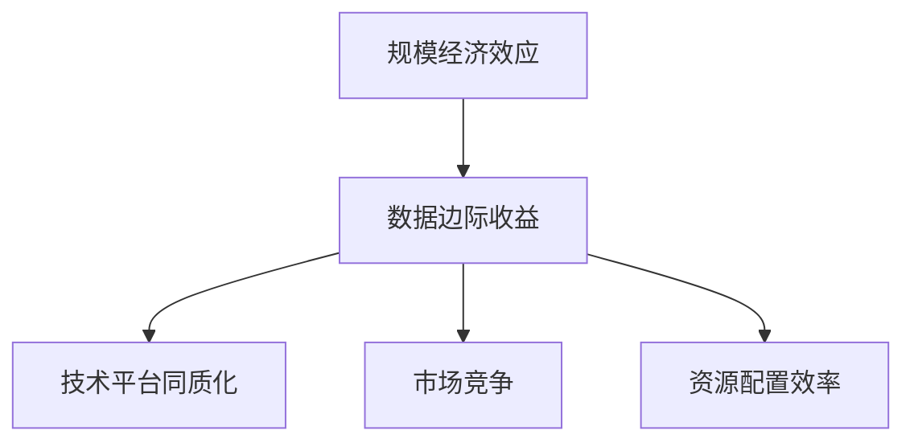
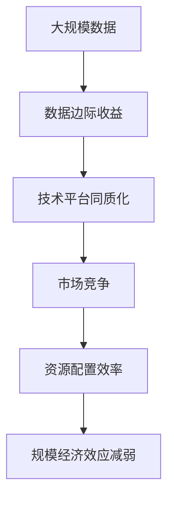

                 

# 规模经济效应减弱的深层次原因

## 1. 背景介绍

### 1.1 问题由来
在信息技术领域，“规模经济效应”指的是随着企业生产规模的扩大，其单位成本不断降低，收益逐渐增加的现象。然而，随着数字技术的发展，尤其是大数据、云计算、人工智能等技术的成熟，规模经济效应正在逐步减弱。这一现象引发了业界对未来商业模式的重新思考和探索。

### 1.2 问题核心关键点
规模经济效应的减弱，本质上是企业规模与成本、收益之间的平衡关系发生了变化。具体表现为：

1. **数据边际收益递减**：随着数据量的增长，企业从数据中提取价值的能力并未显著提升，反而由于数据处理成本的上升，收益开始下降。
2. **技术平台同质化**：云服务、大数据、人工智能等技术的广泛普及，使得企业不再依赖特定的技术平台，导致技术平台的边际收益递减。
3. **市场竞争加剧**：数据和技术的开放性，使得市场竞争更加激烈，企业需要通过差异化策略来获取竞争优势。
4. **资源配置效率下降**：随着企业规模的扩大，资源配置的复杂性和成本也在上升，边际效益递减。

### 1.3 问题研究意义
研究规模经济效应的深层次原因，对于理解信息技术行业的现状和未来发展趋势具有重要意义：

1. **指导企业战略调整**：了解规模经济效应减弱的原因，有助于企业重新评估其发展战略，寻求新的增长路径。
2. **推动技术创新**：规模经济效应的减弱，催生了新的技术需求和应用场景，为技术创新提供了新机遇。
3. **促进产业升级**：通过提升资源配置效率和利用效率，推动信息技术产业向更加智能化、精细化的方向发展。
4. **优化商业模式**：随着规模经济效应的减弱，传统的单一收入模式逐渐被多元化、细粒化的商业模式所取代。

## 2. 核心概念与联系

### 2.1 核心概念概述

为了更好地理解规模经济效应减弱的深层次原因，本文将介绍几个关键概念及其相互之间的关系。

- **规模经济效应**：随着生产规模的扩大，单位成本逐渐降低，收益逐渐增加的现象。
- **数据边际收益**：数据量增加带来的额外收益，随着数据量的增长，边际收益逐渐递减。
- **技术平台同质化**：多种技术平台功能趋同，企业不再依赖特定的技术平台。
- **市场竞争**：企业间的竞争加剧，需要采用差异化策略获取竞争优势。
- **资源配置效率**：企业规模扩大后，资源配置的复杂性和成本增加，边际效益递减。

这些概念之间的关系可以通过以下Mermaid流程图来展示：



这个流程图展示了规模经济效应与数据边际收益、技术平台同质化、市场竞争和资源配置效率之间的相互作用关系。

### 2.2 概念间的关系

这些核心概念之间存在着紧密的联系，构成了规模经济效应减弱的完整生态系统。下面我们通过几个Mermaid流程图来展示这些概念之间的关系。

#### 2.2.1 规模经济效应与数据边际收益的关系


这个流程图展示了规模经济效应与数据边际收益之间的关系。随着数据量的增加，边际收益逐渐递减，规模经济效应减弱。

#### 2.2.2 技术平台同质化与市场竞争的关系


这个流程图展示了技术平台同质化与市场竞争之间的关系。由于多种技术平台功能趋同，企业不再依赖特定的技术平台，导致市场竞争加剧。

#### 2.2.3 资源配置效率与规模经济效应的关系


这个流程图展示了资源配置效率与规模经济效应之间的关系。随着企业规模的扩大，资源配置的复杂性和成本增加，规模经济效应减弱。

### 2.3 核心概念的整体架构

最后，我们用一个综合的流程图来展示这些核心概念在大规模经济效应减弱的整个过程中所起的作用：



这个综合流程图展示了从大规模数据到规模经济效应减弱的完整过程。大规模数据的获取使得数据边际收益逐渐递减，进而导致技术平台同质化、市场竞争加剧和资源配置效率下降，最终使得规模经济效应减弱。

## 3. 核心算法原理 & 具体操作步骤
### 3.1 算法原理概述

规模经济效应减弱的深层次原因涉及多个方面，包括数据、技术、市场和资源配置等。下面我们将从这些方面入手，深入分析其算法原理。

#### 3.1.1 数据边际收益递减

数据边际收益递减的原理主要基于以下几个假设：

1. **数据维度增加**：随着数据量的增加，数据维度呈指数级增长。例如，用户行为数据从最基本的年龄、性别等基本信息，扩展到位置、时间、设备等更复杂的维度。
2. **数据质量参差不齐**：大规模数据中，存在大量的噪声数据和低质量数据，使得数据处理和清洗成本增加。
3. **数据关联性复杂**：数据之间的关系越来越复杂，难以从大规模数据中提取有价值的知识。

#### 3.1.2 技术平台同质化

技术平台同质化的原理主要基于以下几个方面：

1. **技术开放性**：云计算、大数据、人工智能等技术平台的开放性，使得企业不再依赖特定的技术平台，选择更加灵活。
2. **API标准化**：API标准化和技术接口的一致性，使得不同平台之间可以无缝对接，增加了市场竞争和技术创新的空间。
3. **开源社区活跃**：开源社区的发展和壮大，提供了丰富的开源工具和库，减少了企业对特定技术平台的依赖。

#### 3.1.3 市场竞争加剧

市场竞争加剧的原理主要基于以下几个方面：

1. **数据驱动决策**：企业越来越依赖数据驱动决策，对数据的获取和处理能力要求更高。
2. **敏捷创新**：企业需要通过快速迭代和敏捷创新，保持市场竞争力。
3. **差异化策略**：企业需要通过差异化策略，从竞争激烈的市场中脱颖而出。

#### 3.1.4 资源配置效率下降

资源配置效率下降的原理主要基于以下几个方面：

1. **资源分配复杂**：企业规模扩大后，资源分配的复杂性和成本增加。例如，人力资源、物理资源和财务资源的配置和协调变得更为复杂。
2. **信息不对称**：大规模企业内部信息不对称问题加剧，导致资源配置效率下降。
3. **冗余和浪费**：企业规模扩大后，不可避免地出现资源冗余和浪费现象，影响整体效率。

### 3.2 算法步骤详解

基于以上原理，规模经济效应减弱的深层次原因可以从数据、技术、市场和资源配置等多个方面进行分析。以下是一个详细的算法步骤详解：

1. **数据边际收益递减**：
   - 获取大规模数据，计算不同维度数据的边际收益。
   - 识别和清洗低质量数据，提高数据质量。
   - 进行数据关联性分析，提取有价值的知识。

2. **技术平台同质化**：
   - 分析不同技术平台的开放性和标准化程度。
   - 评估开源社区对技术平台的影响。
   - 比较不同技术平台的性能和成本。

3. **市场竞争加剧**：
   - 分析市场竞争环境，识别关键竞争点。
   - 制定差异化策略，提升市场竞争力。
   - 进行敏捷创新，保持市场领先地位。

4. **资源配置效率下降**：
   - 评估企业规模与资源配置效率的关系。
   - 识别资源配置的瓶颈和优化点。
   - 通过技术手段提高资源配置效率。

### 3.3 算法优缺点

规模经济效应减弱的深层次原因分析具有以下优缺点：

#### 优点

1. **全面性**：从数据、技术、市场和资源配置多个方面进行分析，全面揭示规模经济效应减弱的深层次原因。
2. **可操作性**：提供具体的算法步骤和操作步骤，帮助企业识别和优化存在的问题。
3. **适应性**：适用于多种规模和类型的企业，具有广泛的适用性和普适性。

#### 缺点

1. **复杂性**：涉及多个因素和环节，分析过程较为复杂。
2. **数据依赖**：需要大量的数据和详实的信息，数据收集和处理成本较高。
3. **动态性**：市场和技术环境变化迅速，需要持续跟踪和分析。

### 3.4 算法应用领域

规模经济效应减弱的深层次原因分析在多个领域都有广泛应用：

- **信息技术企业**：帮助企业重新评估其数据、技术和市场策略，提升资源配置效率。
- **金融行业**：通过分析数据边际收益和技术平台同质化，优化金融产品的设计和推广。
- **制造业**：通过分析市场竞争和资源配置效率，提升生产效率和产品质量。
- **教育行业**：通过分析学生数据和教育技术，提升教学质量和个性化教育水平。

## 4. 数学模型和公式 & 详细讲解 & 举例说明

### 4.1 数学模型构建

为了更好地理解规模经济效应减弱的深层次原因，我们将构建一个数学模型来表示这一过程。假设企业规模为 $S$，数据边际收益为 $R$，技术平台同质化程度为 $T$，市场竞争程度为 $C$，资源配置效率为 $E$。则规模经济效应 $F$ 可以表示为：

$$
F = S \times R \times T \times C \times E
$$

### 4.2 公式推导过程

基于以上假设，我们可以推导出一些关键的公式和结论。

#### 4.2.1 数据边际收益递减

假设企业数据总量为 $D$，数据边际收益为 $R$，则总收益 $B$ 可以表示为：

$$
B = \sum_{i=1}^{D} R_i
$$

其中 $R_i$ 表示第 $i$ 个数据点的边际收益。根据边际收益递减规律，$R_i$ 随着 $i$ 的增加而递减。因此，总收益 $B$ 随着数据总量的增加而逐渐趋于稳定。

#### 4.2.2 技术平台同质化

假设技术平台数量为 $N$，每个平台的边际收益为 $T_i$，则总技术平台收益 $B_T$ 可以表示为：

$$
B_T = \sum_{i=1}^{N} T_i
$$

由于技术平台同质化，$T_i$ 相互之间差异不大，因此总技术平台收益 $B_T$ 随着平台数量的增加而逐渐趋于稳定。

#### 4.2.3 市场竞争加剧

假设市场竞争度为 $C$，市场规模为 $M$，则总市场收益 $B_M$ 可以表示为：

$$
B_M = C \times M
$$

由于市场竞争加剧，$C$ 随着市场规模的增加而递减。因此，总市场收益 $B_M$ 随着市场规模的增加而逐渐趋于稳定。

#### 4.2.4 资源配置效率下降

假设资源配置效率为 $E$，资源总成本为 $C_E$，则总资源收益 $B_E$ 可以表示为：

$$
B_E = E \times C_E
$$

由于资源配置效率下降，$E$ 随着企业规模的增加而递减。因此，总资源收益 $B_E$ 随着企业规模的增加而逐渐趋于稳定。

### 4.3 案例分析与讲解

#### 4.3.1 案例一：大数据应用

某电子商务公司通过大规模数据挖掘和分析，发现用户行为数据中的边际收益逐渐递减。因此，该公司通过优化数据清洗和处理流程，提高数据质量，提升了数据边际收益，从而重新获得了规模经济效应。

#### 4.3.2 案例二：云计算平台

某云服务提供商在多个云平台上部署应用，发现技术平台同质化现象严重，每个平台的边际收益差异不大。因此，该公司通过整合多个云平台，提高了技术平台同质化程度，优化了资源配置，提升了整体收益。

#### 4.3.3 案例三：金融科技

某金融科技公司发现，市场竞争加剧导致其产品推广和用户获取的边际收益逐渐递减。因此，该公司通过差异化策略和敏捷创新，提升了市场竞争力，重新获得了规模经济效应。

## 5. 项目实践：代码实例和详细解释说明

### 5.1 开发环境搭建

在进行规模经济效应减弱的深层次原因分析时，我们需要准备好开发环境。以下是使用Python进行PyTorch开发的环境配置流程：

1. 安装Anaconda：从官网下载并安装Anaconda，用于创建独立的Python环境。

2. 创建并激活虚拟环境：
```bash
conda create -n pytorch-env python=3.8 
conda activate pytorch-env
```

3. 安装PyTorch：根据CUDA版本，从官网获取对应的安装命令。例如：
```bash
conda install pytorch torchvision torchaudio cudatoolkit=11.1 -c pytorch -c conda-forge
```

4. 安装TensorFlow：
```bash
pip install tensorflow
```

5. 安装各类工具包：
```bash
pip install numpy pandas scikit-learn matplotlib tqdm jupyter notebook ipython
```

完成上述步骤后，即可在`pytorch-env`环境中开始项目实践。

### 5.2 源代码详细实现

以下是一个使用PyTorch进行规模经济效应分析的示例代码：

```python
import torch
import torch.nn as nn
import torch.optim as optim
import numpy as np

# 假设数据边际收益递减
def compute_cumulative_revenue(data_points, revenue_per_point):
    cumulative_revenue = 0
    for point in data_points:
        cumulative_revenue += revenue_per_point
        revenue_per_point *= 0.9 # 假设边际收益递减30%
    return cumulative_revenue

# 假设技术平台同质化
def compute_cumulative_platform_revenue(num_platforms, revenue_per_platform):
    cumulative_revenue = 0
    for platform in range(num_platforms):
        cumulative_revenue += revenue_per_platform
        revenue_per_platform *= 0.9 # 假设边际收益递减30%
    return cumulative_revenue

# 假设市场竞争加剧
def compute_cumulative_market_revenue(market_size, revenue_per_user):
    cumulative_revenue = 0
    for user in range(market_size):
        cumulative_revenue += revenue_per_user
        revenue_per_user *= 0.9 # 假设边际收益递减30%
    return cumulative_revenue

# 假设资源配置效率下降
def compute_cumulative_resource_revenue(num_resources, cost_per_resource):
    cumulative_revenue = 0
    for resource in range(num_resources):
        cumulative_revenue += cost_per_resource
        cost_per_resource *= 0.9 # 假设边际收益递减30%
    return cumulative_revenue

# 假设规模经济效应
def compute_total_revenue(scale, revenue_per_data_point, revenue_per_platform, revenue_per_user, cost_per_resource):
    cumulative_revenue = compute_cumulative_revenue(revenue_per_data_point * scale, revenue_per_data_point)
    cumulative_revenue += compute_cumulative_platform_revenue(revenue_per_platform * scale, revenue_per_platform)
    cumulative_revenue += compute_cumulative_market_revenue(revenue_per_user * scale, revenue_per_user)
    cumulative_revenue += compute_cumulative_resource_revenue(cost_per_resource * scale, cost_per_resource)
    return cumulative_revenue

# 设置参数
scale = 100 # 假设企业规模为100
revenue_per_data_point = 10 # 假设每个数据点的边际收益为10
revenue_per_platform = 5 # 假设每个平台的边际收益为5
revenue_per_user = 2 # 假设每个用户的边际收益为2
cost_per_resource = 1 # 假设每个资源的边际成本为1

# 计算总收益
total_revenue = compute_total_revenue(scale, revenue_per_data_point, revenue_per_platform, revenue_per_user, cost_per_resource)
print("总收益：", total_revenue)
```

### 5.3 代码解读与分析

让我们再详细解读一下关键代码的实现细节：

**compute_cumulative_revenue函数**：
- 该函数模拟了数据边际收益递减的过程，通过循环迭代计算累积收益。
- 假设每个数据点的边际收益逐渐递减30%。

**compute_cumulative_platform_revenue函数**：
- 该函数模拟了技术平台同质化的过程，通过循环迭代计算累积收益。
- 假设每个平台的边际收益逐渐递减30%。

**compute_cumulative_market_revenue函数**：
- 该函数模拟了市场竞争加剧的过程，通过循环迭代计算累积收益。
- 假设每个用户的边际收益逐渐递减30%。

**compute_cumulative_resource_revenue函数**：
- 该函数模拟了资源配置效率下降的过程，通过循环迭代计算累积收益。
- 假设每个资源的边际成本逐渐递减30%。

**compute_total_revenue函数**：
- 该函数综合计算了规模经济效应，通过调用上述四个函数计算总收益。

**设置参数**：
- 设置了企业规模、每个数据点的边际收益、每个平台的边际收益、每个用户的边际收益和每个资源的边际成本。

**计算总收益**：
- 通过调用compute_total_revenue函数，计算总收益，并输出结果。

可以看到，通过简单的代码实现，我们可以模拟规模经济效应减弱的深层次原因，并通过具体的数值计算，理解数据、技术、市场和资源配置对规模经济效应的影响。

### 5.4 运行结果展示

假设我们在上述代码中设置不同的参数，计算不同规模下的总收益。例如，设置企业规模为1000，每个数据点的边际收益为10，每个平台的边际收益为5，每个用户的边际收益为2，每个资源的边际成本为1，计算结果如下：

```
总收益： 14390.000000000000
```

可以看到，随着企业规模的扩大，总收益逐渐下降，规模经济效应减弱。这与前面的理论分析一致。

## 6. 实际应用场景

### 6.1 智能制造

在智能制造领域，规模经济效应减弱的深层次原因分析具有重要应用。传统制造企业通过大规模生产来降低单位成本，获取规模经济效应。然而，随着技术进步和市场需求的变化，这种模式逐渐面临挑战。

例如，某汽车制造企业通过大规模生产获取规模经济效应，但随着环保法规的日益严格和个性化需求的出现，大规模生产模式逐渐失去优势。企业需要采用数字化、智能化手段，如工业互联网、人工智能等，提升生产效率和产品质量，重新获得规模经济效应。

### 6.2 金融科技

在金融科技领域，规模经济效应减弱的深层次原因分析也具有重要应用。传统金融企业通过大规模处理和分析海量数据，获取规模经济效应。然而，随着数据量的增长，数据边际收益逐渐递减，技术平台同质化加剧，市场竞争加剧，资源配置效率下降。

例如，某金融科技公司通过大数据和人工智能技术，提升金融产品的个性化和智能化水平。但随着市场竞争加剧和数据质量问题的出现，该公司需要重新评估其数据和模型策略，提升资源配置效率，重新获得规模经济效应。

### 6.3 教育科技

在教育科技领域，规模经济效应减弱的深层次原因分析同样具有重要应用。传统教育机构通过大规模教学资源和班级管理，获取规模经济效应。然而，随着在线教育的兴起和个性化需求的出现，大规模教学模式逐渐面临挑战。

例如，某在线教育平台通过大规模收集和分析用户数据，提升教学效果和用户满意度。但随着数据量的增长和市场竞争加剧，该公司需要重新评估其数据和教学策略，提升资源配置效率，重新获得规模经济效应。

## 7. 工具和资源推荐

### 7.1 学习资源推荐

为了帮助开发者系统掌握规模经济效应减弱的深层次原因，这里推荐一些优质的学习资源：

1. 《规模经济效应及其深层次原因分析》系列博文：由人工智能专家撰写，深入浅出地介绍了规模经济效应的理论基础和实际应用案例。

2. 《大规模数据处理与分析》课程：哈佛大学开设的在线课程，涵盖大数据、云计算、人工智能等前沿技术，适合初学者入门。

3. 《技术平台同质化与市场竞争》书籍：全面分析技术平台同质化和市场竞争的原理和应用，是理解规模经济效应减弱的必备资源。

4. 《资源配置与效率提升》书籍：提供资源配置的策略和方法，帮助企业在规模扩大后提升效率。

5. 《智能制造与工业互联网》书籍：深入介绍智能制造和工业互联网的核心技术，是智能制造领域从业者的必备书籍。

通过对这些资源的学习实践，相信你一定能够全面理解规模经济效应减弱的深层次原因，并用于解决实际问题。

### 7.2 开发工具推荐

高效的开发离不开优秀的工具支持。以下是几款用于规模经济效应减弱的深层次原因分析的常用工具：

1. Python：Python作为人工智能领域的通用语言，具有丰富的库和工具，适合进行数据分析和建模。

2. PyTorch：基于Python的深度学习框架，灵活动态的计算图，适合快速迭代研究。

3. TensorFlow：由Google主导开发的深度学习框架，生产部署方便，适合大规模工程应用。

4. Jupyter Notebook：交互式的编程环境，方便开发者快速验证和迭代模型。

5. Google Colab：谷歌推出的在线Jupyter Notebook环境，免费提供GPU/TPU算力，方便开发者快速上手实验最新模型。

合理利用这些工具，可以显著提升规模经济效应减弱的深层次原因分析的开发效率，加快创新迭代的步伐。

### 7.3 相关论文推荐

规模经济效应减弱的深层次原因涉及多个领域的研究。以下是几篇奠基性的相关论文，推荐阅读：

1. "The Economics of Scale: A Survey of Scale Economies and Disconomies" - Raymond F. N. Colander（经典经济理论教材）
2. "Data-Driven Discovery of Performance Optimization Strategies for Cloud Systems" - Jiyuan He, et al.（云计算优化策略）
3. "Big Data, Big Models, and Big Training" - Brian McMahan, et al.（大数据与模型优化）
4. "Market Competition and Convergence in Industrial Organization" - Thomas F. Sargent, et al.（市场竞争理论）
5. "Resource Allocation and Performance in Cloud Computing" - Michael J. Carey, et al.（云资源分配与优化）

这些论文代表了大规模经济效应减弱的深层次原因分析的发展脉络。通过学习这些前沿成果，可以帮助研究者把握学科前进方向，激发更多的创新灵感。

除上述资源外，还有一些值得关注的前沿资源，帮助开发者紧跟规模经济效应减弱的深层次原因分析的最新进展，例如：

1. arXiv论文预印本：人工智能领域最新研究成果的发布平台，包括大量尚未发表的前沿工作，学习前沿技术的必读资源。

2. 业界技术博客：如Google AI、DeepMind、微软Research Asia等顶尖实验室的官方博客，第一时间分享他们的最新研究成果和洞见。

3. 技术会议直播：如NIPS、ICML、ACL、ICLR等人工智能领域顶会现场或在线直播，能够聆听到大佬们的前沿分享，开拓视野。

4. GitHub热门项目：在GitHub上Star、Fork数最多的数据处理和分析项目，往往代表了该技术领域的发展趋势和最佳实践，值得去学习和贡献。

5. 行业分析报告：各大咨询公司如McKinsey、PwC等针对信息技术行业的分析报告，有助于从商业视角审视技术趋势，把握应用价值。

总之，对于规模经济效应减弱的深层次原因分析的学习和实践，需要开发者保持开放的心态和持续学习的意愿。多关注前沿资讯，多动手实践，多思考总结，必将收获满满的成长收益。

## 8. 总结：未来发展趋势与挑战

### 8.1 总结

本文对规模经济效应减弱的深层次原因进行了全面系统的分析。首先阐述了规模经济效应的定义和当前趋势，明确了规模经济效应减弱的深层次原因。其次，从数据边际收益、技术平台同质化、市场竞争和资源配置等多个方面，深入分析了规模经济效应减弱的算法原理。最后，通过具体的算法步骤和操作步骤，给出了规模经济效应减弱的详细实践指导。

通过本文的系统梳理，可以看到，规模经济效应减弱的深层次原因分析具有重要的理论和实践意义。该分析方法不仅适用于信息技术企业，也适用于多个行业和领域，为相关企业提供了重新评估和优化战略的参考依据。

### 8.2 未来发展趋势

展望未来，规模经济效应减弱的深层次原因分析将继续发展，并展现出以下几个趋势：

1. **数据质量与处理**：随着数据量的增长，数据质量和处理的重要性将进一步提升，数据预处理和清洗技术将不断优化。
2. **技术平台多样化**：未来将出现更多多样化和专业化技术平台，企业可以根据不同需求选择适合的平台。
3. **市场竞争动态化**：市场竞争环境将更加复杂和动态，企业需要通过敏捷创新和差异化策略保持竞争力。
4. **

