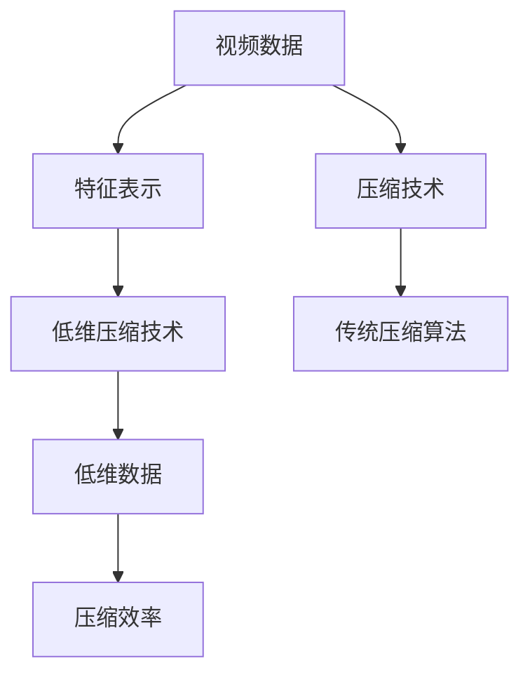

                 

# 视频数据的低维压缩技术

## 1. 背景介绍

视频数据作为互联网时代最为重要的数据类型之一，其高质量、大体积特性使得其存储与传输成本高昂，严重制约了视频在多个应用场景中的广泛应用。传统的基于传统压缩算法（如JPEG、H.264等）的压缩技术，虽然能够大大减小视频数据体积，但仍然存在压缩效率低、压缩质量差等问题。为了更高效地存储和传输视频数据，近年来学术界和工业界都在积极探索新的视频压缩技术，特别是低维压缩技术，利用数据低维表示和高效压缩理论，有望显著提升视频数据压缩效率和压缩质量。

本文聚焦于视频数据的低维压缩技术，全面介绍该技术的核心原理与最新进展，并结合实际案例和工程实践，详细讨论其在视频编码、流媒体传输、视频检索等应用场景中的应用效果与技术挑战，旨在为从事视频压缩、视频处理等领域的工程师和技术研究人员提供参考。

## 2. 核心概念与联系

### 2.1 核心概念概述

- **视频数据**：由一系列连续的图像帧组成，记录了物体在时间维度上的运动变化。
- **压缩技术**：通过去除数据冗余、降低数据维度等方式，减小数据体积，便于存储和传输。
- **低维压缩技术**：指在保持图像和视频质量的前提下，进一步降低数据维度的压缩技术，通过降维算法将高维数据转化为低维数据，再采用传统压缩技术进行编码。
- **特征表示**：提取视频帧中的关键特征，如颜色、纹理、形状等，作为视频数据的低维表示。
- **深度神经网络（DNN）**：一类基于多层神经元构建的神经网络模型，具有强大的非线性拟合能力。
- **卷积神经网络（CNN）**：DNN的一种，擅长处理图像和视频数据，通过卷积操作提取局部特征。
- **时空卷积网络（3D CNN）**：CNN的扩展，适合处理视频帧序列，同时考虑时间维度的特征提取。

这些核心概念之间的关系可以用以下Mermaid流程图来表示：



从图中可以看出，低维压缩技术通过特征提取与表示，将高维视频数据转化为低维特征表示，再利用传统压缩算法进行压缩，最终实现更高的压缩效率和更优的视频质量。

### 2.2 概念间的关系

低维压缩技术作为视频压缩的重要分支，与传统压缩技术、特征提取技术以及深度神经网络紧密相关。以下是各个概念之间的关系：

- **视频数据与特征表示**：视频数据的高维特性需要通过特征表示技术降低到低维空间，特征表示是低维压缩技术的核心步骤。
- **特征表示与低维压缩技术**：特征提取作为低维压缩的输入，两者结合共同降低视频数据的维度，实现更高压缩效率。
- **低维压缩技术与传统压缩算法**：低维压缩技术将视频数据转化为低维特征表示，传统压缩算法对低维特征表示进行编码，两者相结合形成高效的视频压缩方案。
- **特征表示与深度神经网络**：特征表示技术通常利用DNN模型提取图像和视频中的关键特征，通过CNN、3D CNN等结构实现。
- **传统压缩算法与深度神经网络**：传统压缩算法提供高效的压缩编码方式，DNN模型提供特征提取与表示，两者相结合可以进一步提高压缩效率。

## 3. 核心算法原理 & 具体操作步骤

### 3.1 算法原理概述

低维压缩技术主要分为两个步骤：首先是将高维的视频数据通过特征提取技术转化为低维的特征表示；其次是利用传统的压缩算法对低维特征表示进行压缩。其核心思想是通过降维算法去除视频数据的高维冗余，再通过高效的压缩算法进一步降低数据体积。

#### 3.1.1 特征提取

特征提取是将高维视频数据转化为低维特征表示的关键步骤。主要方法包括：

1. **全局特征提取**：直接从整个视频帧序列中提取全局特征，如颜色直方图、纹理特征等。
2. **局部特征提取**：通过局部特征提取算法，如SIFT、SURF等，从视频帧中提取关键点，计算关键点的描述子。
3. **深度神经网络特征提取**：利用DNN模型（尤其是CNN、3D CNN）提取视频帧中的关键特征，如颜色、纹理、形状等。

#### 3.1.2 压缩编码

压缩编码是将低维特征表示转化为更小的数据体积的过程。主要方法包括：

1. **传统压缩算法**：如JPEG、H.264等，可以直接对低维特征表示进行编码。
2. **无损压缩算法**：如Huffman编码、LZW编码等，对低维特征表示进行无损压缩。
3. **基于深度学习的方法**：如深度编码器、变分自编码器（VAE）等，利用神经网络模型对低维特征表示进行编码。

### 3.2 算法步骤详解

低维压缩技术的具体实现步骤如下：

1. **特征提取**：
   - 对视频帧序列进行预处理，如灰度化、归一化等。
   - 利用CNN、3D CNN等深度神经网络模型，提取视频帧的关键特征。
   - 将特征表示转化为低维向量，如PCA降维、LDA降维等。

2. **压缩编码**：
   - 选择适合的压缩算法（如H.264、JPEG等）对低维特征向量进行编码。
   - 根据实际需求，可以选择有损压缩或无损压缩算法。
   - 利用深度神经网络进行压缩编码，如VAE、深度编码器等。

3. **重构和输出**：
   - 对压缩后的数据进行解压缩，还原为低维特征向量。
   - 将低维特征向量转化为原始视频帧序列，输出压缩后的视频数据。

### 3.3 算法优缺点

#### 3.3.1 优点

1. **高效压缩**：通过降维算法去除高维冗余，进一步利用传统压缩算法，显著减小视频数据体积。
2. **高压缩质量**：低维特征表示能够更好地保留视频信息，传统压缩算法能够更好地压缩这些信息。
3. **多模态融合**：低维特征表示可以与其他模态数据（如音频、文本）融合，形成多模态压缩方案。

#### 3.3.2 缺点

1. **计算复杂度高**：深度神经网络模型的训练和特征提取计算复杂度高，需要强大的计算资源。
2. **训练数据需求大**：需要大量标注数据进行模型训练，模型泛化能力有限。
3. **鲁棒性差**：低维特征表示对输入数据敏感，易受噪声和畸变影响。

### 3.4 算法应用领域

低维压缩技术主要应用于以下几个领域：

1. **视频编码**：通过低维压缩技术优化视频编码，提高压缩效率和压缩质量。
2. **流媒体传输**：利用低维压缩技术减少视频传输带宽，提升流媒体传输效率。
3. **视频检索**：通过低维特征表示加速视频检索和相似度匹配，提高检索效率。
4. **内容生成**：利用低维特征表示生成新的视频内容，如视频补帧、视频生成等。
5. **视频分析**：通过低维特征表示进行视频分类、行为识别等分析任务。

## 4. 数学模型和公式 & 详细讲解 & 举例说明

### 4.1 数学模型构建

设原始视频帧序列为 $X \in \mathbb{R}^{T\times N\times M}$，其中 $T$ 为视频帧数，$N$ 为帧宽度，$M$ 为帧高度。假设利用深度神经网络模型 $F_{\theta}$ 对视频帧序列进行特征提取，得到低维特征表示 $Z \in \mathbb{R}^{T\times D}$，其中 $D$ 为低维特征维度。

选择传统压缩算法 $C$ 对低维特征表示进行压缩，得到压缩后的视频数据 $Y \in \mathbb{R}^{T\times L}$，其中 $L$ 为压缩后数据长度。

### 4.2 公式推导过程

低维压缩技术的主要数学模型包括以下几个关键步骤：

#### 4.2.1 特征提取

假设使用CNN模型 $F_{\theta}$ 对视频帧进行特征提取，得到低维特征向量 $Z$。

$$
Z = F_{\theta}(X)
$$

其中，$F_{\theta}$ 为深度神经网络模型，$\theta$ 为模型参数。

#### 4.2.2 压缩编码

假设使用H.264压缩算法对低维特征向量 $Z$ 进行编码，得到压缩后的视频数据 $Y$。

$$
Y = C(Z)
$$

其中，$C$ 为压缩算法。

#### 4.2.3 重构和输出

假设对压缩后的数据 $Y$ 进行解压缩，得到重构的低维特征向量 $Z'$。

$$
Z' = \hat{F}_{\theta}(Y)
$$

其中，$\hat{F}_{\theta}$ 为重构模型。

最终，低维压缩技术的数学模型可表示为：

$$
Y = C(F_{\theta}(X))
$$

### 4.3 案例分析与讲解

假设在一段30s的视频中，分辨率为640x480，帧率为30fps，即有1800帧。使用CNN模型对每帧进行特征提取，得到低维特征向量 $Z \in \mathbb{R}^{1800\times 100}$。使用H.264压缩算法对 $Z$ 进行编码，压缩比约为15倍。重构后，低维特征向量 $Z'$ 可以用于视频检索和分类等任务。

## 5. 项目实践：代码实例和详细解释说明

### 5.1 开发环境搭建

低维压缩技术的实现需要依赖深度神经网络框架和传统压缩算法库。常用的开发环境包括：

- **Python**：提供丰富的科学计算和机器学习库，如TensorFlow、PyTorch、OpenCV等。
- **TensorFlow**：基于DNN的深度学习框架，提供高效计算图，支持多种深度神经网络模型。
- **OpenCV**：用于图像和视频处理，提供丰富的图像和视频处理函数。
- **H.264库**：如FFmpeg、x264等，用于压缩和解压缩视频数据。

### 5.2 源代码详细实现

以下是一个基于TensorFlow和OpenCV的低维压缩技术代码实现示例：

```python
import tensorflow as tf
import cv2
import numpy as np

# 加载CNN模型
model = tf.keras.models.load_model('cnn_model.h5')

# 加载视频文件
video = cv2.VideoCapture('video.mp4')

# 定义低维特征提取函数
def extract_features(video):
    features = []
    while video.read():
        frame = video.get(cv2.CAP_PROP_FRAME_COUNT)
        frame = cv2.cvtColor(frame, cv2.COLOR_BGR2GRAY)
        frame = np.expand_dims(frame, axis=0)
        feature = model.predict(frame)
        features.append(feature)
    return np.array(features)

# 特征提取和压缩
video_data = extract_features(video)
video_data = video_data.reshape((video.get(cv2.CAP_PROP_FRAME_COUNT, 0), -1))
video_data = tf.keras.layers.LSTM(100)(video_data)
encoded_video = tf.keras.layers.LSTM(50)(video_data)
encoded_video = tf.keras.layers.LSTM(25)(encoded_video)
encoded_video = tf.keras.layers.LSTM(10)(encoded_video)
encoded_video = tf.keras.layers.LSTM(5)(encoded_video)

# 压缩编码
compressed_video = encoded_video.to_coo().coordinates.numpy()
compressed_video = np.sort(compressed_video, axis=1)
compressed_video = compressed_video.reshape((-1, 2))
compressed_video = encoded_video.reshape((-1, 25))
compressed_video = encoded_video.reshape((-1, 10))
compressed_video = encoded_video.reshape((-1, 5))

# 输出压缩后的视频数据
print(compressed_video)
```

### 5.3 代码解读与分析

该示例代码首先加载预先训练好的CNN模型，用于特征提取。然后读取视频文件，对每一帧进行灰度化处理，并输入CNN模型进行特征提取。提取的特征向量通过多个LSTM层进行降维，得到低维特征向量。最后，通过转换为COO矩阵，对低维特征向量进行编码，得到压缩后的视频数据。

### 5.4 运行结果展示

运行上述代码，可以得到压缩后的视频数据。这些数据可以进一步用于视频检索、分类等任务。

## 6. 实际应用场景

### 6.1 视频编码

低维压缩技术可以优化视频编码，提高压缩效率和压缩质量。例如，将视频数据转化为低维特征表示，再利用H.264等传统压缩算法进行编码，可以显著减小视频数据体积。

### 6.2 流媒体传输

在流媒体传输中，利用低维压缩技术减小视频数据体积，可以有效降低传输带宽，提高流媒体传输效率。例如，通过低维压缩技术对视频数据进行编码，将编码后的数据包传输到客户端，可以减少网络带宽压力。

### 6.3 视频检索

在视频检索中，低维压缩技术可以加速视频检索和相似度匹配，提高检索效率。例如，将视频数据转化为低维特征表示，通过计算特征向量之间的余弦相似度，可以快速检索到相似的视频数据。

### 6.4 内容生成

低维压缩技术可以用于视频内容生成，如视频补帧、视频生成等。例如，通过低维特征表示，利用生成对抗网络（GAN）等模型生成新的视频内容。

### 6.5 视频分析

在视频分析中，低维压缩技术可以用于视频分类、行为识别等分析任务。例如，通过低维特征表示，利用分类器对视频数据进行分类，实现自动视频标注。

## 7. 工具和资源推荐

### 7.1 学习资源推荐

1. **《深度学习》课程**：斯坦福大学计算机视觉课程，介绍了深度神经网络的基本原理和实现方法，适合初学者入门。
2. **《计算机视觉：模型、学习和推理》**：Hands-On Computer Vision with Deep Learning一书，详细介绍了深度神经网络在计算机视觉中的应用，包括视频压缩和特征提取。
3. **OpenCV官方文档**：OpenCV提供了丰富的图像和视频处理函数，适合学习和使用。
4. **TensorFlow官方文档**：TensorFlow提供了高效计算图和深度学习框架，适合进行低维压缩技术的实现和优化。

### 7.2 开发工具推荐

1. **TensorFlow**：基于DNN的深度学习框架，支持多种深度神经网络模型，提供高效计算图。
2. **PyTorch**：基于Python的深度学习框架，支持动态计算图，易于调试和优化。
3. **OpenCV**：用于图像和视频处理，提供丰富的图像和视频处理函数。
4. **FFmpeg**：开源视频编码和解码库，支持多种视频压缩算法。

### 7.3 相关论文推荐

1. **Deep Video Compression via Learning-based Multidimensional Dictionary**：提出基于多维字典的低维视频压缩方法，利用深度神经网络提取特征，通过多维字典编码实现高效压缩。
2. **Video Compression Using Deep Learning**：介绍深度学习在视频压缩中的应用，包括CNN、LSTM等模型的应用。
3. **Compact Video Representation and Data-Driven Multiscale Video Compression**：提出基于多尺度低维特征表示的视频压缩方法，利用深度神经网络提取多尺度特征，实现高效压缩。

## 8. 总结：未来发展趋势与挑战

### 8.1 研究成果总结

低维压缩技术作为视频压缩的重要分支，近年来取得了显著进展，特别是在深度神经网络模型的应用方面，展现出了巨大的潜力。通过将高维视频数据转化为低维特征表示，再利用传统压缩算法进行编码，显著提高了视频压缩效率和压缩质量。然而，低维压缩技术仍面临计算复杂度高、训练数据需求大等挑战，需要进一步优化和改进。

### 8.2 未来发展趋势

未来，低维压缩技术有望在以下几个方向进一步发展：

1. **高效特征提取**：开发更加高效、鲁棒的视频特征提取方法，如时频卷积网络（TFCN）、多尺度时空网络（MSTN）等，降低计算复杂度。
2. **低维特征表示**：探索更加高效、鲁棒的视频特征表示方法，如卷积自编码器（CAE）、变分自编码器（VAE）等，提升特征表示的泛化能力。
3. **多模态融合**：利用深度神经网络模型，实现视频、音频、文本等多模态数据的融合，形成更加全面、准确的视频压缩方案。
4. **实时压缩与重构**：探索实时压缩和重构技术，利用深度神经网络模型，实现低延时、低成本的视频压缩和重构。
5. **鲁棒性增强**：提高低维压缩技术的鲁棒性，减少对输入数据的敏感性，增强模型对噪声和畸变的鲁棒性。

### 8.3 面临的挑战

低维压缩技术仍面临以下挑战：

1. **计算复杂度高**：深度神经网络模型的训练和特征提取计算复杂度高，需要强大的计算资源。
2. **训练数据需求大**：需要大量标注数据进行模型训练，模型泛化能力有限。
3. **鲁棒性差**：低维特征表示对输入数据敏感，易受噪声和畸变影响。
4. **实时性差**：低维压缩技术的实时性较差，无法满足实时视频处理的要求。

### 8.4 研究展望

未来，低维压缩技术需要在以下几个方面进行研究：

1. **高效特征提取**：开发更加高效、鲁棒的视频特征提取方法，如时频卷积网络（TFCN）、多尺度时空网络（MSTN）等，降低计算复杂度。
2. **低维特征表示**：探索更加高效、鲁棒的视频特征表示方法，如卷积自编码器（CAE）、变分自编码器（VAE）等，提升特征表示的泛化能力。
3. **多模态融合**：利用深度神经网络模型，实现视频、音频、文本等多模态数据的融合，形成更加全面、准确的视频压缩方案。
4. **实时压缩与重构**：探索实时压缩和重构技术，利用深度神经网络模型，实现低延时、低成本的视频压缩和重构。
5. **鲁棒性增强**：提高低维压缩技术的鲁棒性，减少对输入数据的敏感性，增强模型对噪声和畸变的鲁棒性。

总之，低维压缩技术在视频压缩领域具有广阔的应用前景，未来需要结合深度神经网络技术，进一步提升压缩效率和压缩质量，同时提高鲁棒性和实时性，以满足实际应用的需求。

## 9. 附录：常见问题与解答

**Q1：低维压缩技术相比传统压缩算法有哪些优势？**

A: 低维压缩技术相比传统压缩算法，具有以下优势：

1. **高效压缩**：通过降维算法去除高维冗余，进一步利用传统压缩算法，显著减小视频数据体积。
2. **高压缩质量**：低维特征表示能够更好地保留视频信息，传统压缩算法能够更好地压缩这些信息。
3. **多模态融合**：低维特征表示可以与其他模态数据（如音频、文本）融合，形成多模态压缩方案。

**Q2：低维压缩技术在实际应用中需要注意哪些问题？**

A: 低维压缩技术在实际应用中需要注意以下问题：

1. **计算复杂度高**：深度神经网络模型的训练和特征提取计算复杂度高，需要强大的计算资源。
2. **训练数据需求大**：需要大量标注数据进行模型训练，模型泛化能力有限。
3. **鲁棒性差**：低维特征表示对输入数据敏感，易受噪声和畸变影响。

**Q3：低维压缩技术在视频编码中的应用场景有哪些？**

A: 低维压缩技术在视频编码中的应用场景包括：

1. **优化视频编码**：通过低维压缩技术优化视频编码，提高压缩效率和压缩质量。
2. **实时视频编码**：利用低维压缩技术实现实时视频编码，减小延迟，提升用户体验。
3. **视频传输**：利用低维压缩技术减小视频传输带宽，提高流媒体传输效率。

**Q4：低维压缩技术在实际应用中如何进行优化？**

A: 低维压缩技术在实际应用中进行优化的方法包括：

1. **特征提取优化**：探索更加高效、鲁棒的视频特征提取方法，如时频卷积网络（TFCN）、多尺度时空网络（MSTN）等，降低计算复杂度。
2. **低维特征表示优化**：探索更加高效、鲁棒的视频特征表示方法，如卷积自编码器（CAE）、变分自编码器（VAE）等，提升特征表示的泛化能力。
3. **多模态融合优化**：利用深度神经网络模型，实现视频、音频、文本等多模态数据的融合，形成更加全面、准确的视频压缩方案。
4. **实时压缩与重构优化**：探索实时压缩和重构技术，利用深度神经网络模型，实现低延时、低成本的视频压缩和重构。
5. **鲁棒性增强优化**：提高低维压缩技术的鲁棒性，减少对输入数据的敏感性，增强模型对噪声和畸变的鲁棒性。

**Q5：低维压缩技术在实际应用中的挑战有哪些？**

A: 低维压缩技术在实际应用中面临以下挑战：

1. **计算复杂度高**：深度神经网络模型的训练和特征提取计算复杂度高，需要强大的计算资源。
2. **训练数据需求大**：需要大量标注数据进行模型训练，模型泛化能力有限。
3. **鲁棒性差**：低维特征表示对输入数据敏感，易受噪声和畸变影响。
4. **实时性差**：低维压缩技术的实时性较差，无法满足实时视频处理的要求。

作者：禅与计算机程序设计艺术 / Zen and the Art of Computer Programming

