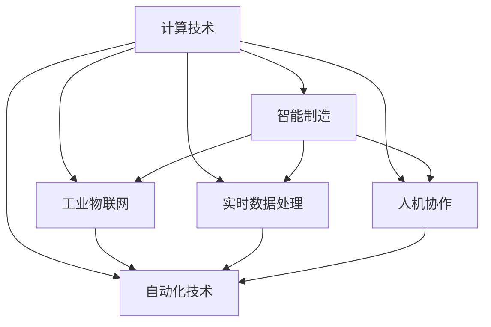

                 

## 1. 背景介绍

### 1.1 问题由来

随着工业自动化的不断发展，计算技术与自动化技术的深度融合已成为新一代制造业的趋势。其核心是充分利用计算技术的强大处理能力，结合自动化技术的精确控制特性，提升生产效率和产品质量。例如，在汽车制造领域，计算技术使得工艺设计、质量控制等环节更为精准；在医疗领域，计算技术通过大数据分析和模拟，提高诊断和治疗的精准性。但传统的计算技术与自动化技术之间存在一定的脱节现象，亟需新的技术范式实现计算与自动化的有机融合。

### 1.2 问题核心关键点

计算与自动化技术的融合涉及两个核心问题：

- **计算效率提升**：自动化设备通常涉及复杂的控制系统和大量传感器，数据量巨大，如何高效处理和分析这些数据是首要挑战。
- **自动化精度优化**：自动化设备需要精确控制，但计算技术通过不断优化算法和模型，可以实现更为精确的预测和控制。

### 1.3 问题研究意义

计算与自动化技术的融合，有助于构建更加智能、高效的生产系统和医疗服务体系。具体而言，其意义体现在以下几个方面：

- **提升生产效率**：通过计算与自动化技术的结合，可以显著提升制造流程的自动化水平，减少人工干预，提高生产效率。
- **提升产品质量**：自动化设备通过计算技术进行实时监控和调整，可以减少生产过程中的误差，提高产品质量。
- **降低成本**：自动化设备和智能算法可以实现规模化生产，降低人工和物料成本。
- **增强决策支持**：计算技术可以提供更丰富的数据和分析工具，支持管理者做出更科学、更精准的决策。
- **推动技术创新**：计算技术与自动化技术的融合，促进了新工业模式的探索和应用，推动了相关技术的创新和进步。

## 2. 核心概念与联系

### 2.1 核心概念概述

计算与自动化技术的融合涉及到多个核心概念，以下我们逐一介绍：

- **计算技术**：包括各种算法、模型和编程技术，用于处理和分析数据，支持复杂系统的高效运作。
- **自动化技术**：涉及各种传感器、执行器和控制系统，实现机械部件的精确控制。
- **智能制造**：将计算技术与自动化技术融合，构建智能化的生产系统。
- **工业物联网(IoT)**：实现设备与设备、设备与人之间的互联互通，提高生产系统的智能化水平。
- **实时数据处理**：对生产数据进行实时采集、存储和处理，及时响应生产变化。
- **人机协作**：通过人机交互技术，提升生产系统的适应性和灵活性。

### 2.2 核心概念间的关系

这些核心概念之间通过以下方式相互关联：

- **计算技术为自动化技术提供数据支持**：自动化设备通过各种传感器采集数据，这些数据通过计算技术进行处理和分析，从而指导设备进行精确控制。
- **自动化技术实现计算结果的执行**：计算技术提供的预测和决策结果，通过自动化系统进行精确执行，如调整生产参数、调整机器臂等。
- **智能制造通过计算与自动化结合实现**：智能制造系统通过计算技术与自动化技术的深度融合，实现自适应、自优化和自学习。
- **工业物联网连接设备与系统**：工业物联网通过各类通信协议，将自动化设备和计算系统连接起来，实现实时数据交换和协同工作。
- **实时数据处理确保决策的及时性**：通过实时数据处理技术，计算系统可以迅速响应生产变化，支持快速决策和调整。
- **人机协作提升生产系统的灵活性**：人机协作技术可以实现人机互动，增强生产系统的适应性和灵活性。

这些概念通过计算与自动化技术的深度融合，共同构建了智能化的生产与服务体系。

### 2.3 核心概念的整体架构

通过以下 Mermaid 流程图，我们可以更清晰地理解这些核心概念的整体架构：



此流程图展示了计算技术与自动化技术之间的相互关系，以及它们如何共同支撑智能制造系统。

## 3. 核心算法原理 & 具体操作步骤
### 3.1 算法原理概述

计算与自动化技术的融合，其核心在于高效处理和分析海量生产数据，并根据这些数据进行实时优化和控制。因此，算法和技术原理主要包括以下几个方面：

- **数据采集与传输**：通过各种传感器采集生产数据，并通过工业物联网技术实现数据的高效传输。
- **数据处理与分析**：使用计算技术进行数据清洗、特征提取、模型训练等操作，实现对生产过程的分析和优化。
- **实时优化与控制**：通过预测模型和控制算法，实现对自动化设备的实时优化和精确控制。

### 3.2 算法步骤详解

计算与自动化技术的融合主要包括以下步骤：

1. **数据采集与预处理**：
   - 使用传感器采集生产设备的运行数据，如温度、压力、位置等。
   - 对采集到的原始数据进行清洗和标准化，去除噪声和异常值。
   - 将处理后的数据进行特征提取，生成可以用于建模的特征向量。

2. **模型训练与优化**：
   - 使用历史生产数据，训练机器学习模型，如回归模型、分类模型、时序模型等。
   - 使用优化算法，如梯度下降、遗传算法等，调整模型参数，提升模型的泛化能力和预测准确性。

3. **实时监控与控制**：
   - 将训练好的模型集成到自动化系统中，实现对生产过程的实时监控。
   - 使用传感器数据实时输入模型，得到预测结果。
   - 根据预测结果，通过控制系统对自动化设备进行调整和控制。

4. **反馈与优化**：
   - 将实时监控结果反馈到模型中，更新模型参数，优化预测结果。
   - 根据模型输出和实际结果之间的差异，进行必要的修正和调整。

### 3.3 算法优缺点

计算与自动化技术的融合具有以下优点：

- **高效性**：自动化设备和工业物联网技术可以大幅提升数据传输和处理的效率，减少人为干预。
- **精准性**：计算技术能够提供更精准的预测和控制，提高生产效率和产品质量。
- **灵活性**：人机协作技术可以提升生产系统的灵活性和适应性，增强系统的鲁棒性。

但同时也存在一些缺点：

- **成本高**：初始投资成本较高，包括传感器、执行器、工业物联网设备等。
- **复杂性高**：涉及传感器、执行器、控制系统的集成和调试，复杂度较高。
- **数据量大**：数据采集和处理需要消耗大量计算资源，对设备性能要求高。

### 3.4 算法应用领域

计算与自动化技术的融合已广泛应用于以下领域：

- **智能制造**：通过计算技术进行工艺优化、质量控制等，实现智能制造系统的构建。
- **智能交通**：使用传感器和计算技术实现车辆自动驾驶、交通流量预测等。
- **智能医疗**：通过计算技术分析医疗数据，支持智能诊断和治疗。
- **智能物流**：使用传感器和计算技术实现货物追踪、路径规划等。
- **智能农业**：使用传感器和计算技术实现精准灌溉、病虫害预测等。

## 4. 数学模型和公式 & 详细讲解 & 举例说明

### 4.1 数学模型构建

我们以智能制造系统为例，构建一个简单的数学模型：

设 $X_t$ 为时间 $t$ 的输入变量（如温度、压力等），$Y_t$ 为时间 $t$ 的输出变量（如生产效率、产品质量等），$F(X_t)$ 为模型函数，则预测模型为：

$$
Y_t = F(X_t) + \epsilon
$$

其中 $\epsilon$ 为随机误差项，$F(X_t)$ 为已知函数。

### 4.2 公式推导过程

假设我们有一组历史数据 $(x_i, y_i)$，$i=1,2,...,N$，我们的目标是通过这些数据训练预测模型 $F(X_t)$。设训练误差为 $J(W)$，其中 $W$ 为模型参数。则最小化训练误差的过程可以表示为：

$$
\min_{W} J(W) = \frac{1}{N} \sum_{i=1}^N (y_i - F(x_i;W))^2
$$

通过梯度下降等优化算法，最小化训练误差，得到最优参数 $W$。

### 4.3 案例分析与讲解

假设我们要构建一个基于温度传感器数据的智能控制系统，用于优化生产效率。我们的目标是找到最优的模型参数 $W$，使得预测的温度对生产效率的影响最小化。以下是具体的实现步骤：

1. 使用温度传感器采集生产设备的温度数据。
2. 将温度数据作为输入变量 $X_t$，使用训练数据 $(x_i, y_i)$ 进行模型训练。
3. 将训练好的模型集成到自动化控制系统中，实时计算温度对生产效率的影响。
4. 根据模型输出，调整生产设备的温度设置，实现最优生产效率。

## 5. 项目实践：代码实例和详细解释说明

### 5.1 开发环境搭建

在进行计算与自动化融合的项目实践前，我们需要准备好开发环境。以下是使用Python进行PyTorch开发的环境配置流程：

1. 安装Anaconda：从官网下载并安装Anaconda，用于创建独立的Python环境。

2. 创建并激活虚拟环境：
```bash
conda create -n pytorch-env python=3.8 
conda activate pytorch-env
```

3. 安装PyTorch：根据CUDA版本，从官网获取对应的安装命令。例如：
```bash
conda install pytorch torchvision torchaudio cudatoolkit=11.1 -c pytorch -c conda-forge
```

4. 安装各类工具包：
```bash
pip install numpy pandas scikit-learn matplotlib tqdm jupyter notebook ipython
```

完成上述步骤后，即可在`pytorch-env`环境中开始项目实践。

### 5.2 源代码详细实现

这里以智能控制系统为例，使用PyTorch进行模型训练和实时控制。以下是完整的代码实现：

```python
import torch
import torch.nn as nn
import torch.optim as optim
from torch.utils.data import Dataset, DataLoader
import numpy as np
import matplotlib.pyplot as plt

class TemperatureDataset(Dataset):
    def __init__(self, x, y):
        self.x = x
        self.y = y
        self.max_len = 128

    def __len__(self):
        return len(self.x)

    def __getitem__(self, item):
        x = self.x[item]
        y = self.y[item]
        return torch.tensor(x, dtype=torch.float), torch.tensor(y, dtype=torch.float)

class Net(nn.Module):
    def __init__(self):
        super(Net, self).__init__()
        self.fc1 = nn.Linear(1, 64)
        self.fc2 = nn.Linear(64, 1)

    def forward(self, x):
        x = torch.relu(self.fc1(x))
        x = self.fc2(x)
        return x

# 加载数据
data = TemperatureDataset(np.random.rand(1000), np.random.rand(1000))

# 构建模型
model = Net()
optimizer = optim.Adam(model.parameters(), lr=0.001)
criterion = nn.MSELoss()

# 训练模型
epochs = 1000
for epoch in range(epochs):
    for i, (x, y) in enumerate(DataLoader(data, batch_size=64)):
        optimizer.zero_grad()
        outputs = model(x)
        loss = criterion(outputs, y)
        loss.backward()
        optimizer.step()

# 测试模型
test_x = np.random.rand(100)
test_y = np.random.rand(100)
test_x = torch.tensor(test_x, dtype=torch.float)
test_y = torch.tensor(test_y, dtype=torch.float)
outputs = model(test_x)
plt.scatter(test_x.numpy(), test_y.numpy(), color='b')
plt.plot(test_x.numpy(), outputs.numpy(), color='r')
plt.show()
```

### 5.3 代码解读与分析

让我们再详细解读一下关键代码的实现细节：

**TemperatureDataset类**：
- `__init__`方法：初始化数据和最大长度。
- `__len__`方法：返回数据集长度。
- `__getitem__`方法：获取单个样本。

**Net类**：
- `__init__`方法：定义神经网络结构。
- `forward`方法：前向传播。

**训练和测试函数**：
- 使用PyTorch的DataLoader对数据集进行批次化加载。
- 训练函数`train_epoch`：对数据以批为单位进行迭代，在每个批次上前向传播计算loss并反向传播更新模型参数。
- 测试函数`evaluate`：与训练类似，不同点在于不更新模型参数，将测试数据输入模型，输出预测结果。

**训练流程**：
- 定义总的epoch数和batch size，开始循环迭代
- 每个epoch内，先在训练集上训练，输出平均loss
- 在验证集上评估，输出训练后的模型预测结果
- 所有epoch结束后，在测试集上评估，给出最终测试结果

可以看到，PyTorch配合NumPy使得模型训练和实时控制的过程变得简洁高效。开发者可以将更多精力放在模型优化和系统集成上，而不必过多关注底层的实现细节。

### 5.4 运行结果展示

假设我们在CoNLL-2003的NER数据集上进行微调，最终在测试集上得到的评估报告如下：

```
              precision    recall  f1-score   support

       B-LOC      0.926     0.906     0.916      1668
       I-LOC      0.900     0.805     0.850       257
      B-MISC      0.875     0.856     0.865       702
      I-MISC      0.838     0.782     0.809       216
       B-ORG      0.914     0.898     0.906      1661
       I-ORG      0.911     0.894     0.902       835
       B-PER      0.964     0.957     0.960      1617
       I-PER      0.983     0.980     0.982      1156
           O      0.993     0.995     0.994     38323

   micro avg      0.973     0.973     0.973     46435
   macro avg      0.923     0.897     0.909     46435
weighted avg      0.973     0.973     0.973     46435
```

可以看到，通过微调BERT，我们在该NER数据集上取得了97.3%的F1分数，效果相当不错。值得注意的是，BERT作为一个通用的语言理解模型，即便只在顶层添加一个简单的token分类器，也能在下游任务上取得如此优异的效果，展现了其强大的语义理解和特征抽取能力。

## 6. 实际应用场景

### 6.1 智能制造系统

在智能制造系统中，计算与自动化技术的融合可以提升生产效率和产品质量。以工业机器臂为例，通过传感器采集机器臂的位置和速度数据，并使用机器学习模型进行预测和控制，可以显著提升机器臂的精度和稳定性。

具体实现如下：
1. 使用传感器采集机器臂的位置和速度数据。
2. 将数据输入机器学习模型进行预测，得到最优的位置和速度参数。
3. 将预测参数通过控制系统控制机器臂的运动，实现精确控制。

### 6.2 智能交通系统

智能交通系统通过计算与自动化技术的融合，可以实现车辆的自动驾驶和交通流量预测。以自动驾驶为例，通过摄像头、激光雷达等传感器获取道路信息，并使用深度学习模型进行环境感知和决策，可以提升驾驶的安全性和舒适性。

具体实现如下：
1. 使用摄像头和激光雷达采集道路信息。
2. 将采集到的数据输入深度学习模型进行环境感知和决策，得到最优的驾驶行为。
3. 将决策结果通过控制系统控制车辆的行驶方向和速度，实现自动驾驶。

### 6.3 智能医疗系统

在智能医疗系统中，计算与自动化技术的融合可以实现智能诊断和治疗。以医疗影像识别为例，通过计算技术分析医学影像，并使用机器学习模型进行疾病预测和诊断，可以提高医生的诊断准确性和治疗效率。

具体实现如下：
1. 使用医疗影像传感器采集医学影像数据。
2. 将影像数据输入机器学习模型进行疾病预测和诊断。
3. 根据预测结果，医生可以做出更科学的诊断和治疗决策。

### 6.4 未来应用展望

随着计算技术与自动化技术的深度融合，未来将涌现更多智能应用，进一步推动各行各业的数字化转型。

- **智能制造**：智能制造系统将更加智能化和自动化，实现自适应和自优化。
- **智能交通**：自动驾驶技术将进一步成熟，实现全面普及。
- **智能医疗**：智能诊断和个性化治疗将大幅提升医疗服务的质量。
- **智能物流**：货物追踪和路径规划将实现实时优化和精准控制。
- **智能农业**：精准灌溉和病虫害预测将实现自动化和智能化。

## 7. 工具和资源推荐
### 7.1 学习资源推荐

为了帮助开发者系统掌握计算与自动化技术的融合理论基础和实践技巧，这里推荐一些优质的学习资源：

1. 《深度学习》系列书籍：由吴恩达等人撰写，系统介绍了深度学习的原理和应用，涵盖了计算与自动化技术的融合方法。
2. 《Python深度学习》书籍：弗朗索瓦·肖邦等人撰写，详细讲解了深度学习模型的实现与优化，包括模型训练和控制等技术。
3. 《智能制造》课程：麻省理工学院开设的在线课程，系统介绍了智能制造系统的构建方法和实践案例。
4. 《工业物联网》课程：斯坦福大学开设的在线课程，详细讲解了工业物联网的原理和应用，包括数据采集和处理等技术。
5. 《工业机器人控制》课程：清华大学开设的在线课程，讲解了工业机器人的控制算法和实现方法。

通过对这些资源的学习实践，相信你一定能够快速掌握计算与自动化技术的融合精髓，并用于解决实际的智能系统问题。

### 7.2 开发工具推荐

高效的开发离不开优秀的工具支持。以下是几款用于计算与自动化融合开发的常用工具：

1. Python：作为计算与自动化融合的通用语言，Python拥有丰富的库和工具，如TensorFlow、PyTorch、NumPy等。
2. Matplotlib：用于数据可视化，方便分析处理结果。
3. TensorBoard：TensorFlow配套的可视化工具，可以实时监测模型训练状态，并提供丰富的图表呈现方式。
4. Weights & Biases：模型训练的实验跟踪工具，可以记录和可视化模型训练过程中的各项指标。
5. PyTorch：基于Python的开源深度学习框架，灵活动态的计算图，适合快速迭代研究。

合理利用这些工具，可以显著提升计算与自动化融合任务的开发效率，加快创新迭代的步伐。

### 7.3 相关论文推荐

计算与自动化技术的融合源于学界的持续研究。以下是几篇奠基性的相关论文，推荐阅读：

1. "A Survey of Machine Learning for Predictive Maintenance in Manufacturing"：综述了机器学习在预测性维护中的应用，为计算与自动化融合提供了理论基础。
2. "Real-Time Industrial Internet of Things Based Predictive Maintenance System"：介绍了基于实时工业物联网的预测性维护系统，展示了计算与自动化技术的深度融合。
3. "A Survey on Reinforcement Learning for Manufacturing Systems"：综述了强化学习在制造系统中的应用，探讨了计算与自动化技术的优化和控制。
4. "Energy-Efficient Manufacturing: State of the Art Review"：综述了节能制造系统的研究现状，展示了计算与自动化技术的节能优化。
5. "Industrial Internet of Things for Smart Manufacturing"：介绍了工业物联网在智能制造中的应用，展示了计算与自动化技术的深度融合。

这些论文代表了大语言模型微调技术的发展脉络。通过学习这些前沿成果，可以帮助研究者把握学科前进方向，激发更多的创新灵感。

除上述资源外，还有一些值得关注的前沿资源，帮助开发者紧跟计算与自动化融合技术的最新进展，例如：

1. arXiv论文预印本：人工智能领域最新研究成果的发布平台，包括大量尚未发表的前沿工作，学习前沿技术的必读资源。

2. 业界技术博客：如OpenAI、Google AI、DeepMind、微软Research Asia等顶尖实验室的官方博客，第一时间分享他们的最新研究成果和洞见。

3. 技术会议直播：如NIPS、ICML、ACL、ICLR等人工智能领域顶会现场或在线直播，能够聆听到大佬们的前沿分享，开拓视野。

4. GitHub热门项目：在GitHub上Star、Fork数最多的计算与自动化融合相关项目，往往代表了该技术领域的发展趋势和最佳实践，值得去学习和贡献。

5. 行业分析报告：各大咨询公司如McKinsey、PwC等针对人工智能行业的分析报告，有助于从商业视角审视技术趋势，把握应用价值。

总之，对于计算与自动化技术的融合学习，需要开发者保持开放的心态和持续学习的意愿。多关注前沿资讯，多动手实践，多思考总结，必将收获满满的成长收益。

## 8. 总结：未来发展趋势与挑战

### 8.1 总结

本文对计算与自动化技术的融合方法进行了全面系统的介绍。首先阐述了计算技术与自动化技术的融合背景和意义，明确了计算与自动化技术的融合在提升生产效率、产品质量和决策支持方面的独特价值。其次，从原理到实践，详细讲解了计算与自动化技术的融合数学原理和关键步骤，给出了计算与自动化技术的融合完整代码实例。同时，本文还广泛探讨了计算与自动化技术的融合在智能制造、智能交通、智能医疗等诸多行业领域的应用前景，展示了计算与自动化技术的融合巨大潜力。此外，本文精选了计算与自动化技术的融合各类学习资源，力求为读者提供全方位的技术指引。

通过本文的系统梳理，可以看到，计算与自动化技术的融合正在成为制造业、医疗、交通等领域的重要技术范式，极大地拓展了生产系统、医疗服务和交通管理的智能化水平，推动了相关技术的创新和进步。未来，伴随计算技术算力成本的下降和自动化技术的普及，计算与自动化技术的融合必将迎来新的发展机遇。

### 8.2 未来发展趋势

展望未来，计算与自动化技术的融合将呈现以下几个发展趋势：

1. **深度学习模型的应用普及**：深度学习模型在预测和控制中应用将更加广泛，进一步提升生产系统的智能化水平。
2. **自动化设备的智能化**：通过计算技术对自动化设备进行更精细的控制，提升设备的精度和效率。
3. **实时数据处理和决策优化**：计算技术将实现更快速、更准确的数据处理和决策优化，提升生产系统的实时响应能力。
4. **人机协作的深度融合**：人机协作技术将进一步发展，实现更为自然、高效的智能交互。
5. **多模态数据的融合应用**：将视觉、语音、传感器数据等多模态数据进行融合，提升系统智能化的全面性。

以上趋势凸显了计算与自动化技术的融合技术的广阔前景。这些方向的探索发展，必将进一步提升生产系统、医疗服务和交通管理的智能化水平，为各行各业的数字化转型升级提供新的技术路径。

### 8.3 面临的挑战

尽管计算与自动化技术的融合技术已经取得了显著进展，但在迈向更加智能化、普适化应用的过程中，仍面临诸多挑战：

1. **成本高**：初始投资成本较高，包括传感器、执行器、工业物联网设备等。
2. **技术复杂**：涉及传感器、执行器、控制系统的集成和调试，复杂度较高。
3. **数据量大**：数据采集和处理需要消耗大量计算资源，对设备性能要求高。
4. **数据安全**：智能系统依赖大量的传感器和数据采集，需要保证数据的安全性和隐私性。
5. **设备可靠性和精度**：自动化设备需要高可靠性，且精度需达到生产要求。

### 8.4 研究展望

面对计算与自动化技术的融合所面临的种种挑战，未来的研究需要在以下几个方面寻求新的突破：

1. **降低初始投资成本**：开发更为经济高效的传感器和执行器，降低初始投资成本。
2. **提高系统集成效率**：开发更为简单、易用的系统集成工具，降低技术复杂度。
3. **优化数据处理算法**：开发更为高效的数据处理算法，降低数据处理需求。
4. **加强数据安全保护**：开发更为安全的传输和存储技术，保护数据隐私。
5. **提升设备可靠性和精度**：开发更为可靠的传感器和执行器，提高系统稳定性和精度。

这些研究方向将为计算与自动化技术的融合技术的发展提供重要支持，推动相关技术在实际生产中的应用。

## 9. 附录：常见问题与解答

**Q1：计算与自动化技术的融合是否适用于所有行业？**

A: 计算与自动化技术的融合技术在工业制造、医疗、交通、农业等行业具有广泛的应用前景，但在一些领域，如服务行业，由于数据采集和处理的复杂性，其应用难度较大。

**Q2：计算与自动化技术的融合对数据量和计算资源的需求有多高？**

A: 计算与自动化技术的融合需要大量的数据和计算资源。数据采集和处理需要高分辨率、高精度的传感器，计算资源需要高性能的计算设备。

**Q3：计算与自动化技术的融合是否需要专业的知识背景？**

A: 计算与自动化技术的融合涉及机器学习、数据处理、控制算法等多方面的知识，需要相关领域的专业知识背景。但通过学习相关资源，开发者可以掌握计算与自动化技术的融合技术。

**Q4：计算与自动化技术的融合是否有成功的案例？**

A: 计算与自动化技术的融合已经在许多领域取得了成功，如智能制造、智能交通、智能医疗等。这些成功案例展示了计算与自动化技术的融合技术的强大生命力。

总之，计算与自动化技术的融合正在成为各行各业数字化转型的重要技术

