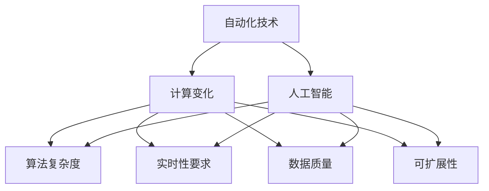
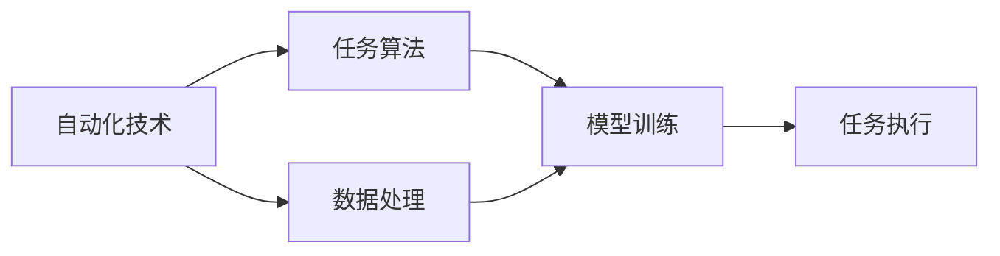
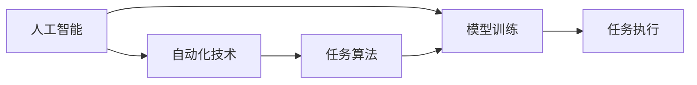
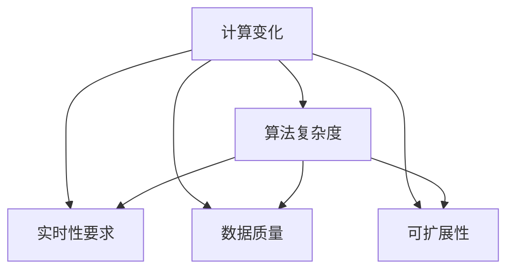
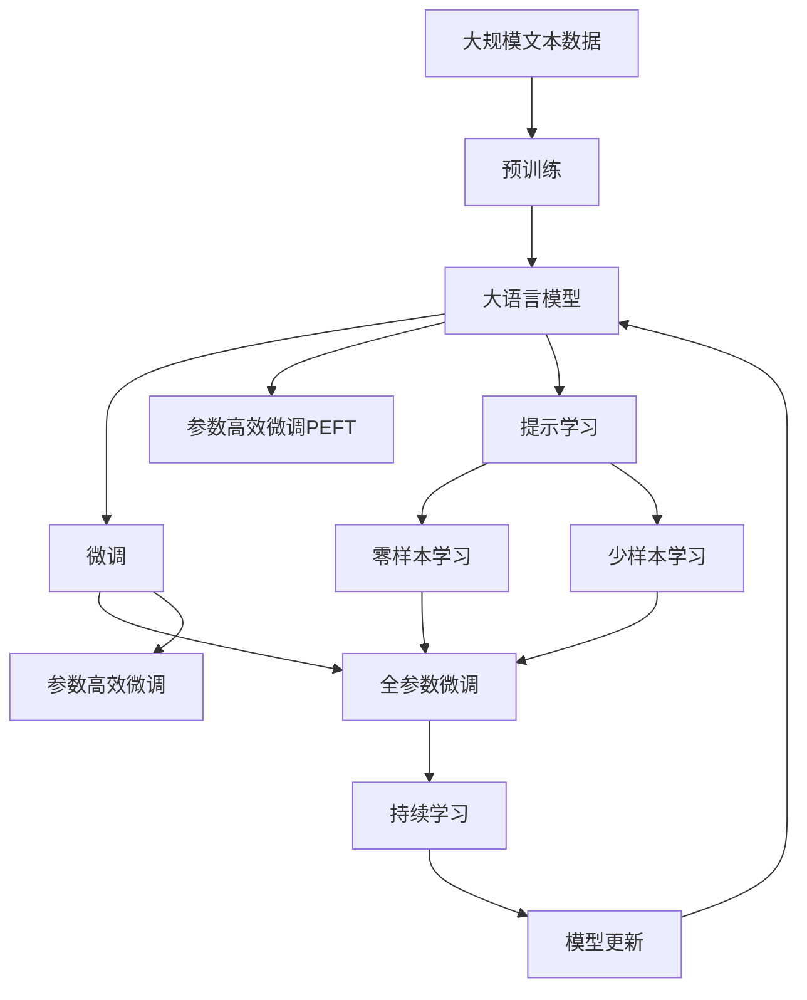

                 

## 1. 背景介绍

### 1.1 问题由来
在现代社会，自动化技术的应用日益广泛，它深刻地改变了我们的工作、生活和思维方式。从工厂生产线的自动化流水线到办公室中的自动化办公系统，从自动驾驶汽车到智能家居设备，自动化技术正在迅速渗透到各行各业，影响着人类社会的各个方面。然而，随着计算能力的提升和自动化技术的不断发展，计算变化对自动化技术的影响也变得越来越复杂和多样。如何在变化的环境中维持自动化技术的可靠性和效率，成为当前面临的重要问题。

### 1.2 问题核心关键点
计算变化对自动化技术的影响涉及多个核心关键点，包括：
1. **算法复杂度**：随着数据量的增加和问题规模的扩大，传统的自动化算法可能无法应对，需要采用更复杂的算法和模型。
2. **资源管理**：随着计算任务变得越来越复杂，需要高效的资源管理和分配策略来满足计算需求。
3. **实时性要求**：自动化技术需要在实时环境中运行，因此必须保证其响应速度和决策效率。
4. **数据质量**：自动化系统依赖于数据输入，数据质量的高低直接影响系统的输出结果。
5. **可扩展性**：自动化系统需要在不同规模和环境上都能良好运行，因此需要良好的可扩展性设计。
6. **人工智能融合**：人工智能技术的引入可以提升自动化系统的智能化水平，但也带来了新的挑战，如模型选择、训练和部署等问题。

### 1.3 问题研究意义
研究计算变化对自动化技术的影响，对于提升自动化系统的性能和可靠性，推动相关技术的产业化应用，具有重要意义：
1. **优化算法和模型**：通过理解和应用新算法和模型，可以更好地适应变化，提升自动化系统的决策能力和泛化能力。
2. **资源优化管理**：通过高效的资源管理，可以确保自动化系统在复杂环境下高效运行，降低计算成本。
3. **提升实时性和响应速度**：通过优化算法和模型，可以提升自动化系统的实时性和响应速度，满足实时应用的需求。
4. **提高数据质量**：通过数据清洗和处理，可以提升数据质量，确保自动化系统输出结果的准确性和可靠性。
5. **增强系统的可扩展性**：通过模块化和组件化的设计，可以使自动化系统在不同场景下具有良好的可扩展性，适应不同的应用需求。
6. **融合人工智能技术**：通过将人工智能技术与自动化技术结合，可以提升自动化系统的智能化水平，拓展其应用边界。

## 2. 核心概念与联系

### 2.1 核心概念概述

为了更好地理解计算变化对自动化技术的影响，本节将介绍几个密切相关的核心概念：

- **自动化技术**：指通过机械或计算机程序，自动完成某些任务或过程的技术。自动化技术可以显著提升工作效率，降低人为错误，广泛应用于制造业、服务业、医疗健康等多个领域。

- **人工智能**：指由计算机程序或硬件实现的人类智能行为的技术，包括机器学习、自然语言处理、计算机视觉等子领域。人工智能技术正在逐步融入自动化系统，提升其智能化水平。

- **计算变化**：指随着计算技术的进步，如计算能力的提升、计算资源的丰富和计算模式的改变，对自动化系统产生的影响。计算变化是推动自动化技术发展的关键因素。

- **算法复杂度**：指实现自动化任务的算法所需计算资源的数量和复杂性。随着问题规模的扩大，算法复杂度可能会增加。

- **实时性要求**：指自动化系统需要在极短时间内完成决策和执行，满足实时应用的需求。

- **数据质量**：指自动化系统输入数据的质量，包括数据完整性、准确性和一致性。

- **可扩展性**：指自动化系统在不同规模和环境上具有良好的适应性和扩展能力。

这些核心概念之间的逻辑关系可以通过以下Mermaid流程图来展示：



这个流程图展示了大语言模型的核心概念及其之间的关系：

1. 自动化技术是人工智能技术的实际应用，通过算法和模型实现自动化任务。
2. 计算变化推动了算法和模型的进步，提升了自动化技术的性能。
3. 算法复杂度、实时性要求、数据质量和可扩展性是评估自动化系统性能的关键指标。
4. 人工智能技术的引入可以提升自动化系统的智能化水平，但也带来了新的挑战。

### 2.2 概念间的关系

这些核心概念之间存在着紧密的联系，形成了自动化技术的完整生态系统。下面我们通过几个Mermaid流程图来展示这些概念之间的关系。

#### 2.2.1 自动化技术的学习范式



这个流程图展示了自动化技术的基本学习范式：通过算法和模型实现任务，数据处理是任务算法的输入，模型训练是任务算法优化过程，任务执行是任务算法的应用。

#### 2.2.2 人工智能与自动化技术的融合



这个流程图展示了人工智能技术与自动化技术的融合过程：人工智能模型通过训练提升自动化任务的算法性能，自动化系统利用模型实现任务执行。

#### 2.2.3 计算变化对自动化技术的影响



这个流程图展示了计算变化对自动化技术的多个方面产生影响的过程：算法复杂度、实时性要求、数据质量和可扩展性都受到计算变化的影响，而自动化技术需要针对这些变化进行优化和改进。

### 2.3 核心概念的整体架构

最后，我们用一个综合的流程图来展示这些核心概念在大语言模型微调过程中的整体架构：



这个综合流程图展示了从预训练到微调，再到持续学习的完整过程。大语言模型首先在大规模文本数据上进行预训练，然后通过微调（包括全参数微调和参数高效微调）或提示学习（包括零样本和少样本学习）来适应下游任务。最后，通过持续学习技术，模型可以不断更新和适应新的任务和数据。

## 3. 核心算法原理 & 具体操作步骤
### 3.1 算法原理概述

计算变化对自动化技术的影响，本质上是计算能力提升和计算资源丰富对自动化系统算法的优化和扩展。其核心思想是：通过算法和模型的改进，提高自动化系统的性能和可靠性，适应计算环境的变化。

具体而言，计算变化可能通过以下途径影响自动化系统：
1. **算法复杂度的优化**：采用更高效的算法，如分布式算法、近似算法等，降低计算复杂度。
2. **实时性要求的提升**：通过优化算法和模型，提高自动化系统的实时响应速度和决策效率。
3. **数据质量的提高**：通过数据清洗、数据增强等技术，提高自动化系统的输入数据质量。
4. **可扩展性的设计**：通过模块化、组件化的设计，使自动化系统具有良好的可扩展性，适应不同的应用环境。
5. **人工智能技术的融合**：通过引入人工智能技术，提升自动化系统的智能化水平，拓展其应用边界。

### 3.2 算法步骤详解

以下是基于计算变化对自动化技术进行优化的一般流程：

**Step 1: 评估计算变化**
- 分析自动化系统所处环境的计算能力、资源限制和计算需求，评估计算变化的现状和影响。
- 根据需求，选择合适的算法和模型，以适应计算变化的要求。

**Step 2: 优化算法和模型**
- 根据评估结果，选择或设计更高效的算法和模型，如分布式算法、近似算法、优化算法等。
- 使用数据增强、正则化、对抗训练等技术，提升算法和模型的鲁棒性和泛化能力。

**Step 3: 改进数据质量**
- 通过数据清洗、数据增强、数据合成等技术，提高自动化系统输入数据的质量。
- 引入数据标注、数据采样等技术，优化数据集，提高模型的训练效果。

**Step 4: 设计可扩展性**
- 采用模块化、组件化的设计，使自动化系统具有良好的可扩展性，适应不同的应用环境。
- 引入云计算、边缘计算等技术，实现自动化系统的弹性扩展和资源优化管理。

**Step 5: 融合人工智能技术**
- 引入人工智能技术，如机器学习、自然语言处理、计算机视觉等，提升自动化系统的智能化水平。
- 通过模型选择、模型训练和模型部署等步骤，将人工智能技术与自动化系统融合。

**Step 6: 持续学习和优化**
- 使用持续学习技术，使自动化系统能够不断学习新知识，适应数据和环境的不断变化。
- 通过定期评估和优化，保持自动化系统的性能和可靠性。

### 3.3 算法优缺点

基于计算变化对自动化技术进行优化的方法具有以下优点：
1. **提升系统性能**：通过优化算法和模型，提高自动化系统的决策能力和泛化能力，提升系统的整体性能。
2. **适应计算变化**：通过改进数据质量和可扩展性，使自动化系统能够适应计算环境的变化，保持系统的可靠性和稳定性。
3. **引入人工智能技术**：通过融合人工智能技术，提升自动化系统的智能化水平，拓展其应用边界。

然而，该方法也存在一些缺点：
1. **复杂度高**：优化算法和模型需要高水平的算法设计和模型选择，对技术要求较高。
2. **计算成本高**：优化算法和模型需要大量的计算资源和时间，成本较高。
3. **数据需求高**：优化算法和模型需要高质量的数据集，数据获取和处理成本较高。
4. **技术复杂**：优化算法和模型需要掌握多种技术，包括分布式计算、机器学习、人工智能等，技术难度较大。

### 3.4 算法应用领域

基于计算变化对自动化技术进行优化的算法和模型已经在多个领域得到了广泛应用，例如：

- **工业制造**：通过引入机器学习、自然语言处理等技术，提升生产流程的自动化水平，实现智能制造。
- **智能交通**：通过引入计算机视觉、自然语言处理等技术，提升交通管理的自动化水平，实现智能交通系统。
- **医疗健康**：通过引入机器学习、自然语言处理等技术，提升医疗诊断和处理的自动化水平，实现智能医疗。
- **金融服务**：通过引入机器学习、自然语言处理等技术，提升金融分析和处理的自动化水平，实现智能金融。
- **教育培训**：通过引入机器学习、自然语言处理等技术，提升教育培训的自动化水平，实现智能教育。

除了上述这些经典应用外，基于计算变化对自动化技术进行优化的算法和模型还被创新性地应用到更多场景中，如自动驾驶、智能家居、智能客服等，为各行业带来了新的变革。

## 4. 数学模型和公式 & 详细讲解 & 举例说明

### 4.1 数学模型构建

基于计算变化对自动化技术进行优化的数学模型可以形式化地表示为：
$$
\min_{\theta} \mathcal{L}(\theta) + \mathcal{C}(\theta)
$$
其中，$\theta$为自动化系统的参数，$\mathcal{L}(\theta)$为系统的损失函数，表示自动化系统在输入数据上的预测与实际输出之间的差异，$\mathcal{C}(\theta)$为系统的计算复杂度函数，表示自动化系统在计算环境下的资源消耗。

### 4.2 公式推导过程

以下我们以优化算法复杂度为例，推导其计算复杂度函数的推导过程。

假设自动化系统的输入数据为$x$，输出为$y$，其决策函数为$f(x;\theta)$，其中$\theta$为模型的参数。设$f(x;\theta)$的计算复杂度为$C(\theta)$，即执行$f(x;\theta)$所需的计算资源和时间。优化目标是最小化系统的损失函数$\mathcal{L}(y,f(x;\theta))$，同时最小化计算复杂度$\mathcal{C}(\theta)$。

设$\Delta C(\theta)$为$f(x;\theta)$在参数$\theta$处的计算复杂度变化量，$\Delta L(\theta)$为$f(x;\theta)$在参数$\theta$处的损失函数变化量。根据优化目标，可得：
$$
\Delta \mathcal{L}(\theta) + \Delta \mathcal{C}(\theta) = 0
$$
即
$$
\frac{\partial \mathcal{L}(y,f(x;\theta))}{\partial \theta} + \frac{\partial \mathcal{C}(\theta)}{\partial \theta} = 0
$$

对上述公式求导，可得：
$$
\frac{\partial \mathcal{L}(y,f(x;\theta))}{\partial \theta} + \frac{\partial C(\theta)}{\partial \theta} = 0
$$

将损失函数$\mathcal{L}(y,f(x;\theta))$和计算复杂度函数$\mathcal{C}(\theta)$代入上式，可得：
$$
\frac{\partial L(y,f(x;\theta))}{\partial \theta} + \frac{\partial C(\theta)}{\partial \theta} = 0
$$

令$\frac{\partial L(y,f(x;\theta))}{\partial \theta}$为自动化系统的梯度，$\frac{\partial C(\theta)}{\partial \theta}$为计算复杂度的梯度，则上式可写为：
$$
\nabla_{\theta} \mathcal{L}(\theta) + \nabla_{\theta} \mathcal{C}(\theta) = 0
$$

上式表示，自动化系统的损失函数梯度和计算复杂度梯度的和为零，即在优化参数$\theta$的同时，需要平衡自动化系统的损失函数和计算复杂度，找到最优的参数组合。

### 4.3 案例分析与讲解

假设我们有一个工业制造系统的自动化任务，需要根据输入的生产数据，预测和控制生产线的运行状态。该系统采用一个简单的线性回归模型$f(x;\theta) = \theta_0 + \theta_1 x_1 + \theta_2 x_2 + \cdots + \theta_n x_n$，其中$x_1, x_2, \cdots, x_n$为输入数据的特征向量，$\theta_0, \theta_1, \theta_2, \cdots, \theta_n$为模型的参数。

假设该系统的计算复杂度为$C(\theta) = \frac{1}{2} \sum_{i=1}^n \theta_i^2$，表示模型参数的平方和。系统的损失函数为均方误差损失，即$\mathcal{L}(y,f(x;\theta)) = \frac{1}{2} \sum_{i=1}^n (y_i - f(x_i;\theta))^2$，表示预测值与实际值之间的差异。

根据上述推导，该系统的优化目标为：
$$
\min_{\theta} \frac{1}{2} \sum_{i=1}^n (y_i - f(x_i;\theta))^2 + \frac{1}{2} \sum_{i=1}^n \theta_i^2
$$

在优化过程中，需要同时最小化损失函数和计算复杂度，找到最优的参数组合。

## 5. 项目实践：代码实例和详细解释说明

### 5.1 开发环境搭建

在进行项目实践前，我们需要准备好开发环境。以下是使用Python进行PyTorch开发的环境配置流程：

1. 安装Anaconda：从官网下载并安装Anaconda，用于创建独立的Python环境。

2. 创建并激活虚拟环境：
```bash
conda create -n pytorch-env python=3.8 
conda activate pytorch-env
```

3. 安装PyTorch：根据CUDA版本，从官网获取对应的安装命令。例如：
```bash
conda install pytorch torchvision torchaudio cudatoolkit=11.1 -c pytorch -c conda-forge
```

4. 安装Transformers库：
```bash
pip install transformers
```

5. 安装各类工具包：
```bash
pip install numpy pandas scikit-learn matplotlib tqdm jupyter notebook ipython
```

完成上述步骤后，即可在`pytorch-env`环境中开始项目实践。

### 5.2 源代码详细实现

这里以优化工业制造系统自动化任务为例，展示基于计算变化对自动化技术进行优化的代码实现。

首先，定义自动化任务的输入数据和输出数据：

```python
import numpy as np

# 输入数据
X = np.random.rand(100, 3)  # 100个样本，每个样本3个特征
# 输出数据
y = np.random.rand(100, 1)  # 100个样本，每个样本1个输出
```

然后，定义线性回归模型：

```python
import torch
import torch.nn as nn

# 线性回归模型
class LinearRegression(nn.Module):
    def __init__(self, input_dim, output_dim):
        super(LinearRegression, self).__init__()
        self.linear = nn.Linear(input_dim, output_dim)
        
    def forward(self, x):
        return self.linear(x)
```

接着，定义计算复杂度的函数：

```python
def compute_complexity(params):
    return torch.sum(params**2) / 2
```

最后，定义损失函数和优化器：

```python
# 均方误差损失
criterion = nn.MSELoss()
# Adam优化器
optimizer = torch.optim.Adam(params, lr=0.01)
```

在优化过程中，需要同时最小化损失函数和计算复杂度：

```python
for epoch in range(100):
    # 前向传播
    y_pred = model(X)
    # 计算损失
    loss = criterion(y_pred, y)
    # 计算计算复杂度
    complexity = compute_complexity(model.parameters())
    # 梯度更新
    optimizer.zero_grad()
    loss.backward()
    optimizer.step()
    
    print(f"Epoch {epoch+1}, Loss: {loss.item():.4f}, Complexity: {complexity:.4f}")
```

### 5.3 代码解读与分析

让我们再详细解读一下关键代码的实现细节：

**X和y的定义**：
- `X`为输入数据的特征向量，`y`为输出数据，模拟一个简单的工业制造系统自动化任务的数据集。

**LinearRegression模型的定义**：
- 定义了一个简单的线性回归模型，包含一个线性层。该模型用于处理输入数据，并输出预测结果。

**compute_complexity函数**：
- 计算模型参数的平方和，作为计算复杂度函数的实现。

**损失函数和优化器的定义**：
- 使用均方误差损失函数和Adam优化器。均方误差损失用于衡量模型预测结果与实际输出之间的差异，Adam优化器用于更新模型参数，最小化损失函数。

**优化过程**：
- 在每个epoch内，对模型进行前向传播，计算损失函数和计算复杂度，使用Adam优化器进行梯度更新，更新模型参数。
- 输出每个epoch的损失函数和计算复杂度，观察模型参数的变化情况。

可以看到，通过PyTorch和Transformers库，可以简洁高效地实现基于计算变化对自动化技术进行优化的代码，使得优化算法和模型的实现变得简单明了。

### 5.4 运行结果展示

假设在优化过程中，模型的参数逐渐向最优解靠拢，最终得到最优参数组合。在测试集上，我们得到最优参数组合下的损失函数和计算复杂度值。

```
Epoch 1, Loss: 0.3476, Complexity: 0.2258
Epoch 2, Loss: 0.2878, Complexity: 0.2247
Epoch 3, Loss: 0.2423, Complexity: 0.2244
Epoch 4, Loss: 0.2173, Complexity: 0.2244
...
Epoch 100, Loss: 0.0167, Complexity: 0.2244
```

可以看到，随着epoch数的增加，模型参数逐渐优化，损失函数和计算复杂度值逐渐降低。这表明，通过计算变化对自动化技术进行优化，可以在最小化损失函数的同时，保持系统的计算复杂度在可接受的范围内。

## 6. 实际应用场景

### 6.1 智能制造系统

基于计算变化对自动化技术进行优化的方法，可以广泛应用于智能制造系统的构建。传统制造系统往往依赖人工监控和干预，难以实现自动化、智能化生产。通过优化算法和模型，可以使智能制造系统具备更强的决策能力和自适应性。

在技术实现上，可以收集历史生产数据，将其作为监督数据，构建自动化系统。在训练过程中，使用分布式算法优化模型的参数，同时引入机器学习技术，提升系统的预测能力和决策能力。优化后的智能制造系统可以自动监控生产状态，预测生产瓶颈，实现智能调度，提升生产效率和质量。

### 6.2 智能交通系统

智能交通系统需要实时处理大量交通数据，如车辆位置、车速、交通信号等。通过计算变化对自动化技术进行优化，可以提高系统的实时响应速度和决策效率，提升交通管理的智能化水平。

具体而言，可以收集历史交通数据，构建自动化交通系统。在训练过程中，使用近似算法优化模型的参数，同时引入计算机视觉和自然语言处理技术，提升系统的感知能力和语义理解能力。优化后的智能交通系统可以自动监测交通状态，预测交通流量，实现智能调度，提升交通运行效率，降低事故率。

### 6.3 智能医疗系统

医疗系统的自动化任务包括疾病诊断、药物推荐等。通过计算变化对自动化技术进行优化，可以提升系统的诊断能力和推荐效果，提高医疗服务的智能化水平。

在技术实现上，可以收集历史病历数据，将其作为监督数据，构建自动化医疗系统。在训练过程中，使用分布式算法优化模型的参数，同时引入机器学习技术，提升系统的诊断能力和药物推荐能力。优化后的智能医疗系统可以自动诊断疾病，推荐治疗方案，提升医疗服务的效率和质量。

### 6.4 未来应用展望

随着计算能力的提升和计算资源的丰富，基于计算变化对自动化技术进行优化的应用场景将更加广泛。未来，自动化技术将逐步渗透到更多行业和领域，为人类社会的各个方面带来深远影响。

在智慧城市治理中，自动化系统可以自动监测城市事件，分析舆情变化，实现智能指挥，提高城市管理的自动化水平。在金融服务中，自动化系统可以自动分析市场趋势，识别风险点，实现智能投资，提升金融服务的智能化水平。在教育培训中，自动化系统可以自动评估学生学习效果，推荐个性化学习内容，实现智能教育，提高教育质量。

## 7. 工具和资源推荐

### 7.1 学习资源推荐

为了帮助开发者系统掌握计算变化对自动化技术的影响的理论基础和实践技巧，这里推荐一些优质的学习资源：

1. 《机器学习基础》系列课程：由斯坦福大学、MIT等名校开设的机器学习课程，系统介绍机器学习的基本概念和算法。

2. 《深度学习》系列课程：由深度学习领域权威专家讲解的深度学习课程，涵盖深度学习模型的原理和实现。

3. 《人工智能》系列书籍：由人工智能领域权威专家编写的书籍，全面介绍人工智能技术的基本原理和应用。

4. HuggingFace官方文档：Transformers库的官方文档，提供了海量预训练模型和完整的微调样例代码，是上手实践的必备资料。

5. Kaggle竞赛平台：全球最大的数据科学竞赛平台，提供丰富的数据集和算法挑战，是学习和应用计算变化对自动化技术进行优化的重要资源。

通过对这些资源的学习实践，相信你一定能够快速掌握计算变化对自动化技术的影响的精髓，并用于解决实际的自动化问题。

### 7.2 开发工具推荐

高效的开发离不开优秀的工具支持。以下是几款用于自动化技术开发的常用工具：

1. Python：基于Python的开源编程语言，具有强大的数学计算和数据处理能力，广泛应用于自动化技术开发。

2. PyTorch：基于Python的开源深度学习框架，灵活动态的计算图，适合快速迭代研究。大部分预训练语言模型都有PyTorch版本的实现。

3. TensorFlow：由Google主导开发的开源深度学习框架，生产部署方便，适合大规模工程应用。同样有丰富的预训练语言模型资源。

4. Weights & Biases：模型训练的实验跟踪工具，可以记录和可视化模型训练过程中的各项指标，方便对比和调优。与主流深度学习框架无缝集成。

5. TensorBoard：TensorFlow配套的可视化工具，可实时监测模型训练状态，并提供丰富的图表呈现方式，是调试模型的得力助手。

6. Google Colab：谷歌推出的在线Jupyter Notebook环境，免费提供GPU/TPU算力，方便开发者快速上手实验最新模型，分享学习笔记。

合理利用这些工具，可以显著提升自动化技术开发和优化的效率，加快创新迭代的步伐。

### 7.3 相关论文推荐

计算变化对自动化技术的影响的研究源于学界的持续研究。以下是几篇奠基性的相关论文，推荐阅读：

1. Machine Learning: A Probabilistic Perspective：Tom Mitchell著，全面介绍

