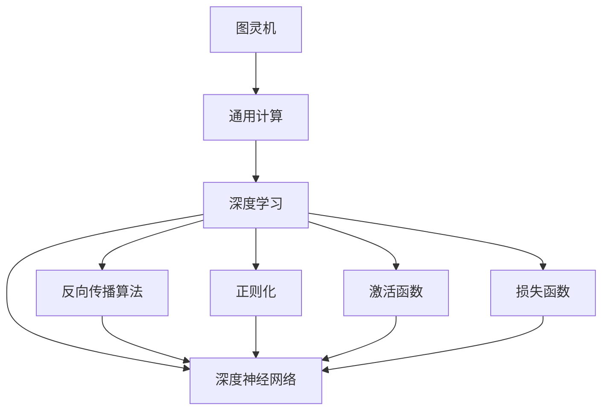

                 

# 计算范式的变革：从图灵机到神经网络

## 1. 背景介绍

### 1.1 问题由来

计算机科学的诞生标志之一是图灵机的提出，由英国数学家阿尔巴德·图灵于1936年发表。图灵机作为一种理想化的计算模型，奠定了计算机科学发展的基石。图灵机的核心思想是通过可执行指令序列（程序）来模拟任何计算过程，从而实现通用计算。

随着时间的推移，计算范式不断演进，从早期的纯计算模型逐步向基于神经网络的新范式转变。神经网络，尤其是深度神经网络（Deep Neural Networks, DNNs）的提出，标志着计算范式的重大变革，使计算机能够处理更加复杂、高度非线性化的数据，实现深度学习和人工智能的突破。

## 2. 核心概念与联系

### 2.1 核心概念概述

图灵机与神经网络作为两种重要的计算模型，各自承载了不同的计算哲学和计算方式。下面是一些关键概念及其联系：

- **图灵机（Turing Machine, TM）**：由图灵提出，是最早的通用计算模型之一，定义了计算理论的基础。图灵机包含一个读写头、无限长度的带子、有限数量的状态，能够模拟任何可计算函数。

- **深度神经网络（DNN）**：由多层非线性变换组成，能够学习复杂、高维的非线性特征，实现数据驱动的模型构建。DNN广泛应用于图像识别、语音识别、自然语言处理等领域，显著提升了机器学习和人工智能系统的能力。

- **反向传播算法（Backpropagation, BP）**：DNN的核心算法之一，通过链式法则计算梯度，反向更新网络权重，优化模型性能。反向传播是深度学习模型的训练基础。

- **正则化（Regularization）**：通过加入L2正则项、Dropout等技术，防止模型过拟合，提升泛化能力。

- **激活函数（Activation Function）**：如ReLU、Sigmoid等函数，决定神经元是否激活以及激活的程度。激活函数对神经网络性能至关重要。

- **损失函数（Loss Function）**：定义模型预测与真实标签之间的差异，如交叉熵损失、均方误差损失等，用于评估模型性能。

这些概念通过“计算范式的变革”这一主线紧密相连，共同推动了计算理论从图灵机到神经网络的发展和演进。

### 2.2 概念间的关系

通过一个Mermaid流程图来展示这些概念之间的逻辑关系：



这个流程图展示了大语言模型微调过程中各个概念之间的联系和作用：

1. 图灵机通过通用计算概念奠定了计算理论的基础。
2. 深度学习通过深度神经网络、激活函数、正则化、损失函数等技术，实现了计算范式的重大变革，使计算机能够处理复杂、非线性化的数据。
3. 反向传播算法是深度学习模型的训练基础，通过梯度反向传播优化模型参数。

这些概念构成了从图灵机到神经网络的计算范式变革，推动了计算科学的快速发展。

## 3. 核心算法原理 & 具体操作步骤

### 3.1 算法原理概述

神经网络作为计算范式的重大变革，其核心在于通过反向传播算法，最小化损失函数，不断优化模型参数，从而实现数据驱动的模型构建。以下是神经网络的核心算法原理概述：

1. **前向传播（Forward Propagation）**：将输入数据经过多层非线性变换，逐步传递到输出层，得到模型预测结果。

2. **损失函数（Loss Function）**：定义模型预测与真实标签之间的差异，用于评估模型性能。

3. **反向传播（Backpropagation）**：通过链式法则计算梯度，反向更新网络权重，优化模型性能。

4. **优化算法（Optimization Algorithm）**：如随机梯度下降（SGD）、Adam等，用于调整模型参数，最小化损失函数。

### 3.2 算法步骤详解

以下是基于神经网络的反向传播算法步骤详解：

1. **初始化网络参数**：随机初始化神经网络的权重和偏置。

2. **前向传播**：将输入数据依次传递到各层，计算各层输出。

3. **计算损失函数**：将模型预测结果与真实标签计算损失，如交叉熵损失。

4. **反向传播**：通过链式法则计算损失函数对各层参数的梯度。

5. **参数更新**：使用优化算法（如Adam），根据梯度更新参数，最小化损失函数。

6. **迭代训练**：重复前向传播、计算损失、反向传播、参数更新等步骤，直至收敛。

### 3.3 算法优缺点

神经网络具有以下优点：

- **数据驱动**：通过学习大量数据，自动发现数据中的复杂模式。
- **非线性映射**：通过多层非线性变换，实现复杂、非线性化的特征提取。
- **可解释性**：通过可视化工具，理解模型内部工作机制。

同时，神经网络也存在一些局限：

- **过拟合风险**：在训练数据不足或模型复杂度过高时，容易过拟合。
- **训练难度大**：需要大量的标注数据和强大的计算资源。
- **模型可解释性不足**：神经网络往往被视为"黑盒"模型，难以解释其决策过程。

### 3.4 算法应用领域

神经网络作为一种强大的计算模型，广泛应用于以下几个领域：

- **计算机视觉**：如图像识别、物体检测、图像分割等。
- **自然语言处理**：如文本分类、情感分析、机器翻译等。
- **语音识别**：如语音转文本、语音合成等。
- **推荐系统**：如商品推荐、个性化推荐等。
- **时间序列分析**：如股票预测、天气预测等。
- **强化学习**：如游戏AI、机器人控制等。

神经网络在这些领域的广泛应用，展示了其在复杂问题处理上的强大能力，推动了人工智能技术的发展和应用。

## 4. 数学模型和公式 & 详细讲解

### 4.1 数学模型构建

以二分类问题为例，构建一个简单的神经网络模型。假设输入为 $x$，输出为 $y$，网络由三层组成：输入层、隐藏层、输出层。

- **输入层**：$x = [x_1, x_2, ..., x_n]$。
- **隐藏层**：$h = f(W_1x + b_1)$，其中 $f$ 为激活函数，$W_1$ 为权重矩阵，$b_1$ 为偏置向量。
- **输出层**：$y = f(W_2h + b_2)$，其中 $W_2$ 和 $b_2$ 分别表示权重矩阵和偏置向量。

### 4.2 公式推导过程

以二分类问题为例，推导神经网络的损失函数及其梯度。

假设模型预测结果为 $y' = f(W_2h + b_2)$，其中 $f$ 为激活函数，如sigmoid函数。真实标签为 $y$，定义损失函数为：

$$
L(y, y') = -y\log(y') - (1-y)\log(1-y')
$$

其中，$y\log(y')$ 表示模型预测正确时的损失，$(1-y)\log(1-y')$ 表示模型预测错误时的损失。

对损失函数求梯度，得到：

$$
\frac{\partial L}{\partial W_2} = f'(W_2h + b_2)(h - y)h'
$$

$$
\frac{\partial L}{\partial h} = f'(W_2h + b_2)(W_1^T) + f'(W_2h + b_2)\frac{\partial h}{\partial x}
$$

其中，$f'$ 表示激活函数的导数。通过反向传播算法，可以计算出所有参数的梯度，进而使用优化算法更新网络参数。

### 4.3 案例分析与讲解

以手写数字识别为例，说明神经网络在图像识别任务中的应用。

首先，将手写数字图像转换为向量形式，作为输入。然后，设计一个简单的神经网络模型，包括一个输入层、一个隐藏层和一个输出层。通过反向传播算法，最小化交叉熵损失函数，训练模型以识别手写数字。

训练过程中，可以引入正则化技术（如L2正则化），防止过拟合。同时，使用Dropout技术随机丢弃隐藏层节点，增加模型的泛化能力。

训练完成后，使用测试集评估模型性能，展示模型的分类准确率等指标。

## 5. 项目实践：代码实例和详细解释说明

### 5.1 开发环境搭建

为了快速搭建神经网络模型，推荐使用Python和TensorFlow等深度学习框架。以下是使用TensorFlow进行图像分类任务开发的步骤：

1. 安装TensorFlow和相关依赖：

```bash
pip install tensorflow numpy matplotlib
```

2. 下载手写数字数据集：

```bash
wget https://github.com/tensorflow/tensorflow/blob/master/tensorflow/examples/tutorials/mnist/input_data.py
```

### 5.2 源代码详细实现

以下是一个简单的手写数字识别模型实现：

```python
import tensorflow as tf
import numpy as np
from tensorflow.keras.datasets import mnist

# 加载手写数字数据集
(x_train, y_train), (x_test, y_test) = mnist.load_data()

# 数据预处理
x_train = x_train.reshape(-1, 28 * 28) / 255.0
x_test = x_test.reshape(-1, 28 * 28) / 255.0

# 定义模型
model = tf.keras.models.Sequential([
    tf.keras.layers.Dense(256, activation='relu', input_shape=(784,)),
    tf.keras.layers.Dense(10, activation='softmax')
])

# 编译模型
model.compile(optimizer=tf.keras.optimizers.Adam(0.001),
              loss=tf.keras.losses.SparseCategoricalCrossentropy(),
              metrics=['accuracy'])

# 训练模型
model.fit(x_train, y_train, epochs=10, validation_data=(x_test, y_test))

# 评估模型
model.evaluate(x_test, y_test)
```

### 5.3 代码解读与分析

- **数据预处理**：将图像数据展平，归一化到0到1之间。
- **模型定义**：包括一个全连接层和一个softmax输出层。
- **模型编译**：使用Adam优化器，交叉熵损失函数，评估指标为准确率。
- **模型训练**：使用训练集进行10轮训练，每轮迭代中计算损失和准确率。
- **模型评估**：在测试集上评估模型性能，输出测试集准确率。

### 5.4 运行结果展示

训练完成后，可以在测试集上评估模型的性能。假设模型在测试集上的准确率为92%，说明模型在手写数字识别任务上取得了不错的效果。

## 6. 实际应用场景

### 6.1 计算机视觉

计算机视觉是神经网络的重要应用领域之一。以图像分类为例，神经网络能够自动学习图像中的特征，实现高效准确的分类。

在实际应用中，可以使用神经网络进行物体检测、人脸识别、自动驾驶等领域的应用。例如，自动驾驶系统可以使用卷积神经网络（CNN）识别道路标志、车辆、行人等，辅助决策。

### 6.2 自然语言处理

自然语言处理也是神经网络的重要应用领域。以文本分类为例，神经网络能够自动学习文本中的语义信息，实现高效准确的分类。

在实际应用中，可以使用神经网络进行情感分析、命名实体识别、机器翻译等领域的应用。例如，聊天机器人可以使用循环神经网络（RNN）自动理解用户意图，生成回复。

### 6.3 语音识别

语音识别是神经网络的另一重要应用领域。以语音转文本为例，神经网络能够自动学习语音信号中的信息，实现高效准确的语音识别。

在实际应用中，可以使用神经网络进行语音识别、语音合成等领域的应用。例如，智能音箱可以使用神经网络将语音转化为文本，并生成回复。

### 6.4 未来应用展望

未来，神经网络将进一步拓展应用范围，推动计算范式的变革。以下是一些可能的未来应用：

- **多模态学习**：结合图像、语音、文本等多种模态数据，实现更加全面、精确的模型构建。
- **强化学习**：将神经网络与强化学习结合，实现智能决策和控制。
- **知识图谱**：将神经网络与知识图谱结合，实现更加智能的推理和搜索。
- **联邦学习**：在分布式系统中，通过联邦学习实现模型参数的联合优化，保护数据隐私。
- **量子计算**：将神经网络与量子计算结合，实现更加高效的计算和优化。

## 7. 工具和资源推荐

### 7.1 学习资源推荐

- **《深度学习》书籍**：Ian Goodfellow等人所著，全面介绍了深度学习的基本概念和算法，是入门深度学习领域的经典教材。
- **Coursera深度学习课程**：由Andrew Ng等人开设的深度学习课程，提供了丰富的教学资源和实践项目。
- **arXiv论文预印本**：人工智能领域最新研究成果的发布平台，包括大量尚未发表的前沿工作，学习前沿技术的必备资源。
- **Google AI Blog**：Google AI团队的官方博客，定期发布最新的AI研究成果和应用案例。
- **Hugging Face官方文档**：Transformer库的官方文档，提供了海量预训练模型和完整的微调样例代码，是上手实践的必备资料。

### 7.2 开发工具推荐

- **TensorFlow**：由Google主导开发的深度学习框架，提供了丰富的神经网络库和工具，适合大规模工程应用。
- **PyTorch**：由Facebook主导开发的深度学习框架，提供了灵活的动态计算图，适合研究实验和快速迭代。
- **Keras**：高层深度学习API，封装了TensorFlow等底层框架，易于上手使用。
- **Jupyter Notebook**：交互式的编程环境，支持Python、R等多种语言，方便实验和分享。
- **GitHub**：代码托管平台，可以方便地存储、分享和协作开发代码。

### 7.3 相关论文推荐

- **《ImageNet classification with deep convolutional neural networks》**：AlexNet论文，提出卷积神经网络（CNN）在图像识别任务中的应用，推动了计算机视觉领域的发展。
- **《Attention is all you need》**：Transformer论文，提出自注意力机制，推动了自然语言处理领域的发展。
- **《Deep Residual Learning for Image Recognition》**：ResNet论文，提出残差网络，解决了深层网络训练中的梯度消失问题。
- **《Human Language Technologies: A Survey》**：自然语言处理领域的综述论文，全面介绍了NLP技术的研究现状和发展趋势。
- **《Recurrent Neural Network Tutorial》**：TensorFlow官方博客文章，介绍了循环神经网络（RNN）在文本生成、语言建模等任务中的应用。

## 8. 总结：未来发展趋势与挑战

### 8.1 研究成果总结

神经网络作为一种强大的计算模型，已经在计算机视觉、自然语言处理、语音识别等领域取得了显著的进展。其核心在于通过反向传播算法，最小化损失函数，不断优化模型参数，从而实现数据驱动的模型构建。神经网络模型在处理复杂、非线性化的数据方面展现了卓越的能力，推动了人工智能技术的发展和应用。

### 8.2 未来发展趋势

未来，神经网络将进一步拓展应用范围，推动计算范式的变革。以下是一些可能的未来趋势：

- **多模态学习**：结合图像、语音、文本等多种模态数据，实现更加全面、精确的模型构建。
- **强化学习**：将神经网络与强化学习结合，实现智能决策和控制。
- **知识图谱**：将神经网络与知识图谱结合，实现更加智能的推理和搜索。
- **联邦学习**：在分布式系统中，通过联邦学习实现模型参数的联合优化，保护数据隐私。
- **量子计算**：将神经网络与量子计算结合，实现更加高效的计算和优化。

### 8.3 面临的挑战

尽管神经网络取得了显著进展，但在迈向更加智能化、普适化应用的过程中，仍面临诸多挑战：

- **数据瓶颈**：神经网络依赖大量标注数据，对于长尾应用场景，难以获得充足的高质量标注数据。
- **计算资源消耗大**：神经网络模型参数量大，计算资源消耗大，难以在移动端、嵌入式设备等资源受限的环境中应用。
- **模型可解释性不足**：神经网络模型通常被视为"黑盒"模型，难以解释其决策过程。
- **鲁棒性问题**：神经网络面对噪声、攻击等外部干扰时，容易产生不稳定输出。
- **伦理安全性问题**：神经网络模型可能学习到有害、偏见的信息，产生误导性、歧视性的输出，给实际应用带来安全隐患。

### 8.4 研究展望

面对神经网络所面临的挑战，未来的研究需要在以下几个方面寻求新的突破：

- **无监督学习和半监督学习**：探索更加高效、低成本的训练方法，减少对标注数据的依赖。
- **参数高效优化**：开发更加参数高效的优化算法，提高模型训练速度和资源利用效率。
- **可解释性和可控性**：研究如何赋予神经网络模型更好的可解释性和可控性，增强其透明度和可信度。
- **模型鲁棒性**：研究如何提高神经网络模型的鲁棒性和稳定性，应对外部干扰和攻击。
- **伦理和安全约束**：建立模型训练和应用的伦理和安全约束，确保其符合人类价值观和伦理道德。

这些研究方向的研究进展，必将推动神经网络技术向更加智能化、普适化应用迈进，为构建安全、可靠、可解释、可控的智能系统铺平道路。

## 9. 附录：常见问题与解答

**Q1：神经网络与图灵机的主要区别是什么？**

A: 神经网络与图灵机的主要区别在于计算范式和模型结构。图灵机是一种通用计算模型，通过可执行指令序列模拟任何计算过程，而神经网络是一种基于神经元的网络模型，能够自动学习数据中的复杂模式。神经网络具有高度的非线性映射能力和数据驱动的特征提取能力，而图灵机则基于符号逻辑计算。

**Q2：神经网络是否适用于所有NLP任务？**

A: 神经网络在许多NLP任务上取得了显著进展，如情感分析、命名实体识别、机器翻译等。但对于一些特定领域的任务，如医学、法律等，仅仅依靠通用语料预训练的模型可能难以很好地适应。此时需要在特定领域语料上进一步预训练，再进行微调，才能获得理想效果。

**Q3：神经网络如何避免过拟合？**

A: 神经网络可以通过以下方法避免过拟合：
1. 数据增强：通过对训练样本进行旋转、平移、裁剪等操作，扩充训练集。
2. 正则化：通过L2正则化、Dropout等技术，防止模型过拟合。
3. 早停机制：在验证集上监测模型性能，当性能不再提升时停止训练。
4. 模型集成：使用多个模型的输出进行平均，减小过拟合风险。

**Q4：神经网络在实际应用中如何部署？**

A: 神经网络在实际应用中的部署需要考虑以下几个方面：
1. 模型压缩：通过剪枝、量化等技术，减小模型大小，提高计算效率。
2. 模型优化：使用模型优化工具，如TensorRT、ONNX等，提高模型推理速度。
3. 服务化封装：将模型封装为标准化的API接口，方便集成调用。
4. 分布式部署：在分布式系统中，通过数据并行、模型并行等技术，提高计算能力和扩展性。

**Q5：神经网络在深度学习中的地位如何？**

A: 神经网络是深度学习中的核心组成部分，通过反向传播算法优化模型参数，实现数据驱动的模型构建。神经网络能够自动学习数据中的复杂模式，具备高度的非线性映射能力，广泛应用于图像识别、语音识别、自然语言处理等领域。神经网络的发展推动了深度学习的广泛应用和突破。

以上是关于计算范式变革的全面介绍，希望能为读者提供深入的理解和参考。未来，神经网络将在更多领域发挥重要作用，推动人工智能技术的发展和应用。

