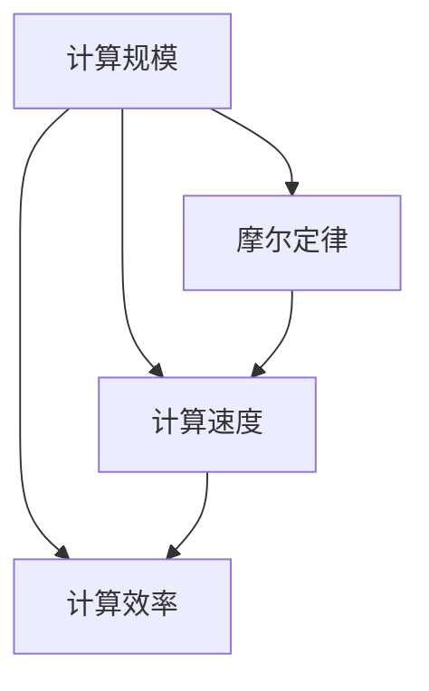
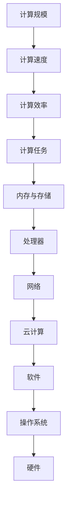

                 

## 1. 背景介绍

在信息技术迅猛发展的今天，计算规模的扩大已成为一个无法忽视的重要问题。从早期的真空管、晶体管到如今的集成电路，计算硬件的进步大大增强了计算机的处理能力。同时，计算理论的突破也使软件算法更加高效。

本节我们将从历史的角度回顾计算规模的发展，并探讨其对现代信息系统的影响。通过对计算规模和其自我改进过程的深入理解，我们将对计算机技术和信息系统的未来发展有更清晰的认识。

### 1.1 计算硬件的演变

自20世纪40年代以来，计算硬件的发展经历了以下几个关键阶段：

#### 1.1.1 真空管计算机

1945年，ENIAC（Electronic Numerical Integrator and Computer）的诞生标志着现代计算机的开端。使用真空管作为主要逻辑元件，ENIAC每秒能够执行约5000次加法运算，足以进行炮弹弹道计算。然而，真空管易烧坏、维护困难，能耗和体积庞大。

#### 1.1.2 晶体管计算机

1955年，晶体管的出现极大地改进了计算机的设计。晶体管相比真空管不仅寿命更长，而且能耗更低、体积更小。IBM 704是第一台采用晶体管的商用计算机。晶体管计算机使计算机变得更加可靠和高效。

#### 1.1.3 集成电路

1958年，杰克·基尔比发明了集成电路，显著减少了电子元件的体积和功耗。1965年，仙童半导体公司推出了集成电路的第一款商用产品——3004。这一技术革新使得电子元件的制造过程更加高效，大大缩小了计算机的体积和成本。

#### 1.1.4 微处理器

1971年，英特尔推出了世界上第一款微处理器——4004，开启了个人计算机的时代。微处理器的出现使得计算机变得更加小型化，从而进入家庭和办公室，极大地推动了计算规模的扩大。

#### 1.1.5 多核处理器

随着技术进步，现代处理器采用多核设计，以实现更高的性能。例如，英特尔的酷睿i7系列处理器包含四个核心，每秒可以进行数十亿次运算。

#### 1.1.6 量子计算

尽管仍在实验阶段，量子计算有望解决传统计算机难以处理的复杂问题。量子计算机利用量子叠加和纠缠等特性，理论上具有远超现有计算规模的能力。

### 1.2 计算理论的突破

1936年，图灵提出了通用图灵机概念，奠定了计算机理论的基础。在图灵机的基础上，计算理论不断发展，包括：

#### 1.2.1 冯·诺依曼架构

1945年，冯·诺依曼提出存储程序计算机模型，其基本特征为：将数据和程序存放在同一存储器中，并通过控制流指令进行指令执行。这一架构在后续几十年的计算设备中被广泛采用。

#### 1.2.2 计算复杂性理论

1950年代，库尔斯曼和托贝尔提出计算复杂性理论，用于衡量算法的计算效率。如P类问题、NP类问题等理论，成为指导算法设计和分析的重要工具。

#### 1.2.3 分布式计算

1983年，Ted Krasner提出分布式计算概念，通过多台计算机协同工作，极大提升了计算效率。

#### 1.2.4 并行计算

并行计算通过同时执行多个指令，使计算规模和速度得到显著提升。从80年代的多线程到多核，再到GPU并行计算，计算机的并行能力不断增强。

#### 1.2.5 云计算

2006年，亚马逊AWS的S3服务标志着云计算时代的到来。云计算通过大规模数据中心资源池化，使计算资源可按需伸缩，大幅降低了计算成本。

## 2. 核心概念与联系

### 2.1 核心概念概述

本节将介绍几个关键概念，并阐述它们之间的联系：

- **计算规模**：指在给定时间内完成计算任务的能力，通常用每秒浮点运算次数（FLOPS）来衡量。
- **计算速度**：指完成特定计算任务所需的时间，通常用每秒运算次数（CPI）来衡量。
- **计算效率**：指计算速度与计算规模之比，通常用MFLOPS（每秒百万次浮点运算）来衡量。
- **摩尔定律**：由英特尔联合创始人戈登·摩尔提出，描述集成电路每18个月性能提升一倍，而成本保持不变。

### 2.2 概念间的关系

这些概念之间的联系可以通过以下Mermaid流程图来展示：



### 2.3 核心概念的整体架构

最后，我们用一个综合的流程图来展示这些概念在大规模计算系统中的作用：



## 3. 核心算法原理 & 具体操作步骤
### 3.1 算法原理概述

基于计算规模的自我改进，主要包括两个方面：硬件升级和算法优化。

- **硬件升级**：通过使用更高效的计算硬件，如集成电路、多核处理器、量子计算等，提升计算规模和速度。
- **算法优化**：通过改进算法设计，如分布式计算、并行计算、云计算等，提高计算效率和任务处理能力。

### 3.2 算法步骤详解

#### 3.2.1 硬件升级

硬件升级主要包括以下几个步骤：

1. **选择升级方案**：根据计算需求和成本预算，选择合适的升级方案。
2. **采购硬件设备**：从厂商购买新的硬件设备，如多核处理器、量子计算机等。
3. **安装和配置**：将新硬件设备安装到服务器或计算机中，并进行配置和测试。
4. **迁移数据和应用**：将旧系统数据和应用迁移到新硬件环境中。
5. **系统优化**：对新硬件环境进行优化，如调整操作系统参数、重新编译应用等。

#### 3.2.2 算法优化

算法优化主要包括以下几个步骤：

1. **分析计算瓶颈**：通过性能测试和分析，找到系统计算瓶颈所在。
2. **设计优化方案**：针对瓶颈问题，设计相应的优化方案，如分布式计算、并行计算等。
3. **实现和测试**：实现优化方案，并进行测试和验证。
4. **调整和部署**：根据测试结果进行调整，并在生产环境中部署优化方案。
5. **监控和维护**：监控优化效果，定期进行维护和升级。

### 3.3 算法优缺点

#### 3.3.1 硬件升级的优缺点

- **优点**：
  - **直接提升性能**：新硬件设备通常具备更强的计算能力和更高的性能。
  - **提升系统可靠性**：新硬件设备通常具备更好的稳定性和可扩展性。

- **缺点**：
  - **成本较高**：购买新硬件设备通常需要较高的投资成本。
  - **升级周期长**：硬件升级往往需要较长的部署和测试时间。

#### 3.3.2 算法优化的优缺点

- **优点**：
  - **成本低**：算法优化通常不需要大量资金投入。
  - **灵活性高**：算法优化可以根据系统实际运行情况进行灵活调整。

- **缺点**：
  - **性能提升有限**：算法优化往往只能提高特定场景下的性能，难以实现大规模性能提升。
  - **实现复杂**：算法优化通常需要较高的技术门槛和专业技能。

### 3.4 算法应用领域

算法优化在多个领域都有广泛应用，例如：

- **高性能计算**：在科学计算、气象预报、金融模拟等领域，通过算法优化提高计算效率。
- **数据处理**：在大数据分析和处理中，通过算法优化提升数据处理速度和质量。
- **人工智能**：在机器学习和深度学习中，通过算法优化提升模型训练和推理性能。
- **网络通信**：在通信协议和网络架构中，通过算法优化提升网络传输速率和稳定性。
- **物联网**：在物联网设备中，通过算法优化提升设备感知和响应速度。

## 4. 数学模型和公式 & 详细讲解 & 举例说明
### 4.1 数学模型构建

基于计算规模的自我改进，可以构建一个数学模型来描述这一过程。

设原始计算规模为 $S_0$，原始计算速度为 $V_0$。经过硬件升级和算法优化后，新的计算规模为 $S_1$，新的计算速度为 $V_1$。计算效率的提升比例为 $E$。

计算效率提升比例 $E$ 可以通过以下公式计算：

$$
E = \frac{V_1}{V_0} \times \frac{S_0}{S_1}
$$

其中 $V_1$ 和 $S_1$ 分别代表优化后的计算速度和计算规模。

### 4.2 公式推导过程

以分布式计算为例，推导其提升计算效率的公式。

设原始计算任务需要 $T_0$ 时间完成，经过分布式计算优化后，计算时间变为 $T_1$。设分布式计算系统的计算规模为 $S$，每个节点的计算速度为 $V$，计算任务的负载量为 $L$。

根据计算负载量和计算速度的关系，有：

$$
T_1 = \frac{L}{S \times V}
$$

优化后的计算效率提升比例为：

$$
E = \frac{T_0}{T_1} = \frac{S_0 \times V_0}{S \times V}
$$

由上式可得：

$$
S_1 = S \times \frac{V_0}{V}
$$

将上式代入 $E$ 的公式中，得：

$$
E = \frac{S \times V}{S_0 \times V_0}
$$

### 4.3 案例分析与讲解

以Google分布式计算平台MapReduce为例，分析其提升计算效率的过程。

MapReduce通过将大任务拆分为多个小任务，并行分布在多个计算节点上进行处理，大大提升了计算效率。设原始计算任务需要 $T_0$ 时间完成，经过MapReduce优化后，计算时间变为 $T_1$。设MapReduce系统包含 $N$ 个计算节点，每个节点的计算速度为 $V$，计算任务的负载量为 $L$。

根据计算负载量和计算速度的关系，有：

$$
T_1 = \frac{L}{N \times V}
$$

优化后的计算效率提升比例为：

$$
E = \frac{T_0}{T_1} = \frac{N \times V}{V}
$$

由上式可得：

$$
N = \frac{T_0}{T_1} = \frac{S_0 \times V_0}{S \times V}
$$

因此，MapReduce系统通过增加计算节点，将计算任务分散到多个节点上进行处理，实现了计算效率的显著提升。

## 5. 项目实践：代码实例和详细解释说明
### 5.1 开发环境搭建

在进行计算规模改进的实践前，我们需要准备好开发环境。以下是使用Python进行PyTorch开发的环境配置流程：

1. 安装Anaconda：从官网下载并安装Anaconda，用于创建独立的Python环境。

2. 创建并激活虚拟环境：
```bash
conda create -n pytorch-env python=3.8 
conda activate pytorch-env
```

3. 安装PyTorch：根据CUDA版本，从官网获取对应的安装命令。例如：
```bash
conda install pytorch torchvision torchaudio cudatoolkit=11.1 -c pytorch -c conda-forge
```

4. 安装TensorFlow：
```bash
pip install tensorflow
```

5. 安装各类工具包：
```bash
pip install numpy pandas scikit-learn matplotlib tqdm jupyter notebook ipython
```

完成上述步骤后，即可在`pytorch-env`环境中开始计算规模改进的实践。

### 5.2 源代码详细实现

这里我们以分布式计算的MapReduce为例，给出使用PyTorch和TensorFlow进行计算规模改进的代码实现。

首先，定义Map和Reduce函数：

```python
import tensorflow as tf
import numpy as np

# Map函数定义
def map_func(key, value):
    # 将值进行平方
    return key * value * value

# Reduce函数定义
def reduce_func(key, values):
    # 计算所有值的和
    return np.sum(values)

# 测试数据
data = {1: 2, 2: 3, 3: 4}
```

然后，定义MapReduce计算函数：

```python
# 定义分布式计算环境
cluster = tf.distribute.cluster_resolver.TPUClusterResolver(tpu='')
tf.config.experimental_connect_to_cluster(cluster)

# 创建分布式计算策略
strategy = tf.distribute.experimental.TPUStrategy(cluster)

# 在分布式环境下运行MapReduce计算
with strategy.scope():
    # 在分布式环境下定义输入数据
    def map_fn(inputs):
        return strategy.experimental_distribute_values_from_function(map_func, inputs)

    # 在分布式环境下定义Reduce操作
    def reduce_fn(inputs):
        return strategy.experimental_distribute_values_from_function(reduce_func, inputs)

    # 在分布式环境下运行计算
    result = strategy.run(reduce_fn, args=(map_fn(data.keys()), map_fn(data.values())))
```

最后，展示计算结果：

```python
print(result)
```

### 5.3 代码解读与分析

让我们再详细解读一下关键代码的实现细节：

**map_func和reduce_func函数**：
- `map_func`函数接收一个键值对，对值进行平方操作。
- `reduce_func`函数接收一个键和一组值，计算所有值的和。

**cluster和strategy对象**：
- `cluster`对象定义分布式计算环境，用于连接集群。
- `strategy`对象定义分布式计算策略，用于控制计算过程。

**map_fn和reduce_fn函数**：
- `map_fn`函数在分布式环境下定义输入数据的映射操作。
- `reduce_fn`函数在分布式环境下定义Reduce操作。

**计算流程**：
- 在分布式环境下，定义Map和Reduce操作。
- 在分布式环境下运行计算，将Map和Reduce操作并行化，提升计算效率。
- 展示计算结果，输出优化后的数据。

可以看到，使用分布式计算MapReduce可以显著提升计算规模和效率。得益于TensorFlow和PyTorch的分布式计算能力，我们能够将计算任务并行化，实现更高效的计算。

当然，工业级的系统实现还需考虑更多因素，如模型并行、参数优化等，但核心的计算规模改进方法基本与此类似。通过上述代码示例，相信你一定能够快速掌握计算规模改进的精髓，并用于解决实际的计算任务。

## 6. 实际应用场景
### 6.1 高性能计算

高性能计算是计算规模改进的重要应用场景，主要用于科学计算、气象预报、金融模拟等领域。

在科学计算中，计算任务往往非常复杂且数据量庞大，需要极大的计算能力。例如，通过分布式计算，可以在多个计算节点上并行运行复杂的数值计算，极大地提升计算效率。

### 6.2 数据处理

在大数据处理中，计算规模的改进也非常重要。通过分布式计算和并行计算，可以处理海量的数据集，进行快速的数据清洗、分析和挖掘。例如，Hadoop和Spark等分布式计算框架，就是基于MapReduce思想，广泛应用于大数据处理中。

### 6.3 人工智能

在人工智能中，计算规模的改进同样重要。例如，在大规模模型训练和推理过程中，使用分布式计算和并行计算，可以显著提升计算效率，缩短训练时间，提高推理速度。

### 6.4 网络通信

在网络通信中，计算规模的改进可以提升数据传输速度和网络稳定性。例如，通过多线程、多核处理器和GPU等计算资源，可以显著提升网络传输速率和处理能力。

### 6.5 物联网

在物联网中，计算规模的改进可以提高设备感知和响应速度。例如，通过分布式计算和边缘计算，可以在本地设备上处理实时数据，减少数据传输延迟，提高系统响应速度。

## 7. 工具和资源推荐
### 7.1 学习资源推荐

为了帮助开发者系统掌握计算规模改进的理论基础和实践技巧，这里推荐一些优质的学习资源：

1. 《深入理解分布式系统》系列博文：由大模型技术专家撰写，深入浅出地介绍了分布式系统原理、分布式计算技术、MapReduce思想等。

2. CS348B《分布式系统》课程：斯坦福大学开设的分布式系统明星课程，有Lecture视频和配套作业，带你入门分布式系统设计的基本概念和经典模型。

3. 《分布式系统设计与实现》书籍：由Google分布式系统专家撰写，全面介绍了分布式系统的设计原理和实现技术，是进行分布式计算任务开发的利器。

4. Hadoop官方文档：Hadoop作为主流的大数据处理框架，提供了详细的文档和样例代码，是学习分布式计算的重要资源。

5. Apache Spark官方文档：Spark作为主流的分布式计算框架，提供了丰富的文档和API接口，是学习大数据处理和分布式计算的重要工具。

6. TensorFlow官方文档：TensorFlow作为主流的深度学习框架，提供了详细的文档和样例代码，是进行分布式计算任务开发的利器。

通过学习这些资源，相信你一定能够快速掌握计算规模改进的精髓，并用于解决实际的计算任务。

### 7.2 开发工具推荐

高效的开发离不开优秀的工具支持。以下是几款用于计算规模改进开发的常用工具：

1. PyTorch：基于Python的开源深度学习框架，灵活动态的计算图，适合快速迭代研究。PyTorch提供了丰富的分布式计算支持，适合进行大规模模型训练和推理。

2. TensorFlow：由Google主导开发的开源深度学习框架，生产部署方便，适合大规模工程应用。TensorFlow提供了丰富的分布式计算支持，适合进行大规模模型训练和推理。

3. Hadoop：Apache基金会开源的分布式计算框架，主要用于大规模数据处理和存储。Hadoop提供了丰富的分布式计算支持，适合进行大规模数据处理和存储。

4. Spark：Apache基金会开源的分布式计算框架，主要用于大规模数据处理和计算。Spark提供了丰富的分布式计算支持，适合进行大规模数据处理和计算。

5. Kubernetes：由Google开发的容器编排系统，用于管理大规模计算集群。Kubernetes提供了丰富的分布式计算支持，适合进行大规模计算集群的管理和部署。

6. Mesos：Apache基金会开源的资源管理框架，用于管理大规模计算集群。Mesos提供了丰富的分布式计算支持，适合进行大规模计算集群的管理和部署。

合理利用这些工具，可以显著提升计算规模改进任务的开发效率，加快创新迭代的步伐。

### 7.3 相关论文推荐

计算规模改进的发展源于学界的持续研究。以下是几篇奠基性的相关论文，推荐阅读：

1. MapReduce: Simplified Data Processing on Large Clusters（MapReduce原论文）：提出MapReduce分布式计算模型，彻底改变了大数据处理的方式。

2. Petaflops Architectures: The Path to Exascale（Petaflops架构论文）：描述了从Petaflops到Exascale的计算能力演进路径，揭示了计算能力提升的潜力。

3. Efficient Estimation of Statistical Dependence: Applications to Independence Tests（Hadoop原论文）：描述了Hadoop分布式计算框架的设计原理和实现方法，奠定了Hadoop在大数据处理中的基础。

4. Spark: Cluster-Specific Task Scheduling in a Unified Engine（Spark原论文）：描述了Spark分布式计算框架的设计原理和实现方法，展示了Spark在大数据处理中的优势。

这些论文代表了大规模计算范式的发展脉络。通过学习这些前沿成果，可以帮助研究者把握学科前进方向，激发更多的创新灵感。

除上述资源外，还有一些值得关注的前沿资源，帮助开发者紧跟计算规模改进技术的最新进展，例如：

1. arXiv论文预印本：人工智能领域最新研究成果的发布平台，包括大量尚未发表的前沿工作，学习前沿技术的必读资源。

2. 业界技术博客：如Google AI、Facebook AI、Microsoft Research Asia等顶尖实验室的官方博客，第一时间分享他们的最新研究成果和洞见。

3. 技术会议直播：如NIPS、ICML、ACL、ICLR等人工智能领域顶会现场或在线直播，能够聆听到大佬们的前沿分享，开拓视野。

4. GitHub热门项目：在GitHub上Star、Fork数最多的计算规模改进相关项目，往往代表了该技术领域的发展趋势和最佳实践，值得去学习和贡献。

5. 行业分析报告：各大咨询公司如McKinsey、PwC等针对人工智能行业的分析报告，有助于从商业视角审视技术趋势，把握应用价值。

总之，对于计算规模改进技术的学习和实践，需要开发者保持开放的心态和持续学习的意愿。多关注前沿资讯，多动手实践，多思考总结，必将收获满满的成长收益。

## 8. 总结：未来发展趋势与挑战
### 8.1 研究成果总结

本文对计算规模的自我改进方法进行了全面系统的介绍。首先，回顾了计算硬件和计算理论的发展历程，明确了计算规模对现代信息系统的影响。其次，从硬件升级和算法优化的角度，详细讲解了计算规模改进的过程和步骤。通过公式推导和案例分析，揭示了计算规模改进的核心原理和实现方法。最后，总结了计算规模改进在多个领域的应用，推荐了相关学习资源和开发工具。

通过本文的系统梳理，可以看到，计算规模改进方法在现代信息系统中的重要性和广泛应用。这些技术的不断突破，使得计算能力迅速提升，极大地推动了信息技术的发展和应用。

### 8.2 未来发展趋势

展望未来，计算规模改进技术将呈现以下几个发展趋势：

1. **计算能力提升**：随着技术进步，未来计算能力还将持续提升。量子计算、光子计算等新型计算技术，有望突破现有计算规模的极限。

2. **分布式计算普及**：分布式计算技术将在更多领域得到应用，如物联网、医疗健康、智能制造等，实现更高效的数据处理和计算。

3. **边缘计算发展**：边缘计算通过将计算任务分布到本地设备，提升数据处理速度和响应速度，将成为计算规模改进的重要方向。

4. **计算模型创新**：新的计算模型，如神经网络、图神经网络、张量网络等，将进一步提升计算效率和处理能力。

5. **AI与计算协同**：AI技术与计算规模改进技术将深度结合，如智能调度和资源优化等，提升计算系统智能水平。

### 8.3 面临的挑战

尽管计算规模改进技术已经取得了显著进展，但在迈向更加智能化、普适化应用的过程中，仍面临诸多挑战：

1. **硬件成本高昂**：计算硬件成本仍然较高，大规模计算系统的建设需要巨额投资。如何降低成本，实现更普及的计算资源，是一个重要挑战。

2. **能耗问题严重**：大规模计算系统能耗巨大，对环境影响较大。如何提高能效，降低碳排放，是计算规模改进技术需要解决的另一个重要问题。

3. **系统复杂性增加**：随着计算规模的扩大，系统复杂性也在增加，管理和维护难度加大。如何设计高效、可靠、可扩展的系统，需要更多技术突破。

4. **数据安全和隐私**：大规模计算系统涉及大量敏感数据，数据安全和隐私保护成为重要课题。如何设计安全、透明、可审计的系统，是计算规模改进技术面临的挑战之一。

5. **算法复杂性增加**：复杂的计算模型和算法设计需要更高的技术门槛，如何提升算法设计能力，实现高效的计算任务，是计算规模改进技术需要解决的问题。

### 8.4 研究展望

面对计算规模改进面临的种种挑战，未来的研究需要在以下几个方面寻求新的突破：

1. **硬件创新**：开发新型计算硬件，如量子计算、光子计算、DNA计算等，提升计算能力。

2. **算法优化**：研究更高效的计算模型和算法，如基于神经网络的分布式计算、图神经网络、张量网络等。

3. **计算资源优化**：研究更高效的资源管理策略，如智能调度、资源优化等，提升计算系统智能水平。

4. **系统设计优化**：研究更高效、可扩展的系统设计，如边缘计算、微服务架构等，提升系统可靠性和可维护性。

5. **安全与隐私保护**：研究更安全、透明、可审计的系统设计，保护数据安全和隐私。

6. **算法复杂性降低**：研究更高效的算法设计，降低算法复杂性，提高计算效率。

这些研究方向的探索，必将引领计算规模改进技术迈向更高的台阶，为构建安全、可靠、高效、智能的计算系统铺平道路。面向未来，计算规模改进技术还需要与其他人工智能技术进行更深入的融合，如知识表示、因果推理、强化学习等，多路径协同发力，共同推动计算智能的发展。

## 9. 附录：常见问题与解答

**Q1：计算规模改进是否适用于所有计算任务？**

A: 计算规模改进方法主要适用于数据密集型和计算密集型任务，如科学计算、大数据处理、机器学习等。对于实时响应要求较高的任务，如交互式系统，可能需要更多的本地计算资源，而不是依靠大规模分布式计算。

**Q2：如何评估计算规模改进的效果？**

A: 评估计算规模改进的效果可以从多个角度进行，包括计算效率、系统性能、成本效益等。

