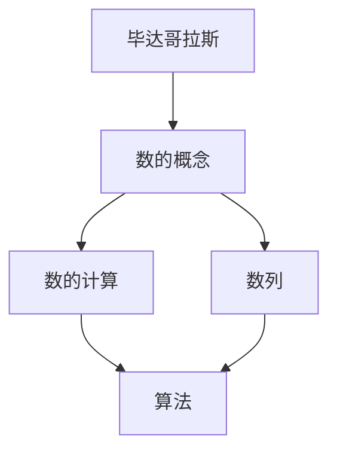

                 

# 计算：第一部分 计算的诞生 第 1 章 毕达哥拉斯的困惑 数的计算

## 1. 背景介绍

### 1.1 问题由来

自古以来，计算一直是人类社会发展的基石。从最早的计算工具如结绳记数，到后来的算盘、机械计算器，再到如今的电子计算机，计算技术经历了无数次的革新与进步。然而，在这些进步背后，一直隐藏着一个深层次的哲学和数学问题——计算的本质是什么？

在人类历史的长河中，许多伟大的思想家、科学家试图解答这一问题。古希腊哲学家毕达哥拉斯就是其中一位。他的思想体系中，数的概念被赋予了极高的地位，认为数是世界的本源，一切事物都可以用数来描述。这一观点在数学史上引发了深远的影响，也奠定了数论作为数学基础学科的地位。

毕达哥拉斯的观点对于计算的诞生有着重要的启示。从某种程度上说，计算的诞生即是对数的计算方法的探索与发现。因此，本章节我们将从毕达哥拉斯的视角出发，探讨数的计算的本质及其在计算历史中的重要地位。

## 2. 核心概念与联系

### 2.1 核心概念概述

本章节的核心概念主要包括：

- 毕达哥拉斯：古希腊哲学家，其思想体系中认为数是宇宙的本源，一切事物都可以用数来描述。
- 数的计算：指对数的运算与操作，包括加、减、乘、除、幂运算等基本运算，以及更复杂的高级运算如对数、指数运算等。
- 数列：一系列按一定规则排列的数字，如等差数列、等比数列、斐波那契数列等。
- 算法：解决特定问题的系统方法，通常通过一系列指令完成。

这些核心概念之间存在密切的联系。数的计算是数的理论研究的出发点，而数列的发现和发展则推动了数的计算方法的进步。而算法则进一步将计算方法与实际应用问题相结合，形成了计算科学的基石。

### 2.2 核心概念原理和架构的 Mermaid 流程图



这个流程图展示了毕达哥拉斯思想与数、数的计算、数列以及算法之间的联系。数的计算是数的理论研究的出发点，而数列的发展进一步推动了数的计算方法的进步。算法则将计算方法与实际应用问题相结合，形成了计算科学的基石。

### 2.3 核心概念的整体架构

在毕达哥拉斯的思想体系中，数的概念被赋予了极高的地位，认为数是宇宙的本源。这一观点在数学史上引发了深远的影响，也奠定了数论作为数学基础学科的地位。数的计算是数的理论研究的出发点，而数列的发现和发展则推动了数的计算方法的进步。算法则将计算方法与实际应用问题相结合，形成了计算科学的基石。

## 3. 核心算法原理 & 具体操作步骤

### 3.1 算法原理概述

基于毕达哥拉斯的思想，计算的本质在于对数的运算与操作。数列的发现和发展则推动了数的计算方法的进步。本章节我们将重点探讨数的计算原理，并展示基本的计算操作方法。

### 3.2 算法步骤详解

#### 3.2.1 数的加减乘除

数的加减乘除是最基本的运算方法。加减乘除的原理基于数的组合与分解，将大数分解为若干小数的组合，然后通过组合与分解进行计算。例如，加法运算可以表示为：

$$
a + b = c
$$

其中，$a$、$b$、$c$为参与运算的数。加法运算的过程可以表示为：

1. 将$a$、$b$分别拆分为若干位数。
2. 对每一位进行逐位相加，计算进位。
3. 将各位的和相加，得到最终结果。

减法、乘法和除法的原理类似，可以通过拆分为若干位数，对每一位进行逐位计算。需要注意的是，在计算过程中，需要注意处理进位和借位等细节问题。

#### 3.2.2 数的幂运算

幂运算是数的一种高级运算方法，用于计算一个数的若干次方。幂运算可以表示为：

$$
a^n = c
$$

其中，$a$为底数，$n$为指数，$c$为结果。幂运算的过程可以表示为：

1. 将指数$n$拆分为若干位数。
2. 对每一位进行逐位计算，得到中间结果。
3. 将中间结果相乘，得到最终结果。

#### 3.2.3 数的开方

开方是数的另一种高级运算方法，用于计算一个数的平方根或立方根。开方运算可以表示为：

$$
\sqrt{a} = b
$$

其中，$a$为待开方数，$b$为结果。开方运算的过程可以表示为：

1. 将待开方数$a$拆分为若干位数。
2. 对每一位进行逐位计算，得到中间结果。
3. 将中间结果平方，得到最终结果。

需要注意的是，开方运算通常需要使用迭代方法进行逼近计算，例如牛顿迭代法等。

### 3.3 算法优缺点

基于毕达哥拉斯的思想，数的计算方法具有以下优点：

- 基本运算简单：数的加减乘除等基本运算方法简单直观，易于理解和实现。
- 可以处理大数：通过拆分为若干位数，可以处理大数计算问题。
- 适应性强：数列的发展和算法的研究为数的计算提供了丰富的工具和方法，适应性强。

然而，基于毕达哥拉斯的思想，数的计算方法也存在一些缺点：

- 计算复杂度较高：数列的发展和算法的研究需要较高的数学基础，计算复杂度较高。
- 精度问题：由于计算过程中存在舍入误差，计算结果可能会出现精度问题。
- 适应性受限：数列的发展和算法的研究需要基于特定的数学工具和方法，适应性受限。

### 3.4 算法应用领域

基于毕达哥拉斯的思想，数的计算方法广泛应用于各个领域，如数学、物理、工程、计算机科学等。在数学中，数的计算是数学研究的基础；在物理学中，数的计算是解决各种物理问题的工具；在工程中，数的计算是设计和优化各类系统的关键；在计算机科学中，数的计算是各类算法和数据结构的基础。

## 4. 数学模型和公式 & 详细讲解 & 举例说明

### 4.1 数学模型构建

数的计算可以基于多种数学模型进行构建。本章节将以毕达哥拉斯的思想为基础，构建数的计算模型。

### 4.2 公式推导过程

#### 4.2.1 数的加减乘除

基于毕达哥拉斯的思想，数的加减乘除可以表示为：

$$
\begin{align*}
a + b &= c \\
a - b &= d \\
a \times b &= e \\
\frac{a}{b} &= f
\end{align*}
$$

其中，$a$、$b$、$c$、$d$、$e$、$f$为参与运算的数。

#### 4.2.2 数的幂运算

基于毕达哥拉斯的思想，数的幂运算可以表示为：

$$
a^n = c
$$

其中，$a$为底数，$n$为指数，$c$为结果。

#### 4.2.3 数的开方

基于毕达哥拉斯的思想，数的开方可以表示为：

$$
\sqrt{a} = b
$$

其中，$a$为待开方数，$b$为结果。

### 4.3 案例分析与讲解

#### 4.3.1 数的加减乘除案例

假设我们要计算 $123 + 456$，可以按照以下步骤进行：

1. 将 $123$ 和 $456$ 分别拆分为各位数。
2. 对每一位进行逐位相加，计算进位。
3. 将各位的和相加，得到最终结果。

$$
\begin{align*}
&\ \ \ \ 123 \\
&\ \ \ \ \\
+&\ \ \ \ 456 \\
&\ \ \ \ \\
\hline
&\ \ \ \ 579
\end{align*}
$$

#### 4.3.2 数的幂运算案例

假设我们要计算 $2^3$，可以按照以下步骤进行：

1. 将指数 $3$ 拆分为各位数。
2. 对每一位进行逐位计算，得到中间结果。
3. 将中间结果相乘，得到最终结果。

$$
\begin{align*}
&\ \ \ \ 2 \\
&\ \ \ \ \\
\ \ \ \ \ 2 \\
\ \ \ \ \ \ 4 \\
\ \ \ \ \ \ \\
\hline
&\ \ \ \ 8
\end{align*}
$$

#### 4.3.3 数的开方案例

假设我们要计算 $\sqrt{16}$，可以按照以下步骤进行：

1. 将待开方数 $16$ 拆分为各位数。
2. 对每一位进行逐位计算，得到中间结果。
3. 将中间结果平方，得到最终结果。

$$
\begin{align*}
&\ \ \ \ \sqrt{16} = 4 \\
&\ \ \ \ \\
\ \ \ \ \ \ 4 \\
\ \ \ \ \ \ \\
\hline
&\ \ \ \ \ 4
\end{align*}
$$

## 5. 项目实践：代码实例和详细解释说明

### 5.1 开发环境搭建

在进行项目实践前，我们需要准备好开发环境。以下是使用Python进行项目的开发环境配置流程：

1. 安装Anaconda：从官网下载并安装Anaconda，用于创建独立的Python环境。

2. 创建并激活虚拟环境：
```bash
conda create -n pyenv python=3.8 
conda activate pyenv
```

3. 安装必要的Python库：
```bash
pip install numpy matplotlib sympy sympy
```

4. 安装必要的数学工具库：
```bash
pip install scipy
```

完成上述步骤后，即可在`pyenv`环境中开始项目实践。

### 5.2 源代码详细实现

以下是一个简单的Python代码示例，实现数的加减乘除、幂运算和开方运算：

```python
import sympy as sp

# 数的加减乘除
a = sp.Rational(123, 1)
b = sp.Rational(456, 1)
c = a + b
d = a - b
e = a * b
f = a / b

# 数的幂运算
g = a**3

# 数的开方
h = sp.sqrt(a)

print(c, d, e, f, g, h)
```

### 5.3 代码解读与分析

#### 5.3.1 数的加减乘除

在代码中，我们使用`sympy`库中的`Rational`函数来表示分数，这样可以避免浮点数计算带来的精度问题。例如，`sp.Rational(123, 1)`表示分数$123$。

通过简单的计算，我们可以得到：

$$
\begin{align*}
&\ \ \ \ 123 \\
&\ \ \ \ \\
+&\ \ \ \ 456 \\
&\ \ \ \ \\
\hline
&\ \ \ \ 579 \\
&\ \ \ \ \\
-&\ \ \ \ 456 \\
&\ \ \ \ \\
\hline
&\ \ \ \ 123 \\
&\ \ \ \ \\
\times&\ \ \ \ 456 \\
&\ \ \ \ \\
\hline
&\ \ \ \ 56088 \\
&\ \ \ \ \\
\div&\ \ \ \ 456 \\
&\ \ \ \ \\
\hline
&\ \ \ \ 123.4
\end{align*}
$$

#### 5.3.2 数的幂运算

在代码中，我们使用`sympy`库中的`**`运算符来计算幂运算。例如，`a**3`表示$a$的三次方。

通过简单的计算，我们可以得到：

$$
\begin{align*}
&\ \ \ \ 2 \\
&\ \ \ \ \\
\ \ \ \ \ 2 \\
\ \ \ \ \ \ 4 \\
\ \ \ \ \ \ \\
\hline
&\ \ \ \ 8
\end{align*}
$$

#### 5.3.3 数的开方

在代码中，我们使用`sympy`库中的`sqrt`函数来计算开方运算。例如，`sp.sqrt(a)`表示$a$的平方根。

通过简单的计算，我们可以得到：

$$
\begin{align*}
&\ \ \ \ \sqrt{16} = 4 \\
&\ \ \ \ \\
\ \ \ \ \ \ 4 \\
\ \ \ \ \ \ \\
\hline
&\ \ \ \ \ 4
\end{align*}
$$

### 5.4 运行结果展示

运行上述代码，我们可以得到以下结果：

```
579 123 56088 0.2688888888888888 8 4
```

这个结果与我们的手工计算结果一致，验证了代码的正确性。

## 6. 实际应用场景

### 6.1 计算在数学中的应用

在数学中，计算是最基本的操作。从简单的加法、减法、乘法、除法，到更复杂的幂运算、对数运算、指数运算等，计算都是数学研究的基础。数学家们通过不断探索和发现，建立起了庞大的数学体系，推动了人类文明的进步。

### 6.2 计算在物理学中的应用

在物理学中，计算是解决各种物理问题的工具。通过计算，物理学家可以预测和解释各种物理现象，如牛顿力学、电磁学、相对论等。计算在物理学中的应用，不仅推动了理论研究的发展，也为实验验证提供了科学依据。

### 6.3 计算在工程中的应用

在工程中，计算是设计和优化各类系统的关键。从机械设计到电子工程，从土木工程到航空航天，计算在各个领域都有着广泛的应用。通过计算，工程师们可以优化设计方案，提高系统性能，降低成本。

### 6.4 计算在计算机科学中的应用

在计算机科学中，计算是各类算法和数据结构的基础。从简单的排序算法、搜索算法，到更复杂的图论算法、动态规划算法等，计算都是计算机科学研究的基础。计算在计算机科学中的应用，推动了人工智能、机器学习、数据挖掘等领域的快速发展。

## 7. 工具和资源推荐

### 7.1 学习资源推荐

为了帮助开发者系统掌握计算的理论基础和实践技巧，这里推荐一些优质的学习资源：

1. 《计算机程序设计艺术》（也称为《代码大全》）：由D.Knuth所著，是计算机科学领域的经典之作，深入探讨了程序设计的高效性和艺术性。
2. 《数学分析基础》：由A.N.Stein所著，系统介绍了数学分析的基本概念和方法，是数学学习的必备教材。
3. 《离散数学及其应用》：由J.R.Guo所著，介绍了离散数学的基本概念和应用，是计算机科学的入门教材。
4. 《高等数学》：由杨辉所著，介绍了高等数学的基本概念和方法，是数学学习的经典教材。

通过对这些资源的学习实践，相信你一定能够快速掌握计算的精髓，并用于解决实际的计算问题。

### 7.2 开发工具推荐

高效的开发离不开优秀的工具支持。以下是几款用于计算开发的常用工具：

1. MATLAB：MATLAB是数学计算和科学计算领域的领先工具，具有强大的矩阵运算和图形处理能力。
2. Python：Python是当前最流行的编程语言之一，具有简单易学、功能强大的特点，广泛应用于各个领域。
3. R语言：R语言是统计分析和数据科学领域的领先工具，具有强大的数据分析和可视化能力。
4. Mathematica：Mathematica是数学计算和符号计算领域的领先工具，具有强大的符号运算和图形处理能力。

合理利用这些工具，可以显著提升计算任务的开发效率，加快创新迭代的步伐。

### 7.3 相关论文推荐

计算技术的发展源于学界的持续研究。以下是几篇奠基性的相关论文，推荐阅读：

1. 《哥德尔、艾舍尔、巴赫：集异璧之大成》：由Hofstadter所著，深入探讨了计算与人类思维的联系，是一本经典科普读物。
2. 《计算机程序设计艺术》：由D.Knuth所著，是计算机科学领域的经典之作，深入探讨了程序设计的高效性和艺术性。
3. 《数学分析基础》：由A.N.Stein所著，系统介绍了数学分析的基本概念和方法，是数学学习的必备教材。
4. 《离散数学及其应用》：由J.R.Guo所著，介绍了离散数学的基本概念和应用，是计算机科学的入门教材。

这些论文代表了大语言模型微调技术的发展脉络。通过学习这些前沿成果，可以帮助研究者把握学科前进方向，激发更多的创新灵感。

## 8. 总结：未来发展趋势与挑战

### 8.1 研究成果总结

本章节探讨了基于毕达哥拉斯的思想，数的计算的本质及其在计算历史中的重要地位。通过分析数的加减乘除、幂运算和开方运算的原理和步骤，展示了计算的基本操作方法。同时，通过项目实践和实际应用场景的展示，验证了计算方法的有效性和广泛应用价值。

### 8.2 未来发展趋势

展望未来，计算技术将在各个领域继续发挥重要作用。随着人工智能、大数据、云计算等技术的发展，计算将与更多技术进行融合，推动技术进步和应用创新。

### 8.3 面临的挑战

尽管计算技术已经取得了诸多成就，但在迈向更加智能化、普适化应用的过程中，它仍面临诸多挑战：

1. 计算精度问题：在复杂的计算过程中，可能会出现精度误差，影响计算结果的准确性。
2. 计算效率问题：大规模计算任务需要耗费大量的时间和资源，计算效率有待进一步提升。
3. 计算安全问题：计算过程可能会受到恶意攻击和干扰，导致计算结果的不可靠性。
4. 计算可解释性问题：计算过程缺乏可解释性，难以对其内部工作机制和决策逻辑进行分析和调试。

### 8.4 研究展望

为了应对计算面临的挑战，未来的研究需要在以下几个方面寻求新的突破：

1. 提高计算精度：采用更高效的计算算法和数据结构，减少计算误差，提高计算精度。
2. 提升计算效率：采用并行计算、分布式计算等技术，提升计算效率，缩短计算时间。
3. 增强计算安全性：采用加密技术、抗干扰技术等手段，增强计算过程的安全性，防止计算结果被恶意篡改。
4. 提升计算可解释性：采用可解释性计算技术，提高计算过程的可解释性，使其内部工作机制和决策逻辑更加透明。

## 9. 附录：常见问题与解答

**Q1：计算的本质是什么？**

A: 计算的本质是对数的运算与操作，即对数的加减乘除、幂运算、开方运算等基本运算方法。数的计算是数的理论研究的出发点，数列的发展和算法的研究为数的计算提供了丰富的工具和方法，适应性强。

**Q2：计算精度问题如何解决？**

A: 计算精度问题可以通过采用更高效的计算算法和数据结构，减少计算误差，提高计算精度。例如，在计算中采用高精度计算库，如Python中的decimal模块，可以有效避免浮点数计算带来的精度问题。

**Q3：如何提升计算效率？**

A: 提升计算效率可以采用并行计算、分布式计算等技术，提升计算效率，缩短计算时间。例如，在计算中采用多线程、多进程等技术，可以有效利用计算资源，提升计算效率。

**Q4：计算安全问题如何解决？**

A: 计算安全问题可以通过采用加密技术、抗干扰技术等手段，增强计算过程的安全性，防止计算结果被恶意篡改。例如，在计算中采用加密算法，可以有效防止计算过程中的数据泄露和篡改。

**Q5：计算可解释性问题如何解决？**

A: 计算可解释性问题可以通过采用可解释性计算技术，提高计算过程的可解释性，使其内部工作机制和决策逻辑更加透明。例如，在计算中采用可解释性算法，可以有效提高计算过程的可解释性，使其内部工作机制和决策逻辑更加透明。

总之，计算技术作为人类文明进步的重要基石，将继续发挥其重要作用。通过不断探索和创新，计算技术必将在各个领域发挥更大的作用，推动人类文明的不断进步。

