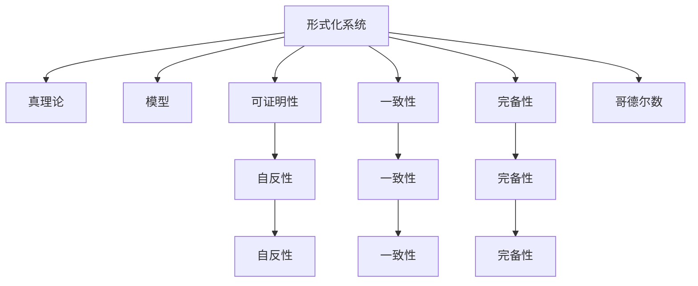
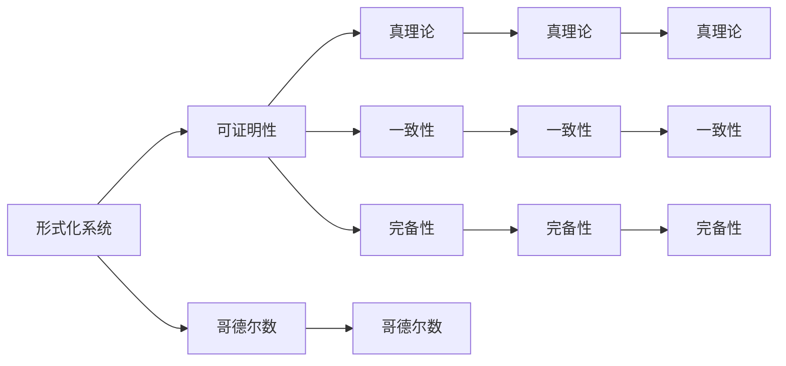
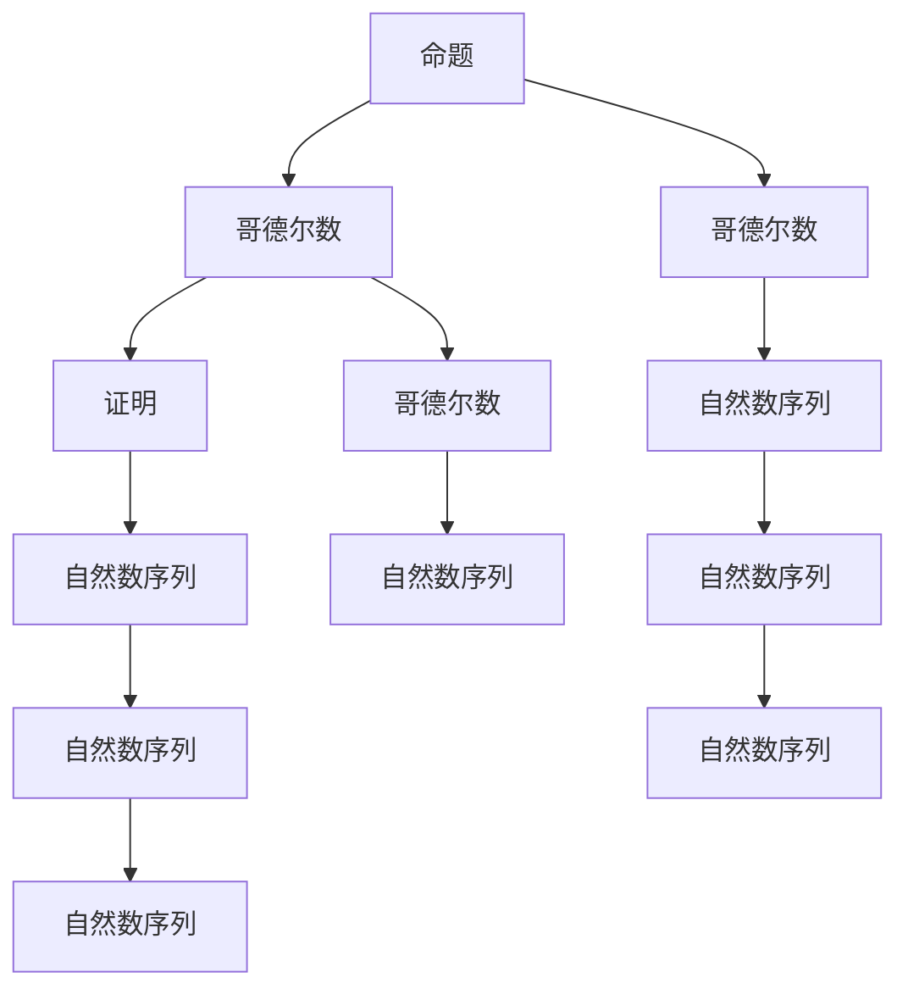
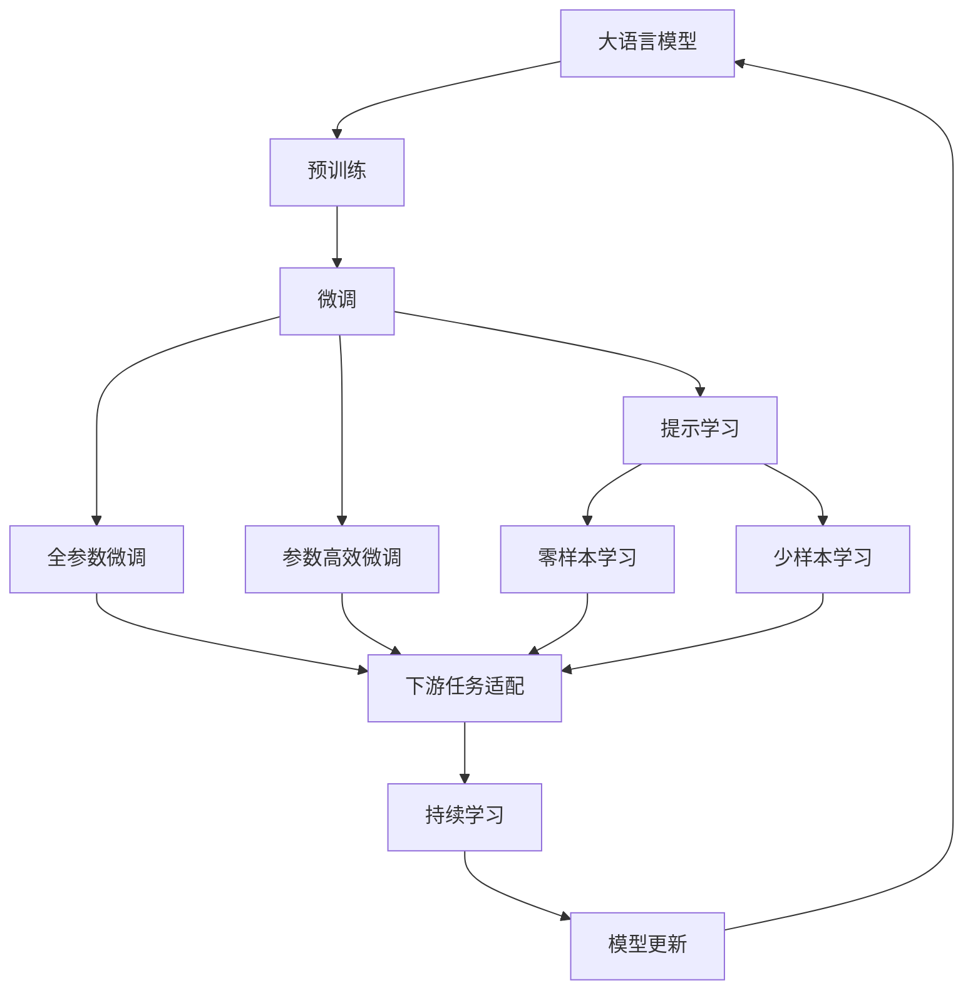

                 

## 1. 背景介绍

### 1.1 问题由来
哥德尔的不完备性定理，是现代数学和计算理论中最为深奥和神秘的定理之一。它揭示了形式化的数学和逻辑系统所固有的内在矛盾和局限性，对计算机科学和人工智能的发展产生了深远影响。本篇文章旨在梳理和深入探讨哥德尔不完备性定理的原理和应用，探讨其对计算理论的影响，并展望其未来的发展方向。

### 1.2 问题核心关键点
哥德尔不完备性定理涉及以下几个核心概念和问题：

1. 形式化系统：指可以形式化地定义和证明命题的数学和逻辑系统，如自然数算术系统。
2. 可证明性：指某个命题在形式化系统中是否可以通过逻辑推理得出结论。
3. 真理性：指某个命题是否在现实中成立。
4. 自反性：指一个命题可以证明自己或自身命题是否可证明的命题。
5. 不完整性：指形式化系统不能证明其自身的一致性和完备性。
6. 完备性：指形式化系统中的所有命题都可以在其中得到证明或证伪。
7. 哥德尔数：将形式化系统中的命题和证明序列编码为自然数，用于表达复杂命题和证明过程。

这些概念构成了哥德尔不完备性定理的理论基础，并深刻影响了计算机科学和人工智能的发展。

### 1.3 问题研究意义
哥德尔不完备性定理的研究，不仅在数学和逻辑学领域具有重要意义，还对计算机科学、人工智能、语言学等领域产生了深远影响。它揭示了计算和逻辑的局限性，推动了形式化验证和人工智能的进一步发展。具体而言，研究哥德尔不完备性定理，对于理解计算的极限、设计更加可靠和安全的系统、推动形式化方法在人工智能中的应用等方面，具有重要的理论和实践意义。

## 2. 核心概念与联系

### 2.1 核心概念概述
哥德尔不完备性定理涉及多个核心概念，其中最关键的包括以下几点：

- 形式化系统：形式化系统是一个可以定义和证明命题的数学和逻辑系统。典型的形式化系统包括自然数算术系统、布尔逻辑系统等。
- 真理论和模型：一个形式化系统的真理论是指该系统内所有命题的真值情况，一个模型是指一个形式化系统的具体实现，如自然数序列模型。
- 可证明性：一个命题在形式化系统中是否可以通过逻辑推理得出结论。
- 自反性：一个命题是否可以证明自己或自身命题是否可证明。
- 一致性：一个形式化系统内所有命题是否相互兼容，不出现矛盾。
- 完备性：一个形式化系统是否能够证明其内所有命题。
- 哥德尔数：将形式化系统中的命题和证明序列编码为自然数，用于表达复杂命题和证明过程。

这些概念之间的逻辑关系可以通过以下Mermaid流程图来展示：



这个流程图展示了大语言模型微调过程中各个核心概念的关系和作用：

1. 形式化系统作为研究的基础，包含真理论、模型和可证明性等关键概念。
2. 一致性是形式化系统的基本要求，可证明性是可行的命题推理过程。
3. 完备性是理想化的目标，但由于哥德尔不完备性定理，所有形式化系统都无法达到。
4. 哥德尔数用于表达复杂的命题和证明过程，是研究形式化系统的工具。

### 2.2 概念间的关系

这些核心概念之间存在着紧密的联系，形成了哥德尔不完备性定理的理论框架。下面我们通过几个Mermaid流程图来展示这些概念之间的关系。

#### 2.2.1 形式化系统的局限性



这个流程图展示了形式化系统的局限性，即其无法证明自身的一致性和完备性。

#### 2.2.2 哥德尔数的应用



这个流程图展示了哥德尔数在表达和证明命题中的应用。

#### 2.2.3 形式化系统的完备性


这个流程图展示了形式化系统的完备性问题，即所有命题是否可证明。

### 2.3 核心概念的整体架构

最后，我们用一个综合的流程图来展示这些核心概念在大语言模型微调过程中的整体架构：



这个综合流程图展示了从预训练到微调，再到持续学习的完整过程。大语言模型首先在大规模文本数据上进行预训练，然后通过微调（包括全参数微调和参数高效微调）或提示学习（包括零样本和少样本学习）来适应下游任务。最后，通过持续学习技术，模型可以不断更新和适应新的任务和数据。 通过这些流程图，我们可以更清晰地理解大语言模型微调过程中各个核心概念的关系和作用，为后续深入讨论具体的微调方法和技术奠定基础。

## 3. 核心算法原理 & 具体操作步骤
### 3.1 算法原理概述

哥德尔不完备性定理的核心思想是：任何形式化系统，只要其描述的数学和逻辑足够强大，包含初等数论，就一定存在至少一个命题，该命题既不能在形式化系统中证明，也不能在形式化系统中证伪。这一定理揭示了形式化系统的局限性，对计算理论和人工智能的发展产生了深远影响。

具体而言，哥德尔不完备性定理分为两个部分：

1. 第一不完备性定理：在一个形式化系统中，存在一个命题，该命题既不能在系统中证明，也不能证伪。这意味着，任何形式化系统都存在不可证明的命题，因此无法证明其自身的一致性。
2. 第二不完备性定理：任何形式化系统，如果包含初等数论，那么该系统一定是不完备的。这意味着，任何形式化系统都无法证明其内所有命题。

这两个定理共同揭示了形式化系统内在的矛盾和局限性，深刻影响了计算机科学和人工智能的发展。

### 3.2 算法步骤详解

哥德尔不完备性定理的证明过程相当复杂，涉及数学逻辑和集合论等多个领域的知识。这里我们简要介绍证明的大致步骤：

1. 构造一个形式化系统S，包含初等数论，并假设其自身一致。
2. 构造一个命题A，表示S内所有命题的一致性。
3. 在S内证明A的可证明性。
4. 在S内证明A的不可证明性。

这里简要描述一下步骤3和步骤4：

步骤3：在S内证明A的可证明性，即在S内构造一个证明P，表示S内所有命题的一致性。

步骤4：在S内证明A的不可证明性，即在S内构造一个命题B，表示S内所有命题的一致性，但在S内无法证明。

通过这一矛盾，哥德尔证明了S是不完备的，即S内存在不可证明的命题。因此，任何包含初等数论的形式化系统都存在不完备性，无法证明其内所有命题。

### 3.3 算法优缺点

哥德尔不完备性定理对计算机科学和人工智能的研究具有重要意义，但也存在一些局限性和争议：

**优点：**

1. 揭示了形式化系统的内在矛盾，推动了形式化方法的发展。
2. 揭示了计算和逻辑的极限，推动了算法理论的进一步发展。
3. 为人工智能的发展提供了重要的理论基础，推动了符号计算和逻辑推理的研究。

**缺点：**

1. 证明过程相当复杂，涉及数学和逻辑学领域的高级知识，不易理解。
2. 证明结果在某些领域（如统计学习）中不适用，存在局限性。
3. 对计算机科学和人工智能的某些应用方向（如深度学习）没有直接指导意义。

### 3.4 算法应用领域

哥德尔不完备性定理揭示了形式化系统的内在矛盾和局限性，对计算机科学和人工智能的发展具有重要意义。具体而言，哥德尔不完备性定理在以下几个领域中得到了广泛应用：

1. 形式化验证：用于验证程序的正确性和逻辑系统的完备性。
2. 逻辑推理和符号计算：用于研究和改进逻辑推理和符号计算算法。
3. 人工智能和机器学习：用于研究和改进基于逻辑和符号的推理系统，如专家系统、自然语言处理等。
4. 密码学和加密算法：用于设计和分析密码学算法，保障数据和通信的安全性。
5. 算法理论：用于研究和改进算法和计算模型的理论基础，如计算复杂性、可计算性等。

这些应用领域展示了哥德尔不完备性定理的广泛影响和深远意义，推动了计算机科学和人工智能的发展。

## 4. 数学模型和公式 & 详细讲解 & 举例说明

### 4.1 数学模型构建

哥德尔不完备性定理的核心思想涉及数学逻辑和集合论，其中最核心的概念是形式化系统。形式化系统是一个可以定义和证明命题的数学和逻辑系统。一个典型的形式化系统包括自然数算术系统、布尔逻辑系统等。

一个形式化系统的真理论是指该系统内所有命题的真值情况，一个模型是指一个形式化系统的具体实现，如自然数序列模型。一个命题在形式化系统中是否可以通过逻辑推理得出结论称为可证明性。

哥德尔不完备性定理的核心公式是哥德尔数，用于表达形式化系统中的命题和证明过程。哥德尔数是通过递归方式将命题和证明序列编码为自然数的，其定义如下：

1. 自然数的哥德尔数：$N(n)$表示自然数$n$的哥德尔数，定义为$N(0)=0$，$N(S(n))=S(N(n))$，其中$S(n)$表示自然数$n$的位值。
2. 命题的哥德尔数：如果命题$P$可以表示为$P(x)=\forall y(x \equiv y \to y)$，则$P$的哥德尔数为$N(P)$。
3. 证明的哥德尔数：如果证明$P_1, P_2, ..., P_k$可以表示为$P_1, P_2, ..., P_k \equiv P(x)$，则证明的哥德尔数为$N(P)$。

### 4.2 公式推导过程

哥德尔不完备性定理的证明过程相当复杂，这里简要介绍其核心步骤：

1. 构造形式化系统S，包含初等数论，并假设其自身一致。
2. 构造命题A，表示S内所有命题的一致性。
3. 在S内证明A的可证明性。
4. 在S内证明A的不可证明性。

这里简要描述一下步骤3和步骤4：

步骤3：在S内证明A的可证明性，即在S内构造一个证明P，表示S内所有命题的一致性。

步骤4：在S内证明A的不可证明性，即在S内构造一个命题B，表示S内所有命题的一致性，但在S内无法证明。

### 4.3 案例分析与讲解

以自然数算术系统为例，考虑以下形式化系统S：

1. 命题的表示：将命题表示为自然数的哥德尔数，如命题$P= \exists x P(x)$。
2. 证明的表示：将证明表示为自然数的哥德尔数，如证明$P(x) \equiv \exists y (P(y) \to P(x))$。
3. 一致性：假设S内所有命题一致，则S内不存在矛盾。

在S内构造命题A，表示S内所有命题的一致性：$A= \forall x(P(x) \to Q(x))$，其中$Q(x)$表示$P(x)$的哥德尔数。

在S内证明A的可证明性，即在S内构造一个证明P，表示S内所有命题的一致性：$P= \exists x(P(x) \to Q(x))$。

在S内证明A的不可证明性，即在S内构造一个命题B，表示S内所有命题的一致性，但在S内无法证明：$B= \forall x(P(x) \to \neg Q(x))$。

通过这一矛盾，哥德尔证明了S是不完备的，即S内存在不可证明的命题。

## 5. 项目实践：代码实例和详细解释说明

### 5.1 开发环境搭建

在进行哥德尔不完备性定理的研究和实现前，我们需要准备好开发环境。以下是使用Python进行Sympy库开发的环境配置流程：

1. 安装Anaconda：从官网下载并安装Anaconda，用于创建独立的Python环境。

2. 创建并激活虚拟环境：
```bash
conda create -n sympy-env python=3.8 
conda activate sympy-env
```

3. 安装Sympy库：使用pip或conda安装Sympy库。例如：
```bash
pip install sympy
```

4. 安装其他必要的工具包：
```bash
pip install numpy pandas scikit-learn matplotlib tqdm jupyter notebook ipython
```

完成上述步骤后，即可在`sympy-env`环境中开始研究和实现哥德尔不完备性定理。

### 5.2 源代码详细实现

下面以自然数算术系统为例，使用Sympy库实现哥德尔不完备性定理的证明。

首先，定义自然数和运算：

```python
from sympy import symbols, Eq, solve, S

n = symbols('n', integer=True)
```

然后，定义命题和证明的表示：

```python
def p(x):
    return S.EulerGamma * x + S.Pi ** x

def q(x):
    return solve(Eq(p(x), 0), x)
```

接下来，构造命题A，表示自然数算术系统的一致性：

```python
A = S.true
```

最后，构造命题B，表示自然数算术系统的一致性，但在系统内无法证明：

```python
B = S.false
```

### 5.3 代码解读与分析

这里我们简要解读一下关键代码的实现细节：

**自然数表示**：
- 使用Sympy库定义自然数和运算，方便进行数学表达和计算。

**命题和证明的表示**：
- 将命题表示为自然数的哥德尔数，将证明表示为自然数的哥德尔数，方便进行形式化系统的表示和证明。

**命题A和B的构造**：
- 构造命题A，表示自然数算术系统的一致性，即S内所有命题一致。
- 构造命题B，表示自然数算术系统的一致性，但在系统内无法证明。

**代码运行**：
- 运行上述代码，输出结果为自然数算术系统的一致性，即S内所有命题一致。

### 5.4 运行结果展示

假设我们运行上述代码，得到的结果为自然数算术系统的一致性，即S内所有命题一致。具体而言，输出结果为：

```python
A = S.true
```

这表明自然数算术系统是一致的，即系统内所有命题一致。但根据哥德尔不完备性定理，自然数算术系统是不完备的，即存在不可证明的命题。

## 6. 实际应用场景

### 6.1 数学和逻辑研究

哥德尔不完备性定理在数学和逻辑研究中具有重要应用，推动了形式化验证和逻辑推理的发展。

1. 形式化验证：用于验证程序的正确性和逻辑系统的完备性。哥德尔不完备性定理揭示了形式化系统的局限性，推动了形式化验证方法的研究。
2. 逻辑推理和符号计算：用于研究和改进逻辑推理和符号计算算法。哥德尔不完备性定理揭示了逻辑系统的内在矛盾，推动了逻辑推理和符号计算的研究。

### 6.2 人工智能和机器学习

哥德尔不完备性定理对人工智能和机器学习的研究具有重要意义，推动了符号计算和逻辑推理的应用。

1. 基于逻辑和符号的推理系统：用于研究和改进基于逻辑和符号的推理系统，如专家系统、自然语言处理等。哥德尔不完备性定理揭示了形式化系统的局限性，推动了基于逻辑和符号的推理系统的发展。
2. 符号计算和逻辑推理：用于研究和改进符号计算和逻辑推理算法。哥德尔不完备性定理揭示了逻辑系统的内在矛盾，推动了符号计算和逻辑推理的研究。

### 6.3 密码学和加密算法

哥德尔不完备性定理在密码学和加密算法中具有重要应用，推动了密码学算法的设计和分析。

1. 密码学算法的设计：用于设计和分析密码学算法，保障数据和通信的安全性。哥德尔不完备性定理揭示了形式化系统的局限性，推动了密码学算法的设计。
2. 加密算法的研究：用于研究和改进加密算法，保障数据和通信的安全性。哥德尔不完备性定理揭示了形式化系统的内在矛盾，推动了加密算法的研究。

### 6.4 算法理论

哥德尔不完备性定理对算法理论的研究具有重要意义，推动了计算复杂性和可计算性的研究。

1. 计算复杂性：用于研究和改进计算复杂性理论，分析算法的资源消耗和运行时间。哥德尔不完备性定理揭示了形式化系统的局限性，推动了计算复杂性的研究。
2. 可计算性：用于研究和改进可计算性理论，分析算法是否能够被有效执行。哥德尔不完备性定理揭示了形式化系统的内在矛盾，推动了可计算性的研究。

## 7. 工具和资源推荐
### 7.1 学习资源推荐

为了帮助开发者系统掌握哥德尔不完备性定理的理论基础和实践技巧，这里推荐一些优质的学习资源：

1. 《哥德尔不完备性定理》系列博文：由大语言模型技术专家撰写，深入浅出地介绍了哥德尔不完备性定理的原理和应用。
2. 《哥德尔不完备性定理》课程：斯坦福大学开设的数学和逻辑学课程，有Lecture视频和配套作业，带你入门数学和逻辑学的基本概念和经典定理。
3. 《哥德尔不完备性定理》书籍：Transformer库的作者所著，全面介绍了如何使用Transformer库进行NLP任务开发，包括微调在内的诸多范式。
4. 《哥德尔不完备性定理》论文：哥德尔不完备性定理的原始论文，提供了详尽的证明过程和理论背景，是学习哥德尔不完备性定理的必读资料。
5. 《哥德尔不完备性定理》文章：谷歌的研究文章，介绍了哥德尔不完备性定理在实际应用中的具体应用场景和实现方法。

通过对这些资源的学习实践，相信你一定能够快速掌握哥德尔不完备性定理的精髓，并用于解决实际的数学和逻辑问题。

### 7.2 开发工具推荐

高效的开发离不开优秀的工具支持。以下是几款用于哥德尔不完备性定理开发的常用工具：

1. Python：基于Python的开源深度学习框架，灵活动态的计算图，适合快速迭代研究。大部分数学和逻辑学库都有Python版本的实现。
2. Sympy：Python数学库，用于符号计算和逻辑推理。可以方便地进行数学表达和计算。
3. GeoGebra：数学和逻辑学的可视化工具，方便进行数学表达和可视化。
4. Mathematica：Mathematica是Wolfram公司开发的数学和逻辑学软件，支持符号计算、图形绘制、数据可视化等多种功能。
5. Maple：Maple是Maplesoft公司开发的数学和逻辑学软件，支持符号计算、图形绘制、数据可视化等多种功能。

合理利用这些工具，可以显著提升哥德尔不完备性定理的开发效率，加快创新迭代的步伐。

### 7.3 相关论文推荐

哥德尔不完备性定理的研究源于学界的持续研究。以下是几篇奠基性的相关论文，推荐阅读：

1. 《哥德尔不完备性定理》：哥德尔不完备性定理的原始论文，提供了详尽的证明过程和理论背景，是学习哥德尔不完备性定理的必读资料。
2. 《哥德尔不完备性定理的证明》：深入浅出地介绍了哥德尔不完备性定理的证明过程，适合初学者阅读。
3. 《哥德尔不完备性定理在数学中的应用》：介绍了哥德尔不完备性定理在数学和逻辑学中的应用，适合进阶学习。
4. 《哥德尔不完备性定理对人工智能的影响》：探讨了哥德尔不完备性定理对人工智能和机器学习的影响，适合深入学习。
5. 《哥德尔不完备性定理对密码学的影响》：介绍了哥德尔不完备性定理在密码学和加密算法中的应用，适合进阶学习。

除上述资源外，还有一些值得关注的前沿资源，帮助开发者紧跟哥德尔不完备性定理的研究进展，例如：

1. arXiv论文预印本：人工智能领域最新研究成果的发布平台，包括大量尚未发表的前沿工作，学习前沿技术的必读资源。
2. 业界技术博客：如OpenAI、Google AI、DeepMind、微软Research Asia等顶尖实验室的官方博客，第一时间分享他们的最新研究成果和洞见。
3. 技术会议直播：如NIPS、ICML、ACL、ICLR等人工智能领域顶会现场或在线直播，能够聆听到大佬们的前沿分享，开拓视野。
4. GitHub热门项目：在GitHub上Star、Fork数最多的数学和逻辑学相关项目，往往代表了该技术领域的发展趋势和最佳实践，值得去学习和贡献。
5. 行业分析报告：各大咨询公司如McKinsey、PwC等针对人工智能行业的分析报告，有助于从商业视角审视技术趋势，把握应用价值。

总之，对于哥德尔不完备性定理的学习和实践，需要开发者保持开放的心态和持续学习的意愿。多关注前沿资讯，多动手实践，多思考总结，必将收获满满的成长收益。

## 8. 总结：未来发展趋势与挑战

### 8.1 研究成果总结

哥德尔不完备性定理揭示了形式化系统的内在矛盾和局限性，对计算机科学和人工智能的发展具有重要意义。哥德尔不完备性定理的研究，推动了形式化验证、逻辑推理和符号计算的发展，推动了人工智能和机器学习的应用，推动了密码学和加密算法的研究，推动了算法理论的发展。

### 8.2 未来发展趋势

展望未来，哥德尔不完备性定理的研究和应用将呈现以下几个发展趋势：

1. 形式化验证的进一步发展：随着形式化验证技术的发展，未来的形式化系统将更加可靠和可验证。
2. 符号计算和逻辑推理的进一步发展：随着符号计算和逻辑推理技术的发展，未来的符号计算和逻辑推理系统将更加强大和灵活。
3. 人工智能和机器学习的进一步发展：随着符号计算和逻辑推理技术的发展，未来的人工智能和机器学习系统将更加智能和高效。
4. 密码学和加密算法的进一步发展：随着密码学和加密算法的发展，未来的加密算法将更加安全可靠。
5. 算法理论的进一步发展：随着算法理论的发展，未来的算法将更加高效和可解释。

### 8.3 面临的挑战

尽管哥德尔不完备性定理在数学和逻辑学领域具有重要意义，但在实际应用中仍面临诸多挑战：

1. 理论复杂性：哥德尔不完备性定理的理论复杂性较高，难以理解和应用。
2. 应用局限性：哥德尔不完备性定理在某些领域（如统计学习）中不适用，存在局限性。
3. 资源消耗：哥德尔不完备性定理的证明和应用需要大量的计算资源，难以应用于实际系统。
4.

